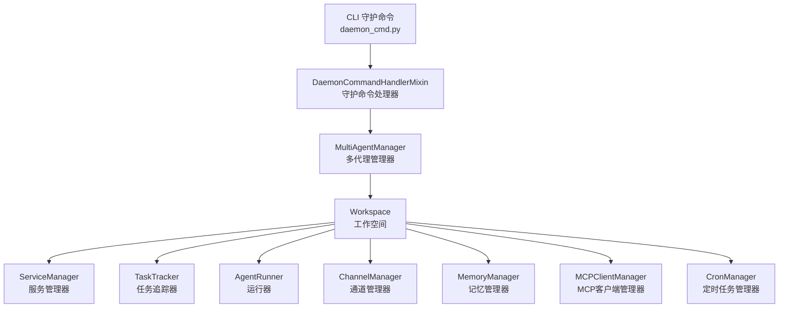
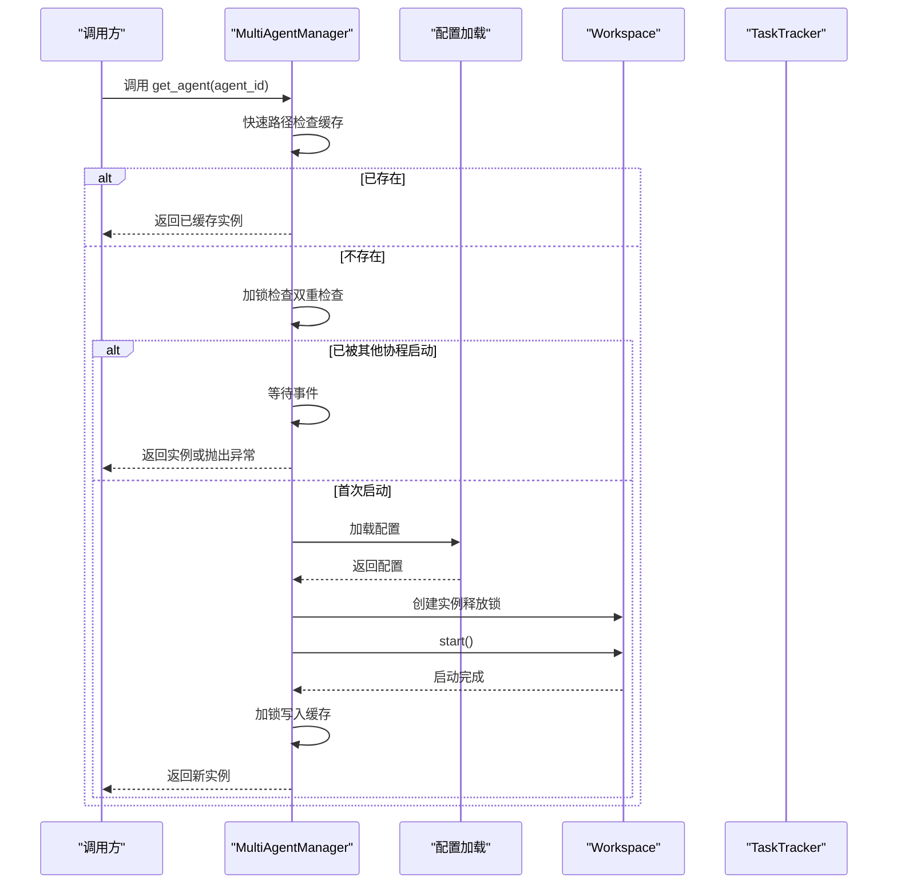
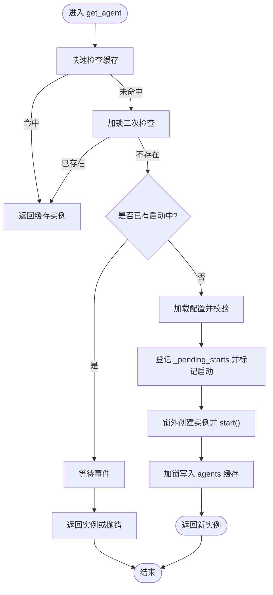
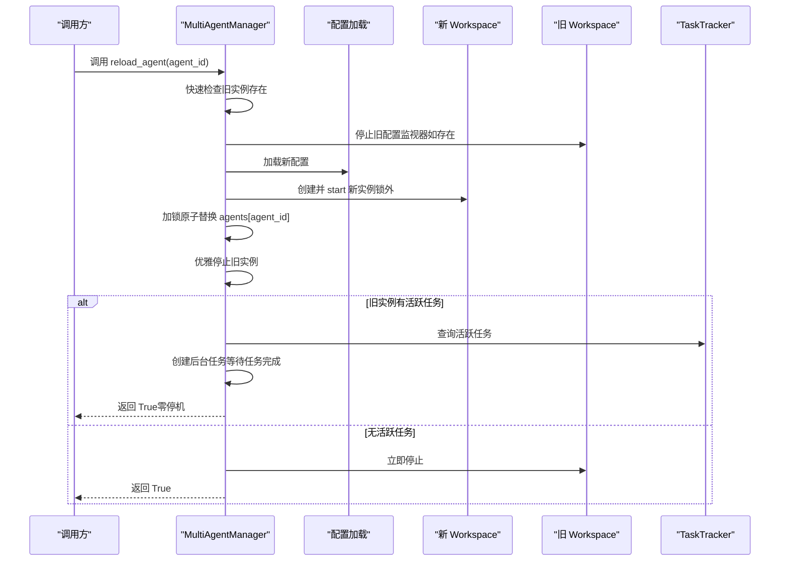
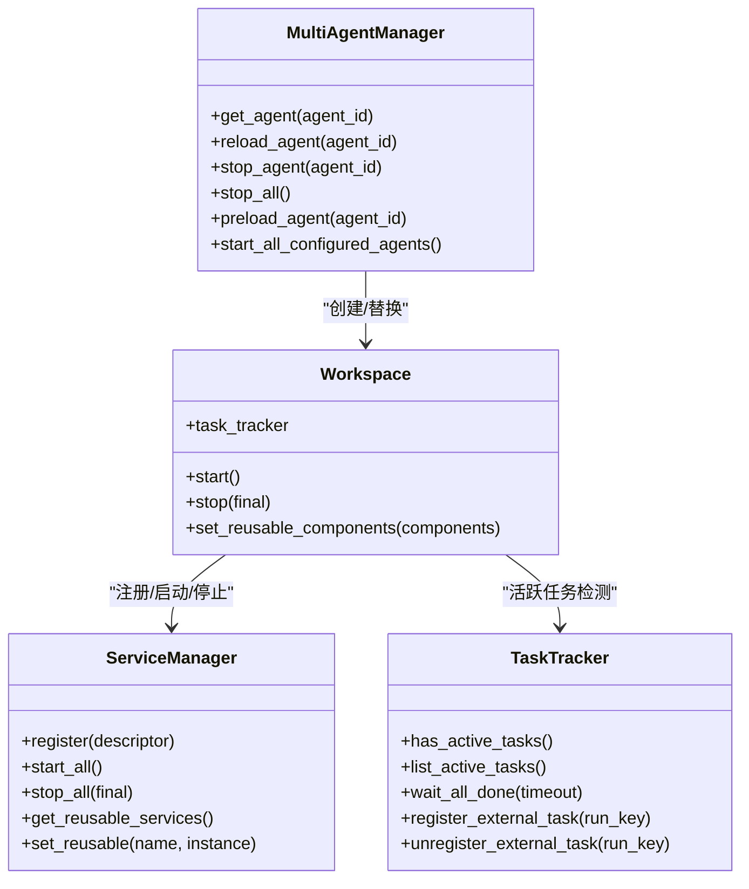

# 多代理管理器

<cite>
**本文引用的文件列表**
- [multi_agent_manager.py](file://src/qwenpaw/app/multi_agent_manager.py)
- [workspace.py](file://src/qwenpaw/app/workspace/workspace.py)
- [task_tracker.py](file://src/qwenpaw/app/runner/task_tracker.py)
- [service_manager.py](file://src/qwenpaw/app/workspace/service_manager.py)
- [daemon_commands.py](file://src/qwenpaw/app/runner/daemon_commands.py)
- [daemon_cmd.py](file://src/qwenpaw/cli/daemon_cmd.py)
- [test_reload_background_task_killed.py](file://tests/unit/app/test_reload_background_task_killed.py)
</cite>

## 目录
1. [简介](#简介)
2. [项目结构](#项目结构)
3. [核心组件](#核心组件)
4. [架构总览](#架构总览)
5. [详细组件分析](#详细组件分析)
6. [依赖关系分析](#依赖关系分析)
7. [性能考量](#性能考量)
8. [故障排查指南](#故障排查指南)
9. [结论](#结论)
10. [附录](#附录)

## 简介
本文件围绕 MultiAgentManager 的设计与实现进行系统化技术文档编写，重点覆盖以下主题：
- 懒加载机制：按需创建与启动代理工作空间，避免不必要的初始化开销
- 并发启动：通过细粒度锁与事件协调，实现多个代理同时启动且互不阻塞
- 零停机重载：在不中断正在进行的任务（如流式输出、后台任务）的前提下平滑替换代理实例
- get_agent 双重检查锁定与并发协调：避免重复启动、减少锁持有时间
- reload_agent 原子替换流程：新实例创建、旧实例优雅停止、延迟清理任务
- 生命周期管理：启动、停止、预加载、批量启动、优雅关闭
- 错误处理与资源清理：异常时的回滚、后台清理任务的取消与等待

本文件既面向初学者解释懒加载与并发启动的基本概念，也为有经验的开发者提供实现细节、性能优化建议与最佳实践。

## 项目结构
MultiAgentManager 所在的应用层模块位于 src/qwenpaw/app 下，其核心文件如下：
- multi_agent_manager.py：多代理管理器主体，包含懒加载、并发启动、零停机重载等关键逻辑
- workspace/workspace.py：单个代理工作空间封装，负责服务注册、启动、停止与可复用组件传递
- runner/task_tracker.py：任务追踪器，用于检测内部/外部活跃任务，支撑零停机重载的“延迟清理”
- workspace/service_manager.py：工作空间内服务统一管理器，支持可复用组件与依赖解析
- runner/daemon_commands.py 与 cli/daemon_cmd.py：与守护命令交互，触发配置重载与重启等操作
- tests/unit/app/test_reload_background_task_killed.py：验证零停机重载对后台任务行为的影响与修复

图表来源
- [multi_agent_manager.py:22-537](file://src/qwenpaw/app/multi_agent_manager.py#L22-L537)
- [workspace.py:38-467](file://src/qwenpaw/app/workspace/workspace.py#L38-L467)
- [task_tracker.py:37-350](file://src/qwenpaw/app/runner/task_tracker.py#L37-L350)
- [service_manager.py:76-161](file://src/qwenpaw/app/workspace/service_manager.py#L76-L161)
- [daemon_commands.py:223-268](file://src/qwenpaw/app/runner/daemon_commands.py#L223-L268)
- [daemon_cmd.py:48-89](file://src/qwenpaw/cli/daemon_cmd.py#L48-L89)

章节来源
- [multi_agent_manager.py:22-537](file://src/qwenpaw/app/multi_agent_manager.py#L22-L537)
- [workspace.py:38-467](file://src/qwenpaw/app/workspace/workspace.py#L38-L467)
- [task_tracker.py:37-350](file://src/qwenpaw/app/runner/task_tracker.py#L37-L350)
- [service_manager.py:76-161](file://src/qwenpaw/app/workspace/service_manager.py#L76-L161)
- [daemon_commands.py:223-268](file://src/qwenpaw/app/runner/daemon_commands.py#L223-L268)
- [daemon_cmd.py:48-89](file://src/qwenpaw/cli/daemon_cmd.py#L48-L89)

## 核心组件
- MultiAgentManager：集中管理多个 Workspace 实例，提供懒加载、并发启动、零停机重载、停止与批量启动能力
- Workspace：单个代理的完整运行时环境，包含 Runner、ChannelManager、MemoryManager、MCPClientManager、CronManager 等服务
- ServiceManager：声明式注册与生命周期管理所有服务，支持可复用组件与依赖排序
- TaskTracker：追踪内部/外部活跃任务，为零停机重载提供“是否需要延迟清理”的依据
- DaemonCommandHandlerMixin 与 CLI：提供 /daemon 子命令入口，触发配置重载与重启等操作

章节来源
- [multi_agent_manager.py:22-537](file://src/qwenpaw/app/multi_agent_manager.py#L22-L537)
- [workspace.py:38-467](file://src/qwenpaw/app/workspace/workspace.py#L38-L467)
- [service_manager.py:76-161](file://src/qwenpaw/app/workspace/service_manager.py#L76-L161)
- [task_tracker.py:37-350](file://src/qwenpaw/app/runner/task_tracker.py#L37-L350)
- [daemon_commands.py:223-268](file://src/qwenpaw/app/runner/daemon_commands.py#L223-L268)
- [daemon_cmd.py:48-89](file://src/qwenpaw/cli/daemon_cmd.py#L48-L89)

## 架构总览
MultiAgentManager 采用“细粒度锁 + 事件协调 + 任务追踪”的组合策略，确保：
- 懒加载：仅在首次请求时创建与启动
- 并发启动：get_agent 在锁外执行耗时初始化，锁仅用于字典更新与竞态控制
- 零停机重载：reload_agent 先创建新实例，再原子替换，最后在后台延迟清理旧实例
- 任务可见性：通过 TaskTracker 统一追踪内部/外部活跃任务，避免误判导致的提前停止

图表来源
- [multi_agent_manager.py:42-137](file://src/qwenpaw/app/multi_agent_manager.py#L42-L137)

章节来源
- [multi_agent_manager.py:42-137](file://src/qwenpaw/app/multi_agent_manager.py#L42-L137)

## 详细组件分析

### MultiAgentManager 类与方法详解
- 初始化与状态
  - agents：已加载的 Workspace 映射
  - _lock：异步锁，保护共享状态（agents、_pending_starts）
  - _pending_starts：记录正在启动中的 agent_id 与其事件，用于并发协调
  - _cleanup_tasks：后台延迟清理任务集合，用于优雅停止旧实例
- 关键方法
  - get_agent(agent_id)：懒加载与并发协调的核心
  - reload_agent(agent_id)：零停机重载
  - _graceful_stop_old_instance(old_instance, agent_id)：旧实例优雅停止与延迟清理
  - stop_agent(agent_id)、stop_all()、cancel_all_cleanup_tasks()
  - preload_agent(agent_id)、start_all_configured_agents()

#### get_agent 的双重检查锁定与并发协调
- 快速路径：未加锁检查 agents 缓存命中，直接返回
- 加锁路径：双重检查，避免重复创建；若无其他协程在启动，则验证配置并登记到 _pending_starts
- 并发等待：若已有启动中，等待事件；成功后再次检查缓存或抛出配置异常
- 启动阶段：在锁外创建 Workspace 并 start，缩短锁持有时间
- 写入缓存：加锁写入 agents，并设置事件信号，通知等待者
- 异常处理：finally 中清理 _pending_starts 并 set 事件，保证一致性

图表来源
- [multi_agent_manager.py:42-137](file://src/qwenpaw/app/multi_agent_manager.py#L42-L137)

章节来源
- [multi_agent_manager.py:42-137](file://src/qwenpaw/app/multi_agent_manager.py#L42-L137)

#### reload_agent 的原子替换与零停机流程
- 步骤概览
  1) 快速检查：确认旧实例存在
  2) 停止旧配置监视器（如存在）
  3) 加载新配置，创建并启动新实例（锁外）
  4) 原子交换：加锁替换 agents[agent_id]，最小化锁持有时间
  5) 优雅停止旧实例：根据 TaskTracker 判断是否需要延迟清理
- 延迟清理策略
  - 若存在活跃任务：创建后台任务等待任务完成（最多等待 60 秒），随后停止旧实例
  - 若无活跃任务：立即停止旧实例
  - 清理任务完成后记录日志，异常时也给出警告，不影响新实例服务

图表来源
- [multi_agent_manager.py:255-382](file://src/qwenpaw/app/multi_agent_manager.py#L255-L382)
- [task_tracker.py:86-129](file://src/qwenpaw/app/runner/task_tracker.py#L86-L129)

章节来源
- [multi_agent_manager.py:255-382](file://src/qwenpaw/app/multi_agent_manager.py#L255-L382)
- [task_tracker.py:86-129](file://src/qwenpaw/app/runner/task_tracker.py#L86-L129)

#### _graceful_stop_old_instance 的延迟清理与异常处理
- 活跃任务检测：通过 TaskTracker.has_active_tasks() 判断
- 延迟清理：创建后台任务等待任务完成（默认超时 60 秒），随后停止旧实例
- 异常处理：捕获清理过程中的异常并记录警告，不影响新实例继续服务
- 清理任务跟踪：加入 _cleanup_tasks 集合并注册回调，移除时记录取消/异常情况

章节来源
- [multi_agent_manager.py:138-234](file://src/qwenpaw/app/multi_agent_manager.py#L138-L234)
- [task_tracker.py:111-129](file://src/qwenpaw/app/runner/task_tracker.py#L111-L129)

#### Workspace 与 ServiceManager 的协作
- Workspace 负责：
  - 注册服务（Runner、MemoryManager、ContextManager、MCPClientManager、ChannelManager、CronManager 等）
  - start/stop 生命周期管理
  - set_reusable_components：在重载前将可复用组件注入新实例
- ServiceManager 负责：
  - 声明式服务描述（ServiceDescriptor），含优先级、并发初始化、依赖关系、可复用性
  - start_all/stop_all 生命周期编排
  - get_reusable_services/set_reusable 支持零停机重载的组件复用

章节来源
- [workspace.py:38-467](file://src/qwenpaw/app/workspace/workspace.py#L38-L467)
- [service_manager.py:76-161](file://src/qwenpaw/app/workspace/service_manager.py#L76-L161)

#### TaskTracker 对零停机重载的关键作用
- has_active_tasks/list_active_tasks/wait_all_done：判断与等待活跃任务
- register_external_task/unregister_external_task：对外部任务（如 AgentApp 提交的后台任务）可见性保障
- 测试验证：当外部任务未注册时会误判为空闲导致提前停止；修复后通过注册使 TaskTracker 可见，从而延迟清理

章节来源
- [task_tracker.py:86-129](file://src/qwenpaw/app/runner/task_tracker.py#L86-L129)
- [test_reload_background_task_killed.py:124-162](file://tests/unit/app/test_reload_background_task_killed.py#L124-L162)
- [test_reload_background_task_killed.py:416-467](file://tests/unit/app/test_reload_background_task_killed.py#L416-L467)

#### 守护命令与零停机重载的关系
- DaemonCommandHandlerMixin 提供 /daemon restart、reload-config 等命令
- CLI 层通过 daemon_cmd.py 将命令映射到守护命令处理器
- 这些命令可能触发配置重载或重启，间接影响 MultiAgentManager 的行为（例如 reload_agent）

章节来源
- [daemon_commands.py:223-268](file://src/qwenpaw/app/runner/daemon_commands.py#L223-L268)
- [daemon_cmd.py:48-89](file://src/qwenpaw/cli/daemon_cmd.py#L48-L89)

## 依赖关系分析
- MultiAgentManager 依赖 Workspace（创建与启动）、TaskTracker（活跃任务检测）、ServiceManager（组件复用）
- Workspace 依赖 ServiceManager 进行服务注册与生命周期管理，依赖 TaskTracker 追踪活跃任务
- 守护命令层通过 DaemonCommandHandlerMixin 与 CLI 层对接，间接影响 MultiAgentManager 的运行时行为

图表来源
- [multi_agent_manager.py:22-537](file://src/qwenpaw/app/multi_agent_manager.py#L22-L537)
- [workspace.py:38-467](file://src/qwenpaw/app/workspace/workspace.py#L38-L467)
- [service_manager.py:76-161](file://src/qwenpaw/app/workspace/service_manager.py#L76-L161)
- [task_tracker.py:37-350](file://src/qwenpaw/app/runner/task_tracker.py#L37-L350)

章节来源
- [multi_agent_manager.py:22-537](file://src/qwenpaw/app/multi_agent_manager.py#L22-L537)
- [workspace.py:38-467](file://src/qwenpaw/app/workspace/workspace.py#L38-L467)
- [service_manager.py:76-161](file://src/qwenpaw/app/workspace/service_manager.py#L76-L161)
- [task_tracker.py:37-350](file://src/qwenpaw/app/runner/task_tracker.py#L37-L350)

## 性能考量
- 懒加载与并发启动
  - get_agent 在锁外执行耗时初始化，显著降低锁竞争与阻塞时间
  - _pending_starts 与 asyncio.Event 协调并发请求，避免重复启动
- 零停机重载
  - 新实例在锁外创建与启动，替换仅在极短时间内持锁，最大化服务可用性
  - 延迟清理后台任务避免阻塞主流程
- 任务追踪
  - TaskTracker 的 has_active_tasks/list_active_tasks 为零停机提供准确依据
  - register_external_task/unregister_external_task 保证外部任务也被纳入追踪
- 批量启动
  - start_all_configured_agents 使用 asyncio.gather 并行启动，提升启动效率

章节来源
- [multi_agent_manager.py:470-531](file://src/qwenpaw/app/multi_agent_manager.py#L470-L531)
- [task_tracker.py:86-129](file://src/qwenpaw/app/runner/task_tracker.py#L86-L129)

## 故障排查指南
- get_agent 抛出配置异常
  - 症状：agent_id 不在配置 profiles 中
  - 排查：检查配置文件与 agent_id 是否正确
- 并发启动冲突
  - 症状：多个请求同时触发启动
  - 排查：确认 _pending_starts 与事件协调逻辑是否正常；查看日志中“等待事件”与“返回实例或抛错”的分支
- 零停机重载失败
  - 症状：新实例启动失败，旧实例继续服务
  - 排查：检查新实例 start() 是否抛出异常；确认异常路径是否尝试停止新实例并返回 False
- 延迟清理未完成
  - 症状：旧实例长时间未停止
  - 排查：检查 TaskTracker 的活跃任务列表与 wait_all_done 超时；确认外部任务是否正确注册/注销
- 后台清理任务异常
  - 症状：清理任务抛出异常但不影响新实例
  - 排查：查看 _cleanup_tasks 回调日志，定位异常来源

章节来源
- [multi_agent_manager.py:82-105](file://src/qwenpaw/app/multi_agent_manager.py#L82-L105)
- [multi_agent_manager.py:349-359](file://src/qwenpaw/app/multi_agent_manager.py#L349-L359)
- [multi_agent_manager.py:166-190](file://src/qwenpaw/app/multi_agent_manager.py#L166-L190)
- [task_tracker.py:111-129](file://src/qwenpaw/app/runner/task_tracker.py#L111-L129)

## 结论
MultiAgentManager 通过懒加载、细粒度锁与事件协调、任务追踪与延迟清理等机制，实现了高并发下的稳定代理管理与零停机重载。其设计兼顾了易用性与性能，适合在生产环境中长期运行。对于需要扩展功能（如自定义可复用组件、更严格的超时控制）的场景，可在现有架构基础上进行增量增强。

## 附录
- 代理生命周期管理要点
  - 预加载：preload_agent 在应用启动时提前加载，降低首请求延迟
  - 批量启动：start_all_configured_agents 并行启动启用的代理
  - 停止与关闭：stop_agent/stop_all/cancel_all_cleanup_tasks 保证资源回收
- 错误处理与资源清理
  - get_agent：异常时清理 _pending_starts 并抛出
  - reload_agent：新实例启动失败时尽力停止新实例并返回 False
  - _graceful_stop_old_instance：延迟清理任务异常时记录警告，不影响新实例
- 最佳实践
  - 在重载前尽量复用可复用组件（MemoryManager、ContextManager、ChatManager 等）
  - 对外部任务使用 register_external_task/unregister_external_task，确保 TaskTracker 可见
  - 合理设置 wait_all_done 超时，平衡等待时间与资源占用