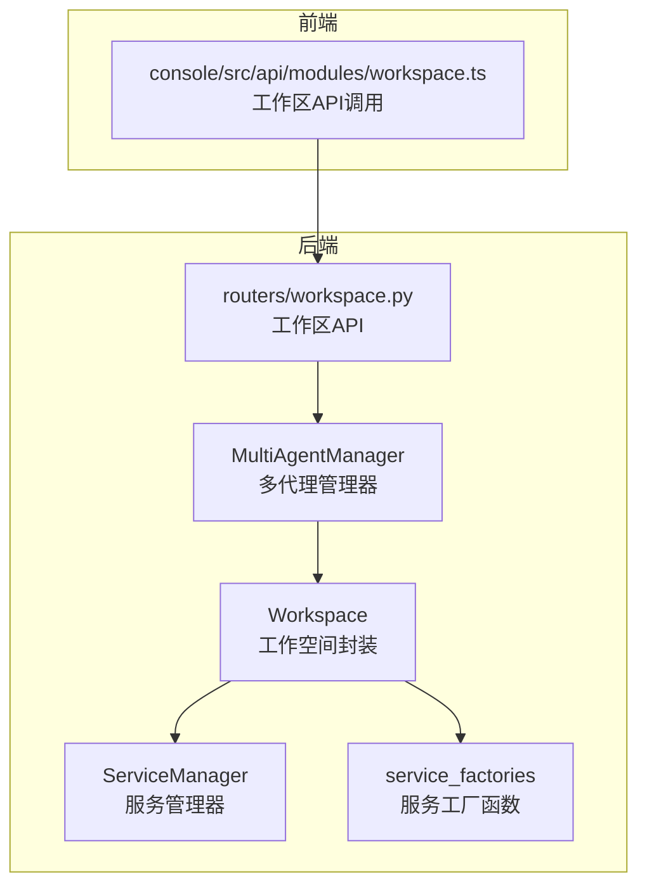
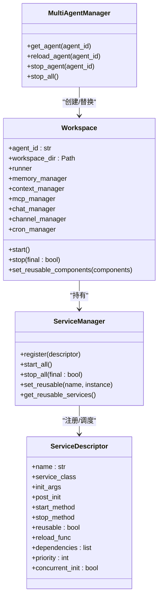
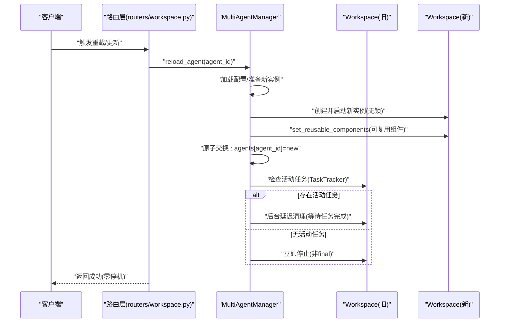
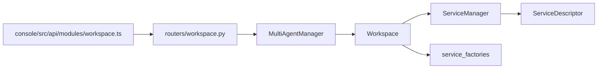

# 工作空间隔离

<cite>
**本文引用的文件**
- [src/qwenpaw/app/workspace/workspace.py](file://src/qwenpaw/app/workspace/workspace.py)
- [src/qwenpaw/app/workspace/service_manager.py](file://src/qwenpaw/app/workspace/service_manager.py)
- [src/qwenpaw/app/workspace/service_factories.py](file://src/qwenpaw/app/workspace/service_factories.py)
- [src/qwenpaw/app/multi_agent_manager.py](file://src/qwenpaw/app/multi_agent_manager.py)
- [src/qwenpaw/app/routers/workspace.py](file://src/qwenpaw/app/routers/workspace.py)
- [console/src/api/modules/workspace.ts](file://console/src/api/modules/workspace.ts)
- [tests/unit/workspace/test_workspace.py](file://tests/unit/workspace/test_workspace.py)
</cite>

## 目录
1. [引言](#引言)
2. [项目结构](#项目结构)
3. [核心组件](#核心组件)
4. [架构总览](#架构总览)
5. [详细组件分析](#详细组件分析)
6. [依赖分析](#依赖分析)
7. [性能考虑](#性能考虑)
8. [故障排查指南](#故障排查指南)
9. [结论](#结论)
10. [附录：使用示例与最佳实践](#附录使用示例与最佳实践)

## 引言
本文件围绕“工作空间隔离”主题，系统阐述 Workspace 类的设计理念、实现原理与运行机制，重点覆盖以下方面：
- 工作空间的独立性保证与资源隔离策略
- 服务注册、生命周期管理与热重载/零停机更新
- 多代理管理器（MultiAgentManager）与工作空间的交互关系
- 文件系统与运行时隔离的落地方式
- 面向初学者的概念解释与面向高级用户的扩展指南

通过架构图、序列图与流程图，帮助不同背景读者快速理解并正确使用该机制。

## 项目结构
工作空间隔离相关的核心代码位于后端 Python 模块与前端控制台 API 之间，形成“服务声明式注册 + 生命周期编排 + 热重载原子替换”的闭环。

图表来源
- [src/qwenpaw/app/workspace/workspace.py:38-467](file://src/qwenpaw/app/workspace/workspace.py#L38-L467)
- [src/qwenpaw/app/workspace/service_manager.py:76-453](file://src/qwenpaw/app/workspace/service_manager.py#L76-L453)
- [src/qwenpaw/app/workspace/service_factories.py:1-176](file://src/qwenpaw/app/workspace/service_factories.py#L1-L176)
- [src/qwenpaw/app/multi_agent_manager.py:22-537](file://src/qwenpaw/app/multi_agent_manager.py#L22-L537)
- [src/qwenpaw/app/routers/workspace.py:1-804](file://src/qwenpaw/app/routers/workspace.py#L1-L804)
- [console/src/api/modules/workspace.ts:1-153](file://console/src/api/modules/workspace.ts#L1-L153)

章节来源
- [src/qwenpaw/app/workspace/workspace.py:1-467](file://src/qwenpaw/app/workspace/workspace.py#L1-L467)
- [src/qwenpaw/app/workspace/service_manager.py:1-453](file://src/qwenpaw/app/workspace/service_manager.py#L1-L453)
- [src/qwenpaw/app/workspace/service_factories.py:1-176](file://src/qwenpaw/app/workspace/service_factories.py#L1-L176)
- [src/qwenpaw/app/multi_agent_manager.py:1-537](file://src/qwenpaw/app/multi_agent_manager.py#L1-L537)
- [src/qwenpaw/app/routers/workspace.py:1-804](file://src/qwenpaw/app/routers/workspace.py#L1-L804)
- [console/src/api/modules/workspace.ts:1-153](file://console/src/api/modules/workspace.ts#L1-L153)

## 核心组件
- Workspace：单个代理的完整运行时封装，包含 Runner、ChannelManager、BaseMemoryManager、MCPClientManager、CronManager 等，并通过 ServiceManager 统一注册与生命周期管理。
- ServiceManager：声明式服务描述（ServiceDescriptor），负责并发/串行初始化、依赖解析、可复用组件标记与回收、启动/停止顺序控制。
- ServiceFactories：将具体服务实例化、注入到 Runner 或其他组件，或在可复用场景下进行“复用注入”。
- MultiAgentManager：多代理的懒加载、并发启动、原子替换式热重载、延迟清理与全局停止。
- 路由层（routers/workspace.py）：提供工作区打包下载、上传合并、文件列表/读写、语言与运行配置等接口；配合前端 API 模块完成用户操作。

章节来源
- [src/qwenpaw/app/workspace/workspace.py:38-467](file://src/qwenpaw/app/workspace/workspace.py#L38-L467)
- [src/qwenpaw/app/workspace/service_manager.py:32-453](file://src/qwenpaw/app/workspace/service_manager.py#L32-L453)
- [src/qwenpaw/app/workspace/service_factories.py:1-176](file://src/qwenpaw/app/workspace/service_factories.py#L1-L176)
- [src/qwenpaw/app/multi_agent_manager.py:22-537](file://src/qwenpaw/app/multi_agent_manager.py#L22-L537)
- [src/qwenpaw/app/routers/workspace.py:1-804](file://src/qwenpaw/app/routers/workspace.py#L1-L804)
- [console/src/api/modules/workspace.ts:1-153](file://console/src/api/modules/workspace.ts#L1-L153)

## 架构总览
工作空间隔离的关键在于“每个代理一个独立的 Workspace 实例”，其内部通过 ServiceManager 对各子系统进行统一编排，确保：
- 启动顺序可控、并发初始化、串行依赖满足
- 可复用组件在热重载中被保留，避免重复创建
- 停止阶段区分“最终关闭”与“热重载跳过可复用组件”
- 多代理管理器以最小锁时间完成实例替换，实现零停机更新

图表来源
- [src/qwenpaw/app/workspace/workspace.py:38-467](file://src/qwenpaw/app/workspace/workspace.py#L38-L467)
- [src/qwenpaw/app/workspace/service_manager.py:76-453](file://src/qwenpaw/app/workspace/service_manager.py#L76-L453)
- [src/qwenpaw/app/multi_agent_manager.py:22-537](file://src/qwenpaw/app/multi_agent_manager.py#L22-L537)

## 详细组件分析

### Workspace：独立运行时与资源隔离
- 独立性保证
  - 每个 Workspace 拥有独立的 workspace_dir，所有持久化数据（聊天、任务、记忆等）均落盘到该目录，天然实现文件系统隔离。
  - 内部组件通过 ServiceManager 注册，属性访问委托至 ServiceManager.services 字典，避免直接耦合。
- 资源隔离
  - 记忆与上下文管理器后端可按配置选择，且每个 Workspace 使用独立 working_dir，避免跨实例共享状态。
  - 渠道管理器与 MCP 客户端管理器在 Workspace 层注入 Runner，确保消息处理与工具调用限定在当前实例。
- 生命周期
  - start()：加载配置、执行历史数据迁移、通过 ServiceManager 并发/串行启动服务。
  - stop(final)：根据 final 参数决定是否停止可复用组件，支持热重载场景下的“跳过可复用组件”。

章节来源
- [src/qwenpaw/app/workspace/workspace.py:51-467](file://src/qwenpaw/app/workspace/workspace.py#L51-L467)

### ServiceManager：服务注册与生命周期编排
- 声明式服务描述（ServiceDescriptor）
  - name：唯一标识
  - service_class：类或返回类的工厂
  - init_args：构造参数工厂
  - post_init：创建后的初始化钩子（可异步）
  - start_method/stop_method：启动/停止方法名
  - reusable/reload_func：可复用与复用回调
  - dependencies/priority/concurrent_init：依赖与优先级、并发策略
- 并发与顺序
  - 按 priority 分组，同组内可并发（concurrent_init=True）；不同组间串行，组间插入事件循环让步，保障服务器在后台启动期间仍可响应请求。
- 可复用组件
  - set_reusable(name, instance)：在 start_all 前标记可复用实例，触发 reload_func（如需要）。
  - get_reusable_services()：导出可转移的组件集合给新实例。

章节来源
- [src/qwenpaw/app/workspace/service_manager.py:32-453](file://src/qwenpaw/app/workspace/service_manager.py#L32-L453)

### ServiceFactories：服务装配与复用注入
- create_mcp_service：从配置初始化 MCP 客户端管理器，并注入到 Runner。
- create_chat_service：创建或复用 ChatManager，并注入到 Runner。
- create_channel_service：基于配置创建 ChannelManager，注入 Workspace 与 Runner。
- create_agent_config_watcher/create_mcp_config_watcher：条件创建配置监听器，触发热重载。

章节来源
- [src/qwenpaw/app/workspace/service_factories.py:1-176](file://src/qwenpaw/app/workspace/service_factories.py#L1-L176)

### MultiAgentManager：懒加载、并发启动与零停机热重载
- 懒加载与去重
  - get_agent(agent_id)：并发请求同一 agent_id 时，仅第一个创建实例，其余等待 Event；锁仅用于字典检查与状态变更，不阻塞慢启动。
- 并发启动
  - start_all_configured_agents()：对启用的代理并发启动，提升冷启动效率。
- 零停机热重载
  - reload_agent(agent_id)：创建并启动新实例 → 原子替换 → 延迟清理旧实例（若仍有活动任务则等待完成后再停止）。
  - 通过 TaskTracker 检测活动任务，必要时在后台定时清理，确保请求不中断。

图表来源
- [src/qwenpaw/app/multi_agent_manager.py:255-382](file://src/qwenpaw/app/multi_agent_manager.py#L255-L382)
- [src/qwenpaw/app/workspace/workspace.py:318-458](file://src/qwenpaw/app/workspace/workspace.py#L318-L458)

章节来源
- [src/qwenpaw/app/multi_agent_manager.py:22-537](file://src/qwenpaw/app/multi_agent_manager.py#L22-L537)

### 工作区API与前端交互
- 下载/上传工作区：打包整个 workspace_dir 为 zip 并流式传输；上传时进行路径合法性校验，防止路径穿越。
- 文件管理：列出/读取/写入工作区内的 Markdown 文件；支持每日记忆文件管理。
- 运行配置：获取/更新 agent 的运行配置，触发重载调度。

章节来源
- [src/qwenpaw/app/routers/workspace.py:1-804](file://src/qwenpaw/app/routers/workspace.py#L1-L804)
- [console/src/api/modules/workspace.ts:1-153](file://console/src/api/modules/workspace.ts#L1-L153)

## 依赖分析
- Workspace 依赖 ServiceManager 提供的服务注册与生命周期管理。
- ServiceManager 依赖 ServiceDescriptor 描述服务元信息，并通过工厂函数完成复杂装配。
- MultiAgentManager 依赖 Workspace 的可复用能力与 TaskTracker 的活动任务检测。
- 路由层依赖 MultiAgentManager 的重载调度与 Workspace 的工作区文件系统隔离。

图表来源
- [src/qwenpaw/app/multi_agent_manager.py:22-537](file://src/qwenpaw/app/multi_agent_manager.py#L22-L537)
- [src/qwenpaw/app/workspace/workspace.py:38-467](file://src/qwenpaw/app/workspace/workspace.py#L38-L467)
- [src/qwenpaw/app/workspace/service_manager.py:76-453](file://src/qwenpaw/app/workspace/service_manager.py#L76-L453)
- [src/qwenpaw/app/workspace/service_factories.py:1-176](file://src/qwenpaw/app/workspace/service_factories.py#L1-L176)
- [src/qwenpaw/app/routers/workspace.py:1-804](file://src/qwenpaw/app/routers/workspace.py#L1-L804)
- [console/src/api/modules/workspace.ts:1-153](file://console/src/api/modules/workspace.ts#L1-L153)

章节来源
- [src/qwenpaw/app/multi_agent_manager.py:22-537](file://src/qwenpaw/app/multi_agent_manager.py#L22-L537)
- [src/qwenpaw/app/workspace/workspace.py:38-467](file://src/qwenpaw/app/workspace/workspace.py#L38-L467)
- [src/qwenpaw/app/workspace/service_manager.py:76-453](file://src/qwenpaw/app/workspace/service_manager.py#L76-L453)
- [src/qwenpaw/app/workspace/service_factories.py:1-176](file://src/qwenpaw/app/workspace/service_factories.py#L1-L176)
- [src/qwenpaw/app/routers/workspace.py:1-804](file://src/qwenpaw/app/routers/workspace.py#L1-L804)
- [console/src/api/modules/workspace.ts:1-153](file://console/src/api/modules/workspace.ts#L1-L153)

## 性能考虑
- 并发初始化：ServiceManager 按优先级分组，同组并发启动，显著缩短冷启动时间。
- 事件让渡：组间与服务启动后让出事件循环，保证服务器在后台启动期间仍可处理请求。
- 懒加载与去重：MultiAgentManager 在并发请求同一 agent_id 时仅创建一次，减少重复开销。
- 零停机热重载：通过“新实例先启动、再原子替换、最后延迟清理”的策略，最大化服务可用性。

## 故障排查指南
- 启动失败回滚
  - Workspace.start() 在异常时会尝试 stop() 清理已部分启动的组件，避免资源泄漏。
- 停止异常容忍
  - ServiceManager.stop_all() 对每个服务的停止错误进行日志记录但不中断整体关闭流程。
- 配置监听器
  - 若配置变更未生效，检查 AgentConfigWatcher/MCPConfigWatcher 是否被正确创建与启动。
- 上传安全
  - 上传 zip 时进行路径合法性校验，若出现“包含不安全路径”错误，请确认压缩包结构与内容。

章节来源
- [src/qwenpaw/app/workspace/workspace.py:351-458](file://src/qwenpaw/app/workspace/workspace.py#L351-L458)
- [src/qwenpaw/app/workspace/service_manager.py:362-453](file://src/qwenpaw/app/workspace/service_manager.py#L362-L453)
- [src/qwenpaw/app/routers/workspace.py:659-708](file://src/qwenpaw/app/routers/workspace.py#L659-L708)

## 结论
通过 Workspace + ServiceManager + MultiAgentManager 的组合，系统实现了：
- 文件系统级隔离（独立 workspace_dir）
- 组件级隔离（Runner/Manager 独立实例）
- 生命周期与依赖的可编排化
- 零停机热重载与并发启动优化

这些设计共同构成了稳定、可扩展、可运维的工作空间隔离方案。

## 附录：使用示例与最佳实践

### 创建与启动工作空间
- 典型流程
  - 通过 MultiAgentManager.get_agent(agent_id) 获取或创建并启动 Workspace。
  - Workspace.start() 自动加载配置、迁移历史数据、并发启动服务。
- 关键点
  - 若需在热重载前复用某些组件，应在新实例 set_reusable_components 后再 start()。
  - 配置变更可通过路由层更新并触发重载调度。

章节来源
- [src/qwenpaw/app/multi_agent_manager.py:42-137](file://src/qwenpaw/app/multi_agent_manager.py#L42-L137)
- [src/qwenpaw/app/workspace/workspace.py:351-437](file://src/qwenpaw/app/workspace/workspace.py#L351-L437)

### 热重载与零停机更新
- 步骤
  - 新实例在无锁环境下创建并启动
  - 从旧实例提取可复用组件并注入新实例
  - 原子替换 agents[agent_id]
  - 检查活动任务，必要时后台延迟清理
- 最佳实践
  - 将耗时初始化放在可并发组，避免阻塞
  - 对可能被外部观察的状态变化（如渠道、定时任务）设置监听器
  - 使用 TaskTracker 确保长连接/流式任务平滑过渡

章节来源
- [src/qwenpaw/app/multi_agent_manager.py:255-382](file://src/qwenpaw/app/multi_agent_manager.py#L255-L382)

### 文件系统隔离与工作区管理
- 下载/上传
  - 下载：将整个 workspace_dir 打包为 zip 流式返回
  - 上传：校验 zip 合法性与路径安全性，合并到目标目录
- 文件管理
  - 列表/读取/写入工作区 Markdown 文件
  - 支持每日记忆文件管理与系统提示词文件列表

章节来源
- [src/qwenpaw/app/routers/workspace.py:715-804](file://src/qwenpaw/app/routers/workspace.py#L715-L804)
- [console/src/api/modules/workspace.ts:42-152](file://console/src/api/modules/workspace.ts#L42-L152)

### 单元测试参考
- Workspace 基本行为验证：创建、属性为空、repr 表示等
- 建议在自测中覆盖：
  - start()/stop() 的幂等性
  - 可复用组件的注入与复用回调
  - 热重载前后组件状态一致性

章节来源
- [tests/unit/workspace/test_workspace.py:1-97](file://tests/unit/workspace/test_workspace.py#L1-L97)