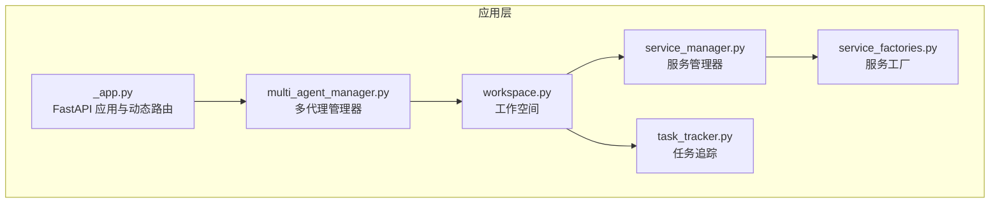
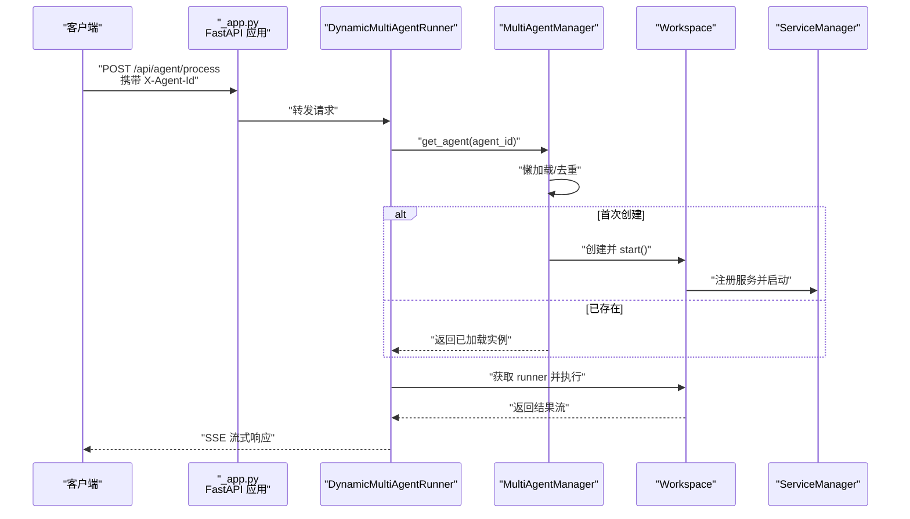
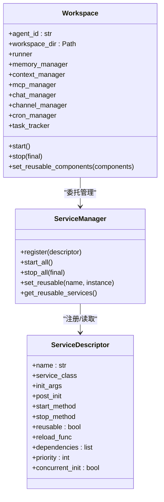
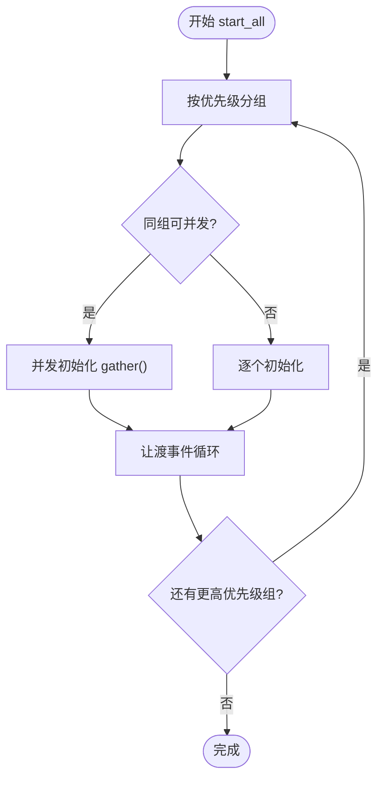
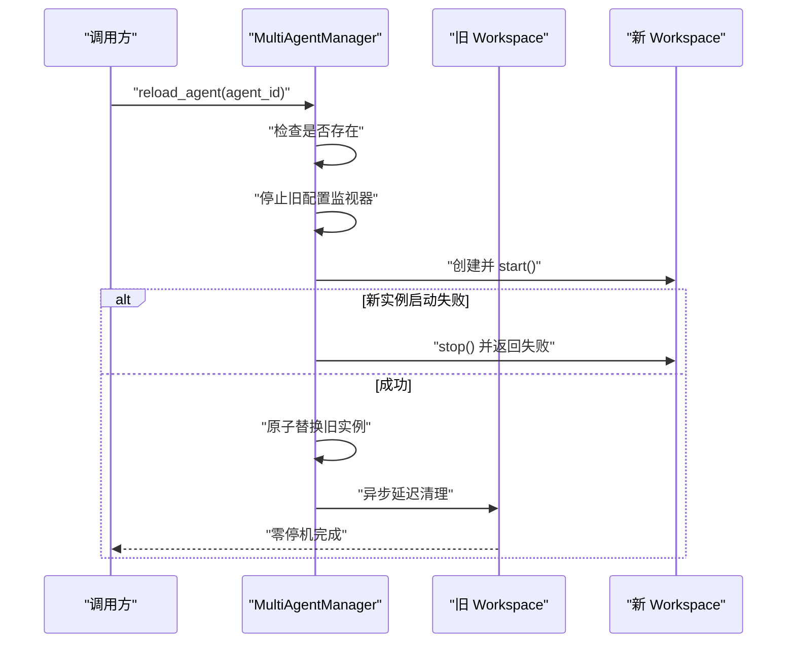
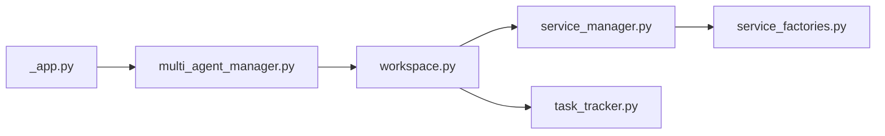

# 工作空间

<cite>
**本文引用的文件**
- [src/qwenpaw/app/workspace/workspace.py](file://src/qwenpaw/app/workspace/workspace.py)
- [src/qwenpaw/app/workspace/service_manager.py](file://src/qwenpaw/app/workspace/service_manager.py)
- [src/qwenpaw/app/workspace/service_factories.py](file://src/qwenpaw/app/workspace/service_factories.py)
- [src/qwenpaw/app/multi_agent_manager.py](file://src/qwenpaw/app/multi_agent_manager.py)
- [src/qwenpaw/app/_app.py](file://src/qwenpaw/app/_app.py)
- [src/qwenpaw/app/runner/task_tracker.py](file://src/qwenpaw/app/runner/task_tracker.py)
- [tests/unit/workspace/test_workspace.py](file://tests/unit/workspace/test_workspace.py)
- [website/public/docs/config.en.md](file://website/public/docs/config.en.md)
- [website/public/docs/quickstart.en.md](file://website/public/docs/quickstart.en.md)
</cite>

## 目录
1. [引言](#引言)
2. [项目结构](#项目结构)
3. [核心组件](#核心组件)
4. [架构总览](#架构总览)
5. [详细组件分析](#详细组件分析)
6. [依赖分析](#依赖分析)
7. [性能考虑](#性能考虑)
8. [故障排查指南](#故障排查指南)
9. [结论](#结论)
10. [附录：配置示例与最佳实践](#附录配置示例与最佳实践)

## 引言
本篇文档系统化阐述 QwenPaw 的“工作空间（Workspace）”概念：它如何将单个代理（Agent）封装为一个独立的运行时环境，包含请求处理、消息通道、记忆与上下文、MCP 工具客户端、定时任务等完整能力；以及如何通过统一的服务管理器实现组件注册、生命周期编排、可重用性与热插拔。同时给出工作空间与代理管理器之间的交互关系、零停机热重载流程、以及面向不同技术背景读者的从入门到进阶的实践建议。

## 项目结构
工作空间位于应用层的多代理运行框架中，核心文件分布如下：
- 工作空间定义与生命周期：src/qwenpaw/app/workspace/workspace.py
- 组件服务管理：src/qwenpaw/app/workspace/service_manager.py
- 服务工厂函数：src/qwenpaw/app/workspace/service_factories.py
- 多代理管理器与零停机热重载：src/qwenpaw/app/multi_agent_manager.py
- 应用入口与动态路由：src/qwenpaw/app/_app.py
- 任务追踪与外部任务可见性：src/qwenpaw/app/runner/task_tracker.py
- 配置与目录结构参考：website/public/docs/config.en.md
- 快速开始与调用示例：website/public/docs/quickstart.en.md
- 单元测试：tests/unit/workspace/test_workspace.py

图表来源
- [src/qwenpaw/app/_app.py:72-205](file://src/qwenpaw/app/_app.py#L72-L205)
- [src/qwenpaw/app/multi_agent_manager.py:22-537](file://src/qwenpaw/app/multi_agent_manager.py#L22-L537)
- [src/qwenpaw/app/workspace/workspace.py:38-467](file://src/qwenpaw/app/workspace/workspace.py#L38-L467)
- [src/qwenpaw/app/workspace/service_manager.py:76-453](file://src/qwenpaw/app/workspace/service_manager.py#L76-L453)
- [src/qwenpaw/app/workspace/service_factories.py:18-176](file://src/qwenpaw/app/workspace/service_factories.py#L18-L176)
- [src/qwenpaw/app/runner/task_tracker.py:37-350](file://src/qwenpaw/app/runner/task_tracker.py#L37-L350)

章节来源
- [src/qwenpaw/app/workspace/workspace.py:1-467](file://src/qwenpaw/app/workspace/workspace.py#L1-L467)
- [src/qwenpaw/app/workspace/service_manager.py:1-453](file://src/qwenpaw/app/workspace/service_manager.py#L1-L453)
- [src/qwenpaw/app/workspace/service_factories.py:1-176](file://src/qwenpaw/app/workspace/service_factories.py#L1-L176)
- [src/qwenpaw/app/multi_agent_manager.py:1-537](file://src/qwenpaw/app/multi_agent_manager.py#L1-L537)
- [src/qwenpaw/app/_app.py:1-719](file://src/qwenpaw/app/_app.py#L1-L719)
- [src/qwenpaw/app/runner/task_tracker.py:1-350](file://src/qwenpaw/app/runner/task_tracker.py#L1-L350)
- [website/public/docs/config.en.md:1-721](file://website/public/docs/config.en.md#L1-L721)
- [website/public/docs/quickstart.en.md:1-393](file://website/public/docs/quickstart.en.md#L1-L393)

## 核心组件
- 工作空间（Workspace）
  - 封装单个代理的完整运行时：请求处理器（Runner）、消息通道（ChannelManager）、记忆与上下文（MemoryManager/ContextManager）、MCP 客户端（MCPClientManager）、定时任务（CronManager）。
  - 通过服务描述符（ServiceDescriptor）与服务管理器（ServiceManager）进行声明式注册与生命周期编排。
  - 支持可重用组件（reusable）与热重载（hot reload），在不中断其他代理的前提下替换实例。
- 服务管理器（ServiceManager）
  - 统一注册、并发/顺序初始化、启动与停止、依赖解析、可重用组件注入与回收。
  - 提供优先级分组、并发/串行策略、事件循环让渡，保障后台启动期间仍可响应请求。
- 服务工厂（ServiceFactories）
  - 将复杂初始化逻辑拆分为可测试的工厂函数：如 MCP 初始化、聊天管理器创建与绑定、通道管理器创建与注入、配置监视器创建等。
- 多代理管理器（MultiAgentManager）
  - 懒加载、原子替换、零停机热重载、延迟清理、全局状态汇总与优雅关闭。
- 动态多代理运行器（DynamicMultiAgentRunner）
  - 基于请求头选择对应工作空间，将外部任务注册到工作空间的任务追踪器，确保重载时可感知活动任务。
- 任务追踪器（TaskTracker）
  - 记录运行中的任务、缓冲事件、支持外部任务注册/注销、等待所有任务完成、断连自动清理订阅队列。

章节来源
- [src/qwenpaw/app/workspace/workspace.py:38-467](file://src/qwenpaw/app/workspace/workspace.py#L38-L467)
- [src/qwenpaw/app/workspace/service_manager.py:76-453](file://src/qwenpaw/app/workspace/service_manager.py#L76-L453)
- [src/qwenpaw/app/workspace/service_factories.py:18-176](file://src/qwenpaw/app/workspace/service_factories.py#L18-L176)
- [src/qwenpaw/app/multi_agent_manager.py:22-537](file://src/qwenpaw/app/multi_agent_manager.py#L22-L537)
- [src/qwenpaw/app/_app.py:72-205](file://src/qwenpaw/app/_app.py#L72-L205)
- [src/qwenpaw/app/runner/task_tracker.py:37-350](file://src/qwenpaw/app/runner/task_tracker.py#L37-L350)

## 架构总览
下图展示工作空间在系统中的位置与交互关系：应用入口根据请求头动态路由到指定工作空间；工作空间内部由服务管理器统一编排各子系统；多代理管理器负责实例的懒加载、热重载与全局生命周期；任务追踪器贯穿请求生命周期，保证重载过程中的可观测与可控。

图表来源
- [src/qwenpaw/app/_app.py:88-127](file://src/qwenpaw/app/_app.py#L88-L127)
- [src/qwenpaw/app/multi_agent_manager.py:42-137](file://src/qwenpaw/app/multi_agent_manager.py#L42-L137)
- [src/qwenpaw/app/workspace/workspace.py:351-392](file://src/qwenpaw/app/workspace/workspace.py#L351-L392)

章节来源
- [src/qwenpaw/app/_app.py:72-205](file://src/qwenpaw/app/_app.py#L72-L205)
- [src/qwenpaw/app/multi_agent_manager.py:22-537](file://src/qwenpaw/app/multi_agent_manager.py#L22-L537)
- [src/qwenpaw/app/workspace/workspace.py:38-467](file://src/qwenpaw/app/workspace/workspace.py#L38-L467)

## 详细组件分析

### 工作空间（Workspace）
- 设计理念
  - 将代理运行时所需的全部子系统以“服务”的形式注册，通过服务描述符声明其初始化参数、后置钩子、启动/停止方法、是否可重用、依赖关系与优先级。
  - 保持对现有单代理组件的兼容，无需修改既有代码即可复用。
- 关键职责
  - 统一的属性访问：runner、memory_manager、context_manager、mcp_manager、chat_manager、channel_manager、cron_manager。
  - 生命周期管理：start()/stop()，迁移旧数据（微信历史兼容）、技能池预热。
  - 可重用组件设置：在启动前注入可重用的记忆、上下文、聊天管理器等，避免重复初始化。
- 服务注册要点
  - 采用优先级分组与并发/串行策略：如 Runner 先行启动，随后并发启动可并行的服务，最后串行启动需要顺序依赖的服务。
  - 后置钩子用于装配跨组件依赖（例如将 MCP 管理器注入 Runner）。
- 与任务追踪器协作
  - 在外部任务（如 AgentApp 的流式任务）进入时，先注册到 Workspace 的 TaskTracker，确保重载时能检测并等待活动任务完成。

图表来源
- [src/qwenpaw/app/workspace/workspace.py:38-467](file://src/qwenpaw/app/workspace/workspace.py#L38-L467)
- [src/qwenpaw/app/workspace/service_manager.py:32-107](file://src/qwenpaw/app/workspace/service_manager.py#L32-L107)

章节来源
- [src/qwenpaw/app/workspace/workspace.py:38-467](file://src/qwenpaw/app/workspace/workspace.py#L38-L467)
- [src/qwenpaw/app/workspace/service_manager.py:76-453](file://src/qwenpaw/app/workspace/service_manager.py#L76-L453)
- [src/qwenpaw/app/workspace/service_factories.py:18-176](file://src/qwenpaw/app/workspace/service_factories.py#L18-L176)

### 服务管理器（ServiceManager）
- 注册与描述符
  - 使用 ServiceDescriptor 描述每个服务的类、构造参数、后置钩子、启动/停止方法、可重用性、依赖与优先级。
- 启动策略
  - 按优先级分组，同优先级内可并发启动；串行服务逐个启动；在优先级组之间让渡事件循环，保证后台启动期间仍可处理请求。
- 停止策略
  - 按优先级逆序停止；可重用服务在非最终停止时跳过，避免被新实例误停。
- 可重用组件
  - 在 set_reusable 中校验可重用标记并触发 reload_func（如需要），在 stop_all 时按 final 参数决定是否真正停止。

图表来源
- [src/qwenpaw/app/workspace/service_manager.py:173-214](file://src/qwenpaw/app/workspace/service_manager.py#L173-L214)

章节来源
- [src/qwenpaw/app/workspace/service_manager.py:76-453](file://src/qwenpaw/app/workspace/service_manager.py#L76-L453)

### 服务工厂（ServiceFactories）
- 职责
  - 将复杂初始化逻辑抽取为可测试的工厂函数，降低耦合度，便于替换与扩展。
- 典型场景
  - MCP 初始化与注入 Runner。
  - 聊天管理器创建或复用并注入 Runner。
  - 通道管理器创建、注入 Workspace 与 Runner。
  - 配置监视器创建（基于条件，如存在通道或定时任务）。

章节来源
- [src/qwenpaw/app/workspace/service_factories.py:18-176](file://src/qwenpaw/app/workspace/service_factories.py#L18-L176)

### 多代理管理器（MultiAgentManager）
- 懒加载与去重
  - get_agent(agent_id) 支持并发调用去重：首个调用创建并启动实例，其余等待事件信号。
- 零停机热重载
  - 创建新实例并完全启动后，原子替换旧实例；若旧实例仍有活动任务，则延迟清理并在任务完成后停止，否则立即停止。
  - 在替换前后分别停止旧的配置监视器，避免互相干扰。
- 并发启动
  - start_all_configured_agents 并发启动所有启用的代理，释放锁的时间窗口用于慢启动阶段，提升整体启动效率。
- 全局清理
  - stop_all 会取消待执行的延迟清理任务并逐一停止所有代理。

图表来源
- [src/qwenpaw/app/multi_agent_manager.py:255-382](file://src/qwenpaw/app/multi_agent_manager.py#L255-L382)

章节来源
- [src/qwenpaw/app/multi_agent_manager.py:22-537](file://src/qwenpaw/app/multi_agent_manager.py#L22-L537)

### 动态多代理运行器（DynamicMultiAgentRunner）
- 路由策略
  - 从请求上下文中获取 agent_id，通过 MultiAgentManager 获取对应 Workspace 的 Runner。
- 外部任务追踪
  - 对外部发起的流式任务，先在 Workspace 的 TaskTracker 注册外部任务，再交由 Runner 处理；任务结束后注销，确保断连与取消的正确清理。

章节来源
- [src/qwenpaw/app/_app.py:72-205](file://src/qwenpaw/app/_app.py#L72-L205)
- [src/qwenpaw/app/runner/task_tracker.py:131-188](file://src/qwenpaw/app/runner/task_tracker.py#L131-L188)

### 任务追踪器（TaskTracker）
- 能力
  - 记录运行中的任务、缓冲事件、支持外部任务注册/注销、等待所有任务完成、断连自动清理订阅队列。
- 用途
  - 在重载过程中识别并等待活动任务，避免中断用户会话。
  - 为外部任务（如 AgentApp 的流式任务）提供统一的生命周期管理。

章节来源
- [src/qwenpaw/app/runner/task_tracker.py:37-350](file://src/qwenpaw/app/runner/task_tracker.py#L37-L350)

## 依赖分析
- 内部依赖
  - Workspace 依赖 ServiceManager 进行服务编排；ServiceManager 依赖 ServiceDescriptor 描述服务；ServiceFactories 为 Workspace 注册服务提供初始化逻辑。
  - MultiAgentManager 依赖 Workspace 进行实例管理与替换；依赖 TaskTracker 保障重载期间的可观测性。
  - DynamicMultiAgentRunner 依赖 MultiAgentManager 获取 Workspace，并与 TaskTracker 协作。
- 外部集成
  - 应用入口 FastAPI 通过中间件与路由将请求动态分发至对应 Workspace。
  - 配置系统（config.json 与 agent.json）驱动 Workspace 的初始化与运行参数。

图表来源
- [src/qwenpaw/app/_app.py:1-719](file://src/qwenpaw/app/_app.py#L1-L719)
- [src/qwenpaw/app/multi_agent_manager.py:1-537](file://src/qwenpaw/app/multi_agent_manager.py#L1-L537)
- [src/qwenpaw/app/workspace/workspace.py:1-467](file://src/qwenpaw/app/workspace/workspace.py#L1-L467)
- [src/qwenpaw/app/workspace/service_manager.py:1-453](file://src/qwenpaw/app/workspace/service_manager.py#L1-L453)
- [src/qwenpaw/app/workspace/service_factories.py:1-176](file://src/qwenpaw/app/workspace/service_factories.py#L1-L176)
- [src/qwenpaw/app/runner/task_tracker.py:1-350](file://src/qwenpaw/app/runner/task_tracker.py#L1-L350)

章节来源
- [src/qwenpaw/app/_app.py:1-719](file://src/qwenpaw/app/_app.py#L1-L719)
- [src/qwenpaw/app/multi_agent_manager.py:1-537](file://src/qwenpaw/app/multi_agent_manager.py#L1-L537)
- [src/qwenpaw/app/workspace/workspace.py:1-467](file://src/qwenpaw/app/workspace/workspace.py#L1-L467)
- [src/qwenpaw/app/workspace/service_manager.py:1-453](file://src/qwenpaw/app/workspace/service_manager.py#L1-L453)
- [src/qwenpaw/app/workspace/service_factories.py:1-176](file://src/qwenpaw/app/workspace/service_factories.py#L1-L176)
- [src/qwenpaw/app/runner/task_tracker.py:1-350](file://src/qwenpaw/app/runner/task_tracker.py#L1-L350)

## 性能考虑
- 并发启动与事件让渡
  - ServiceManager 在优先级组之间让渡事件循环，使后台启动期间仍可处理请求，缩短首包时间。
- 懒加载与去重
  - MultiAgentManager 的 get_agent 支持并发去重，避免重复创建与初始化。
- 可重用组件
  - 通过 set_reusable 减少重复初始化成本，尤其适用于内存/上下文/聊天管理器等重型组件。
- 零停机热重载
  - 新实例先行启动，原子替换后延迟清理旧实例，最大化服务可用性与用户体验。

## 故障排查指南
- 启动失败
  - Workspace 在启动过程中捕获异常并回滚已启动的服务，日志记录失败原因；检查 agent.json 与配置文件路径、权限与格式。
- 重载失败
  - 若新实例启动失败，系统会尝试停止新实例并保留旧实例；检查配置变更、依赖服务可用性与网络连接。
- 活动任务阻塞
  - 若旧实例仍有活动任务导致延迟清理，可通过 TaskTracker 的等待接口确认；必要时检查外部任务是否正确注册/注销。
- 配置热更新
  - agent.json 的变更会被配置监视器检测并触发重载；若未生效，检查监视器是否成功创建与运行。

章节来源
- [src/qwenpaw/app/workspace/workspace.py:351-392](file://src/qwenpaw/app/workspace/workspace.py#L351-L392)
- [src/qwenpaw/app/multi_agent_manager.py:295-382](file://src/qwenpaw/app/multi_agent_manager.py#L295-L382)
- [src/qwenpaw/app/runner/task_tracker.py:111-129](file://src/qwenpaw/app/runner/task_tracker.py#L111-L129)

## 结论
工作空间将代理的运行时环境以“服务”的形式模块化、声明式地组织起来，配合服务管理器的优先级与并发策略、可重用组件与热重载机制，实现了高内聚、低耦合且具备零停机能力的多代理运行框架。通过多代理管理器与动态运行器的协同，系统在保证稳定性的同时兼顾了可扩展性与可维护性。

## 附录：配置示例与最佳实践
- 目录结构与环境变量
  - 默认工作目录为用户主目录下的专用目录，可通过环境变量自定义；agent.json 存放于各自工作空间目录中。
  - 参考：[配置与工作目录:16-47](file://website/public/docs/config.en.md#L16-L47)
- agent.json 字段要点
  - channels：启用的消息通道与参数。
  - mcp：MCP 客户端配置。
  - running：运行时行为、重试与速率限制、上下文与记忆配置。
  - security：工具守卫、文件守卫、技能扫描等安全策略。
  - 参考：[agent.json 字段参考:206-551](file://website/public/docs/config.en.md#L206-L551)
- 快速验证安装
  - 通过 HTTP 调用 Agent API 验证环境与模型配置是否正确。
  - 参考：[快速开始:286-300](file://website/public/docs/quickstart.en.md#L286-L300)
- 单元测试参考
  - 工作空间创建、组件在启动前为空、默认代理与短 ID 代理等测试用例。
  - 参考：[单元测试:8-97](file://tests/unit/workspace/test_workspace.py#L8-L97)

章节来源
- [website/public/docs/config.en.md:16-551](file://website/public/docs/config.en.md#L16-L551)
- [website/public/docs/quickstart.en.md:286-300](file://website/public/docs/quickstart.en.md#L286-L300)
- [tests/unit/workspace/test_workspace.py:8-97](file://tests/unit/workspace/test_workspace.py#L8-L97)