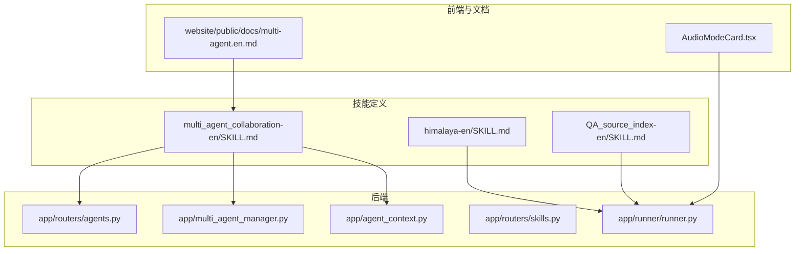
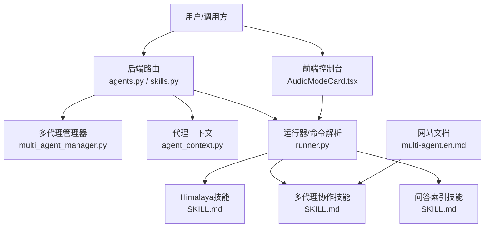
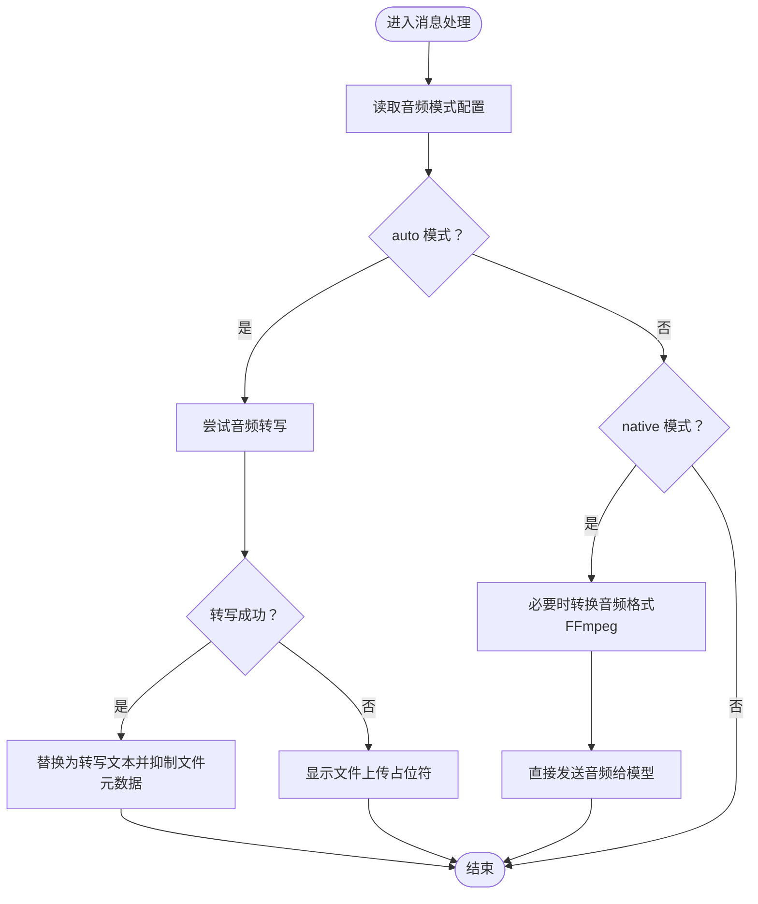
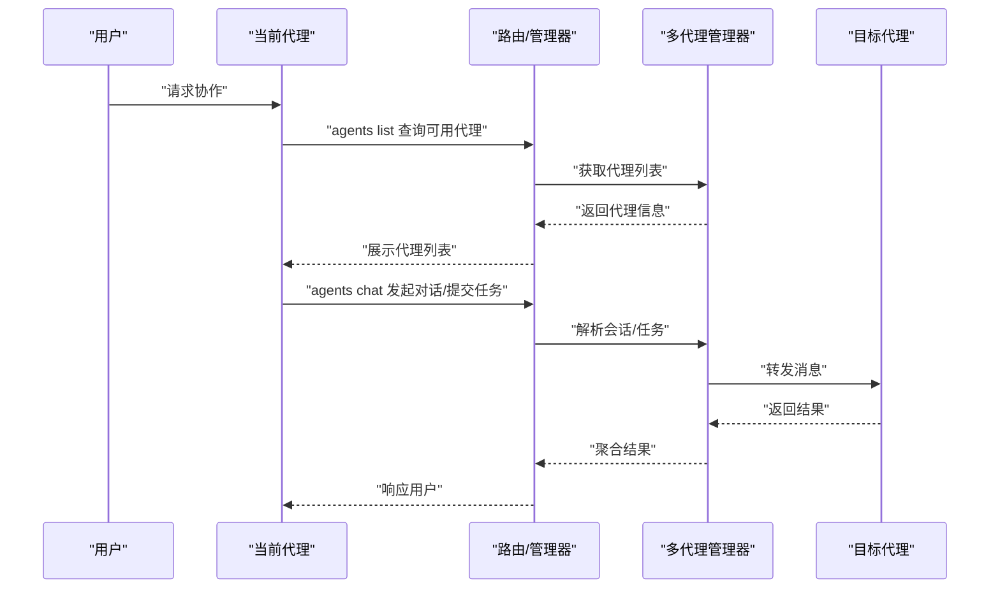
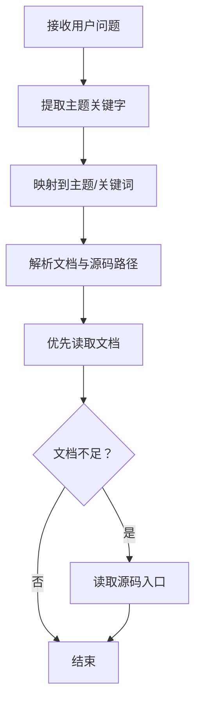
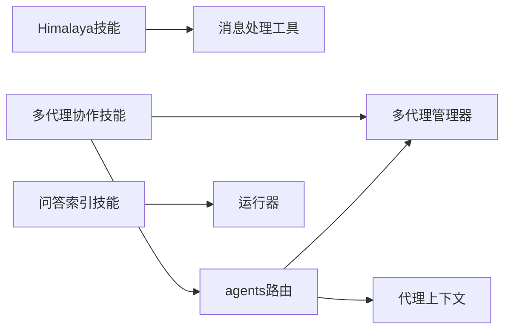

# 专用技能

<cite>
**本文引用的文件**
- [himalaya-en/SKILL.md](file://src/qwenpaw/agents/skills/himalaya-en/SKILL.md)
- [himalaya-en/references/configuration.md](file://src/qwenpaw/agents/skills/himalaya-en/references/configuration.md)
- [multi_agent_collaboration-en/SKILL.md](file://src/qwenpaw/agents/skills/multi_agent_collaboration-en/SKILL.md)
- [QA_source_index-en/SKILL.md](file://src/qwenpaw/agents/skills/QA_source_index-en/SKILL.md)
- [multi_agent_manager.py](file://src/qwenpaw/app/multi_agent_manager.py)
- [agents.py](file://src/qwenpaw/app/routers/agents.py)
- [agent_context.py](file://src/qwenpaw/app/agent_context.py)
- [runner.py](file://src/qwenpaw/app/runner/runner.py)
- [skills.py](file://src/qwenpaw/app/routers/skills.py)
- [message_processing.py](file://src/qwenpaw/agents/utils/message_processing.py)
- [AudioModeCard.tsx](file://console/src/pages/Settings/VoiceTranscription/components/AudioModeCard.tsx)
- [multi-agent.en.md](file://website/public/docs/multi-agent.en.md)
</cite>

## 目录
1. [简介](#简介)
2. [项目结构](#项目结构)
3. [核心组件](#核心组件)
4. [架构总览](#架构总览)
5. [详细组件分析](#详细组件分析)
6. [依赖分析](#依赖分析)
7. [性能考虑](#性能考虑)
8. [故障排除指南](#故障排除指南)
9. [结论](#结论)
10. [附录](#附录)

## 简介
本文件面向QwenPaw的“专用技能”，聚焦三大能力：
- Himalaya音频处理：基于系统音频转写与媒体处理能力，结合内置音频模式策略，实现对用户语音输入的自动转写与模型输入适配。
- 多代理协作：通过内置的多代理协作技能，实现跨代理的实时对话与后台任务委托，提升复杂任务的执行效率与上下文隔离性。
- 问答索引：通过“QA源索引”技能，将用户问题映射到官方文档与源码入口，辅助内置QA代理快速定位答案来源。

本文将从应用场景、技术原理、配置参数、集成方法、与其他技能的配合、性能优化与故障排除等方面进行系统阐述，并提供可视化图示帮助理解。

## 项目结构
专用技能主要由以下部分构成：
- 技能定义与文档：位于 agents/skills 下的各语言子目录，包含 SKILL.md 与参考文档。
- 运行时路由与上下文：后端路由、多代理管理器、代理上下文等。
- 前端控制台与网站文档：用于技能启用、配置与使用说明展示。
- 音频处理与转写：消息处理工具与前端音频模式组件。

**图表来源**
- [himalaya-en/SKILL.md:1-296](file://src/qwenpaw/agents/skills/himalaya-en/SKILL.md#L1-L296)
- [multi_agent_collaboration-en/SKILL.md:1-477](file://src/qwenpaw/agents/skills/multi_agent_collaboration-en/SKILL.md#L1-L477)
- [QA_source_index-en/SKILL.md:1-52](file://src/qwenpaw/agents/skills/QA_source_index-en/SKILL.md#L1-L52)
- [agents.py:103-138](file://src/qwenpaw/app/routers/agents.py#L103-L138)
- [multi_agent_manager.py:1-494](file://src/qwenpaw/app/multi_agent_manager.py#L1-L494)
- [agent_context.py:92-144](file://src/qwenpaw/app/agent_context.py#L92-L144)
- [skills.py:1450-1492](file://src/qwenpaw/app/routers/skills.py#L1450-L1492)
- [runner.py:175-245](file://src/qwenpaw/app/runner/runner.py#L175-L245)
- [AudioModeCard.tsx:51-71](file://console/src/pages/Settings/VoiceTranscription/components/AudioModeCard.tsx#L51-L71)
- [multi-agent.en.md:256-417](file://website/public/docs/multi-agent.en.md#L256-L417)

**章节来源**
- [himalaya-en/SKILL.md:1-296](file://src/qwenpaw/agents/skills/himalaya-en/SKILL.md#L1-L296)
- [multi_agent_collaboration-en/SKILL.md:1-477](file://src/qwenpaw/agents/skills/multi_agent_collaboration-en/SKILL.md#L1-L477)
- [QA_source_index-en/SKILL.md:1-52](file://src/qwenpaw/agents/skills/QA_source_index-en/SKILL.md#L1-L52)
- [agents.py:103-138](file://src/qwenpaw/app/routers/agents.py#L103-L138)
- [multi_agent_manager.py:1-494](file://src/qwenpaw/app/multi_agent_manager.py#L1-L494)
- [agent_context.py:92-144](file://src/qwenpaw/app/agent_context.py#L92-L144)
- [skills.py:1450-1492](file://src/qwenpaw/app/routers/skills.py#L1450-L1492)
- [runner.py:175-245](file://src/qwenpaw/app/runner/runner.py#L175-L245)
- [AudioModeCard.tsx:51-71](file://console/src/pages/Settings/VoiceTranscription/components/AudioModeCard.tsx#L51-L71)
- [multi-agent.en.md:256-417](file://website/public/docs/multi-agent.en.md#L256-L417)

## 核心组件
- Himalaya音频处理
  - 通过消息处理模块根据配置决定是否进行音频转写或原生发送，并在前端以音频模式卡片提示本地Whisper/FFmpeg状态。
- 多代理协作
  - 通过多代理管理器与路由接口，实现代理列表查询、实时对话与后台任务提交/轮询，支持会话复用与上下文隔离。
- 问答索引
  - 将用户问题的关键字映射到文档路径与源码入口，辅助QA代理快速定位答案来源。

**章节来源**
- [message_processing.py:232-251](file://src/qwenpaw/agents/utils/message_processing.py#L232-L251)
- [AudioModeCard.tsx:51-71](file://console/src/pages/Settings/VoiceTranscription/components/AudioModeCard.tsx#L51-L71)
- [multi_agent_manager.py:1-494](file://src/qwenpaw/app/multi_agent_manager.py#L1-L494)
- [agents.py:103-138](file://src/qwenpaw/app/routers/agents.py#L103-L138)
- [agent_context.py:92-144](file://src/qwenpaw/app/agent_context.py#L92-L144)
- [QA_source_index-en/SKILL.md:1-52](file://src/qwenpaw/agents/skills/QA_source_index-en/SKILL.md#L1-L52)

## 架构总览
下图展示了专用技能在系统中的交互关系：技能文档驱动行为，后端路由与管理器负责资源调度，前端控制台与网站文档提供配置与使用指导。

**图表来源**
- [agents.py:103-138](file://src/qwenpaw/app/routers/agents.py#L103-L138)
- [multi_agent_manager.py:1-494](file://src/qwenpaw/app/multi_agent_manager.py#L1-L494)
- [agent_context.py:92-144](file://src/qwenpaw/app/agent_context.py#L92-L144)
- [runner.py:175-245](file://src/qwenpaw/app/runner/runner.py#L175-L245)
- [himalaya-en/SKILL.md:1-296](file://src/qwenpaw/agents/skills/himalaya-en/SKILL.md#L1-L296)
- [multi_agent_collaboration-en/SKILL.md:1-477](file://src/qwenpaw/agents/skills/multi_agent_collaboration-en/SKILL.md#L1-L477)
- [QA_source_index-en/SKILL.md:1-52](file://src/qwenpaw/agents/skills/QA_source_index-en/SKILL.md#L1-L52)
- [AudioModeCard.tsx:51-71](file://console/src/pages/Settings/VoiceTranscription/components/AudioModeCard.tsx#L51-L71)
- [multi-agent.en.md:256-417](file://website/public/docs/multi-agent.en.md#L256-L417)

## 详细组件分析

### 组件A：Himalaya音频处理
- 应用场景
  - 在语音通道或支持音频的渠道中，自动将用户的语音输入转写为文本，再交给模型处理；或在特定模式下直接将音频原样发送给模型。
- 技术原理
  - 后端根据配置决定音频处理模式（自动转写/原生发送），并结合前端音频模式组件提示本地依赖状态（如FFmpeg）。
- 配置参数与依赖
  - 音频模式：auto/native，分别对应“尝试转写后替换音频块”和“直接发送音频”。
  - 本地依赖：FFmpeg（用于原生模式转换）。
- 集成方法
  - 在控制台设置音频模式与依赖状态检查；在技能文档中明确转写/原生模式的适用边界与注意事项。
- 与其他技能配合
  - 与多代理协作结合：当需要跨代理传递音频内容时，优先采用转写后的文本以降低传输与处理成本。
- 性能与优化
  - 自动转写模式可减少模型输入体积，但需考虑转写延迟；原生模式适合短时语音且模型具备音频理解能力。
- 故障排除
  - 若转写失败，系统会回退为占位符通知；若原生模式失败，检查FFmpeg安装与格式支持。

**图表来源**
- [message_processing.py:232-251](file://src/qwenpaw/agents/utils/message_processing.py#L232-L251)
- [AudioModeCard.tsx:51-71](file://console/src/pages/Settings/VoiceTranscription/components/AudioModeCard.tsx#L51-L71)

**章节来源**
- [message_processing.py:232-251](file://src/qwenpaw/agents/utils/message_processing.py#L232-L251)
- [AudioModeCard.tsx:51-71](file://console/src/pages/Settings/VoiceTranscription/components/AudioModeCard.tsx#L51-L71)
- [himalaya-en/SKILL.md:1-296](file://src/qwenpaw/agents/skills/himalaya-en/SKILL.md#L1-L296)

### 组件B：多代理协作
- 应用场景
  - 当当前代理无法独立完成任务或需要其他代理的专业知识/上下文时，发起跨代理协作；支持实时对话与后台任务两种模式。
- 技术原理
  - 通过多代理管理器与路由接口，查询可用代理、建立会话、提交后台任务并轮询状态；支持会话ID复用与上下文隔离。
- 配置参数与依赖
  - 必填参数：from-agent、to-agent、text；可选参数：session-id、background、task-id、mode、json-output等。
  - 依赖：多代理管理器初始化、代理工作空间存在且启用。
- 集成方法
  - 在控制台启用技能；通过命令行或API触发协作；在网站文档中查看参数与示例。
- 与其他技能配合
  - 与问答索引结合：在协作前先通过索引定位相关文档/源码，提高协作目标的准确性。
- 性能与优化
  - 复杂任务使用后台模式，避免阻塞当前流程；合理设置轮询间隔，避免频繁查询。
- 故障排除
  - 未找到代理：检查代理ID与启用状态；会话复用错误：确保正确传递session-id；后台任务状态异常：按建议间隔轮询并记录task-id。

**图表来源**
- [multi_agent_collaboration-en/SKILL.md:1-477](file://src/qwenpaw/agents/skills/multi_agent_collaboration-en/SKILL.md#L1-L477)
- [agents.py:103-138](file://src/qwenpaw/app/routers/agents.py#L103-L138)
- [multi_agent_manager.py:1-494](file://src/qwenpaw/app/multi_agent_manager.py#L1-L494)
- [agent_context.py:92-144](file://src/qwenpaw/app/agent_context.py#L92-L144)

**章节来源**
- [multi_agent_collaboration-en/SKILL.md:1-477](file://src/qwenpaw/agents/skills/multi_agent_collaboration-en/SKILL.md#L1-L477)
- [agents.py:103-138](file://src/qwenpaw/app/routers/agents.py#L103-L138)
- [multi_agent_manager.py:1-494](file://src/qwenpaw/app/multi_agent_manager.py#L1-L494)
- [agent_context.py:92-144](file://src/qwenpaw/app/agent_context.py#L92-L144)
- [skills.py:1450-1492](file://src/qwenpaw/app/routers/skills.py#L1450-L1492)
- [multi-agent.en.md:256-417](file://website/public/docs/multi-agent.en.md#L256-L417)

### 组件C：问答索引
- 应用场景
  - 当回答关于安装、配置、技能、MCP、多代理、内存、CLI等问题时，先进行主题分类，再打开最可能包含答案的文档与源码入口。
- 技术原理
  - 将用户问题的关键字与预设的主题映射表匹配，确定首选文档路径与源码入口，避免盲目搜索。
- 配置参数与依赖
  - 依赖：文档根目录与源码根目录的解析逻辑；在无源码时回退到已安装文档包。
- 集成方法
  - 在QA代理中启用该技能；在技能文档中查看主题映射表与使用步骤。
- 与其他技能配合
  - 与多代理协作结合：在协作前先通过索引定位文档/源码，提高协作效率。
- 性能与优化
  - 仅作为导航指引，不替代具体文件读取；建议在定位到候选路径后立即读取验证。
- 故障排除
  - 路径不存在：回退到用户提供的安装树或已安装文档包，并明确说明依据。

**图表来源**
- [QA_source_index-en/SKILL.md:1-52](file://src/qwenpaw/agents/skills/QA_source_index-en/SKILL.md#L1-L52)

**章节来源**
- [QA_source_index-en/SKILL.md:1-52](file://src/qwenpaw/agents/skills/QA_source_index-en/SKILL.md#L1-L52)

## 依赖分析
- 技能与后端组件耦合
  - 多代理协作强依赖多代理管理器与路由接口；问答索引与音频处理弱依赖于运行器与消息处理工具。
- 外部依赖
  - 音频处理依赖FFmpeg；Himalaya技能依赖外部CLI及其配置文件。
- 潜在循环依赖
  - 当前结构清晰，路由与管理器职责分离，未见循环依赖迹象。

**图表来源**
- [himalaya-en/SKILL.md:1-296](file://src/qwenpaw/agents/skills/himalaya-en/SKILL.md#L1-L296)
- [multi_agent_collaboration-en/SKILL.md:1-477](file://src/qwenpaw/agents/skills/multi_agent_collaboration-en/SKILL.md#L1-L477)
- [QA_source_index-en/SKILL.md:1-52](file://src/qwenpaw/agents/skills/QA_source_index-en/SKILL.md#L1-L52)
- [agents.py:103-138](file://src/qwenpaw/app/routers/agents.py#L103-L138)
- [multi_agent_manager.py:1-494](file://src/qwenpaw/app/multi_agent_manager.py#L1-L494)
- [agent_context.py:92-144](file://src/qwenpaw/app/agent_context.py#L92-L144)
- [message_processing.py:232-251](file://src/qwenpaw/agents/utils/message_processing.py#L232-L251)

**章节来源**
- [agents.py:103-138](file://src/qwenpaw/app/routers/agents.py#L103-L138)
- [multi_agent_manager.py:1-494](file://src/qwenpaw/app/multi_agent_manager.py#L1-L494)
- [agent_context.py:92-144](file://src/qwenpaw/app/agent_context.py#L92-L144)
- [message_processing.py:232-251](file://src/qwenpaw/agents/utils/message_processing.py#L232-L251)

## 性能考虑
- 音频处理
  - auto模式可显著降低模型输入体积，但需权衡转写延迟；native模式适合短时语音且模型具备音频理解能力。
- 多代理协作
  - 复杂任务使用后台模式，避免阻塞当前流程；合理设置轮询间隔，避免频繁查询导致资源浪费。
- 问答索引
  - 仅作为导航指引，不替代具体文件读取；建议在定位到候选路径后立即读取验证，减少无效IO。

## 故障排除指南
- 音频处理
  - 转写失败：检查转写提供者与依赖；原生模式失败：确认FFmpeg安装与格式支持。
- 多代理协作
  - 代理未找到：检查代理ID与启用状态；会话复用错误：确保正确传递session-id；后台任务状态异常：按建议间隔轮询并记录task-id。
- 问答索引
  - 路径不存在：回退到用户提供的安装树或已安装文档包，并明确说明依据。

**章节来源**
- [message_processing.py:232-251](file://src/qwenpaw/agents/utils/message_processing.py#L232-L251)
- [multi_agent_collaboration-en/SKILL.md:1-477](file://src/qwenpaw/agents/skills/multi_agent_collaboration-en/SKILL.md#L1-L477)
- [QA_source_index-en/SKILL.md:1-52](file://src/qwenpaw/agents/skills/QA_source_index-en/SKILL.md#L1-L52)

## 结论
专用技能通过明确的职责划分与清晰的前后端协同，实现了从音频处理、多代理协作到问答索引的闭环能力。在实际部署中，应结合业务场景选择合适的音频模式与协作策略，并遵循性能与故障排除的最佳实践，以获得稳定高效的用户体验。

## 附录
- 技能启用与配置
  - 控制台启用多代理协作技能；技能配置可通过路由接口读取与更新。
- 参考文档
  - 网站文档对多代理协作进行了详细说明，便于理解触发机制与最佳实践。

**章节来源**
- [skills.py:1450-1492](file://src/qwenpaw/app/routers/skills.py#L1450-L1492)
- [multi-agent.en.md:256-417](file://website/public/docs/multi-agent.en.md#L256-L417)