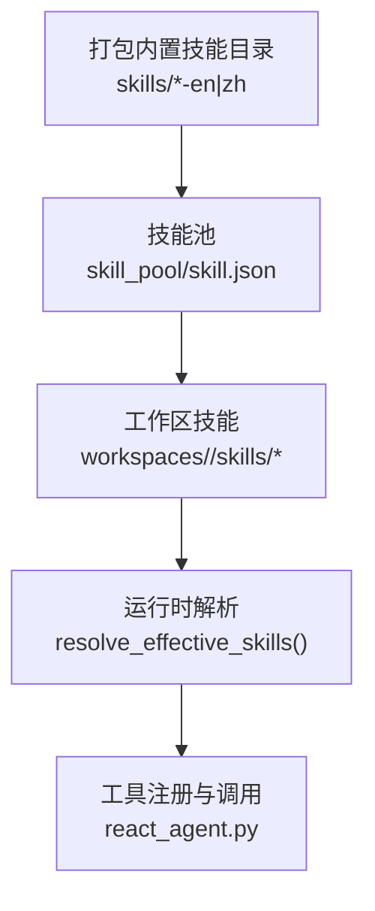
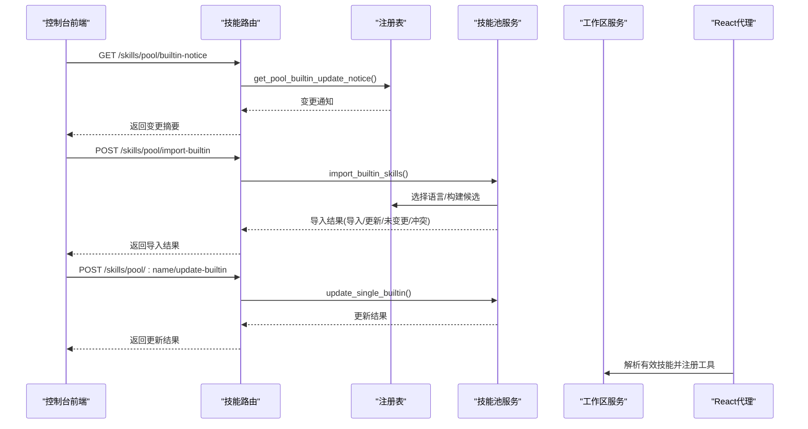
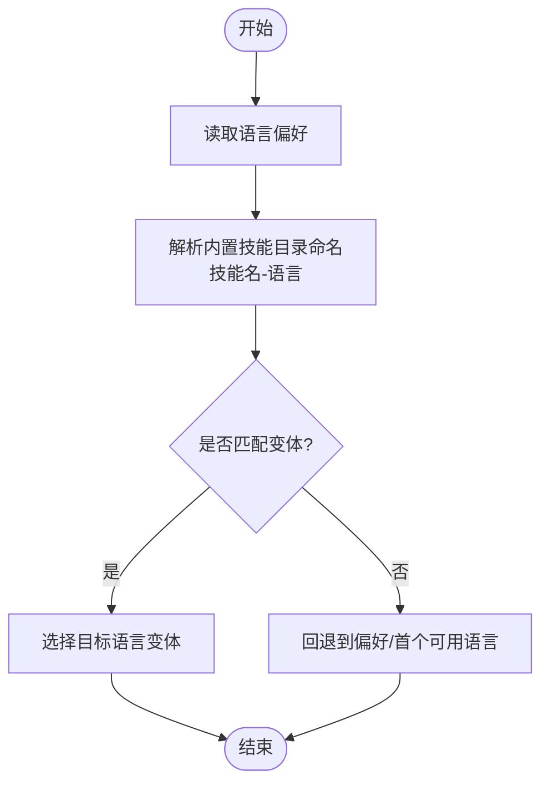
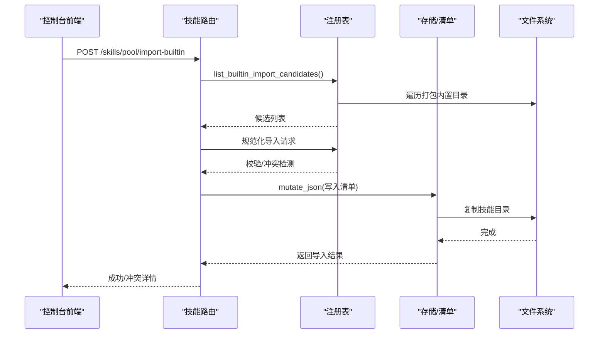
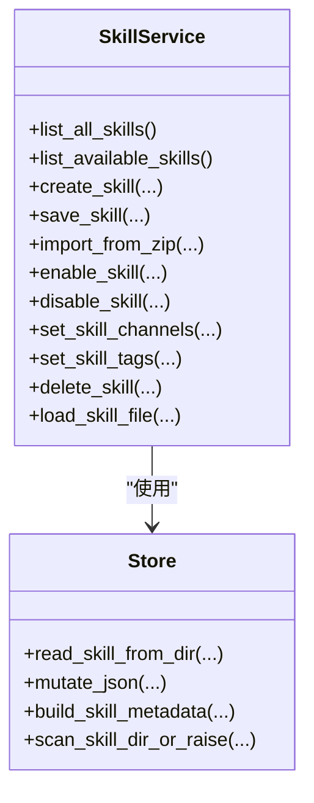
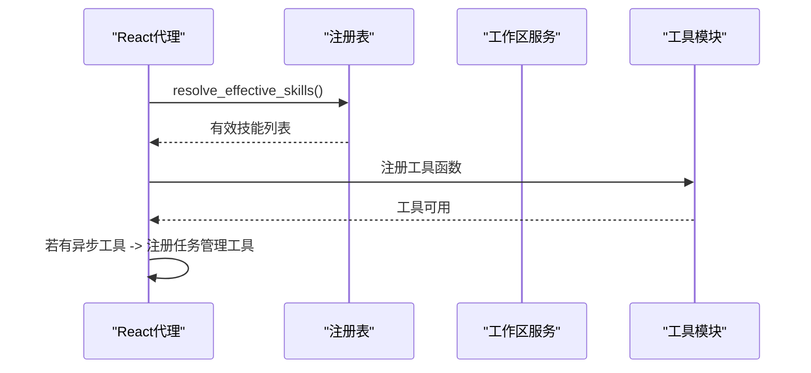
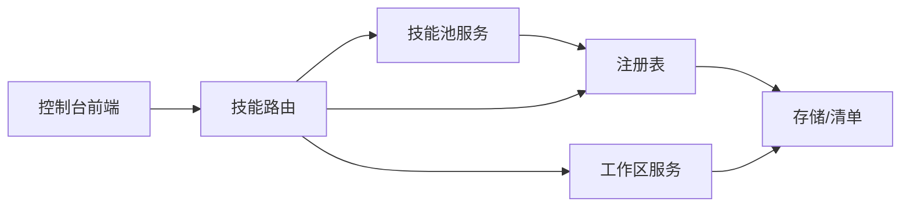

# 内置技能

<cite>
**本文引用的文件**
- [src/qwenpaw/agents/skill_system/__init__.py](file://src/qwenpaw/agents/skill_system/__init__.py)
- [src/qwenpaw/agents/skill_system/models.py](file://src/qwenpaw/agents/skill_system/models.py)
- [src/qwenpaw/agents/skill_system/registry.py](file://src/qwenpaw/agents/skill_system/registry.py)
- [src/qwenpaw/agents/skill_system/store.py](file://src/qwenpaw/agents/skill_system/store.py)
- [src/qwenpaw/agents/skill_system/workspace_service.py](file://src/qwenpaw/agents/skill_system/workspace_service.py)
- [src/qwenpaw/agents/skill_system/pool_service.py](file://src/qwenpaw/agents/skill_system/pool_service.py)
- [src/qwenpaw/app/routers/skills.py](file://src/qwenpaw/app/routers/skills.py)
- [console/src/api/modules/skill.ts](file://console/src/api/modules/skill.ts)
- [console/src/locales/zh.json](file://console/src/locales/zh.json)
- [console/src/locales/en.json](file://console/src/locales/en.json)
- [src/qwenpaw/agents/skills/browser_cdp-en/SKILL.md](file://src/qwenpaw/agents/skills/browser_cdp-en/SKILL.md)
- [src/qwenpaw/agents/skills/chat_with_agent-en/SKILL.md](file://src/qwenpaw/agents/skills/chat_with_agent-en/SKILL.md)
- [src/qwenpaw/agents/skills/multi_agent_collaboration-en/SKILL.md](file://src/qwenpaw/agents/skills/multi_agent_collaboration-en/SKILL.md)
- [src/qwenpaw/agents/skills/pdf-en/SKILL.md](file://src/qwenpaw/agents/skills/pdf-en/SKILL.md)
- [src/qwenpaw/agents/tools/__init__.py](file://src/qwenpaw/agents/tools/__init__.py)
- [src/qwenpaw/agents/react_agent.py](file://src/qwenpaw/agents/react_agent.py)
</cite>

## 目录
1. [简介](#简介)
2. [项目结构](#项目结构)
3. [核心组件](#核心组件)
4. [架构总览](#架构总览)
5. [详细组件分析](#详细组件分析)
6. [依赖分析](#依赖分析)
7. [性能考虑](#性能考虑)
8. [故障排查指南](#故障排查指南)
9. [结论](#结论)
10. [附录](#附录)

## 简介
本文件为 QwenPaw 内置技能的权威参考文档，面向使用者与开发者，系统性阐述内置技能的分类、特性、语言支持与本地化机制、配置与自定义方法、版本管理与更新流程，以及与技能系统的集成方式。文档同时提供各内置技能的输入参数、输出格式与执行流程要点，并给出最佳实践与常见问题排查建议。

## 项目结构
内置技能由“打包内置技能目录 + 技能池 + 工作区技能”三层构成：
- 打包内置技能：位于技能系统内嵌目录，随安装分发，包含多语言版本（如 en、zh）。
- 技能池（Skill Pool）：工作空间共享的内置技能副本集合，负责版本与语言选择、导入/更新、状态同步。
- 工作区技能（Workspace Skills）：每个工作空间内的可编辑技能，可启用/禁用、设置通道路由、打标签、保存配置等。

图表来源
- [src/qwenpaw/agents/skill_system/registry.py:177-230](file://src/qwenpaw/agents/skill_system/registry.py#L177-L230)
- [src/qwenpaw/agents/skill_system/store.py:56-100](file://src/qwenpaw/agents/skill_system/store.py#L56-L100)
- [src/qwenpaw/agents/skill_system/workspace_service.py:66-95](file://src/qwenpaw/agents/skill_system/workspace_service.py#L66-L95)
- [src/qwenpaw/agents/react_agent.py:373-377](file://src/qwenpaw/agents/react_agent.py#L373-L377)

章节来源
- [src/qwenpaw/agents/skill_system/registry.py:177-230](file://src/qwenpaw/agents/skill_system/registry.py#L177-L230)
- [src/qwenpaw/agents/skill_system/store.py:56-100](file://src/qwenpaw/agents/skill_system/store.py#L56-L100)
- [src/qwenpaw/agents/skill_system/workspace_service.py:66-95](file://src/qwenpaw/agents/skill_system/workspace_service.py#L66-L95)
- [src/qwenpaw/agents/react_agent.py:373-377](file://src/qwenpaw/agents/react_agent.py#L373-L377)

## 核心组件
- 技能模型与常量：定义技能信息、需求、冲突错误类型等。
- 注册表与语言偏好：内置技能发现、变体选择、语言偏好解析、导入候选构建。
- 存储与清单：技能目录复制、元数据构建、文件锁与原子写入、路径与安全校验。
- 工作区服务：技能创建、编辑、导入 ZIP、启用/禁用、通道与标签管理、文件读取。
- 技能池服务：内置技能导入/更新、冲突处理、语言字段迁移、工作区清单协调。
- 路由器与前端 API：内置技能通知、批量导入、单个更新、工作区技能 CRUD。

章节来源
- [src/qwenpaw/agents/skill_system/models.py:45-77](file://src/qwenpaw/agents/skill_system/models.py#L45-L77)
- [src/qwenpaw/agents/skill_system/registry.py:64-114](file://src/qwenpaw/agents/skill_system/registry.py#L64-L114)
- [src/qwenpaw/agents/skill_system/store.py:506-579](file://src/qwenpaw/agents/skill_system/store.py#L506-L579)
- [src/qwenpaw/agents/skill_system/workspace_service.py:40-95](file://src/qwenpaw/agents/skill_system/workspace_service.py#L40-L95)
- [src/qwenpaw/agents/skill_system/pool_service.py:791-820](file://src/qwenpaw/agents/skill_system/pool_service.py#L791-L820)
- [src/qwenpaw/app/routers/skills.py:118-200](file://src/qwenpaw/app/routers/skills.py#L118-L200)

## 架构总览
内置技能从“打包内置技能目录”出发，经“技能池”进行版本与语言选择，再进入“工作区技能”。运行时通过“解析有效技能”确定可用技能集，最终注册为工具供代理调用。

图表来源
- [src/qwenpaw/app/routers/skills.py:736-758](file://src/qwenpaw/app/routers/skills.py#L736-L758)
- [src/qwenpaw/app/routers/skills.py:1120-1135](file://src/qwenpaw/app/routers/skills.py#L1120-L1135)
- [src/qwenpaw/app/routers/skills.py:1138-1153](file://src/qwenpaw/app/routers/skills.py#L1138-L1153)
- [src/qwenpaw/agents/skill_system/registry.py:554-574](file://src/qwenpaw/agents/skill_system/registry.py#L554-L574)
- [src/qwenpaw/agents/skill_system/pool_service.py:791-820](file://src/qwenpaw/agents/skill_system/pool_service.py#L791-L820)
- [src/qwenpaw/agents/react_agent.py:373-377](file://src/qwenpaw/agents/react_agent.py#L373-L377)

章节来源
- [src/qwenpaw/app/routers/skills.py:736-758](file://src/qwenpaw/app/routers/skills.py#L736-L758)
- [src/qwenpaw/app/routers/skills.py:1120-1153](file://src/qwenpaw/app/routers/skills.py#L1120-L1153)
- [src/qwenpaw/agents/skill_system/registry.py:554-574](file://src/qwenpaw/agents/skill_system/registry.py#L554-L574)
- [src/qwenpaw/agents/skill_system/pool_service.py:791-820](file://src/qwenpaw/agents/skill_system/pool_service.py#L791-L820)
- [src/qwenpaw/agents/react_agent.py:373-377](file://src/qwenpaw/agents/react_agent.py#L373-L377)

## 详细组件分析

### 组件A：内置技能语言与变体选择
- 语言偏好：优先来自设置中的“builtin_skill_language”，否则根据 UI 语言自动推断；缓存于内存。
- 变体选择：按“技能名-语言”命名规则识别内置变体，若未找到则回退到首选语言或字典序首个语言。
- 语言字段迁移：对已有池内条目补充“builtin_language”“builtin_source_name”等元数据，确保后续语言切换正确。

图表来源
- [src/qwenpaw/agents/skill_system/registry.py:64-114](file://src/qwenpaw/agents/skill_system/registry.py#L64-L114)
- [src/qwenpaw/agents/skill_system/registry.py:195-211](file://src/qwenpaw/agents/skill_system/registry.py#L195-L211)
- [src/qwenpaw/agents/skill_system/registry.py:406-451](file://src/qwenpaw/agents/skill_system/registry.py#L406-L451)

章节来源
- [src/qwenpaw/agents/skill_system/registry.py:64-114](file://src/qwenpaw/agents/skill_system/registry.py#L64-L114)
- [src/qwenpaw/agents/skill_system/registry.py:195-211](file://src/qwenpaw/agents/skill_system/registry.py#L195-L211)
- [src/qwenpaw/agents/skill_system/registry.py:406-451](file://src/qwenpaw/agents/skill_system/registry.py#L406-L451)

### 组件B：内置技能导入与更新
- 导入候选：扫描打包内置目录，结合技能池现有状态，生成“名称/描述/版本/可用语言/状态”等信息。
- 规范化请求：校验技能名与语言，支持“技能名:语言”别名与首选语言回退。
- 冲突检测：当目标为内置且语言不一致、或版本落后时，返回冲突列表；可选择覆盖冲突。
- 更新流程：复制变体目录至技能池，重建元数据，写入清单；支持按语言更新单个内置技能。

图表来源
- [src/qwenpaw/app/routers/skills.py:1120-1135](file://src/qwenpaw/app/routers/skills.py#L1120-L1135)
- [src/qwenpaw/agents/skill_system/registry.py:554-574](file://src/qwenpaw/agents/skill_system/registry.py#L554-L574)
- [src/qwenpaw/agents/skill_system/registry.py:577-729](file://src/qwenpaw/agents/skill_system/registry.py#L577-L729)
- [src/qwenpaw/agents/skill_system/store.py:220-237](file://src/qwenpaw/agents/skill_system/store.py#L220-L237)

章节来源
- [src/qwenpaw/app/routers/skills.py:1120-1135](file://src/qwenpaw/app/routers/skills.py#L1120-L1135)
- [src/qwenpaw/agents/skill_system/registry.py:554-574](file://src/qwenpaw/agents/skill_system/registry.py#L554-L574)
- [src/qwenpaw/agents/skill_system/registry.py:577-729](file://src/qwenpaw/agents/skill_system/registry.py#L577-L729)
- [src/qwenpaw/agents/skill_system/store.py:220-237](file://src/qwenpaw/agents/skill_system/store.py#L220-L237)

### 组件C：工作区技能生命周期与配置
- 创建/编辑/重命名/删除：校验内容、扫描安全、原子写入清单、必要时回滚。
- 启用/禁用/通道/标签：通过清单字段持久化状态，运行时解析生效。
- 文件读取：限制在 references/scripts 子树内，防止路径穿越。
- 配置注入：将技能配置映射为环境变量，满足“require_envs”声明。

图表来源
- [src/qwenpaw/agents/skill_system/workspace_service.py:40-95](file://src/qwenpaw/agents/skill_system/workspace_service.py#L40-L95)
- [src/qwenpaw/agents/skill_system/workspace_service.py:197-489](file://src/qwenpaw/agents/skill_system/workspace_service.py#L197-L489)
- [src/qwenpaw/agents/skill_system/workspace_service.py:645-718](file://src/qwenpaw/agents/skill_system/workspace_service.py#L645-L718)
- [src/qwenpaw/agents/skill_system/store.py:506-579](file://src/qwenpaw/agents/skill_system/store.py#L506-L579)

章节来源
- [src/qwenpaw/agents/skill_system/workspace_service.py:40-95](file://src/qwenpaw/agents/skill_system/workspace_service.py#L40-L95)
- [src/qwenpaw/agents/skill_system/workspace_service.py:197-489](file://src/qwenpaw/agents/skill_system/workspace_service.py#L197-L489)
- [src/qwenpaw/agents/skill_system/workspace_service.py:645-718](file://src/qwenpaw/agents/skill_system/workspace_service.py#L645-L718)
- [src/qwenpaw/agents/skill_system/store.py:506-579](file://src/qwenpaw/agents/skill_system/store.py#L506-L579)

### 组件D：内置技能与工具系统集成
- 运行时解析：根据通道与启用状态解析有效技能，注册为工具函数。
- 工具导出：内置工具统一从工具模块导出，供代理直接调用。
- 异步任务管理：若存在异步执行工具，自动注册任务查看/等待/取消工具。

图表来源
- [src/qwenpaw/agents/react_agent.py:341-377](file://src/qwenpaw/agents/react_agent.py#L341-L377)
- [src/qwenpaw/agents/tools/__init__.py:1-58](file://src/qwenpaw/agents/tools/__init__.py#L1-L58)

章节来源
- [src/qwenpaw/agents/react_agent.py:341-377](file://src/qwenpaw/agents/react_agent.py#L341-L377)
- [src/qwenpaw/agents/tools/__init__.py:1-58](file://src/qwenpaw/agents/tools/__init__.py#L1-L58)

## 依赖分析
- 模块耦合
  - 注册表依赖存储层进行目录遍历、元数据提取与清单读写。
  - 技能池服务依赖注册表的变体选择与语言解析能力。
  - 工作区服务依赖存储层的安全扫描与清单原子写入。
  - 路由器作为 API 入口，编排注册表、池与工作区服务。
- 外部依赖
  - 前端控制台通过 API 获取内置技能变更通知、批量导入与单个更新。
  - 本地化资源提供多语言文案与提示。

图表来源
- [src/qwenpaw/agents/skill_system/registry.py:177-230](file://src/qwenpaw/agents/skill_system/registry.py#L177-L230)
- [src/qwenpaw/agents/skill_system/store.py:506-579](file://src/qwenpaw/agents/skill_system/store.py#L506-L579)
- [src/qwenpaw/agents/skill_system/pool_service.py:791-820](file://src/qwenpaw/agents/skill_system/pool_service.py#L791-L820)
- [src/qwenpaw/app/routers/skills.py:1120-1153](file://src/qwenpaw/app/routers/skills.py#L1120-L1153)
- [console/src/api/modules/skill.ts:335-380](file://console/src/api/modules/skill.ts#L335-L380)

章节来源
- [src/qwenpaw/agents/skill_system/registry.py:177-230](file://src/qwenpaw/agents/skill_system/registry.py#L177-L230)
- [src/qwenpaw/agents/skill_system/store.py:506-579](file://src/qwenpaw/agents/skill_system/store.py#L506-L579)
- [src/qwenpaw/agents/skill_system/pool_service.py:791-820](file://src/qwenpaw/agents/skill_system/pool_service.py#L791-L820)
- [src/qwenpaw/app/routers/skills.py:1120-1153](file://src/qwenpaw/app/routers/skills.py#L1120-L1153)
- [console/src/api/modules/skill.ts:335-380](file://console/src/api/modules/skill.ts#L335-L380)

## 性能考虑
- 清单缓存：基于文件 mtime 的缓存减少重复读取开销。
- 原子写入与文件锁：跨进程安全更新清单，避免竞态。
- 变体选择与语言偏好缓存：减少重复计算。
- ZIP 导入限制：压缩包大小上限与路径安全性检查，降低异常风险。

章节来源
- [src/qwenpaw/agents/skill_system/store.py:632-671](file://src/qwenpaw/agents/skill_system/store.py#L632-L671)
- [src/qwenpaw/agents/skill_system/store.py:249-320](file://src/qwenpaw/agents/skill_system/store.py#L249-L320)
- [src/qwenpaw/agents/skill_system/registry.py:64-114](file://src/qwenpaw/agents/skill_system/registry.py#L64-L114)
- [src/qwenpaw/agents/skill_system/store.py:401-422](file://src/qwenpaw/agents/skill_system/store.py#L401-L422)

## 故障排查指南
- 冲突与覆盖
  - 当内置技能与池中副本存在语言不一致或版本落后时，会返回冲突列表；可通过覆盖冲突参数强制更新。
- 语言选择异常
  - 若池中条目语言字段缺失，系统会尝试通过内容哈希与 CJK 字符密度猜测语言，最终回退到用户偏好或首个可用语言。
- 安全扫描失败
  - ZIP 导入或编辑后会进行安全扫描，失败时返回结构化错误，包含严重级别与发现项。
- 语言偏好未生效
  - 检查设置中的“builtin_skill_language”与 UI 语言；确认缓存已刷新。

章节来源
- [src/qwenpaw/app/routers/skills.py:1120-1135](file://src/qwenpaw/app/routers/skills.py#L1120-L1135)
- [src/qwenpaw/agents/skill_system/registry.py:406-451](file://src/qwenpaw/agents/skill_system/registry.py#L406-L451)
- [src/qwenpaw/agents/skill_system/workspace_service.py:401-489](file://src/qwenpaw/agents/skill_system/workspace_service.py#L401-L489)
- [console/src/locales/zh.json:435-463](file://console/src/locales/zh.json#L435-L463)
- [console/src/locales/en.json:576-599](file://console/src/locales/en.json#L576-L599)

## 结论
QwenPaw 的内置技能体系通过“打包内置技能 + 技能池 + 工作区技能”的分层设计，实现了多语言支持、版本与语言选择、安全扫描与原子更新。配合运行时解析与工具注册，内置技能可无缝融入代理工作流。建议在团队协作中统一语言偏好、定期检查内置技能变更通知，并通过标签与通道精细化管理技能可用范围。

## 附录

### 内置技能清单与示例
以下内置技能在仓库中提供完整文档与脚本示例，便于理解其输入参数、输出格式与执行流程：

- 浏览器 CDP（browser_cdp-en）
  - 功能：连接现有浏览器、扫描本地 CDP 端口、显式指定调试端口、共享浏览器实例。
  - 关键点：隐私建议（私有模式）、端口冲突策略、停止行为区分。
  - 参考路径：[src/qwenpaw/agents/skills/browser_cdp-en/SKILL.md:1-205](file://src/qwenpaw/agents/skills/browser_cdp-en/SKILL.md#L1-L205)

- 与代理对话（chat_with_agent-en）
  - 功能：与其他代理咨询、寻求帮助、发起前台/后台对话。
  - 关键点：前台对话需传递 session_id 以延续上下文；后台提交与查询状态。
  - 参考路径：[src/qwenpaw/agents/skills/chat_with_agent-en/SKILL.md:1-118](file://src/qwenpaw/agents/skills/chat_with_agent-en/SKILL.md#L1-L118)

- 多代理协作（multi_agent_collaboration-en）
  - 功能：列出代理、发起实时/后台对话、查询任务状态、复用会话。
  - 关键点：复杂任务优选后台模式；合理设置查询间隔。
  - 参考路径：[src/qwenpaw/agents/skills/multi_agent_collaboration-en/SKILL.md:1-477](file://src/qwenpaw/agents/skills/multi_agent_collaboration-en/SKILL.md#L1-L477)

- PDF 处理（pdf-en）
  - 功能：文本/表格提取、合并/拆分、旋转、加水印、创建新 PDF、填写表单、加密/解密、OCR。
  - 关键点：依赖 pypdf、pdfplumber、reportlab、poppler-utils 等工具链。
  - 参考路径：[src/qwenpaw/agents/skills/pdf-en/SKILL.md:1-330](file://src/qwenpaw/agents/skills/pdf-en/SKILL.md#L1-L330)

章节来源
- [src/qwenpaw/agents/skills/browser_cdp-en/SKILL.md:1-205](file://src/qwenpaw/agents/skills/browser_cdp-en/SKILL.md#L1-L205)
- [src/qwenpaw/agents/skills/chat_with_agent-en/SKILL.md:1-118](file://src/qwenpaw/agents/skills/chat_with_agent-en/SKILL.md#L1-L118)
- [src/qwenpaw/agents/skills/multi_agent_collaboration-en/SKILL.md:1-477](file://src/qwenpaw/agents/skills/multi_agent_collaboration-en/SKILL.md#L1-L477)
- [src/qwenpaw/agents/skills/pdf-en/SKILL.md:1-330](file://src/qwenpaw/agents/skills/pdf-en/SKILL.md#L1-L330)

### API 与前端交互要点
- 内置技能变更通知：获取指纹、是否有更新、变更总数与动作项列表。
- 批量导入内置技能：支持覆盖冲突参数；返回导入/更新/未变更/冲突明细。
- 单个内置技能更新：按语言更新池中内置技能。
- 前端本地化：英文与中文文案覆盖导入、冲突、语言切换等场景。

章节来源
- [src/qwenpaw/app/routers/skills.py:736-758](file://src/qwenpaw/app/routers/skills.py#L736-L758)
- [src/qwenpaw/app/routers/skills.py:1120-1135](file://src/qwenpaw/app/routers/skills.py#L1120-L1135)
- [src/qwenpaw/app/routers/skills.py:1138-1153](file://src/qwenpaw/app/routers/skills.py#L1138-L1153)
- [console/src/api/modules/skill.ts:335-380](file://console/src/api/modules/skill.ts#L335-L380)
- [console/src/locales/zh.json:435-463](file://console/src/locales/zh.json#L435-L463)
- [console/src/locales/en.json:576-599](file://console/src/locales/en.json#L576-L599)