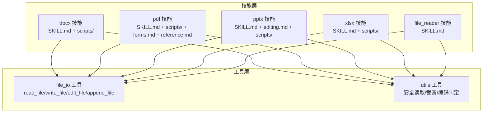
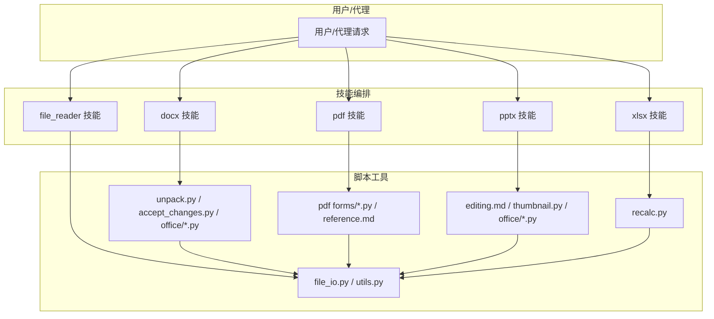
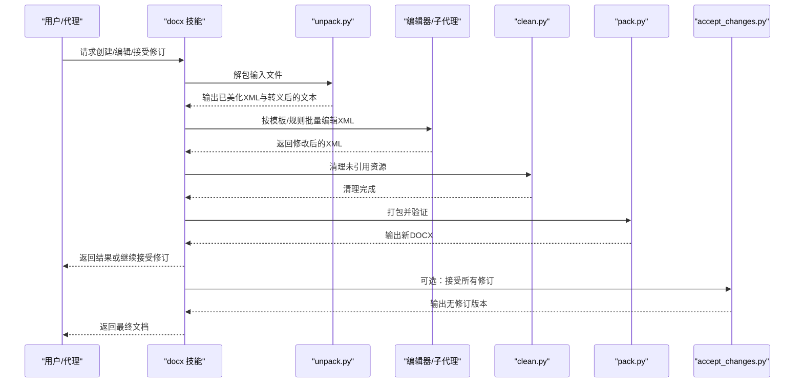
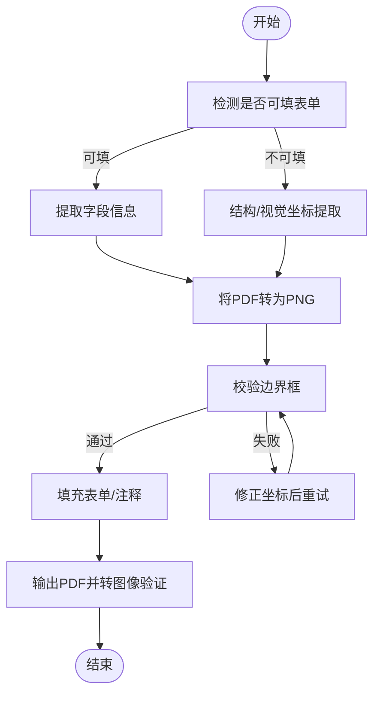
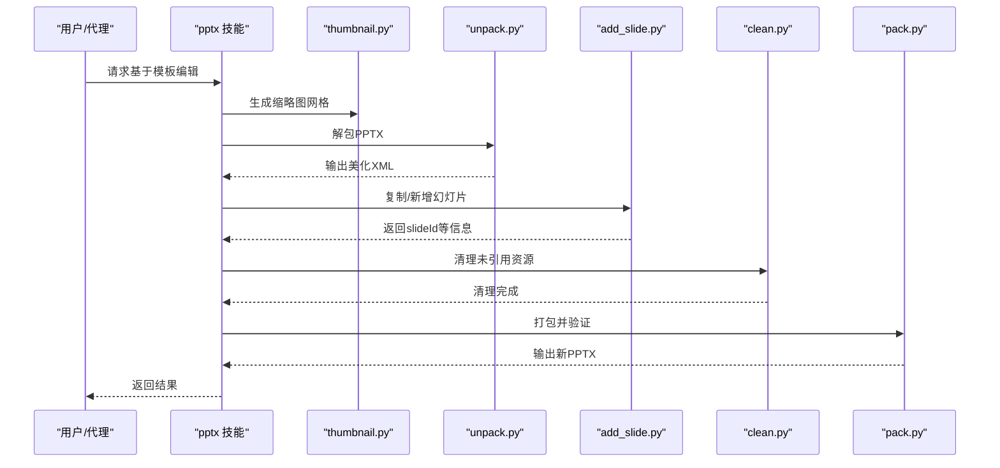
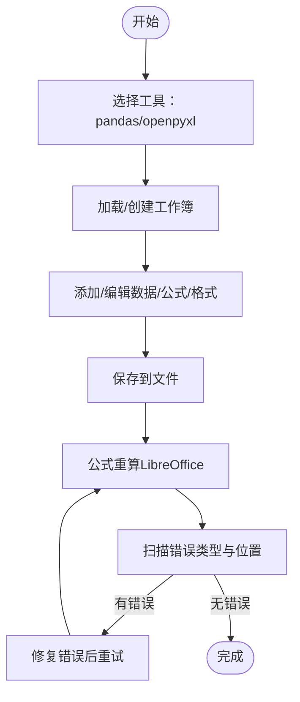
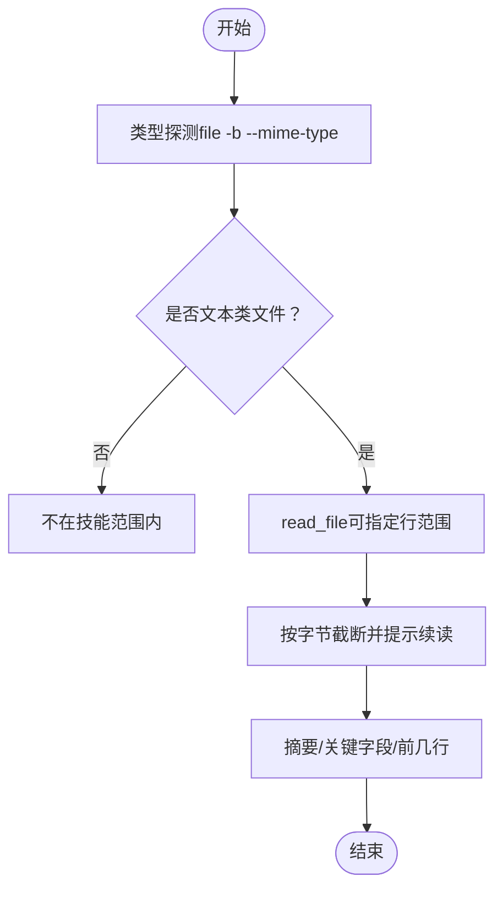
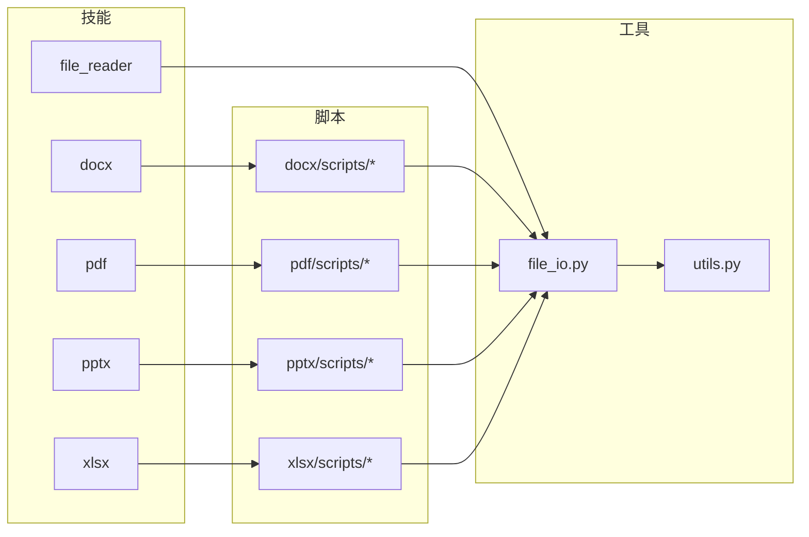

# 办公技能

<cite>
**本文引用的文件**
- [SKILL.md（docx 英文）](file://src/qwenpaw/agents/skills/docx-en/SKILL.md)
- [SKILL.md（pdf 英文）](file://src/qwenpaw/agents/skills/pdf-en/SKILL.md)
- [reference.md（pdf 高级参考）](file://src/qwenpaw/agents/skills/pdf-en/reference.md)
- [forms.md（pdf 表单填写指南）](file://src/qwenpaw/agents/skills/pdf-en/forms.md)
- [SKILL.md（pptx 英文）](file://src/qwenpaw/agents/skills/pptx-en/SKILL.md)
- [editing.md（pptx 编辑指南）](file://src/qwenpaw/agents/skills/pptx-en/editing.md)
- [SKILL.md（xlsx 英文）](file://src/qwenpaw/agents/skills/xlsx-en/SKILL.md)
- [recalc.py（xlsx 公式重算）](file://src/qwenpaw/agents/skills/xlsx-en/scripts/recalc.py)
- [SKILL.md（file_reader 英文）](file://src/qwenpaw/agents/skills/file_reader-en/SKILL.md)
- [unpack.py（Office 文件解包）](file://src/qwenpaw/agents/skills/docx-en/scripts/office/unpack.py)
- [file_io.py（文件读写工具）](file://src/qwenpaw/agents/tools/file_io.py)
- [utils.py（文件与Shell工具通用函数）](file://src/qwenpaw/agents/tools/utils.py)
</cite>

## 目录
1. [简介](#简介)
2. [项目结构](#项目结构)
3. [核心组件](#核心组件)
4. [架构总览](#架构总览)
5. [详细组件分析](#详细组件分析)
6. [依赖关系分析](#依赖关系分析)
7. [性能考量](#性能考量)
8. [故障排查指南](#故障排查指南)
9. [结论](#结论)
10. [附录](#附录)

## 简介
本技术文档聚焦于 QwenPaw 的办公技能体系，覆盖文档处理（Word）、PDF 操作、演示文稿制作（PowerPoint）、电子表格处理（Excel/CSV/TSV）与文本文件读取等能力。文档从系统架构、组件关系、数据流与处理逻辑入手，结合各技能的文件格式支持、处理能力、功能特性、操作步骤与技巧、自动化与批量处理策略、数据转换与格式兼容性（含编码与版本适配）、实际应用案例与效率提升方法，以及最佳实践进行系统化阐述。

## 项目结构
办公技能以“技能目录 + 脚本工具 + 文档指南”的方式组织，每个技能（docx、pdf、pptx、xlsx、file_reader）均提供：
- 技能说明文档（SKILL.md），定义触发条件、前置依赖、常用任务与最佳实践
- 脚本工具（scripts/...），用于自动化处理（如解包/打包、表单填写、公式重算、缩略图生成等）
- 参考与进阶文档（reference.md、forms.md、editing.md），提供高级用法与流程规范

图表来源
- [SKILL.md（docx 英文）](file://src/qwenpaw/agents/skills/docx-en/SKILL.md)
- [SKILL.md（pdf 英文）](file://src/qwenpaw/agents/skills/pdf-en/SKILL.md)
- [SKILL.md（pptx 英文）](file://src/qwenpaw/agents/skills/pptx-en/SKILL.md)
- [SKILL.md（xlsx 英文）](file://src/qwenpaw/agents/skills/xlsx-en/SKILL.md)
- [SKILL.md（file_reader 英文）](file://src/qwenpaw/agents/skills/file_reader-en/SKILL.md)
- [file_io.py（文件读写工具）](file://src/qwenpaw/agents/tools/file_io.py)
- [utils.py（文件与Shell工具通用函数）](file://src/qwenpaw/agents/tools/utils.py)

章节来源
- [SKILL.md（docx 英文）](file://src/qwenpaw/agents/skills/docx-en/SKILL.md)
- [SKILL.md（pdf 英文）](file://src/qwenpaw/agents/skills/pdf-en/SKILL.md)
- [SKILL.md（pptx 英文）](file://src/qwenpaw/agents/skills/pptx-en/SKILL.md)
- [SKILL.md（xlsx 英文）](file://src/qwenpaw/agents/skills/xlsx-en/SKILL.md)
- [SKILL.md（file_reader 英文）](file://src/qwenpaw/agents/skills/file_reader-en/SKILL.md)
- [file_io.py（文件读写工具）](file://src/qwenpaw/agents/tools/file_io.py)
- [utils.py（文件与Shell工具通用函数）](file://src/qwenpaw/agents/tools/utils.py)

## 核心组件
- 文档处理（docx）
  - 支持格式：.docx、.doc（需先转换为 .docx）
  - 处理能力：创建新文档、读取/分析内容、编辑现有文档（解包-修改-打包）、接受修订、导出 PDF/图像
  - 关键脚本：unpack.py（解包/美化 XML/转义引号）、accept_changes.py（接受修订）、office/*.py（辅助）
- PDF 操作
  - 支持格式：.pdf
  - 处理能力：读取/提取文本/表格、合并/拆分、旋转、加水印、创建 PDF、填写表单、加密/解密、提取图片、OCR 扫描版 PDF
  - 关键脚本：forms/*.py（表单字段检测/坐标校验/注释填充）、reference.md（高级库与示例）
- 演示文稿（pptx）
  - 支持格式：.pptx
  - 处理能力：读取/分析内容、基于模板编辑、从零创建、缩略图生成、转换为图像
  - 关键脚本：editing.md（模板工作流）、thumbnail.py（缩略图）、office/*.py（解包/打包）
- 电子表格（xlsx）
  - 支持格式：.xlsx、.xlsm、.csv、.tsv
  - 处理能力：读取/分析数据、编辑/计算、格式化、图表、清理脏数据、公式重算（LibreOffice）
  - 关键脚本：recalc.py（公式重算与错误扫描）
- 文件读取（file_reader）
  - 支持格式：纯文本类文件（.txt、.md、.json、.yaml/.yml、.csv/.tsv、.log、.sql、ini、toml、源代码等）
  - 处理能力：类型探测、小样本读取、摘要、大日志尾部窗口查看
  - 关键工具：file_io.py（统一读写/编辑/追加）、utils.py（截断/编码判定/安全读取）

章节来源
- [SKILL.md（docx 英文）](file://src/qwenpaw/agents/skills/docx-en/SKILL.md)
- [SKILL.md（pdf 英文）](file://src/qwenpaw/agents/skills/pdf-en/SKILL.md)
- [forms.md（pdf 表单填写指南）](file://src/qwenpaw/agents/skills/pdf-en/forms.md)
- [SKILL.md（pptx 英文）](file://src/qwenpaw/agents/skills/pptx-en/SKILL.md)
- [editing.md（pptx 编辑指南）](file://src/qwenpaw/agents/skills/pptx-en/editing.md)
- [SKILL.md（xlsx 英文）](file://src/qwenpaw/agents/skills/xlsx-en/SKILL.md)
- [recalc.py（xlsx 公式重算）](file://src/qwenpaw/agents/skills/xlsx-en/scripts/recalc.py)
- [SKILL.md（file_reader 英文）](file://src/qwenpaw/agents/skills/file_reader-en/SKILL.md)
- [file_io.py（文件读写工具）](file://src/qwenpaw/agents/tools/file_io.py)
- [utils.py（文件与Shell工具通用函数）](file://src/qwenpaw/agents/tools/utils.py)

## 架构总览
办公技能通过“技能层 + 工具层”的分层设计实现：
- 技能层负责业务语义与流程编排（何时用什么技能、如何调用脚本）
- 工具层提供统一的文件 IO 与通用工具（路径解析、编码选择、截断策略、安全读取）

图表来源
- [SKILL.md（docx 英文）](file://src/qwenpaw/agents/skills/docx-en/SKILL.md)
- [SKILL.md（pdf 英文）](file://src/qwenpaw/agents/skills/pdf-en/SKILL.md)
- [forms.md（pdf 表单填写指南）](file://src/qwenpaw/agents/skills/pdf-en/forms.md)
- [SKILL.md（pptx 英文）](file://src/qwenpaw/agents/skills/pptx-en/SKILL.md)
- [editing.md（pptx 编辑指南）](file://src/qwenpaw/agents/skills/pptx-en/editing.md)
- [SKILL.md（xlsx 英文）](file://src/qwenpaw/agents/skills/xlsx-en/SKILL.md)
- [recalc.py（xlsx 公式重算）](file://src/qwenpaw/agents/skills/xlsx-en/scripts/recalc.py)
- [SKILL.md（file_reader 英文）](file://src/qwenpaw/agents/skills/file_reader-en/SKILL.md)
- [file_io.py（文件读写工具）](file://src/qwenpaw/agents/tools/file_io.py)
- [utils.py（文件与Shell工具通用函数）](file://src/qwenpaw/agents/tools/utils.py)

## 详细组件分析

### 文档处理（docx）
- 支持格式与能力
  - .docx：创建、读取、编辑（解包-修改-打包）、接受修订、导出 PDF/图像
  - .doc：需先转换为 .docx 后再编辑
- 关键流程
  - 创建新文档：使用 docx-js 生成，随后 validate.py 校验；注意页面尺寸与方向设置
  - 编辑现有文档：unpack.py 解包 → 修改 XML → clean.py 清理 → pack.py 打包并自动修复
  - 接受修订：accept_changes.py 基于 LibreOffice 宏执行
- 数据与编码
  - 解包时对智能引号进行 XML 实体转义，避免跨平台显示问题
  - 页面尺寸采用 DXA 单位，确保在不同平台一致渲染
- 自动化与批量
  - 使用脚本链路（unpack → 批量编辑 → pack）实现模板驱动的批量生成
  - 通过命令行参数控制是否合并运行与简化修订

图表来源
- [SKILL.md（docx 英文）](file://src/qwenpaw/agents/skills/docx-en/SKILL.md)
- [unpack.py（Office 文件解包）](file://src/qwenpaw/agents/skills/docx-en/scripts/office/unpack.py)
- [file_io.py（文件读写工具）](file://src/qwenpaw/agents/tools/file_io.py)

章节来源
- [SKILL.md（docx 英文）](file://src/qwenpaw/agents/skills/docx-en/SKILL.md)
- [unpack.py（Office 文件解包）](file://src/qwenpaw/agents/skills/docx-en/scripts/office/unpack.py)

### PDF 操作
- 支持格式与能力
  - .pdf：文本/表格提取、合并/拆分、旋转、加水印、创建、表单填写、加密/解密、提取图片、OCR
- 关键流程
  - 文本/表格提取：pdfplumber 或 pypdf
  - 合并/拆分/旋转/解密：qpdf 或 pypdf
  - 表单填写：先检测可填字段，再按坐标填充；若非可填表单，通过结构/视觉坐标估算注释填充
  - OCR：扫描版 PDF 先转图像再 OCR
- 数据与编码
  - 命令行工具依赖 poppler-utils（pdftotext、pdftoppm、pdfimages、qpdf）与 pytesseract
  - 表单坐标支持 PDF 坐标系与图像坐标系，提供坐标校验脚本
- 自动化与批量
  - 使用脚本组合（字段检测 → 图像生成 → 坐标校验 → 注释填充）形成稳定流水线
  - 批量处理多页 PDF 时，优先使用命令行工具以提高吞吐

图表来源
- [SKILL.md（pdf 英文）](file://src/qwenpaw/agents/skills/pdf-en/SKILL.md)
- [forms.md（pdf 表单填写指南）](file://src/qwenpaw/agents/skills/pdf-en/forms.md)

章节来源
- [SKILL.md（pdf 英文）](file://src/qwenpaw/agents/skills/pdf-en/SKILL.md)
- [forms.md（pdf 表单填写指南）](file://src/qwenpaw/agents/skills/pdf-en/forms.md)
- [reference.md（pdf 高级参考）](file://src/qwenpaw/agents/skills/pdf-en/reference.md)

### 演示文稿（pptx）
- 支持格式与能力
  - .pptx：读取/分析、基于模板编辑、从零创建、缩略图生成、转换为图像
- 关键流程
  - 模板分析：thumbnail.py 生成缩略图网格，markitdown 提取占位符文本
  - 结构化编辑：unpack.py 解包 → add_slide.py 复制/新增幻灯片 → clean.py 清理 → pack.py 打包
  - 内容编辑：逐张幻灯片 XML 编辑，遵循格式规则（粗体标题、列表格式、智能引号实体）
- 自动化与批量
  - 子代理并行编辑不同幻灯片 XML，减少串行等待
  - 模板复用与布局多样化，避免单调重复

图表来源
- [SKILL.md（pptx 英文）](file://src/qwenpaw/agents/skills/pptx-en/SKILL.md)
- [editing.md（pptx 编辑指南）](file://src/qwenpaw/agents/skills/pptx-en/editing.md)

章节来源
- [SKILL.md（pptx 英文）](file://src/qwenpaw/agents/skills/pptx-en/SKILL.md)
- [editing.md（pptx 编辑指南）](file://src/qwenpaw/agents/skills/pptx-en/editing.md)

### 电子表格（xlsx）
- 支持格式与能力
  - .xlsx/.xlsm：读取/分析、编辑/计算、格式化、图表、清理脏数据
  - .csv/.tsv：读取/分析、转换/清洗
- 关键流程
  - 数据分析：pandas 读取/统计/可视化
  - 编辑与格式化：openpyxl 添加/修改单元格、公式、样式
  - 公式重算：recalc.py 使用 LibreOffice 计算并扫描错误
- 数据与编码
  - 写入时根据文件类型选择 UTF-8-BOM（CSV/TSV/TXT）以提升 Windows Excel 兼容性
  - 读取时采用 utf-8-sig 并忽略解码错误，防止大文件内存溢出
- 自动化与批量
  - 将计算逻辑放在 Excel 公式中，避免在 Python 中硬编码数值，保持动态更新
  - 使用脚本循环处理多个工作表，完成后统一重算并检查错误

图表来源
- [SKILL.md（xlsx 英文）](file://src/qwenpaw/agents/skills/xlsx-en/SKILL.md)
- [recalc.py（xlsx 公式重算）](file://src/qwenpaw/agents/skills/xlsx-en/scripts/recalc.py)

章节来源
- [SKILL.md（xlsx 英文）](file://src/qwenpaw/agents/skills/xlsx-en/SKILL.md)
- [recalc.py（xlsx 公式重算）](file://src/qwenpaw/agents/skills/xlsx-en/scripts/recalc.py)

### 文件读取（file_reader）
- 支持格式与能力
  - 纯文本类文件：.txt、.md、.json、.yaml/.yml、.csv/.tsv、.log、.sql、ini、toml、源代码等
  - 类型探测：使用 file -b --mime-type
  - 大文件摘要：尾部窗口查看与关键片段展示
- 工具与策略
  - file_io.py：统一的读取/写入/编辑/追加接口，路径解析与编码选择
  - utils.py：截断策略（按字节限制、保留完整行）、安全读取（最大内存限制、错误忽略）

图表来源
- [SKILL.md（file_reader 英文）](file://src/qwenpaw/agents/skills/file_reader-en/SKILL.md)
- [file_io.py（文件读写工具）](file://src/qwenpaw/agents/tools/file_io.py)
- [utils.py（文件与Shell工具通用函数）](file://src/qwenpaw/agents/tools/utils.py)

章节来源
- [SKILL.md（file_reader 英文）](file://src/qwenpaw/agents/skills/file_reader-en/SKILL.md)
- [file_io.py（文件读写工具）](file://src/qwenpaw/agents/tools/file_io.py)
- [utils.py（文件与Shell工具通用函数）](file://src/qwenpaw/agents/tools/utils.py)

## 依赖关系分析
- 技能与脚本
  - docx/pptx/xlsx/pdf 技能均依赖各自 scripts/ 下的 Python 脚本实现具体操作
  - 脚本之间存在协作关系：如 docx 的 unpack → clean → pack；pptx 的 thumbnail → unpack → clean → pack
- 工具与脚本
  - 所有技能通过 file_io.py 与 utils.py 统一处理文件 IO 与通用工具，保证编码一致性与安全性
- 外部依赖
  - PDF：pypdf、pdfplumber、reportlab、poppler-utils（pdftotext/pdftoppm/pdfimages/qpdf）、pytesseract/pdf2image
  - 文档/演示：LibreOffice（soffice）、docx-js、pptxgenjs、Pillow、markitdown[pptx]
  - 电子表格：openpyxl、pandas、LibreOffice（宏）

图表来源
- [SKILL.md（docx 英文）](file://src/qwenpaw/agents/skills/docx-en/SKILL.md)
- [SKILL.md（pdf 英文）](file://src/qwenpaw/agents/skills/pdf-en/SKILL.md)
- [SKILL.md（pptx 英文）](file://src/qwenpaw/agents/skills/pptx-en/SKILL.md)
- [SKILL.md（xlsx 英文）](file://src/qwenpaw/agents/skills/xlsx-en/SKILL.md)
- [SKILL.md（file_reader 英文）](file://src/qwenpaw/agents/skills/file_reader-en/SKILL.md)
- [file_io.py（文件读写工具）](file://src/qwenpaw/agents/tools/file_io.py)
- [utils.py（文件与Shell工具通用函数）](file://src/qwenpaw/agents/tools/utils.py)

章节来源
- [SKILL.md（docx 英文）](file://src/qwenpaw/agents/skills/docx-en/SKILL.md)
- [SKILL.md（pdf 英文）](file://src/qwenpaw/agents/skills/pdf-en/SKILL.md)
- [SKILL.md（pptx 英文）](file://src/qwenpaw/agents/skills/pptx-en/SKILL.md)
- [SKILL.md（xlsx 英文）](file://src/qwenpaw/agents/skills/xlsx-en/SKILL.md)
- [SKILL.md（file_reader 英文）](file://src/qwenpaw/agents/skills/file_reader-en/SKILL.md)
- [file_io.py（文件读写工具）](file://src/qwenpaw/agents/tools/file_io.py)
- [utils.py（文件与Shell工具通用函数）](file://src/qwenpaw/agents/tools/utils.py)

## 性能考量
- I/O 与内存
  - 大文件读取采用异步与字节限制（最大 200MB），避免内存溢出
  - 截断策略按字节切分并保留完整行，减少重复传输
- 批处理与并行
  - PowerPoint 模板编辑支持子代理并行处理不同幻灯片 XML
  - Excel 公式重算通过 LibreOffice 执行，建议合理设置超时时间
- 工具链优化
  - PDF 批量处理优先使用命令行工具（qpdf、pdftotext、pdfimages）以提升吞吐
  - 文档/演示转换使用 headless LibreOffice，避免图形界面开销

## 故障排查指南
- 常见问题与定位
  - Office 文件损坏：unpack.py 返回“不是有效的 Office 文件”，检查 ZIP 结构与 XML 格式
  - LibreOffice 宏未配置：xlsx 公式重算返回宏配置错误，确认宏目录与权限
  - PDF 坐标不准确：forms.md 的边界框校验脚本报错，检查字段坐标与字体大小匹配
  - 编码异常：file_io.py 读取报 Unicode 错误，utils.py 已自动使用 utf-8-sig 并忽略错误字符
- 处理建议
  - 对于 docx/pptx：先 unpack 检查 XML 结构，再逐步修改，最后 clean + pack
  - 对于 pdf：优先结构提取坐标，必要时进行图像放大精修，再校验边界框
  - 对于 xlsx：严格使用公式而非硬编码值，完成后统一重算并修复错误

章节来源
- [unpack.py（Office 文件解包）](file://src/qwenpaw/agents/skills/docx-en/scripts/office/unpack.py)
- [recalc.py（xlsx 公式重算）](file://src/qwenpaw/agents/skills/xlsx-en/scripts/recalc.py)
- [forms.md（pdf 表单填写指南）](file://src/qwenpaw/agents/skills/pdf-en/forms.md)
- [file_io.py（文件读写工具）](file://src/qwenpaw/agents/tools/file_io.py)
- [utils.py（文件与Shell工具通用函数）](file://src/qwenpaw/agents/tools/utils.py)

## 结论
QwenPaw 的办公技能体系以“技能 + 脚本 + 工具”的分层架构实现文档、PDF、演示与电子表格的全栈处理能力。通过标准化的流程（解包/编辑/清理/打包）、严格的编码与版本适配策略、完善的自动化与批量处理方案，以及详尽的故障排查与最佳实践，能够高效支撑日常办公场景下的复杂任务编排与交付。

## 附录
- 操作步骤速查
  - docx：创建 → 校验 → 编辑 → 接受修订 → 导出
  - pdf：检测表单 → 提取/估算坐标 → 校验 → 填充 → 验证
  - pptx：模板分析 → 解包 → 结构化编辑 → 清理 → 打包
  - xlsx：pandas 分析 → openpyxl 编辑 → 公式重算 → 错误修复
  - file_reader：类型探测 → 小样本读取 → 摘要/关键字段展示
- 最佳实践
  - 优先使用命令行工具进行批量与高吞吐处理
  - 文档/演示/表格尽量使用公式与模板，避免硬编码
  - 编码层面统一使用 UTF-8（CSV/TSV/文本使用 UTF-8-BOM）
  - 对大文件采用分段读取与截断策略，保障稳定性与性能