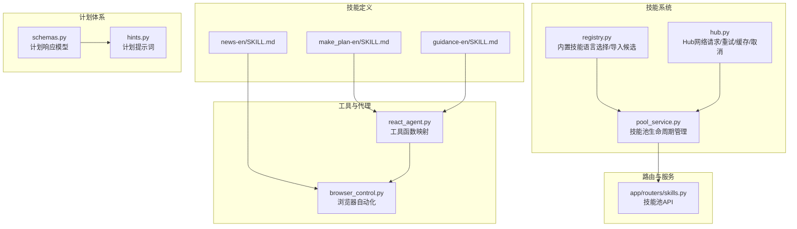
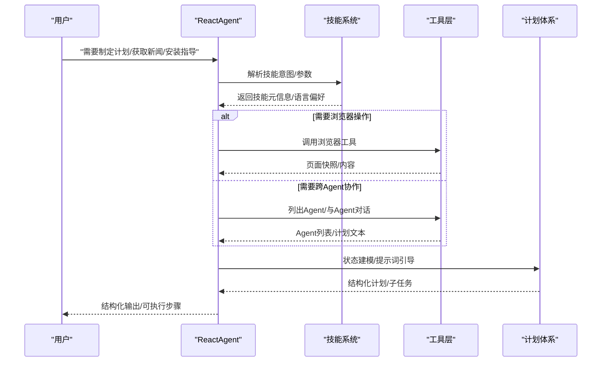
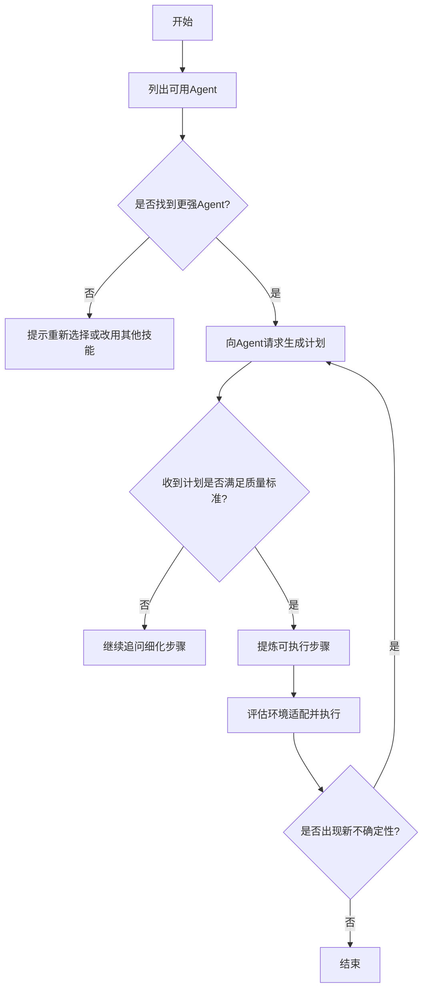
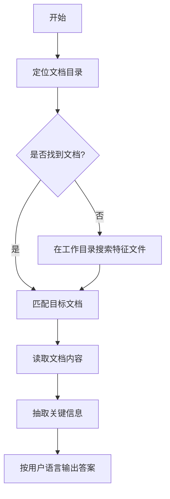
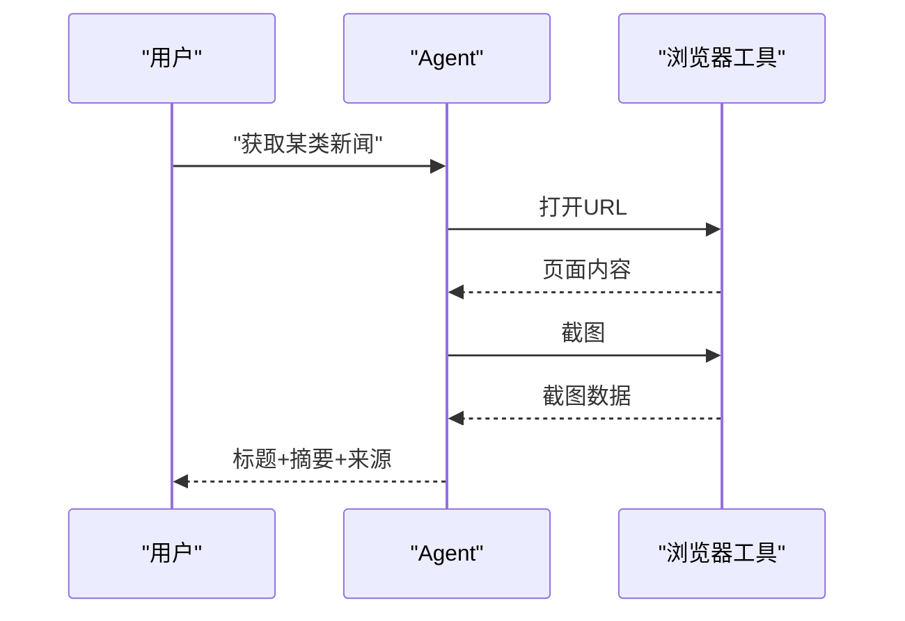
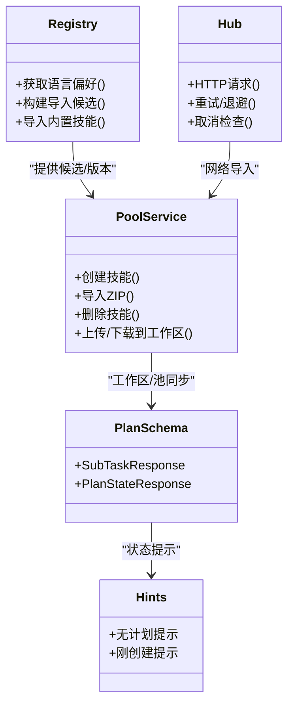
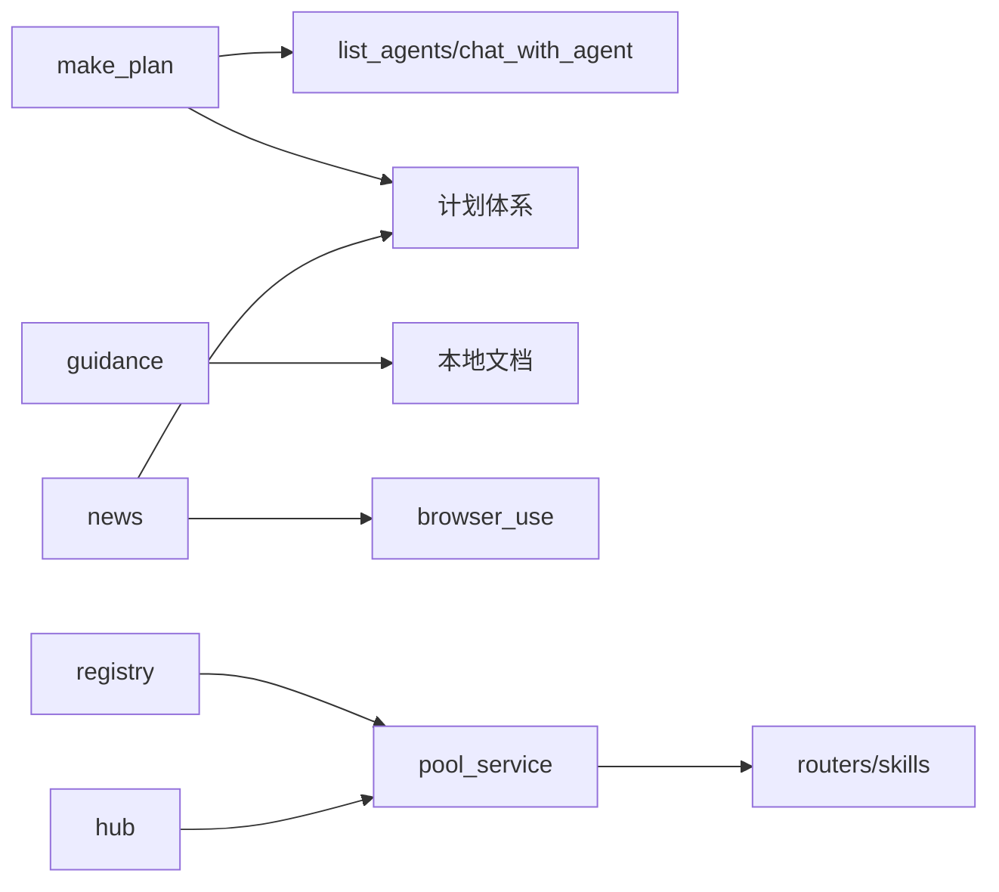

# 核心技能

<cite>
**本文引用的文件**
- [make_plan-en/SKILL.md](file://src/qwenpaw/agents/skills/make_plan-en/SKILL.md)
- [news-en/SKILL.md](file://src/qwenpaw/agents/skills/news-en/SKILL.md)
- [guidance-en/SKILL.md](file://src/qwenpaw/agents/skills/guidance-en/SKILL.md)
- [hub.py](file://src/qwenpaw/agents/skill_system/hub.py)
- [registry.py](file://src/qwenpaw/agents/skill_system/registry.py)
- [pool_service.py](file://src/qwenpaw/agents/skill_system/pool_service.py)
- [schemas.py](file://src/qwenpaw/plan/schemas.py)
- [hints.py](file://src/qwenpaw/plan/hints.py)
- [browser_control.py](file://src/qwenpaw/agents/tools/browser_control.py)
- [react_agent.py](file://src/qwenpaw/agents/react_agent.py)
- [skills.py](file://src/qwenpaw/app/routers/skills.py)
</cite>

## 目录
1. [引言](#引言)
2. [项目结构](#项目结构)
3. [核心组件](#核心组件)
4. [架构总览](#架构总览)
5. [详细组件分析](#详细组件分析)
6. [依赖分析](#依赖分析)
7. [性能考虑](#性能考虑)
8. [故障排除指南](#故障排除指南)
9. [结论](#结论)
10. [附录](#附录)

## 引言
本文件面向QwenPaw“核心技能”的技术文档，聚焦三大关键能力：计划制定（make_plan）、指导建议（guidance）与新闻获取（news）。文档从算法原理、数据来源、处理流程、配置参数、使用示例、与其他技能的协作关系、性能特征与限制、到故障排除与调试方法进行系统化阐述，帮助开发者与使用者高效理解并正确运用这些能力。

## 项目结构
围绕核心技能，代码库在以下层次组织：
- 技能定义层：位于内置技能目录，以SKILL.md描述技能目标、规则、调用方式与质量标准
- 技能系统层：负责技能注册、导入、池化管理与工作区同步
- 工具层：提供浏览器控制、时间、文件与代理沟通等原子能力
- 计划体系：提供计划状态模型与提示词引导
- 路由与服务：对外暴露技能与计划的API接口

图示来源
- [make_plan-en/SKILL.md](file://src/qwenpaw/agents/skills/make_plan-en/SKILL.md)
- [guidance-en/SKILL.md](file://src/qwenpaw/agents/skills/guidance-en/SKILL.md)
- [news-en/SKILL.md](file://src/qwenpaw/agents/skills/news-en/SKILL.md)
- [registry.py](file://src/qwenpaw/agents/skill_system/registry.py)
- [hub.py](file://src/qwenpaw/agents/skill_system/hub.py)
- [pool_service.py](file://src/qwenpaw/agents/skill_system/pool_service.py)
- [browser_control.py](file://src/qwenpaw/agents/tools/browser_control.py)
- [react_agent.py](file://src/qwenpaw/agents/react_agent.py)
- [schemas.py](file://src/qwenpaw/plan/schemas.py)
- [hints.py](file://src/qwenpaw/plan/hints.py)
- [skills.py](file://src/qwenpaw/app/routers/skills.py)

章节来源
- [make_plan-en/SKILL.md](file://src/qwenpaw/agents/skills/make_plan-en/SKILL.md)
- [guidance-en/SKILL.md](file://src/qwenpaw/agents/skills/guidance-en/SKILL.md)
- [news-en/SKILL.md](file://src/qwenpaw/agents/skills/news-en/SKILL.md)
- [registry.py](file://src/qwenpaw/agents/skill_system/registry.py)
- [hub.py](file://src/qwenpaw/agents/skill_system/hub.py)
- [pool_service.py](file://src/qwenpaw/agents/skill_system/pool_service.py)
- [browser_control.py](file://src/qwenpaw/agents/tools/browser_control.py)
- [react_agent.py](file://src/qwenpaw/agents/react_agent.py)
- [schemas.py](file://src/qwenpaw/plan/schemas.py)
- [hints.py](file://src/qwenpaw/plan/hints.py)
- [skills.py](file://src/qwenpaw/app/routers/skills.py)

## 核心组件
- 计划制定（make_plan）
  - 目标：请求更强Agent生成可执行步骤清单，强调“请求计划、不外包执行”
  - 关键流程：列出可用Agent → 选定更强Agent → 请求生成执行计划 → 自行执行并迭代优化
  - 质量标准：步骤明确、顺序清晰、可验证、无秘密委托执行
- 指导建议（guidance）
  - 目标：优先本地文档，其次官方站点，按用户语言回答安装/配置问题
  - 关键流程：定位文档目录 → 文档检索与匹配 → 读取内容 → 提取要点 → 回答
- 新闻获取（news）
  - 目标：从指定新闻源抓取最新资讯，使用浏览器打开页面并截图提取要点
  - 关键流程：确定类别 → 打开URL → 截图 → 提取标题与摘要 → 组织回复

章节来源
- [make_plan-en/SKILL.md](file://src/qwenpaw/agents/skills/make_plan-en/SKILL.md)
- [guidance-en/SKILL.md](file://src/qwenpaw/agents/skills/guidance-en/SKILL.md)
- [news-en/SKILL.md](file://src/qwenpaw/agents/skills/news-en/SKILL.md)

## 架构总览
核心技能通过“技能系统”统一注册与分发，结合“工具层”完成具体动作；计划体系提供状态建模与提示词引导，确保对话与任务执行的一致性。

图示来源
- [react_agent.py](file://src/qwenpaw/agents/react_agent.py)
- [browser_control.py](file://src/qwenpaw/agents/tools/browser_control.py)
- [schemas.py](file://src/qwenpaw/plan/schemas.py)
- [hints.py](file://src/qwenpaw/plan/hints.py)

## 详细组件分析

### 计划制定（make_plan）组件分析
- 功能与目标
  - 通过外部Agent生成“可执行步骤清单”，强调“请求计划、不外包执行”
  - 明确适用场景与误用边界，要求步骤具体、顺序明确、可验证
- 算法与流程
  - 语言偏好与内置技能选择：根据UI语言与设置选择en/zh变体
  - 外部Agent协作：list_agents发现更强Agent，chat_with_agent请求生成计划
  - 步骤提炼与执行：将返回的计划转化为可执行步骤，结合环境调整后自行执行
- 数据来源与处理
  - 内置技能目录中的SKILL.md作为技能定义来源
  - 技能系统根据语言偏好与版本信息构建导入候选
- 配置参数与使用示例
  - 基本调用：list_agents → chat_with_agent(to_agent, text, session_id?)
  - 示例模板：在请求中明确“仅输出计划、不要执行”，并给出任务、目标、约束与输出格式要求
- 与其他技能的协作
  - 与“多智能体协作”技能互补：前者侧重“请求更强Agent生成计划”，后者侧重“多Agent协同执行”
  - 与“计划体系”配合：将生成的计划结构化为子任务，便于跟踪状态
- 性能与限制
  - 依赖外部Agent的响应时延与可用性
  - 对计划质量有严格要求，避免模糊建议导致返工
- 故障排除
  - 若未收到明确步骤，继续追问细化；若被误用为“直接执行”，需纠正行为守则

图示来源
- [make_plan-en/SKILL.md](file://src/qwenpaw/agents/skills/make_plan-en/SKILL.md)

章节来源
- [make_plan-en/SKILL.md](file://src/qwenpaw/agents/skills/make_plan-en/SKILL.md)
- [registry.py](file://src/qwenpaw/agents/skill_system/registry.py)
- [pool_service.py](file://src/qwenpaw/agents/skill_system/pool_service.py)
- [react_agent.py](file://src/qwenpaw/agents/react_agent.py)

### 指导建议（guidance）组件分析
- 功能与目标
  - 安装/配置类问题优先本地文档，其次官方站点，按用户语言回答
- 算法与流程
  - 文档目录定位：优先使用常量路径，回退至内存/源码/工作目录搜索
  - 文档检索：按主题关键词匹配，必要时全文阅读
  - 内容抽取：提取与问题最相关的段落，组织为可复制的步骤/命令/配置
- 数据来源与处理
  - 本地文档目录与文件集合
  - 无法满足时回退至官网
- 配置参数与使用示例
  - 无需额外配置，自动按用户语言输出
- 与其他技能的协作
  - 与“新闻/计划”等技能解耦，独立完成问答
- 性能与限制
  - 受限于文档存在性与完整性
- 故障排除
  - 若本地文档缺失，提示回退官网；若语言不匹配，检查用户语言设置

图示来源
- [guidance-en/SKILL.md](file://src/qwenpaw/agents/skills/guidance-en/SKILL.md)

章节来源
- [guidance-en/SKILL.md](file://src/qwenpaw/agents/skills/guidance-en/SKILL.md)

### 新闻获取（news）组件分析
- 功能与目标
  - 从指定新闻源抓取最新资讯，打开页面并截图提取要点
- 算法与流程
  - 类别与来源映射：政治/金融/社会/世界/科技/体育/娱乐
  - 流程：确定类别 → 打开URL → 截图 → 提取标题/日期/摘要 → 组织回复
- 数据来源与处理
  - 固定新闻源URL集合
  - 使用浏览器工具进行页面打开与截图
- 配置参数与使用示例
  - 通过浏览器工具调用open/snapshot，按类别循环处理
- 与其他技能的协作
  - 与“计划”技能配合：先获取背景信息再制定计划
- 性能与限制
  - 受新闻源稳定性与网络状况影响
  - 页面结构变化可能导致提取失败
- 故障排除
  - 若站点不可达或超时，提示更换来源；若提取失败，建议用户直接打开链接

图示来源
- [news-en/SKILL.md](file://src/qwenpaw/agents/skills/news-en/SKILL.md)
- [browser_control.py](file://src/qwenpaw/agents/tools/browser_control.py)

章节来源
- [news-en/SKILL.md](file://src/qwenpaw/agents/skills/news-en/SKILL.md)
- [browser_control.py](file://src/qwenpaw/agents/tools/browser_control.py)

### 技能系统与计划体系
- 技能系统
  - 内置技能语言选择与导入候选构建
  - 技能池生命周期管理：创建、导入ZIP、删除、上传/下载到工作区
  - Hub网络访问：带重试、指数退避、速率限制处理、取消检查
- 计划体系
  - 计划状态模型：顶层计划与子任务字段定义
  - 提示词引导：无计划/刚创建/等待确认/禁止重复修订等提示

图示来源
- [registry.py](file://src/qwenpaw/agents/skill_system/registry.py)
- [pool_service.py](file://src/qwenpaw/agents/skill_system/pool_service.py)
- [hub.py](file://src/qwenpaw/agents/skill_system/hub.py)
- [schemas.py](file://src/qwenpaw/plan/schemas.py)
- [hints.py](file://src/qwenpaw/plan/hints.py)

章节来源
- [registry.py](file://src/qwenpaw/agents/skill_system/registry.py)
- [pool_service.py](file://src/qwenpaw/agents/skill_system/pool_service.py)
- [hub.py](file://src/qwenpaw/agents/skill_system/hub.py)
- [schemas.py](file://src/qwenpaw/plan/schemas.py)
- [hints.py](file://src/qwenpaw/plan/hints.py)

## 依赖分析
- make_plan
  - 依赖：list_agents、chat_with_agent（代理间协作）
  - 与计划体系：将生成的计划转换为结构化子任务
- guidance
  - 依赖：本地文档目录解析与文件读取
  - 与计划体系：可作为计划制定前的背景知识准备
- news
  - 依赖：browser_use（浏览器自动化）
  - 与计划体系：为计划提供时事背景
- 技能系统
  - 依赖：Hub网络请求、文件系统、JSON清单
  - 与路由：对外提供技能池API（安装/刷新/配置）

图示来源
- [make_plan-en/SKILL.md](file://src/qwenpaw/agents/skills/make_plan-en/SKILL.md)
- [guidance-en/SKILL.md](file://src/qwenpaw/agents/skills/guidance-en/SKILL.md)
- [news-en/SKILL.md](file://src/qwenpaw/agents/skills/news-en/SKILL.md)
- [registry.py](file://src/qwenpaw/agents/skill_system/registry.py)
- [pool_service.py](file://src/qwenpaw/agents/skill_system/pool_service.py)
- [hub.py](file://src/qwenpaw/agents/skill_system/hub.py)
- [browser_control.py](file://src/qwenpaw/agents/tools/browser_control.py)
- [skills.py](file://src/qwenpaw/app/routers/skills.py)

章节来源
- [react_agent.py](file://src/qwenpaw/agents/react_agent.py)
- [browser_control.py](file://src/qwenpaw/agents/tools/browser_control.py)
- [skills.py](file://src/qwenpaw/app/routers/skills.py)

## 性能考虑
- 网络与重试
  - Hub请求采用可配置的超时、重试次数与指数退避策略，支持取消检查
  - GitHub API速率限制检测与提示
- 浏览器自动化
  - 启动/停止策略、空闲回收、下载行为配置、CDP连接与端口分配
- 计划状态建模
  - Pydantic模型保证响应一致性，减少前端解析成本

章节来源
- [hub.py](file://src/qwenpaw/agents/skill_system/hub.py)
- [browser_control.py](file://src/qwenpaw/agents/tools/browser_control.py)
- [schemas.py](file://src/qwenpaw/plan/schemas.py)

## 故障排除指南
- make_plan
  - 若收到模糊建议：继续追问细化步骤
  - 若被误用为“直接执行”：纠正行为守则
- guidance
  - 本地文档缺失：回退至官网；语言不匹配：检查用户语言设置
- news
  - 站点不可达/超时：更换来源；页面结构变化：提示用户直接打开链接
- 技能系统
  - Hub 429/5xx：等待后重试；GITHUB_TOKEN不足：设置令牌提高配额
  - 技能导入冲突：根据提示重命名或覆盖

章节来源
- [make_plan-en/SKILL.md](file://src/qwenpaw/agents/skills/make_plan-en/SKILL.md)
- [guidance-en/SKILL.md](file://src/qwenpaw/agents/skills/guidance-en/SKILL.md)
- [news-en/SKILL.md](file://src/qwenpaw/agents/skills/news-en/SKILL.md)
- [hub.py](file://src/qwenpaw/agents/skill_system/hub.py)
- [pool_service.py](file://src/qwenpaw/agents/skill_system/pool_service.py)

## 结论
核心技能围绕“计划制定、指导建议、新闻获取”三类高频需求设计，通过技能系统实现统一注册与分发，借助工具层完成浏览器自动化与跨Agent协作，并以计划体系提供一致的状态建模与提示词引导。合理配置与参数调优可显著提升用户体验与执行效率；严格的错误处理与故障排除机制有助于稳定运行。

## 附录
- 参数与配置要点
  - make_plan：明确“仅输出计划、不要执行”；提供任务/目标/约束/输出格式
  - news：按类别选择URL；注意页面结构变化与提取失败
  - guidance：按用户语言输出；本地文档缺失时回退官网
  - 技能系统：Hub超时/重试/退避参数；GITHUB_TOKEN；技能池配置与标签
- 使用示例路径
  - make_plan：参考SKILL.md中的推荐调用骨架与请求模板
  - news：参考SKILL.md中的类别与使用流程
  - guidance：参考SKILL.md中的文档定位与检索流程

章节来源
- [make_plan-en/SKILL.md](file://src/qwenpaw/agents/skills/make_plan-en/SKILL.md)
- [news-en/SKILL.md](file://src/qwenpaw/agents/skills/news-en/SKILL.md)
- [guidance-en/SKILL.md](file://src/qwenpaw/agents/skills/guidance-en/SKILL.md)
- [hub.py](file://src/qwenpaw/agents/skill_system/hub.py)
- [pool_service.py](file://src/qwenpaw/agents/skill_system/pool_service.py)
- [browser_control.py](file://src/qwenpaw/agents/tools/browser_control.py)
- [react_agent.py](file://src/qwenpaw/agents/react_agent.py)
- [schemas.py](file://src/qwenpaw/plan/schemas.py)
- [hints.py](file://src/qwenpaw/plan/hints.py)
- [skills.py](file://src/qwenpaw/app/routers/skills.py)