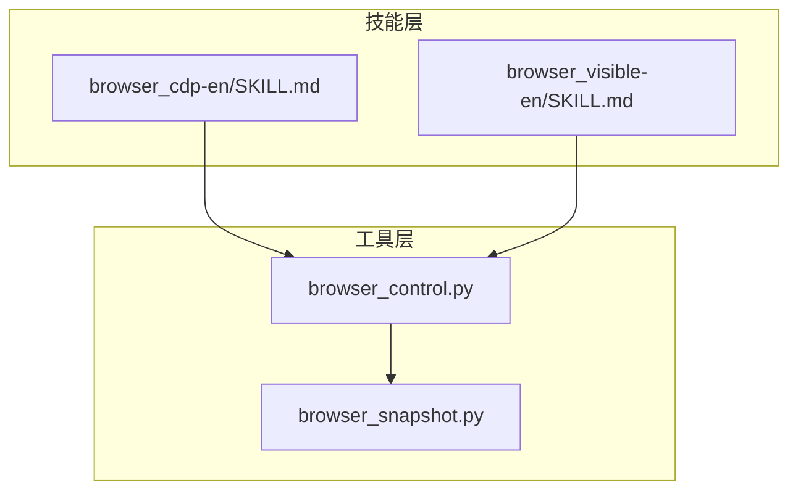
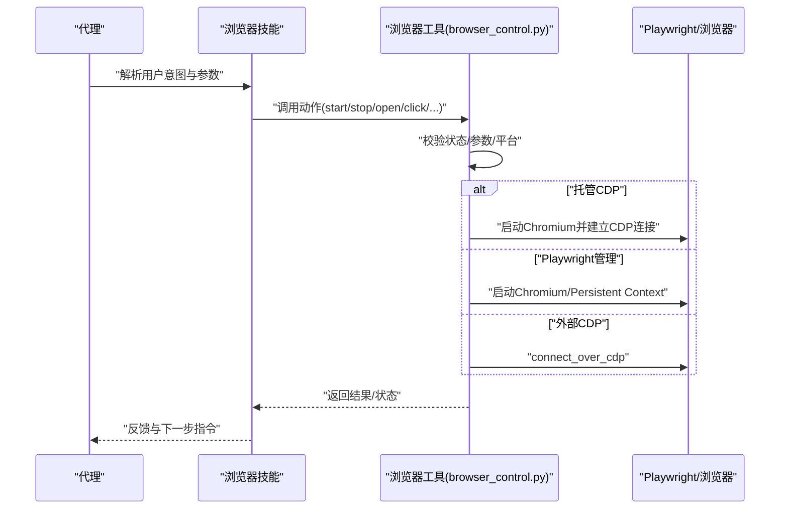
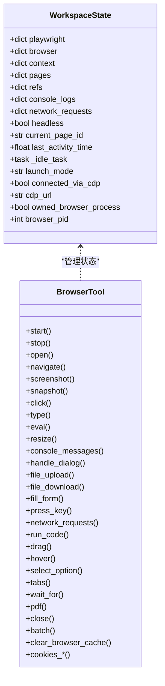
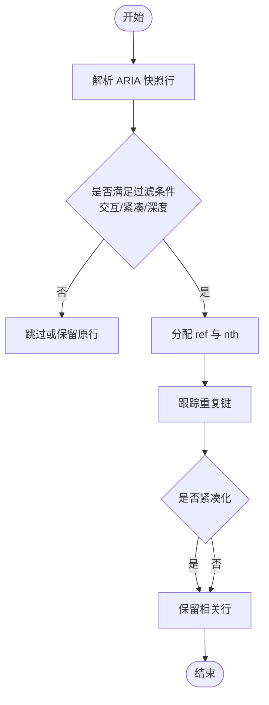
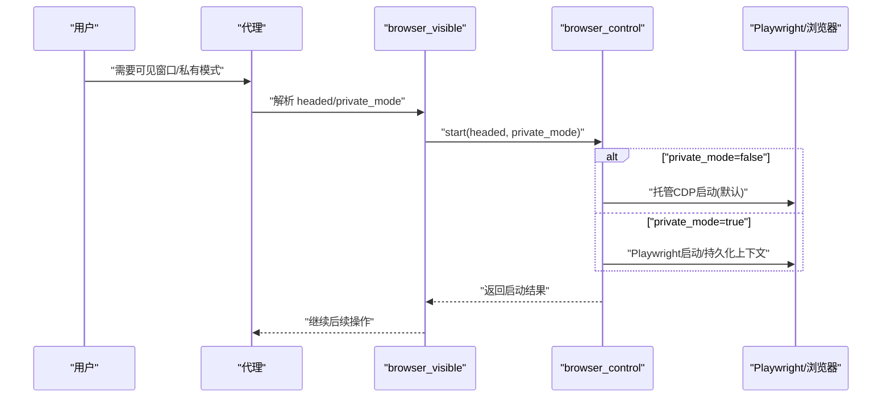
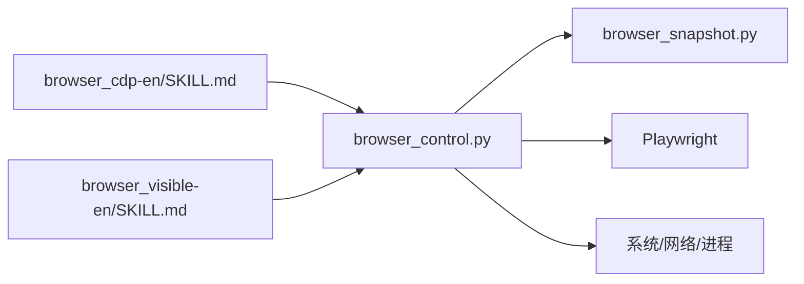

# 浏览器技能

<cite>
**本文引用的文件**
- [browser_control.py](file://src/qwenpaw/agents/tools/browser_control.py)
- [browser_snapshot.py](file://src/qwenpaw/agents/tools/browser_snapshot.py)
- [browser_cdp-en/SKILL.md](file://src/qwenpaw/agents/skills/browser_cdp-en/SKILL.md)
- [browser_visible-en/SKILL.md](file://src/qwenpaw/agents/skills/browser_visible-en/SKILL.md)
- [skills.en.md](file://website/public/docs/skills.en.md)
- [skills.zh.md](file://website/public/docs/skills.zh.md)
</cite>

## 目录
1. [简介](#简介)
2. [项目结构](#项目结构)
3. [核心组件](#核心组件)
4. [架构总览](#架构总览)
5. [详细组件分析](#详细组件分析)
6. [依赖关系分析](#依赖关系分析)
7. [性能考量](#性能考量)
8. [故障排查指南](#故障排查指南)
9. [结论](#结论)
10. [附录](#附录)

## 简介
本技术文档面向 QwenPaw 的浏览器技能，系统阐述“网页浏览、内容抓取与可视化操作”的实现原理与使用方法。重点对比并解释两种浏览器模式：
- CDP 模式（Chrome DevTools Protocol）
- 可见模式（headed，真实窗口）

文档还涵盖配置参数、页面加载、元素定位与交互、安全与隐私限制、实际应用示例、性能优化建议及常见问题处理。

## 项目结构
浏览器技能由“工具层”和“技能层”组成：
- 工具层：统一的浏览器自动化工具，封装 Playwright，提供动作式 API（启动、停止、打开、导航、截图、快照、点击、输入、执行代码、拖拽、悬停、选择选项、标签页、等待、PDF、关闭、下载、上传、表单填充、网络请求、控制台日志、对话框、文件选择器、批处理、清缓存、Cookie 管理等），并维护每工作区的浏览器状态与空闲回收机制。
- 技能层：内置两个浏览器技能，分别面向不同使用场景与隐私需求：
  - browser_cdp：强调显式 CDP 使用（连接现有浏览器、扫描端口、指定端口、共享浏览器实例）。
  - browser_visible：强调窗口可见性与私有模式（Playwright 管理）。

**图表来源**
- [browser_control.py](file://src/qwenpaw/agents/tools/browser_control.py)
- [browser_snapshot.py](file://src/qwenpaw/agents/tools/browser_snapshot.py)
- [browser_cdp-en/SKILL.md](file://src/qwenpaw/agents/skills/browser_cdp-en/SKILL.md)
- [browser_visible-en/SKILL.md](file://src/qwenpaw/agents/skills/browser_visible-en/SKILL.md)

**章节来源**
- [browser_control.py](file://src/qwenpaw/agents/tools/browser_control.py)
- [browser_snapshot.py](file://src/qwenpaw/agents/tools/browser_snapshot.py)
- [browser_cdp-en/SKILL.md](file://src/qwenpaw/agents/skills/browser_cdp-en/SKILL.md)
- [browser_visible-en/SKILL.md](file://src/qwenpaw/agents/skills/browser_visible-en/SKILL.md)

## 核心组件
- 浏览器工具（browser_control.py）
  - 统一的动作式 API：start、stop、open、navigate、screenshot、snapshot、click、type、eval/evaluate、resize、console_messages、handle_dialog、file_upload、file_download、fill_form、press_key、network_requests、run_code、drag、hover、select_option、tabs、wait_for、pdf、close、batch、clear_browser_cache、cookies_* 等。
  - 状态管理：按工作区隔离的浏览器状态，包含上下文、页面、引用表、控制台日志、网络请求、待处理对话框与文件选择器等；支持空闲超时自动停止。
  - 启动策略：默认使用托管 CDP（managed CDP）启动本地 Chrome/Chromium/Edge；可切换到 Playwright 管理（private_mode）；也可连接外部 CDP；支持指定端口与扫描端口。
  - 平台适配：Windows/Uvicorn 热重载下的混合模式（同步 Playwright）；容器与 Windows 的沙箱参数；macOS 无系统 Chromium 时回退 WebKit。
  - 输出与下载：输出目录解析、下载行为配置（CDP 设置）、安全文件名生成。
  - 错误处理：统一包装 ToolResponse，异常捕获与错误消息返回。

- 快照构建（browser_snapshot.py）
  - 基于 Playwright aria_snapshot 输出，构建可交互角色树与引用映射，支持交互元素过滤、紧凑化、最大深度控制、重复项去重与 nth 优化。

- 技能说明（SKILL.md）
  - browser_cdp：显式 CDP 使用场景、端口扫描、连接现有浏览器、固定端口启动、多工作区与端口冲突、停止行为差异、与 browser_visible 的职责划分。
  - browser_visible：窗口可见性与私有模式的选择与组合、何时启用 private_mode、注意事项（桌面占用、不可见环境限制、空闲计时器刷新等）。

**章节来源**
- [browser_control.py](file://src/qwenpaw/agents/tools/browser_control.py)
- [browser_snapshot.py](file://src/qwenpaw/agents/tools/browser_snapshot.py)
- [browser_cdp-en/SKILL.md](file://src/qwenpaw/agents/skills/browser_cdp-en/SKILL.md)
- [browser_visible-en/SKILL.md](file://src/qwenpaw/agents/skills/browser_visible-en/SKILL.md)

## 架构总览
浏览器技能的整体架构围绕“工具层动作 + 技能层意图”展开，工具层负责底层实现，技能层负责参数与场景编排。

**图表来源**
- [browser_control.py](file://src/qwenpaw/agents/tools/browser_control.py)
- [browser_cdp-en/SKILL.md](file://src/qwenpaw/agents/skills/browser_cdp-en/SKILL.md)
- [browser_visible-en/SKILL.md](file://src/qwenpaw/agents/skills/browser_visible-en/SKILL.md)

## 详细组件分析

### 组件A：浏览器工具（browser_control.py）
- 功能概览
  - 启动/停止：支持托管 CDP、Playwright 管理、外部 CDP 连接；自动空闲回收；端口冲突检测；持久化上下文（Cookies/Storage）。
  - 页面与上下文：新标签页监听、页面注册、当前页切换；上下文级事件（console、request/response、dialog、filechooser）。
  - 截图/快照：支持元素级截图、全页截图、帧内截图；基于 aria_snapshot 的角色树与引用构建。
  - 交互操作：点击、输入、按键、拖拽、悬停、选择选项、表单填充、等待元素状态变化、执行代码、PDF 导出、关闭页面。
  - 文件与网络：下载行为配置、文件上传/下载、网络请求追踪、控制台日志收集。
  - 批处理与清理：批量动作、清缓存、Cookie 管理。
- 关键数据结构
  - 工作区状态字典：包含 playwright 实例、browser/context、pages 映射、refs 引用表、console_logs、network_requests、pending_dialogs、pending_file_choosers、headless、page_counter、last_activity_time、idle_task、launch_mode、connected_via_cdp、cdp_url、owned_browser_process、browser_pid、browser_process 等。
  - 引用表 refs：page_id -> ref -> {role, name?, nth?}，配合快照构建与定位器解析。
- 性能与稳定性
  - 空闲超时：默认 10 分钟，后台任务定期检查并停止闲置浏览器，释放渲染进程。
  - 平台适配：Windows/Uvicorn 混合模式（线程池执行同步调用），容器与 Windows 特殊参数，macOS 回退 WebKit。
  - 下载行为：通过 CDP 配置下载路径与事件，避免阻塞。
- 安全与限制
  - 可信浏览器二进制校验：仅接受受信任的浏览器名称关键字。
  - 端口占用检测：显式指定端口时，若端口已被占用则立即报错。
  - 私有模式：禁用 CDP，改用 Playwright 管理，降低其他本地工具通过 CDP 访问的风险。
  - 输出路径：相对路径解析到工作区 browser 目录，避免越权写入。

**图表来源**
- [browser_control.py](file://src/qwenpaw/agents/tools/browser_control.py)

**章节来源**
- [browser_control.py](file://src/qwenpaw/agents/tools/browser_control.py)

### 组件B：快照构建（browser_snapshot.py）
- 功能概览
  - 输入 Playwright aria_snapshot 文本，输出增强的角色树与引用映射。
  - 支持交互元素过滤、紧凑化（去除无意义结构）、最大深度控制。
  - 引用去重与 nth 优化：对重复角色/名称组合进行索引与去冗余。
- 数据流
  - 角色集合：交互角色、内容角色、结构角色三类集合。
  - 解析与增强：逐行解析，为交互元素与带名称的内容元素分配唯一 ref 与 nth。
  - 输出：增强后的树形快照与 refs 映射。

**图表来源**
- [browser_snapshot.py](file://src/qwenpaw/agents/tools/browser_snapshot.py)

**章节来源**
- [browser_snapshot.py](file://src/qwenpaw/agents/tools/browser_snapshot.py)

### 组件C：技能层（browser_cdp 与 browser_visible）
- browser_cdp
  - 场景：扫描本地 CDP 端口、连接现有浏览器、显式指定端口、共享浏览器实例。
  - 停止行为：托管 CDP 启动的浏览器会终止进程；外部 CDP 连接仅断开不关闭外部浏览器。
  - 责任划分：browser_visible 负责窗口可见性与私有模式；browser_cdp 负责 CDP 连接/暴露/端口/扫描。
- browser_visible
  - 参数：headed 控制窗口可见性；private_mode 切换到 Playwright 管理。
  - 使用时机：需要演示、调试或人工参与时开启窗口；需要降低 CDP 暴露风险时启用私有模式。
  - 注意事项：可见模式需图形环境；手动操作通常不刷新空闲计时器；参数不持久化。

**图表来源**
- [browser_visible-en/SKILL.md](file://src/qwenpaw/agents/skills/browser_visible-en/SKILL.md)
- [browser_control.py](file://src/qwenpaw/agents/tools/browser_control.py)

**章节来源**
- [browser_cdp-en/SKILL.md](file://src/qwenpaw/agents/skills/browser_cdp-en/SKILL.md)
- [browser_visible-en/SKILL.md](file://src/qwenpaw/agents/skills/browser_visible-en/SKILL.md)

## 依赖关系分析
- 工具层依赖
  - Playwright（异步/同步）：浏览器驱动、上下文、页面、定位器、CDP 会话。
  - 平台与环境：容器检测、Windows/Uvicorn 混合模式、macOS WebKit 回退、系统默认浏览器探测。
  - 网络与系统：端口扫描、下载行为配置、进程信号与终止。
- 技能层依赖
  - browser_cdp：强调 CDP 端口管理与外部连接。
  - browser_visible：强调窗口可见性与私有模式切换。
- 间接依赖
  - 输出目录与下载路径解析，确保在工作区内安全落盘。
  - 引用表与快照构建，支撑基于角色的元素定位与交互。

**图表来源**
- [browser_control.py](file://src/qwenpaw/agents/tools/browser_control.py)
- [browser_snapshot.py](file://src/qwenpaw/agents/tools/browser_snapshot.py)
- [browser_cdp-en/SKILL.md](file://src/qwenpaw/agents/skills/browser_cdp-en/SKILL.md)
- [browser_visible-en/SKILL.md](file://src/qwenpaw/agents/skills/browser_visible-en/SKILL.md)

**章节来源**
- [browser_control.py](file://src/qwenpaw/agents/tools/browser_control.py)
- [browser_snapshot.py](file://src/qwenpaw/agents/tools/browser_snapshot.py)
- [browser_cdp-en/SKILL.md](file://src/qwenpaw/agents/skills/browser_cdp-en/SKILL.md)
- [browser_visible-en/SKILL.md](file://src/qwenpaw/agents/skills/browser_visible-en/SKILL.md)

## 性能考量
- 空闲回收：默认 10 分钟空闲自动停止，释放渲染进程，避免资源泄漏。
- 平台优化：Windows/Uvicorn 混合模式使用线程池执行同步调用，避免某些平台的异步限制；容器与 Windows 添加沙箱参数；macOS 无系统 Chromium 时回退 WebKit。
- 下载与网络：通过 CDP 配置下载行为，减少阻塞；网络请求与控制台日志按页面聚合，便于诊断。
- 快照与定位：基于 aria_snapshot 的角色树与引用映射，减少复杂选择器带来的性能损耗；交互元素优先，紧凑化输出降低传输与解析成本。

[本节为通用性能建议，无需具体文件分析]

## 故障排查指南
- 启动失败
  - 托管 CDP 需要 Chrome/Chromium/Edge；若未安装或不可用，会抛出错误。可切换到私有模式（Playwright 管理）或安装受支持的浏览器。
  - Windows/Uvicorn 混合模式下，确保线程池可用且无阻塞。
- 端口冲突
  - 显式指定 cdp_port 时，若端口被占用会立即报错；请更换端口或先停止旧进程。
- 外部 CDP 断连
  - 若连接丢失，工具会重置状态并提示重新连接；停止外部 CDP 连接不会关闭外部浏览器进程。
- 可见模式不可用
  - 服务器或无图形环境无法显示窗口；请在具备桌面的环境中使用 headed。
- 下载与权限
  - 下载行为通过 CDP 配置；若下载失败，检查输出目录权限与磁盘空间。
- Cookie 与缓存
  - 可通过 cookies_* 与 clear_browser_cache 清理；注意持久化上下文的 Cookie/Storage 生命周期。

**章节来源**
- [browser_control.py](file://src/qwenpaw/agents/tools/browser_control.py)
- [browser_cdp-en/SKILL.md](file://src/qwenpaw/agents/skills/browser_cdp-en/SKILL.md)
- [browser_visible-en/SKILL.md](file://src/qwenpaw/agents/skills/browser_visible-en/SKILL.md)

## 结论
QwenPaw 的浏览器技能通过统一的工具层与清晰的技能层分工，实现了从“托管 CDP”到“可见窗口/私有模式”的灵活切换。工具层提供完善的动作式 API、状态管理与平台适配，技能层聚焦用户意图与隐私安全。结合快照构建与引用映射，能够高效完成网页浏览、内容抓取与可视化操作。在实际使用中，应根据场景选择合适模式，合理配置参数与安全策略，并关注性能与故障排查。

[本节为总结性内容，无需具体文件分析]

## 附录

### A. 配置参数与使用方法
- 启动参数
  - headed：是否显示窗口（可见模式）
  - private_mode：是否禁用 CDP，改用 Playwright 管理
  - cdp_port：显式指定 CDP 端口（谨慎使用）
  - browser_args：传递给浏览器的额外参数
  - executable_path：指定浏览器可执行路径（需受信任关键字）
- 常用动作
  - start/stop：启动/停止浏览器
  - open/navigate：打开/跳转页面
  - screenshot/snapshot：截图/生成角色快照
  - click/type/press_key：点击/输入/按键
  - fill_form/select_option/hover/drag：表单填充/选择/悬停/拖拽
  - network_requests/console_messages：查看网络与控制台
  - file_download/file_upload：下载/上传
  - run_code/wait_for/tabs/close：执行代码/等待/标签页/关闭
  - batch：批量动作
  - clear_browser_cache：清理缓存
  - cookies_*：Cookie 查询/设置/清除
- 元素定位
  - 支持 ref（来自快照）与选择器；支持 frame_selector 定位到 iframe。

**章节来源**
- [browser_control.py](file://src/qwenpaw/agents/tools/browser_control.py)
- [browser_snapshot.py](file://src/qwenpaw/agents/tools/browser_snapshot.py)
- [browser_cdp-en/SKILL.md](file://src/qwenpaw/agents/skills/browser_cdp-en/SKILL.md)
- [browser_visible-en/SKILL.md](file://src/qwenpaw/agents/skills/browser_visible-en/SKILL.md)

### B. 安全与隐私
- 可信二进制校验：仅允许受信任的浏览器名称关键字。
- 端口占用检测：显式端口冲突立即报错。
- 私有模式：禁用 CDP，降低其他本地工具通过 CDP 访问的风险。
- 输出目录：相对路径解析到工作区 browser 目录，避免越权写入。
- Cookie/缓存：提供清理接口，支持按需清空。

**章节来源**
- [browser_control.py](file://src/qwenpaw/agents/tools/browser_control.py)
- [browser_cdp-en/SKILL.md](file://src/qwenpaw/agents/skills/browser_cdp-en/SKILL.md)
- [browser_visible-en/SKILL.md](file://src/qwenpaw/agents/skills/browser_visible-en/SKILL.md)

### C. 实际应用示例
- 场景一：演示与调试
  - 使用 browser_visible，headed=true，便于观察页面与交互。
- 场景二：隐私优先
  - 使用 browser_visible，private_mode=true，避免 CDP 暴露。
- 场景三：多代理共享
  - 使用 browser_cdp，显式指定 cdp_port，供多个代理共享同一浏览器实例。
- 场景四：外部浏览器接管
  - 使用 browser_cdp，connect_cdp 连接用户已有的 Chrome，直接接管登录态与标签页。

**章节来源**
- [browser_cdp-en/SKILL.md](file://src/qwenpaw/agents/skills/browser_cdp-en/SKILL.md)
- [browser_visible-en/SKILL.md](file://src/qwenpaw/agents/skills/browser_visible-en/SKILL.md)
- [skills.en.md](file://website/public/docs/skills.en.md)
- [skills.zh.md](file://website/public/docs/skills.zh.md)