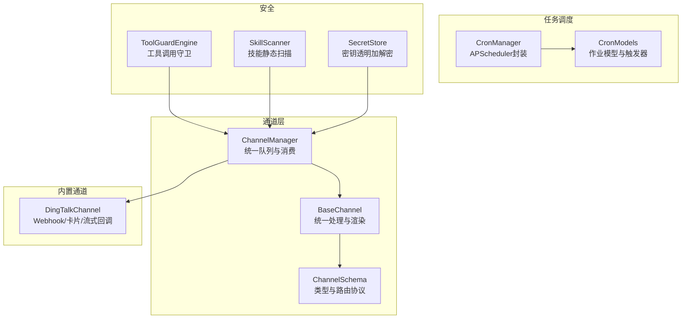
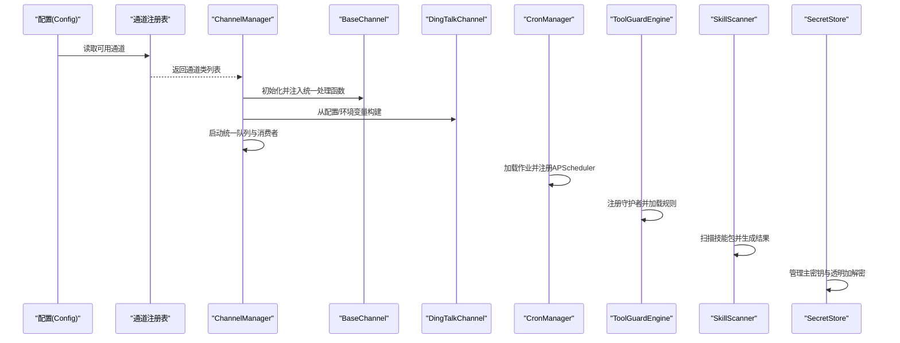
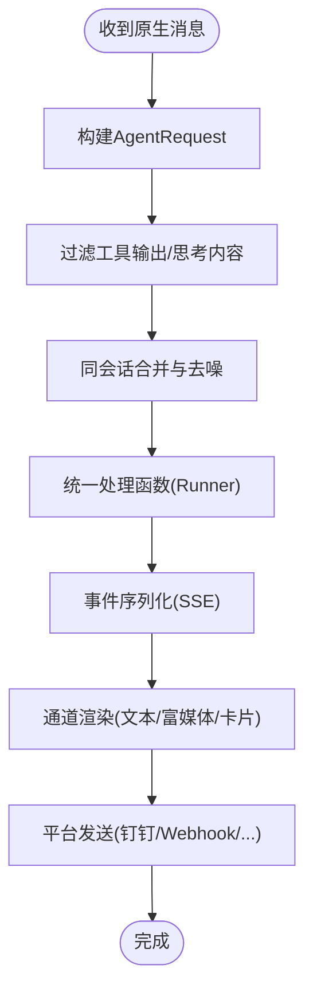
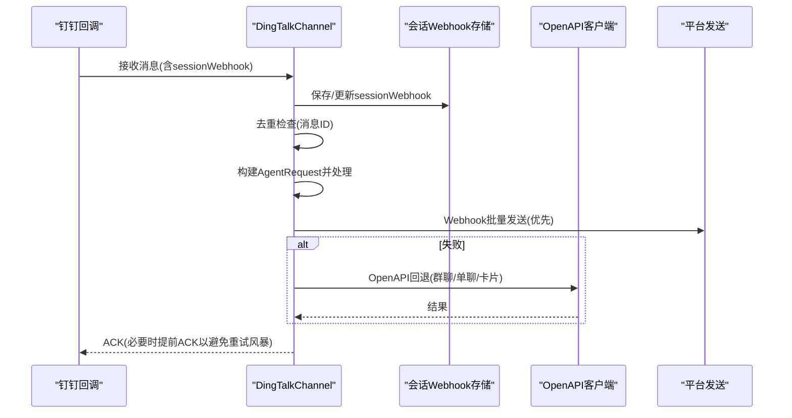
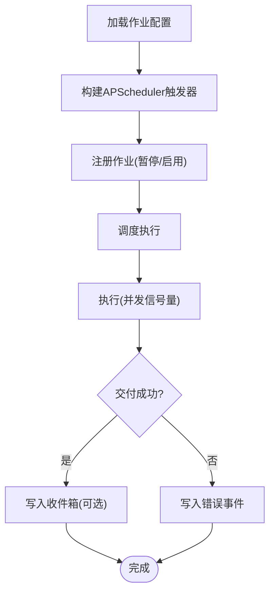
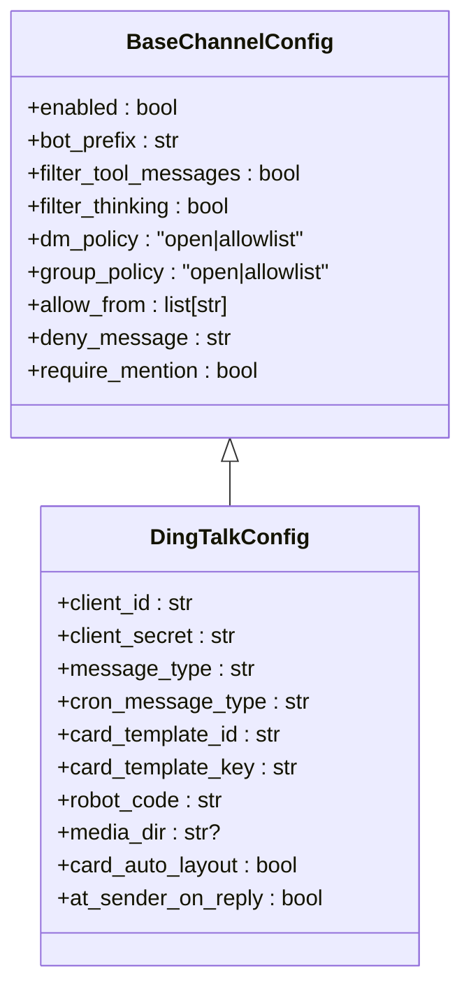
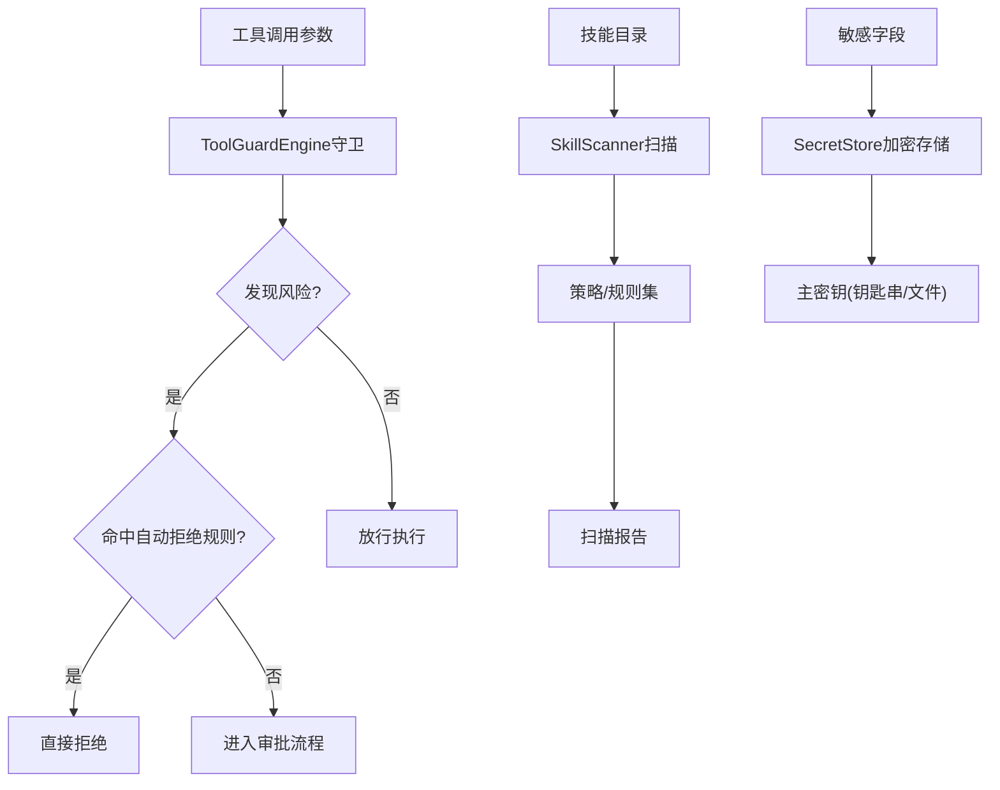
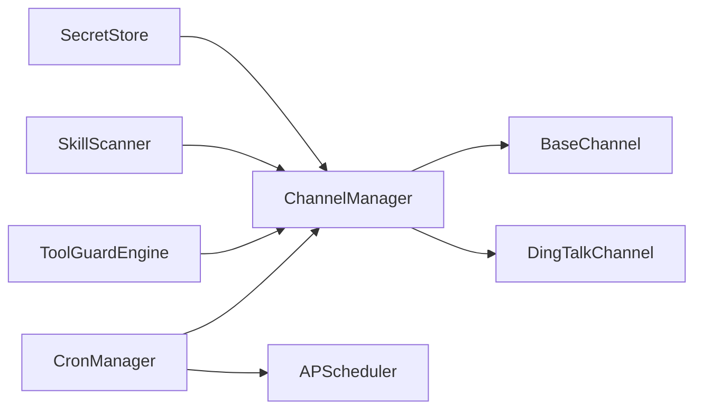

# 通信技能

<cite>
**本文引用的文件**
- [src/qwenpaw/app/channels/base.py](file://src/qwenpaw/app/channels/base.py)
- [src/qwenpaw/app/channels/manager.py](file://src/qwenpaw/app/channels/manager.py)
- [src/qwenpaw/app/channels/schema.py](file://src/qwenpaw/app/channels/schema.py)
- [src/qwenpaw/app/channels/dingtalk/channel.py](file://src/qwenpaw/app/channels/dingtalk/channel.py)
- [src/qwenpaw/app/channels/dingtalk/__init__.py](file://src/qwenpaw/app/channels/dingtalk/__init__.py)
- [src/qwenpaw/app/crons/models.py](file://src/qwenpaw/app/crons/models.py)
- [src/qwenpaw/app/crons/manager.py](file://src/qwenpaw/app/crons/manager.py)
- [src/qwenpaw/config/config.py](file://src/qwenpaw/config/config.py)
- [src/qwenpaw/security/tool_guard/engine.py](file://src/qwenpaw/security/tool_guard/engine.py)
- [src/qwenpaw/security/skill_scanner/scanner.py](file://src/qwenpaw/security/skill_scanner/scanner.py)
- [src/qwenpaw/security/secret_store.py](file://src/qwenpaw/security/secret_store.py)
- [tests/unit/channels/test_dingtalk.py](file://tests/unit/channels/test_dingtalk.py)
- [tests/unit/security/test_secret_store.py](file://tests/unit/security/test_secret_store.py)
- [console/src/api/types/channel.ts](file://console/src/api/types/channel.ts)
- [console/src/pages/Control/Channels/components/constants.ts](file://console/src/pages/Control/Channels/components/constants.ts)
</cite>

## 目录
1. [简介](#简介)
2. [项目结构](#项目结构)
3. [核心组件](#核心组件)
4. [架构总览](#架构总览)
5. [详细组件分析](#详细组件分析)
6. [依赖分析](#依赖分析)
7. [性能考虑](#性能考虑)
8. [故障排查指南](#故障排查指南)
9. [结论](#结论)
10. [附录](#附录)

## 简介
本技术文档聚焦于 QwenPaw 的“通信技能”，系统性阐述消息发送、代理对话、定时任务与钉钉频道等通信相关能力。内容涵盖：
- 协议支持、消息格式与传输机制
- 配置项与集成方式（含多平台适配）
- 安全机制与权限控制（含消息加密与访问限制）
- 实际应用场景与最佳实践
- 常见问题与排障建议

## 项目结构
围绕通信技能的关键目录与模块如下：
- 通道框架：统一的消息入队、去重、合并与消费流程
- 通道管理器：集中启动/停止各通道，统一排队与并发控制
- 通道类型定义：内置通道类型与路由协议
- 钉钉通道：实现 DingTalk Webhook/卡片/流式回调等能力
- 定时任务：基于 APScheduler 的计划任务与心跳
- 安全体系：工具调用守卫、技能扫描、密钥存储

图示来源
- [src/qwenpaw/app/channels/base.py:78-168](file://src/qwenpaw/app/channels/base.py#L78-L168)
- [src/qwenpaw/app/channels/manager.py:68-120](file://src/qwenpaw/app/channels/manager.py#L68-L120)
- [src/qwenpaw/app/channels/schema.py:12-50](file://src/qwenpaw/app/channels/schema.py#L12-L50)
- [src/qwenpaw/app/channels/dingtalk/channel.py:112-180](file://src/qwenpaw/app/channels/dingtalk/channel.py#L112-L180)
- [src/qwenpaw/app/crons/manager.py:42-66](file://src/qwenpaw/app/crons/manager.py#L42-L66)
- [src/qwenpaw/app/crons/models.py:58-107](file://src/qwenpaw/app/crons/models.py#L58-L107)
- [src/qwenpaw/security/tool_guard/engine.py:54-110](file://src/qwenpaw/security/tool_guard/engine.py#L54-L110)
- [src/qwenpaw/security/skill_scanner/scanner.py:76-138](file://src/qwenpaw/security/skill_scanner/scanner.py#L76-L138)
- [src/qwenpaw/security/secret_store.py:1-60](file://src/qwenpaw/security/secret_store.py#L1-L60)

章节来源
- [src/qwenpaw/app/channels/base.py:78-168](file://src/qwenpaw/app/channels/base.py#L78-L168)
- [src/qwenpaw/app/channels/manager.py:68-120](file://src/qwenpaw/app/channels/manager.py#L68-L120)
- [src/qwenpaw/app/channels/schema.py:12-50](file://src/qwenpaw/app/channels/schema.py#L12-L50)
- [src/qwenpaw/app/channels/dingtalk/channel.py:112-180](file://src/qwenpaw/app/channels/dingtalk/channel.py#L112-L180)
- [src/qwenpaw/app/crons/manager.py:42-66](file://src/qwenpaw/app/crons/manager.py#L42-L66)
- [src/qwenpaw/app/crons/models.py:58-107](file://src/qwenpaw/app/crons/models.py#L58-L107)
- [src/qwenpaw/security/tool_guard/engine.py:54-110](file://src/qwenpaw/security/tool_guard/engine.py#L54-L110)
- [src/qwenpaw/security/skill_scanner/scanner.py:76-138](file://src/qwenpaw/security/skill_scanner/scanner.py#L76-L138)
- [src/qwenpaw/security/secret_store.py:1-60](file://src/qwenpaw/security/secret_store.py#L1-L60)

## 核心组件
- BaseChannel：抽象通道基类，定义统一的消息入队、去重、合并、渲染与事件分发；支持流式钩子与工具输出过滤。
- ChannelManager：集中管理通道生命周期、统一队列与批量合并；支持动态替换通道实例。
- ChannelSchema：内置通道类型集合与路由协议，统一 send/receive 转换。
- DingTalkChannel：钉钉通道实现，支持 Webhook 多消息发送、卡片消息、流式回调、会话去重、令牌缓存与 OpenAPI 回退。
- CronManager/CronModels：基于 APScheduler 的计划任务管理，支持一次性与周期性任务、重复策略、超时与并发控制。
- 安全组件：工具调用守卫、技能静态扫描、密钥透明加解密。

章节来源
- [src/qwenpaw/app/channels/base.py:78-168](file://src/qwenpaw/app/channels/base.py#L78-L168)
- [src/qwenpaw/app/channels/manager.py:68-120](file://src/qwenpaw/app/channels/manager.py#L68-L120)
- [src/qwenpaw/app/channels/schema.py:12-50](file://src/qwenpaw/app/channels/schema.py#L12-L50)
- [src/qwenpaw/app/channels/dingtalk/channel.py:112-180](file://src/qwenpaw/app/channels/dingtalk/channel.py#L112-L180)
- [src/qwenpaw/app/crons/manager.py:42-66](file://src/qwenpaw/app/crons/manager.py#L42-L66)
- [src/qwenpaw/app/crons/models.py:58-107](file://src/qwenpaw/app/crons/models.py#L58-L107)
- [src/qwenpaw/security/tool_guard/engine.py:54-110](file://src/qwenpaw/security/tool_guard/engine.py#L54-L110)
- [src/qwenpaw/security/skill_scanner/scanner.py:76-138](file://src/qwenpaw/security/skill_scanner/scanner.py#L76-L138)
- [src/qwenpaw/security/secret_store.py:1-60](file://src/qwenpaw/security/secret_store.py#L1-L60)

## 架构总览
下图展示从配置到通道、再到任务调度与安全控制的整体架构：

图示来源
- [src/qwenpaw/app/channels/manager.py:89-120](file://src/qwenpaw/app/channels/manager.py#L89-L120)
- [src/qwenpaw/app/channels/dingtalk/channel.py:236-326](file://src/qwenpaw/app/channels/dingtalk/channel.py#L236-L326)
- [src/qwenpaw/app/crons/manager.py:68-105](file://src/qwenpaw/app/crons/manager.py#L68-L105)
- [src/qwenpaw/security/tool_guard/engine.py:66-110](file://src/qwenpaw/security/tool_guard/engine.py#L66-L110)
- [src/qwenpaw/security/skill_scanner/scanner.py:100-138](file://src/qwenpaw/security/skill_scanner/scanner.py#L100-L138)
- [src/qwenpaw/security/secret_store.py:34-60](file://src/qwenpaw/security/secret_store.py#L34-L60)

## 详细组件分析

### 消息发送与代理对话
- 统一处理流程：BaseChannel 将外部原生消息转换为 AgentRequest，经统一处理函数（Runner）产生事件流（SSE），再由通道将事件渲染为平台消息。
- 去重与合并：对同一会话内的快速消息进行时间窗口合并，减少平台压力；钉钉通道支持会话 Webhook 批量发送。
- 流式钩子：当通道启用流式时，推理与消息事件可走流式钩子路径，同时保留非流式完成事件路径。
- 工具输出过滤：可按配置过滤工具输出或思考内容，避免冗余信息。

图示来源
- [src/qwenpaw/app/channels/base.py:415-747](file://src/qwenpaw/app/channels/base.py#L415-L747)
- [src/qwenpaw/app/channels/dingtalk/channel.py:776-800](file://src/qwenpaw/app/channels/dingtalk/channel.py#L776-L800)

章节来源
- [src/qwenpaw/app/channels/base.py:415-747](file://src/qwenpaw/app/channels/base.py#L415-L747)
- [src/qwenpaw/app/channels/dingtalk/channel.py:776-800](file://src/qwenpaw/app/channels/dingtalk/channel.py#L776-L800)

### 钉钉频道（DingTalk）
- 会话 Webhook 存储：在消息进入时保存 sessionWebhook，用于后续主动推送；支持磁盘持久化与过期管理。
- 会话去重：通过消息 ID 去重，防止重复处理；并发场景下线程安全。
- 发送路径：优先使用 Webhook 批量发送；失败时回退至 OpenAPI（组织级机器人/卡片）。
- 卡片消息：支持 AI 卡片状态流转与自动布局；支持预取令牌与最小刷新间隔。
- 环境变量与配置：支持从环境变量注入关键参数（如 client_id/secret、消息类型、模板等）。

图示来源
- [src/qwenpaw/app/channels/dingtalk/channel.py:332-403](file://src/qwenpaw/app/channels/dingtalk/channel.py#L332-L403)
- [src/qwenpaw/app/channels/dingtalk/channel.py:587-610](file://src/qwenpaw/app/channels/dingtalk/channel.py#L587-L610)
- [src/qwenpaw/app/channels/dingtalk/channel.py:616-735](file://src/qwenpaw/app/channels/dingtalk/channel.py#L616-L735)
- [tests/unit/channels/test_dingtalk.py:619-642](file://tests/unit/channels/test_dingtalk.py#L619-L642)

章节来源
- [src/qwenpaw/app/channels/dingtalk/channel.py:332-403](file://src/qwenpaw/app/channels/dingtalk/channel.py#L332-L403)
- [src/qwenpaw/app/channels/dingtalk/channel.py:587-610](file://src/qwenpaw/app/channels/dingtalk/channel.py#L587-L610)
- [src/qwenpaw/app/channels/dingtalk/channel.py:616-735](file://src/qwenpaw/app/channels/dingtalk/channel.py#L616-L735)
- [tests/unit/channels/test_dingtalk.py:619-642](file://tests/unit/channels/test_dingtalk.py#L619-L642)

### 定时任务（Cron）
- 触发器：支持 cron、一次性、间隔触发；day_of_week 使用英文缩写标准化。
- 并发与超时：每作业独立信号量控制并发；可配置超时与错失宽限。
- 结果归档：执行记录与状态持久化；可选择是否将结果写入收件箱。
- 心跳与优化：支持心跳任务与基于 cron 的内存优化任务。

图示来源
- [src/qwenpaw/app/crons/models.py:58-148](file://src/qwenpaw/app/crons/models.py#L58-L148)
- [src/qwenpaw/app/crons/manager.py:343-428](file://src/qwenpaw/app/crons/manager.py#L343-L428)
- [src/qwenpaw/app/crons/manager.py:499-631](file://src/qwenpaw/app/crons/manager.py#L499-L631)

章节来源
- [src/qwenpaw/app/crons/models.py:58-148](file://src/qwenpaw/app/crons/models.py#L58-L148)
- [src/qwenpaw/app/crons/manager.py:343-428](file://src/qwenpaw/app/crons/manager.py#L343-L428)
- [src/qwenpaw/app/crons/manager.py:499-631](file://src/qwenpaw/app/crons/manager.py#L499-L631)

### 通道配置与集成
- 通道注册与初始化：从配置或环境变量创建通道实例；支持按通道键过滤可用通道。
- 通用配置项：启用开关、前缀、工具输出过滤、思考内容过滤、私聊/群组策略、白名单、提及要求等。
- 平台特定配置：例如钉钉的 client_id/secret、消息类型、卡片模板、机器人编码、媒体目录、自动布局、@发送者等。
- 控制台前端映射：通道类型在前端显示与交互中对应不同配置表单。

图示来源
- [src/qwenpaw/config/config.py:191-232](file://src/qwenpaw/config/config.py#L191-L232)
- [src/qwenpaw/config/config.py:221-232](file://src/qwenpaw/config/config.py#L221-L232)
- [console/src/api/types/channel.ts:58-110](file://console/src/api/types/channel.ts#L58-L110)
- [console/src/pages/Control/Channels/components/constants.ts:7-24](file://console/src/pages/Control/Channels/components/constants.ts#L7-L24)

章节来源
- [src/qwenpaw/config/config.py:191-232](file://src/qwenpaw/config/config.py#L191-L232)
- [src/qwenpaw/config/config.py:221-232](file://src/qwenpaw/config/config.py#L221-L232)
- [console/src/api/types/channel.ts:58-110](file://console/src/api/types/channel.ts#L58-L110)
- [console/src/pages/Control/Channels/components/constants.ts:7-24](file://console/src/pages/Control/Channels/components/constants.ts#L7-L24)

### 权限控制与安全机制
- 工具调用守卫：在工具调用前扫描参数，支持默认规则集与自动拒绝规则；可按需启用/禁用。
- 技能扫描：对技能包进行静态扫描，去重发现、限制文件数量与大小、跳过不必要扩展名。
- 密钥存储：透明加密存储敏感字段（API Key、Token 等），主密钥来自系统钥匙串或本地文件，支持恢复后重新加载。

图示来源
- [src/qwenpaw/security/tool_guard/engine.py:200-257](file://src/qwenpaw/security/tool_guard/engine.py#L200-L257)
- [src/qwenpaw/security/skill_scanner/scanner.py:148-242](file://src/qwenpaw/security/skill_scanner/scanner.py#L148-L242)
- [src/qwenpaw/security/secret_store.py:324-357](file://src/qwenpaw/security/secret_store.py#L324-L357)

章节来源
- [src/qwenpaw/security/tool_guard/engine.py:200-257](file://src/qwenpaw/security/tool_guard/engine.py#L200-L257)
- [src/qwenpaw/security/skill_scanner/scanner.py:148-242](file://src/qwenpaw/security/skill_scanner/scanner.py#L148-L242)
- [src/qwenpaw/security/secret_store.py:324-357](file://src/qwenpaw/security/secret_store.py#L324-L357)

## 依赖分析
- 通道耦合：ChannelManager 作为中枢，依赖 BaseChannel 的统一接口；具体通道（如 DingTalk）通过注册表按键加载。
- 任务调度：CronManager 依赖 APScheduler，作业模型定义触发器与运行时参数。
- 安全依赖：工具守卫与技能扫描相互独立，密钥存储为底层基础设施。

图示来源
- [src/qwenpaw/app/channels/manager.py:68-120](file://src/qwenpaw/app/channels/manager.py#L68-L120)
- [src/qwenpaw/app/crons/manager.py:42-66](file://src/qwenpaw/app/crons/manager.py#L42-L66)
- [src/qwenpaw/security/tool_guard/engine.py:54-110](file://src/qwenpaw/security/tool_guard/engine.py#L54-L110)
- [src/qwenpaw/security/skill_scanner/scanner.py:76-138](file://src/qwenpaw/security/skill_scanner/scanner.py#L76-L138)
- [src/qwenpaw/security/secret_store.py:1-60](file://src/qwenpaw/security/secret_store.py#L1-L60)

章节来源
- [src/qwenpaw/app/channels/manager.py:68-120](file://src/qwenpaw/app/channels/manager.py#L68-L120)
- [src/qwenpaw/app/crons/manager.py:42-66](file://src/qwenpaw/app/crons/manager.py#L42-L66)
- [src/qwenpaw/security/tool_guard/engine.py:54-110](file://src/qwenpaw/security/tool_guard/engine.py#L54-L110)
- [src/qwenpaw/security/skill_scanner/scanner.py:76-138](file://src/qwenpaw/security/skill_scanner/scanner.py#L76-L138)
- [src/qwenpaw/security/secret_store.py:1-60](file://src/qwenpaw/security/secret_store.py#L1-L60)

## 性能考虑
- 消息合并与去噪：BaseChannel 对无文本内容的消息进行缓冲合并，减少平台往返；钉钉 Webhook 支持批量发送。
- 并发控制：CronManager 为每个作业维护独立信号量，避免资源争用；ChannelManager 统一队列上限与清理循环。
- 流式优化：钉钉通道在长生成期间可提前 ACK，避免平台重试风暴，提升吞吐。
- 缓存与令牌：钉钉通道对访问令牌进行实例级缓存与过期控制，降低频繁获取成本。

章节来源
- [src/qwenpaw/app/channels/base.py:290-322](file://src/qwenpaw/app/channels/base.py#L290-L322)
- [src/qwenpaw/app/channels/dingtalk/channel.py:226-234](file://src/qwenpaw/app/channels/dingtalk/channel.py#L226-L234)
- [src/qwenpaw/app/crons/manager.py:349-352](file://src/qwenpaw/app/crons/manager.py#L349-L352)

## 故障排查指南
- 钉钉重复消息：检查去重集合与消息 ID；确认并发场景下的锁保护。
  - 参考：[tests/unit/channels/test_dingtalk.py:619-642](file://tests/unit/channels/test_dingtalk.py#L619-L642)
- Webhook 发送失败：查看会话 Webhook 是否为空或过期；尝试 OpenAPI 回退路径。
  - 参考：[src/qwenpaw/app/channels/dingtalk/channel.py:587-610](file://src/qwenpaw/app/channels/dingtalk/channel.py#L587-L610)
- 会话 Webhook 存储：确认磁盘持久化路径与并发写入锁。
  - 参考：[src/qwenpaw/app/channels/dingtalk/channel.py:423-475](file://src/qwenpaw/app/channels/dingtalk/channel.py#L423-L475)
- 工具调用被拒：检查守卫规则与自动拒绝规则；必要时调整仅运行的守护者。
  - 参考：[src/qwenpaw/security/tool_guard/engine.py:177-188](file://src/qwenpaw/security/tool_guard/engine.py#L177-L188)
- 技能扫描异常：确认策略、文件数量/大小限制与跳过扩展名集合。
  - 参考：[src/qwenpaw/security/skill_scanner/scanner.py:100-138](file://src/qwenpaw/security/skill_scanner/scanner.py#L100-L138)
- 密钥解密失败：确认主密钥存在且未被篡改；恢复后重新加载主密钥。
  - 参考：[tests/unit/security/test_secret_store.py:114-138](file://tests/unit/security/test_secret_store.py#L114-L138), [src/qwenpaw/security/secret_store.py:329-357](file://src/qwenpaw/security/secret_store.py#L329-L357)

章节来源
- [tests/unit/channels/test_dingtalk.py:619-642](file://tests/unit/channels/test_dingtalk.py#L619-L642)
- [src/qwenpaw/app/channels/dingtalk/channel.py:587-610](file://src/qwenpaw/app/channels/dingtalk/channel.py#L587-L610)
- [src/qwenpaw/app/channels/dingtalk/channel.py:423-475](file://src/qwenpaw/app/channels/dingtalk/channel.py#L423-L475)
- [src/qwenpaw/security/tool_guard/engine.py:177-188](file://src/qwenpaw/security/tool_guard/engine.py#L177-L188)
- [src/qwenpaw/security/skill_scanner/scanner.py:100-138](file://src/qwenpaw/security/skill_scanner/scanner.py#L100-L138)
- [tests/unit/security/test_secret_store.py:114-138](file://tests/unit/security/test_secret_store.py#L114-L138)
- [src/qwenpaw/security/secret_store.py:329-357](file://src/qwenpaw/security/secret_store.py#L329-L357)

## 结论
QwenPaw 的通信技能通过统一的通道框架、灵活的配置与强大的安全体系，实现了跨平台、高可靠、可扩展的通信能力。钉钉通道提供了完善的 Webhook/卡片/流式回调支持；Cron 系统保障了定时任务的稳定性与可观测性；安全组件贯穿工具调用、技能安装与密钥存储全过程。结合本文提供的配置、集成与排障建议，可在生产环境中稳定落地各类通信场景。

## 附录
- 内置通道类型与路由协议参考：[src/qwenpaw/app/channels/schema.py:12-50](file://src/qwenpaw/app/channels/schema.py#L12-L50)
- 钉钉通道导出入口：[src/qwenpaw/app/channels/dingtalk/__init__.py:1-6](file://src/qwenpaw/app/channels/dingtalk/__init__.py#L1-L6)
- 通道配置模型（含钉钉）：[src/qwenpaw/config/config.py:221-232](file://src/qwenpaw/config/config.py#L221-L232)
- 前端通道标签与类型映射：[console/src/pages/Control/Channels/components/constants.ts:7-24](file://console/src/pages/Control/Channels/components/constants.ts#L7-L24), [console/src/api/types/channel.ts:58-110](file://console/src/api/types/channel.ts#L58-L110)