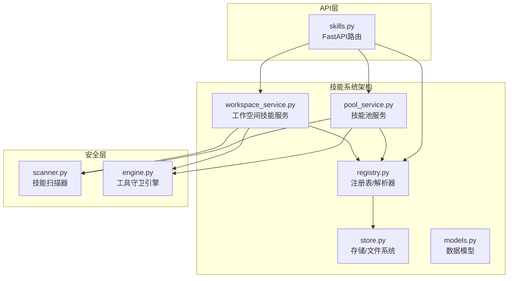
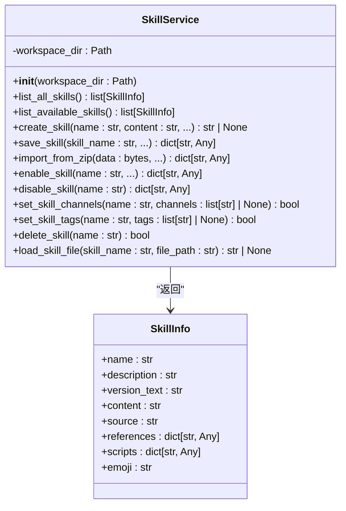
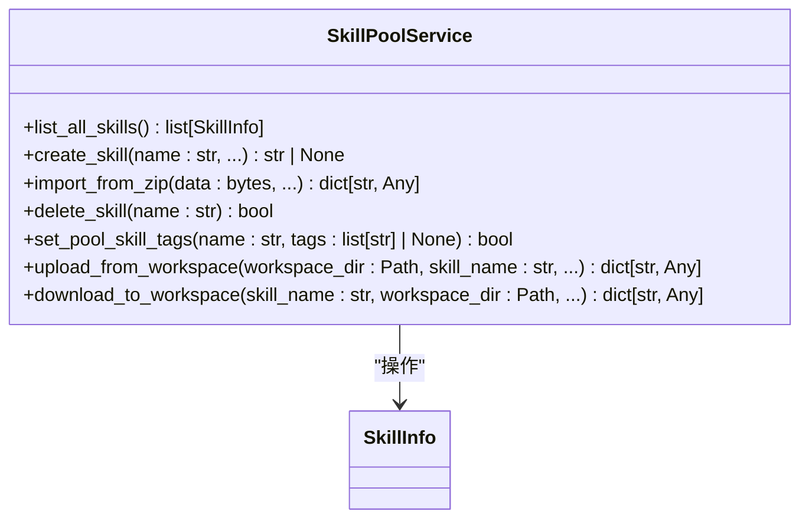
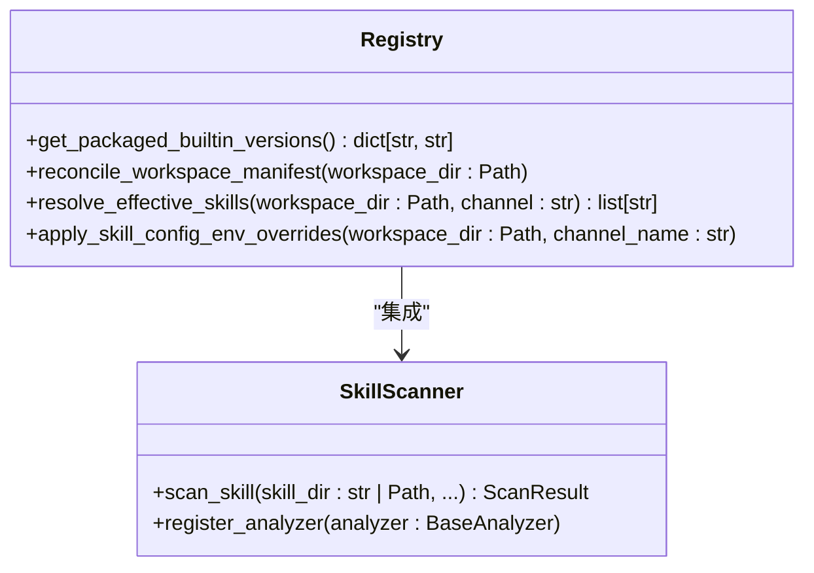
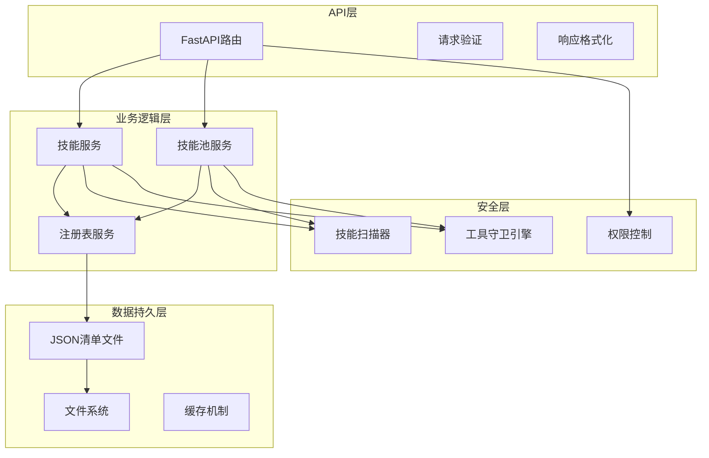
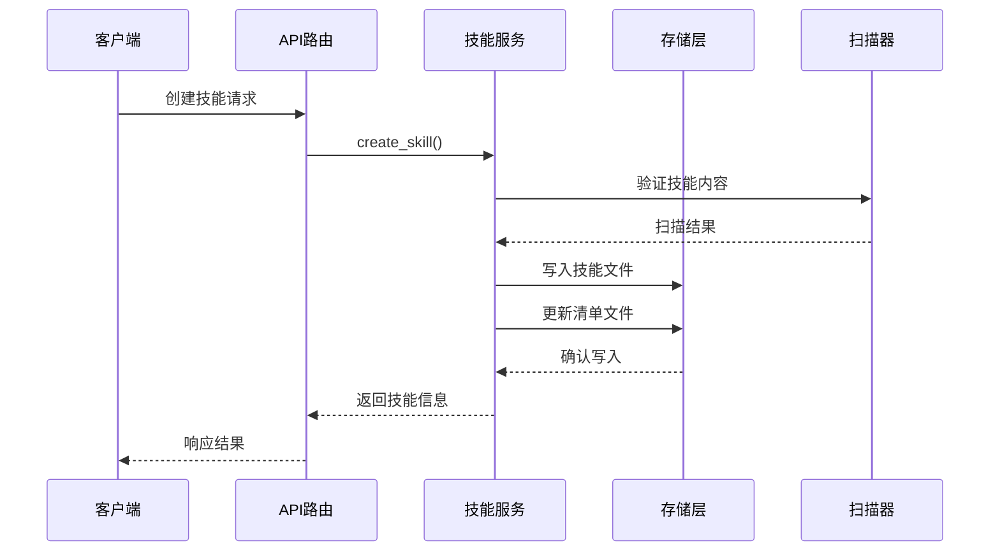
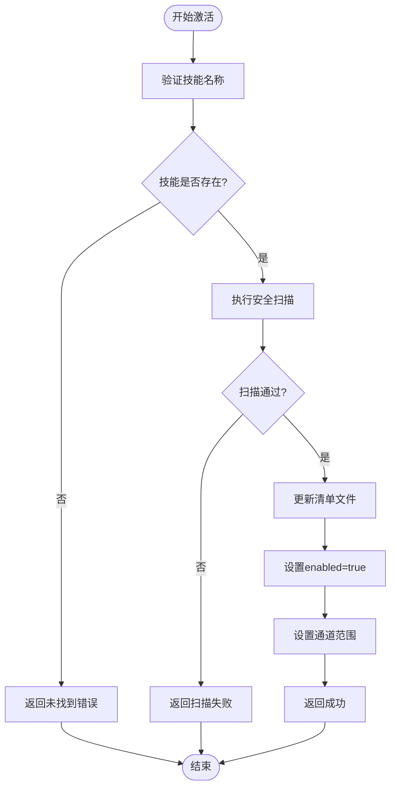
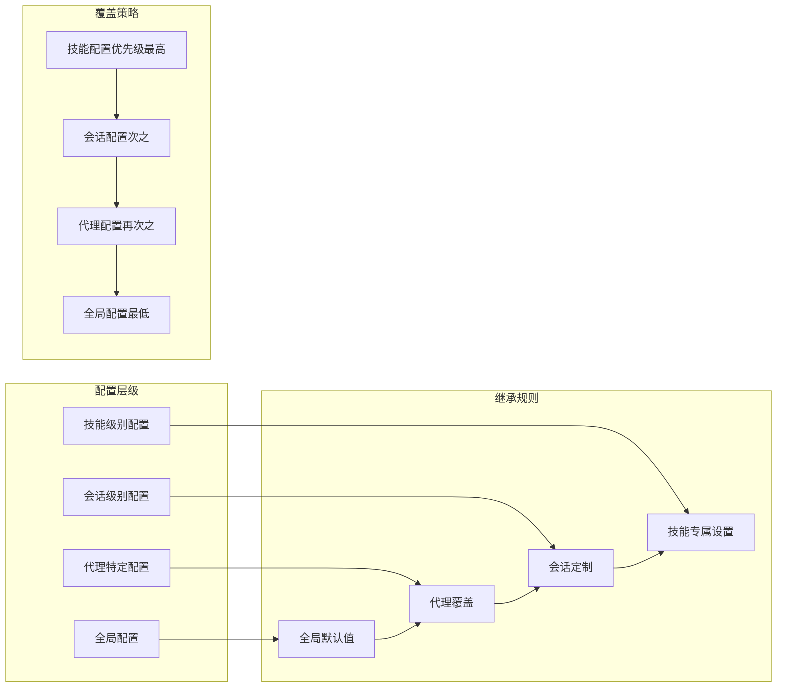
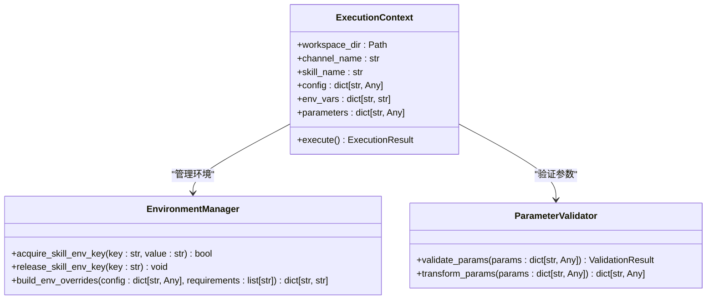
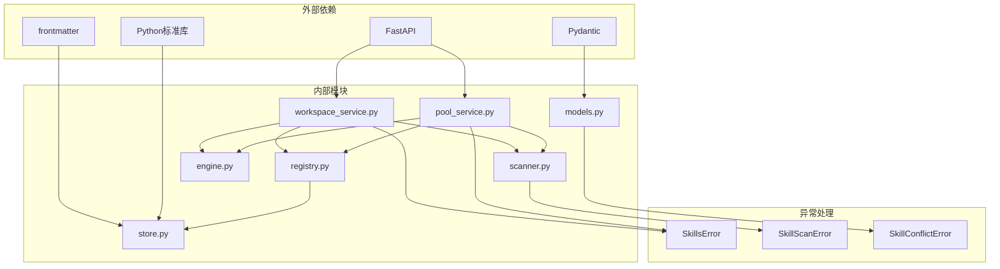

# 工作空间技能服务

<cite>
**本文档引用的文件**
- [workspace_service.py](file://src/qwenpaw/agents/skill_system/workspace_service.py)
- [pool_service.py](file://src/qwenpaw/agents/skill_system/pool_service.py)
- [registry.py](file://src/qwenpaw/agents/skill_system/registry.py)
- [store.py](file://src/qwenpaw/agents/skill_system/store.py)
- [models.py](file://src/qwenpaw/agents/skill_system/models.py)
- [skills.py](file://src/qwenpaw/app/routers/skills.py)
- [scanner.py](file://src/qwenpaw/security/skill_scanner/scanner.py)
- [engine.py](file://src/qwenpaw/security/tool_guard/engine.py)
</cite>

## 目录
1. [简介](#简介)
2. [项目结构](#项目结构)
3. [核心组件](#核心组件)
4. [架构概览](#架构概览)
5. [详细组件分析](#详细组件分析)
6. [依赖关系分析](#依赖关系分析)
7. [性能考虑](#性能考虑)
8. [故障排除指南](#故障排除指南)
9. [结论](#结论)
10. [附录](#附录)

## 简介

QwenPaw工作空间技能服务是一个企业级的技能管理系统，提供了完整的技能生命周期管理功能。该系统支持工作空间级别的技能管理、技能池共享、安全扫描、权限控制等核心功能。

本系统采用分层架构设计，将技能管理分为三个主要层次：
- **工作空间层**：管理单个工作空间内的技能，支持技能的创建、编辑、启用/禁用、配置管理
- **技能池层**：管理共享的技能资源，支持技能的导入、导出、版本同步
- **注册表层**：提供技能解析、配置继承、环境变量注入等功能

## 项目结构

工作空间技能服务位于`src/qwenpaw/agents/skill_system/`目录下，包含以下核心模块：



**图表来源**
- [workspace_service.py:40-718](file://src/qwenpaw/agents/skill_system/workspace_service.py#L40-L718)
- [pool_service.py:45-866](file://src/qwenpaw/agents/skill_system/pool_service.py#L45-L866)
- [registry.py:1-800](file://src/qwenpaw/agents/skill_system/registry.py#L1-L800)
- [store.py:1-852](file://src/qwenpaw/agents/skill_system/store.py#L1-L852)

**章节来源**
- [workspace_service.py:1-718](file://src/qwenpaw/agents/skill_system/workspace_service.py#L1-L718)
- [pool_service.py:1-866](file://src/qwenpaw/agents/skill_system/pool_service.py#L1-L866)
- [registry.py:1-800](file://src/qwenpaw/agents/skill_system/registry.py#L1-L800)

## 核心组件

### 技能服务类（SkillService）

工作空间技能服务的核心类，负责管理单个工作空间内的技能生命周期：



**图表来源**
- [workspace_service.py:40-718](file://src/qwenpaw/agents/skill_system/workspace_service.py#L40-L718)
- [models.py:45-77](file://src/qwenpaw/agents/skill_system/models.py#L45-L77)

### 技能池服务类（SkillPoolService）

技能池服务负责管理共享的技能资源：



**图表来源**
- [pool_service.py:45-866](file://src/qwenpaw/agents/skill_system/pool_service.py#L45-L866)
- [models.py:45-77](file://src/qwenpaw/agents/skill_system/models.py#L45-L77)

### 注册表服务（Registry）

注册表服务提供技能解析、配置继承、环境变量注入等功能：



**图表来源**
- [registry.py:1-800](file://src/qwenpaw/agents/skill_system/registry.py#L1-L800)
- [scanner.py:76-319](file://src/qwenpaw/security/skill_scanner/scanner.py#L76-L319)

**章节来源**
- [workspace_service.py:40-718](file://src/qwenpaw/agents/skill_system/workspace_service.py#L40-L718)
- [pool_service.py:45-866](file://src/qwenpaw/agents/skill_system/pool_service.py#L45-L866)
- [registry.py:1-800](file://src/qwenpaw/agents/skill_system/registry.py#L1-L800)
- [models.py:1-77](file://src/qwenpaw/agents/skill_system/models.py#L1-L77)

## 架构概览

工作空间技能服务采用分层架构，确保了良好的模块化和可维护性：



**图表来源**
- [skills.py:1-1544](file://src/qwenpaw/app/routers/skills.py#L1-L1544)
- [workspace_service.py:1-718](file://src/qwenpaw/agents/skill_system/workspace_service.py#L1-L718)
- [pool_service.py:1-866](file://src/qwenpaw/agents/skill_system/pool_service.py#L1-L866)
- [scanner.py:1-319](file://src/qwenpaw/security/skill_scanner/scanner.py#L1-L319)
- [engine.py:1-269](file://src/qwenpaw/security/tool_guard/engine.py#L1-L269)

## 详细组件分析

### 技能生命周期管理

工作空间技能服务提供了完整的技能生命周期管理：



**图表来源**
- [workspace_service.py:97-195](file://src/qwenpaw/agents/skill_system/workspace_service.py#L97-L195)
- [scanner.py:148-242](file://src/qwenpaw/security/skill_scanner/scanner.py#L148-L242)

#### 技能激活流程

技能激活过程包含安全扫描和状态更新：



**图表来源**
- [workspace_service.py:490-561](file://src/qwenpaw/agents/skill_system/workspace_service.py#L490-L561)

**章节来源**
- [workspace_service.py:97-561](file://src/qwenpaw/agents/skill_system/workspace_service.py#L97-L561)

### 配置继承与覆盖机制

系统实现了多层级的配置管理机制：



**图表来源**
- [registry.py:243-387](file://src/qwenpaw/agents/skill_system/registry.py#L243-L387)

配置继承的具体实现包括：

1. **环境变量注入**：通过`apply_skill_config_env_overrides`函数将配置转换为环境变量
2. **运行时解析**：在技能执行前解析有效的配置组合
3. **作用域隔离**：确保不同层级的配置不会相互干扰

**章节来源**
- [registry.py:243-387](file://src/qwenpaw/agents/skill_system/registry.py#L243-L387)

### 技能执行上下文管理

系统提供了完整的技能执行上下文管理：



**图表来源**
- [registry.py:342-387](file://src/qwenpaw/agents/skill_system/registry.py#L342-L387)

执行上下文的关键特性：

1. **环境变量注入**：自动将技能配置转换为环境变量
2. **参数传递**：支持复杂的参数类型和嵌套结构
3. **结果处理**：统一的结果格式化和错误处理

**章节来源**
- [registry.py:342-387](file://src/qwenpaw/agents/skill_system/registry.py#L342-L387)

### API接口设计

系统提供了丰富的RESTful API接口：

```mermaid
graph TB
subgraph "工作空间技能API"
A[/skills GET<br/>列出所有技能]
B[/skills POST<br/>创建新技能]
C[/skills/{skill_name} GET<br/>获取技能详情]
D[/skills/{skill_name} PUT<br/>更新技能]
E[/skills/{skill_name}/enable POST<br/>启用技能]
F[/skills/{skill_name}/disable POST<br/>禁用技能]
G[/skills/{skill_name}/config<br/>配置管理]
end
subgraph "技能池API"
H[/skills/pool GET<br/>列出技能池]
I[/skills/pool/create POST<br/>创建池技能]
J[/skills/pool/upload ZIP<br/>上传ZIP到池]
K[/skills/pool/download<br/>从池下载到工作空间]
end
subgraph "Hub集成API"
L[/skills/hub/search GET<br/>搜索Hub技能]
M[/skills/hub/install/start POST<br/>开始安装任务]
N[/skills/hub/install/status/{task_id}<br/>查询安装状态]
end
A --> H
H --> L
B --> I
I --> K
L --> M
M --> N
```

**图表来源**
- [skills.py:608-1400](file://src/qwenpaw/app/routers/skills.py#L608-L1400)

**章节来源**
- [skills.py:1-1544](file://src/qwenpaw/app/routers/skills.py#L1-L1544)

## 依赖关系分析

工作空间技能服务的依赖关系体现了清晰的分层架构：



**图表来源**
- [workspace_service.py:1-37](file://src/qwenpaw/agents/skill_system/workspace_service.py#L1-L37)
- [pool_service.py:1-42](file://src/qwenpaw/agents/skill_system/pool_service.py#L1-L42)
- [registry.py:1-43](file://src/qwenpaw/agents/skill_system/registry.py#L1-L43)
- [store.py:1-27](file://src/qwenpaw/agents/skill_system/store.py#L1-L27)
- [models.py:1-10](file://src/qwenpaw/agents/skill_system/models.py#L1-L10)

**章节来源**
- [workspace_service.py:1-37](file://src/qwenpaw/agents/skill_system/workspace_service.py#L1-L37)
- [pool_service.py:1-42](file://src/qwenpaw/agents/skill_system/pool_service.py#L1-L42)
- [registry.py:1-43](file://src/qwenpaw/agents/skill_system/registry.py#L1-L43)
- [store.py:1-27](file://src/qwenpaw/agents/skill_system/store.py#L1-L27)
- [models.py:1-10](file://src/qwenpaw/agents/skill_system/models.py#L1-L10)

## 性能考虑

工作空间技能服务在设计时充分考虑了性能优化：

### 缓存机制
- **清单文件缓存**：使用LRU缓存减少文件I/O操作
- **路径解析缓存**：避免重复的路径计算
- **元数据缓存**：缓存技能的元数据以提高查询速度

### 并发处理
- **异步任务**：Hub安装任务使用异步处理避免阻塞
- **文件锁机制**：确保并发操作的安全性
- **原子操作**：清单文件的更新采用原子写入

### 资源管理
- **内存优化**：大文件处理时使用流式读取
- **连接池**：网络请求使用连接复用
- **垃圾回收**：及时清理临时文件和对象

## 故障排除指南

### 常见问题及解决方案

#### 技能扫描失败
当技能扫描器检测到潜在威胁时，系统会返回详细的扫描报告：

```python
# 示例：扫描失败的错误处理
try:
    result = scanner.scan_skill(skill_dir)
    if not result.is_safe:
        # 处理扫描失败
        return {
            "type": "security_scan_failed",
            "skill_name": result.skill_name,
            "max_severity": result.max_severity.value,
            "findings": [
                {
                    "severity": f.severity.value,
                    "title": f.title,
                    "description": f.description,
                    "file_path": f.file_path,
                    "line_number": f.line_number,
                    "rule_id": f.rule_id,
                }
                for f in result.findings
            ],
        }
except SkillScanError as exc:
    # 记录错误并返回
    logger.error(f"技能扫描失败: {exc}")
    return {"error": str(exc)}
```

#### 权限冲突
当技能名称冲突时，系统会提供重命名建议：

```python
# 示例：冲突处理
try:
    result = service.save_skill_as_rename(...)
    if result.get("reason") == "conflict":
        suggested_name = result.get("suggested_name")
        # 提示用户选择新的名称
        return {
            "conflict": True,
            "suggested_name": suggested_name,
            "message": f"技能名称已存在，请使用: {suggested_name}"
        }
except SkillsError as exc:
    return {"error": str(exc)}
```

#### 环境变量注入失败
当环境变量注入失败时，系统会记录警告并继续执行：

```python
# 示例：环境变量注入监控
overrides = _build_skill_config_env_overrides(skill_name, config, require_envs)
for env_key, env_value in overrides.items():
    if not _acquire_skill_env_key(env_key, env_value):
        logger.warning(
            "跳过环境变量注入 '%s' 用于技能 '%s'",
            env_key,
            skill_name,
        )
        continue
```

**章节来源**
- [workspace_service.py:166-194](file://src/qwenpaw/agents/skill_system/workspace_service.py#L166-L194)
- [registry.py:376-386](file://src/qwenpaw/agents/skill_system/registry.py#L376-L386)
- [scanner.py:1-319](file://src/qwenpaw/security/skill_scanner/scanner.py#L1-L319)

## 结论

QwenPaw工作空间技能服务提供了一个完整、安全、高效的技能管理系统。通过分层架构设计、多层级配置管理、完善的API接口和强大的安全机制，该系统能够满足企业级应用场景的需求。

### 主要优势

1. **模块化设计**：清晰的分层架构便于维护和扩展
2. **安全性保障**：内置技能扫描和工具守卫机制
3. **配置灵活性**：支持多层级配置继承和覆盖
4. **API友好**：提供丰富的RESTful接口
5. **性能优化**：采用多种性能优化技术

### 应用场景

- **企业知识管理**：构建和管理企业内部的知识技能库
- **自动化工作流**：通过技能实现复杂的自动化任务
- **多渠道集成**：支持多种通信渠道的技能执行
- **团队协作**：通过技能池实现团队间的技能共享

## 附录

### 使用示例

#### 启用技能的完整流程

```python
# 步骤1：获取工作空间目录
workspace_dir = Path("workspaces/my_workspace")

# 步骤2：创建技能服务实例
service = SkillService(workspace_dir)

# 步骤3：启用技能
result = service.enable_skill("my_skill")

# 步骤4：检查结果
if result.get("success"):
    print("技能启用成功")
else:
    print(f"启用失败: {result.get('reason')}")
```

#### 配置技能参数

```python
# 设置技能配置
config = {
    "api_key": "your_api_key",
    "endpoint": "https://api.example.com",
    "timeout": 30
}

# 更新技能配置
manifest_path = get_workspace_skill_manifest_path(workspace_dir)
mutate_json(
    manifest_path,
    default_workspace_manifest(),
    lambda payload: payload["skills"]["my_skill"].update({"config": config})
)
```

### 最佳实践

1. **定期备份**：定期备份技能清单文件和技能内容
2. **安全扫描**：在部署新技能前进行安全扫描
3. **配置管理**：合理使用配置继承机制
4. **监控告警**：建立技能执行的监控和告警机制
5. **文档维护**：保持技能文档的及时更新