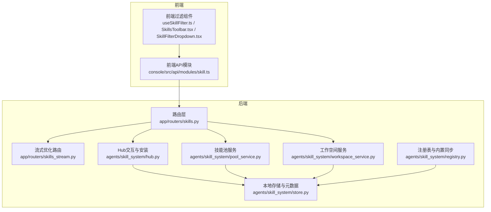
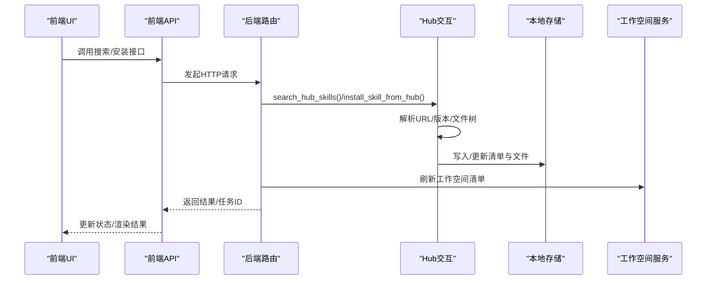
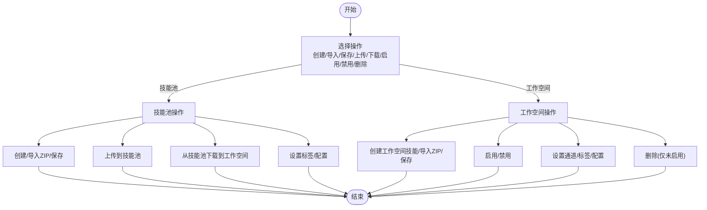
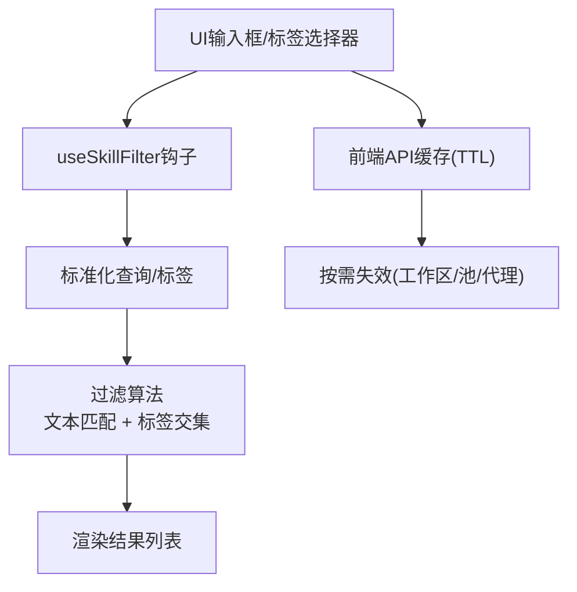
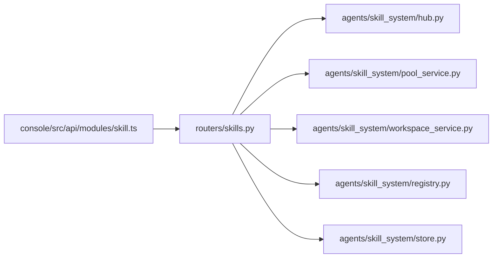

# 技能中心Hub

<cite>
**本文引用的文件**
- [hub.py](file://src/qwenpaw/agents/skill_system/hub.py)
- [models.py](file://src/qwenpaw/agents/skill_system/models.py)
- [pool_service.py](file://src/qwenpaw/agents/skill_system/pool_service.py)
- [workspace_service.py](file://src/qwenpaw/agents/skill_system/workspace_service.py)
- [store.py](file://src/qwenpaw/agents/skill_system/store.py)
- [registry.py](file://src/qwenpaw/agents/skill_system/registry.py)
- [skills.py](file://src/qwenpaw/app/routers/skills.py)
- [skills_stream.py](file://src/qwenpaw/app/routers/skills_stream.py)
- [skill.ts](file://console/src/api/modules/skill.ts)
- [useSkillFilter.ts](file://console/src/pages/Agent/Skills/useSkillFilter.ts)
- [SkillsToolbar.tsx](file://console/src/pages/Agent/Skills/components/SkillsToolbar.tsx)
- [SkillFilterDropdown.tsx](file://console/src/pages/Agent/Skills/components/SkillFilterDropdown.tsx)
- [skill.ts](file://console/src/constants/skill.ts)
</cite>

## 目录
1. [简介](#简介)
2. [项目结构](#项目结构)
3. [核心组件](#核心组件)
4. [架构总览](#架构总览)
5. [详细组件分析](#详细组件分析)
6. [依赖关系分析](#依赖关系分析)
7. [性能考虑](#性能考虑)
8. [故障排查指南](#故障排查指南)
9. [结论](#结论)
10. [附录](#附录)

## 简介
本文件为 QwenPaw 技能中心Hub的技术文档，系统性阐述技能Hub的架构与核心能力，包括技能的聚合、分类与检索机制；技能Hub如何协调技能注册表、技能池与工作空间之间的关系；搜索与过滤功能（关键词、标签、版本匹配）；API接口清单（查询、推荐、批量操作）；扩展机制（自定义技能与第三方技能接入）；配置项与性能优化建议，并提供使用示例与最佳实践。

## 项目结构
技能Hub位于后端Python模块与前端TypeScript模块的协作层中：
- 后端核心：agents/skill_system 提供技能模型、存储、服务与Hub交互逻辑
- 后端路由：app/routers 提供REST API与流式优化接口
- 前端API封装：console/src/api/modules 提供类型化请求与缓存
- 前端UI过滤：console/src/pages/Agent/Skills 提供关键词与标签过滤



图表来源
- [skills.py:69-120](file://src/qwenpaw/app/routers/skills.py#L69-L120)
- [hub.py:1-120](file://src/qwenpaw/agents/skill_system/hub.py#L1-L120)
- [pool_service.py:45-70](file://src/qwenpaw/agents/skill_system/pool_service.py#L45-L70)
- [workspace_service.py:40-62](file://src/qwenpaw/agents/skill_system/workspace_service.py#L40-L62)
- [store.py:56-101](file://src/qwenpaw/agents/skill_system/store.py#L56-L101)
- [registry.py:1-60](file://src/qwenpaw/agents/skill_system/registry.py#L1-L60)
- [skill.ts:117-182](file://console/src/api/modules/skill.ts#L117-L182)
- [useSkillFilter.ts:10-49](file://console/src/pages/Agent/Skills/useSkillFilter.ts#L10-L49)
- [SkillsToolbar.tsx:20-73](file://console/src/pages/Agent/Skills/components/SkillsToolbar.tsx#L20-L73)
- [SkillFilterDropdown.tsx:14-54](file://console/src/pages/Agent/Skills/components/SkillFilterDropdown.tsx#L14-L54)

章节来源
- [skills.py:69-120](file://src/qwenpaw/app/routers/skills.py#L69-L120)
- [skill.ts:117-182](file://console/src/api/modules/skill.ts#L117-L182)
- [useSkillFilter.ts:10-49](file://console/src/pages/Agent/Skills/useSkillFilter.ts#L10-L49)

## 核心组件
- 技能模型与常量：定义技能信息、需求、冲突错误等基础数据结构
- 本地存储与元数据：路径解析、清单读写、目录扫描、冲突建议
- 技能池服务：共享技能生命周期管理（创建、导入ZIP、上传/下载、标签与配置维护）
- 工作空间服务：工作区内技能生命周期管理（创建、编辑、启用/禁用、通道与标签）
- 注册表与内置同步：内置技能语言偏好、候选列表、版本对比与迁移
- Hub交互：Hub搜索、安装任务、取消、状态轮询、文件与版本解析
- 路由与API：技能查询、刷新、Hub搜索、安装、批量操作、流式优化
- 前端API与过滤：类型化请求、缓存、关键词与标签过滤UI

章节来源
- [models.py:45-77](file://src/qwenpaw/agents/skill_system/models.py#L45-L77)
- [store.py:56-101](file://src/qwenpaw/agents/skill_system/store.py#L56-L101)
- [pool_service.py:45-82](file://src/qwenpaw/agents/skill_system/pool_service.py#L45-L82)
- [workspace_service.py:40-96](file://src/qwenpaw/agents/skill_system/workspace_service.py#L40-L96)
- [registry.py:1-60](file://src/qwenpaw/agents/skill_system/registry.py#L1-L60)
- [hub.py:1579-1602](file://src/qwenpaw/agents/skill_system/hub.py#L1579-L1602)
- [skills.py:608-637](file://src/qwenpaw/app/routers/skills.py#L608-L637)
- [skill.ts:117-182](file://console/src/api/modules/skill.ts#L117-L182)
- [useSkillFilter.ts:10-49](file://console/src/pages/Agent/Skills/useSkillFilter.ts#L10-L49)

## 架构总览
技能Hub通过“工作空间-技能池-注册表-Hub”的分层协作实现技能的统一管理与分发：
- 工作空间：面向用户可编辑的技能集合，支持启用/禁用、通道路由、标签与配置
- 技能池：共享的可复用技能库，负责冲突检测、版本管理与跨工作空间同步
- 注册表：内置技能候选与语言选择、版本对比、迁移与环境变量注入
- Hub：外部技能源的搜索、安装与任务管理，支持版本匹配与文件解析

```mermaid
graph TB
WS["工作空间技能"]
POOL["技能池"]
REG["注册表(内置)"]
HUB["Hub(外部)"]
WS <- --> |"启用/禁用/通道/标签/配置"| WS
WS < --> |"上传/下载/同步"| POOL
POOL < --> |"内置候选/版本/语言"| REG
WS < --> |"搜索/安装/任务"| HUB
POOL < --> |"搜索/安装/任务"| HUB
```

图表来源
- [workspace_service.py:40-96](file://src/qwenpaw/agents/skill_system/workspace_service.py#L40-L96)
- [pool_service.py:45-82](file://src/qwenpaw/agents/skill_system/pool_service.py#L45-L82)
- [registry.py:554-574](file://src/qwenpaw/agents/skill_system/registry.py#L554-L574)
- [hub.py:1579-1602](file://src/qwenpaw/agents/skill_system/hub.py#L1579-L1602)

## 详细组件分析

### 组件A：技能Hub搜索与安装流程
- 搜索：调用Hub搜索接口，规范化返回结果为HubSkillSpec
- 安装：启动异步安装任务，支持取消、状态轮询与回滚清理
- 版本匹配：从Hub响应提取或请求版本详情，解析文件树并生成包体



图表来源
- [skills.py:622-637](file://src/qwenpaw/app/routers/skills.py#L622-L637)
- [skills.py:657-714](file://src/qwenpaw/app/routers/skills.py#L657-L714)
- [hub.py:1579-1602](file://src/qwenpaw/agents/skill_system/hub.py#L1579-L1602)
- [store.py:551-605](file://src/qwenpaw/agents/skill_system/store.py#L551-L605)
- [workspace_service.py:66-95](file://src/qwenpaw/agents/skill_system/workspace_service.py#L66-L95)

章节来源
- [skills.py:622-637](file://src/qwenpaw/app/routers/skills.py#L622-L637)
- [skills.py:657-714](file://src/qwenpaw/app/routers/skills.py#L657-L714)
- [hub.py:1579-1602](file://src/qwenpaw/agents/skill_system/hub.py#L1579-L1602)

### 组件B：技能池与工作空间的生命周期
- 技能池：创建、导入ZIP、删除、设置标签、保存（含重命名）、上传/下载
- 工作空间：创建、保存（含重命名）、导入ZIP、启用/禁用、设置通道与标签、删除



图表来源
- [pool_service.py:83-156](file://src/qwenpaw/agents/skill_system/pool_service.py#L83-L156)
- [pool_service.py:555-624](file://src/qwenpaw/agents/skill_system/pool_service.py#L555-L624)
- [workspace_service.py:97-196](file://src/qwenpaw/agents/skill_system/workspace_service.py#L97-L196)
- [workspace_service.py:197-400](file://src/qwenpaw/agents/skill_system/workspace_service.py#L197-L400)

章节来源
- [pool_service.py:83-156](file://src/qwenpaw/agents/skill_system/pool_service.py#L83-L156)
- [pool_service.py:555-624](file://src/qwenpaw/agents/skill_system/pool_service.py#L555-L624)
- [workspace_service.py:97-196](file://src/qwenpaw/agents/skill_system/workspace_service.py#L97-L196)
- [workspace_service.py:197-400](file://src/qwenpaw/agents/skill_system/workspace_service.py#L197-L400)

### 组件C：前端搜索与标签过滤
- 关键词搜索：基于名称与描述的模糊匹配
- 标签过滤：前缀区分与多选下拉，支持动态展开与清空
- 缓存策略：按路径与TTL缓存，支持按工作区/池/代理ID精确失效



图表来源
- [useSkillFilter.ts:10-49](file://console/src/pages/Agent/Skills/useSkillFilter.ts#L10-L49)
- [SkillsToolbar.tsx:20-73](file://console/src/pages/Agent/Skills/components/SkillsToolbar.tsx#L20-L73)
- [SkillFilterDropdown.tsx:14-54](file://console/src/pages/Agent/Skills/components/SkillFilterDropdown.tsx#L14-L54)
- [skill.ts:17-64](file://console/src/api/modules/skill.ts#L17-L64)

章节来源
- [useSkillFilter.ts:10-49](file://console/src/pages/Agent/Skills/useSkillFilter.ts#L10-L49)
- [SkillsToolbar.tsx:20-73](file://console/src/pages/Agent/Skills/components/SkillsToolbar.tsx#L20-L73)
- [SkillFilterDropdown.tsx:14-54](file://console/src/pages/Agent/Skills/components/SkillFilterDropdown.tsx#L14-L54)
- [skill.ts:17-64](file://console/src/api/modules/skill.ts#L17-L64)

## 依赖关系分析
- 路由依赖：skills.py 聚合了 Hub交互、技能池与工作空间服务、注册表与安全扫描
- Hub交互：依赖HTTP客户端、超时/重试/backoff、GitHub令牌、响应体大小限制
- 存储与清单：跨进程锁、原子写入、LRU缓存、路径安全校验
- 前端API：类型化请求、缓存、流式优化、上传ZIP



图表来源
- [skills.py:26-65](file://src/qwenpaw/app/routers/skills.py#L26-L65)
- [hub.py:190-243](file://src/qwenpaw/agents/skill_system/hub.py#L190-L243)
- [store.py:249-320](file://src/qwenpaw/agents/skill_system/store.py#L249-L320)
- [skill.ts:1-33](file://console/src/api/modules/skill.ts#L1-L33)

章节来源
- [skills.py:26-65](file://src/qwenpaw/app/routers/skills.py#L26-L65)
- [hub.py:190-243](file://src/qwenpaw/agents/skill_system/hub.py#L190-L243)
- [store.py:249-320](file://src/qwenpaw/agents/skill_system/store.py#L249-L320)
- [skill.ts:1-33](file://console/src/api/modules/skill.ts#L1-L33)

## 性能考虑
- HTTP请求与重试：可配置超时、重试次数与指数退避，避免Hub抖动影响体验
- 响应体大小限制：防止过大响应导致内存压力
- 文件上传限制：ZIP大小上限与条目数量限制，保障安全性与稳定性
- 清单缓存：按mtime缓存与LRU结合，减少重复读取
- 并发安装：异步任务队列与取消事件，避免阻塞主线程
- 流式优化：SSE流式返回，降低前端等待时间

章节来源
- [hub.py:129-165](file://src/qwenpaw/agents/skill_system/hub.py#L129-L165)
- [store.py:397-422](file://src/qwenpaw/agents/skill_system/store.py#L397-L422)
- [skills.py:280-286](file://src/qwenpaw/app/routers/skills.py#L280-L286)
- [skills_stream.py:170-249](file://src/qwenpaw/app/routers/skills_stream.py#L170-L249)

## 故障排查指南
- Hub速率限制：当遇到403/429，检查GITHUB_TOKEN是否配置
- 安装失败：查看安装任务状态与错误详情，必要时取消并重试
- 扫描失败：安全扫描返回结构化错误，包含严重级别与发现项
- 冲突处理：创建/保存/上传可能触发冲突，使用建议重命名或覆盖
- 路径安全：ZIP内不允许符号链接与越界路径，确保来源可信

章节来源
- [hub.py:325-377](file://src/qwenpaw/agents/skill_system/hub.py#L325-L377)
- [skills.py:75-116](file://src/qwenpaw/app/routers/skills.py#L75-L116)
- [pool_service.py:555-624](file://src/qwenpaw/agents/skill_system/pool_service.py#L555-L624)
- [store.py:401-422](file://src/qwenpaw/agents/skill_system/store.py#L401-L422)

## 结论
技能中心Hub通过“工作空间-技能池-注册表-Hub”的协同，实现了技能的统一聚合、版本管理与跨域复用；配合前端的搜索与标签过滤，提供了高效易用的技能发现与管理体验。后端以强健的存储与并发安装机制保障稳定性，前端以类型化API与缓存提升交互效率。通过合理的配置与最佳实践，可在保证安全的前提下快速扩展与接入第三方技能。

## 附录

### API接口清单（后端）
- 技能查询与刷新
  - GET /skills：列出当前工作空间技能
  - POST /skills/refresh：强制重合技能清单并返回最新列表
- 技能池
  - GET /skills/pool：列出技能池技能
  - POST /skills/pool/refresh：强制重合技能池清单并返回最新列表
  - GET /skills/pool/builtin-sources：内置候选列表
  - GET /skills/pool/builtin-notice：内置更新通知
- Hub交互
  - GET /skills/hub/search：Hub搜索
  - POST /skills/hub/install/start：启动安装任务
  - GET /skills/hub/install/status/{task_id}：查询安装状态
  - POST /skills/hub/install/cancel/{task_id}：取消安装
  - POST /skills/pool/import：从Hub导入到技能池
- 批量与配置
  - POST /skills/batch-enable / skills/batch-disable / skills/batch-delete
  - PUT /skills/{name}/channels, PUT /skills/{name}/tags
  - PUT /skills/{name}/config, DELETE /skills/{name}/config
  - PUT /skills/pool/{name}/tags, PUT /skills/pool/{name}/config, DELETE /skills/pool/{name}/config
- 上传与导入
  - POST /skills/upload：上传ZIP导入工作空间技能
  - POST /skills/pool/upload-zip：上传ZIP导入技能池
  - POST /skills/pool/upload：将工作空间技能上传到技能池
  - POST /skills/pool/download：从技能池下载到多个工作空间
- 流式优化
  - POST /api/skills/ai/optimize/stream：流式AI优化技能内容

章节来源
- [skills.py:608-759](file://src/qwenpaw/app/routers/skills.py#L608-L759)
- [skills_stream.py:170-249](file://src/qwenpaw/app/routers/skills_stream.py#L170-L249)

### 前端API封装（要点）
- 缓存：TTL缓存与按路径/代理ID精准失效
- 搜索：关键词与标签过滤，支持多选与动态下拉
- 安装：任务启动、状态轮询、取消与回滚清理
- 上传：ZIP上传参数（enable/target_name/rename_map）

章节来源
- [skill.ts:17-64](file://console/src/api/modules/skill.ts#L17-L64)
- [skill.ts:117-182](file://console/src/api/modules/skill.ts#L117-L182)
- [skill.ts:296-333](file://console/src/api/modules/skill.ts#L296-L333)
- [skill.ts:558-593](file://console/src/api/modules/skill.ts#L558-L593)

### 配置选项与环境变量
- Hub访问与行为
  - QWENPAW_SKILLS_HUB_BASE_URL：Hub基础地址
  - QWENPAW_SKILLS_HUB_SEARCH_PATH：搜索路径
  - QWENPAW_SKILLS_HUB_VERSION_PATH：版本详情路径
  - QWENPAW_SKILLS_HUB_FILE_PATH：文件下载路径
  - QWENPAW_SKILLS_HUB_HTTP_TIMEOUT：HTTP超时秒数
  - QWENPAW_SKILLS_HUB_HTTP_RETRIES：重试次数
  - QWENPAW_SKILLS_HUB_HTTP_BACKOFF_BASE：退避基数
  - QWENPAW_SKILLS_HUB_HTTP_BACKOFF_CAP：退避上限
  - QWENPAW_GITHUB_CACHE_TTL：GitHub缓存TTL
- 其他
  - GITHUB_TOKEN/GH_TOKEN：用于提升GitHub API配额

章节来源
- [hub.py:96-165](file://src/qwenpaw/agents/skill_system/hub.py#L96-L165)
- [hub.py:225-243](file://src/qwenpaw/agents/skill_system/hub.py#L225-L243)

### 使用示例与最佳实践
- 快速搜索第三方技能：使用Hub搜索接口，传入关键词与限制数量
- 安全安装：先预览/校验，再启动安装任务，关注状态与错误
- 批量管理：使用批量启用/禁用/删除，减少重复请求
- 标签与过滤：为技能打标签，前端使用标签前缀进行筛选
- 性能优化：合理设置HTTP超时与重试，利用缓存减少重复请求
- 安全性：严格校验ZIP内容，避免符号链接与越界路径

章节来源
- [skills.py:622-637](file://src/qwenpaw/app/routers/skills.py#L622-L637)
- [skills.py:657-714](file://src/qwenpaw/app/routers/skills.py#L657-L714)
- [skill.ts:179-182](file://console/src/api/modules/skill.ts#L179-L182)
- [store.py:401-422](file://src/qwenpaw/agents/skill_system/store.py#L401-L422)