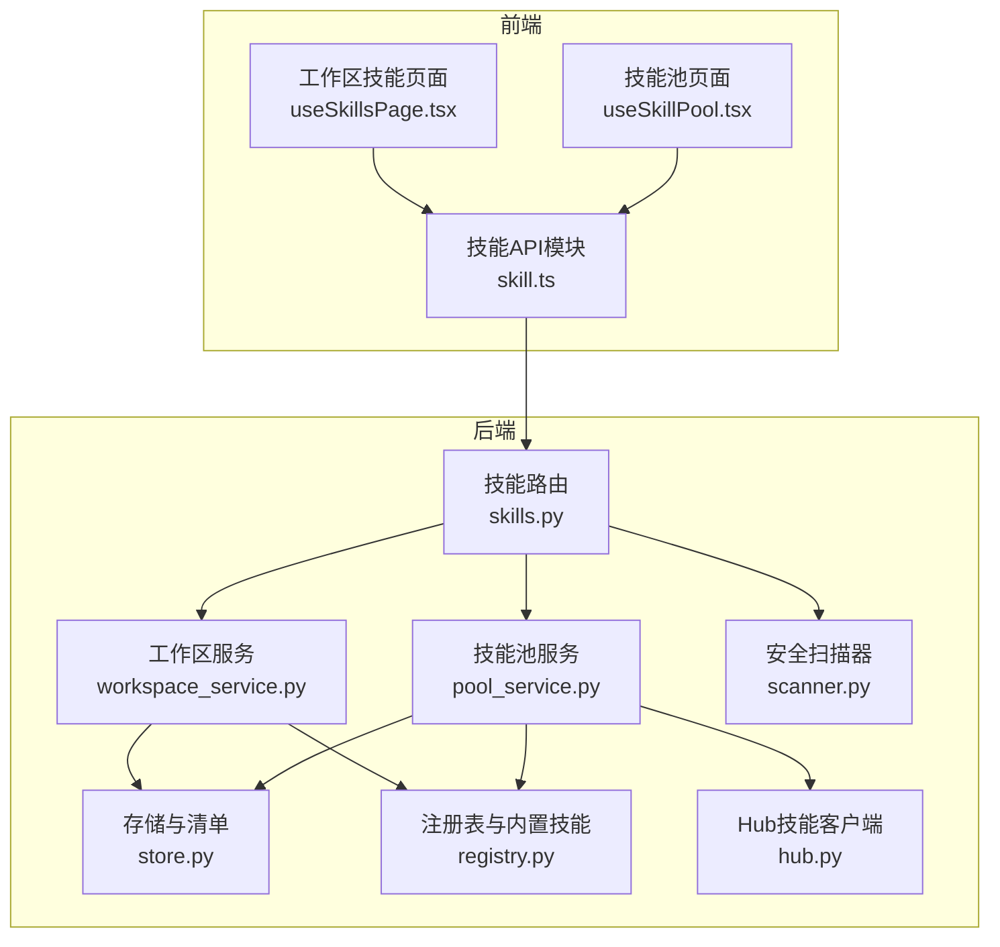
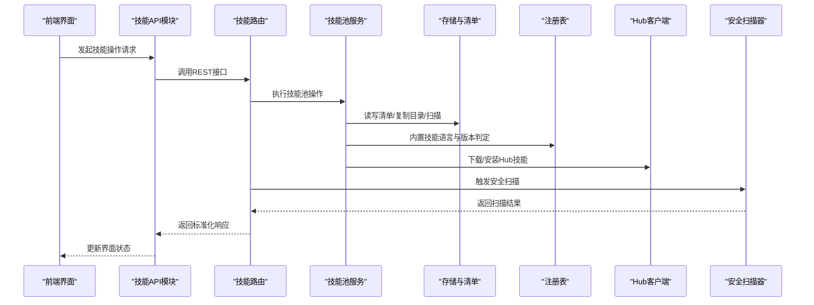
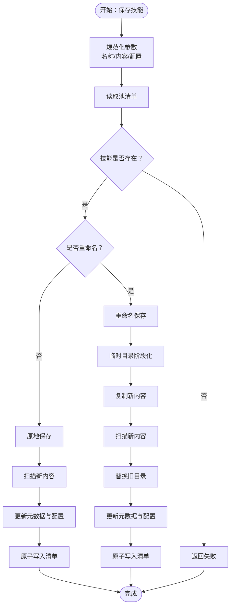
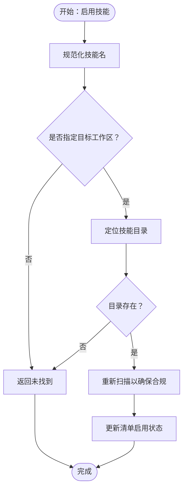
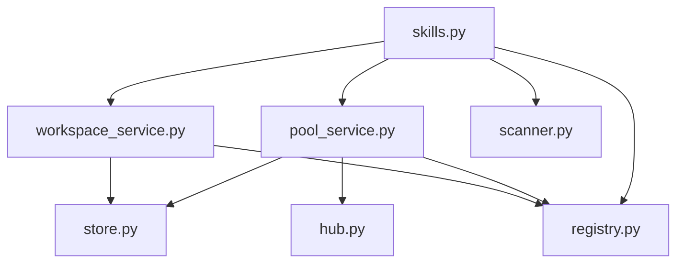

# 技能池服务

<cite>
**本文档引用的文件**
- [pool_service.py](file://src/qwenpaw/agents/skill_system/pool_service.py)
- [workspace_service.py](file://src/qwenpaw/agents/skill_system/workspace_service.py)
- [store.py](file://src/qwenpaw/agents/skill_system/store.py)
- [registry.py](file://src/qwenpaw/agents/skill_system/registry.py)
- [hub.py](file://src/qwenpaw/agents/skill_system/hub.py)
- [skills.py](file://src/qwenpaw/app/routers/skills.py)
- [skill.ts](file://console/src/api/modules/skill.ts)
- [useSkillPool.tsx](file://console/src/pages/Settings/SkillPool/useSkillPool.tsx)
- [useSkillsPage.tsx](file://console/src/pages/Agent/Skills/useSkillsPage.tsx)
- [scanner.py](file://src/qwenpaw/security/skill_scanner/scanner.py)
- [config.py](file://src/qwenpaw/app/routers/config.py)
- [security.ts](file://console/src/api/modules/security.ts)
</cite>

## 目录
1. [简介](#简介)
2. [项目结构](#项目结构)
3. [核心组件](#核心组件)
4. [架构总览](#架构总览)
5. [详细组件分析](#详细组件分析)
6. [依赖关系分析](#依赖关系分析)
7. [性能考虑](#性能考虑)
8. [故障排除指南](#故障排除指南)
9. [结论](#结论)
10. [附录](#附录)

## 简介
本文件面向QwenPaw技能池服务，提供从架构设计到API参考的完整技术文档。内容涵盖技能池的管理功能（导入、导出、复制、版本控制）、存储结构与文件组织、同步机制（内置技能自动导入、冲突检测与解决）、API参考、配置管理以及使用示例与故障排除指南。

## 项目结构
技能池服务位于后端Python代码与前端React界面之间，通过FastAPI路由暴露REST接口，并由前端模块封装调用。核心文件分布如下：
- 后端核心：技能池与工作区服务、存储与清单管理、内置技能注册表、Hub技能导入
- 前端接口：技能API模块、技能池页面逻辑
- 安全扫描：技能安全扫描器与配置

**图表来源**
- [skills.py:1-200](file://src/qwenpaw/app/routers/skills.py#L1-L200)
- [pool_service.py:1-120](file://src/qwenpaw/agents/skill_system/pool_service.py#L1-L120)
- [workspace_service.py:1-60](file://src/qwenpaw/agents/skill_system/workspace_service.py#L1-L60)
- [store.py:1-120](file://src/qwenpaw/agents/skill_system/store.py#L1-L120)
- [registry.py:1-120](file://src/qwenpaw/agents/skill_system/registry.py#L1-L120)
- [hub.py:1-120](file://src/qwenpaw/agents/skill_system/hub.py#L1-L120)
- [skill.ts:1-120](file://console/src/api/modules/skill.ts#L1-L120)

**章节来源**
- [skills.py:1-200](file://src/qwenpaw/app/routers/skills.py#L1-L200)
- [pool_service.py:1-120](file://src/qwenpaw/agents/skill_system/pool_service.py#L1-L120)
- [workspace_service.py:1-60](file://src/qwenpaw/agents/skill_system/workspace_service.py#L1-L60)
- [store.py:1-120](file://src/qwenpaw/agents/skill_system/store.py#L1-L120)
- [registry.py:1-120](file://src/qwenpaw/agents/skill_system/registry.py#L1-L120)
- [hub.py:1-120](file://src/qwenpaw/agents/skill_system/hub.py#L1-L120)
- [skill.ts:1-120](file://console/src/api/modules/skill.ts#L1-L120)

## 核心组件
- 技能池服务（SkillPoolService）：负责共享技能池的创建、导入导出、重命名保存、删除、标签与配置管理，以及与工作区之间的上传下载同步。
- 工作区服务（SkillService）：负责单工作区内的可编辑技能生命周期管理，包括创建、保存、启用/禁用、通道路由、标签与配置。
- 存储与清单（store.py）：提供路径解析、清单读写、原子JSON写入、冲突名建议、技能目录复制、扫描等基础能力。
- 注册表（registry.py）：内置技能发现与语言偏好、包内内置技能变体选择、池与工作区清单协调。
- Hub技能客户端（hub.py）：Hub搜索、安装任务、取消与状态轮询、HTTP重试与超时控制。
- 路由器（skills.py）：对外暴露REST API，统一错误处理与缓存失效。
- 前端API模块（skill.ts）：封装请求、缓存与流式优化接口。
- 安全扫描（scanner.py）：对技能进行安全扫描并返回结构化结果。

**章节来源**
- [pool_service.py:45-120](file://src/qwenpaw/agents/skill_system/pool_service.py#L45-L120)
- [workspace_service.py:40-95](file://src/qwenpaw/agents/skill_system/workspace_service.py#L40-L95)
- [store.py:55-120](file://src/qwenpaw/agents/skill_system/store.py#L55-L120)
- [registry.py:64-120](file://src/qwenpaw/agents/skill_system/registry.py#L64-L120)
- [hub.py:190-242](file://src/qwenpaw/agents/skill_system/hub.py#L190-L242)
- [skills.py:118-200](file://src/qwenpaw/app/routers/skills.py#L118-L200)
- [skill.ts:117-200](file://console/src/api/modules/skill.ts#L117-L200)
- [scanner.py:76-140](file://src/qwenpaw/security/skill_scanner/scanner.py#L76-L140)

## 架构总览
技能池服务采用分层架构：
- 表现层：前端React组件与API模块
- 控制层：FastAPI路由与业务编排
- 服务层：技能池与工作区服务
- 基础设施层：存储、清单、内置技能注册表、Hub客户端、安全扫描

**图表来源**
- [skills.py:842-900](file://src/qwenpaw/app/routers/skills.py#L842-L900)
- [pool_service.py:370-497](file://src/qwenpaw/agents/skill_system/pool_service.py#L370-L497)
- [store.py:269-320](file://src/qwenpaw/agents/skill_system/store.py#L269-L320)
- [registry.py:744-785](file://src/qwenpaw/agents/skill_system/registry.py#L744-L785)
- [hub.py:300-430](file://src/qwenpaw/agents/skill_system/hub.py#L300-L430)
- [scanner.py:148-200](file://src/qwenpaw/security/skill_scanner/scanner.py#L148-L200)

## 详细组件分析

### 技能池服务（SkillPoolService）
职责与能力：
- 列出所有池中技能
- 创建技能（含内容校验、扫描、原子写入）
- 从ZIP导入（支持目标名称与重命名映射、冲突检测）
- 删除技能（清单与文件同步删除）
- 标签与配置管理
- 保存技能（原地保存或重命名保存）
- 上传至工作区（预览模式）
- 从池下载到工作区（内置版本/语言冲突检测与解决）

关键流程图（保存技能）

**图表来源**
- [pool_service.py:370-497](file://src/qwenpaw/agents/skill_system/pool_service.py#L370-L497)
- [pool_service.py:499-553](file://src/qwenpaw/agents/skill_system/pool_service.py#L499-L553)

**章节来源**
- [pool_service.py:70-156](file://src/qwenpaw/agents/skill_system/pool_service.py#L70-L156)
- [pool_service.py:157-264](file://src/qwenpaw/agents/skill_system/pool_service.py#L157-L264)
- [pool_service.py:265-299](file://src/qwenpaw/agents/skill_system/pool_service.py#L265-L299)
- [pool_service.py:301-324](file://src/qwenpaw/agents/skill_system/pool_service.py#L301-L324)
- [pool_service.py:370-497](file://src/qwenpaw/agents/skill_system/pool_service.py#L370-L497)
- [pool_service.py:499-553](file://src/qwenpaw/agents/skill_system/pool_service.py#L499-L553)
- [pool_service.py:555-624](file://src/qwenpaw/agents/skill_system/pool_service.py#L555-L624)
- [pool_service.py:743-800](file://src/qwenpaw/agents/skill_system/pool_service.py#L743-L800)

### 工作区服务（SkillService）
职责与能力：
- 列出工作区内技能与可用技能
- 创建/保存技能（含启用标志）
- ZIP导入（支持目标名称与重命名映射、冲突检测）
- 启用/禁用技能（含扫描校验）
- 设置通道路由与标签
- 删除技能（仅未启用且非内置）
- 文件读取（受路径白名单限制）

关键流程图（启用技能）

**图表来源**
- [workspace_service.py:490-562](file://src/qwenpaw/agents/skill_system/workspace_service.py#L490-L562)

**章节来源**
- [workspace_service.py:66-95](file://src/qwenpaw/agents/skill_system/workspace_service.py#L66-L95)
- [workspace_service.py:97-195](file://src/qwenpaw/agents/skill_system/workspace_service.py#L97-L195)
- [workspace_service.py:401-489](file://src/qwenpaw/agents/skill_system/workspace_service.py#L401-L489)
- [workspace_service.py:490-562](file://src/qwenpaw/agents/skill_system/workspace_service.py#L490-L562)
- [workspace_service.py:563-588](file://src/qwenpaw/agents/skill_system/workspace_service.py#L563-L588)
- [workspace_service.py:590-643](file://src/qwenpaw/agents/skill_system/workspace_service.py#L590-L643)
- [workspace_service.py:645-685](file://src/qwenpaw/agents/skill_system/workspace_service.py#L645-L685)
- [workspace_service.py:687-718](file://src/qwenpaw/agents/skill_system/workspace_service.py#L687-L718)

### 存储与清单（store.py）
职责与能力：
- 路径解析：技能池根目录、工作区技能目录、清单路径
- 清单读写：默认清单、原子写入、跨进程锁
- 技能元数据构建：版本、描述、要求、更新时间
- 冲突名建议：基于时间戳的唯一化
- ZIP处理：解压校验、入口识别、树形文件生成
- 目录复制：忽略系统文件，保持跨平台一致性
- 扫描集成：技能目录扫描包装

**章节来源**
- [store.py:55-101](file://src/qwenpaw/agents/skill_system/store.py#L55-L101)
- [store.py:269-320](file://src/qwenpaw/agents/skill_system/store.py#L269-L320)
- [store.py:555-580](file://src/qwenpaw/agents/skill_system/store.py#L555-L580)
- [store.py:590-611](file://src/qwenpaw/agents/skill_system/store.py#L590-L611)
- [store.py:794-835](file://src/qwenpaw/agents/skill_system/store.py#L794-L835)
- [store.py:837-851](file://src/qwenpaw/agents/skill_system/store.py#L837-L851)

### 注册表与内置技能（registry.py）
职责与能力：
- 内置技能语言偏好：根据设置与UI语言推断
- 包内内置技能变体发现与选择
- 池清单协调：区分内置槽位与自定义副本
- 工作区清单协调：按需重建与去重
- 内置技能导入：批量导入、更新、未变更跳过

**章节来源**
- [registry.py:64-104](file://src/qwenpaw/agents/skill_system/registry.py#L64-L104)
- [registry.py:152-200](file://src/qwenpaw/agents/skill_system/registry.py#L152-L200)
- [registry.py:744-785](file://src/qwenpaw/agents/skill_system/registry.py#L744-L785)
- [registry.py:964-988](file://src/qwenpaw/agents/skill_system/registry.py#L964-L988)

### Hub技能客户端（hub.py）
职责与能力：
- Hub搜索、详情、版本、文件下载
- ZIP/树形文件提取与归一化
- HTTP重试、超时、背压与速率限制
- 取消检查与任务状态轮询
- 错误消息提取与用户提示

**章节来源**
- [hub.py:190-242](file://src/qwenpaw/agents/skill_system/hub.py#L190-L242)
- [hub.py:300-430](file://src/qwenpaw/agents/skill_system/hub.py#L300-L430)
- [hub.py:582-729](file://src/qwenpaw/agents/skill_system/hub.py#L582-L729)
- [hub.py:791-800](file://src/qwenpaw/agents/skill_system/hub.py#L791-L800)

### 路由器（skills.py）
职责与能力：
- 对外暴露技能池与工作区API
- 统一错误处理：扫描失败返回结构化422
- 缓存失效：针对技能列表与池刷新
- 任务管理：Hub安装任务的启动、状态查询、取消

**章节来源**
- [skills.py:75-116](file://src/qwenpaw/app/routers/skills.py#L75-L116)
- [skills.py:842-865](file://src/qwenpaw/app/routers/skills.py#L842-L865)
- [skills.py:1156-1165](file://src/qwenpaw/app/routers/skills.py#L1156-L1165)
- [skills.py:1450-1460](file://src/qwenpaw/app/routers/skills.py#L1450-L1460)
- [skills.py:1462-1480](file://src/qwenpaw/app/routers/skills.py#L1462-L1480)

### 前端API模块（skill.ts）
职责与能力：
- 封装技能相关REST请求
- 缓存控制：TTL缓存与按需失效
- 流式优化：AI优化文本流式接收
- ZIP上传：支持启用、目标名与重命名映射

**章节来源**
- [skill.ts:17-64](file://console/src/api/modules/skill.ts#L17-L64)
- [skill.ts:117-177](file://console/src/api/modules/skill.ts#L117-L177)
- [skill.ts:558-594](file://console/src/api/modules/skill.ts#L558-L594)

### 技能池页面（useSkillPool.tsx）
职责与能力：
- 技能池数据加载与过滤
- 内置技能导入通知与确认
- 批量操作与冲突处理
- 缓存失效与数据刷新

**章节来源**
- [useSkillPool.tsx:82-140](file://console/src/pages/Settings/SkillPool/useSkillPool.tsx#L82-L140)
- [useSkillPool.tsx:549-603](file://console/src/pages/Settings/SkillPool/useSkillPool.tsx#L549-L603)

### 工作区技能页面（useSkillsPage.tsx）
职责与能力：
- 技能池导入/导出交互
- 冲突重命名模态框
- 扫描警告检查

**章节来源**
- [useSkillsPage.tsx:102-140](file://console/src/pages/Agent/Skills/useSkillsPage.tsx#L102-L140)
- [useSkillsPage.tsx:211-247](file://console/src/pages/Agent/Skills/useSkillsPage.tsx#L211-L247)

### 安全扫描（scanner.py）
职责与能力：
- 扫描器编排：文件发现、分析器执行、结果聚合
- 策略与限制：文件数量、大小、跳过扩展
- 结果模型：严重性、规则、文件路径、行号

**章节来源**
- [scanner.py:76-140](file://src/qwenpaw/security/skill_scanner/scanner.py#L76-L140)
- [scanner.py:148-200](file://src/qwenpaw/security/skill_scanner/scanner.py#L148-L200)

## 依赖关系分析
组件间依赖关系如下：
- 路由器依赖服务层（SkillPoolService、SkillService）与注册表
- 服务层依赖存储与清单（store.py）与注册表（registry.py）
- 技能池服务进一步依赖Hub客户端（hub.py）
- 路由器依赖安全扫描器（scanner.py）
- 前端API模块依赖路由器

**图表来源**
- [skills.py:26-65](file://src/qwenpaw/app/routers/skills.py#L26-L65)
- [pool_service.py:14-42](file://src/qwenpaw/agents/skill_system/pool_service.py#L14-L42)
- [workspace_service.py:13-37](file://src/qwenpaw/agents/skill_system/workspace_service.py#L13-L37)
- [store.py:24-42](file://src/qwenpaw/agents/skill_system/store.py#L24-L42)
- [registry.py:23-43](file://src/qwenpaw/agents/skill_system/registry.py#L23-L43)
- [hub.py:26-32](file://src/qwenpaw/agents/skill_system/hub.py#L26-L32)
- [scanner.py:24-27](file://src/qwenpaw/security/skill_scanner/scanner.py#L24-L27)

**章节来源**
- [skills.py:26-65](file://src/qwenpaw/app/routers/skills.py#L26-L65)
- [pool_service.py:14-42](file://src/qwenpaw/agents/skill_system/pool_service.py#L14-L42)
- [workspace_service.py:13-37](file://src/qwenpaw/agents/skill_system/workspace_service.py#L13-L37)
- [store.py:24-42](file://src/qwenpaw/agents/skill_system/store.py#L24-L42)
- [registry.py:23-43](file://src/qwenpaw/agents/skill_system/registry.py#L23-L43)
- [hub.py:26-32](file://src/qwenpaw/agents/skill_system/hub.py#L26-L32)
- [scanner.py:24-27](file://src/qwenpaw/security/skill_scanner/scanner.py#L24-L27)

## 性能考虑
- 原子写入与跨进程锁：清单更新采用临时文件与原子替换，避免并发写入损坏。
- 缓存与TTL：前端API模块提供30秒TTL缓存，减少重复请求。
- ZIP解压与校验：限制最大解压体积与条目数，防止资源耗尽。
- 扫描限制：默认最大文件数与单文件大小，避免长时间扫描阻塞。
- 并发与锁：文件锁在Unix（fcntl）与Windows（msvcrt）上分别实现，保证跨平台一致性。

[本节为通用指导，不直接分析具体文件]

## 故障排除指南
常见问题与处理：
- 扫描失败（422）：检查扫描器配置与规则，查看详细发现信息；必要时加入白名单。
- 冲突与重命名：导入或保存时出现冲突，使用建议的重命名或覆盖选项。
- ZIP无效或无技能：确认ZIP包含有效的SKILL.md与技能目录结构。
- Hub网络错误：检查超时、重试与速率限制设置，必要时配置GITHUB_TOKEN。
- 权限与路径：确保工作目录与技能目录权限正确，避免跨平台路径问题。

**章节来源**
- [skills.py:75-116](file://src/qwenpaw/app/routers/skills.py#L75-L116)
- [store.py:401-442](file://src/qwenpaw/agents/skill_system/store.py#L401-L442)
- [hub.py:300-430](file://src/qwenpaw/agents/skill_system/hub.py#L300-L430)
- [config.py:797-883](file://src/qwenpaw/app/routers/config.py#L797-L883)
- [security.ts:47-77](file://console/src/api/modules/security.ts#L47-L77)

## 结论
QwenPaw技能池服务通过清晰的分层架构与完善的基础设施，提供了可靠的技能导入、导出、复制与版本控制能力。内置技能的自动同步与冲突检测保障了多工作区的一致性，而安全扫描与配置管理则提升了整体安全性与可运维性。前端API模块与页面组件进一步简化了用户的日常操作。

[本节为总结性内容，不直接分析具体文件]

## 附录

### API参考（技能池与工作区）
- 获取技能池技能列表：GET /skills/pool
- 刷新技能池：POST /skills/pool/refresh
- 创建池技能：POST /skills/pool/create
- 保存池技能：PUT /skills/pool/save
- 删除池技能：DELETE /skills/pool/{skill_name}
- 获取/更新/删除池技能配置：GET/PUT/DELETE /skills/pool/{skill_name}/config
- 获取/更新/删除技能配置：GET/PUT/DELETE /skills/{skill_name}/config
- 设置技能标签：PUT /skills/{skill_name}/tags
- 设置池技能标签：PUT /skills/pool/{skill_name}/tags
- 启用/禁用技能：POST /skills/{skill_name}/enable, POST /skills/{skill_name}/disable
- 批量启用/禁用/删除技能：POST /skills/batch-enable, POST /skills/batch-disable, POST /skills/batch-delete
- 批量删除池技能：POST /skills/pool/batch-delete
- ZIP上传（工作区）：POST /skills/upload
- ZIP上传（池）：POST /skills/pool/upload-zip
- Hub技能搜索：GET /skills/hub/search
- 开始Hub安装：POST /skills/hub/install/start
- Hub安装状态：GET /skills/hub/install/status/{task_id}
- 取消Hub安装：POST /skills/hub/install/cancel/{task_id}
- 导入池内置源：GET /skills/pool/builtin-sources
- 获取内置更新通知：GET /skills/pool/builtin-notice
- 导入选中的池内置：POST /skills/pool/import-builtin
- 更新池内置：POST /skills/pool/{skill_name}/update-builtin
- 上传工作区技能到池：POST /skills/pool/upload
- 下载池技能到工作区：POST /skills/pool/download
- AI优化技能（流式）：POST /api/skills/ai/optimize/stream

**章节来源**
- [skills.py:608-671](file://src/qwenpaw/app/routers/skills.py#L608-L671)
- [skills.py:842-865](file://src/qwenpaw/app/routers/skills.py#L842-L865)
- [skills.py:867-900](file://src/qwenpaw/app/routers/skills.py#L867-L900)
- [skills.py:1156-1165](file://src/qwenpaw/app/routers/skills.py#L1156-L1165)
- [skills.py:1167-1194](file://src/qwenpaw/app/routers/skills.py#L1167-L1194)
- [skills.py:1450-1480](file://src/qwenpaw/app/routers/skills.py#L1450-L1480)
- [skills.py:1482-1492](file://src/qwenpaw/app/routers/skills.py#L1482-L1492)
- [skill.ts:117-177](file://console/src/api/modules/skill.ts#L117-L177)
- [skill.ts:283-333](file://console/src/api/modules/skill.ts#L283-L333)
- [skill.ts:335-381](file://console/src/api/modules/skill.ts#L335-L381)
- [skill.ts:390-427](file://console/src/api/modules/skill.ts#L390-L427)
- [skill.ts:495-556](file://console/src/api/modules/skill.ts#L495-L556)

### 使用示例
- 在技能池中创建一个新技能：
  - 前端：调用 createSkillPoolSkill 接口，传入名称与内容。
  - 后端：SkillPoolService.create_skill 执行内容校验、扫描与原子写入。
- 从Hub导入技能到池：
  - 前端：调用 importPoolSkillFromHub 或 startHubSkillInstall + getHubSkillInstallStatus。
  - 后端：Hub客户端下载ZIP并归一化，SkillPoolService导入到池。
- 将工作区技能上传到池：
  - 前端：调用 uploadWorkspaceSkillToPool。
  - 后端：SkillPoolService.upload_from_workspace 执行冲突检测与复制。
- 将池技能下载到工作区：
  - 前端：调用 downloadSkillPoolSkill。
  - 后端：SkillPoolService.download_to_workspace 处理内置版本/语言冲突。

**章节来源**
- [pool_service.py:555-624](file://src/qwenpaw/agents/skill_system/pool_service.py#L555-L624)
- [pool_service.py:743-800](file://src/qwenpaw/agents/skill_system/pool_service.py#L743-L800)
- [hub.py:300-430](file://src/qwenpaw/agents/skill_system/hub.py#L300-L430)
- [skill.ts:307-333](file://console/src/api/modules/skill.ts#L307-L333)
- [skill.ts:390-427](file://console/src/api/modules/skill.ts#L390-L427)