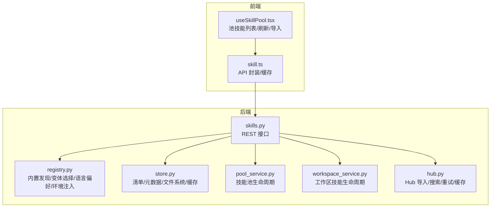
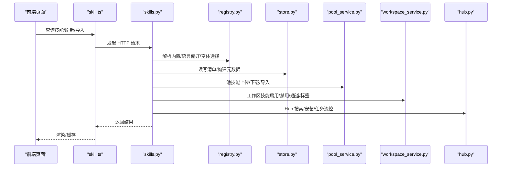
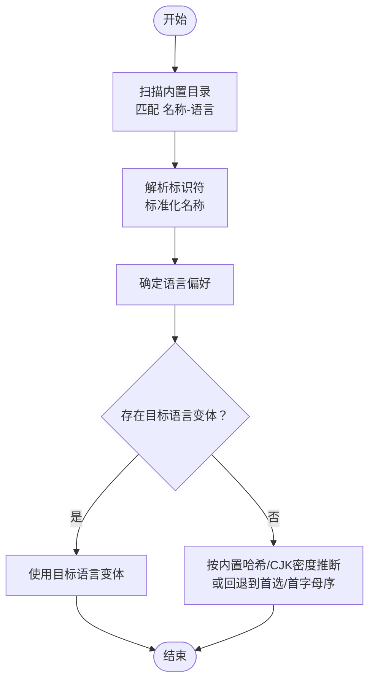
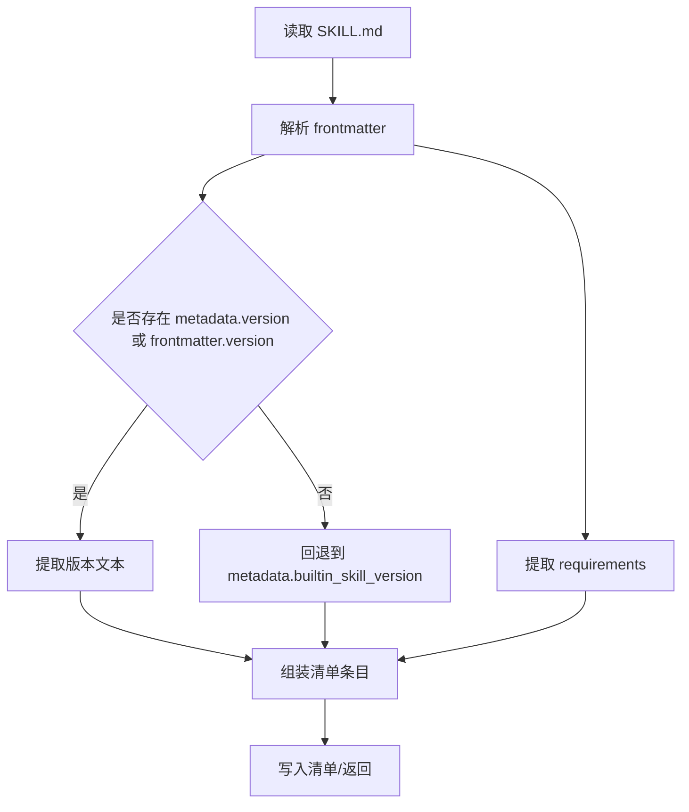
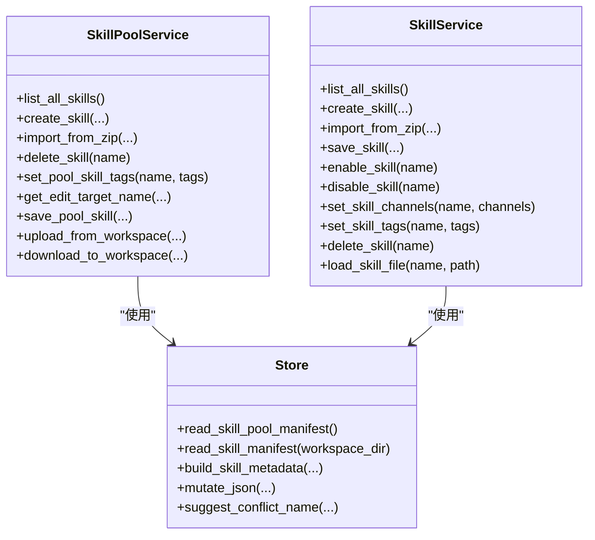
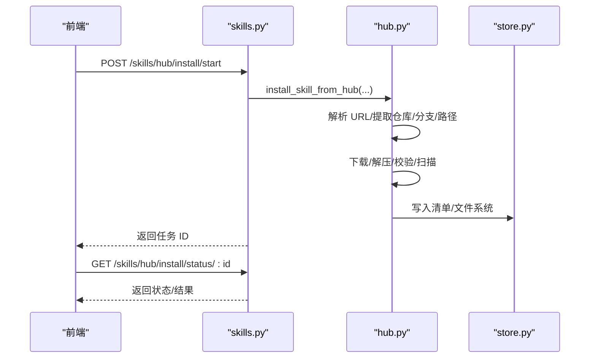
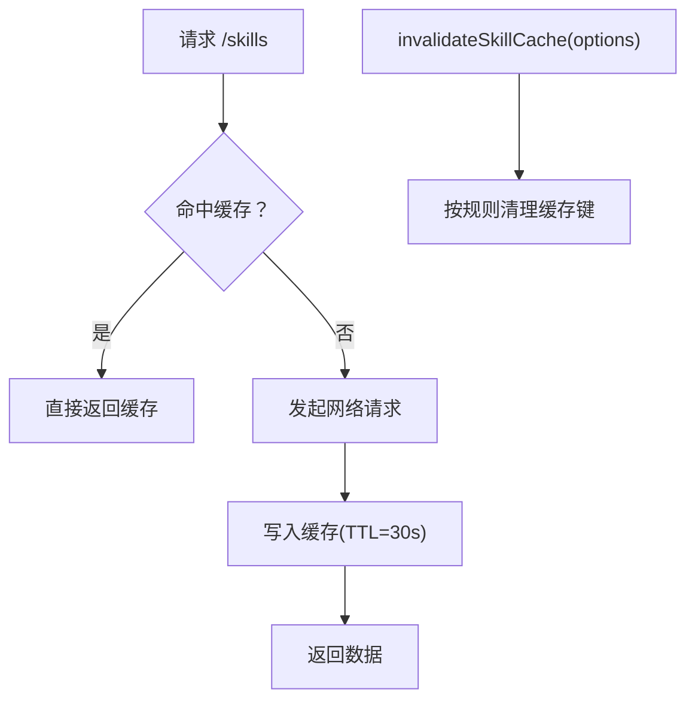
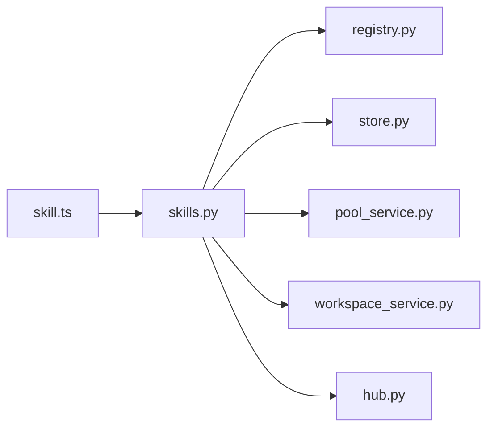

# 技能注册表

<cite>
**本文引用的文件**   
- [registry.py](file://src/qwenpaw/agents/skill_system/registry.py)
- [store.py](file://src/qwenpaw/agents/skill_system/store.py)
- [pool_service.py](file://src/qwenpaw/agents/skill_system/pool_service.py)
- [workspace_service.py](file://src/qwenpaw/agents/skill_system/workspace_service.py)
- [hub.py](file://src/qwenpaw/agents/skill_system/hub.py)
- [skills.py](file://src/qwenpaw/app/routers/skills.py)
- [skill.ts](file://console/src/api/modules/skill.ts)
- [useSkillPool.tsx](file://console/src/pages/Settings/SkillPool/useSkillPool.tsx)
- [models.py](file://src/qwenpaw/agents/skill_system/models.py)
</cite>

## 目录
1. [简介](#简介)
2. [项目结构](#项目结构)
3. [核心组件](#核心组件)
4. [架构总览](#架构总览)
5. [详细组件分析](#详细组件分析)
6. [依赖分析](#依赖分析)
7. [性能考虑](#性能考虑)
8. [故障排查指南](#故障排查指南)
9. [结论](#结论)
10. [附录：API 使用示例与最佳实践](#附录api-使用示例与最佳实践)

## 简介
本文件系统性阐述 QwenPaw 技能注册表的设计与实现，覆盖内置技能的发现、解析与管理，技能标识符解析规则、语言变体选择算法、缓存策略，以及元数据构建流程（版本、描述、依赖）。同时给出前端 API 的调用方式、语言偏好设置、导入/更新/版本管理等能力，并提供可操作的最佳实践。

## 项目结构
技能注册表位于 Python 后端的技能子系统中，由以下模块协同工作：
- 注册与解析：registry.py 负责内置技能目录扫描、变体选择、语言偏好、环境变量注入等
- 存储与清单：store.py 提供清单读写、文件系统抽象、元数据构建、冲突建议等
- 池服务：pool_service.py 管理共享技能池（导入/导出、上传/下载、标签、配置）
- 工作区服务：workspace_service.py 管理工作区内的技能启用、通道路由、标签、配置
- 技能中心：hub.py 提供从外部 Hub 导入、搜索、安装任务流控与重试
- 路由接口：skills.py 对外暴露 REST API，聚合上述能力
- 前端 API：skill.ts 提供前端调用封装与缓存控制；useSkillPool.tsx 展示池内技能管理界面逻辑

图表来源
- [registry.py:1-200](file://src/qwenpaw/agents/skill_system/registry.py#L1-L200)
- [store.py:1-120](file://src/qwenpaw/agents/skill_system/store.py#L1-L120)
- [pool_service.py:1-120](file://src/qwenpaw/agents/skill_system/pool_service.py#L1-L120)
- [workspace_service.py:1-120](file://src/qwenpaw/agents/skill_system/workspace_service.py#L1-L120)
- [hub.py:1-120](file://src/qwenpaw/agents/skill_system/hub.py#L1-L120)
- [skills.py:1-120](file://src/qwenpaw/app/routers/skills.py#L1-L120)
- [skill.ts:1-80](file://console/src/api/modules/skill.ts#L1-L80)
- [useSkillPool.tsx:80-120](file://console/src/pages/Settings/SkillPool/useSkillPool.tsx#L80-L120)

章节来源
- [registry.py:1-200](file://src/qwenpaw/agents/skill_system/registry.py#L1-L200)
- [store.py:1-120](file://src/qwenpaw/agents/skill_system/store.py#L1-L120)
- [pool_service.py:1-120](file://src/qwenpaw/agents/skill_system/pool_service.py#L1-L120)
- [workspace_service.py:1-120](file://src/qwenpaw/agents/skill_system/workspace_service.py#L1-L120)
- [hub.py:1-120](file://src/qwenpaw/agents/skill_system/hub.py#L1-L120)
- [skills.py:1-120](file://src/qwenpaw/app/routers/skills.py#L1-L120)
- [skill.ts:1-80](file://console/src/api/modules/skill.ts#L1-L80)
- [useSkillPool.tsx:80-120](file://console/src/pages/Settings/SkillPool/useSkillPool.tsx#L80-L120)

## 核心组件
- 内置技能注册与变体选择：基于打包内置目录扫描，解析技能标识符，按语言偏好选择最优变体
- 技能元数据构建：从 SKILL.md frontmatter 提取名称、描述、版本、要求等，生成清单条目
- 技能池与工作区：统一的清单与文件系统抽象，支持导入/导出、上传/下载、标签与配置持久化
- Hub 集成：支持多源 Hub 搜索与导入，带取消、重试、速率限制与缓存
- 前端 API：提供技能查询、刷新、导入、配置、通道与标签管理等接口，并内置缓存与失效策略

章节来源
- [registry.py:120-230](file://src/qwenpaw/agents/skill_system/registry.py#L120-L230)
- [store.py:555-580](file://src/qwenpaw/agents/skill_system/store.py#L555-L580)
- [pool_service.py:45-120](file://src/qwenpaw/agents/skill_system/pool_service.py#L45-L120)
- [workspace_service.py:40-120](file://src/qwenpaw/agents/skill_system/workspace_service.py#L40-L120)
- [hub.py:1-120](file://src/qwenpaw/agents/skill_system/hub.py#L1-L120)
- [skills.py:608-760](file://src/qwenpaw/app/routers/skills.py#L608-L760)
- [skill.ts:117-180](file://console/src/api/modules/skill.ts#L117-L180)

## 架构总览
技能注册表围绕“清单 + 文件系统”的双轨设计：清单负责运行时状态与元数据，文件系统承载实际内容。后端通过路由层统一对外提供能力，前端通过 API 封装进行调用并维护本地缓存。

图表来源
- [skills.py:608-760](file://src/qwenpaw/app/routers/skills.py#L608-L760)
- [registry.py:120-230](file://src/qwenpaw/agents/skill_system/registry.py#L120-L230)
- [store.py:555-580](file://src/qwenpaw/agents/skill_system/store.py#L555-L580)
- [pool_service.py:45-120](file://src/qwenpaw/agents/skill_system/pool_service.py#L45-L120)
- [workspace_service.py:40-120](file://src/qwenpaw/agents/skill_system/workspace_service.py#L40-L120)
- [hub.py:1-120](file://src/qwenpaw/agents/skill_system/hub.py#L1-L120)
- [skill.ts:117-180](file://console/src/api/modules/skill.ts#L117-L180)

## 详细组件分析

### 内置技能发现与变体选择
- 目录扫描：遍历内置技能目录，识别以“名称-语言”命名的子目录，读取 SKILL.md frontmatter
- 标识符解析：正则匹配“名称-语言”，标准化为规范名称，避免误判非内置目录
- 语言偏好：优先从设置中读取，其次回退到 UI 语言；若未指定则默认英文
- 变体选择：按首选语言优先，否则按字典序选择首个可用语言
- 迁移与回退：当池内技能与内置内容哈希一致或 CJK 字符密度较高时，推断语言

图表来源
- [registry.py:120-230](file://src/qwenpaw/agents/skill_system/registry.py#L120-L230)
- [registry.py:394-452](file://src/qwenpaw/agents/skill_system/registry.py#L394-L452)

章节来源
- [registry.py:120-230](file://src/qwenpaw/agents/skill_system/registry.py#L120-L230)
- [registry.py:394-452](file://src/qwenpaw/agents/skill_system/registry.py#L394-L452)

### 技能元数据构建与版本提取
- 元数据来源：SKILL.md frontmatter，包含名称、描述、版本、要求等
- 版本提取：优先 metadata.version，其次 frontmatter.version，再其次 metadata.builtin_skill_version
- 要求提取：支持多命名空间（openclaw/qwenpaw/clawdbot），兼容数组与对象两种形式
- 清单条目：每次重建，确保清单描述性而非权威性

图表来源
- [store.py:194-204](file://src/qwenpaw/agents/skill_system/store.py#L194-L204)
- [store.py:513-553](file://src/qwenpaw/agents/skill_system/store.py#L513-L553)
- [store.py:555-580](file://src/qwenpaw/agents/skill_system/store.py#L555-L580)

章节来源
- [store.py:194-204](file://src/qwenpaw/agents/skill_system/store.py#L194-L204)
- [store.py:513-553](file://src/qwenpaw/agents/skill_system/store.py#L513-L553)
- [store.py:555-580](file://src/qwenpaw/agents/skill_system/store.py#L555-L580)

### 技能池与工作区生命周期
- 技能池：集中存放可复用技能，支持导入自 zip、从工作区上传、下载到多个工作区、标签与配置持久化
- 工作区：维护启用状态、通道路由、标签与配置，变更会触发代理重载
- 冲突处理：提供建议重命名，避免同名冲突；支持预览模式

图表来源
- [pool_service.py:45-120](file://src/qwenpaw/agents/skill_system/pool_service.py#L45-L120)
- [workspace_service.py:40-120](file://src/qwenpaw/agents/skill_system/workspace_service.py#L40-L120)
- [store.py:555-580](file://src/qwenpaw/agents/skill_system/store.py#L555-L580)

章节来源
- [pool_service.py:45-120](file://src/qwenpaw/agents/skill_system/pool_service.py#L45-L120)
- [workspace_service.py:40-120](file://src/qwenpaw/agents/skill_system/workspace_service.py#L40-L120)
- [store.py:555-580](file://src/qwenpaw/agents/skill_system/store.py#L555-L580)

### Hub 集成与导入流程
- 多源支持：ClawHub、skills.sh、LobeHub、SkillsMP、ModelScope、GitHub 等
- 安全与限流：超时、重试、指数退避、速率限制、响应大小限制、缓存
- 任务流控：异步安装任务、取消事件、状态轮询
- 内容归一化：统一提取 name/content/references/scripts/files，必要时回退到 SKILL.md

图表来源
- [skills.py:657-715](file://src/qwenpaw/app/routers/skills.py#L657-L715)
- [hub.py:1-120](file://src/qwenpaw/agents/skill_system/hub.py#L1-L120)
- [store.py:794-800](file://src/qwenpaw/agents/skill_system/store.py#L794-L800)

章节来源
- [skills.py:657-715](file://src/qwenpaw/app/routers/skills.py#L657-L715)
- [hub.py:1-120](file://src/qwenpaw/agents/skill_system/hub.py#L1-L120)
- [store.py:794-800](file://src/qwenpaw/agents/skill_system/store.py#L794-L800)

### 前端缓存与调用
- 缓存策略：内存 Map + TTL（30 秒），支持按路径前缀精确失效
- 刷新与批量操作：支持刷新工作区/池、批量启用/禁用/删除
- 流式优化：提供 AI 优化技能内容的流式接口

图表来源
- [skill.ts:17-64](file://console/src/api/modules/skill.ts#L17-L64)
- [useSkillPool.tsx:201-247](file://console/src/pages/Settings/SkillPool/useSkillPool.tsx#L201-L247)

章节来源
- [skill.ts:17-64](file://console/src/api/modules/skill.ts#L17-L64)
- [useSkillPool.tsx:201-247](file://console/src/pages/Settings/SkillPool/useSkillPool.tsx#L201-L247)

## 依赖分析
- 组件耦合
  - 路由层 skills.py 依赖 registry、store、pool_service、workspace_service、hub
  - 前端 skill.ts 仅依赖后端路由，不直接访问存储细节
- 外部依赖
  - HTTP 客户端、JSON 序列化、文件锁、安全扫描器
- 并发与一致性
  - 清单写入采用原子写与文件锁，避免并发冲突
  - Hub 导入使用异步任务与取消事件，保障用户体验

图表来源
- [skills.py:1-120](file://src/qwenpaw/app/routers/skills.py#L1-L120)
- [registry.py:1-60](file://src/qwenpaw/agents/skill_system/registry.py#L1-L60)
- [store.py:1-60](file://src/qwenpaw/agents/skill_system/store.py#L1-L60)
- [pool_service.py:1-60](file://src/qwenpaw/agents/skill_system/pool_service.py#L1-L60)
- [workspace_service.py:1-60](file://src/qwenpaw/agents/skill_system/workspace_service.py#L1-L60)
- [hub.py:1-60](file://src/qwenpaw/agents/skill_system/hub.py#L1-L60)
- [skill.ts:1-20](file://console/src/api/modules/skill.ts#L1-L20)

章节来源
- [skills.py:1-120](file://src/qwenpaw/app/routers/skills.py#L1-L120)
- [skill.ts:1-20](file://console/src/api/modules/skill.ts#L1-L20)

## 性能考虑
- 清单缓存：基于 mtime 的 LRU 缓存减少重复解析
- 文件锁：跨进程原子写入，避免竞态
- Hub 缓存：GitHub 目录/树/内容等结果带 TTL 缓存
- I/O 限制：Zip/HTTP 响应大小限制，防止过大资源占用
- 变体选择：内置注册表带内存缓存，降低重复扫描成本

章节来源
- [store.py:632-671](file://src/qwenpaw/agents/skill_system/store.py#L632-L671)
- [hub.py:92-127](file://src/qwenpaw/agents/skill_system/hub.py#L92-L127)
- [registry.py:55-114](file://src/qwenpaw/agents/skill_system/registry.py#L55-L114)

## 故障排查指南
- 扫描失败：检查 SKILL.md 是否存在且 frontmatter 完整
- 冲突错误：根据建议重命名或启用覆盖模式
- Hub 导入失败：查看任务状态与错误详情，确认 URL 格式与网络权限
- 速率限制：设置 GITHUB_TOKEN 以提升配额
- 清单损坏：后端会回退到默认值并记录警告

章节来源
- [store.py:659-671](file://src/qwenpaw/agents/skill_system/store.py#L659-L671)
- [workspace_service.py:645-685](file://src/qwenpaw/agents/skill_system/workspace_service.py#L645-L685)
- [hub.py:328-377](file://src/qwenpaw/agents/skill_system/hub.py#L328-L377)

## 结论
QwenPaw 技能注册表通过清晰的分层设计与严格的清单/文件系统分离，实现了内置技能的自动发现与变体选择、元数据的可靠构建、池与工作区的统一生命周期管理，以及 Hub 的多源导入与流式安装。前端提供简洁的 API 封装与缓存控制，便于集成与扩展。

## 附录：API 使用示例与最佳实践

### 语言偏好与变体选择
- 设置 UI 语言会同步影响内置技能语言偏好（若未显式设置）
- 变体选择优先目标语言，其次内置哈希/CJK密度推断，最后回退到首选或首字母序

章节来源
- [skills.py:47-66](file://src/qwenpaw/app/routers/settings.py#L47-L66)
- [registry.py:195-211](file://src/qwenpaw/agents/skill_system/registry.py#L195-L211)
- [registry.py:394-452](file://src/qwenpaw/agents/skill_system/registry.py#L394-L452)

### 技能查询与刷新
- 查询工作区技能：GET /skills
- 刷新工作区技能：POST /skills/refresh
- 查询池技能：GET /skills/pool
- 刷新池技能：POST /skills/pool/refresh

章节来源
- [skills.py:608-620](file://src/qwenpaw/app/routers/skills.py#L608-L620)
- [skills.py:717-727](file://src/qwenpaw/app/routers/skills.py#L717-L727)
- [skill.ts:118-177](file://console/src/api/modules/skill.ts#L118-L177)

### 池技能导入与管理
- 列出内置导入候选：GET /skills/pool/builtin-sources
- 获取内置更新提示：GET /skills/pool/builtin-notice
- 导入内置技能：POST /skills/pool/import-builtin
- 上传工作区技能到池：POST /skills/pool/upload
- 从池下载技能到工作区：POST /skills/pool/download
- 删除池技能：DELETE /skills/pool/{name}

章节来源
- [skills.py:729-758](file://src/qwenpaw/app/routers/skills.py#L729-L758)
- [skills.py:335-381](file://src/qwenpaw/app/routers/skills.py#L335-L381)
- [skill.ts:335-435](file://console/src/api/modules/skill.ts#L335-L435)

### Hub 技能安装
- 开始安装：POST /skills/hub/install/start
- 查询状态：GET /skills/hub/install/status/{task_id}
- 取消安装：POST /skills/hub/install/cancel/{task_id}
- 直接从 Hub 导入池：POST /skills/pool/import

章节来源
- [skills.py:657-715](file://src/qwenpaw/app/routers/skills.py#L657-L715)
- [skill.ts:296-334](file://console/src/api/modules/skill.ts#L296-L334)
- [skill.ts:307-321](file://console/src/api/modules/skill.ts#L307-L321)

### 工作区技能启用/禁用与通道
- 启用/禁用：POST /skills/{name}/enable | disable
- 更新通道：PUT /skills/{name}/channels
- 更新标签：PUT /skills/{name}/tags
- 获取/更新配置：GET|PUT /skills/{name}/config

章节来源
- [skills.py:1412-1460](file://src/qwenpaw/app/routers/skills.py#L1412-L1460)
- [skills.py:1462-1480](file://src/qwenpaw/app/routers/skills.py#L1462-L1480)
- [skills.py:1482-1492](file://src/qwenpaw/app/routers/skills.py#L1482-L1492)
- [skill.ts:242-274](file://console/src/api/modules/skill.ts#L242-L274)
- [skill.ts:428-444](file://console/src/api/modules/skill.ts#L428-L444)
- [skill.ts:455-474](file://console/src/api/modules/skill.ts#L455-L474)

### 最佳实践
- 使用池统一管理可复用技能，避免工作区内重复
- 导入前先调用“获取内置更新提示”，评估升级风险
- 批量操作使用 POST /skills/batch-* 以减少往返
- 配置敏感项通过环境变量注入，避免明文泄露
- 定期刷新清单以同步最新状态

章节来源
- [pool_service.py:555-624](file://src/qwenpaw/agents/skill_system/pool_service.py#L555-L624)
- [registry.py:259-301](file://src/qwenpaw/agents/skill_system/registry.py#L259-L301)
- [skills.py:614-620](file://src/qwenpaw/app/routers/skills.py#L614-L620)