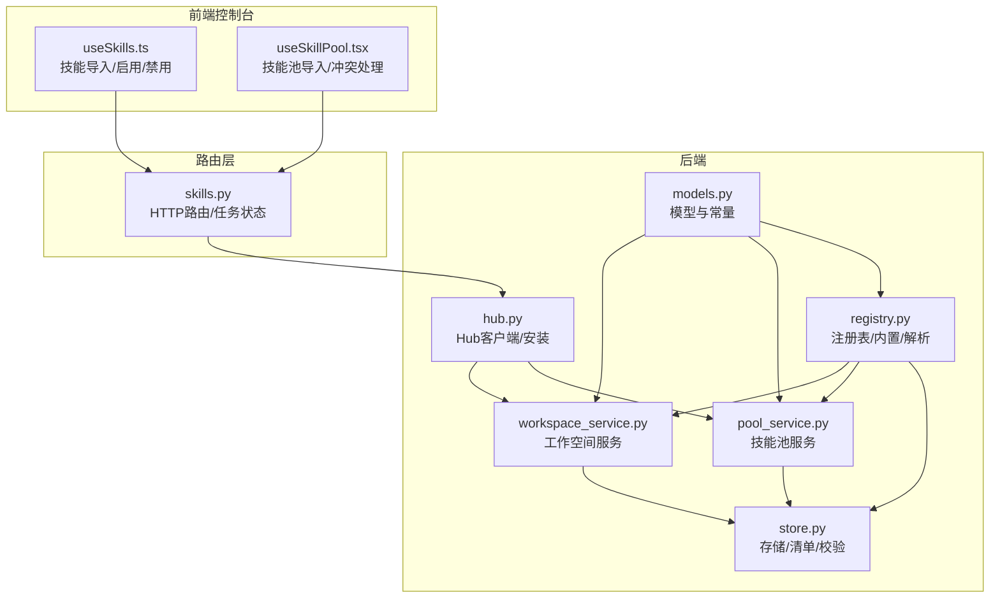
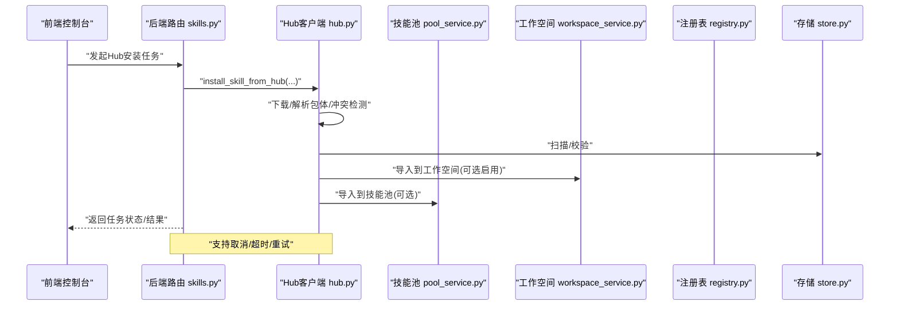
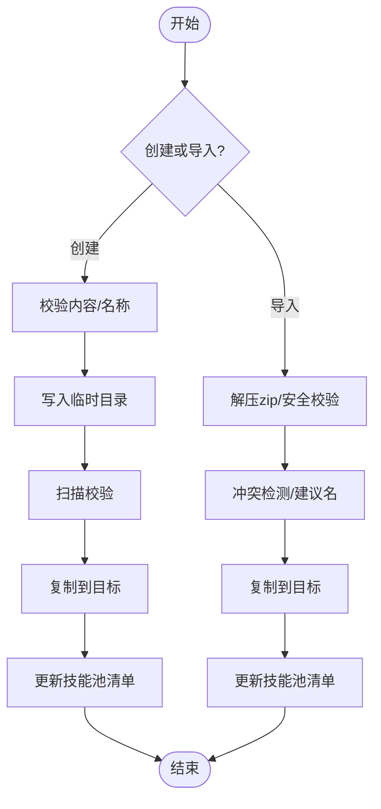
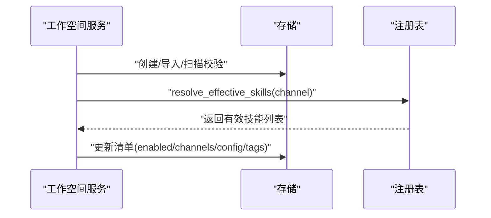
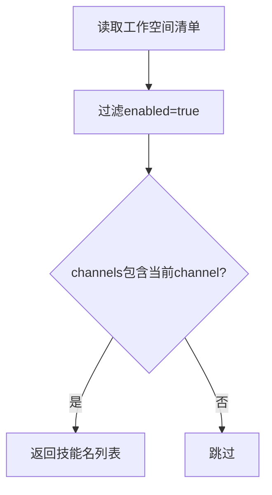
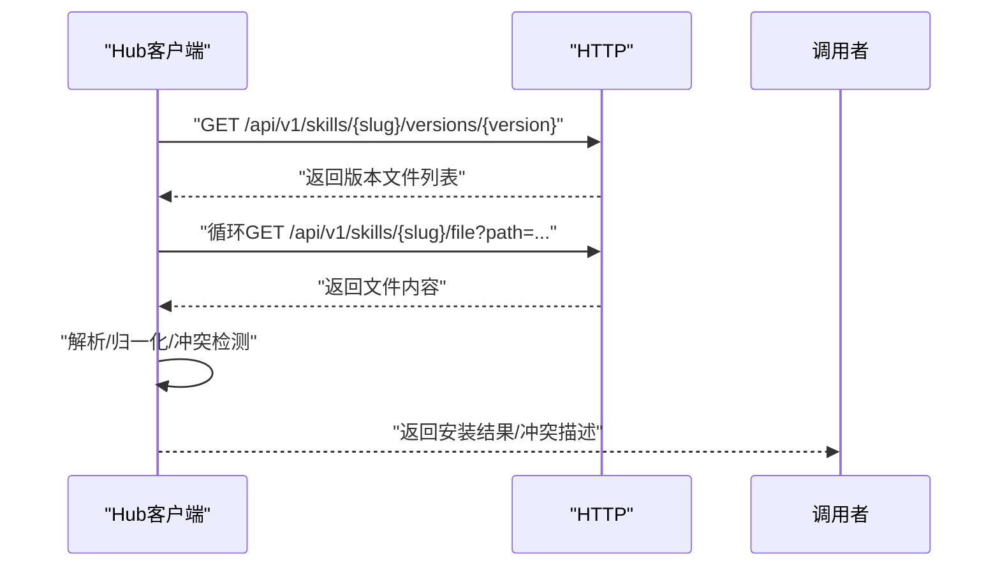
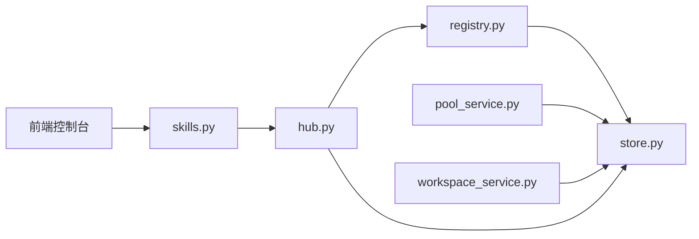

# 技能系统

<cite>
**本文引用的文件**
- [src/qwenpaw/agents/skill_system/__init__.py](file://src/qwenpaw/agents/skill_system/__init__.py)
- [src/qwenpaw/agents/skill_system/models.py](file://src/qwenpaw/agents/skill_system/models.py)
- [src/qwenpaw/agents/skill_system/registry.py](file://src/qwenpaw/agents/skill_system/registry.py)
- [src/qwenpaw/agents/skill_system/store.py](file://src/qwenpaw/agents/skill_system/store.py)
- [src/qwenpaw/agents/skill_system/pool_service.py](file://src/qwenpaw/agents/skill_system/pool_service.py)
- [src/qwenpaw/agents/skill_system/workspace_service.py](file://src/qwenpaw/agents/skill_system/workspace_service.py)
- [src/qwenpaw/agents/skill_system/hub.py](file://src/qwenpaw/agents/skill_system/hub.py)
- [src/qwenpaw/agents/skills/pdf-zh/SKILL.md](file://src/qwenpaw/agents/skills/pdf-zh/SKILL.md)
- [src/qwenpaw/agents/skills/docx-en/SKILL.md](file://src/qwenpaw/agents/skills/docx-en/SKILL.md)
- [src/qwenpaw/app/routers/skills.py](file://src/qwenpaw/app/routers/skills.py)
- [console/src/pages/Agent/Skills/useSkills.ts](file://console/src/pages/Agent/Skills/useSkills.ts)
- [console/src/pages/Settings/SkillPool/useSkillPool.tsx](file://console/src/pages/Settings/SkillPool/useSkillPool.tsx)
</cite>

## 目录
1. [简介](#简介)
2. [项目结构](#项目结构)
3. [核心组件](#核心组件)
4. [架构总览](#架构总览)
5. [详细组件分析](#详细组件分析)
6. [依赖分析](#依赖分析)
7. [性能考虑](#性能考虑)
8. [故障排查指南](#故障排查指南)
9. [结论](#结论)
10. [附录](#附录)

## 简介
本文件面向开发者与运维人员，系统化阐述 QwenPaw 技能系统的架构设计与执行引擎，覆盖技能注册表、技能池管理、工作空间技能服务、技能中心 Hub 的功能与交互；解释技能定义格式、执行流程、参数传递与结果处理；提供内置技能样例与自定义技能开发指南；说明权限控制、安全检查与性能优化策略，并给出技能共享、版本管理与依赖解析的实现细节与最佳实践。

## 项目结构
技能系统位于后端 Python 包 src/qwenpaw/agents/skill_system 下，采用“分层+职责分离”的组织方式：
- models.py：技能模型与常量定义（如 SkillInfo、SkillRequirements、路由通道等）
- registry.py：内置技能语言偏好、导入、版本同步、运行时解析与环境注入
- store.py：本地存储、清单读写、路径与校验、压缩包导入、扫描器集成
- pool_service.py：共享技能池生命周期管理（创建、导入、上传/下载、重命名、删除、标签）
- workspace_service.py：工作空间内技能生命周期管理（创建、导入、启用/禁用、通道配置、文件读取）
- hub.py：技能中心 Hub 客户端、安装辅助、网络请求与重试、冲突检测与建议名
- 前端控制台通过路由 skills.py 与 hub.py 协作，提供可视化导入、启用/禁用、冲突处理与扫描告警

图示来源
- [src/qwenpaw/agents/skill_system/__init__.py:1-41](file://src/qwenpaw/agents/skill_system/__init__.py#L1-L41)
- [src/qwenpaw/agents/skill_system/models.py:1-77](file://src/qwenpaw/agents/skill_system/models.py#L1-L77)
- [src/qwenpaw/agents/skill_system/registry.py:1-1426](file://src/qwenpaw/agents/skill_system/registry.py#L1-L1426)
- [src/qwenpaw/agents/skill_system/store.py:1-852](file://src/qwenpaw/agents/skill_system/store.py#L1-L852)
- [src/qwenpaw/agents/skill_system/pool_service.py:1-866](file://src/qwenpaw/agents/skill_system/pool_service.py#L1-L866)
- [src/qwenpaw/agents/skill_system/workspace_service.py:1-718](file://src/qwenpaw/agents/skill_system/workspace_service.py#L1-L718)
- [src/qwenpaw/agents/skill_system/hub.py:1-1736](file://src/qwenpaw/agents/skill_system/hub.py#L1-L1736)
- [src/qwenpaw/app/routers/skills.py:427-954](file://src/qwenpaw/app/routers/skills.py#L427-L954)
- [console/src/pages/Agent/Skills/useSkills.ts:150-274](file://console/src/pages/Agent/Skills/useSkills.ts#L150-L274)
- [console/src/pages/Settings/SkillPool/useSkillPool.tsx:881-924](file://console/src/pages/Settings/SkillPool/useSkillPool.tsx#L881-L924)

章节来源
- [src/qwenpaw/agents/skill_system/__init__.py:1-41](file://src/qwenpaw/agents/skill_system/__init__.py#L1-L41)
- [src/qwenpaw/agents/skill_system/models.py:1-77](file://src/qwenpaw/agents/skill_system/models.py#L1-L77)

## 核心组件
- 模型与常量
  - SkillInfo：工作空间/Hub 返回的技能信息载体，包含 name、description、version_text、content、source、references、scripts、emoji 等字段
  - SkillRequirements：声明技能所需的二进制与环境变量
  - BuiltinSkillVariant/BuiltinSkillIdentity：内置技能变体与标识
  - ALL_SKILL_ROUTING_CHANNELS：技能路由通道集合
- 注册表与运行时解析
  - 内置技能语言偏好与缓存、内置导入候选构建、语言选择与迁移
  - apply_skill_config_env_overrides：按需注入环境变量
  - reconcile_pool_manifest/reconcile_workspace_manifest：清单与文件系统一致性重建
  - resolve_effective_skills：按通道解析有效技能列表
- 存储与清单
  - 路径获取、文件锁与原子写入、zip 解压与安全校验、冲突名建议、技能元数据构建
- 技能池服务
  - 创建/导入/上传/下载/重命名/删除/标签设置/编辑保存
- 工作空间服务
  - 创建/导入/启用/禁用/通道配置/标签/删除/文件读取
- Hub 客户端
  - 搜索/详情/版本/文件下载、HTTP 超时/重试/退避、冲突检测与建议名、包体解析与树形结构归一化

章节来源
- [src/qwenpaw/agents/skill_system/models.py:1-77](file://src/qwenpaw/agents/skill_system/models.py#L1-L77)
- [src/qwenpaw/agents/skill_system/registry.py:1-1426](file://src/qwenpaw/agents/skill_system/registry.py#L1-L1426)
- [src/qwenpaw/agents/skill_system/store.py:1-852](file://src/qwenpaw/agents/skill_system/store.py#L1-L852)
- [src/qwenpaw/agents/skill_system/pool_service.py:1-866](file://src/qwenpaw/agents/skill_system/pool_service.py#L1-L866)
- [src/qwenpaw/agents/skill_system/workspace_service.py:1-718](file://src/qwenpaw/agents/skill_system/workspace_service.py#L1-L718)
- [src/qwenpaw/agents/skill_system/hub.py:1-1736](file://src/qwenpaw/agents/skill_system/hub.py#L1-L1736)

## 架构总览
技能系统围绕“共享技能池 + 工作空间技能”双层结构展开，通过注册表与清单实现版本与语言的统一管理，并以 Hub 为中心实现技能的共享与分发。运行时通过 resolve_effective_skills 按通道筛选启用的技能，结合 apply_skill_config_env_overrides 注入配置到环境变量，确保技能执行上下文一致。

图示来源
- [src/qwenpaw/app/routers/skills.py:427-954](file://src/qwenpaw/app/routers/skills.py#L427-L954)
- [src/qwenpaw/agents/skill_system/hub.py:1-1736](file://src/qwenpaw/agents/skill_system/hub.py#L1-L1736)
- [src/qwenpaw/agents/skill_system/pool_service.py:1-866](file://src/qwenpaw/agents/skill_system/pool_service.py#L1-L866)
- [src/qwenpaw/agents/skill_system/workspace_service.py:1-718](file://src/qwenpaw/agents/skill_system/workspace_service.py#L1-L718)
- [src/qwenpaw/agents/skill_system/registry.py:1-1426](file://src/qwenpaw/agents/skill_system/registry.py#L1-L1426)
- [src/qwenpaw/agents/skill_system/store.py:1-852](file://src/qwenpaw/agents/skill_system/store.py#L1-L852)

## 详细组件分析

### 技能定义格式与内容结构
- 必备字段：SKILL.md 的 frontmatter 至少包含 name 与 description，否则视为无效
- 可选元数据：metadata.qwenpaw.emoji 提取为展示表情；metadata.builtin_skill_version 用于内置版本识别
- 目录结构：支持 references/scripts 子目录，作为外部引用与脚本树形存放
- 依赖声明：metadata 命名空间下可声明 require_bins 与 require_envs，用于运行前校验与环境注入

章节来源
- [src/qwenpaw/agents/skill_system/store.py:673-852](file://src/qwenpaw/agents/skill_system/store.py#L673-L852)
- [src/qwenpaw/agents/skills/pdf-zh/SKILL.md:1-330](file://src/qwenpaw/agents/skills/pdf-zh/SKILL.md#L1-L330)
- [src/qwenpaw/agents/skills/docx-en/SKILL.md:1-488](file://src/qwenpaw/agents/skills/docx-en/SKILL.md#L1-L488)

### 技能池服务（SkillPoolService）
职责
- 列出/创建/导入（zip）/删除/重命名/编辑保存
- 上传到技能池与从技能池下载到工作空间
- 标签设置、语言回填、冲突检测与建议名

关键流程
- 创建：校验内容、规范化名称、写入临时目录、扫描校验、复制到目标、更新清单
- 导入：解压 zip、安全校验、冲突检测、扫描校验、复制到目标、更新清单
- 上传/下载：校验源/目标状态、冲突判定（内置升级/语言切换/普通冲突）、必要时回填语言元数据

图示来源
- [src/qwenpaw/agents/skill_system/pool_service.py:1-866](file://src/qwenpaw/agents/skill_system/pool_service.py#L1-L866)
- [src/qwenpaw/agents/skill_system/store.py:1-852](file://src/qwenpaw/agents/skill_system/store.py#L1-L852)

章节来源
- [src/qwenpaw/agents/skill_system/pool_service.py:1-866](file://src/qwenpaw/agents/skill_system/pool_service.py#L1-L866)
- [src/qwenpaw/agents/skill_system/store.py:1-852](file://src/qwenpaw/agents/skill_system/store.py#L1-L852)

### 工作空间服务（SkillService）
职责
- 列出可用技能、创建/导入、启用/禁用、通道配置、标签、删除、读取内部文件
- 与注册表协作，按通道解析有效技能列表

关键流程
- 创建/导入：校验 frontmatter、扫描校验、复制到工作空间、重建清单（保留 enabled/channels/config/tags）
- 启用/禁用：重新扫描校验后更新清单
- 通道配置：支持 ["all"] 或具体通道列表
- 文件读取：仅允许 references/scripts 相对路径访问，防止越权

图示来源
- [src/qwenpaw/agents/skill_system/workspace_service.py:1-718](file://src/qwenpaw/agents/skill_system/workspace_service.py#L1-L718)
- [src/qwenpaw/agents/skill_system/registry.py:1109-1125](file://src/qwenpaw/agents/skill_system/registry.py#L1109-L1125)
- [src/qwenpaw/agents/skill_system/store.py:1-852](file://src/qwenpaw/agents/skill_system/store.py#L1-L852)

章节来源
- [src/qwenpaw/agents/skill_system/workspace_service.py:1-718](file://src/qwenpaw/agents/skill_system/workspace_service.py#L1-L718)
- [src/qwenpaw/agents/skill_system/registry.py:1109-1125](file://src/qwenpaw/agents/skill_system/registry.py#L1109-L1125)

### 注册表与运行时解析（registry.py）
职责
- 内置技能语言偏好与缓存、内置导入候选构建、语言选择与迁移
- apply_skill_config_env_overrides：按需注入环境变量（仅对有效技能）
- reconcile_pool_manifest/reconcile_workspace_manifest：一致性重建
- resolve_effective_skills：按通道解析有效技能

图示来源
- [src/qwenpaw/agents/skill_system/registry.py:1109-1125](file://src/qwenpaw/agents/skill_system/registry.py#L1109-L1125)

章节来源
- [src/qwenpaw/agents/skill_system/registry.py:1-1426](file://src/qwenpaw/agents/skill_system/registry.py#L1-L1426)

### Hub 客户端与安装流程（hub.py）
职责
- 搜索/详情/版本/文件下载
- HTTP 超时/重试/退避策略
- 包体解析（支持 ClawHub 兼容响应）、树形结构归一化
- 冲突检测与建议名、取消检查、安全限制（zip条目数/大小、禁止符号链接）

图示来源
- [src/qwenpaw/agents/skill_system/hub.py:1-1736](file://src/qwenpaw/agents/skill_system/hub.py#L1-L1736)

章节来源
- [src/qwenpaw/agents/skill_system/hub.py:1-1736](file://src/qwenpaw/agents/skill_system/hub.py#L1-L1736)

### 前端交互与路由对接
- 控制台页面通过 useSkills.ts 与 useSkillPool.tsx 发起 Hub 技能安装任务，轮询任务状态，处理冲突与扫描告警
- 后端路由 skills.py 提供任务启动、状态查询、取消接口，并在安装过程中执行扫描与冲突处理

章节来源
- [console/src/pages/Agent/Skills/useSkills.ts:150-274](file://console/src/pages/Agent/Skills/useSkills.ts#L150-L274)
- [console/src/pages/Settings/SkillPool/useSkillPool.tsx:881-924](file://console/src/pages/Settings/SkillPool/useSkillPool.tsx#L881-L924)
- [src/qwenpaw/app/routers/skills.py:427-954](file://src/qwenpaw/app/routers/skills.py#L427-L954)

## 依赖分析
- 组件耦合
  - registry.py 与 store.py：注册表依赖存储的路径、清单读写、扫描器集成
  - pool_service.py 与 workspace_service.py：均依赖 store.py 的文件复制、清单原子写入、冲突名建议
  - hub.py：依赖 registry 的语言偏好与内置版本信息，依赖 store 的扫描器集成
  - 前端控制台通过路由 skills.py 与 hub.py 交互
- 外部依赖
  - HTTP 客户端与重试策略（hub.py）
  - 扫描器（store.py 集成安全扫描）
  - 文件系统与跨进程锁（store.py）

图示来源
- [src/qwenpaw/agents/skill_system/registry.py:1-1426](file://src/qwenpaw/agents/skill_system/registry.py#L1-L1426)
- [src/qwenpaw/agents/skill_system/store.py:1-852](file://src/qwenpaw/agents/skill_system/store.py#L1-L852)
- [src/qwenpaw/agents/skill_system/pool_service.py:1-866](file://src/qwenpaw/agents/skill_system/pool_service.py#L1-L866)
- [src/qwenpaw/agents/skill_system/workspace_service.py:1-718](file://src/qwenpaw/agents/skill_system/workspace_service.py#L1-L718)
- [src/qwenpaw/agents/skill_system/hub.py:1-1736](file://src/qwenpaw/agents/skill_system/hub.py#L1-L1736)
- [src/qwenpaw/app/routers/skills.py:427-954](file://src/qwenpaw/app/routers/skills.py#L427-L954)

章节来源
- [src/qwenpaw/agents/skill_system/registry.py:1-1426](file://src/qwenpaw/agents/skill_system/registry.py#L1-L1426)
- [src/qwenpaw/agents/skill_system/store.py:1-852](file://src/qwenpaw/agents/skill_system/store.py#L1-L852)
- [src/qwenpaw/agents/skill_system/pool_service.py:1-866](file://src/qwenpaw/agents/skill_system/pool_service.py#L1-L866)
- [src/qwenpaw/agents/skill_system/workspace_service.py:1-718](file://src/qwenpaw/agents/skill_system/workspace_service.py#L1-L718)
- [src/qwenpaw/agents/skill_system/hub.py:1-1736](file://src/qwenpaw/agents/skill_system/hub.py#L1-L1736)
- [src/qwenpaw/app/routers/skills.py:427-954](file://src/qwenpaw/app/routers/skills.py#L427-L954)

## 性能考虑
- 清单读写
  - 使用文件锁与原子写入，避免并发写入冲突与损坏
  - LRU 缓存基于 mtime 的 JSON 读取，减少重复解析
- I/O 与压缩
  - zip 解压限制总大小与条目数量，防止内存与路径穿越风险
  - 分块读取 HTTP 响应，避免大包一次性占用内存
- 扫描与校验
  - staged_skill_dir 临时目录写入，失败自动清理，降低磁盘碎片与脏数据风险
- 环境注入
  - apply_skill_config_env_overrides 仅对有效技能注入，减少不必要的环境变更

章节来源
- [src/qwenpaw/agents/skill_system/store.py:250-320](file://src/qwenpaw/agents/skill_system/store.py#L250-L320)
- [src/qwenpaw/agents/skill_system/hub.py:245-297](file://src/qwenpaw/agents/skill_system/hub.py#L245-L297)
- [src/qwenpaw/agents/skill_system/pool_service.py:841-852](file://src/qwenpaw/agents/skill_system/pool_service.py#L841-L852)

## 故障排查指南
常见问题与定位
- 冲突与重名
  - 建议使用 suggest_conflict_name 生成时间戳后缀名，或在导入时传入 target_name
  - 技能池与工作空间分别维护冲突检测与建议名
- 扫描失败
  - store.scan_skill_dir_or_raise 在导入/编辑时触发扫描，失败会阻断安装/保存
  - 前端导入时会弹出扫描错误模态，提示修复后再试
- HTTP 错误与限流
  - hub.py 支持 408/409/425/429/500/502/503/504 自动重试与指数退避
  - GitHub API 403/429 会提示设置 GITHUB_TOKEN 以提升配额
- 清单损坏
  - read_json/_read_json_unlocked 对异常 JSON 进行降级与日志警告，必要时重置默认值

章节来源
- [src/qwenpaw/agents/skill_system/store.py:837-852](file://src/qwenpaw/agents/skill_system/store.py#L837-L852)
- [src/qwenpaw/agents/skill_system/hub.py:300-430](file://src/qwenpaw/agents/skill_system/hub.py#L300-L430)
- [console/src/pages/Agent/Skills/useSkills.ts:150-274](file://console/src/pages/Agent/Skills/useSkills.ts#L150-L274)
- [console/src/pages/Settings/SkillPool/useSkillPool.tsx:881-924](file://console/src/pages/Settings/SkillPool/useSkillPool.tsx#L881-L924)

## 结论
QwenPaw 技能系统通过清晰的分层设计与严格的校验机制，实现了从 Hub 分发、技能池共享、工作空间管理到运行时解析的完整闭环。其内置语言偏好与版本同步能力、环境变量注入、安全扫描与冲突处理，为技能的开发、部署与运维提供了高可靠与易用性保障。建议在开发自定义技能时严格遵循定义格式与依赖声明，并充分利用 Hub 与技能池的共享能力，以获得更好的复用与维护体验。

## 附录

### 内置技能示例与特性
- PDF 处理：涵盖 pypdf、pdfplumber、reportlab、poppler-utils 等工具链，支持合并/拆分/旋转/OCR/加密/解密/提取等场景
- DOCX 处理：docx-js、LibreOffice、pandoc、pdftoppm 等，覆盖创建、编辑、跟踪修订、目录、表格、图片等复杂排版需求

章节来源
- [src/qwenpaw/agents/skills/pdf-zh/SKILL.md:1-330](file://src/qwenpaw/agents/skills/pdf-zh/SKILL.md#L1-L330)
- [src/qwenpaw/agents/skills/docx-en/SKILL.md:1-488](file://src/qwenpaw/agents/skills/docx-en/SKILL.md#L1-L488)

### 自定义技能开发指南
- 定义格式
  - SKILL.md frontmatter 必须包含 name 与 description
  - metadata.qwenpaw.emoji 可选，用于 UI 展示
  - metadata.builtin_skill_version 可选，用于内置版本识别
- 依赖声明
  - metadata.*.requires 支持 bins/env 两种形式，用于运行前校验
- 目录结构
  - 支持 references/scripts 子目录，作为外部引用与脚本树形存放
- 开发规范
  - 使用 staged_skill_dir 进行临时写入，失败自动清理
  - 导入/编辑后务必执行扫描校验
  - 避免使用路径分隔符与隐藏文件名，确保跨平台兼容
- 测试方法
  - 通过工作空间服务的导入/启用/禁用流程验证功能
  - 使用 Hub 导入到技能池进行多工作空间复用测试
  - 关注扫描告警与冲突处理逻辑

章节来源
- [src/qwenpaw/agents/skill_system/store.py:673-852](file://src/qwenpaw/agents/skill_system/store.py#L673-L852)
- [src/qwenpaw/agents/skill_system/workspace_service.py:1-718](file://src/qwenpaw/agents/skill_system/workspace_service.py#L1-L718)
- [src/qwenpaw/agents/skill_system/pool_service.py:1-866](file://src/qwenpaw/agents/skill_system/pool_service.py#L1-L866)
- [src/qwenpaw/agents/skill_system/hub.py:1-1736](file://src/qwenpaw/agents/skill_system/hub.py#L1-L1736)

### 权限控制与安全检查
- 路径安全
  - normalize_skill_dir_name/safe_skill_dir 防止 NUL、空名、绝对路径与路径穿越
  - zip 解压校验禁止符号链接与超出限制的条目/大小
- 文件访问
  - 工作空间文件读取仅允许 references/scripts 相对路径
- 扫描与告警
  - 导入/编辑/下载均触发扫描器，失败阻断并提示修复
  - Hub 安装任务支持取消与超时，避免长时间占用资源

章节来源
- [src/qwenpaw/agents/skill_system/store.py:424-476](file://src/qwenpaw/agents/skill_system/store.py#L424-L476)
- [src/qwenpaw/agents/skill_system/store.py:800-852](file://src/qwenpaw/agents/skill_system/store.py#L800-L852)
- [src/qwenpaw/agents/skill_system/workspace_service.py:687-718](file://src/qwenpaw/agents/skill_system/workspace_service.py#L687-L718)
- [src/qwenpaw/agents/skill_system/hub.py:300-430](file://src/qwenpaw/agents/skill_system/hub.py#L300-L430)

### 技能共享、版本管理与依赖解析
- 技能共享
  - 通过 Hub 安装与技能池导入实现跨工作空间共享
- 版本管理
  - 内置技能版本来自 packaged builtin，通过 extract_version 与 metadata.builtin_skill_version 识别
  - get_pool_builtin_sync_status 与 get_pool_builtin_update_notice 提供同步状态与变更通知
- 依赖解析
  - apply_skill_config_env_overrides 将配置映射为环境变量，仅注入 require_envs 中声明的键
  - SkillRequirements 支持 require_bins 与 require_envs，便于运行前校验

章节来源
- [src/qwenpaw/agents/skill_system/registry.py:259-301](file://src/qwenpaw/agents/skill_system/registry.py#L259-L301)
- [src/qwenpaw/agents/skill_system/store.py:513-553](file://src/qwenpaw/agents/skill_system/store.py#L513-L553)
- [src/qwenpaw/agents/skill_system/registry.py:1137-1356](file://src/qwenpaw/agents/skill_system/registry.py#L1137-L1356)