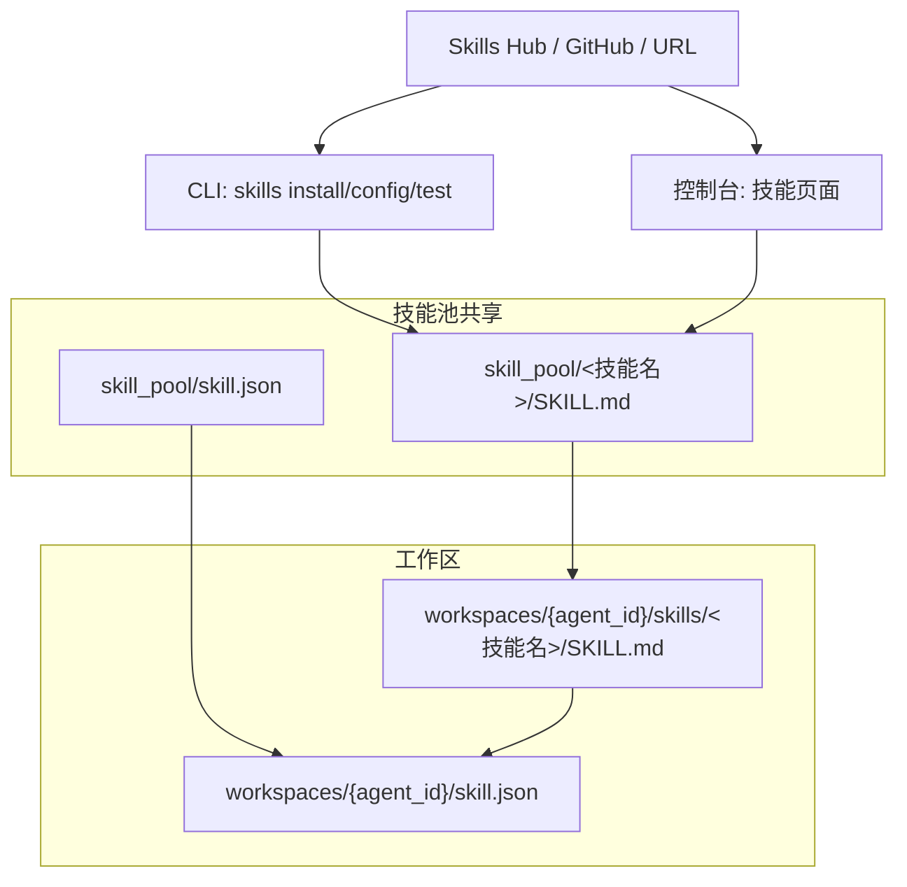
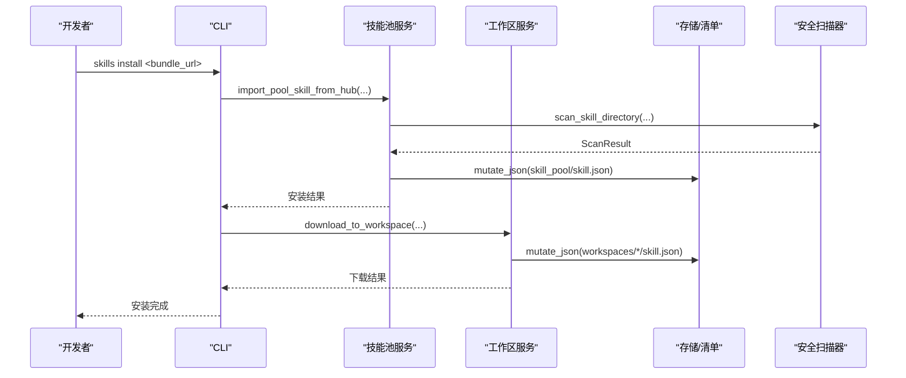
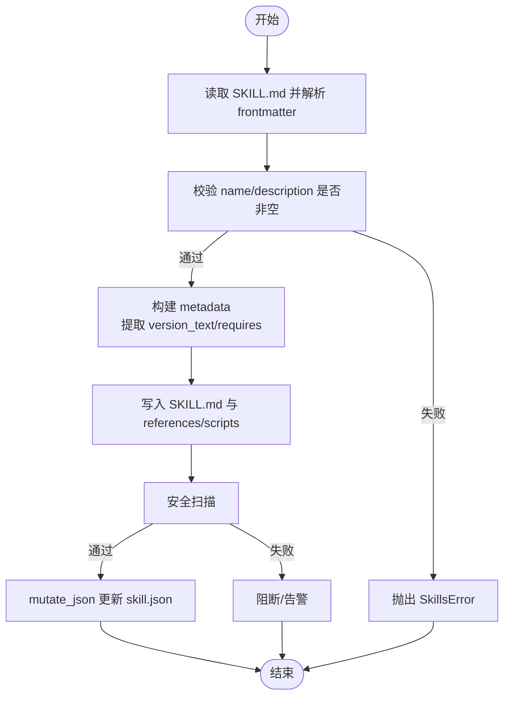
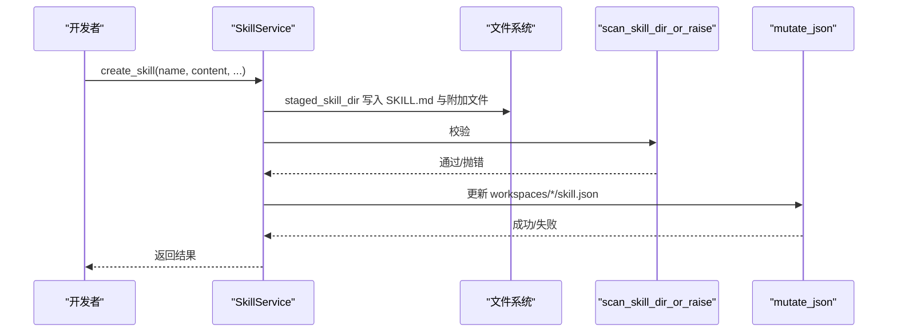
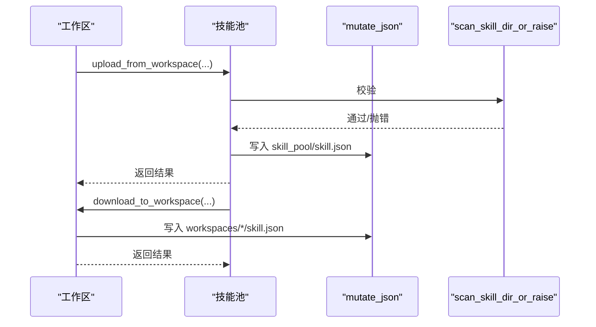
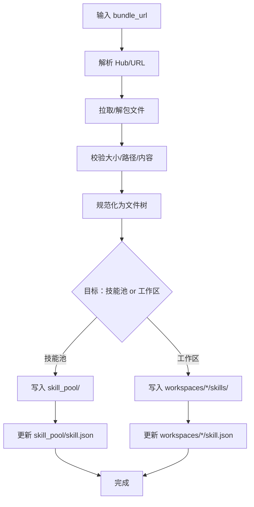
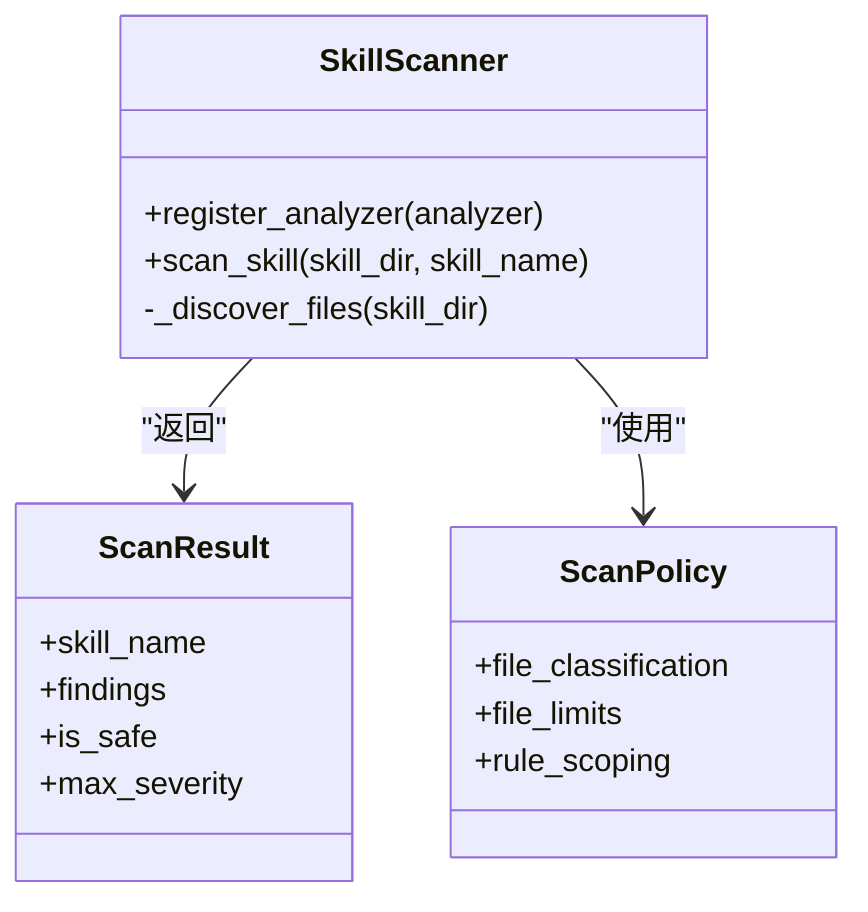
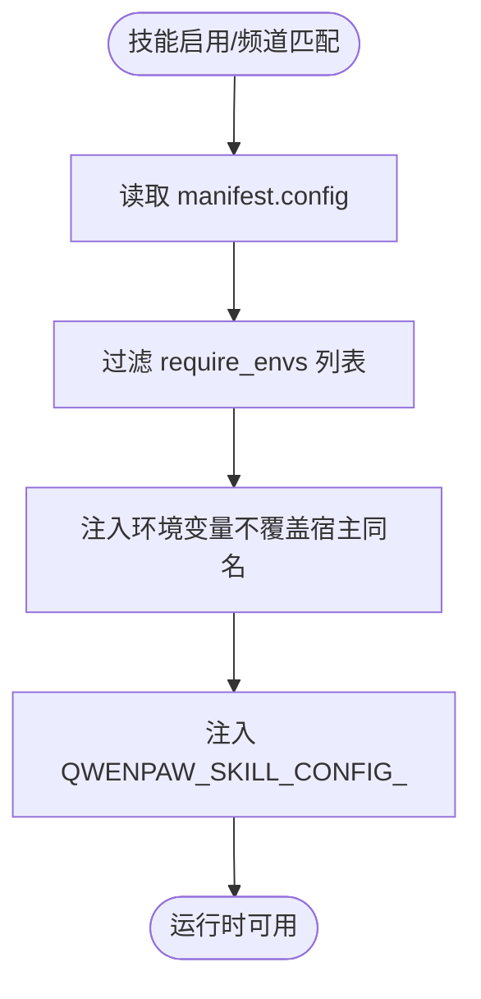
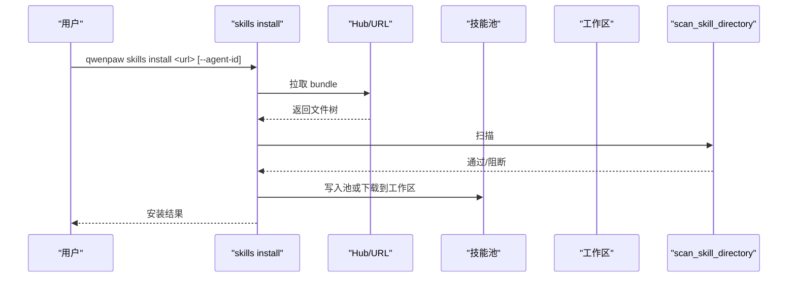
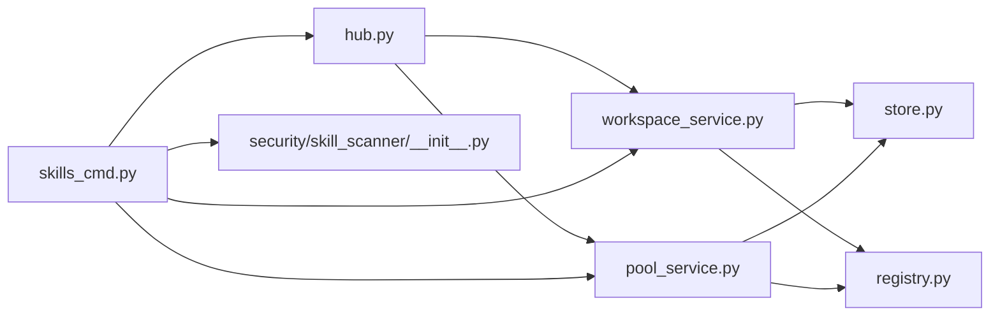

# 自定义技能开发

<cite>
**本文引用的文件**   
- [src/qwenpaw/agents/skill_system/__init__.py](file://src/qwenpaw/agents/skill_system/__init__.py)
- [src/qwenpaw/agents/skill_system/models.py](file://src/qwenpaw/agents/skill_system/models.py)
- [src/qwenpaw/agents/skill_system/registry.py](file://src/qwenpaw/agents/skill_system/registry.py)
- [src/qwenpaw/agents/skill_system/store.py](file://src/qwenpaw/agents/skill_system/store.py)
- [src/qwenpaw/agents/skill_system/workspace_service.py](file://src/qwenpaw/agents/skill_system/workspace_service.py)
- [src/qwenpaw/agents/skill_system/pool_service.py](file://src/qwenpaw/agents/skill_system/pool_service.py)
- [src/qwenpaw/agents/skill_system/hub.py](file://src/qwenpaw/agents/skill_system/hub.py)
- [src/qwenpaw/security/skill_scanner/__init__.py](file://src/qwenpaw/security/skill_scanner/__init__.py)
- [src/qwenpaw/security/skill_scanner/scanner.py](file://src/qwenpaw/security/skill_scanner/scanner.py)
- [src/qwenpaw/cli/skills_cmd.py](file://src/qwenpaw/cli/skills_cmd.py)
- [plugins/tool/gpt-image2/plugin.json](file://plugins/tool/gpt-image2/plugin.json)
- [website/public/docs/skills.zh.md](file://website/public/docs/skills.zh.md)
</cite>

## 目录
1. [简介](#简介)
2. [项目结构](#项目结构)
3. [核心组件](#核心组件)
4. [架构总览](#架构总览)
5. [详细组件分析](#详细组件分析)
6. [依赖分析](#依赖分析)
7. [性能考虑](#性能考虑)
8. [故障排查指南](#故障排查指南)
9. [结论](#结论)
10. [附录](#附录)

## 简介
本指南面向希望在 QwenPaw 中开发与发布自定义技能（Skill）的开发者，系统讲解技能的模板结构、元数据定义、参数规范、返回值格式、安全扫描、打包发布、版本管理、权限与环境注入、性能优化与错误处理，以及与内置技能的集成方法。文档结合代码与官方文档，帮助你在保证安全与可维护性的前提下高效开发。

## 项目结构
QwenPaw 的技能体系围绕“技能池（共享）+ 工作区副本”的双层结构组织，配合清单（skill.json）、前端/CLI 控制台与 Hub 导入能力，形成完整的生命周期管理闭环。

图表来源
- [src/qwenpaw/agents/skill_system/pool_service.py:45-82](file://src/qwenpaw/agents/skill_system/pool_service.py#L45-L82)
- [src/qwenpaw/agents/skill_system/workspace_service.py:40-96](file://src/qwenpaw/agents/skill_system/workspace_service.py#L40-L96)
- [src/qwenpaw/agents/skill_system/hub.py:1-120](file://src/qwenpaw/agents/skill_system/hub.py#L1-L120)
- [website/public/docs/skills.zh.md:19-47](file://website/public/docs/skills.zh.md#L19-L47)

章节来源
- [website/public/docs/skills.zh.md:1-47](file://website/public/docs/skills.zh.md#L1-L47)

## 核心组件
- 技能模型与常量：定义 SkillInfo、SkillRequirements、内置语言路由等基础类型与常量。
- 存储与清单：提供路径解析、清单读写、原子写入、冲突命名建议、压缩包校验与解压等能力。
- 注册与解析：内置技能发现与变体选择、语言偏好、环境变量注入、清单调和与冲突检测。
- 工作区服务：工作区内技能的创建、导入、启用/禁用、频道范围与标签管理、文件读取。
- 技能池服务：共享池内技能的创建、导入、删除、上传/下载、重命名与保存。
- Hub 导入：从 Skills Hub/GitHub/URL 解析、拉取、解包、校验与安装。
- 安全扫描：基于签名规则的轻量扫描器，支持白名单、阻断/告警模式、缓存与超时。
- CLI：交互式配置、批量安装/卸载、本地测试与清单预览。

章节来源
- [src/qwenpaw/agents/skill_system/models.py:45-77](file://src/qwenpaw/agents/skill_system/models.py#L45-L77)
- [src/qwenpaw/agents/skill_system/store.py:56-101](file://src/qwenpaw/agents/skill_system/store.py#L56-L101)
- [src/qwenpaw/agents/skill_system/registry.py:63-114](file://src/qwenpaw/agents/skill_system/registry.py#L63-L114)
- [src/qwenpaw/agents/skill_system/workspace_service.py:40-96](file://src/qwenpaw/agents/skill_system/workspace_service.py#L40-L96)
- [src/qwenpaw/agents/skill_system/pool_service.py:45-82](file://src/qwenpaw/agents/skill_system/pool_service.py#L45-L82)
- [src/qwenpaw/agents/skill_system/hub.py:1-120](file://src/qwenpaw/agents/skill_system/hub.py#L1-L120)
- [src/qwenpaw/security/skill_scanner/__init__.py:424-514](file://src/qwenpaw/security/skill_scanner/__init__.py#L424-L514)
- [src/qwenpaw/cli/skills_cmd.py:310-561](file://src/qwenpaw/cli/skills_cmd.py#L310-L561)

## 架构总览
技能系统采用“清单驱动 + 清单调和 + 安全前置”的设计：任何变更均通过原子化清单更新与扫描校验，确保一致性与安全性。

图表来源
- [src/qwenpaw/agents/skill_system/hub.py:583-729](file://src/qwenpaw/agents/skill_system/hub.py#L583-L729)
- [src/qwenpaw/agents/skill_system/pool_service.py:555-624](file://src/qwenpaw/agents/skill_system/pool_service.py#L555-L624)
- [src/qwenpaw/agents/skill_system/workspace_service.py:743-800](file://src/qwenpaw/agents/skill_system/workspace_service.py#L743-L800)
- [src/qwenpaw/security/skill_scanner/__init__.py:424-514](file://src/qwenpaw/security/skill_scanner/__init__.py#L424-L514)

## 详细组件分析

### 组件一：技能清单与元数据（SKILL.md 与 skill.json）
- SKILL.md 必备字段：name、description；metadata 可选，支持 requires（bins/env）与 qwenpaw.emoji 等扩展字段。
- skill.json（工作区/技能池）：skills 映射，每项包含 enabled、channels、source、config、metadata、requirements、updated_at 等。
- 路径与命名：技能目录名规范化，禁止空、NUL、.、..、路径分隔符；相对路径越界与 zip 安全校验严格。
- 版本与来源：version_text 来源于 frontmatter/metadata；source 标识 builtin/customized；保护标记用于区分受控槽位。

图表来源
- [src/qwenpaw/agents/skill_system/store.py:688-746](file://src/qwenpaw/agents/skill_system/store.py#L688-L746)
- [src/qwenpaw/agents/skill_system/store.py:773-792](file://src/qwenpaw/agents/skill_system/store.py#L773-L792)
- [src/qwenpaw/agents/skill_system/store.py:108-157](file://src/qwenpaw/agents/skill_system/store.py#L108-L157)
- [src/qwenpaw/agents/skill_system/store.py:401-443](file://src/qwenpaw/agents/skill_system/store.py#L401-L443)

章节来源
- [src/qwenpaw/agents/skill_system/store.py:108-204](file://src/qwenpaw/agents/skill_system/store.py#L108-L204)
- [src/qwenpaw/agents/skill_system/store.py:555-580](file://src/qwenpaw/agents/skill_system/store.py#L555-L580)
- [website/public/docs/skills.zh.md:241-262](file://website/public/docs/skills.zh.md#L241-L262)

### 组件二：工作区服务（SkillService）
职责：
- 列出全部/可用技能（可用性由频道与启用状态决定）。
- 创建/保存/重命名/删除技能。
- 从 ZIP/Hub 导入技能。
- 启用/禁用/设置频道范围/设置标签。
- 读取 references/scripts 下的文件内容。

关键流程：创建/保存时先写入临时目录并通过扫描器校验，通过后再原子写入清单；失败时回滚文件并抛出异常。

图表来源
- [src/qwenpaw/agents/skill_system/workspace_service.py:97-196](file://src/qwenpaw/agents/skill_system/workspace_service.py#L97-L196)
- [src/qwenpaw/agents/skill_system/workspace_service.py:197-400](file://src/qwenpaw/agents/skill_system/workspace_service.py#L197-L400)
- [src/qwenpaw/agents/skill_system/workspace_service.py:401-490](file://src/qwenpaw/agents/skill_system/workspace_service.py#L401-L490)

章节来源
- [src/qwenpaw/agents/skill_system/workspace_service.py:66-96](file://src/qwenpaw/agents/skill_system/workspace_service.py#L66-L96)
- [src/qwenpaw/agents/skill_system/workspace_service.py:490-616](file://src/qwenpaw/agents/skill_system/workspace_service.py#L490-L616)

### 组件三：技能池服务（SkillPoolService）
职责：
- 在共享池创建/导入/删除技能。
- 上传工作区技能到池（保留 config/tags）。
- 从池下载到工作区（处理内置语言/版本冲突）。
- 重命名/保存（含内置槽位保护）。

图表来源
- [src/qwenpaw/agents/skill_system/pool_service.py:555-624](file://src/qwenpaw/agents/skill_system/pool_service.py#L555-L624)
- [src/qwenpaw/agents/skill_system/pool_service.py:743-800](file://src/qwenpaw/agents/skill_system/pool_service.py#L743-L800)

章节来源
- [src/qwenpaw/agents/skill_system/pool_service.py:70-156](file://src/qwenpaw/agents/skill_system/pool_service.py#L70-L156)

### 组件四：Hub 导入与安装
- 支持 clawhub.ai、lobehub、skills.sh、GitHub 等来源。
- 解析 bundle，提取 SKILL.md 与 references/scripts，校验大小与路径安全。
- 将 bundle 规范化为本地文件树，写入池或工作区，并更新清单。

图表来源
- [src/qwenpaw/agents/skill_system/hub.py:583-729](file://src/qwenpaw/agents/skill_system/hub.py#L583-L729)
- [src/qwenpaw/agents/skill_system/hub.py:1-120](file://src/qwenpaw/agents/skill_system/hub.py#L1-L120)

章节来源
- [src/qwenpaw/agents/skill_system/hub.py:299-430](file://src/qwenpaw/agents/skill_system/hub.py#L299-L430)

### 组件五：安全扫描与白名单
- 扫描器基于签名规则进行正则匹配，支持并发、缓存、超时与失败记录。
- 支持白名单（按技能名与内容哈希），阻断/告警模式可配置。
- 提供历史记录持久化与清理接口。

图表来源
- [src/qwenpaw/security/skill_scanner/scanner.py:76-147](file://src/qwenpaw/security/skill_scanner/scanner.py#L76-L147)
- [src/qwenpaw/security/skill_scanner/__init__.py:424-514](file://src/qwenpaw/security/skill_scanner/__init__.py#L424-L514)

章节来源
- [src/qwenpaw/security/skill_scanner/__init__.py:86-115](file://src/qwenpaw/security/skill_scanner/__init__.py#L86-L115)
- [src/qwenpaw/security/skill_scanner/__init__.py:424-514](file://src/qwenpaw/security/skill_scanner/__init__.py#L424-L514)

### 组件六：环境变量注入与运行时配置
- 当技能启用且频道匹配时，将 manifest 中 config 的部分键注入为环境变量（与 metadata.requires.env 对齐）。
- 完整 config 总是以 QWENPAW_SKILL_CONFIG_<NAME> 的 JSON 字符串注入。
- 宿主进程已存在的同名环境变量不会被覆盖，遵循“宿主 > 工作区 > 池”的优先级。

图表来源
- [src/qwenpaw/agents/skill_system/registry.py:342-387](file://src/qwenpaw/agents/skill_system/registry.py#L342-L387)
- [website/public/docs/skills.zh.md:289-367](file://website/public/docs/skills.zh.md#L289-L367)

章节来源
- [src/qwenpaw/agents/skill_system/registry.py:259-301](file://src/qwenpaw/agents/skill_system/registry.py#L259-L301)
- [website/public/docs/skills.zh.md:289-367](file://website/public/docs/skills.zh.md#L289-L367)

### 组件七：CLI 与控制台
- CLI 提供 skills list/config/info/install/uninstall/test 等命令，支持交互式配置与批量安装。
- 控制台提供可视化操作：导入 Hub、ZIP、手动创建、启用/禁用、频道范围与标签设置。

图表来源
- [src/qwenpaw/cli/skills_cmd.py:415-470](file://src/qwenpaw/cli/skills_cmd.py#L415-L470)
- [src/qwenpaw/agents/skill_system/hub.py:583-729](file://src/qwenpaw/agents/skill_system/hub.py#L583-L729)
- [src/qwenpaw/security/skill_scanner/__init__.py:424-514](file://src/qwenpaw/security/skill_scanner/__init__.py#L424-L514)

章节来源
- [src/qwenpaw/cli/skills_cmd.py:310-561](file://src/qwenpaw/cli/skills_cmd.py#L310-L561)

## 依赖分析
- 组件耦合
  - SkillService/PoolService 依赖 store 与 registry 的清单读写与路径解析。
  - Hub 导入依赖网络请求、zip 解包与文件树规范化。
  - 安全扫描器独立于业务逻辑，通过公共 API 调用。
- 外部依赖
  - frontmatter/yaml 用于 SKILL.md 解析。
  - fcntl/msvcrt 用于跨进程文件锁。
  - urllib/requests（间接）用于 Hub 拉取。
- 循环依赖
  - 未发现循环导入；模块间通过函数调用与对象实例传递避免耦合。

图表来源
- [src/qwenpaw/agents/skill_system/workspace_service.py:13-37](file://src/qwenpaw/agents/skill_system/workspace_service.py#L13-L37)
- [src/qwenpaw/agents/skill_system/pool_service.py:14-42](file://src/qwenpaw/agents/skill_system/pool_service.py#L14-L42)
- [src/qwenpaw/agents/skill_system/hub.py:26-32](file://src/qwenpaw/agents/skill_system/hub.py#L26-L32)
- [src/qwenpaw/cli/skills_cmd.py:9-29](file://src/qwenpaw/cli/skills_cmd.py#L9-L29)

章节来源
- [src/qwenpaw/agents/skill_system/__init__.py:4-24](file://src/qwenpaw/agents/skill_system/__init__.py#L4-L24)

## 性能考虑
- 清单读写采用原子写入与文件锁，避免并发冲突与损坏。
- 扫描器对文件数量与大小有限制，支持缓存与超时，避免重复扫描。
- ZIP 解包与路径校验限制了最大体积与条目数，防止内存与磁盘压力。
- 建议：将大型二进制或依赖放在外部环境，技能内仅保留最小可运行集；合理拆分 references/scripts，避免一次性加载过多文件。

## 故障排查指南
- 安全扫描阻断
  - 现象：安装/导入时报“安全扫描发现若干问题”。
  - 处理：查看扫描器返回的 findings，修复高危模式；必要时加入白名单或调整策略。
- 冲突与重名
  - 现象：导入/上传/广播时报冲突。
  - 处理：使用建议的新名称重试；或在允许覆盖时使用 overwrite 参数。
- 清单损坏
  - 现象：skill.json 读取失败或解析异常。
  - 处理：检查 JSON 格式；系统会回退到默认结构；必要时重建清单。
- 环境变量未注入
  - 现象：技能无法读取配置。
  - 处理：确认 manifest.config 中键与 metadata.requires.env 对齐；检查宿主环境是否已存在同名变量。

章节来源
- [src/qwenpaw/security/skill_scanner/__init__.py:402-422](file://src/qwenpaw/security/skill_scanner/__init__.py#L402-L422)
- [src/qwenpaw/agents/skill_system/store.py:613-625](file://src/qwenpaw/agents/skill_system/store.py#L613-L625)
- [src/qwenpaw/agents/skill_system/store.py:269-282](file://src/qwenpaw/agents/skill_system/store.py#L269-L282)
- [src/qwenpaw/agents/skill_system/registry.py:342-387](file://src/qwenpaw/agents/skill_system/registry.py#L342-L387)

## 结论
QwenPaw 的技能体系以清单为中心，结合 Hub 导入、安全扫描与严格的路径/压缩包校验，提供了从创建、导入、启用到广播/上传/下载的完整生命周期管理。开发者只需遵循 SKILL.md 元数据规范与安全策略，即可快速、安全地交付高质量自定义技能，并与内置技能无缝集成。

## 附录

### A. 开发流程与最佳实践
- 模板结构
  - 必备：SKILL.md（name/description），可选：metadata.requires（bins/env）、qwenpaw.emoji。
  - 可选：references/scripts 子目录存放辅助文件。
- 元数据与参数
  - name/description 必填；metadata.requires 用于声明二进制与环境变量依赖。
  - config 用于运行时注入（与 requires.env 对齐）。
- 返回值格式
  - 通过清单条目返回技能信息（name/description/version_text/content/source/references/scripts/emoji）。
- 安全与权限
  - 引入前必须通过安全扫描；白名单按技能名或内容哈希启用。
  - 环境变量注入遵循“宿主 > 工作区 > 池”的优先级，避免覆盖宿主变量。
- 打包与发布
  - 通过 CLI/控制台导入 Hub/ZIP；或直接在工作区创建后上传到技能池。
  - 使用 Hub 导入时注意 URL 来源与 GitHub 速率限制。
- 版本管理
  - version_text 来自 frontmatter/metadata；内置技能支持语言变体与版本对比。
- 测试与调试
  - 使用 CLI skills test 对本地目录进行验证与扫描；在控制台查看启用状态与频道范围。
  - 通过 references/scripts 子目录组织测试数据与脚本。

章节来源
- [website/public/docs/skills.zh.md:241-367](file://website/public/docs/skills.zh.md#L241-L367)
- [src/qwenpaw/cli/skills_cmd.py:548-561](file://src/qwenpaw/cli/skills_cmd.py#L548-L561)
- [src/qwenpaw/agents/skill_system/hub.py:1-120](file://src/qwenpaw/agents/skill_system/hub.py#L1-L120)

### B. 与内置技能集成
- 内置技能来自打包目录，支持语言变体（en/zh）与版本管理。
- 可通过“导入内置技能”将内置技能广播到工作区；若语言不匹配或版本落后，系统会提示更新或语言切换。
- 内置技能槽位受保护，不可直接覆盖；如需定制，应另存为新名称。

章节来源
- [src/qwenpaw/agents/skill_system/registry.py:195-231](file://src/qwenpaw/agents/skill_system/registry.py#L195-L231)
- [src/qwenpaw/agents/skill_system/pool_service.py:724-742](file://src/qwenpaw/agents/skill_system/pool_service.py#L724-L742)

### C. 代码示例与路径指引
- 创建技能（工作区）
  - [workspace_service.create_skill:97-196](file://src/qwenpaw/agents/skill_system/workspace_service.py#L97-L196)
- 保存/重命名（工作区）
  - [workspace_service.save_skill:197-248](file://src/qwenpaw/agents/skill_system/workspace_service.py#L197-L248)
- 从 ZIP 导入（工作区）
  - [workspace_service.import_from_zip:401-490](file://src/qwenpaw/agents/skill_system/workspace_service.py#L401-L490)
- 启用/禁用（工作区）
  - [workspace_service.enable_skill/disable_skill:490-589](file://src/qwenpaw/agents/skill_system/workspace_service.py#L490-L589)
- 设置频道范围/标签
  - [workspace_service.set_skill_channels/set_skill_tags:590-644](file://src/qwenpaw/agents/skill_system/workspace_service.py#L590-L644)
- 创建技能（技能池）
  - [pool_service.create_skill:83-156](file://src/qwenpaw/agents/skill_system/pool_service.py#L83-L156)
- 上传/下载（池 ↔ 工作区）
  - [pool_service.upload_from_workspace/download_to_workspace:555-624](file://src/qwenpaw/agents/skill_system/pool_service.py#L555-L624)
- Hub 导入
  - [hub._hydrate_clawhub_payload/_normalize_bundle:583-729](file://src/qwenpaw/agents/skill_system/hub.py#L583-L729)
- 安全扫描
  - [scan_skill_directory:424-514](file://src/qwenpaw/security/skill_scanner/__init__.py#L424-L514)
- CLI 命令
  - [skills install/config/list/info/uninstall/test:310-561](file://src/qwenpaw/cli/skills_cmd.py#L310-L561)