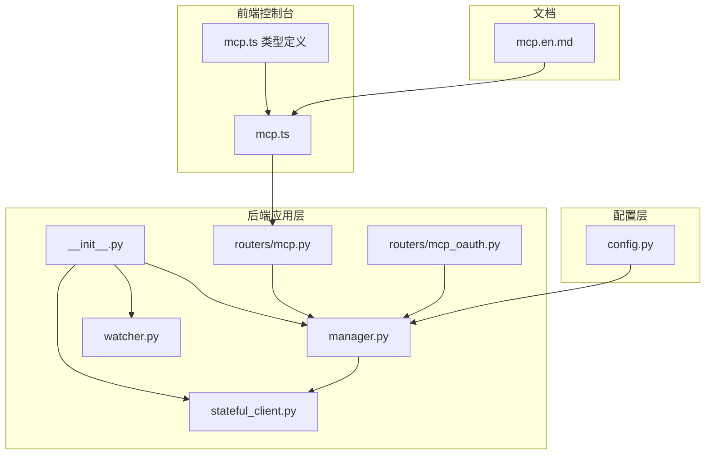
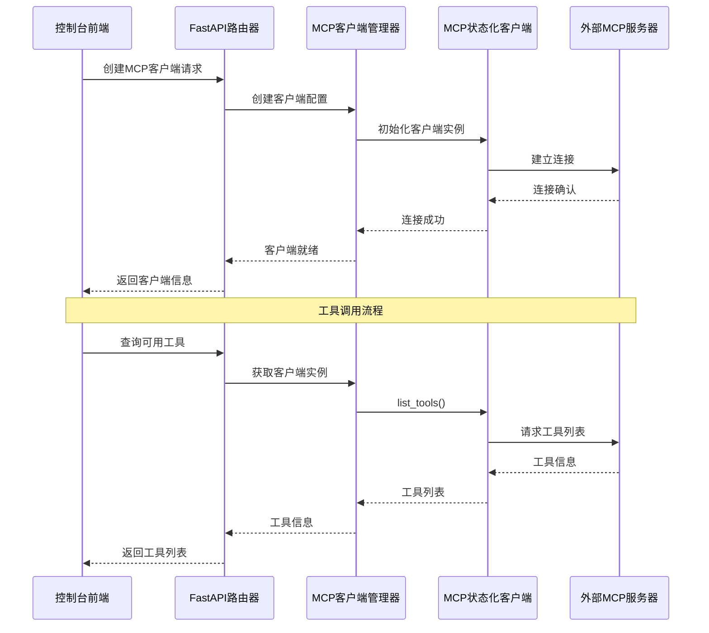
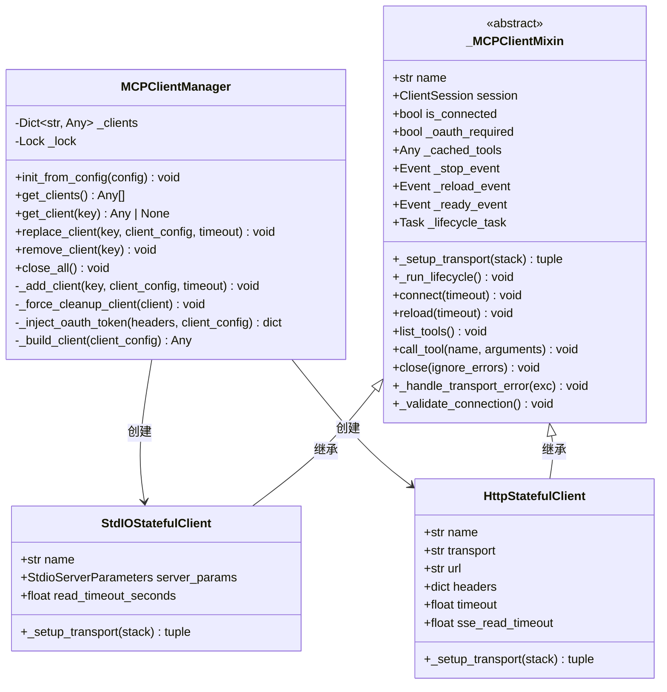
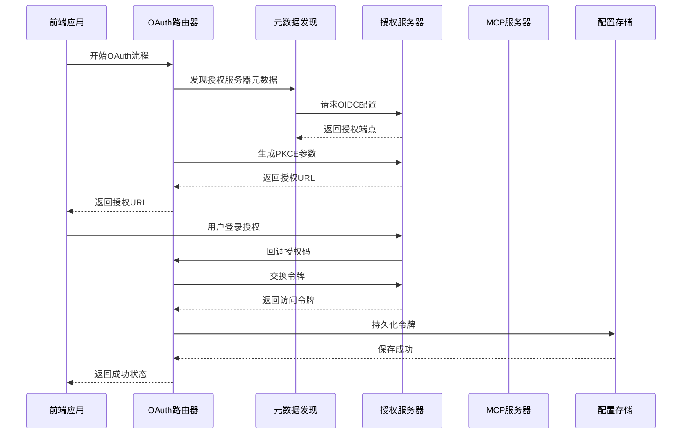
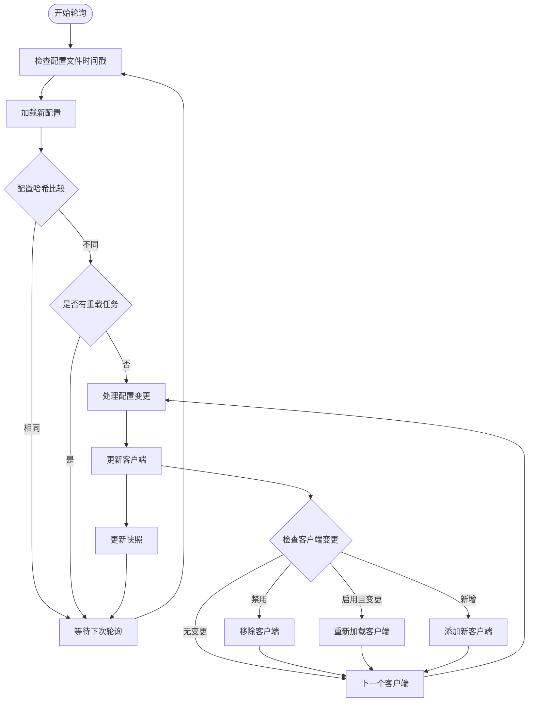
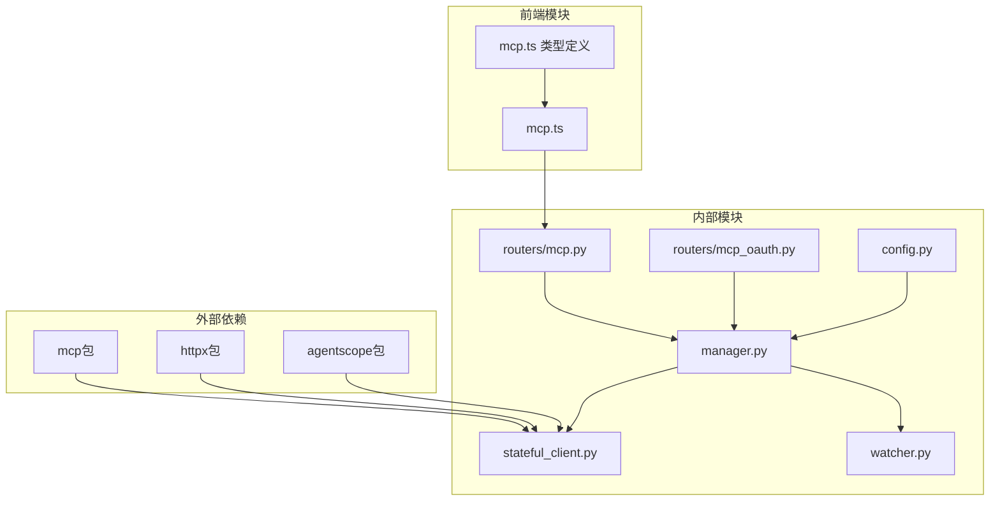

# MCP协议支持

<cite>
**本文档引用的文件**
- [src/qwenpaw/app/mcp/__init__.py](file://src/qwenpaw/app/mcp/__init__.py)
- [src/qwenpaw/app/mcp/manager.py](file://src/qwenpaw/app/mcp/manager.py)
- [src/qwenpaw/app/mcp/stateful_client.py](file://src/qwenpaw/app/mcp/stateful_client.py)
- [src/qwenpaw/app/mcp/watcher.py](file://src/qwenpaw/app/mcp/watcher.py)
- [src/qwenpaw/app/routers/mcp.py](file://src/qwenpaw/app/routers/mcp.py)
- [src/qwenpaw/app/routers/mcp_oauth.py](file://src/qwenpaw/app/routers/mcp_oauth.py)
- [console/src/api/modules/mcp.ts](file://console/src/api/modules/mcp.ts)
- [console/src/api/types/mcp.ts](file://console/src/api/types/mcp.ts)
- [src/qwenpaw/config/config.py](file://src/qwenpaw/config/config.py)
- [website/public/docs/mcp.en.md](file://website/public/docs/mcp.en.md)
</cite>

## 目录
1. [简介](#简介)
2. [项目结构](#项目结构)
3. [核心组件](#核心组件)
4. [架构概览](#架构概览)
5. [详细组件分析](#详细组件分析)
6. [依赖关系分析](#依赖关系分析)
7. [性能考虑](#性能考虑)
8. [故障排除指南](#故障排除指南)
9. [结论](#结论)
10. [附录](#附录)

## 简介

QwenPaw的MCP（Model Context Protocol）协议支持为系统提供了与外部服务和工具进行交互的能力。MCP协议允许QwenPaw连接到外部MCP服务器，扩展代理访问文件系统、数据库、API和其他外部资源的能力。

本文档深入解释了MCP协议在QwenPaw中的实现方式，包括协议规范、消息格式和通信机制，以及MCP客户端管理器的功能、扩展能力和集成示例。

## 项目结构

QwenPaw的MCP支持主要分布在以下模块中：



**图表来源**
- [src/qwenpaw/app/mcp/__init__.py:1-21](file://src/qwenpaw/app/mcp/__init__.py#L1-L21)
- [src/qwenpaw/app/mcp/manager.py:1-287](file://src/qwenpaw/app/mcp/manager.py#L1-L287)
- [src/qwenpaw/app/mcp/stateful_client.py:1-710](file://src/qwenpaw/app/mcp/stateful_client.py#L1-L710)

**章节来源**
- [src/qwenpaw/app/mcp/__init__.py:1-21](file://src/qwenpaw/app/mcp/__init__.py#L1-L21)
- [src/qwenpaw/app/mcp/manager.py:1-287](file://src/qwenpaw/app/mcp/manager.py#L1-L287)
- [src/qwenpaw/app/mcp/stateful_client.py:1-710](file://src/qwenpaw/app/mcp/stateful_client.py#L1-L710)
- [src/qwenpaw/app/mcp/watcher.py:1-332](file://src/qwenpaw/app/mcp/watcher.py#L1-L332)

## 核心组件

### MCP客户端管理器

MCP客户端管理器是整个MCP系统的核心组件，负责管理MCP客户端的生命周期，支持运行时更新而无需重启应用程序。

**关键特性：**
- 热重载客户端生命周期管理
- 运行时配置更新支持
- 客户端连接状态管理
- 错误处理和恢复机制

**章节来源**
- [src/qwenpaw/app/mcp/manager.py:23-287](file://src/qwenpaw/app/mcp/manager.py#L23-L287)

### MCP状态化客户端

提供两种传输类型的MCP客户端实现，解决跨任务上下文管理器退出导致的CPU泄漏问题。

**支持的传输类型：**
- **stdio传输**：本地命令行工具，需要command字段
- **streamable_http传输**：远程HTTP服务，需要url字段
- **sse传输**：服务器发送事件，需要url和transport: "sse"

**章节来源**
- [src/qwenpaw/app/mcp/stateful_client.py:503-710](file://src/qwenpaw/app/mcp/stateful_client.py#L503-L710)

### MCP配置观察器

独立的配置观察器，用于监控MCP配置更改并热重载客户端。

**功能特性：**
- 基于文件时间戳的配置变更检测
- 防抖机制防止频繁重载
- 失败客户端的重试控制
- 并发重载任务管理

**章节来源**
- [src/qwenpaw/app/mcp/watcher.py:24-332](file://src/qwenpaw/app/mcp/watcher.py#L24-L332)

## 架构概览



**图表来源**
- [src/qwenpaw/app/routers/mcp.py:255-314](file://src/qwenpaw/app/routers/mcp.py#L255-L314)
- [src/qwenpaw/app/mcp/manager.py:39-193](file://src/qwenpaw/app/mcp/manager.py#L39-L193)

## 详细组件分析

### MCP客户端管理器类图



**图表来源**
- [src/qwenpaw/app/mcp/manager.py:23-287](file://src/qwenpaw/app/mcp/manager.py#L23-L287)
- [src/qwenpaw/app/mcp/stateful_client.py:127-710](file://src/qwenpaw/app/mcp/stateful_client.py#L127-L710)

### OAuth认证流程



**图表来源**
- [src/qwenpaw/app/routers/mcp_oauth.py:411-644](file://src/qwenpaw/app/routers/mcp_oauth.py#L411-L644)

### 配置热重载流程



**图表来源**
- [src/qwenpaw/app/mcp/watcher.py:140-332](file://src/qwenpaw/app/mcp/watcher.py#L140-L332)

**章节来源**
- [src/qwenpaw/app/mcp/manager.py:194-287](file://src/qwenpaw/app/mcp/manager.py#L194-L287)
- [src/qwenpaw/app/mcp/stateful_client.py:127-484](file://src/qwenpaw/app/mcp/stateful_client.py#L127-L484)
- [src/qwenpaw/app/mcp/watcher.py:140-332](file://src/qwenpaw/app/mcp/watcher.py#L140-L332)

## 依赖关系分析



**图表来源**
- [src/qwenpaw/app/mcp/stateful_client.py:25-31](file://src/qwenpaw/app/mcp/stateful_client.py#L25-L31)
- [src/qwenpaw/app/mcp/manager.py:15-18](file://src/qwenpaw/app/mcp/manager.py#L15-L18)

**章节来源**
- [src/qwenpaw/app/mcp/stateful_client.py:19-31](file://src/qwenpaw/app/mcp/stateful_client.py#L19-L31)
- [src/qwenpaw/app/mcp/manager.py:8-18](file://src/qwenpaw/app/mcp/manager.py#L8-L18)

## 性能考虑

### 连接池和超时设置

MCP客户端实现了多种性能优化策略：

1. **异步生命周期管理**：每个客户端在专用后台任务中运行，避免跨任务取消范围错误
2. **连接超时控制**：默认连接超时30秒，可配置的重连间隔
3. **传输错误自动恢复**：检测传输错误并自动重新连接
4. **工具调用缓存**：缓存工具列表以减少重复查询

### 内存管理

- **进程清理**：确保客户端关闭时正确清理子进程
- **事件驱动信号**：使用事件机制进行重载和停止操作
- **资源清理**：在异常情况下强制清理客户端资源

### 并发控制

- **锁机制**：使用异步锁保护客户端字典的并发访问
- **非阻塞重载**：重载过程分为三个阶段，避免长时间阻塞
- **任务管理**：跟踪正在进行的重载任务，防止并发冲突

## 故障排除指南

### 常见问题诊断

**连接失败排查：**
1. 检查MCP服务器是否正常运行
2. 验证网络连接和防火墙设置
3. 确认URL和端口配置正确
4. 检查OAuth令牌有效性

**工具调用失败：**
1. 确认客户端已连接且状态正常
2. 检查工具名称是否正确
3. 验证参数格式和类型
4. 查看服务器日志获取详细错误信息

**配置热重载问题：**
1. 检查配置文件权限
2. 确认文件时间戳变化
3. 查看重载任务状态
4. 检查失败客户端的重试计数

### 错误处理机制

MCP系统实现了多层次的错误处理：

1. **传输层错误**：自动检测和恢复网络中断
2. **认证错误**：401错误触发OAuth重新授权
3. **配置错误**：验证客户端配置的有效性
4. **资源清理**：确保异常情况下的资源正确释放

**章节来源**
- [src/qwenpaw/app/mcp/stateful_client.py:435-484](file://src/qwenpaw/app/mcp/stateful_client.py#L435-L484)
- [src/qwenpaw/app/mcp/watcher.py:282-317](file://src/qwenpaw/app/mcp/watcher.py#L282-L317)

## 结论

QwenPaw的MCP协议支持提供了一个完整、健壮且高性能的外部服务集成解决方案。通过精心设计的客户端管理器、状态化客户端实现和配置观察器，系统能够：

1. **无缝集成**：支持多种传输协议和认证方式
2. **高可用性**：自动故障检测和恢复机制
3. **热重载**：运行时配置更新而无需重启
4. **安全性**：完整的OAuth 2.1支持和令牌管理
5. **可观测性**：详细的日志记录和状态监控

该实现为开发者提供了灵活的扩展能力，可以轻松集成各种外部工具和服务，同时保持系统的稳定性和性能。

## 附录

### API端点参考

| 端点 | 方法 | 描述 |
|------|------|------|
| `/mcp` | GET | 列出所有MCP客户端 |
| `/mcp/{client_key}` | GET | 获取特定MCP客户端详情 |
| `/mcp` | POST | 创建新的MCP客户端 |
| `/mcp/{client_key}` | PUT | 更新现有MCP客户端 |
| `/mcp/{client_key}/toggle` | PATCH | 切换MCP客户端启用状态 |
| `/mcp/{client_key}` | DELETE | 删除MCP客户端 |
| `/mcp/{client_key}/tools` | GET | 从连接的MCP服务器查询可用工具 |
| `/mcp/{client_key}/oauth/start` | POST | 为远程MCP客户端启动OAuth 2.1 PKCE流程 |
| `/mcp/{client_key}/oauth/status` | GET | 获取MCP客户端的OAuth令牌状态 |
| `/mcp/{client_key}/oauth` | DELETE | 清除MCP客户端的OAuth令牌 |

### 配置选项

**MCP客户端配置字段：**

| 字段名 | 类型 | 默认值 | 描述 |
|--------|------|--------|------|
| `name` | string | - | 客户端名称（必需） |
| `description` | string | "" | 客户端描述 |
| `enabled` | bool | true | 是否启用客户端 |
| `transport` | string | "stdio" | 传输类型："stdio" / "streamable_http" / "sse" |
| `url` | string | "" | 远程MCP服务器URL（HTTP/SSE传输必需） |
| `headers` | object | {} | HTTP请求头（HTTP/SSE传输） |
| `command` | string | "" | 启动命令（stdio传输，如"npx","python"） |
| `args` | string[] | [] | 命令参数（stdio传输） |
| `env` | object | {} | 客户端运行时环境变量 |
| `cwd` | string | "" | 工作目录（stdio传输） |

**OAuth配置字段：**

| 字段名 | 类型 | 描述 |
|--------|------|------|
| `client_id` | string | OAuth客户端ID |
| `scope` | string | 授权范围 |
| `access_token` | string | 访问令牌 |
| `refresh_token` | string | 刷新令牌 |
| `expires_at` | float | 令牌过期时间戳 |
| `token_endpoint` | string | 令牌端点URL |
| `auth_endpoint` | string | 授权端点URL |

### 集成示例

**基本MCP客户端配置：**
```json
{
  "mcpServers": {
    "filesystem": {
      "name": "文件系统访问",
      "command": "npx",
      "args": ["-y", "@modelcontextprotocol/server-filesystem", "/path/to/folder"],
      "env": {
        "API_KEY": "your-api-key"
      }
    }
  }
}
```

**远程MCP服务配置：**
```json
{
  "mcpServers": {
    "remote-api": {
      "transport": "streamable_http",
      "url": "https://api.example.com/mcp",
      "headers": {
        "Authorization": "Bearer your-token"
      }
    }
  }
}
```

**Web搜索配置（Tavily）：**
```json
{
  "mcpServers": {
    "tavily": {
      "command": "npx",
      "args": ["-y", "tavily-mcp@latest"],
      "env": {
        "TAVILY_API_KEY": "tvly-xxxxxxxxxxxxx"
      }
    }
  }
}
```

**章节来源**
- [src/qwenpaw/app/routers/mcp.py:255-519](file://src/qwenpaw/app/routers/mcp.py#L255-L519)
- [src/qwenpaw/config/config.py:1244-1319](file://src/qwenpaw/config/config.py#L1244-L1319)
- [website/public/docs/mcp.en.md:53-188](file://website/public/docs/mcp.en.md#L53-L188)