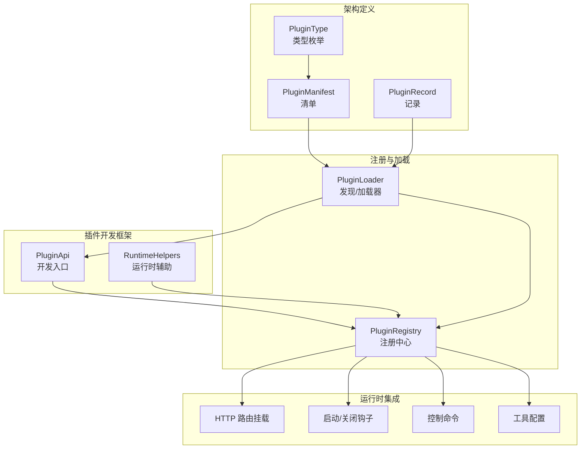
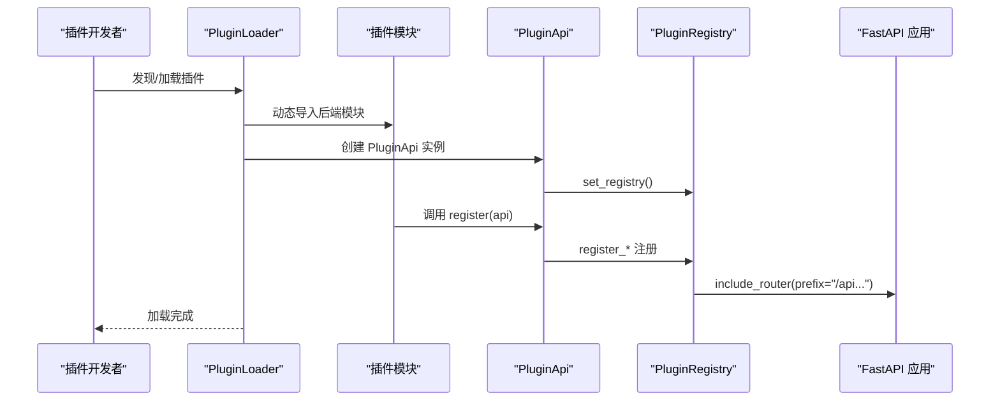
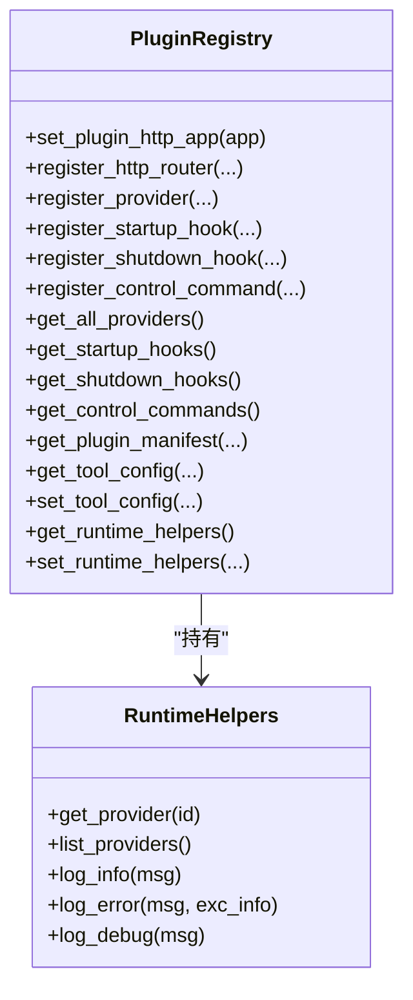
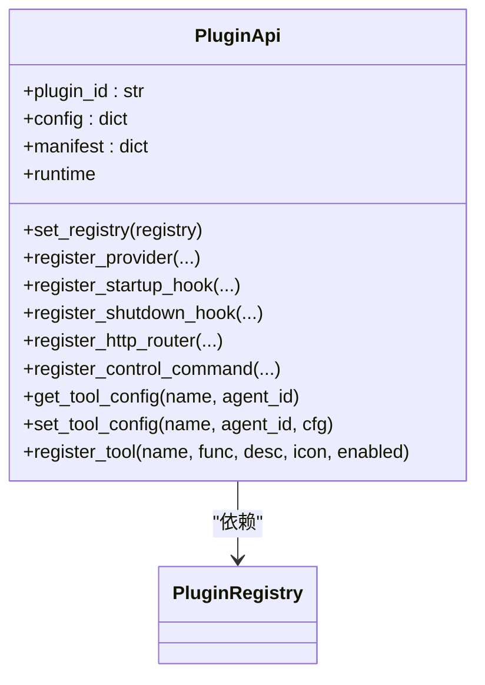
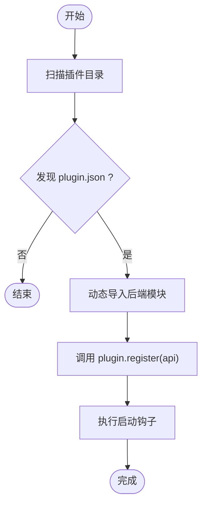
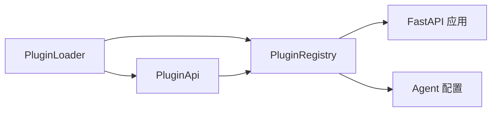

# 插件API参考

<cite>
**本文引用的文件**
- [src/qwenpaw/plugins/__init__.py](file://src/qwenpaw/plugins/__init__.py)
- [src/qwenpaw/plugins/api.py](file://src/qwenpaw/plugins/api.py)
- [src/qwenpaw/plugins/architecture.py](file://src/qwenpaw/plugins/architecture.py)
- [src/qwenpaw/plugins/loader.py](file://src/qwenpaw/plugins/loader.py)
- [src/qwenpaw/plugins/registry.py](file://src/qwenpaw/plugins/registry.py)
- [src/qwenpaw/plugins/runtime.py](file://src/qwenpaw/plugins/runtime.py)
- [src/qwenpaw/app/routers/plugins.py](file://src/qwenpaw/app/routers/plugins.py)
- [src/qwenpaw/cli/plugin_commands.py](file://src/qwenpaw/cli/plugin_commands.py)
- [plugins/tool/gpt-image2/plugin.json](file://plugins/tool/gpt-image2/plugin.json)
- [plugins/tool/gpt-image2/gpt_image2.py](file://plugins/tool/gpt-image2/gpt_image2.py)
- [plugins/tool/qwen-image/plugin.json](file://plugins/tool/qwen-image/plugin.json)
- [src/qwenpaw/exceptions.py](file://src/qwenpaw/exceptions.py)
</cite>

## 目录
1. [简介](#简介)
2. [项目结构](#项目结构)
3. [核心组件](#核心组件)
4. [架构总览](#架构总览)
5. [详细组件分析](#详细组件分析)
6. [依赖分析](#依赖分析)
7. [性能考虑](#性能考虑)
8. [故障排查指南](#故障排查指南)
9. [结论](#结论)
10. [附录](#附录)

## 简介
本参考文档面向插件开发者，系统性梳理 QwenPaw 插件体系的三类 API：插件注册表 API、运行时 API、开发框架 API；并覆盖插件生命周期管理、HTTP 路由注册、工具注册与钩子注册等能力。文档提供方法签名、参数类型、返回值、错误处理与最佳实践，并通过序列图与类图展示关键流程与数据结构。

## 项目结构
围绕插件系统的关键模块如下：
- 开发框架 API：PluginApi（插件开发入口）、RuntimeHelpers（运行时辅助）
- 注册表与加载：PluginRegistry（集中注册中心）、PluginLoader（发现与加载器）
- 架构定义：PluginManifest、PluginRecord、PluginType（插件类型枚举）
- 运行时集成：HTTP 路由挂载、启动/关闭钩子、控制命令、工具配置读写
- 外部接口：HTTP 路由 /plugins、CLI 命令行插件管理

图表来源
- [src/qwenpaw/plugins/api.py:48-401](file://src/qwenpaw/plugins/api.py#L48-L401)
- [src/qwenpaw/plugins/runtime.py:10-68](file://src/qwenpaw/plugins/runtime.py#L10-L68)
- [src/qwenpaw/plugins/registry.py:95-598](file://src/qwenpaw/plugins/registry.py#L95-L598)
- [src/qwenpaw/plugins/loader.py:23-628](file://src/qwenpaw/plugins/loader.py#L23-L628)
- [src/qwenpaw/plugins/architecture.py:10-142](file://src/qwenpaw/plugins/architecture.py#L10-L142)

章节来源
- [src/qwenpaw/plugins/__init__.py:1-17](file://src/qwenpaw/plugins/__init__.py#L1-L17)
- [src/qwenpaw/plugins/api.py:48-401](file://src/qwenpaw/plugins/api.py#L48-L401)
- [src/qwenpaw/plugins/registry.py:95-598](file://src/qwenpaw/plugins/registry.py#L95-L598)
- [src/qwenpaw/plugins/loader.py:23-628](file://src/qwenpaw/plugins/loader.py#L23-L628)
- [src/qwenpaw/plugins/architecture.py:10-142](file://src/qwenpaw/plugins/architecture.py#L10-L142)
- [src/qwenpaw/plugins/runtime.py:10-68](file://src/qwenpaw/plugins/runtime.py#L10-L68)

## 核心组件
- PluginApi：插件开发者的统一入口，提供注册提供商、HTTP 路由、控制命令、工具、钩子以及运行时访问能力。
- PluginRegistry：单例注册中心，集中管理提供商、钩子、控制命令、HTTP 路由、插件清单与工具配置。
- PluginLoader：扫描插件目录、解析 plugin.json、动态导入后端模块、调用插件 register 方法、安装依赖、卸载清理。
- RuntimeHelpers：提供日志、提供商查询、列表等运行时能力。
- PluginManifest/PluginRecord/PluginType：描述插件元信息、类型与记录状态。

章节来源
- [src/qwenpaw/plugins/api.py:48-401](file://src/qwenpaw/plugins/api.py#L48-L401)
- [src/qwenpaw/plugins/registry.py:95-598](file://src/qwenpaw/plugins/registry.py#L95-L598)
- [src/qwenpaw/plugins/loader.py:23-628](file://src/qwenpaw/plugins/loader.py#L23-L628)
- [src/qwenpaw/plugins/runtime.py:10-68](file://src/qwenpaw/plugins/runtime.py#L10-L68)
- [src/qwenpaw/plugins/architecture.py:10-142](file://src/qwenpaw/plugins/architecture.py#L10-L142)

## 架构总览
下图展示从加载器到注册中心再到运行时的交互路径，以及 HTTP 路由挂载策略。

图表来源
- [src/qwenpaw/plugins/loader.py:88-238](file://src/qwenpaw/plugins/loader.py#L88-L238)
- [src/qwenpaw/plugins/api.py:73-80](file://src/qwenpaw/plugins/api.py#L73-L80)
- [src/qwenpaw/plugins/registry.py:130-214](file://src/qwenpaw/plugins/registry.py#L130-L214)

## 详细组件分析

### 插件注册表 API（PluginRegistry）
- 职责：集中管理提供商、钩子、控制命令、HTTP 路由、插件清单与工具配置；提供运行时 helpers 访问。
- 关键方法与行为
  - set_plugin_http_app(app)：绑定根 FastAPI 应用，用于后续挂载插件路由。
  - register_http_router(plugin_id, router, prefix, tags)：在 /api 前缀下挂载插件路由，校验前缀唯一性，插入到 SPA 路由之前，刷新 OpenAPI 缓存。
  - register_provider/register_startup_hook/register_shutdown_hook/register_control_command：注册提供商、启动/关闭钩子、控制命令。
  - get_* / unregister_plugin：查询与清理注册项。
  - get_tool_config/set_tool_config：按工具名与 agent_id 读取/保存工具配置。
  - get_runtime_helpers/set_runtime_helpers：运行时 helpers 的设置与获取。

图表来源
- [src/qwenpaw/plugins/registry.py:95-598](file://src/qwenpaw/plugins/registry.py#L95-L598)
- [src/qwenpaw/plugins/runtime.py:10-68](file://src/qwenpaw/plugins/runtime.py#L10-L68)

章节来源
- [src/qwenpaw/plugins/registry.py:130-598](file://src/qwenpaw/plugins/registry.py#L130-L598)
- [src/qwenpaw/plugins/runtime.py:10-68](file://src/qwenpaw/plugins/runtime.py#L10-L68)

### 运行时 API（PluginApi）
- 职责：为插件提供注册能力与运行时访问。
- 关键方法与行为
  - set_registry：注入注册中心引用。
  - register_provider：注册自定义模型提供商。
  - register_startup_hook/register_shutdown_hook：注册启动/关闭钩子（支持优先级）。
  - register_http_router：注册 HTTP 路由（基于 FastAPI APIRouter），自动合并标签与前缀规范化。
  - register_control_command：注册控制命令处理器。
  - runtime：访问 RuntimeHelpers。
  - get_tool_config/set_tool_config：读取/保存工具配置。
  - register_tool：注册工具函数（延迟到启动钩子执行），自动同步到 agents.tools 模块与 agent 配置。

图表来源
- [src/qwenpaw/plugins/api.py:48-401](file://src/qwenpaw/plugins/api.py#L48-L401)

章节来源
- [src/qwenpaw/plugins/api.py:48-401](file://src/qwenpaw/plugins/api.py#L48-L401)

### 开发框架 API（插件加载与生命周期）
- PluginLoader
  - discover_plugins：扫描插件目录，发现 plugin.json。
  - load_plugin/load_plugin_from_path：动态导入后端模块，调用 plugin.register(api)，安装依赖，构建 PluginRecord。
  - unload_plugin：执行关闭钩子、清理 sys.modules、注销注册项、移除工具、可选删除磁盘文件。
  - _install_requirements：优先使用 pip，若缺失则尝试 uv，超时或失败抛出异常。
- 生命周期钩子
  - 启动钩子：在应用初始化阶段按优先级顺序执行。
  - 关闭钩子：在卸载或停止时执行，保证资源释放。

图表来源
- [src/qwenpaw/plugins/loader.py:36-262](file://src/qwenpaw/plugins/loader.py#L36-L262)

章节来源
- [src/qwenpaw/plugins/loader.py:23-628](file://src/qwenpaw/plugins/loader.py#L23-L628)

### HTTP 路由注册 API
- PluginApi.register_http_router(router, prefix, tags)
  - 参数：router（FastAPI APIRouter）、prefix（如 /pets，自动规范化）、tags（可选）。
  - 行为：校验前缀合法性与唯一性，将路由挂载到 /api 前缀，确保在 SPA catch-all 路由之前匹配，刷新 OpenAPI。
- PluginRegistry.register_http_router
  - 内部实现：规范化前缀、冲突检查、include_router、记录注册信息、维护前缀到插件映射。

章节来源
- [src/qwenpaw/plugins/api.py:191-221](file://src/qwenpaw/plugins/api.py#L191-L221)
- [src/qwenpaw/plugins/registry.py:141-214](file://src/qwenpaw/plugins/registry.py#L141-L214)

### 工具注册 API
- PluginApi.register_tool(tool_name, tool_func, description, icon, enabled)
  - 延迟注册：将工具函数注入 agents.tools 模块，更新 __all__，并在 agent 配置中添加 BuiltinToolConfig（默认 disabled）。
  - 时机：通过启动钩子在应用上下文就绪后执行。
- PluginApi.get_tool_config/set_tool_config
  - 读取/保存 agent 级别的工具配置字典。
- 辅助函数 get_tool_config(tool_name)
  - 在工具函数内部便捷获取当前 agent 的工具配置。

章节来源
- [src/qwenpaw/plugins/api.py:256-401](file://src/qwenpaw/plugins/api.py#L256-L401)
- [src/qwenpaw/plugins/registry.py:530-598](file://src/qwenpaw/plugins/registry.py#L530-L598)

### 钩子注册 API
- PluginApi.register_startup_hook/hook_name, callback, priority)
- PluginApi.register_shutdown_hook(...)
- PluginRegistry.get_startup_hooks/get_shutdown_hooks 返回已排序列表（优先级低先执行）。

章节来源
- [src/qwenpaw/plugins/api.py:127-189](file://src/qwenpaw/plugins/api.py#L127-L189)
- [src/qwenpaw/plugins/registry.py:325-397](file://src/qwenpaw/plugins/registry.py#L325-L397)

### 控制命令注册 API
- PluginApi.register_control_command(handler, priority_level)
- PluginRegistry.register_control_command
- 运行时集成：在插件加载/卸载后同步到命令注册表与处理器。

章节来源
- [src/qwenpaw/plugins/api.py:222-244](file://src/qwenpaw/plugins/api.py#L222-L244)
- [src/qwenpaw/plugins/registry.py:399-430](file://src/qwenpaw/plugins/registry.py#L399-L430)
- [src/qwenpaw/app/routers/plugins.py:171-212](file://src/qwenpaw/app/routers/plugins.py#L171-L212)

### 插件清单与类型
- PluginManifest：从 plugin.json 解析，包含 id/name/version/description/author/entry/dependencies/min_version/meta/type。
- PluginRecord：记录已加载插件的 manifest、source_path、enabled、instance、diagnostics。
- PluginType：tool/provider/hook/command/frontend/general。

章节来源
- [src/qwenpaw/plugins/architecture.py:44-142](file://src/qwenpaw/plugins/architecture.py#L44-L142)

### 运行时辅助（RuntimeHelpers）
- 提供：get_provider/list_providers、日志接口（info/error/debug）。
- 通过 PluginApi.runtime 获取。

章节来源
- [src/qwenpaw/plugins/runtime.py:10-68](file://src/qwenpaw/plugins/runtime.py#L10-L68)

### HTTP 路由与 CLI 插件管理
- HTTP 路由 /plugins
  - GET /plugins：列出已加载插件（含 UI 元数据）。
  - POST /plugins/install：从本地路径或 URL 安装并热加载插件。
  - POST /plugins/upload：上传 ZIP 并安装。
  - DELETE /plugins/{plugin_id}：卸载并删除插件。
  - GET /plugins/{plugin_id}/status：查询插件状态。
- CLI 插件命令
  - qwenpaw plugin install/uninstall/list/info：支持在线/离线安装、依赖安装、URL/ZIP/目录源。

章节来源
- [src/qwenpaw/app/routers/plugins.py:441-776](file://src/qwenpaw/app/routers/plugins.py#L441-L776)
- [src/qwenpaw/cli/plugin_commands.py:500-800](file://src/qwenpaw/cli/plugin_commands.py#L500-L800)

## 依赖分析
- 组件耦合
  - PluginApi 依赖 PluginRegistry；PluginLoader 依赖 PluginRegistry 与 PluginApi。
  - HTTP 路由挂载依赖 FastAPI 应用实例（需先 set_plugin_http_app）。
  - 工具配置读写依赖 agent 配置系统。
- 外部依赖
  - FastAPI（APIRouter、include_router）
  - Python 动态导入（importlib.util）
  - 子进程与包管理（pip/uv）

图表来源
- [src/qwenpaw/plugins/loader.py:33-200](file://src/qwenpaw/plugins/loader.py#L33-L200)
- [src/qwenpaw/plugins/registry.py:130-214](file://src/qwenpaw/plugins/registry.py#L130-L214)

章节来源
- [src/qwenpaw/plugins/loader.py:23-238](file://src/qwenpaw/plugins/loader.py#L23-L238)
- [src/qwenpaw/plugins/registry.py:95-214](file://src/qwenpaw/plugins/registry.py#L95-L214)

## 性能考虑
- 异步加载：PluginLoader 支持异步加载与依赖安装，避免阻塞事件循环。
- 路由挂载优化：将插件路由插入 SPA catch-all 路由之前，减少路由冲突与重排开销。
- OpenAPI 缓存：新增插件路由后主动清空缓存，确保 /openapi.json 及时反映变更。
- 工具注册延迟：通过启动钩子在上下文就绪后再注册工具，避免重复初始化成本。

## 故障排查指南
- 常见错误与定位
  - 依赖安装失败：检查 pip 是否可用，回退到 uv；关注超时与权限问题。
  - HTTP 路由前缀冲突：确保 prefix 不同且不为 “/”。
  - 未设置 FastAPI 应用：调用 register_http_router 前必须 set_plugin_http_app。
  - 工具配置读取失败：确认 agent_id 有效、工具名存在、agent 配置可读写。
- 异常转换
  - 模型相关异常转换：convert_model_exception 将第三方模型异常映射为统一的运行时异常，便于前端展示与日志追踪。

章节来源
- [src/qwenpaw/plugins/loader.py:295-405](file://src/qwenpaw/plugins/loader.py#L295-L405)
- [src/qwenpaw/plugins/registry.py:163-214](file://src/qwenpaw/plugins/registry.py#L163-L214)
- [src/qwenpaw/exceptions.py:165-254](file://src/qwenpaw/exceptions.py#L165-L254)

## 结论
QwenPaw 插件系统通过 PluginApi 提供统一开发入口，结合 PluginRegistry 的集中管理与 PluginLoader 的动态加载，实现了灵活的扩展能力。HTTP 路由、工具、钩子与控制命令均以注册方式接入，配合 CLI 与 HTTP 接口实现热插拔式部署与管理。遵循本文档的最佳实践与错误处理建议，可显著提升插件稳定性与可维护性。

## 附录

### API 方法速查与示例路径
- 注册提供商
  - 方法：PluginApi.register_provider
  - 示例路径：[src/qwenpaw/plugins/api.py:81-126](file://src/qwenpaw/plugins/api.py#L81-L126)
- 注册启动/关闭钩子
  - 方法：PluginApi.register_startup_hook / register_shutdown_hook
  - 示例路径：[src/qwenpaw/plugins/api.py:127-189](file://src/qwenpaw/plugins/api.py#L127-L189)
- 注册 HTTP 路由
  - 方法：PluginApi.register_http_router
  - 示例路径：[src/qwenpaw/plugins/api.py:191-221](file://src/qwenpaw/plugins/api.py#L191-L221)
- 注册控制命令
  - 方法：PluginApi.register_control_command
  - 示例路径：[src/qwenpaw/plugins/api.py:222-244](file://src/qwenpaw/plugins/api.py#L222-L244)
- 注册工具
  - 方法：PluginApi.register_tool
  - 示例路径：[src/qwenpaw/plugins/api.py:287-401](file://src/qwenpaw/plugins/api.py#L287-L401)
- 工具配置读写
  - 方法：PluginApi.get_tool_config / set_tool_config
  - 示例路径：[src/qwenpaw/plugins/api.py:256-286](file://src/qwenpaw/plugins/api.py#L256-L286)
- 运行时访问
  - 属性：PluginApi.runtime
  - 示例路径：[src/qwenpaw/plugins/api.py:245-255](file://src/qwenpaw/plugins/api.py#L245-L255)

### 实际插件示例
- GPT Image 2 工具插件
  - 清单：[plugins/tool/gpt-image2/plugin.json:1-89](file://plugins/tool/gpt-image2/plugin.json#L1-L89)
  - 注册入口：[plugins/tool/gpt-image2/gpt_image2.py:27-64](file://plugins/tool/gpt-image2/gpt_image2.py#L27-L64)
- Qwen-Image 工具插件
  - 清单：[plugins/tool/qwen-image/plugin.json:1-129](file://plugins/tool/qwen-image/plugin.json#L1-L129)

### 最佳实践
- 工具注册
  - 默认禁用工具（enabled=False），让用户显式启用，降低误用风险。
  - 使用 register_tool 自动同步到 agents.tools 与 agent 配置。
- 钩子优先级
  - 启动钩子优先级越小越早执行；关闭钩子越小越早执行，确保资源有序释放。
- HTTP 路由
  - 前缀以 “/” 开头，不要以 “/” 结尾；避免与现有路由冲突。
- 依赖管理
  - 在 requirements.txt 中声明最小版本；优先使用 pip，回退 uv；注意超时与权限。
- 错误处理
  - 对外异常统一转换为运行时异常，保留原始错误类型与消息；在工具函数中捕获并记录，避免崩溃传播。