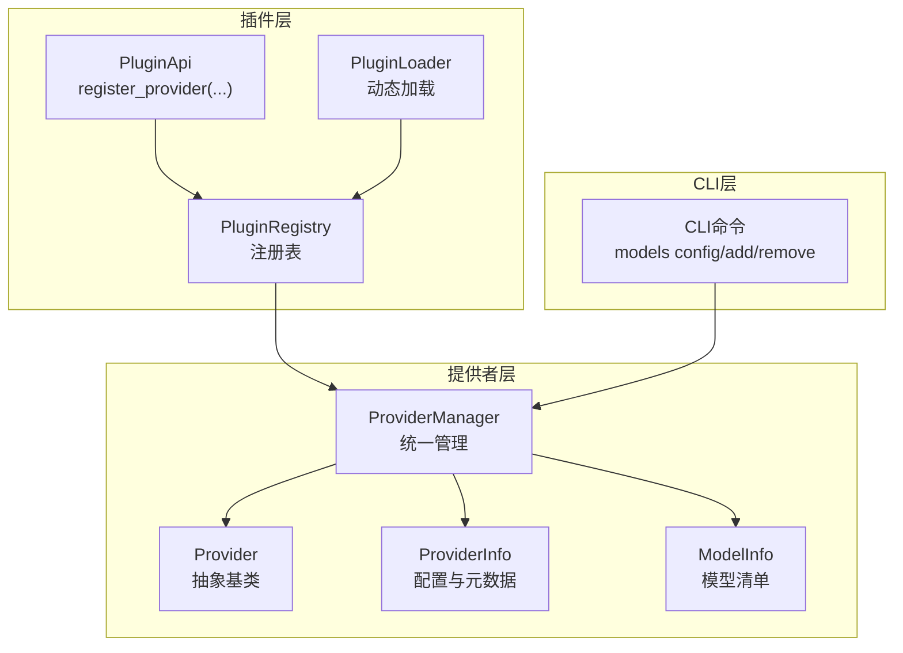
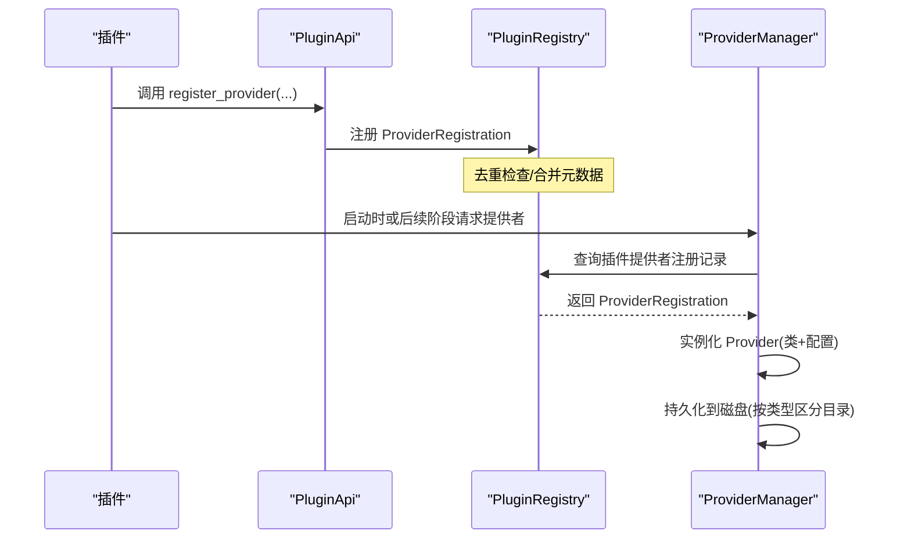
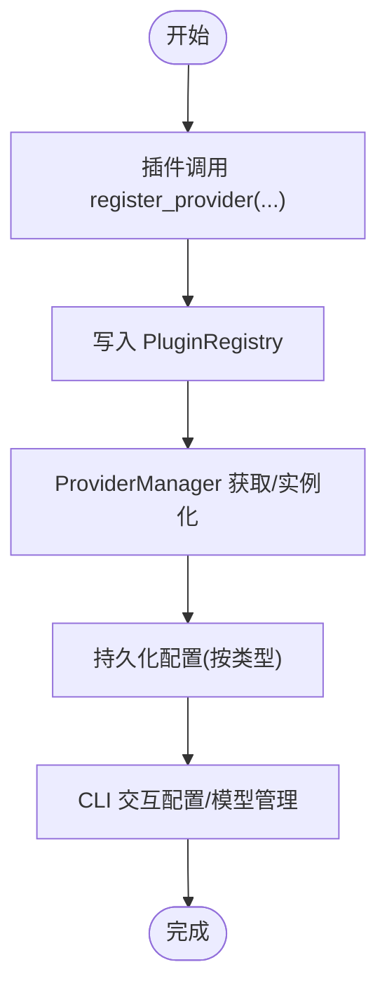
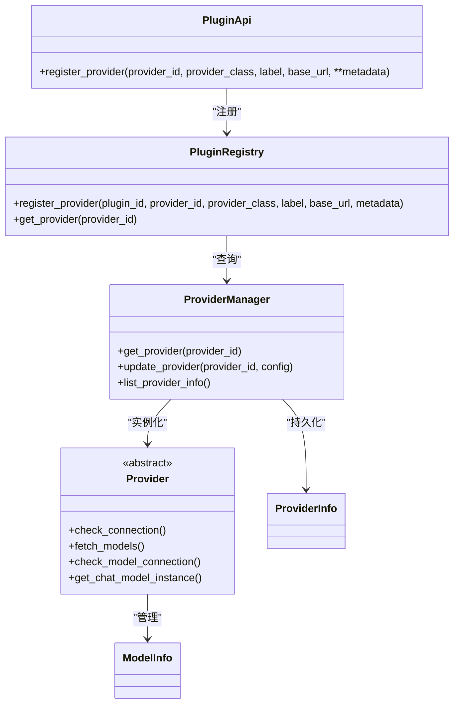

# 插件提供者API

<cite>
**本文档引用的文件**
- [src/qwenpaw/plugins/api.py](file://src/qwenpaw/plugins/api.py)
- [src/qwenpaw/plugins/registry.py](file://src/qwenpaw/plugins/registry.py)
- [src/qwenpaw/providers/provider.py](file://src/qwenpaw/providers/provider.py)
- [src/qwenpaw/providers/provider_manager.py](file://src/qwenpaw/providers/provider_manager.py)
- [src/qwenpaw/providers/__init__.py](file://src/qwenpaw/providers/__init__.py)
- [src/qwenpaw/cli/providers_cmd.py](file://src/qwenpaw/cli/providers_cmd.py)
- [src/qwenpaw/plugins/loader.py](file://src/qwenpaw/plugins/loader.py)
- [plugins/bundle/cloudpaw/plugin.py](file://plugins/bundle/cloudpaw/plugin.py)
</cite>

## 目录
1. [简介](#简介)
2. [项目结构](#项目结构)
3. [核心组件](#核心组件)
4. [架构总览](#架构总览)
5. [详细组件分析](#详细组件分析)
6. [依赖关系分析](#依赖关系分析)
7. [性能考量](#性能考量)
8. [故障排查指南](#故障排查指南)
9. [结论](#结论)
10. [附录：完整实现与最佳实践](#附录完整实现与最佳实践)

## 简介
本文件面向希望在QwenPaw中注册“自定义LLM提供者”的插件开发者，系统性阐述插件提供者API的设计与使用方法。重点包括：
- register_provider 方法的参数与行为
- 提供者类的继承与实现要求
- 元数据与配置项的作用与设置方式
- 插件提供者与内置/自定义提供者的差异
- 完整的实现步骤、配置规范与最佳实践
- 常见问题与排错建议

## 项目结构
围绕插件提供者API的关键模块如下：
- 插件侧API与注册中心：PluginApi、PluginRegistry
- 提供者模型与管理：Provider、ProviderInfo、ModelInfo、ProviderManager
- CLI工具链：提供者配置、模型选择与激活
- 插件加载器：动态发现、加载与生命周期管理

图表来源
- [src/qwenpaw/plugins/api.py:81-126](file://src/qwenpaw/plugins/api.py#L81-L126)
- [src/qwenpaw/plugins/registry.py:249-288](file://src/qwenpaw/plugins/registry.py#L249-L288)
- [src/qwenpaw/providers/provider_manager.py:961-1048](file://src/qwenpaw/providers/provider_manager.py#L961-L1048)
- [src/qwenpaw/cli/providers_cmd.py:476-593](file://src/qwenpaw/cli/providers_cmd.py#L476-L593)

章节来源
- [src/qwenpaw/plugins/api.py:48-126](file://src/qwenpaw/plugins/api.py#L48-L126)
- [src/qwenpaw/plugins/registry.py:95-129](file://src/qwenpaw/plugins/registry.py#L95-L129)
- [src/qwenpaw/providers/provider_manager.py:961-1048](file://src/qwenpaw/providers/provider_manager.py#L961-L1048)
- [src/qwenpaw/cli/providers_cmd.py:476-593](file://src/qwenpaw/cli/providers_cmd.py#L476-L593)

## 核心组件
- PluginApi：插件向系统注册能力的入口，其中 register_provider 是注册自定义提供者的核心方法。
- PluginRegistry：集中式注册表，保存插件提供的 ProviderRegistration，并负责去重与冲突检测。
- Provider/ProviderInfo/ModelInfo：定义提供者配置、元数据与模型清单的数据结构与行为契约。
- ProviderManager：统一管理内置、自定义与插件提供者，负责持久化、实例化与查询。
- CLI命令：提供者配置、模型增删与激活的交互式流程。

章节来源
- [src/qwenpaw/plugins/api.py:48-126](file://src/qwenpaw/plugins/api.py#L48-L126)
- [src/qwenpaw/plugins/registry.py:95-129](file://src/qwenpaw/plugins/registry.py#L95-L129)
- [src/qwenpaw/providers/provider.py:147-374](file://src/qwenpaw/providers/provider.py#L147-L374)
- [src/qwenpaw/providers/provider_manager.py:961-1048](file://src/qwenpaw/providers/provider_manager.py#L961-L1048)

## 架构总览
下图展示了从插件调用 register_provider 到 ProviderManager 实例化并持久化的完整流程：

图表来源
- [src/qwenpaw/plugins/api.py:81-126](file://src/qwenpaw/plugins/api.py#L81-L126)
- [src/qwenpaw/plugins/registry.py:249-288](file://src/qwenpaw/plugins/registry.py#L249-L288)
- [src/qwenpaw/providers/provider_manager.py:1067-1083](file://src/qwenpaw/providers/provider_manager.py#L1067-L1083)

## 详细组件分析

### PluginApi.register_provider 参数与行为
- 参数说明
  - provider_id：提供者唯一标识（不可重复）
  - provider_class：继承自 Provider 的具体类（由系统实例化）
  - label：显示名称（未提供时回退为 provider_id）
  - base_url：默认基础URL（可选）
  - **metadata：任意键值对，用于传递 chat_model、require_api_key、meta 等配置
- 行为要点
  - 将插件清单中的 meta 与传入 metadata 合并，优先使用显式传入值
  - 写入 PluginRegistry，触发去重校验
  - 日志记录注册成功

章节来源
- [src/qwenpaw/plugins/api.py:81-126](file://src/qwenpaw/plugins/api.py#L81-L126)
- [src/qwenpaw/plugins/registry.py:249-288](file://src/qwenpaw/plugins/registry.py#L249-L288)

### Provider 类与继承要求
- 必须继承 Provider 抽象基类
- 必须实现以下异步方法（契约）：
  - check_connection(timeout: float) -> tuple[bool, str]
  - fetch_models(timeout: float) -> List[ModelInfo]
  - check_model_connection(model_id: str, timeout: float) -> tuple[bool, str]
  - get_chat_model_instance(model_id: str) -> ChatModelBase
- 可选扩展：
  - probe_model_multimodal(model_id, timeout, image_only) -> 探测多模态支持
  - add_model/delete_model/update_model_config 等辅助方法
- 配置与元数据：
  - 通过 ProviderInfo 字段控制是否本地、是否冻结URL、是否需要API Key等
  - 支持 generate_kwargs 层叠（Provider级+Model级）

章节来源
- [src/qwenpaw/providers/provider.py:147-374](file://src/qwenpaw/providers/provider.py#L147-L374)
- [tests/contract/providers/test_provider_contract.py:49-77](file://tests/contract/providers/test_provider_contract.py#L49-L77)

### ProviderInfo/ModelInfo 数据结构
- ProviderInfo 关键字段
  - id/name/base_url/api_key/chat_model
  - models/extra_models：预定义与用户添加的模型清单
  - api_key_prefix/freeze_url/is_local/require_api_key/is_custom/support_model_discovery/support_connection_check
  - generate_kwargs/meta：生成参数与附加元数据
- ModelInfo 扩展
  - 支持多模态探测结果、定价信息、输入输出模态等

章节来源
- [src/qwenpaw/providers/provider.py:75-144](file://src/qwenpaw/providers/provider.py#L75-L144)
- [src/qwenpaw/providers/provider.py:18-51](file://src/qwenpaw/providers/provider.py#L18-L51)

### ProviderManager 对插件提供者的处理
- 插件提供者以 ProviderInfo 形式存储于内存字典中，启动时按需实例化
- get_provider 会优先匹配插件提供者，再回退到内置/自定义
- update_provider 支持区分插件提供者并单独持久化

章节来源
- [src/qwenpaw/providers/provider_manager.py:1040-1055](file://src/qwenpaw/providers/provider_manager.py#L1040-L1055)
- [src/qwenpaw/providers/provider_manager.py:1067-1083](file://src/qwenpaw/providers/provider_manager.py#L1067-L1083)
- [src/qwenpaw/providers/provider_manager.py:1093-1119](file://src/qwenpaw/providers/provider_manager.py#L1093-L1119)

### 插件提供者与标准提供者的区别
- 生命周期来源
  - 标准提供者：内置常量或自定义持久化配置
  - 插件提供者：由插件在运行期注册，随插件加载/卸载而存在
- 配置持久化
  - 标准提供者：按类型写入不同目录（builtin/custom/plugin）
  - 插件提供者：仅在内存中保存，卸载后消失
- 连接检查
  - 标准提供者：通常支持连接检查
  - 插件提供者：默认不支持连接检查（避免UI误判），可在 Provider 中覆盖

章节来源
- [src/qwenpaw/providers/provider_manager.py:1040-1055](file://src/qwenpaw/providers/provider_manager.py#L1040-L1055)
- [src/qwenpaw/providers/provider.py:342-373](file://src/qwenpaw/providers/provider.py#L342-L373)

### 集成方式与CLI配置流程
- 插件通过 PluginApi.register_provider 注册
- CLI 提供交互式配置：设置API Key、添加模型、选择活跃模型
- ProviderManager 统一管理与持久化

图表来源
- [src/qwenpaw/plugins/api.py:81-126](file://src/qwenpaw/plugins/api.py#L81-L126)
- [src/qwenpaw/providers/provider_manager.py:1093-1119](file://src/qwenpaw/providers/provider_manager.py#L1093-L1119)
- [src/qwenpaw/cli/providers_cmd.py:476-593](file://src/qwenpaw/cli/providers_cmd.py#L476-L593)

章节来源
- [src/qwenpaw/cli/providers_cmd.py:476-593](file://src/qwenpaw/cli/providers_cmd.py#L476-L593)

## 依赖关系分析
- PluginApi 依赖 PluginRegistry
- PluginRegistry 保存 ProviderRegistration，供 ProviderManager 查询
- ProviderManager 组合 Provider/ProviderInfo/ModelInfo，负责实例化与持久化
- CLI 命令依赖 ProviderManager 进行配置与模型管理

图表来源
- [src/qwenpaw/plugins/api.py:81-126](file://src/qwenpaw/plugins/api.py#L81-L126)
- [src/qwenpaw/plugins/registry.py:249-288](file://src/qwenpaw/plugins/registry.py#L249-L288)
- [src/qwenpaw/providers/provider_manager.py:1067-1083](file://src/qwenpaw/providers/provider_manager.py#L1067-L1083)
- [src/qwenpaw/providers/provider.py:147-374](file://src/qwenpaw/providers/provider.py#L147-L374)

章节来源
- [src/qwenpaw/plugins/api.py:81-126](file://src/qwenpaw/plugins/api.py#L81-L126)
- [src/qwenpaw/plugins/registry.py:249-288](file://src/qwenpaw/plugins/registry.py#L249-L288)
- [src/qwenpaw/providers/provider_manager.py:1067-1083](file://src/qwenpaw/providers/provider_manager.py#L1067-L1083)
- [src/qwenpaw/providers/provider.py:147-374](file://src/qwenpaw/providers/provider.py#L147-L374)

## 性能考量
- 插件提供者仅在内存中保存，避免频繁磁盘IO；但需注意插件卸载即丢失
- ProviderManager 在查询提供者时优先匹配插件提供者，随后内置/自定义，确保插件覆盖顺序
- CLI 交互式配置采用异步任务进行模型拉取与下载，避免阻塞主线程

## 故障排查指南
- 注册失败（provider_id 已存在）
  - 现象：抛出 ValueError
  - 处理：更换 provider_id 或删除旧注册
  - 参考：[src/qwenpaw/plugins/registry.py:271-276](file://src/qwenpaw/plugins/registry.py#L271-L276)
- 提供者未找到
  - 现象：get_provider 返回 None
  - 处理：确认插件已加载、provider_id 正确、大小写一致
  - 参考：[src/qwenpaw/providers/provider_manager.py:1067-1083](file://src/qwenpaw/providers/provider_manager.py#L1067-L1083)
- 连接检查失败
  - 现象：UI 显示连接失败
  - 处理：检查 base_url、api_key、api_key_prefix；必要时禁用连接检查或实现自定义检查
  - 参考：[src/qwenpaw/providers/provider.py:342-373](file://src/qwenpaw/providers/provider.py#L342-L373)
- 模型列表为空
  - 现象：无法选择模型
  - 处理：使用 CLI 添加模型或实现 fetch_models
  - 参考：[src/qwenpaw/cli/providers_cmd.py:634-665](file://src/qwenpaw/cli/providers_cmd.py#L634-L665)

章节来源
- [src/qwenpaw/plugins/registry.py:271-276](file://src/qwenpaw/plugins/registry.py#L271-L276)
- [src/qwenpaw/providers/provider_manager.py:1067-1083](file://src/qwenpaw/providers/provider_manager.py#L1067-L1083)
- [src/qwenpaw/providers/provider.py:342-373](file://src/qwenpaw/providers/provider.py#L342-L373)
- [src/qwenpaw/cli/providers_cmd.py:634-665](file://src/qwenpaw/cli/providers_cmd.py#L634-L665)

## 结论
通过 PluginApi.register_provider，插件可以灵活地向系统注入自定义LLM提供者。其关键在于：
- 正确继承 Provider 并实现契约方法
- 使用 ProviderInfo/ModelInfo 规范化配置与模型清单
- 利用 PluginRegistry 去重与合并元数据
- 通过 ProviderManager 实现持久化与实例化
配合 CLI 的交互式配置，即可快速完成从开发到上线的全链路体验。

## 附录：完整实现与最佳实践

### 完整实现步骤
- 编写提供者类
  - 继承 Provider，实现 check_connection/fetch_models/check_model_connection/get_chat_model_instance
  - 如需多模态探测，可覆写 probe_model_multimodal
  - 参考：[src/qwenpaw/providers/provider.py:147-374](file://src/qwenpaw/providers/provider.py#L147-L374)
- 在插件中注册
  - 使用 PluginApi.register_provider(provider_id, MyProvider, label, base_url, **metadata)
  - 参考：[src/qwenpaw/plugins/api.py:81-126](file://src/qwenpaw/plugins/api.py#L81-L126)
- 验证与配置
  - 通过 CLI 设置 API Key、添加模型、选择活跃模型
  - 参考：[src/qwenpaw/cli/providers_cmd.py:476-593](file://src/qwenpaw/cli/providers_cmd.py#L476-L593)
- 卸载与清理
  - 卸载插件时，插件提供者自动从内存移除
  - 参考：[src/qwenpaw/plugins/loader.py:487-559](file://src/qwenpaw/plugins/loader.py#L487-L559)

### 配置规范与元数据
- 常用元数据键
  - chat_model：指定使用的 ChatModel 名称
  - require_api_key：是否必须提供 API Key
  - api_key_prefix：Key 前缀提示
  - meta：额外元数据（如 base_url_options 等）
- ProviderInfo 字段
  - is_local：本地模型提供者
  - freeze_url：是否允许修改 base_url
  - support_model_discovery/support_connection_check：能力开关
  - generate_kwargs：默认生成参数
  - 参考：[src/qwenpaw/providers/provider.py:75-144](file://src/qwenpaw/providers/provider.py#L75-L144)

### 最佳实践
- 提供者类命名清晰，provider_id 全局唯一
- 在 ProviderInfo 中明确标注 is_local、require_api_key、freeze_url
- 若提供者不支持连接检查，保持 support_connection_check=False
- 使用 generate_kwargs 的分层合并机制，避免硬编码
- 插件提供者适合临时/实验性场景；长期使用建议转为自定义提供者并持久化
- 参考现有插件示例：[plugins/bundle/cloudpaw/plugin.py:292-370](file://plugins/bundle/cloudpaw/plugin.py#L292-L370)

章节来源
- [src/qwenpaw/providers/provider.py:75-144](file://src/qwenpaw/providers/provider.py#L75-L144)
- [src/qwenpaw/plugins/api.py:81-126](file://src/qwenpaw/plugins/api.py#L81-L126)
- [src/qwenpaw/cli/providers_cmd.py:476-593](file://src/qwenpaw/cli/providers_cmd.py#L476-L593)
- [plugins/bundle/cloudpaw/plugin.py:292-370](file://plugins/bundle/cloudpaw/plugin.py#L292-L370)