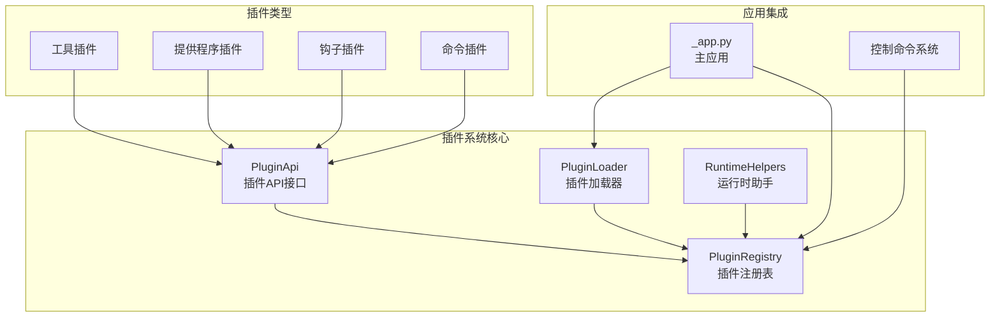
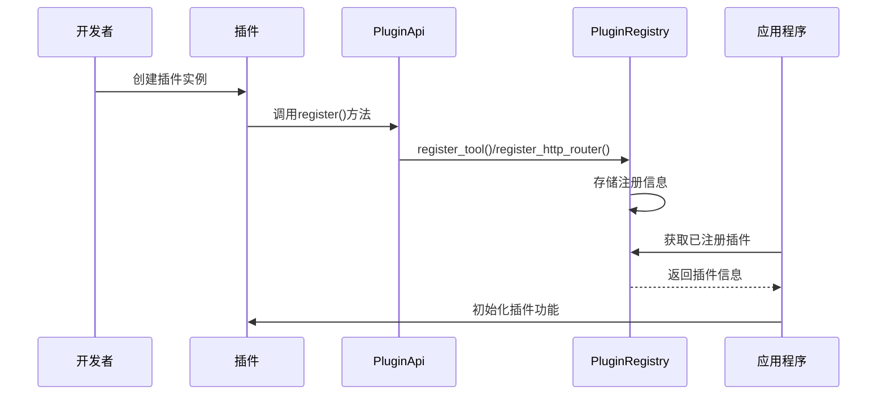
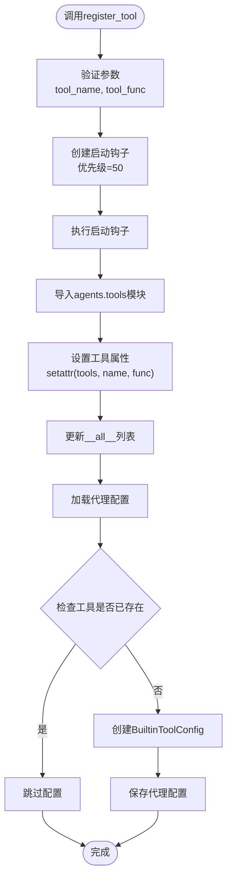
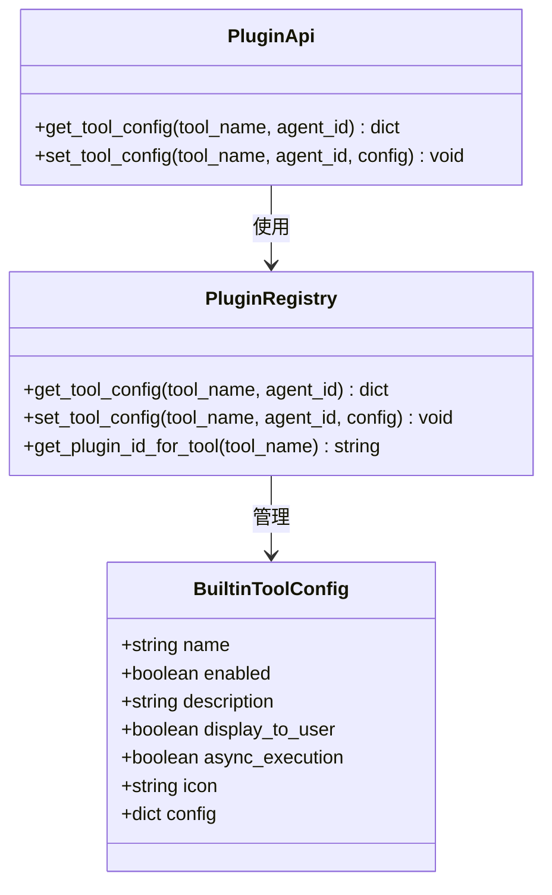
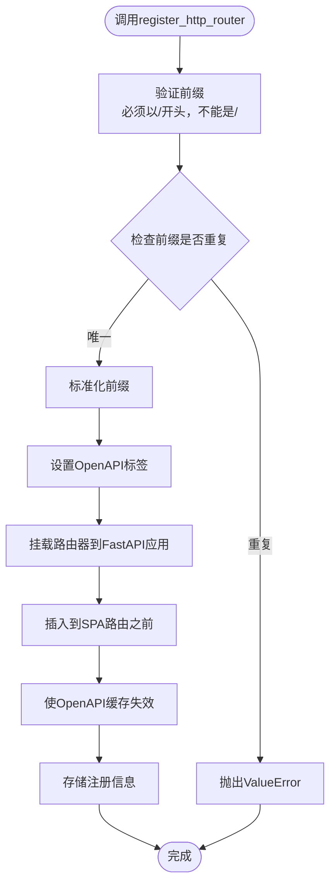
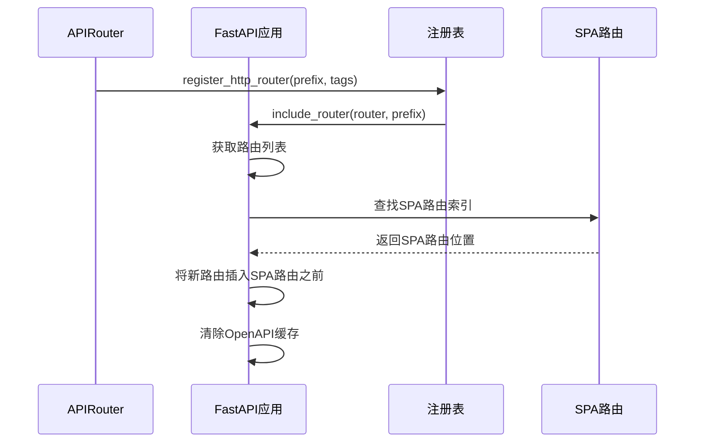
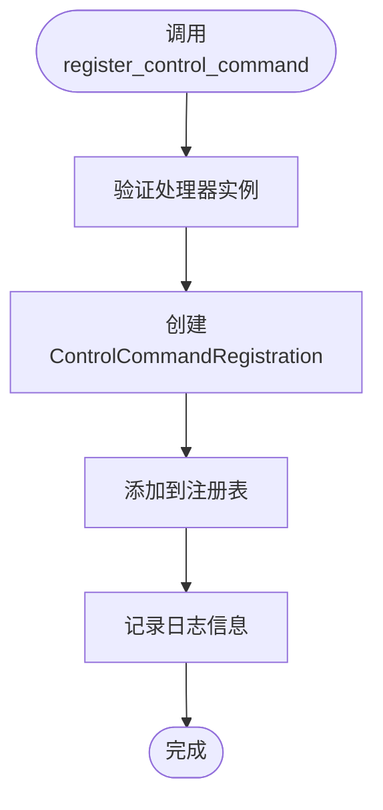
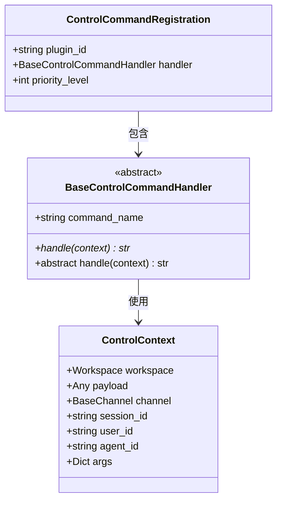
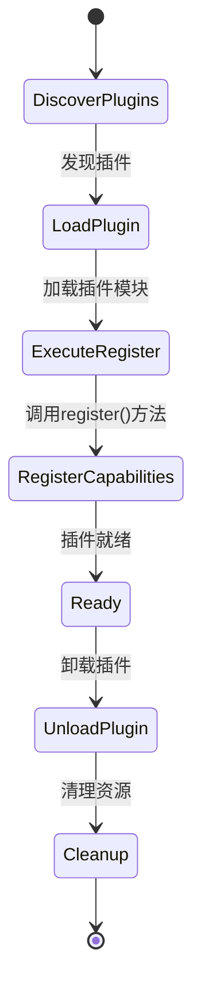
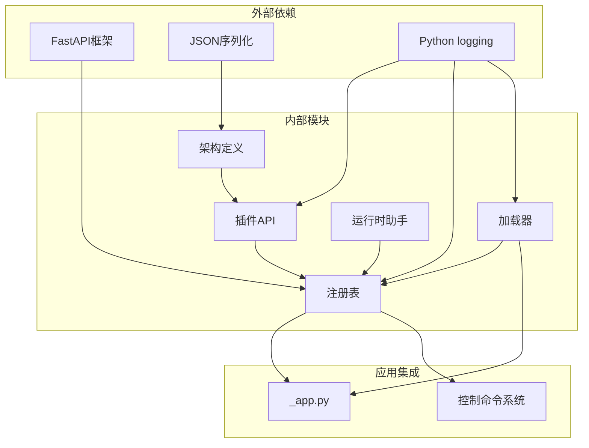

# 插件注册API

<cite>
**本文档引用的文件**
- [src/qwenpaw/plugins/api.py](file://src/qwenpaw/plugins/api.py)
- [src/qwenpaw/plugins/registry.py](file://src/qwenpaw/plugins/registry.py)
- [src/qwenpaw/plugins/loader.py](file://src/qwenpaw/plugins/loader.py)
- [src/qwenpaw/plugins/runtime.py](file://src/qwenpaw/plugins/runtime.py)
- [src/qwenpaw/plugins/architecture.py](file://src/qwenpaw/plugins/architecture.py)
- [src/qwenpaw/app/_app.py](file://src/qwenpaw/app/_app.py)
- [src/qwenpaw/app/runner/control_commands/base.py](file://src/qwenpaw/app/runner/control_commands/base.py)
- [plugins/tool/gpt-image2/plugin.json](file://plugins/tool/gpt-image2/plugin.json)
- [plugins/tool/qwen-image/plugin.json](file://plugins/tool/qwen-image/plugin.json)
- [plugins/tool/wan27/plugin.json](file://plugins/tool/wan27/plugin.json)
- [plugins/tool/gpt-image2/gpt_image2.py](file://plugins/tool/gpt-image2/gpt_image2.py)
- [plugins/tool/qwen-image/qwen_image.py](file://plugins/tool/qwen-image/qwen_image.py)
- [plugins/tool/wan27/wan27.py](file://plugins/tool/wan27/wan27.py)
</cite>

## 目录
1. [简介](#简介)
2. [项目结构](#项目结构)
3. [核心组件](#核心组件)
4. [架构概览](#架构概览)
5. [详细组件分析](#详细组件分析)
6. [依赖关系分析](#依赖关系分析)
7. [性能考虑](#性能考虑)
8. [故障排除指南](#故障排除指南)
9. [结论](#结论)

## 简介

QwenPaw插件注册API是该AI代理系统中用于管理插件生命周期和功能扩展的核心机制。本文档详细介绍了插件注册表API的使用方法，包括工具注册、HTTP路由注册和控制命令注册的完整流程。

该API系统支持多种类型的插件，包括工具插件（注册AI代理可用的工具函数）、提供程序插件（注册自定义LLM提供程序）、钩子插件（在应用启动或关闭时运行代码）以及前端插件（动态加载UI组件）。通过统一的注册接口，开发者可以轻松地向代理系统添加新的功能模块。

## 项目结构

QwenPaw插件系统的整体架构由以下几个关键部分组成：

**图表来源**
- [src/qwenpaw/plugins/api.py:48-401](file://src/qwenpaw/plugins/api.py#L48-L401)
- [src/qwenpaw/plugins/registry.py:95-598](file://src/qwenpaw/plugins/registry.py#L95-L598)
- [src/qwenpaw/plugins/loader.py:23-628](file://src/qwenpaw/plugins/loader.py#L23-L628)

**章节来源**
- [src/qwenpaw/plugins/api.py:1-401](file://src/qwenpaw/plugins/api.py#L1-L401)
- [src/qwenpaw/plugins/registry.py:1-598](file://src/qwenpaw/plugins/registry.py#L1-L598)
- [src/qwenpaw/plugins/loader.py:1-628](file://src/qwenpaw/plugins/loader.py#L1-L628)

## 核心组件

### PluginApi类

PluginApi是插件开发者的主接口，提供了所有必要的注册方法：

- **register_tool()**: 注册工具函数到AI代理的工具箱
- **register_http_router()**: 暴露REST API端点
- **register_control_command()**: 注册控制命令处理器
- **register_provider()**: 注册自定义LLM提供程序
- **register_startup_hook()**: 注册启动钩子
- **register_shutdown_hook()**: 注册关闭钩子

### PluginRegistry类

PluginRegistry是中央注册表，负责管理所有插件注册信息：

- 维护插件清单、提供程序、钩子和控制命令的注册信息
- 处理HTTP路由的挂载和管理
- 提供工具配置的读写操作
- 支持插件的动态卸载

### PluginLoader类

PluginLoader负责插件的发现、加载和管理：

- 发现插件目录中的插件
- 动态加载插件模块
- 执行插件的注册方法
- 管理插件的生命周期

**章节来源**
- [src/qwenpaw/plugins/api.py:48-401](file://src/qwenpaw/plugins/api.py#L48-L401)
- [src/qwenpaw/plugins/registry.py:95-598](file://src/qwenpaw/plugins/registry.py#L95-L598)
- [src/qwenpaw/plugins/loader.py:23-628](file://src/qwenpaw/plugins/loader.py#L23-L628)

## 架构概览

插件注册API采用分层架构设计，确保了良好的可扩展性和维护性：

**图表来源**
- [src/qwenpaw/plugins/api.py:328-400](file://src/qwenpaw/plugins/api.py#L328-L400)
- [src/qwenpaw/plugins/registry.py:141-214](file://src/qwenpaw/plugins/registry.py#L141-L214)
- [src/qwenpaw/plugins/loader.py:208-218](file://src/qwenpaw/plugins/loader.py#L208-L218)

## 详细组件分析

### 工具注册系统

工具注册是插件系统中最常用的功能，允许插件向AI代理添加新的工具函数。

#### register_tool()方法详解

**图表来源**
- [src/qwenpaw/plugins/api.py:329-396](file://src/qwenpaw/plugins/api.py#L329-L396)
- [src/qwenpaw/plugins/api.py:341-384](file://src/qwenpaw/plugins/api.py#L341-L384)

#### 工具配置管理系统

工具配置通过BuiltinToolConfig类管理，支持每个代理独立的工具配置：

**图表来源**
- [src/qwenpaw/plugins/registry.py:530-597](file://src/qwenpaw/plugins/registry.py#L530-L597)
- [src/qwenpaw/plugins/api.py:256-286](file://src/qwenpaw/plugins/api.py#L256-L286)

**章节来源**
- [src/qwenpaw/plugins/api.py:287-400](file://src/qwenpaw/plugins/api.py#L287-L400)
- [src/qwenpaw/plugins/registry.py:530-597](file://src/qwenpaw/plugins/registry.py#L530-L597)

### HTTP路由注册系统

HTTP路由注册允许插件暴露REST API端点，这些端点通过FastAPI路由器进行管理。

#### register_http_router()方法详解

**图表来源**
- [src/qwenpaw/plugins/api.py:191-221](file://src/qwenpaw/plugins/api.py#L191-L221)
- [src/qwenpaw/plugins/registry.py:141-214](file://src/qwenpaw/plugins/registry.py#L141-L214)

#### HTTP路由管理机制

HTTP路由通过专门的管理函数进行挂载和排序：

**图表来源**
- [src/qwenpaw/plugins/registry.py:29-52](file://src/qwenpaw/plugins/registry.py#L29-L52)

**章节来源**
- [src/qwenpaw/plugins/api.py:191-221](file://src/qwenpaw/plugins/api.py#L191-L221)
- [src/qwenpaw/plugins/registry.py:141-214](file://src/qwenpaw/plugins/registry.py#L141-L214)

### 控制命令注册系统

控制命令注册系统允许插件注册高优先级的控制命令处理器，这些命令需要立即响应并特殊处理。

#### register_control_command()方法详解

**图表来源**
- [src/qwenpaw/plugins/api.py:222-243](file://src/qwenpaw/plugins/api.py#L222-L243)
- [src/qwenpaw/plugins/registry.py:399-429](file://src/qwenpaw/plugins/registry.py#L399-L429)

#### 控制命令处理器基类

控制命令处理器必须继承BaseControlCommandHandler基类：

**图表来源**
- [src/qwenpaw/app/runner/control_commands/base.py:42-71](file://src/qwenpaw/app/runner/control_commands/base.py#L42-L71)
- [src/qwenpaw/plugins/registry.py:78-84](file://src/qwenpaw/plugins/registry.py#L78-L84)

**章节来源**
- [src/qwenpaw/plugins/api.py:222-243](file://src/qwenpaw/plugins/api.py#L222-L243)
- [src/qwenpaw/app/runner/control_commands/base.py:42-71](file://src/qwenpaw/app/runner/control_commands/base.py#L42-L71)

### 插件加载和生命周期管理

插件加载器负责整个插件生命周期的管理：

**图表来源**
- [src/qwenpaw/plugins/loader.py:240-262](file://src/qwenpaw/plugins/loader.py#L240-L262)
- [src/qwenpaw/plugins/loader.py:487-560](file://src/qwenpaw/plugins/loader.py#L487-L560)

**章节来源**
- [src/qwenpaw/plugins/loader.py:88-238](file://src/qwenpaw/plugins/loader.py#L88-L238)
- [src/qwenpaw/plugins/loader.py:487-560](file://src/qwenpaw/plugins/loader.py#L487-L560)

## 依赖关系分析

插件注册API的依赖关系清晰且层次分明：

**图表来源**
- [src/qwenpaw/plugins/architecture.py:1-142](file://src/qwenpaw/plugins/architecture.py#L1-L142)
- [src/qwenpaw/plugins/api.py:1-401](file://src/qwenpaw/plugins/api.py#L1-L401)
- [src/qwenpaw/plugins/registry.py:1-598](file://src/qwenpaw/plugins/registry.py#L1-L598)

**章节来源**
- [src/qwenpaw/plugins/architecture.py:1-142](file://src/qwenpaw/plugins/architecture.py#L1-L142)
- [src/qwenpaw/plugins/api.py:1-401](file://src/qwenpaw/plugins/api.py#L1-L401)

## 性能考虑

插件注册API在设计时充分考虑了性能优化：

### 异步处理
- 启动钩子和关闭钩子支持异步执行
- 插件加载过程使用异步I/O操作
- HTTP路由挂载避免阻塞事件循环

### 内存管理
- 插件卸载时清理sys.modules中的模块缓存
- 及时移除注册表中的插件相关数据
- 避免循环引用和内存泄漏

### 缓存策略
- OpenAPI模式缓存失效机制
- 插件清单的内存缓存
- 路由注册信息的快速查找

## 故障排除指南

### 常见问题和解决方案

#### 插件加载失败
**症状**: 插件无法加载或注册
**原因**: 
- 缺少plugin.py入口文件
- register()方法缺失
- 依赖包安装失败

**解决方案**:
1. 确保plugin.json中正确配置entry.backend
2. 实现plugin.py中的plugin对象
3. 检查requirements.txt中的依赖项

#### HTTP路由冲突
**症状**: HTTP路由注册时报错
**原因**: 路由前缀已被其他插件占用
**解决方案**: 使用唯一的路由前缀

#### 工具配置错误
**症状**: 工具无法正常工作
**原因**: 工具配置未正确保存
**解决方案**: 检查工具配置字段和值

**章节来源**
- [src/qwenpaw/plugins/loader.py:108-225](file://src/qwenpaw/plugins/loader.py#L108-L225)
- [src/qwenpaw/plugins/registry.py:163-186](file://src/qwenpaw/plugins/registry.py#L163-L186)

## 结论

QwenPaw插件注册API提供了一个强大而灵活的插件系统，支持多种类型的插件开发和集成。通过统一的API接口，开发者可以轻松地向AI代理系统添加新的功能模块，包括工具函数、REST API端点和控制命令。

该系统的主要优势包括：

1. **模块化设计**: 清晰的职责分离和接口定义
2. **类型安全**: 完整的类型注解和参数验证
3. **生命周期管理**: 完善的插件加载、运行和卸载流程
4. **扩展性**: 支持多种插件类型和复杂的集成场景
5. **性能优化**: 异步处理和内存管理优化

通过遵循本文档的指导和最佳实践，开发者可以构建高质量的插件，为QwenPaw AI代理系统提供丰富的功能扩展。