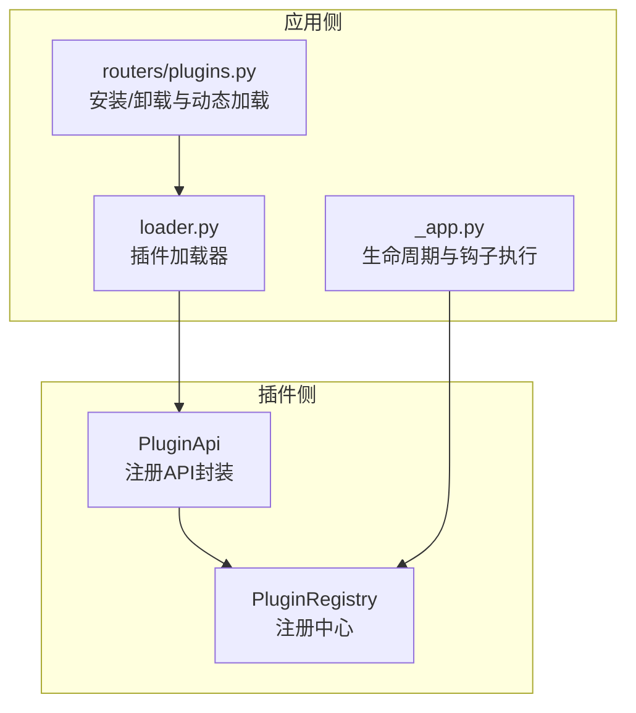
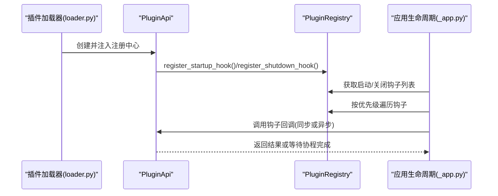
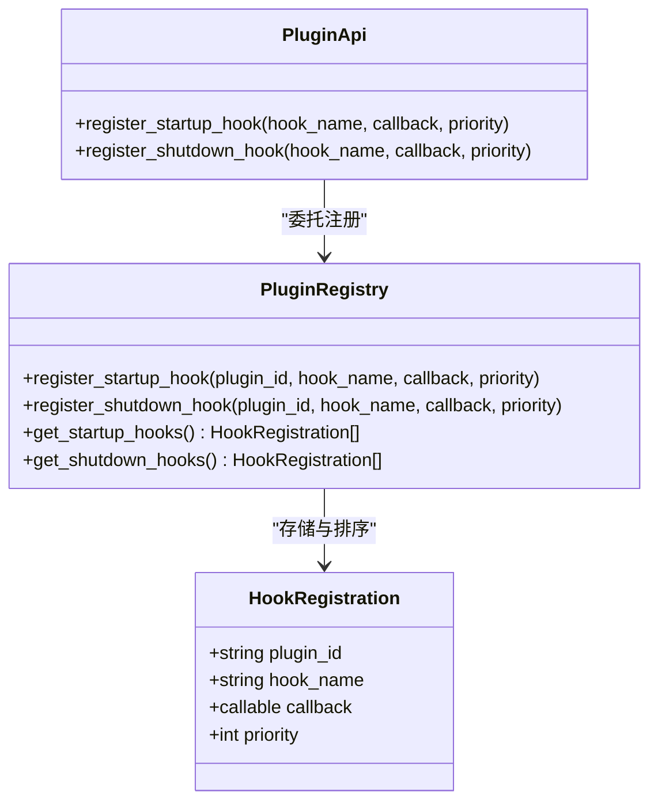
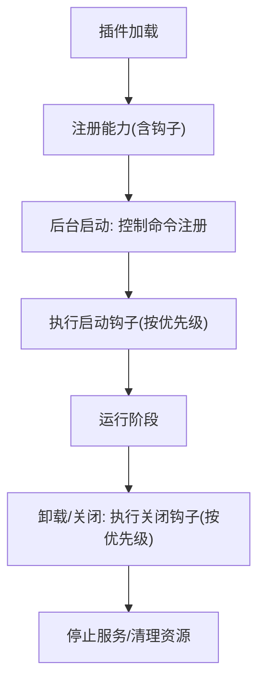
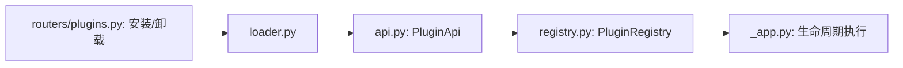

# 插件生命周期API

<cite>
**本文引用的文件**
- [src/qwenpaw/plugins/api.py](file://src/qwenpaw/plugins/api.py)
- [src/qwenpaw/plugins/registry.py](file://src/qwenpaw/plugins/registry.py)
- [src/qwenpaw/app/_app.py](file://src/qwenpaw/app/_app.py)
- [src/qwenpaw/app/routers/plugins.py](file://src/qwenpaw/app/routers/plugins.py)
- [src/qwenpaw/plugins/loader.py](file://src/qwenpaw/plugins/loader.py)
- [website/public/docs/plugins.en.md](file://website/public/docs/plugins.en.md)
- [plugins/tool/qwen-image/qwen_image.py](file://plugins/tool/qwen-image/qwen_image.py)
</cite>

## 目录
1. [简介](#简介)
2. [项目结构](#项目结构)
3. [核心组件](#核心组件)
4. [架构总览](#架构总览)
5. [详细组件分析](#详细组件分析)
6. [依赖分析](#依赖分析)
7. [性能考虑](#性能考虑)
8. [故障排查指南](#故障排查指南)
9. [结论](#结论)
10. [附录](#附录)

## 简介
本文件系统性地阐述 QwenPaw 插件生命周期管理 API，重点覆盖以下内容：
- 启动钩子与关闭钩子的注册与执行机制
- register_startup_hook 与 register_shutdown_hook 的参数、优先级与回调规范
- 生命周期各阶段（加载、注册、启动、运行、卸载）中钩子的执行顺序
- 错误处理与异常管理最佳实践
- 结合仓库内真实实现与示例，给出可直接参考的使用路径与示例位置

## 项目结构
围绕插件生命周期 API 的相关模块主要分布在如下位置：
- 插件 API 封装：src/qwenpaw/plugins/api.py
- 注册中心与钩子数据结构：src/qwenpaw/plugins/registry.py
- 应用生命周期与钩子执行：src/qwenpaw/app/_app.py
- 插件安装/卸载路由与动态加载：src/qwenpaw/app/routers/plugins.py
- 插件加载器：src/qwenpaw/plugins/loader.py
- 官方插件开发文档与示例：website/public/docs/plugins.en.md
- 实际插件示例：plugins/tool/qwen-image/qwen_image.py

图表来源
- [src/qwenpaw/plugins/api.py:48-190](file://src/qwenpaw/plugins/api.py#L48-L190)
- [src/qwenpaw/plugins/registry.py:95-397](file://src/qwenpaw/plugins/registry.py#L95-L397)
- [src/qwenpaw/app/_app.py:380-505](file://src/qwenpaw/app/_app.py#L380-L505)
- [src/qwenpaw/app/routers/plugins.py:171-205](file://src/qwenpaw/app/routers/plugins.py#L171-L205)
- [src/qwenpaw/plugins/loader.py:186-218](file://src/qwenpaw/plugins/loader.py#L186-L218)

章节来源
- [src/qwenpaw/plugins/api.py:48-190](file://src/qwenpaw/plugins/api.py#L48-L190)
- [src/qwenpaw/plugins/registry.py:95-397](file://src/qwenpaw/plugins/registry.py#L95-L397)
- [src/qwenpaw/app/_app.py:380-505](file://src/qwenpaw/app/_app.py#L380-L505)
- [src/qwenpaw/app/routers/plugins.py:171-205](file://src/qwenpaw/app/routers/plugins.py#L171-L205)
- [src/qwenpaw/plugins/loader.py:186-218](file://src/qwenpaw/plugins/loader.py#L186-L218)

## 核心组件
- PluginApi：面向插件开发者的统一入口，提供注册能力（包括启动/关闭钩子、工具、HTTP 路由、控制命令等），内部委托 PluginRegistry 执行具体注册逻辑。
- PluginRegistry：集中式注册中心，维护 Provider、Hook、ControlCommand、HTTP 路由等注册项，并负责钩子的排序与查询。
- 应用生命周期：在应用启动与关闭时，按优先级顺序执行所有已注册的启动/关闭钩子；支持同步与异步回调。

章节来源
- [src/qwenpaw/plugins/api.py:48-190](file://src/qwenpaw/plugins/api.py#L48-L190)
- [src/qwenpaw/plugins/registry.py:95-397](file://src/qwenpaw/plugins/registry.py#L95-L397)
- [src/qwenpaw/app/_app.py:380-505](file://src/qwenpaw/app/_app.py#L380-L505)

## 架构总览
下图展示了从插件注册到应用生命周期钩子执行的关键流程：

图表来源
- [src/qwenpaw/plugins/loader.py:186-218](file://src/qwenpaw/plugins/loader.py#L186-L218)
- [src/qwenpaw/plugins/api.py:127-189](file://src/qwenpaw/plugins/api.py#L127-L189)
- [src/qwenpaw/plugins/registry.py:325-397](file://src/qwenpaw/plugins/registry.py#L325-L397)
- [src/qwenpaw/app/_app.py:404-431](file://src/qwenpaw/app/_app.py#L404-L431)

## 详细组件分析

### 启动钩子 register_startup_hook
- 参数
  - hook_name: 唯一标识符，用于日志与调试
  - callback: 回调函数，支持同步或异步（协程/可等待对象）
  - priority: 优先级，数值越小越早执行，默认 100
- 行为
  - 将 HookRegistration 插入列表后按 priority 排序
  - 在应用启动阶段（lifespan 后台任务）按顺序执行
  - 对于返回协程/可等待对象的回调，会等待其完成
- 回调规范
  - 可以进行资源初始化、服务连接、配置加载等
  - 建议捕获异常并记录日志，避免阻塞其他钩子
- 示例参考
  - 官方文档示例：[website/public/docs/plugins.en.md:430-480](file://website/public/docs/plugins.en.md#L430-L480)
  - 使用路径：[src/qwenpaw/plugins/api.py:127-157](file://src/qwenpaw/plugins/api.py#L127-L157)
  - 注册实现：[src/qwenpaw/plugins/registry.py:325-352](file://src/qwenpaw/plugins/registry.py#L325-L352)
  - 执行顺序：[src/qwenpaw/app/_app.py:404-431](file://src/qwenpaw/app/_app.py#L404-L431)

章节来源
- [src/qwenpaw/plugins/api.py:127-157](file://src/qwenpaw/plugins/api.py#L127-L157)
- [src/qwenpaw/plugins/registry.py:325-352](file://src/qwenpaw/plugins/registry.py#L325-L352)
- [src/qwenpaw/app/_app.py:404-431](file://src/qwenpaw/app/_app.py#L404-L431)
- [website/public/docs/plugins.en.md:430-480](file://website/public/docs/plugins.en.md#L430-L480)

### 关闭钩子 register_shutdown_hook
- 参数
  - hook_name: 唯一标识符
  - callback: 回调函数，支持同步或异步
  - priority: 优先级，数值越小越早执行，默认 100
- 行为
  - 在应用关闭阶段（lifespan finally 分支）按顺序执行
  - 对于返回协程/可等待对象的回调，会等待其完成
- 回调规范
  - 用于资源释放、连接断开、缓存落盘、进程退出等
  - 建议快速失败、幂等化，避免长时间阻塞
- 示例参考
  - 使用路径：[src/qwenpaw/plugins/api.py:159-189](file://src/qwenpaw/plugins/api.py#L159-L189)
  - 注册实现：[src/qwenpaw/plugins/registry.py:354-381](file://src/qwenpaw/plugins/registry.py#L354-L381)
  - 执行顺序：[src/qwenpaw/app/_app.py:476-505](file://src/qwenpaw/app/_app.py#L476-L505)

章节来源
- [src/qwenpaw/plugins/api.py:159-189](file://src/qwenpaw/plugins/api.py#L159-L189)
- [src/qwenpaw/plugins/registry.py:354-381](file://src/qwenpaw/plugins/registry.py#L354-L381)
- [src/qwenpaw/app/_app.py:476-505](file://src/qwenpaw/app/_app.py#L476-L505)

### 钩子数据结构与注册中心
- HookRegistration：包含 plugin_id、hook_name、callback、priority
- PluginRegistry：维护启动/关闭钩子列表，提供注册、排序、查询接口
- 优先级机制：注册时插入后按 priority 升序排序，执行时严格遵循该顺序

图表来源
- [src/qwenpaw/plugins/registry.py:67-75](file://src/qwenpaw/plugins/registry.py#L67-L75)
- [src/qwenpaw/plugins/registry.py:325-397](file://src/qwenpaw/plugins/registry.py#L325-L397)
- [src/qwenpaw/plugins/api.py:127-189](file://src/qwenpaw/plugins/api.py#L127-L189)

章节来源
- [src/qwenpaw/plugins/registry.py:67-75](file://src/qwenpaw/plugins/registry.py#L67-L75)
- [src/qwenpaw/plugins/registry.py:325-397](file://src/qwenpaw/plugins/registry.py#L325-L397)
- [src/qwenpaw/plugins/api.py:127-189](file://src/qwenpaw/plugins/api.py#L127-L189)

### 生命周期阶段与钩子执行顺序
- 加载阶段
  - 插件加载器创建 PluginApi 并注入注册中心
  - 插件调用 register_* 方法注册能力（含钩子）
- 注册阶段
  - 插件清单与元数据写入注册中心
- 启动阶段
  - 应用后台任务执行：注册控制命令、执行启动钩子（按优先级）
- 运行阶段
  - 正常业务运行
- 卸载/关闭阶段
  - 应用关闭：执行关闭钩子（按优先级）、停止各类服务
- 动态安装新插件
  - 路由触发后仅对新增插件执行其启动钩子

图表来源
- [src/qwenpaw/plugins/loader.py:186-218](file://src/qwenpaw/plugins/loader.py#L186-L218)
- [src/qwenpaw/app/_app.py:380-431](file://src/qwenpaw/app/_app.py#L380-L431)
- [src/qwenpaw/app/_app.py:476-505](file://src/qwenpaw/app/_app.py#L476-L505)
- [src/qwenpaw/app/routers/plugins.py:171-205](file://src/qwenpaw/app/routers/plugins.py#L171-L205)

章节来源
- [src/qwenpaw/plugins/loader.py:186-218](file://src/qwenpaw/plugins/loader.py#L186-L218)
- [src/qwenpaw/app/_app.py:380-505](file://src/qwenpaw/app/_app.py#L380-L505)
- [src/qwenpaw/app/routers/plugins.py:171-205](file://src/qwenpaw/app/routers/plugins.py#L171-L205)

### 回调函数规范与最佳实践
- 回调类型
  - 支持同步与异步（协程/可等待对象）
  - 异步回调会被等待完成后再继续下一个钩子
- 异常处理
  - 启动钩子：单个钩子异常不影响其他钩子执行
  - 关闭钩子：同理，但应尽量快速完成，避免阻塞应用退出
- 优先级选择
  - 需要最早执行的钩子设置较小 priority
  - 默认值 100 适合一般场景
- 资源管理
  - 启动钩子负责初始化，关闭钩子负责释放
  - 建议幂等化与快速失败

章节来源
- [src/qwenpaw/app/_app.py:404-431](file://src/qwenpaw/app/_app.py#L404-L431)
- [src/qwenpaw/app/_app.py:476-505](file://src/qwenpaw/app/_app.py#L476-L505)
- [src/qwenpaw/plugins/api.py:127-189](file://src/qwenpaw/plugins/api.py#L127-L189)

### 完整使用示例（路径指引）
- 官方示例插件（启动钩子）
  - 示例路径：[website/public/docs/plugins.en.md:430-480](file://website/public/docs/plugins.en.md#L430-L480)
  - 说明：演示了如何在插件中注册启动钩子并设置优先级
- 实际插件示例（工具注册，间接体现钩子调度）
  - 示例路径：[plugins/tool/qwen-image/qwen_image.py:27-63](file://plugins/tool/qwen-image/qwen_image.py#L27-L63)
  - 说明：通过 register_tool 触发启动钩子，展示生命周期钩子在工具注册中的作用

章节来源
- [website/public/docs/plugins.en.md:430-480](file://website/public/docs/plugins.en.md#L430-L480)
- [plugins/tool/qwen-image/qwen_image.py:27-63](file://plugins/tool/qwen-image/qwen_image.py#L27-L63)

## 依赖分析
- 组件耦合
  - PluginApi 依赖 PluginRegistry 完成注册
  - 应用生命周期依赖 PluginRegistry 提供的钩子列表
  - 插件加载器在创建 PluginApi 时注入注册中心
- 外部依赖
  - FastAPI 路由挂载（HTTP 路由注册）
  - 日志系统（统一记录注册与执行状态）

图表来源
- [src/qwenpaw/plugins/loader.py:186-218](file://src/qwenpaw/plugins/loader.py#L186-L218)
- [src/qwenpaw/plugins/api.py:48-190](file://src/qwenpaw/plugins/api.py#L48-L190)
- [src/qwenpaw/plugins/registry.py:95-397](file://src/qwenpaw/plugins/registry.py#L95-L397)
- [src/qwenpaw/app/_app.py:380-505](file://src/qwenpaw/app/_app.py#L380-L505)
- [src/qwenpaw/app/routers/plugins.py:171-205](file://src/qwenpaw/app/routers/plugins.py#L171-L205)

章节来源
- [src/qwenpaw/plugins/loader.py:186-218](file://src/qwenpaw/plugins/loader.py#L186-L218)
- [src/qwenpaw/plugins/api.py:48-190](file://src/qwenpaw/plugins/api.py#L48-L190)
- [src/qwenpaw/plugins/registry.py:95-397](file://src/qwenpaw/plugins/registry.py#L95-L397)
- [src/qwenpaw/app/_app.py:380-505](file://src/qwenpaw/app/_app.py#L380-L505)
- [src/qwenpaw/app/routers/plugins.py:171-205](file://src/qwenpaw/app/routers/plugins.py#L171-L205)

## 性能考虑
- 钩子数量与优先级
  - 合理拆分钩子，避免单个钩子承担过多职责
  - 通过优先级控制关键路径，减少不必要的等待
- 异步回调
  - 尽量使用异步回调以提升并发能力
  - 注意避免长时间阻塞，必要时拆分为多个钩子
- 资源初始化
  - 启动钩子中避免重 IO 或长耗时操作，必要时延迟到首次使用
- 关闭钩子
  - 设计快速回收策略，避免应用退出超时

## 故障排查指南
- 常见问题
  - 钩子未执行：检查是否正确注册、优先级是否过高导致被其他钩子异常阻塞
  - 异步回调未生效：确认回调返回的是协程/可等待对象，并确保应用在生命周期中等待其完成
  - 重复注册：优先级冲突或钩子名重复会导致日志提示，需调整
- 日志定位
  - 启动钩子执行日志：[src/qwenpaw/app/_app.py:404-431](file://src/qwenpaw/app/_app.py#L404-L431)
  - 关闭钩子执行日志：[src/qwenpaw/app/_app.py:476-505](file://src/qwenpaw/app/_app.py#L476-L505)
  - 注册日志：[src/qwenpaw/plugins/registry.py:349-381](file://src/qwenpaw/plugins/registry.py#L349-L381)
- 建议
  - 在钩子中增加细粒度日志，明确每个步骤的开始与结束
  - 对外部依赖（网络、文件、数据库）增加超时与重试策略

章节来源
- [src/qwenpaw/app/_app.py:404-431](file://src/qwenpaw/app/_app.py#L404-L431)
- [src/qwenpaw/app/_app.py:476-505](file://src/qwenpaw/app/_app.py#L476-L505)
- [src/qwenpaw/plugins/registry.py:349-381](file://src/qwenpaw/plugins/registry.py#L349-L381)

## 结论
QwenPaw 的插件生命周期 API 通过 PluginApi 与 PluginRegistry 将插件注册与应用生命周期解耦，提供清晰的启动/关闭钩子注册与执行机制。开发者只需关注钩子回调的职责划分与异常处理，即可构建稳定可靠的插件生态。建议遵循“最小优先级差异、异步化、幂等化”的原则，配合完善的日志与监控，确保插件在复杂运行环境下的可靠性与可观测性。

## 附录
- 快速参考
  - 启动钩子注册：[src/qwenpaw/plugins/api.py:127-157](file://src/qwenpaw/plugins/api.py#L127-L157)
  - 关闭钩子注册：[src/qwenpaw/plugins/api.py:159-189](file://src/qwenpaw/plugins/api.py#L159-L189)
  - 钩子执行顺序：[src/qwenpaw/app/_app.py:404-431](file://src/qwenpaw/app/_app.py#L404-L431)、[src/qwenpaw/app/_app.py:476-505](file://src/qwenpaw/app/_app.py#L476-L505)
  - 官方示例：[website/public/docs/plugins.en.md:430-480](file://website/public/docs/plugins.en.md#L430-L480)
  - 实际插件示例：[plugins/tool/qwen-image/qwen_image.py:27-63](file://plugins/tool/qwen-image/qwen_image.py#L27-L63)