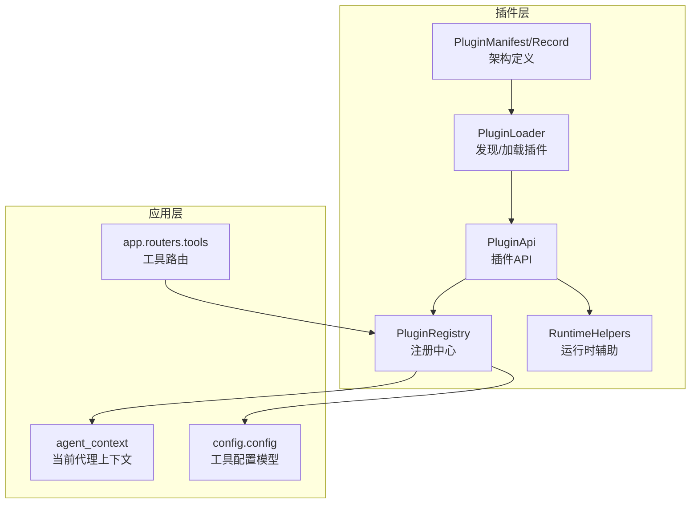
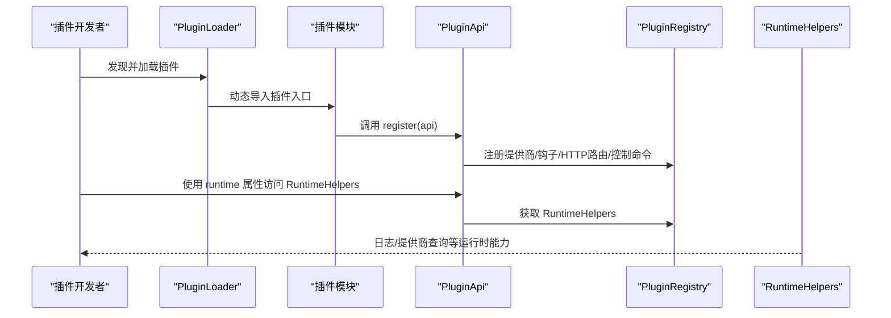
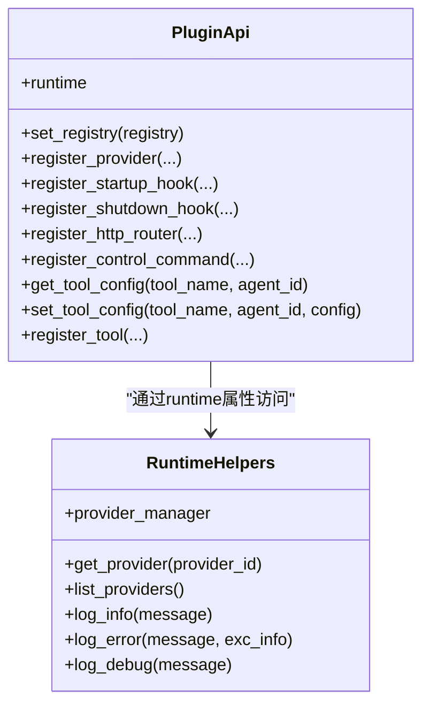
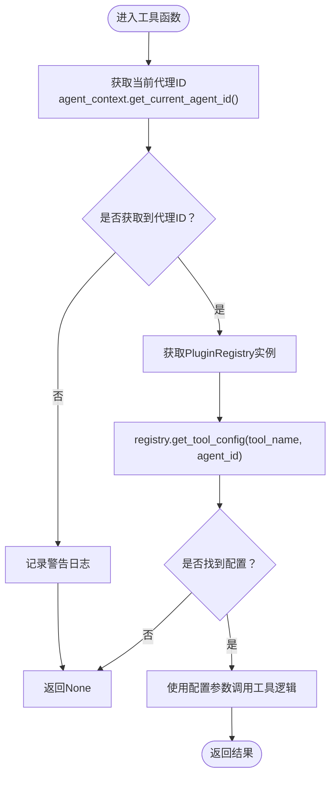
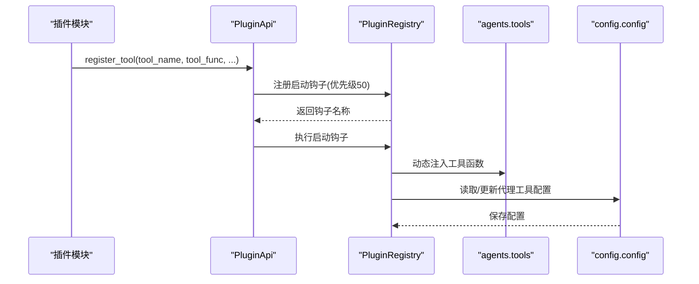
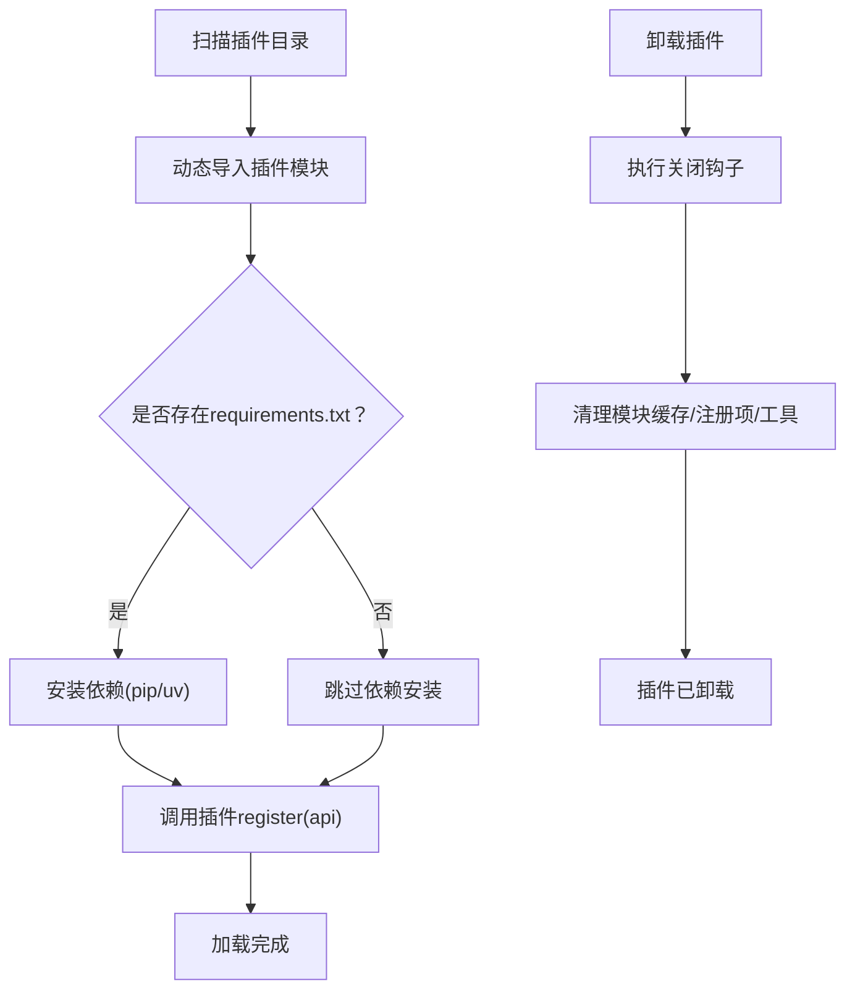
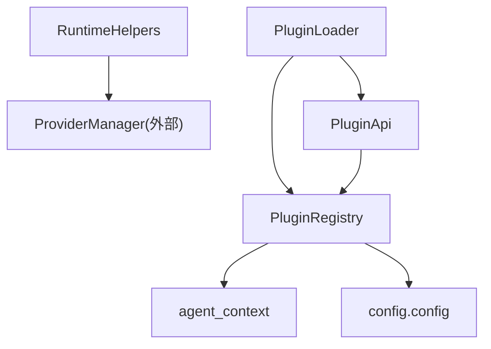

# 插件运行时API

<cite>
**本文档引用的文件**
- [src/qwenpaw/plugins/api.py](file://src/qwenpaw/plugins/api.py)
- [src/qwenpaw/plugins/runtime.py](file://src/qwenpaw/plugins/runtime.py)
- [src/qwenpaw/plugins/registry.py](file://src/qwenpaw/plugins/registry.py)
- [src/qwenpaw/plugins/loader.py](file://src/qwenpaw/plugins/loader.py)
- [src/qwenpaw/plugins/architecture.py](file://src/qwenpaw/plugins/architecture.py)
- [src/qwenpaw/plugins/__init__.py](file://src/qwenpaw/plugins/__init__.py)
- [src/qwenpaw/app/agent_context.py](file://src/qwenpaw/app/agent_context.py)
- [src/qwenpaw/config/config.py](file://src/qwenpaw/config/config.py)
- [src/qwenpaw/app/routers/tools.py](file://src/qwenpaw/app/routers/tools.py)
- [console/src/api/modules/tools.ts](file://console/src/api/modules/tools.ts)
- [plugins/tool/gpt-image2/plugin.json](file://plugins/tool/gpt-image2/plugin.json)
- [plugins/tool/gpt-image2/gpt_image2.py](file://plugins/tool/gpt-image2/gpt_image2.py)
</cite>

## 目录
1. [简介](#简介)
2. [项目结构](#项目结构)
3. [核心组件](#核心组件)
4. [架构总览](#架构总览)
5. [详细组件分析](#详细组件分析)
6. [依赖关系分析](#依赖关系分析)
7. [性能考虑](#性能考虑)
8. [故障排除指南](#故障排除指南)
9. [结论](#结论)
10. [附录](#附录)

## 简介
本文件面向插件开发者，系统性阐述 QwenPaw 插件运行时 API 的设计与使用方法。重点覆盖以下主题：
- 运行时辅助函数：通过 PluginApi.runtime 属性访问 RuntimeHelpers，实现日志、提供商查询等能力
- 工具配置管理：通过 get_tool_config 便捷获取当前代理的工具配置；通过 PluginApi 提供的注册与配置接口完成工具生命周期管理
- 插件加载与注册：PluginLoader 负责发现与加载插件；PluginRegistry 统一管理提供商、钩子、控制命令与 HTTP 路由
- 配置验证与最佳实践：结合前端工具 API 与后端配置模型，给出错误处理与配置验证建议

## 项目结构
QwenPaw 插件系统围绕“插件入口 → 注册器 → 运行时辅助 → 配置存储”展开，核心模块如下：
- 插件入口与API：PluginApi、get_tool_config
- 运行时辅助：RuntimeHelpers
- 注册中心：PluginRegistry（提供商、钩子、HTTP路由、工具配置）
- 加载器：PluginLoader（扫描、动态导入、依赖安装、卸载清理）
- 架构定义：PluginManifest、PluginRecord、PluginType
- 上下文与配置：agent_context 提供当前代理上下文；config 模块提供工具配置模型与默认值

图表来源
- [src/qwenpaw/plugins/loader.py:23-263](file://src/qwenpaw/plugins/loader.py#L23-L263)
- [src/qwenpaw/plugins/registry.py:95-598](file://src/qwenpaw/plugins/registry.py#L95-L598)
- [src/qwenpaw/plugins/api.py:48-401](file://src/qwenpaw/plugins/api.py#L48-L401)
- [src/qwenpaw/plugins/runtime.py:10-68](file://src/qwenpaw/plugins/runtime.py#L10-L68)
- [src/qwenpaw/plugins/architecture.py:36-142](file://src/qwenpaw/plugins/architecture.py#L36-L142)
- [src/qwenpaw/app/agent_context.py:143-152](file://src/qwenpaw/app/agent_context.py#L143-L152)
- [src/qwenpaw/config/config.py:1341-1571](file://src/qwenpaw/config/config.py#L1341-L1571)
- [src/qwenpaw/app/routers/tools.py:152-212](file://src/qwenpaw/app/routers/tools.py#L152-L212)

章节来源
- [src/qwenpaw/plugins/__init__.py:4-16](file://src/qwenpaw/plugins/__init__.py#L4-L16)
- [src/qwenpaw/plugins/architecture.py:10-34](file://src/qwenpaw/plugins/architecture.py#L10-L34)

## 核心组件
- PluginApi：插件开发者的统一接口，提供注册提供商、启动/关闭钩子、HTTP 路由、控制命令、工具注册与配置读写等能力
- get_tool_config：便捷函数，无需持有 PluginApi 实例即可获取当前代理的工具配置
- RuntimeHelpers：通过 PluginApi.runtime 访问，提供日志与提供商查询等运行时能力
- PluginRegistry：集中式注册中心，维护提供商、钩子、HTTP 路由、工具配置与插件清单
- PluginLoader：负责扫描插件目录、动态导入插件模块、安装依赖、执行启动/关闭钩子与清理工具

章节来源
- [src/qwenpaw/plugins/api.py:10-46](file://src/qwenpaw/plugins/api.py#L10-L46)
- [src/qwenpaw/plugins/api.py:245-254](file://src/qwenpaw/plugins/api.py#L245-L254)
- [src/qwenpaw/plugins/runtime.py:10-68](file://src/qwenpaw/plugins/runtime.py#L10-L68)
- [src/qwenpaw/plugins/registry.py:95-598](file://src/qwenpaw/plugins/registry.py#L95-L598)
- [src/qwenpaw/plugins/loader.py:23-263](file://src/qwenpaw/plugins/loader.py#L23-L263)

## 架构总览
下图展示了插件从加载到运行的关键流程，以及运行时 API 的调用路径。

图表来源
- [src/qwenpaw/plugins/loader.py:88-238](file://src/qwenpaw/plugins/loader.py#L88-L238)
- [src/qwenpaw/plugins/api.py:48-401](file://src/qwenpaw/plugins/api.py#L48-L401)
- [src/qwenpaw/plugins/registry.py:309-323](file://src/qwenpaw/plugins/registry.py#L309-L323)

## 详细组件分析

### 运行时辅助函数 RuntimeHelpers
- 作用：为插件提供日志与提供商查询等运行时能力
- 关键方法：
  - get_provider(provider_id)：根据提供商ID获取实例
  - list_providers()：列出所有可用提供商ID
  - log_info/log_error/log_debug：标准日志输出
- 访问方式：通过 PluginApi.runtime 属性获取 RuntimeHelpers 实例

图表来源
- [src/qwenpaw/plugins/runtime.py:10-68](file://src/qwenpaw/plugins/runtime.py#L10-L68)
- [src/qwenpaw/plugins/api.py:245-254](file://src/qwenpaw/plugins/api.py#L245-L254)

章节来源
- [src/qwenpaw/plugins/runtime.py:10-68](file://src/qwenpaw/plugins/runtime.py#L10-L68)
- [src/qwenpaw/plugins/api.py:245-254](file://src/qwenpaw/plugins/api.py#L245-L254)

### 工具配置管理
- get_tool_config(tool_name)：在工具函数内部直接获取当前代理的工具配置，无需持有 PluginApi
- PluginApi.get_tool_config(tool_name, agent_id)：从注册表读取指定代理的工具配置
- PluginApi.set_tool_config(tool_name, agent_id, config)：保存工具配置
- 配置持久化：通过 PluginRegistry 调用配置模块读写代理工具配置

图表来源
- [src/qwenpaw/plugins/api.py:10-46](file://src/qwenpaw/plugins/api.py#L10-L46)
- [src/qwenpaw/app/agent_context.py:143-152](file://src/qwenpaw/app/agent_context.py#L143-L152)
- [src/qwenpaw/plugins/registry.py:530-558](file://src/qwenpaw/plugins/registry.py#L530-L558)

章节来源
- [src/qwenpaw/plugins/api.py:10-46](file://src/qwenpaw/plugins/api.py#L10-L46)
- [src/qwenpaw/plugins/registry.py:530-598](file://src/qwenpaw/plugins/registry.py#L530-L598)
- [src/qwenpaw/app/agent_context.py:143-152](file://src/qwenpaw/app/agent_context.py#L143-L152)

### 插件注册与生命周期
- PluginApi.register_provider：注册自定义 LLM 提供商
- PluginApi.register_startup_hook/register_shutdown_hook：注册启动/关闭钩子
- PluginApi.register_http_router：挂载 REST 路由至 /api 前缀
- PluginApi.register_control_command：注册控制命令处理器
- PluginApi.register_tool：注册工具函数，自动写入代理工具配置

图表来源
- [src/qwenpaw/plugins/api.py:287-400](file://src/qwenpaw/plugins/api.py#L287-L400)
- [src/qwenpaw/config/config.py:1341-1571](file://src/qwenpaw/config/config.py#L1341-L1571)

章节来源
- [src/qwenpaw/plugins/api.py:81-190](file://src/qwenpaw/plugins/api.py#L81-L190)
- [src/qwenpaw/plugins/api.py:287-400](file://src/qwenpaw/plugins/api.py#L287-L400)
- [src/qwenpaw/config/config.py:1341-1571](file://src/qwenpaw/config/config.py#L1341-L1571)

### 插件加载与卸载
- PluginLoader.discover_plugins/load_plugin：扫描目录、动态导入、安装依赖、调用插件 register
- PluginLoader.unload_plugin：执行关闭钩子、清理模块缓存、注销注册项、移除工具
- PluginLoader.load_plugin_from_path：从路径复制/安装并加载插件

图表来源
- [src/qwenpaw/plugins/loader.py:36-262](file://src/qwenpaw/plugins/loader.py#L36-L262)
- [src/qwenpaw/plugins/loader.py:487-560](file://src/qwenpaw/plugins/loader.py#L487-L560)

章节来源
- [src/qwenpaw/plugins/loader.py:36-262](file://src/qwenpaw/plugins/loader.py#L36-L262)
- [src/qwenpaw/plugins/loader.py:487-560](file://src/qwenpaw/plugins/loader.py#L487-L560)

### 插件清单与类型
- PluginManifest：描述插件元数据、入口点、类型推断与兼容字段
- PluginType：枚举类型，支持 tool/provider/hook/command/frontend/general
- PluginRecord：已加载插件的记录，包含清单、源路径、启用状态与诊断信息

章节来源
- [src/qwenpaw/plugins/architecture.py:10-34](file://src/qwenpaw/plugins/architecture.py#L10-L34)
- [src/qwenpaw/plugins/architecture.py:44-142](file://src/qwenpaw/plugins/architecture.py#L44-L142)

## 依赖关系分析
- PluginApi 依赖 PluginRegistry 提供注册与查询能力
- RuntimeHelpers 依赖 ProviderManager（外部）提供提供商实例
- PluginRegistry 依赖 agent_context 获取当前代理ID，并与 config 模块交互以读写工具配置
- PluginLoader 依赖 PluginRegistry 完成注册与路由挂载

图表来源
- [src/qwenpaw/plugins/api.py:48-401](file://src/qwenpaw/plugins/api.py#L48-L401)
- [src/qwenpaw/plugins/registry.py:95-598](file://src/qwenpaw/plugins/registry.py#L95-L598)
- [src/qwenpaw/plugins/runtime.py:13-19](file://src/qwenpaw/plugins/runtime.py#L13-L19)
- [src/qwenpaw/plugins/loader.py:23-34](file://src/qwenpaw/plugins/loader.py#L23-L34)

章节来源
- [src/qwenpaw/plugins/api.py:48-401](file://src/qwenpaw/plugins/api.py#L48-L401)
- [src/qwenpaw/plugins/registry.py:95-598](file://src/qwenpaw/plugins/registry.py#L95-L598)
- [src/qwenpaw/plugins/runtime.py:13-19](file://src/qwenpaw/plugins/runtime.py#L13-L19)
- [src/qwenpaw/plugins/loader.py:23-34](file://src/qwenpaw/plugins/loader.py#L23-L34)

## 性能考虑
- 启动钩子优先级：工具注册使用优先级50，确保在应用初始化完成后执行，避免重复加载与竞态条件
- HTTP 路由挂载：PluginRegistry 在 FastAPI 应用中插入路由并保持与 SPA 路由的顺序一致性，减少路由冲突
- 工具配置读取：PluginRegistry.get_tool_config 直接从代理配置读取，避免额外网络请求
- 卸载清理：PluginLoader.unload_plugin 清理模块缓存与注册项，防止内存泄漏与重复注册

## 故障排除指南
- get_tool_config 返回 None
  - 可能原因：当前无活动代理ID或工具未在代理配置中注册
  - 处理建议：检查 agent_context 的代理上下文设置；确认 PluginApi.register_tool 是否成功执行
- 注册提供商失败
  - 可能原因：提供商ID已存在或 ProviderManager 未正确初始化
  - 处理建议：更换唯一 provider_id；确保 RuntimeHelpers 初始化时传入 ProviderManager
- HTTP 路由无法访问
  - 可能原因：未设置 PluginRegistry 的 FastAPI 应用或前缀冲突
  - 处理建议：调用 set_plugin_http_app 并确保前缀不为“/”且唯一
- 卸载插件后仍可见
  - 可能原因：工具仍在 agents.tools 中残留
  - 处理建议：调用 PluginLoader._cleanup_plugin_tools 移除工具与 __all__ 条目

章节来源
- [src/qwenpaw/plugins/api.py:10-46](file://src/qwenpaw/plugins/api.py#L10-L46)
- [src/qwenpaw/plugins/registry.py:130-214](file://src/qwenpaw/plugins/registry.py#L130-L214)
- [src/qwenpaw/plugins/loader.py:561-608](file://src/qwenpaw/plugins/loader.py#L561-L608)

## 结论
QwenPaw 的插件运行时 API 通过 PluginApi、RuntimeHelpers 与 PluginRegistry 形成清晰的分层架构：开发者通过 PluginApi 完成注册与配置管理，通过 RuntimeHelpers 获取运行时能力，通过 PluginRegistry 统一调度与持久化。配合 PluginLoader 的自动化加载与卸载机制，插件系统具备良好的扩展性与可维护性。

## 附录

### 实际应用场景与使用技巧
- 工具函数内获取配置
  - 使用 get_tool_config(tool_name) 直接读取当前代理的工具配置，若未配置则返回 None，便于快速失败与提示用户配置
  - 示例参考：[plugins/tool/gpt-image2/gpt_image2.py:34-57](file://plugins/tool/gpt-image2/gpt_image2.py#L34-L57)
- 注册自定义提供商
  - 使用 PluginApi.register_provider 注册第三方 LLM 提供商，合并插件清单元数据与自定义元数据
  - 示例参考：[src/qwenpaw/plugins/api.py:81-126](file://src/qwenpaw/plugins/api.py#L81-L126)
- 注册工具函数
  - 使用 PluginApi.register_tool 自动注入工具函数并写入代理工具配置，支持异步执行与图标显示
  - 示例参考：[src/qwenpaw/plugins/api.py:287-400](file://src/qwenpaw/plugins/api.py#L287-L400)
- 访问运行时辅助
  - 通过 PluginApi.runtime 获取 RuntimeHelpers，进行日志记录与提供商查询
  - 示例参考：[src/qwenpaw/plugins/api.py:245-254](file://src/qwenpaw/plugins/api.py#L245-L254)
- 插件清单与工具元数据
  - 在 plugin.json 的 meta 字段声明工具名称、描述、图标与配置字段，前端将据此生成配置界面
  - 示例参考：[plugins/tool/gpt-image2/plugin.json:13-87](file://plugins/tool/gpt-image2/plugin.json#L13-L87)

### 配置验证与最佳实践
- 工具配置字段
  - 前端工具 API 定义了配置字段类型（文本、密码、数字、布尔、选择、多行文本）与必填、范围、占位符等约束
  - 参考：[console/src/api/modules/tools.ts:3-25](file://console/src/api/modules/tools.ts#L3-L25)
- 工具配置持久化
  - 通过 PluginRegistry.get_tool_config/set_tool_config 读写代理工具配置，避免硬编码密钥
  - 参考：[src/qwenpaw/plugins/registry.py:530-598](file://src/qwenpaw/plugins/registry.py#L530-L598)
- 默认工具集与合并策略
  - 代码内置工具集与插件注册工具集合并，缺失条目自动补齐，图标为空时进行规范化
  - 参考：[src/qwenpaw/config/config.py:1341-1571](file://src/qwenpaw/config/config.py#L1341-L1571)
- 工具列表与配置字段映射
  - 后端路由根据插件清单中的 meta.tools 或旧格式 tool_name 映射配置字段与是否需要配置
  - 参考：[src/qwenpaw/app/routers/tools.py:94-212](file://src/qwenpaw/app/routers/tools.py#L94-L212)