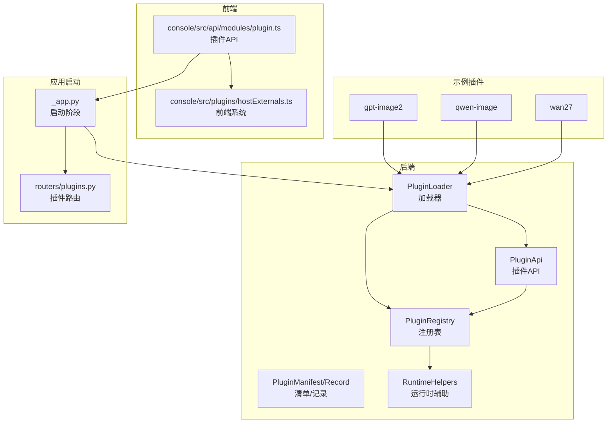
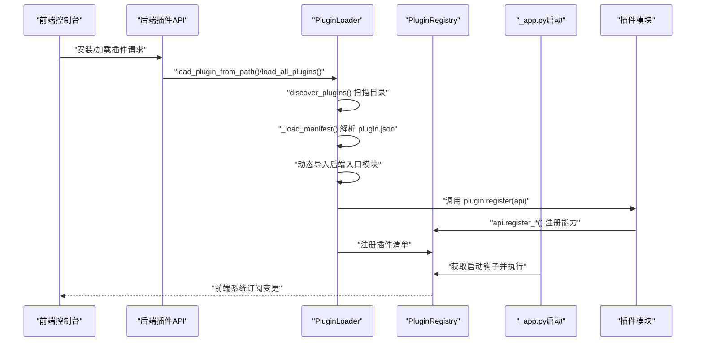
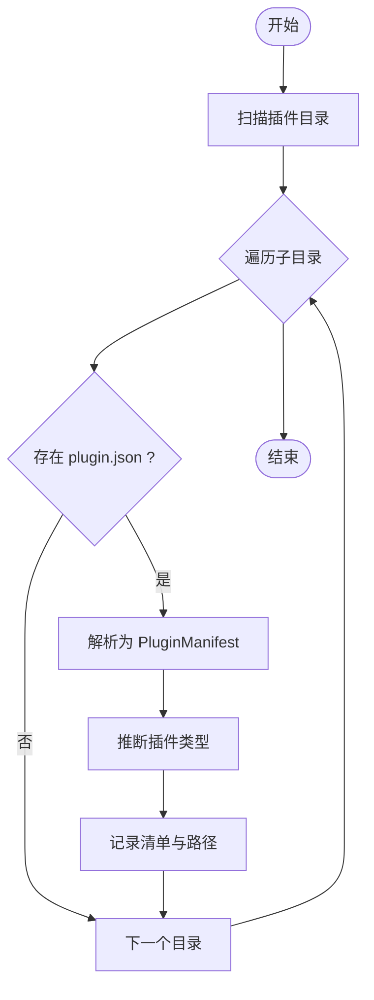
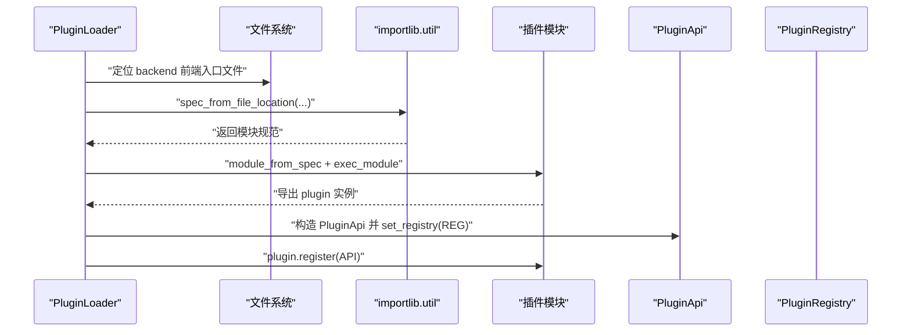
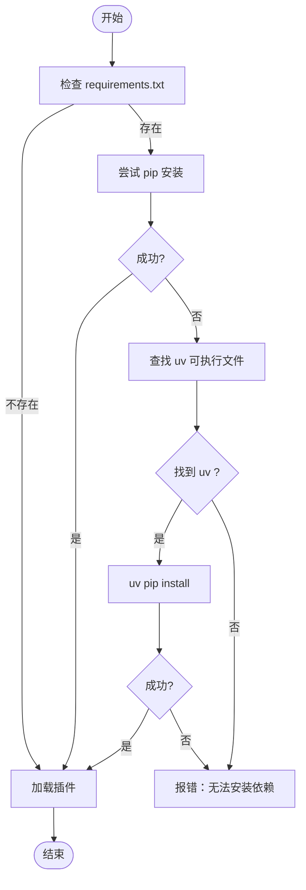
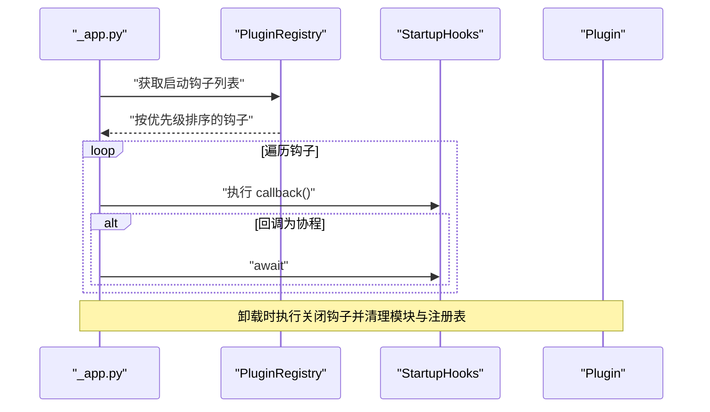
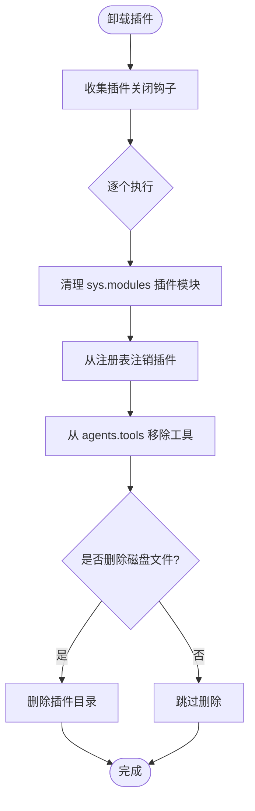
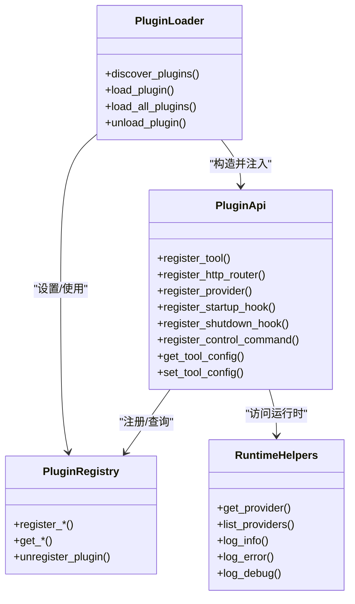
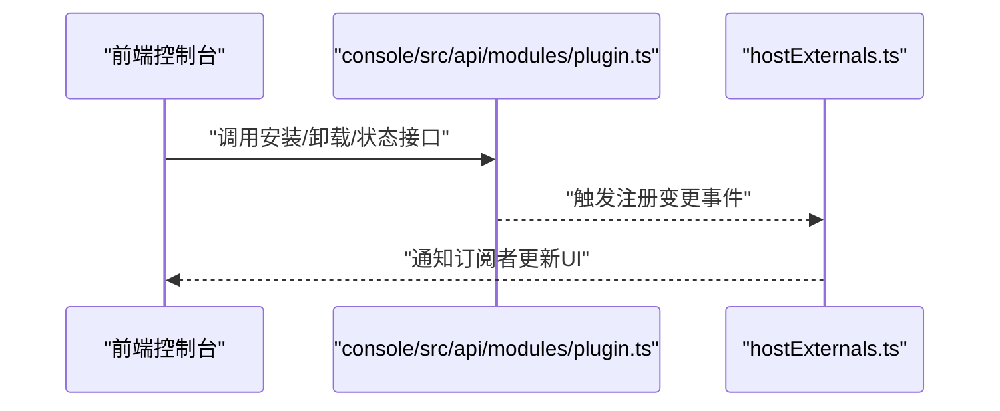
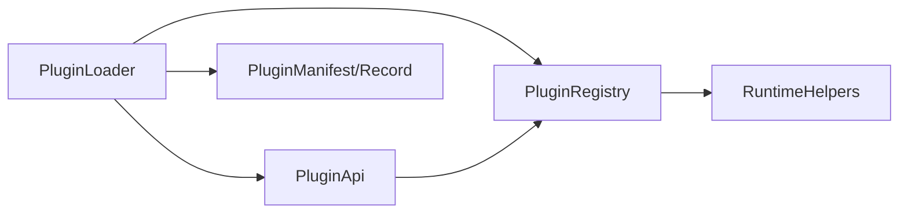

# 插件加载机制

<cite>
**本文档引用的文件**
- [src/qwenpaw/plugins/__init__.py](file://src/qwenpaw/plugins/__init__.py)
- [src/qwenpaw/plugins/loader.py](file://src/qwenpaw/plugins/loader.py)
- [src/qwenpaw/plugins/registry.py](file://src/qwenpaw/plugins/registry.py)
- [src/qwenpaw/plugins/architecture.py](file://src/qwenpaw/plugins/architecture.py)
- [src/qwenpaw/plugins/api.py](file://src/qwenpaw/plugins/api.py)
- [src/qwenpaw/plugins/runtime.py](file://src/qwenpaw/plugins/runtime.py)
- [src/qwenpaw/app/_app.py](file://src/qwenpaw/app/_app.py)
- [src/qwenpaw/app/routers/plugins.py](file://src/qwenpaw/app/routers/plugins.py)
- [console/src/api/modules/plugin.ts](file://console/src/api/modules/plugin.ts)
- [console/src/plugins/hostExternals.ts](file://console/src/plugins/hostExternals.ts)
- [plugins/tool/gpt-image2/plugin.json](file://plugins/tool/gpt-image2/plugin.json)
- [plugins/tool/gpt-image2/gpt_image2.py](file://plugins/tool/gpt-image2/gpt_image2.py)
- [plugins/tool/qwen-image/plugin.json](file://plugins/tool/qwen-image/plugin.json)
- [plugins/tool/qwen-image/qwen_image.py](file://plugins/tool/qwen-image/qwen_image.py)
- [plugins/tool/wan27/plugin.json](file://plugins/tool/wan27/plugin.json)
- [plugins/tool/wan27/wan27.py](file://plugins/tool/wan27/wan27.py)
</cite>

## 目录
1. [引言](#引言)
2. [项目结构](#项目结构)
3. [核心组件](#核心组件)
4. [架构总览](#架构总览)
5. [详细组件分析](#详细组件分析)
6. [依赖关系分析](#依赖关系分析)
7. [性能考虑](#性能考虑)
8. [故障排查指南](#故障排查指南)
9. [结论](#结论)
10. [附录](#附录)

## 引言
本文件系统性阐述 QwenPaw 的插件加载机制，覆盖从插件发现、清单解析、依赖检查到运行时初始化的全流程；详解插件加载器的模块导入与类实例化、依赖注入与注册表协作；并给出插件运行时管理（状态跟踪、生命周期钩子、资源清理）、错误处理策略、性能优化与调试方法。文末提供可直接定位到源码路径的参考，便于进一步阅读。

## 项目结构
QwenPaw 的插件体系由后端 Python 加载器与前端控制台 API/前端系统共同组成：
- 后端：插件发现与加载、清单解析、注册表、API 接口、运行时辅助工具
- 前端：控制台插件管理 API、前端插件系统订阅与状态更新
- 示例插件：位于 plugins/tool/* 下，演示工具型插件的标准目录与清单格式

图表来源
- [src/qwenpaw/plugins/loader.py:23-628](file://src/qwenpaw/plugins/loader.py#L23-L628)
- [src/qwenpaw/plugins/registry.py:95-598](file://src/qwenpaw/plugins/registry.py#L95-L598)
- [src/qwenpaw/plugins/api.py:48-401](file://src/qwenpaw/plugins/api.py#L48-L401)
- [src/qwenpaw/plugins/runtime.py:10-68](file://src/qwenpaw/plugins/runtime.py#L10-L68)
- [src/qwenpaw/app/_app.py:390-419](file://src/qwenpaw/app/_app.py#L390-L419)
- [src/qwenpaw/app/routers/plugins.py:171-205](file://src/qwenpaw/app/routers/plugins.py#L171-L205)
- [console/src/api/modules/plugin.ts:105-139](file://console/src/api/modules/plugin.ts#L105-L139)
- [console/src/plugins/hostExternals.ts:97-122](file://console/src/plugins/hostExternals.ts#L97-L122)

章节来源
- [src/qwenpaw/plugins/__init__.py:1-17](file://src/qwenpaw/plugins/__init__.py#L1-L17)
- [src/qwenpaw/plugins/loader.py:23-628](file://src/qwenpaw/plugins/loader.py#L23-L628)
- [src/qwenpaw/plugins/registry.py:95-598](file://src/qwenpaw/plugins/registry.py#L95-L598)
- [src/qwenpaw/plugins/api.py:48-401](file://src/qwenpaw/plugins/api.py#L48-L401)
- [src/qwenpaw/plugins/runtime.py:10-68](file://src/qwenpaw/plugins/runtime.py#L10-L68)
- [src/qwenpaw/app/_app.py:390-419](file://src/qwenpaw/app/_app.py#L390-L419)
- [src/qwenpaw/app/routers/plugins.py:171-205](file://src/qwenpaw/app/routers/plugins.py#L171-L205)
- [console/src/api/modules/plugin.ts:105-139](file://console/src/api/modules/plugin.ts#L105-L139)
- [console/src/plugins/hostExternals.ts:97-122](file://console/src/plugins/hostExternals.ts#L97-L122)

## 核心组件
- 插件加载器（PluginLoader）：负责扫描插件目录、解析清单、动态导入后端模块、调用插件注册方法、安装依赖、管理已加载插件集合
- 注册表（PluginRegistry）：集中管理插件提供的能力（HTTP 路由、Provider、启动/关闭钩子、控制命令、工具配置等）
- 插件 API（PluginApi）：向插件暴露注册接口（工具、HTTP 路由、Provider、钩子、控制命令），以及读取/保存工具配置的能力
- 架构定义（PluginManifest/PluginRecord/PluginType/PluginEntryPoints）：标准化插件清单字段、类型与记录结构
- 运行时辅助（RuntimeHelpers）：提供日志、Provider 查询、列表等运行时能力
- 应用集成点：启动阶段执行插件启动钩子；插件路由挂载；控制命令注册；卸载时执行关闭钩子并清理

章节来源
- [src/qwenpaw/plugins/loader.py:23-628](file://src/qwenpaw/plugins/loader.py#L23-L628)
- [src/qwenpaw/plugins/registry.py:95-598](file://src/qwenpaw/plugins/registry.py#L95-L598)
- [src/qwenpaw/plugins/api.py:48-401](file://src/qwenpaw/plugins/api.py#L48-L401)
- [src/qwenpaw/plugins/architecture.py:10-142](file://src/qwenpaw/plugins/architecture.py#L10-L142)
- [src/qwenpaw/plugins/runtime.py:10-68](file://src/qwenpaw/plugins/runtime.py#L10-L68)

## 架构总览
下图展示一次典型插件加载的端到端流程：前端触发安装/加载 → 后端发现与加载 → 清单解析与依赖安装 → 注册 API 能力 → 启动钩子执行 → 前端系统订阅更新。

图表来源
- [src/qwenpaw/plugins/loader.py:240-262](file://src/qwenpaw/plugins/loader.py#L240-L262)
- [src/qwenpaw/plugins/loader.py:406-485](file://src/qwenpaw/plugins/loader.py#L406-L485)
- [src/qwenpaw/plugins/api.py:81-243](file://src/qwenpaw/plugins/api.py#L81-L243)
- [src/qwenpaw/app/_app.py:404-419](file://src/qwenpaw/app/_app.py#L404-L419)
- [console/src/api/modules/plugin.ts:105-139](file://console/src/api/modules/plugin.ts#L105-L139)
- [console/src/plugins/hostExternals.ts:97-122](file://console/src/plugins/hostExternals.ts#L97-L122)

## 详细组件分析

### 插件发现与清单解析
- 发现流程：遍历配置的插件目录，对每个子目录查找 plugin.json，存在则解析为 PluginManifest
- 清单解析：支持新旧字段兼容（如 entry.backend 与历史 entry_point），自动推断插件类型（工具/Provider/命令/前端/通用）
- 类型与入口：通过 PluginEntryPoints 指定前后端入口文件，用于后续动态导入

图表来源
- [src/qwenpaw/plugins/loader.py:36-69](file://src/qwenpaw/plugins/loader.py#L36-L69)
- [src/qwenpaw/plugins/architecture.py:92-130](file://src/qwenpaw/plugins/architecture.py#L92-L130)

章节来源
- [src/qwenpaw/plugins/loader.py:36-69](file://src/qwenpaw/plugins/loader.py#L36-L69)
- [src/qwenpaw/plugins/architecture.py:92-130](file://src/qwenpaw/plugins/architecture.py#L92-L130)

### 动态加载与模块导入机制
- 入口点校验：若前后端入口均缺失或不存在，抛出异常
- 动态导入：使用 importlib.util.spec_from_file_location 创建模块规范，设置 __package__/__path__ 支持相对导入，exec_module 执行模块
- 导出对象：要求模块导出名为 plugin 的实例，作为插件注册入口
- 插件 API 注入：构造 PluginApi 并传入插件，注册表在加载器中设置，供插件调用

图表来源
- [src/qwenpaw/plugins/loader.py:115-238](file://src/qwenpaw/plugins/loader.py#L115-L238)
- [src/qwenpaw/plugins/api.py:48-80](file://src/qwenpaw/plugins/api.py#L48-L80)

章节来源
- [src/qwenpaw/plugins/loader.py:115-238](file://src/qwenpaw/plugins/loader.py#L115-L238)
- [src/qwenpaw/plugins/api.py:48-80](file://src/qwenpaw/plugins/api.py#L48-L80)

### 依赖检查与安装
- 依赖文件：若插件目录存在 requirements.txt，则在加载前安装
- 安装策略：优先使用当前 Python 环境的 pip；若不可用则尝试 uv（支持多种平台路径探测）
- 超时控制：安装过程带超时保护，失败时抛出明确错误信息

图表来源
- [src/qwenpaw/plugins/loader.py:295-404](file://src/qwenpaw/plugins/loader.py#L295-L404)

章节来源
- [src/qwenpaw/plugins/loader.py:295-404](file://src/qwenpaw/plugins/loader.py#L295-L404)

### 运行时初始化与生命周期钩子
- 启动钩子：应用启动阶段按优先级顺序执行插件注册的启动钩子，支持同步与异步回调
- 关闭钩子：卸载插件时执行其注册的关闭钩子，确保资源释放
- 工具注册：通过 PluginApi.register_tool 将工具函数注册到 agents.tools，并写入当前代理的工具配置

图表来源
- [src/qwenpaw/app/_app.py:404-419](file://src/qwenpaw/app/_app.py#L404-L419)
- [src/qwenpaw/plugins/registry.py:325-381](file://src/qwenpaw/plugins/registry.py#L325-L381)
- [src/qwenpaw/plugins/loader.py:487-560](file://src/qwenpaw/plugins/loader.py#L487-L560)

章节来源
- [src/qwenpaw/app/_app.py:404-419](file://src/qwenpaw/app/_app.py#L404-L419)
- [src/qwenpaw/plugins/registry.py:325-381](file://src/qwenpaw/plugins/registry.py#L325-L381)
- [src/qwenpaw/plugins/loader.py:487-560](file://src/qwenpaw/plugins/loader.py#L487-L560)

### 插件运行时管理与资源清理
- 状态跟踪：PluginRecord 记录清单、源路径、启用状态与实例
- 资源清理：卸载时移除 sys.modules 中的插件模块及其子模块、清理注册表、移除 agents.tools 中的工具、可选删除磁盘文件
- 控制命令与 HTTP 路由：通过注册表统一挂载与注销，保证路由顺序与 OpenAPI 缓存一致性

图表来源
- [src/qwenpaw/plugins/loader.py:487-560](file://src/qwenpaw/plugins/loader.py#L487-L560)
- [src/qwenpaw/plugins/registry.py:219-248](file://src/qwenpaw/plugins/registry.py#L219-L248)

章节来源
- [src/qwenpaw/plugins/loader.py:487-560](file://src/qwenpaw/plugins/loader.py#L487-L560)
- [src/qwenpaw/plugins/registry.py:219-248](file://src/qwenpaw/plugins/registry.py#L219-L248)

### 依赖注入与 API 使用
- 依赖注入：PluginLoader 在加载插件时构造 PluginApi 并 set_registry，插件通过 api.* 方法注册能力
- API 能力：注册工具、HTTP 路由、Provider、启动/关闭钩子、控制命令；读取/保存工具配置
- 运行时辅助：通过 api.runtime 访问 RuntimeHelpers，提供日志与 Provider 查询

图表来源
- [src/qwenpaw/plugins/loader.py:23-628](file://src/qwenpaw/plugins/loader.py#L23-L628)
- [src/qwenpaw/plugins/registry.py:95-598](file://src/qwenpaw/plugins/registry.py#L95-L598)
- [src/qwenpaw/plugins/api.py:48-401](file://src/qwenpaw/plugins/api.py#L48-L401)
- [src/qwenpaw/plugins/runtime.py:10-68](file://src/qwenpaw/plugins/runtime.py#L10-L68)

章节来源
- [src/qwenpaw/plugins/api.py:48-401](file://src/qwenpaw/plugins/api.py#L48-L401)
- [src/qwenpaw/plugins/runtime.py:10-68](file://src/qwenpaw/plugins/runtime.py#L10-L68)

### 前端集成与热重载
- 控制台 API：提供安装、卸载、状态查询等接口，配合后端插件管理路由
- 前端系统：通过全局 pluginSystem 订阅注册变化，实时更新插件状态与路由

图表来源
- [console/src/api/modules/plugin.ts:105-139](file://console/src/api/modules/plugin.ts#L105-L139)
- [console/src/plugins/hostExternals.ts:97-122](file://console/src/plugins/hostExternals.ts#L97-L122)

章节来源
- [console/src/api/modules/plugin.ts:105-139](file://console/src/api/modules/plugin.ts#L105-L139)
- [console/src/plugins/hostExternals.ts:97-122](file://console/src/plugins/hostExternals.ts#L97-L122)

## 依赖关系分析
- 组件耦合：PluginLoader 与 PluginRegistry 高内聚，通过 PluginApi 交互；RuntimeHelpers 作为可选注入项
- 外部依赖：FastAPI（HTTP 路由挂载）、subprocess（依赖安装）、importlib（动态导入）
- 循环依赖：未见循环导入；注册表采用单例惰性初始化避免重复初始化问题

图表来源
- [src/qwenpaw/plugins/loader.py:23-628](file://src/qwenpaw/plugins/loader.py#L23-L628)
- [src/qwenpaw/plugins/registry.py:95-598](file://src/qwenpaw/plugins/registry.py#L95-L598)
- [src/qwenpaw/plugins/api.py:48-401](file://src/qwenpaw/plugins/api.py#L48-L401)
- [src/qwenpaw/plugins/runtime.py:10-68](file://src/qwenpaw/plugins/runtime.py#L10-L68)

章节来源
- [src/qwenpaw/plugins/loader.py:23-628](file://src/qwenpaw/plugins/loader.py#L23-L628)
- [src/qwenpaw/plugins/registry.py:95-598](file://src/qwenpaw/plugins/registry.py#L95-L598)
- [src/qwenpaw/plugins/api.py:48-401](file://src/qwenpaw/plugins/api.py#L48-L401)
- [src/qwenpaw/plugins/runtime.py:10-68](file://src/qwenpaw/plugins/runtime.py#L10-L68)

## 性能考虑
- 异步安装依赖：使用 asyncio.to_thread 将阻塞的包管理器调用放入线程池，避免阻塞事件循环
- 事件循环友好：动态导入与模块执行在主线程进行，但安装步骤异步化
- 路由挂载优化：注册表在挂载 HTTP 路由时调整 FastAPI 路由顺序并清空 OpenAPI 缓存，确保新路由优先匹配
- 日志与告警：大量使用结构化日志，便于性能分析与问题定位

章节来源
- [src/qwenpaw/plugins/loader.py:474-485](file://src/qwenpaw/plugins/loader.py#L474-L485)
- [src/qwenpaw/plugins/registry.py:29-52](file://src/qwenpaw/plugins/registry.py#L29-L52)

## 故障排查指南
- 清单解析失败：检查 plugin.json 字段完整性与 JSON 格式；确认 entry.backend 或 entry.frontend 存在
- 模块导入失败：确认插件模块导出 plugin 实例且可被 importlib 正确加载；检查相对导入路径
- 依赖安装失败：查看 pip/uv 安装输出；确认网络可达与权限；必要时手动安装 requirements.txt
- 卸载失败：确认插件已加载；检查是否存在仍在使用的工具或路由；查看关闭钩子错误日志
- 工具未生效：确认工具已在 agents.tools 中注册并写入代理配置；检查启动钩子执行情况

章节来源
- [src/qwenpaw/plugins/loader.py:71-86](file://src/qwenpaw/plugins/loader.py#L71-L86)
- [src/qwenpaw/plugins/loader.py:115-238](file://src/qwenpaw/plugins/loader.py#L115-L238)
- [src/qwenpaw/plugins/loader.py:295-404](file://src/qwenpaw/plugins/loader.py#L295-L404)
- [src/qwenpaw/plugins/loader.py:487-560](file://src/qwenpaw/plugins/loader.py#L487-L560)
- [src/qwenpaw/plugins/api.py:256-286](file://src/qwenpaw/plugins/api.py#L256-L286)

## 结论
QwenPaw 的插件加载机制以 PluginLoader 为核心，结合 PluginRegistry 与 PluginApi，实现了从发现、解析、动态导入、依赖安装到运行时初始化与生命周期管理的完整闭环。通过异步安装、优先级钩子、统一注册表与前端系统联动，既保证了扩展性，也兼顾了稳定性与可观测性。建议在开发自定义插件时遵循现有清单与入口约定，充分利用 API 提供的注册能力与运行时辅助工具。

## 附录

### 示例插件清单与入口
- gpt-image2：工具型插件，声明两个图像生成/编辑工具，清单包含依赖与配置字段
- qwen-image：工具型插件，声明两个图像生成/编辑工具，清单包含 DashScope 相关配置
- wan27：工具型插件，声明文本/图像/参考视频生成工具，清单包含 DashScope 相关配置

章节来源
- [plugins/tool/gpt-image2/plugin.json:1-89](file://plugins/tool/gpt-image2/plugin.json#L1-L89)
- [plugins/tool/qwen-image/plugin.json:1-129](file://plugins/tool/qwen-image/plugin.json#L1-L129)
- [plugins/tool/wan27/plugin.json:1-122](file://plugins/tool/wan27/plugin.json#L1-L122)

### 插件入口实现要点
- 后端入口类需实现 register(api) 方法，使用 api.register_tool 注册工具函数
- 入口模块需导出名为 plugin 的实例，供加载器动态导入与调用

章节来源
- [plugins/tool/gpt-image2/gpt_image2.py:27-63](file://plugins/tool/gpt-image2/gpt_image2.py#L27-L63)
- [plugins/tool/qwen-image/qwen_image.py:27-62](file://plugins/tool/qwen-image/qwen_image.py#L27-L62)
- [plugins/tool/wan27/wan27.py:27-69](file://plugins/tool/wan27/wan27.py#L27-L69)