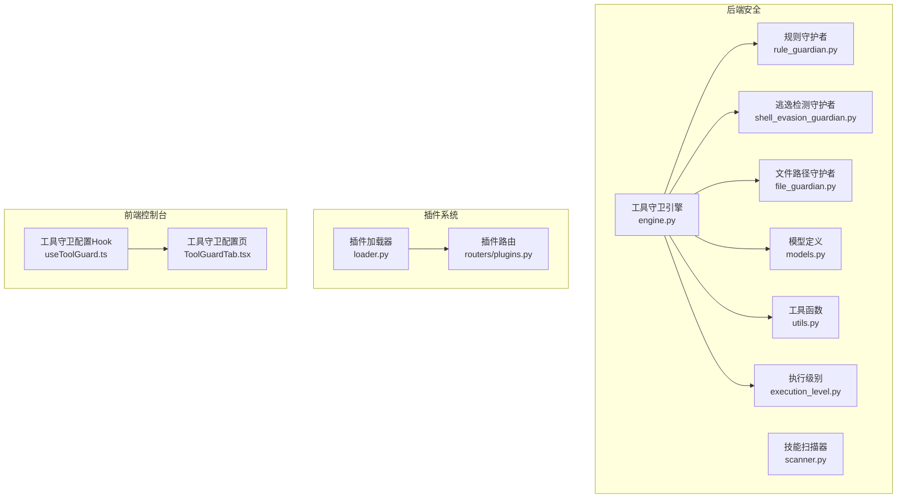
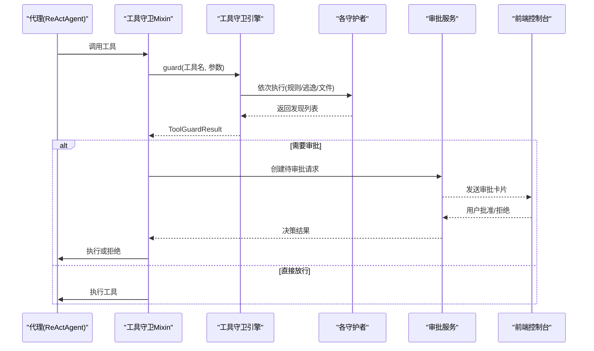
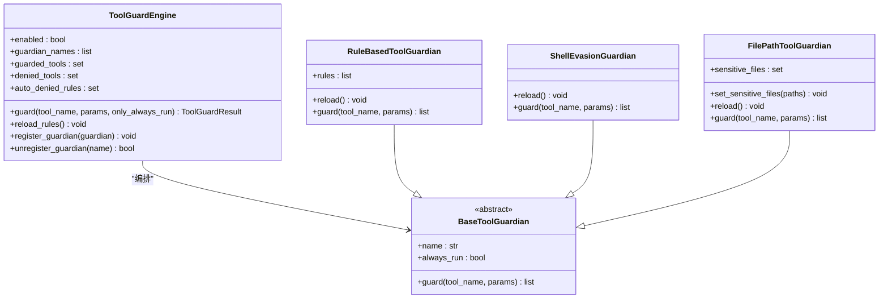
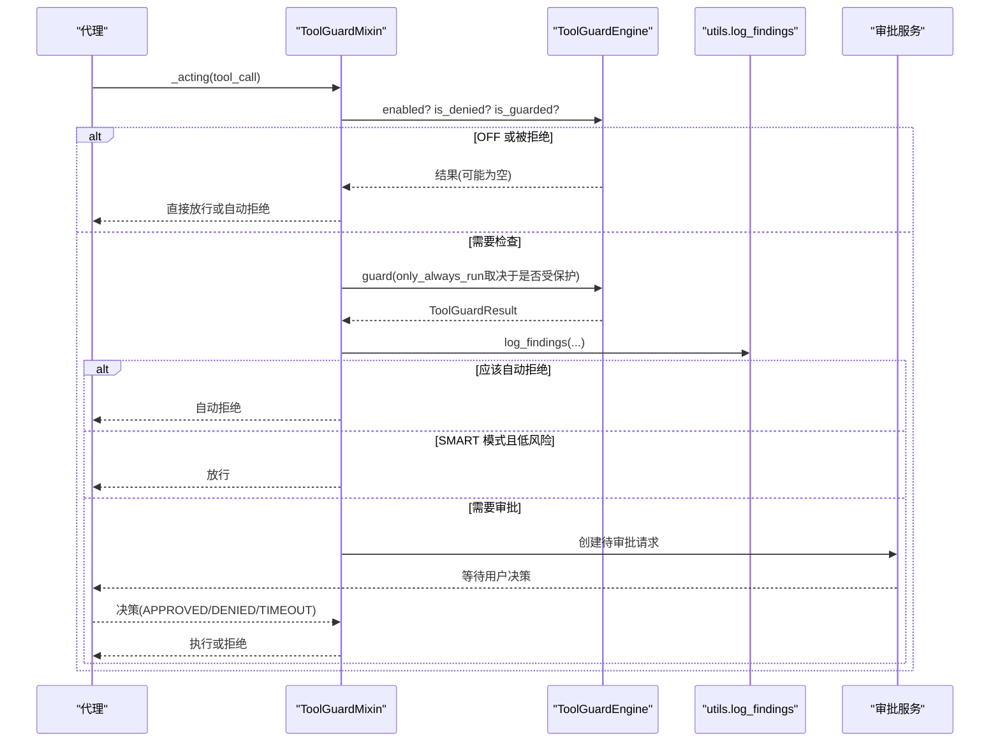
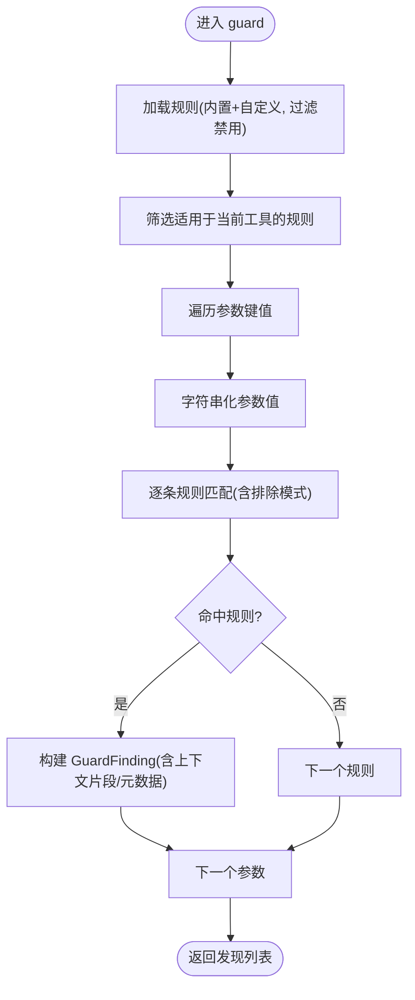
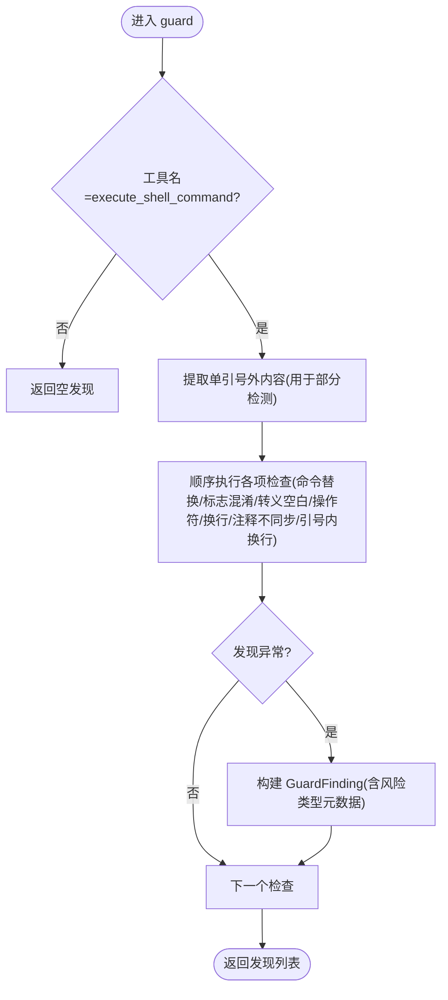
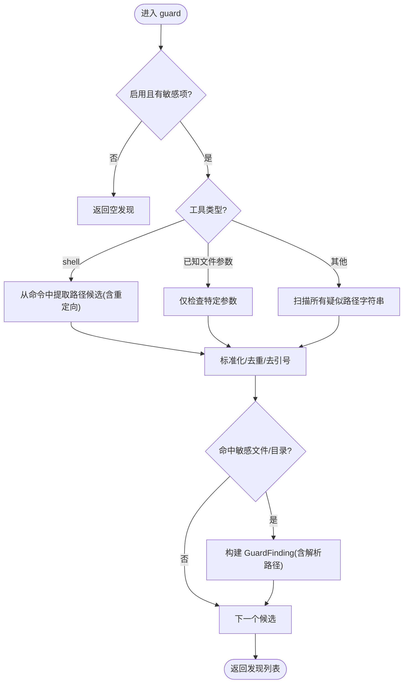
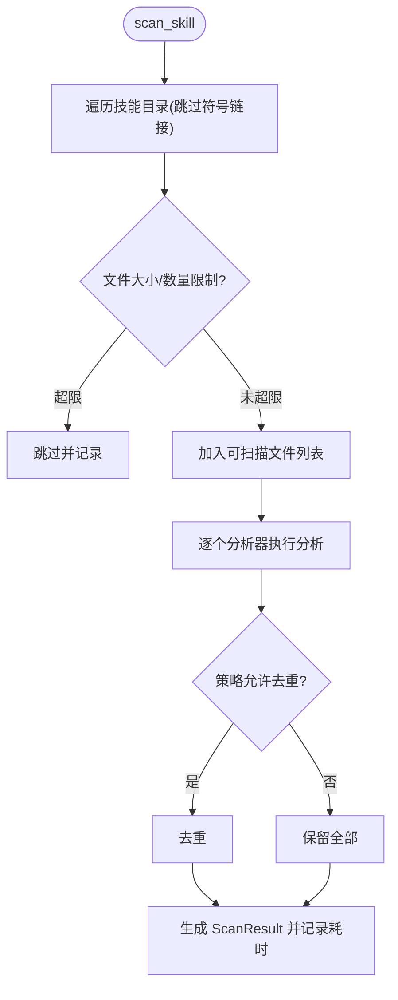
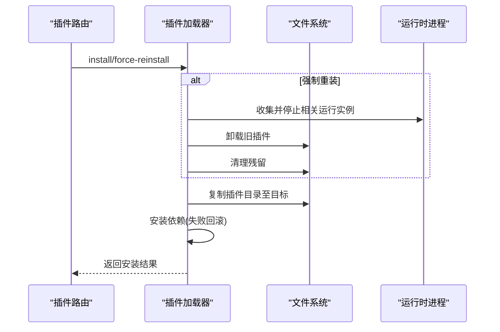
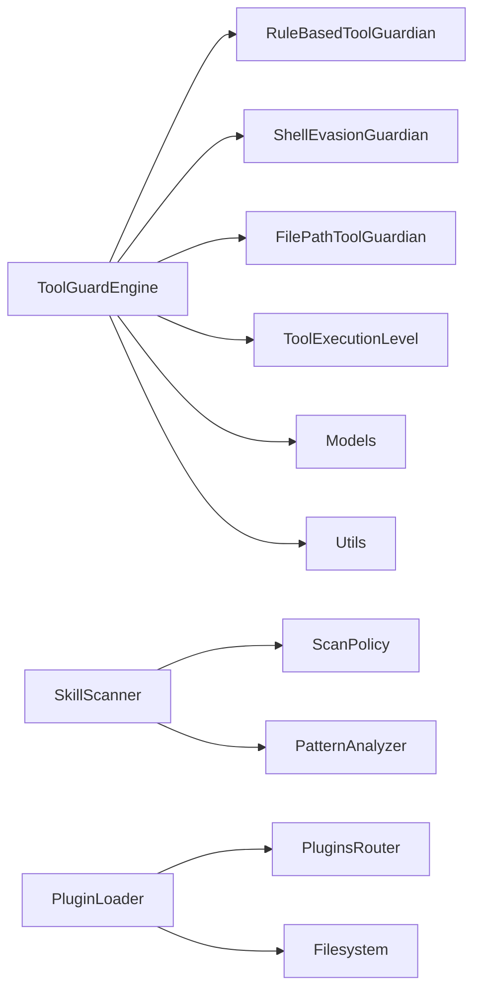

# 插件安全与隔离

<cite>
**本文引用的文件**
- [src/qwenpaw/security/tool_guard/engine.py](file://src/qwenpaw/security/tool_guard/engine.py)
- [src/qwenpaw/security/tool_guard/guardians/__init__.py](file://src/qwenpaw/security/tool_guard/guardians/__init__.py)
- [src/qwenpaw/security/tool_guard/guardians/rule_guardian.py](file://src/qwenpaw/security/tool_guard/guardians/rule_guardian.py)
- [src/qwenpaw/security/tool_guard/guardians/shell_evasion_guardian.py](file://src/qwenpaw/security/tool_guard/guardians/shell_evasion_guardian.py)
- [src/qwenpaw/security/tool_guard/guardians/file_guardian.py](file://src/qwenpaw/security/tool_guard/guardians/file_guardian.py)
- [src/qwenpaw/security/tool_guard/execution_level.py](file://src/qwenpaw/security/tool_guard/execution_level.py)
- [src/qwenpaw/security/tool_guard/models.py](file://src/qwenpaw/security/tool_guard/models.py)
- [src/qwenpaw/security/tool_guard/utils.py](file://src/qwenpaw/security/tool_guard/utils.py)
- [src/qwenpaw/agents/tool_guard_mixin.py](file://src/qwenpaw/agents/tool_guard_mixin.py)
- [src/qwenpaw/security/skill_scanner/scanner.py](file://src/qwenpaw/security/skill_scanner/scanner.py)
- [src/qwenpaw/plugins/loader.py](file://src/qwenpaw/plugins/loader.py)
- [src/qwenpaw/app/routers/plugins.py](file://src/qwenpaw/app/routers/plugins.py)
- [console/src/pages/Settings/Security/useToolGuard.ts](file://console/src/pages/Settings/Security/useToolGuard.ts)
- [console/src/pages/Settings/Security/components/ToolGuardTab.tsx](file://console/src/pages/Settings/Security/components/ToolGuardTab.tsx)
- [website/public/docs/security.en.md](file://website/public/docs/security.en.md)
</cite>

## 目录
1. [引言](#引言)
2. [项目结构](#项目结构)
3. [核心组件](#核心组件)
4. [架构总览](#架构总览)
5. [详细组件分析](#详细组件分析)
6. [依赖分析](#依赖分析)
7. [性能考虑](#性能考虑)
8. [故障排查指南](#故障排查指南)
9. [结论](#结论)
10. [附录](#附录)

## 引言
本技术文档聚焦于 QwenPaw 的“插件安全与隔离”机制，系统阐述插件沙箱与工具守卫体系的设计原理与实现细节。内容涵盖：
- 工具守卫（Tool Guard）对插件行为的参数级监控与拦截，包括规则引擎、文件路径保护、命令注入与逃逸检测等。
- 执行级别（Execution Level）对审批策略的控制，支持严格、智能与自动模式。
- 插件安装与加载流程中的边界防护，防止恶意插件破坏系统。
- 安全配置最佳实践、审计与威胁检测建议，以及应急响应策略。

## 项目结构
围绕“安全”的关键目录与文件：
- 安全子系统（Python）
  - 工具守卫：引擎、守护者、模型、工具函数、执行级别
  - 技能扫描器：对技能包进行静态安全扫描
- 插件系统（Python）
  - 加载器与路由：负责插件安装、卸载、运行时隔离与清理
- 控制台前端（TypeScript/React）
  - 工具守卫配置界面与交互逻辑

图示来源
- [src/qwenpaw/security/tool_guard/engine.py:54-269](file://src/qwenpaw/security/tool_guard/engine.py#L54-L269)
- [src/qwenpaw/security/tool_guard/guardians/rule_guardian.py:559-758](file://src/qwenpaw/security/tool_guard/guardians/rule_guardian.py#L559-L758)
- [src/qwenpaw/security/tool_guard/guardians/shell_evasion_guardian.py:539-593](file://src/qwenpaw/security/tool_guard/guardians/shell_evasion_guardian.py#L539-L593)
- [src/qwenpaw/security/tool_guard/guardians/file_guardian.py:301-501](file://src/qwenpaw/security/tool_guard/guardians/file_guardian.py#L301-L501)
- [src/qwenpaw/security/tool_guard/execution_level.py:15-80](file://src/qwenpaw/security/tool_guard/execution_level.py#L15-L80)
- [src/qwenpaw/security/tool_guard/models.py:60-185](file://src/qwenpaw/security/tool_guard/models.py#L60-L185)
- [src/qwenpaw/security/tool_guard/utils.py:64-194](file://src/qwenpaw/security/tool_guard/utils.py#L64-L194)
- [src/qwenpaw/security/skill_scanner/scanner.py:76-319](file://src/qwenpaw/security/skill_scanner/scanner.py#L76-L319)
- [src/qwenpaw/plugins/loader.py:406-462](file://src/qwenpaw/plugins/loader.py#L406-L462)
- [src/qwenpaw/app/routers/plugins.py:538-679](file://src/qwenpaw/app/routers/plugins.py#L538-L679)
- [console/src/pages/Settings/Security/useToolGuard.ts:14-69](file://console/src/pages/Settings/Security/useToolGuard.ts#L14-L69)
- [console/src/pages/Settings/Security/components/ToolGuardTab.tsx:135-154](file://console/src/pages/Settings/Security/components/ToolGuardTab.tsx#L135-L154)

章节来源
- [src/qwenpaw/security/tool_guard/engine.py:54-269](file://src/qwenpaw/security/tool_guard/engine.py#L54-L269)
- [src/qwenpaw/plugins/loader.py:406-462](file://src/qwenpaw/plugins/loader.py#L406-L462)
- [console/src/pages/Settings/Security/useToolGuard.ts:14-69](file://console/src/pages/Settings/Security/useToolGuard.ts#L14-L69)

## 核心组件
- 工具守卫引擎（ToolGuardEngine）
  - 统一编排多个守护者（规则、逃逸检测、文件路径），聚合结果并决定是否需要审批或直接拒绝。
  - 支持动态重载规则与工具集，适配不同执行级别。
- 守护者（Guardians）
  - 规则守护者：基于 YAML 签名规则进行正则匹配，覆盖命令注入、危险路径等。
  - 逃逸检测守护者：识别反检测技巧（命令替换、转义空格/操作符、换行拆分、注释/引号不同步等）。
  - 文件路径守护者：对敏感文件/目录进行阻断，支持从 shell 命令中提取路径候选。
- 执行级别（ToolExecutionLevel）
  - STRICT：所有工具均需审批；SMART：低风险自动放行，中高风险审批；AUTO：仅受保护工具审批；OFF：完全禁用。
- 模型与工具（Models & Utils）
  - 统一的发现、结果与严重性模型；日志格式化；受保护工具集合解析；拒绝工具与自动拒绝规则解析。
- 技能扫描器（SkillScanner）
  - 对技能包进行静态扫描，过滤符号链接与越界文件，按策略限制文件数量与大小，避免潜在二进制/大文件风险。
- 插件加载与路由
  - 安装前卸载冲突插件、强制重装清理、依赖安装失败回滚、路径穿越防护、运行时清理。

章节来源
- [src/qwenpaw/security/tool_guard/engine.py:54-269](file://src/qwenpaw/security/tool_guard/engine.py#L54-L269)
- [src/qwenpaw/security/tool_guard/guardians/rule_guardian.py:559-758](file://src/qwenpaw/security/tool_guard/guardians/rule_guardian.py#L559-L758)
- [src/qwenpaw/security/tool_guard/guardians/shell_evasion_guardian.py:539-593](file://src/qwenpaw/security/tool_guard/guardians/shell_evasion_guardian.py#L539-L593)
- [src/qwenpaw/security/tool_guard/guardians/file_guardian.py:301-501](file://src/qwenpaw/security/tool_guard/guardians/file_guardian.py#L301-L501)
- [src/qwenpaw/security/tool_guard/execution_level.py:15-80](file://src/qwenpaw/security/tool_guard/execution_level.py#L15-L80)
- [src/qwenpaw/security/tool_guard/models.py:60-185](file://src/qwenpaw/security/tool_guard/models.py#L60-L185)
- [src/qwenpaw/security/tool_guard/utils.py:64-194](file://src/qwenpaw/security/tool_guard/utils.py#L64-L194)
- [src/qwenpaw/security/skill_scanner/scanner.py:76-319](file://src/qwenpaw/security/skill_scanner/scanner.py#L76-L319)
- [src/qwenpaw/plugins/loader.py:406-462](file://src/qwenpaw/plugins/loader.py#L406-L462)
- [src/qwenpaw/app/routers/plugins.py:538-679](file://src/qwenpaw/app/routers/plugins.py#L538-L679)

## 架构总览
工具守卫在代理执行工具调用前进行拦截与决策，结合审批服务完成交互式审批；技能扫描器在安装前对技能包进行静态安全检查；插件系统在安装/卸载过程中实施路径与依赖层面的隔离与清理。

图示来源
- [src/qwenpaw/agents/tool_guard_mixin.py:138-306](file://src/qwenpaw/agents/tool_guard_mixin.py#L138-L306)
- [src/qwenpaw/security/tool_guard/engine.py:200-258](file://src/qwenpaw/security/tool_guard/engine.py#L200-L258)
- [src/qwenpaw/security/tool_guard/guardians/rule_guardian.py:608-758](file://src/qwenpaw/security/tool_guard/guardians/rule_guardian.py#L608-L758)
- [src/qwenpaw/security/tool_guard/guardians/shell_evasion_guardian.py:555-593](file://src/qwenpaw/security/tool_guard/guardians/shell_evasion_guardian.py#L555-L593)
- [src/qwenpaw/security/tool_guard/guardians/file_guardian.py:449-501](file://src/qwenpaw/security/tool_guard/guardians/file_guardian.py#L449-L501)

## 详细组件分析

### 工具守卫引擎与守护者类图

图示来源
- [src/qwenpaw/security/tool_guard/engine.py:54-269](file://src/qwenpaw/security/tool_guard/engine.py#L54-L269)
- [src/qwenpaw/security/tool_guard/guardians/__init__.py:17-62](file://src/qwenpaw/security/tool_guard/guardians/__init__.py#L17-L62)
- [src/qwenpaw/security/tool_guard/guardians/rule_guardian.py:559-758](file://src/qwenpaw/security/tool_guard/guardians/rule_guardian.py#L559-L758)
- [src/qwenpaw/security/tool_guard/guardians/shell_evasion_guardian.py:539-593](file://src/qwenpaw/security/tool_guard/guardians/shell_evasion_guardian.py#L539-L593)
- [src/qwenpaw/security/tool_guard/guardians/file_guardian.py:301-501](file://src/qwenpaw/security/tool_guard/guardians/file_guardian.py#L301-L501)

章节来源
- [src/qwenpaw/security/tool_guard/engine.py:54-269](file://src/qwenpaw/security/tool_guard/engine.py#L54-L269)
- [src/qwenpaw/security/tool_guard/guardians/__init__.py:17-62](file://src/qwenpaw/security/tool_guard/guardians/__init__.py#L17-L62)

### 工具守卫执行流程（序列图）

图示来源
- [src/qwenpaw/agents/tool_guard_mixin.py:138-306](file://src/qwenpaw/agents/tool_guard_mixin.py#L138-L306)
- [src/qwenpaw/security/tool_guard/utils.py:159-194](file://src/qwenpaw/security/tool_guard/utils.py#L159-L194)

章节来源
- [src/qwenpaw/agents/tool_guard_mixin.py:138-306](file://src/qwenpaw/agents/tool_guard_mixin.py#L138-L306)
- [src/qwenpaw/security/tool_guard/utils.py:159-194](file://src/qwenpaw/security/tool_guard/utils.py#L159-L194)

### 规则守护者（RuleBasedToolGuardian）算法流程

图示来源
- [src/qwenpaw/security/tool_guard/guardians/rule_guardian.py:583-620](file://src/qwenpaw/security/tool_guard/guardians/rule_guardian.py#L583-L620)
- [src/qwenpaw/security/tool_guard/guardians/rule_guardian.py:628-758](file://src/qwenpaw/security/tool_guard/guardians/rule_guardian.py#L628-L758)

章节来源
- [src/qwenpaw/security/tool_guard/guardians/rule_guardian.py:583-758](file://src/qwenpaw/security/tool_guard/guardians/rule_guardian.py#L583-L758)

### 逃逸检测守护者（ShellEvasionGuardian）算法流程

图示来源
- [src/qwenpaw/security/tool_guard/guardians/shell_evasion_guardian.py:555-593](file://src/qwenpaw/security/tool_guard/guardians/shell_evasion_guardian.py#L555-L593)

章节来源
- [src/qwenpaw/security/tool_guard/guardians/shell_evasion_guardian.py:555-593](file://src/qwenpaw/security/tool_guard/guardians/shell_evasion_guardian.py#L555-L593)

### 文件路径守护者（FilePathToolGuardian）算法流程

图示来源
- [src/qwenpaw/security/tool_guard/guardians/file_guardian.py:449-501](file://src/qwenpaw/security/tool_guard/guardians/file_guardian.py#L449-L501)

章节来源
- [src/qwenpaw/security/tool_guard/guardians/file_guardian.py:449-501](file://src/qwenpaw/security/tool_guard/guardians/file_guardian.py#L449-L501)

### 技能扫描器（SkillScanner）流程

图示来源
- [src/qwenpaw/security/skill_scanner/scanner.py:148-242](file://src/qwenpaw/security/skill_scanner/scanner.py#L148-L242)
- [src/qwenpaw/security/skill_scanner/scanner.py:248-299](file://src/qwenpaw/security/skill_scanner/scanner.py#L248-L299)

章节来源
- [src/qwenpaw/security/skill_scanner/scanner.py:148-242](file://src/qwenpaw/security/skill_scanner/scanner.py#L148-L242)
- [src/qwenpaw/security/skill_scanner/scanner.py:248-299](file://src/qwenpaw/security/skill_scanner/scanner.py#L248-L299)

### 插件安装与卸载流程（防越界与清理）

图示来源
- [src/qwenpaw/app/routers/plugins.py:538-679](file://src/qwenpaw/app/routers/plugins.py#L538-L679)
- [src/qwenpaw/plugins/loader.py:406-462](file://src/qwenpaw/plugins/loader.py#L406-L462)

章节来源
- [src/qwenpaw/app/routers/plugins.py:538-679](file://src/qwenpaw/app/routers/plugins.py#L538-L679)
- [src/qwenpaw/plugins/loader.py:406-462](file://src/qwenpaw/plugins/loader.py#L406-L462)

## 依赖分析
- 组件耦合
  - 工具守卫引擎集中编排多个守护者，降低代理与具体检测逻辑的耦合度。
  - 执行级别通过配置驱动，影响审批策略与自动放行/拒绝行为，解耦业务与安全策略。
  - 文件路径守护者以“总是运行”的特性确保对所有工具的路径风险进行兜底检查。
- 外部依赖与集成点
  - 审批服务：与前端交互，提供审批卡片与心跳保活。
  - 配置系统：从环境变量与配置文件解析受保护工具、拒绝工具、自动拒绝规则与逃逸检测开关。
  - 插件系统：安装/卸载阶段的路径校验与依赖安装失败处理，避免越界与污染。

图示来源
- [src/qwenpaw/security/tool_guard/engine.py:54-269](file://src/qwenpaw/security/tool_guard/engine.py#L54-L269)
- [src/qwenpaw/security/tool_guard/execution_level.py:15-80](file://src/qwenpaw/security/tool_guard/execution_level.py#L15-L80)
- [src/qwenpaw/security/skill_scanner/scanner.py:76-319](file://src/qwenpaw/security/skill_scanner/scanner.py#L76-L319)
- [src/qwenpaw/plugins/loader.py:406-462](file://src/qwenpaw/plugins/loader.py#L406-L462)

章节来源
- [src/qwenpaw/security/tool_guard/engine.py:54-269](file://src/qwenpaw/security/tool_guard/engine.py#L54-L269)
- [src/qwenpaw/security/skill_scanner/scanner.py:76-319](file://src/qwenpaw/security/skill_scanner/scanner.py#L76-L319)
- [src/qwenpaw/plugins/loader.py:406-462](file://src/qwenpaw/plugins/loader.py#L406-L462)

## 性能考虑
- 守护者执行开销
  - 规则守护者对每个参数值进行字符串化与正则匹配，建议合理设置规则数量与复杂度，避免长文本导致的匹配开销。
  - 逃逸检测守护者采用状态机与多轮正则扫描，建议按需启用检查项，减少不必要的计算。
  - 文件路径守护者在 shell 命令中提取路径时使用分词与去重，注意避免在超大命令上触发过多候选。
- 扫描器性能
  - 使用文件大小与数量上限，避免扫描超大或大量文件；默认策略提供合理的上限与跳过扩展名集合。
- 并发与锁
  - 工具守卫在决策阶段使用互斥锁保证状态一致性，但实际工具执行在锁外进行，保持并发能力。

## 故障排查指南
- 工具守卫未生效
  - 检查执行级别是否为 OFF；确认受保护工具集合与拒绝工具集合配置；查看自动拒绝规则是否误命中。
  - 参考：[执行级别定义:15-80](file://src/qwenpaw/security/tool_guard/execution_level.py#L15-L80)，[工具解析:64-127](file://src/qwenpaw/security/tool_guard/utils.py#L64-L127)，[自动拒绝规则解析:129-157](file://src/qwenpaw/security/tool_guard/utils.py#L129-L157)。
- 审批卡住或超时
  - 检查审批服务可用性与心跳间隔；确认会话 ID、用户 ID、通道信息正确传递；关注超时时间配置。
  - 参考：[等待审批与心跳:519-616](file://src/qwenpaw/agents/tool_guard_mixin.py#L519-L616)。
- 规则未更新
  - 调用规则重载接口或重启服务；确认自定义规则 ID 未被禁用。
  - 参考：[规则重载:166-172](file://src/qwenpaw/security/tool_guard/engine.py#L166-L172)，[自定义规则加载:518-552](file://src/qwenpaw/security/tool_guard/guardians/rule_guardian.py#L518-L552)。
- 前端配置无法保存
  - 检查网络请求与鉴权头；确认配置项格式正确；查看控制台 Hook 的错误处理。
  - 参考：[useToolGuard Hook:14-69](file://console/src/pages/Settings/Security/useToolGuard.ts#L14-L69)，[工具守卫配置页:135-154](file://console/src/pages/Settings/Security/components/ToolGuardTab.tsx#L135-L154)。
- 插件安装失败
  - 查看依赖安装失败原因与回滚日志；确认插件 ID 不会导致路径穿越；必要时强制重装并清理运行实例。
  - 参考：[依赖安装失败处理:397-404](file://src/qwenpaw/plugins/loader.py#L397-L404)，[路径穿越防护:457-462](file://src/qwenpaw/plugins/loader.py#L457-L462)，[强制重装清理:538-679](file://src/qwenpaw/app/routers/plugins.py#L538-L679)。

章节来源
- [src/qwenpaw/security/tool_guard/execution_level.py:15-80](file://src/qwenpaw/security/tool_guard/execution_level.py#L15-L80)
- [src/qwenpaw/security/tool_guard/utils.py:64-157](file://src/qwenpaw/security/tool_guard/utils.py#L64-L157)
- [src/qwenpaw/agents/tool_guard_mixin.py:519-616](file://src/qwenpaw/agents/tool_guard_mixin.py#L519-L616)
- [console/src/pages/Settings/Security/useToolGuard.ts:14-69](file://console/src/pages/Settings/Security/useToolGuard.ts#L14-L69)
- [console/src/pages/Settings/Security/components/ToolGuardTab.tsx:135-154](file://console/src/pages/Settings/Security/components/ToolGuardTab.tsx#L135-L154)
- [src/qwenpaw/plugins/loader.py:397-404](file://src/qwenpaw/plugins/loader.py#L397-L404)
- [src/qwenpaw/plugins/loader.py:457-462](file://src/qwenpaw/plugins/loader.py#L457-L462)
- [src/qwenpaw/app/routers/plugins.py:538-679](file://src/qwenpaw/app/routers/plugins.py#L538-L679)

## 结论
QwenPaw 的安全体系通过“工具守卫 + 技能扫描 + 插件安装隔离”形成闭环：工具守卫在运行期对工具参数进行细粒度检查与审批控制；技能扫描器在安装前进行静态风险评估；插件系统在安装/卸载阶段实施路径与依赖层面的隔离与清理。配合灵活的执行级别与可配置规则，既能满足生产环境的严格要求，也能兼顾易用性与可维护性。

## 附录
- 配置参考与说明
  - 工具守卫配置字段与默认值参见：[配置示例:52-77](file://website/public/docs/security.en.md#L52-L77)。
  - 前端配置入口与交互参见：[useToolGuard Hook:14-69](file://console/src/pages/Settings/Security/useToolGuard.ts#L14-L69)，[工具守卫配置页:135-154](file://console/src/pages/Settings/Security/components/ToolGuardTab.tsx#L135-L154)。