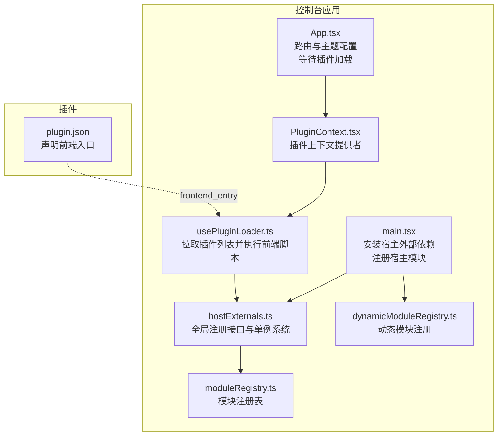
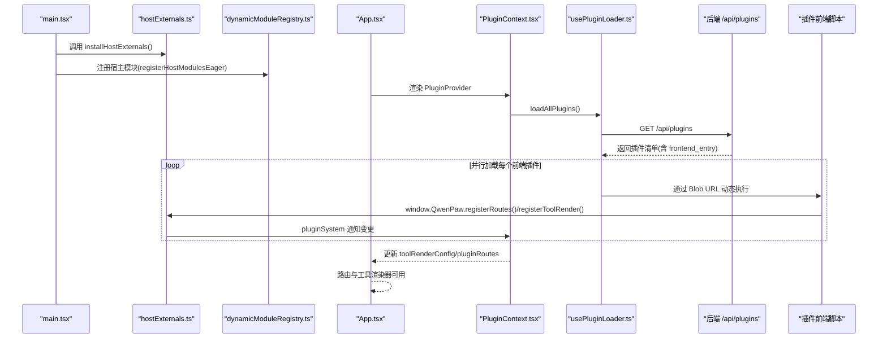
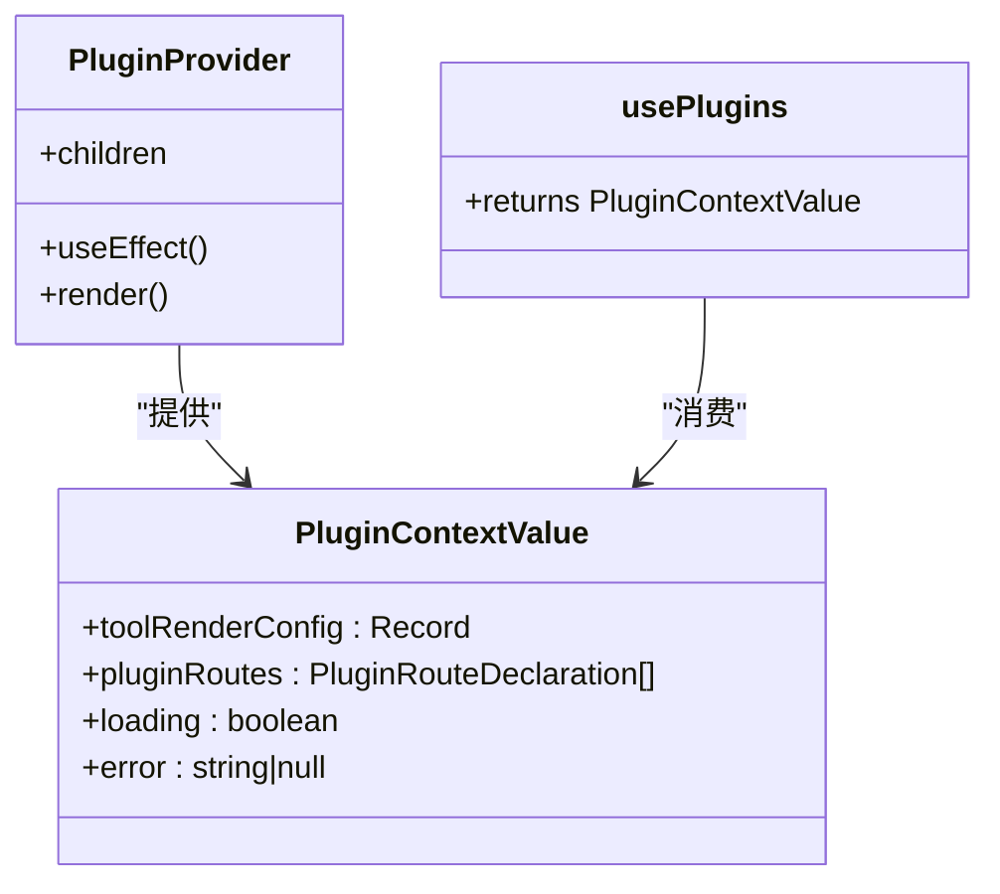
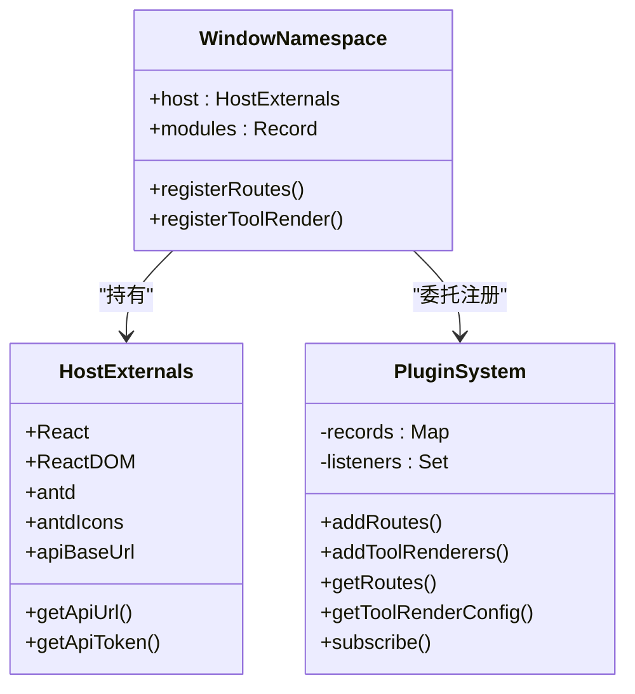
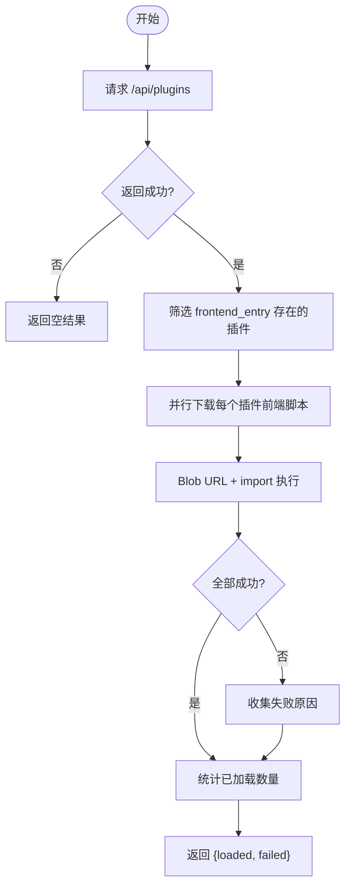
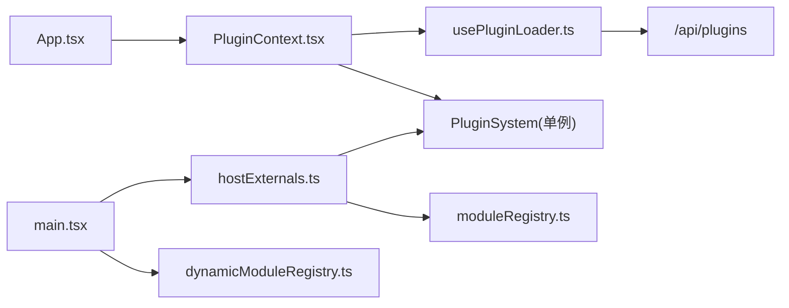

# 前端插件开发

<cite>
**本文引用的文件**
- [console/src/plugins/PluginContext.tsx](file://console/src/plugins/PluginContext.tsx)
- [console/src/plugins/hostExternals.ts](file://console/src/plugins/hostExternals.ts)
- [console/src/plugins/usePluginLoader.ts](file://console/src/plugins/usePluginLoader.ts)
- [console/src/plugins/dynamicModuleRegistry.ts](file://console/src/plugins/dynamicModuleRegistry.ts)
- [console/src/plugins/moduleRegistry.ts](file://console/src/plugins/moduleRegistry.ts)
- [console/src/api/modules/plugin.ts](file://console/src/api/modules/plugin.ts)
- [console/src/main.tsx](file://console/src/main.tsx)
- [console/src/App.tsx](file://console/src/App.tsx)
- [console/vite.config.ts](file://console/vite.config.ts)
- [plugins/tool/gpt-image2/plugin.json](file://plugins/tool/gpt-image2/plugin.json)
- [plugins/tool/qwen-image/plugin.json](file://plugins/tool/qwen-image/plugin.json)
- [plugins/tool/wan27/plugin.json](file://plugins/tool/wan27/plugin.json)
</cite>

## 目录
1. [简介](#简介)
2. [项目结构](#项目结构)
3. [核心组件](#核心组件)
4. [架构总览](#架构总览)
5. [详细组件分析](#详细组件分析)
6. [依赖关系分析](#依赖关系分析)
7. [性能考量](#性能考量)
8. [故障排查指南](#故障排查指南)
9. [结论](#结论)
10. [附录](#附录)

## 简介
本指南面向希望为 QwenPaw Web 控制台开发前端插件的开发者。内容涵盖插件在控制台中的作用、动态加载机制、打包与分发、JavaScript 模块组织与资源管理、自定义 UI 组件与页面的开发示例、插件上下文（PluginContext）的使用方法、组件间通信机制、样式集成与主题适配、响应式设计最佳实践，以及调试与性能优化建议。

## 项目结构
QwenPaw 的前端控制台采用 React + Vite 技术栈，插件系统通过“宿主外部依赖注入 + 运行时注册 + 动态模块发现”的方式实现。核心位置如下：
- 插件运行时与上下文：console/src/plugins/*
- 应用入口与初始化：console/src/main.tsx、console/src/App.tsx
- 插件 API 客户端：console/src/api/modules/plugin.ts
- 构建与分包策略：console/vite.config.ts
- 示例插件清单：plugins/tool/*/plugin.json

图表来源
- [console/src/main.tsx:1-41](file://console/src/main.tsx#L1-L41)
- [console/src/App.tsx:123-227](file://console/src/App.tsx#L123-L227)
- [console/src/plugins/PluginContext.tsx:47-96](file://console/src/plugins/PluginContext.tsx#L47-L96)
- [console/src/plugins/usePluginLoader.ts:71-117](file://console/src/plugins/usePluginLoader.ts#L71-L117)
- [console/src/plugins/hostExternals.ts:152-192](file://console/src/plugins/hostExternals.ts#L152-L192)
- [console/src/plugins/moduleRegistry.ts:39-138](file://console/src/plugins/moduleRegistry.ts#L39-L138)
- [console/src/plugins/dynamicModuleRegistry.ts:22-117](file://console/src/plugins/dynamicModuleRegistry.ts#L22-L117)

章节来源
- [console/src/main.tsx:1-41](file://console/src/main.tsx#L1-L41)
- [console/src/App.tsx:123-227](file://console/src/App.tsx#L123-L227)
- [console/vite.config.ts:17-167](file://console/vite.config.ts#L17-L167)

## 核心组件
- 插件上下文与提供者：通过 PluginContext 提供 toolRenderConfig、pluginRoutes、loading、error 等状态，供任意子组件消费。
- 宿主外部依赖注入：installHostExternals 将 React、ReactDOM、antd、图标库、API 辅助函数等暴露到 window.QwenPaw.host，供插件共享，避免重复打包。
- 插件系统单例：PluginSystem 是全局可订阅的注册中心，负责聚合各插件注册的路由与工具渲染器。
- 插件加载器：loadAllPlugins 拉取后端插件清单，按需下载前端脚本并通过 Blob URL 执行，实现热加载与隔离失败。
- 模块注册表：moduleRegistry 提供安全的模块注册与访问，window.QwenPaw.modules 暴露给插件以进行宿主模块的猴子补丁。
- 动态模块注册：基于 Vite import.meta.glob 自动扫描 src/pages 下的页面模块，排除测试文件，支持懒加载与预加载两种模式。
- 插件 API 客户端：封装 /api/plugins 的查询、安装、上传、卸载、状态查询等接口，用于控制台侧的插件管理。

章节来源
- [console/src/plugins/PluginContext.tsx:20-96](file://console/src/plugins/PluginContext.tsx#L20-L96)
- [console/src/plugins/hostExternals.ts:23-192](file://console/src/plugins/hostExternals.ts#L23-L192)
- [console/src/plugins/usePluginLoader.ts:17-117](file://console/src/plugins/usePluginLoader.ts#L17-L117)
- [console/src/plugins/moduleRegistry.ts:12-138](file://console/src/plugins/moduleRegistry.ts#L12-L138)
- [console/src/plugins/dynamicModuleRegistry.ts:16-117](file://console/src/plugins/dynamicModuleRegistry.ts#L16-L117)
- [console/src/api/modules/plugin.ts:16-140](file://console/src/api/modules/plugin.ts#L16-L140)

## 架构总览
下图展示了从应用启动到插件动态加载与注册的关键流程：

图表来源
- [console/src/main.tsx:4-13](file://console/src/main.tsx#L4-L13)
- [console/src/plugins/hostExternals.ts:152-192](file://console/src/plugins/hostExternals.ts#L152-L192)
- [console/src/plugins/dynamicModuleRegistry.ts:79-116](file://console/src/plugins/dynamicModuleRegistry.ts#L79-L116)
- [console/src/App.tsx:166-214](file://console/src/App.tsx#L166-L214)
- [console/src/plugins/PluginContext.tsx:57-80](file://console/src/plugins/PluginContext.tsx#L57-L80)
- [console/src/plugins/usePluginLoader.ts:71-117](file://console/src/plugins/usePluginLoader.ts#L71-L117)

## 详细组件分析

### 插件上下文与消费者 Hook（PluginContext）
- 上下文值包含：
  - toolRenderConfig：工具调用渲染器映射，供聊天或消息区域渲染插件工具输出。
  - pluginRoutes：插件注册的页面路由数组，按 priority 排序，注入到侧边栏与路由表。
  - loading：初始加载完成前为 true。
  - error：任一插件加载失败时的错误信息汇总。
- 提供者职责：
  - 订阅 pluginSystem 的变更，实时同步工具渲染器与路由。
  - 启动时调用 loadAllPlugins，收集失败项并设置 error。
- 消费者 Hook：usePlugins 返回当前上下文值，便于任意组件读取。

图表来源
- [console/src/plugins/PluginContext.tsx:20-96](file://console/src/plugins/PluginContext.tsx#L20-L96)

章节来源
- [console/src/plugins/PluginContext.tsx:20-96](file://console/src/plugins/PluginContext.tsx#L20-L96)

### 宿主外部依赖注入（hostExternals）
- 暴露到 window.QwenPaw.host 的依赖包括 React、ReactDOM、antd、@ant-design/icons、API 基础地址与鉴权辅助函数。
- 在应用启动时调用 installHostExternals 完成注入。
- 通过 window.QwenPaw.registerRoutes 与 window.QwenPaw.registerToolRender 两个回调，供插件脚本注册页面路由与工具渲染器。
- 内部维护 PluginSystem 单例，提供 addRoutes、addToolRenderers、getRoutes、getToolRenderConfig、subscribe 等能力。

图表来源
- [console/src/plugins/hostExternals.ts:23-192](file://console/src/plugins/hostExternals.ts#L23-L192)

章节来源
- [console/src/plugins/hostExternals.ts:23-192](file://console/src/plugins/hostExternals.ts#L23-L192)

### 插件加载器（usePluginLoader）
- 从 /api/plugins 获取插件清单，筛选具有 frontend_entry 的插件。
- 对每个插件通过 resolveUrl 拼接文件路径，携带 Authorization 头抓取脚本源码。
- 使用 Blob URL 包裹脚本并动态 import 执行，执行后立即 revoke URL，确保内存安全。
- Promise.allSettled 并行加载，失败项单独记录，不影响其他插件加载。
- 返回 { loaded, failed } 供上层显示错误摘要。

图表来源
- [console/src/plugins/usePluginLoader.ts:71-117](file://console/src/plugins/usePluginLoader.ts#L71-L117)

章节来源
- [console/src/plugins/usePluginLoader.ts:17-117](file://console/src/plugins/usePluginLoader.ts#L17-L117)

### 动态模块注册（dynamicModuleRegistry）
- 使用 import.meta.glob 动态发现 src/pages 下的页面模块，排除测试文件与类型声明。
- 支持懒加载（eager: false）与预加载（eager: true）两种模式，便于按需与全量加载。
- 将模块键转换为相对路径形式，注册到 moduleRegistry，供后续猴子补丁使用。

章节来源
- [console/src/plugins/dynamicModuleRegistry.ts:16-117](file://console/src/plugins/dynamicModuleRegistry.ts#L16-L117)

### 模块注册表（moduleRegistry）
- 提供 register、get、call、keys、getModule、getAllModules 等方法。
- 通过 Proxy 暴露 window.QwenPaw.modules，插件可通过该命名空间访问与修改宿主模块导出。
- 注册时仅复制可枚举自有属性，避免 ES 模块命名空间特殊属性带来的副作用。

章节来源
- [console/src/plugins/moduleRegistry.ts:12-138](file://console/src/plugins/moduleRegistry.ts#L12-L138)

### 应用入口与初始化（main.tsx）
- 调用 installHostExternals，向 window 注入宿主依赖。
- 调用 registerHostModulesEager，自动注册所有页面模块。
- 屏蔽部分控制台警告，减少噪音。

章节来源
- [console/src/main.tsx:1-41](file://console/src/main.tsx#L1-L41)

### 应用渲染与路由（App.tsx）
- 在 PluginProvider 包裹下渲染，等待插件加载完成后再挂载路由，避免路由与组件被插件猴子补丁影响。
- 集成主题、国际化、语言切换与 dayjs 国际化。
- 通过 ConfigProvider 设置 Ant Design 主题与前缀，统一风格。

章节来源
- [console/src/App.tsx:123-227](file://console/src/App.tsx#L123-L227)

### 构建与分包策略（vite.config.ts）
- define 中注入 API 基础地址与环境变量。
- CSS Modules 与 Less 配置，保证样式隔离与主题变量生效。
- 通过 manualChunks 将 React、Ant Design、AgentScope 设计体系、Markdown、拖拽、工具库等拆分为独立 vendor chunk，提升缓存命中与加载效率。
- 测试别名与覆盖，避免大型依赖导致测试卡顿。

章节来源
- [console/vite.config.ts:17-167](file://console/vite.config.ts#L17-L167)

### 插件清单与前端入口（plugin.json）
- 前端插件通过 plugin.json 的 frontend_entry 字段声明前端脚本入口。
- 控制台根据该字段拉取并执行插件前端脚本，实现动态注册。

章节来源
- [plugins/tool/gpt-image2/plugin.json:1-89](file://plugins/tool/gpt-image2/plugin.json#L1-L89)
- [plugins/tool/qwen-image/plugin.json:1-129](file://plugins/tool/qwen-image/plugin.json#L1-L129)
- [plugins/tool/wan27/plugin.json:1-122](file://plugins/tool/wan27/plugin.json#L1-L122)

## 依赖关系分析
- 入口依赖：main.tsx 依赖 hostExternals 与 dynamicModuleRegistry；App.tsx 依赖 PluginContext。
- 插件加载：PluginContext 依赖 usePluginLoader；usePluginLoader 依赖后端 /api/plugins。
- 注册中心：hostExternals 暴露注册接口，PluginSystem 聚合各插件注册项；PluginContext 订阅 PluginSystem。
- 模块系统：moduleRegistry 作为中间层，window.QwenPaw.modules 作为插件访问宿主模块的桥接。

图表来源
- [console/src/main.tsx:4-13](file://console/src/main.tsx#L4-L13)
- [console/src/App.tsx:27-28](file://console/src/App.tsx#L27-L28)
- [console/src/plugins/PluginContext.tsx:57-80](file://console/src/plugins/PluginContext.tsx#L57-L80)
- [console/src/plugins/usePluginLoader.ts:71-117](file://console/src/plugins/usePluginLoader.ts#L71-L117)
- [console/src/plugins/hostExternals.ts:152-192](file://console/src/plugins/hostExternals.ts#L152-L192)
- [console/src/plugins/moduleRegistry.ts:120-138](file://console/src/plugins/moduleRegistry.ts#L120-L138)

章节来源
- [console/src/main.tsx:1-41](file://console/src/main.tsx#L1-L41)
- [console/src/App.tsx:123-227](file://console/src/App.tsx#L123-L227)
- [console/src/plugins/PluginContext.tsx:47-96](file://console/src/plugins/PluginContext.tsx#L47-L96)
- [console/src/plugins/usePluginLoader.ts:71-117](file://console/src/plugins/usePluginLoader.ts#L71-L117)
- [console/src/plugins/hostExternals.ts:152-192](file://console/src/plugins/hostExternals.ts#L152-L192)
- [console/src/plugins/moduleRegistry.ts:120-138](file://console/src/plugins/moduleRegistry.ts#L120-L138)

## 性能考量
- 分包与缓存
  - 利用 Vite manualChunks 将 React、Ant Design、AgentScope 设计体系、Markdown、拖拽、工具库等拆分为独立 vendor chunk，提升浏览器缓存命中率。
  - 构建时开启 CSS 代码分割，减小首屏体积。
- 动态加载
  - 插件前端脚本通过 Blob URL 动态执行，避免打包进主包；并行加载多个插件，缩短整体加载时间。
  - 页面模块支持懒加载与预加载两种模式，按需选择。
- 资源与样式
  - CSS Modules 与 Less 配置确保样式隔离；主题通过 ConfigProvider 注入，避免全局污染。
- 运行时优化
  - 插件加载失败采用 Promise.allSettled，单个失败不影响其他插件；加载完成后才渲染路由，避免重排与二次渲染。
- 构建参数
  - 开发环境启用 Source Map，生产环境按需生成；chunkSizeWarningLimit 调整以监控大包风险。

章节来源
- [console/vite.config.ts:99-167](file://console/vite.config.ts#L99-L167)
- [console/src/plugins/usePluginLoader.ts:95-116](file://console/src/plugins/usePluginLoader.ts#L95-L116)
- [console/src/plugins/dynamicModuleRegistry.ts:79-116](file://console/src/plugins/dynamicModuleRegistry.ts#L79-L116)
- [console/src/App.tsx:166-214](file://console/src/App.tsx#L166-L214)

## 故障排查指南
- 插件未显示
  - 检查后端是否返回插件清单且包含 frontend_entry。
  - 确认插件前端脚本可被正确下载与执行（网络与鉴权头）。
  - 查看控制台错误日志中是否有 Blob URL 执行失败或注册接口未被调用。
- 注册接口未生效
  - 确认插件前端脚本在执行时调用了 window.QwenPaw.registerRoutes/registerToolRender。
  - 检查 PluginSystem 是否收到变更通知，PluginContext 是否重新渲染。
- 模块猴子补丁无效
  - 确认 window.QwenPaw.modules 可用且模块键正确。
  - 检查 moduleRegistry 的 register/get/call 行为是否符合预期。
- 加载失败
  - 观察 loadAllPlugins 返回的 failed 数组，定位具体插件 ID 与错误信息。
  - 检查 /api/plugins/status 获取插件运行时状态。
- 路由冲突或顺序问题
  - 检查插件注册时的 priority 字段，确认排序逻辑符合预期。

章节来源
- [console/src/plugins/usePluginLoader.ts:71-117](file://console/src/plugins/usePluginLoader.ts#L71-L117)
- [console/src/plugins/hostExternals.ts:172-190](file://console/src/plugins/hostExternals.ts#L172-L190)
- [console/src/api/modules/plugin.ts:126-140](file://console/src/api/modules/plugin.ts#L126-L140)

## 结论
QwenPaw 的前端插件系统通过“宿主外部依赖共享 + 运行时注册 + 动态模块发现 + 并行动态加载”的架构，在保证插件隔离与热更新的同时，兼顾了性能与可维护性。开发者只需在插件清单中声明前端入口，即可通过标准接口注册页面路由与工具渲染器，并借助模块注册表实现对宿主模块的猴子补丁。配合完善的构建分包策略与调试手段，可快速构建高质量的前端插件生态。

## 附录

### 开发示例：创建自定义 UI 组件与页面
- 准备工作
  - 在插件目录编写前端脚本，声明 window.QwenPaw.registerRoutes 与 window.QwenPaw.registerToolRender 的调用。
  - 在插件清单 plugin.json 中设置 frontend_entry 指向该脚本。
- 注册页面路由
  - 使用 PluginRouteDeclaration 类型描述 path、component、label、icon、priority 等字段。
  - 在插件脚本中调用 window.QwenPaw.registerRoutes 注册。
- 注册工具渲染器
  - 以工具名称为键，提供一个 React 组件作为渲染器，调用 window.QwenPaw.registerToolRender 注册。
- 在控制台中使用
  - 控制台启动时会加载插件脚本，注册的路由与渲染器将通过 PluginContext 暴露给应用。

章节来源
- [console/src/plugins/hostExternals.ts:34-76](file://console/src/plugins/hostExternals.ts#L34-L76)
- [console/src/plugins/PluginContext.tsx:20-29](file://console/src/plugins/PluginContext.tsx#L20-L29)
- [plugins/tool/gpt-image2/plugin.json:1-89](file://plugins/tool/gpt-image2/plugin.json#L1-L89)

### 插件上下文（PluginContext）使用方法
- 在应用根节点包裹 PluginProvider。
- 在任意子组件中调用 usePlugins 获取 toolRenderConfig、pluginRoutes、loading、error。
- 根据 loading 状态决定是否渲染路由与页面，避免插件尚未就绪导致的异常。

章节来源
- [console/src/plugins/PluginContext.tsx:47-96](file://console/src/plugins/PluginContext.tsx#L47-L96)
- [console/src/App.tsx:166-214](file://console/src/App.tsx#L166-L214)

### 组件间通信机制
- 工具渲染器通过 toolRenderConfig 与外部组件解耦，渲染器内部可使用宿主依赖（由 hostExternals 注入）。
- 插件可通过 moduleRegistry 访问宿主模块，实现跨模块通信与扩展。

章节来源
- [console/src/plugins/hostExternals.ts:23-32](file://console/src/plugins/hostExternals.ts#L23-L32)
- [console/src/plugins/moduleRegistry.ts:120-138](file://console/src/plugins/moduleRegistry.ts#L120-L138)

### 样式集成、主题适配与响应式设计最佳实践
- 样式集成
  - 使用 CSS Modules 与 Less，确保样式隔离与主题变量生效。
  - 通过 ConfigProvider 设置 Ant Design 主题与前缀，保持一致的设计语言。
- 主题适配
  - 使用 ThemeProvider 与 useTheme 切换明暗主题，结合 Ant Design 的 darkAlgorithm。
- 响应式设计
  - 基于 Ant Design 的栅格与布局组件，结合媒体查询与弹性布局实现多端适配。

章节来源
- [console/src/App.tsx:174-188](file://console/src/App.tsx#L174-L188)
- [console/vite.config.ts:30-40](file://console/vite.config.ts#L30-L40)

### 调试工具与性能优化建议
- 调试工具
  - 在 main.tsx 中屏蔽特定控制台警告，聚焦关键日志。
  - 使用浏览器开发者工具检查网络面板中的插件脚本下载与执行情况。
  - 通过控制台日志观察插件注册与失败信息。
- 性能优化
  - 合理拆分 vendor chunk，避免单个包过大。
  - 使用懒加载与预加载策略，平衡首屏与交互体验。
  - 关注 chunkSizeWarningLimit，及时发现超大模块。

章节来源
- [console/src/main.tsx:15-38](file://console/src/main.tsx#L15-L38)
- [console/vite.config.ts:107-167](file://console/vite.config.ts#L107-L167)