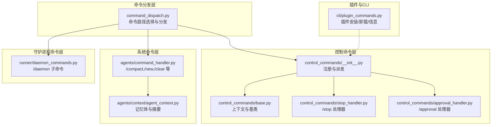
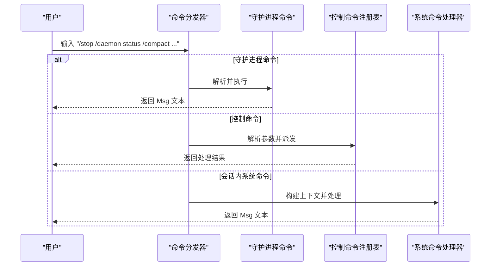
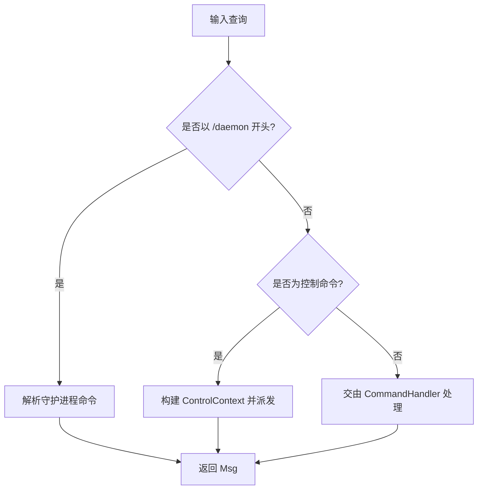
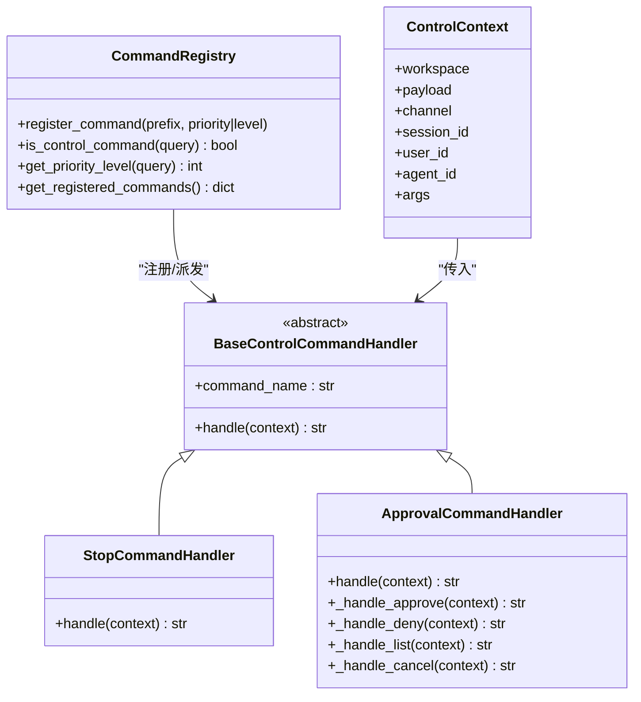
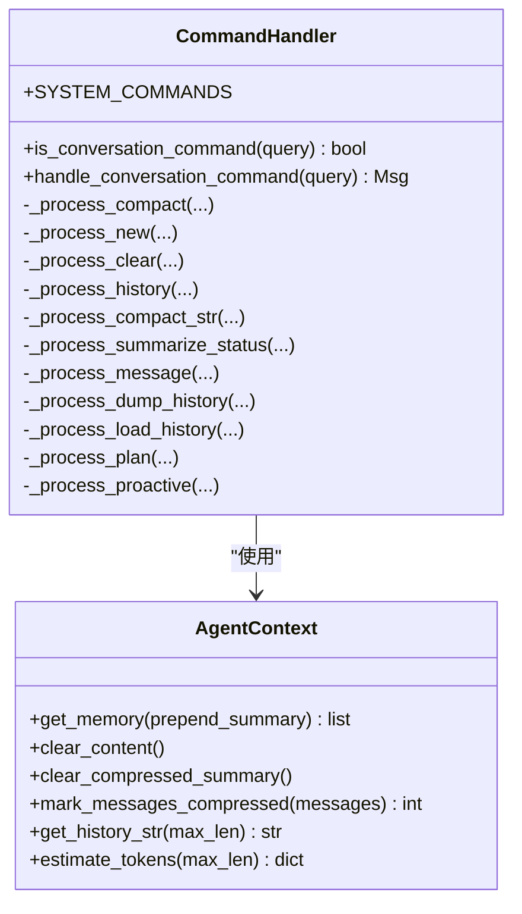
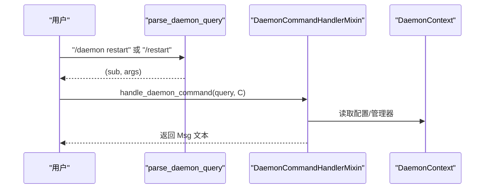
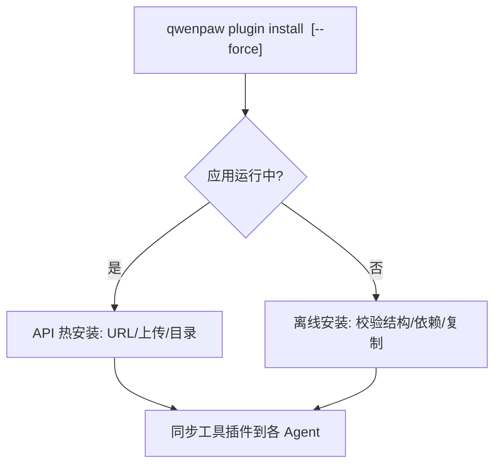
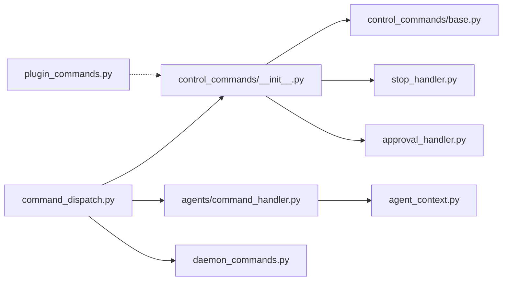

# 命令插件开发

<cite>
**本文引用的文件**
- [src/qwenpaw/app/runner/command_dispatch.py](file://src/qwenpaw/app/runner/command_dispatch.py)
- [src/qwenpaw/agents/command_handler.py](file://src/qwenpaw/agents/command_handler.py)
- [src/qwenpaw/app/channels/command_registry.py](file://src/qwenpaw/app/channels/command_registry.py)
- [src/qwenpaw/app/runner/control_commands/__init__.py](file://src/qwenpaw/app/runner/control_commands/__init__.py)
- [src/qwenpaw/app/runner/control_commands/base.py](file://src/qwenpaw/app/runner/control_commands/base.py)
- [src/qwenpaw/app/runner/control_commands/stop_handler.py](file://src/qwenpaw/app/runner/control_commands/stop_handler.py)
- [src/qwenpaw/app/runner/control_commands/approval_handler.py](file://src/qwenpaw/app/runner/control_commands/approval_handler.py)
- [src/qwenpaw/app/runner/daemon_commands.py](file://src/qwenpaw/app/runner/daemon_commands.py)
- [src/qwenpaw/agents/context/agent_context.py](file://src/qwenpaw/agents/context/agent_context.py)
- [src/qwenpaw/cli/plugin_commands.py](file://src/qwenpaw/cli/plugin_commands.py)
- [tests/unit/agents/test_command_handler.py](file://tests/unit/agents/test_command_handler.py)
- [tests/unit/utils/test_command_runner.py](file://tests/unit/utils/test_command_runner.py)
</cite>

## 目录
1. [简介](#简介)
2. [项目结构](#项目结构)
3. [核心组件](#核心组件)
4. [架构总览](#架构总览)
5. [详细组件分析](#详细组件分析)
6. [依赖分析](#依赖分析)
7. [性能考虑](#性能考虑)
8. [故障排查指南](#故障排查指南)
9. [结论](#结论)
10. [附录](#附录)

## 简介
本指南面向希望在 QwenPaw 控制命令系统中开发“命令插件”的开发者。命令插件用于扩展系统对控制命令（如 /stop、/approval）与会话内系统命令（如 /compact、/new）的识别、路由与处理能力。文档将从系统架构入手，详解命令注册与路由机制、命令处理器实现模式、参数解析与验证、权限控制、执行上下文与结果返回，并提供测试策略与用户体验优化建议。

## 项目结构
围绕命令系统的关键模块如下：
- 命令分发与路由：负责识别命令类型（守护进程、控制、会话内系统命令），并将其路由到对应处理器。
- 控制命令模块：集中注册与派发高优先级命令（如 /stop、/approval），支持参数解析与权限校验。
- 会话内系统命令处理器：处理对话上下文相关的系统命令（如 /compact、/new、/clear 等）。
- 守护进程命令：提供状态查询、重启、配置重载、日志查看等运维能力。
- 插件安装与热加载：通过 CLI 提供插件安装、上传与卸载能力，支持运行时热加载。

**图表来源**
- [src/qwenpaw/app/runner/command_dispatch.py:87-333](file://src/qwenpaw/app/runner/command_dispatch.py#L87-L333)
- [src/qwenpaw/app/runner/control_commands/__init__.py:1-258](file://src/qwenpaw/app/runner/control_commands/__init__.py#L1-L258)
- [src/qwenpaw/app/runner/control_commands/base.py:1-72](file://src/qwenpaw/app/runner/control_commands/base.py#L1-L72)
- [src/qwenpaw/app/runner/control_commands/stop_handler.py:1-103](file://src/qwenpaw/app/runner/control_commands/stop_handler.py#L1-L103)
- [src/qwenpaw/app/runner/control_commands/approval_handler.py:1-367](file://src/qwenpaw/app/runner/control_commands/approval_handler.py#L1-L367)
- [src/qwenpaw/agents/command_handler.py:1-748](file://src/qwenpaw/agents/command_handler.py#L1-L748)
- [src/qwenpaw/agents/context/agent_context.py:1-356](file://src/qwenpaw/agents/context/agent_context.py#L1-L356)
- [src/qwenpaw/app/runner/daemon_commands.py:1-269](file://src/qwenpaw/app/runner/daemon_commands.py#L1-L269)
- [src/qwenpaw/cli/plugin_commands.py:1-919](file://src/qwenpaw/cli/plugin_commands.py#L1-L919)

**章节来源**
- [src/qwenpaw/app/runner/command_dispatch.py:87-333](file://src/qwenpaw/app/runner/command_dispatch.py#L87-L333)
- [src/qwenpaw/app/runner/control_commands/__init__.py:1-258](file://src/qwenpaw/app/runner/control_commands/__init__.py#L1-L258)
- [src/qwenpaw/agents/command_handler.py:1-748](file://src/qwenpaw/agents/command_handler.py#L1-L748)
- [src/qwenpaw/app/runner/daemon_commands.py:1-269](file://src/qwenpaw/app/runner/daemon_commands.py#L1-L269)
- [src/qwenpaw/cli/plugin_commands.py:1-919](file://src/qwenpaw/cli/plugin_commands.py#L1-L919)

## 核心组件
- 命令分发器：根据输入字符串判断命令类型，优先处理守护进程命令，其次控制命令，最后会话内系统命令；并构建执行上下文、调用相应处理器，产出统一的消息格式。
- 控制命令注册与派发：提供命令名到处理器实例的全局注册表，支持参数解析、权限校验与错误处理。
- 会话内系统命令处理器：基于 AgentContext 的记忆体与摘要，实现压缩、新建会话、清空历史、查看历史、消息索引、摘要查看、历史导出/导入、计划状态等功能。
- 守护进程命令：提供状态、重启、配置重载、版本、日志等运维命令，支持短别名与参数解析。
- 插件安装与热加载：支持本地目录、URL、ZIP 包安装，运行时通过 API 热加载，兼容依赖安装与工具插件同步。

**章节来源**
- [src/qwenpaw/app/runner/command_dispatch.py:87-333](file://src/qwenpaw/app/runner/command_dispatch.py#L87-L333)
- [src/qwenpaw/app/runner/control_commands/__init__.py:1-258](file://src/qwenpaw/app/runner/control_commands/__init__.py#L1-L258)
- [src/qwenpaw/agents/command_handler.py:1-748](file://src/qwenpaw/agents/command_handler.py#L1-L748)
- [src/qwenpaw/app/runner/daemon_commands.py:1-269](file://src/qwenpaw/app/runner/daemon_commands.py#L1-L269)
- [src/qwenpaw/cli/plugin_commands.py:1-919](file://src/qwenpaw/cli/plugin_commands.py#L1-L919)

## 架构总览
命令系统采用“分层+注册表”的设计：
- 命令识别：先尝试解析为守护进程命令，再检查是否为控制命令，最后判定为会话内系统命令。
- 路由与上下文：控制命令通过注册表派发到具体处理器；会话内命令通过 CommandHandler 与 AgentContext 协作。
- 结果统一：所有命令均以 Msg 形式返回，便于前端渲染与流式输出。

**图表来源**
- [src/qwenpaw/app/runner/command_dispatch.py:87-333](file://src/qwenpaw/app/runner/command_dispatch.py#L87-L333)
- [src/qwenpaw/app/runner/daemon_commands.py:194-269](file://src/qwenpaw/app/runner/daemon_commands.py#L194-L269)
- [src/qwenpaw/app/runner/control_commands/__init__.py:199-237](file://src/qwenpaw/app/runner/control_commands/__init__.py#L199-L237)
- [src/qwenpaw/agents/command_handler.py:530-560](file://src/qwenpaw/agents/command_handler.py#L530-L560)

## 详细组件分析

### 命令分发与路由机制
- 命令类型判定：
  - 守护进程命令：以 “/daemon” 开头或短别名（如 /restart），支持 status、restart、reload-config、version、logs。
  - 控制命令：通过 CommandRegistry 判定是否为已注册的控制命令（如 /stop、/approval、/status 等）。
  - 会话内系统命令：以 “/” 开头但不在控制命令注册表中的命令，交由 CommandHandler 处理（如 /compact、/new、/clear 等）。
- 上下文构建：控制命令路径中，从请求中提取 session_id、user_id、channel，并注入到 ControlContext。
- 结果统一：所有命令最终以 Msg 返回，包含文本内容与可选元数据（如 clear_plan、clear_history）。

**图表来源**
- [src/qwenpaw/app/runner/command_dispatch.py:87-333](file://src/qwenpaw/app/runner/command_dispatch.py#L87-L333)
- [src/qwenpaw/app/runner/daemon_commands.py:194-220](file://src/qwenpaw/app/runner/daemon_commands.py#L194-L220)
- [src/qwenpaw/app/channels/command_registry.py:140-178](file://src/qwenpaw/app/channels/command_registry.py#L140-L178)

**章节来源**
- [src/qwenpaw/app/runner/command_dispatch.py:87-333](file://src/qwenpaw/app/runner/command_dispatch.py#L87-L333)
- [src/qwenpaw/app/runner/daemon_commands.py:194-269](file://src/qwenpaw/app/runner/daemon_commands.py#L194-L269)
- [src/qwenpaw/app/channels/command_registry.py:140-222](file://src/qwenpaw/app/channels/command_registry.py#L140-L222)

### 控制命令注册与派发
- 注册表：CommandRegistry 支持按名称（critical/high/normal/low）或数值级别注册命令前缀，提供快速匹配与优先级查询。
- 默认注册：内置 /stop、/status、/restart、/reload-config、/version、/logs、/approve、/deny、/approval 等。
- 参数解析：parse_args 支持键值对与特殊命令（如 /approval）的多参数解析。
- 权限与上下文：ControlContext 携带 workspace、channel、session_id、user_id、agent_id、args 等，处理器据此进行权限校验与执行。

**图表来源**
- [src/qwenpaw/app/channels/command_registry.py:23-291](file://src/qwenpaw/app/channels/command_registry.py#L23-L291)
- [src/qwenpaw/app/runner/control_commands/base.py:19-72](file://src/qwenpaw/app/runner/control_commands/base.py#L19-L72)
- [src/qwenpaw/app/runner/control_commands/stop_handler.py:16-103](file://src/qwenpaw/app/runner/control_commands/stop_handler.py#L16-L103)
- [src/qwenpaw/app/runner/control_commands/approval_handler.py:20-367](file://src/qwenpaw/app/runner/control_commands/approval_handler.py#L20-L367)

**章节来源**
- [src/qwenpaw/app/channels/command_registry.py:1-291](file://src/qwenpaw/app/channels/command_registry.py#L1-L291)
- [src/qwenpaw/app/runner/control_commands/__init__.py:1-258](file://src/qwenpaw/app/runner/control_commands/__init__.py#L1-L258)
- [src/qwenpaw/app/runner/control_commands/base.py:1-72](file://src/qwenpaw/app/runner/control_commands/base.py#L1-L72)
- [src/qwenpaw/app/runner/control_commands/stop_handler.py:1-103](file://src/qwenpaw/app/runner/control_commands/stop_handler.py#L1-L103)
- [src/qwenpaw/app/runner/control_commands/approval_handler.py:1-367](file://src/qwenpaw/app/runner/control_commands/approval_handler.py#L1-L367)

### 会话内系统命令处理器
- 支持命令集合：compact、new、clear、history、compact_str、summarize_status、message、dump_history、load_history、proactive、plan。
- 处理流程：CommandHandler 从 AgentContext 获取消息列表，解析命令与参数，调用对应私有处理函数，最终构造 Msg 返回。
- 记忆体与摘要：AgentContext 提供压缩摘要、清理内容、持久化对话、估算 token 等能力，为命令处理提供基础。

**图表来源**
- [src/qwenpaw/agents/command_handler.py:30-748](file://src/qwenpaw/agents/command_handler.py#L30-L748)
- [src/qwenpaw/agents/context/agent_context.py:23-356](file://src/qwenpaw/agents/context/agent_context.py#L23-L356)

**章节来源**
- [src/qwenpaw/agents/command_handler.py:1-748](file://src/qwenpaw/agents/command_handler.py#L1-L748)
- [src/qwenpaw/agents/context/agent_context.py:1-356](file://src/qwenpaw/agents/context/agent_context.py#L1-L356)

### 守护进程命令
- 子命令：status、restart、reload-config、version、logs。
- 短别名：/restart、/status、/reload-config、/reload_config、/version、/logs。
- 解析逻辑：parse_daemon_query 将 “/daemon ” 或短别名解析为子命令与参数。
- 执行上下文：DaemonContext 提供工作目录、配置加载函数、内存/上下文管理器、Agent 管理器等。

**图表来源**
- [src/qwenpaw/app/runner/daemon_commands.py:194-269](file://src/qwenpaw/app/runner/daemon_commands.py#L194-L269)

**章节来源**
- [src/qwenpaw/app/runner/daemon_commands.py:1-269](file://src/qwenpaw/app/runner/daemon_commands.py#L1-L269)

### 插件安装与热加载（CLI）
- 支持来源：本地目录、URL、ZIP 文件；运行时通过 API 热加载，无需重启。
- 依赖安装：优先使用 pip，若缺失则尝试 uv；失败时清理目标目录并提示手动安装。
- 工具插件同步：对工具型插件自动同步到所有 Agent 的内置工具配置。

**图表来源**
- [src/qwenpaw/cli/plugin_commands.py:500-670](file://src/qwenpaw/cli/plugin_commands.py#L500-L670)

**章节来源**
- [src/qwenpaw/cli/plugin_commands.py:1-919](file://src/qwenpaw/cli/plugin_commands.py#L1-L919)

## 依赖分析
- 命令分发依赖控制命令注册表与系统命令处理器；控制命令依赖上下文与工作区服务；系统命令依赖记忆体与摘要功能；守护进程命令依赖配置与日志路径。
- 插件 CLI 依赖运行态 API、网络请求与文件系统操作。

**图表来源**
- [src/qwenpaw/app/runner/command_dispatch.py:18-31](file://src/qwenpaw/app/runner/command_dispatch.py#L18-L31)
- [src/qwenpaw/app/runner/control_commands/__init__.py:22-31](file://src/qwenpaw/app/runner/control_commands/__init__.py#L22-L31)
- [src/qwenpaw/agents/command_handler.py:18-20](file://src/qwenpaw/agents/command_handler.py#L18-L20)
- [src/qwenpaw/app/runner/daemon_commands.py:18-24](file://src/qwenpaw/app/runner/daemon_commands.py#L18-L24)
- [src/qwenpaw/cli/plugin_commands.py:34-41](file://src/qwenpaw/cli/plugin_commands.py#L34-L41)

**章节来源**
- [src/qwenpaw/app/runner/command_dispatch.py:1-333](file://src/qwenpaw/app/runner/command_dispatch.py#L1-L333)
- [src/qwenpaw/app/runner/control_commands/__init__.py:1-258](file://src/qwenpaw/app/runner/control_commands/__init__.py#L1-L258)
- [src/qwenpaw/agents/command_handler.py:1-748](file://src/qwenpaw/agents/command_handler.py#L1-L748)
- [src/qwenpaw/app/runner/daemon_commands.py:1-269](file://src/qwenpaw/app/runner/daemon_commands.py#L1-L269)
- [src/qwenpaw/cli/plugin_commands.py:1-919](file://src/qwenpaw/cli/plugin_commands.py#L1-L919)

## 性能考虑
- 命令识别与解析：控制命令注册表使用字典与前缀排序，查找复杂度为 O(1)，适合高频调用。
- 会话内命令：避免在大历史长度场景下重复计算 token，建议配合摘要与分页显示。
- 守护进程命令：日志尾读限制最大字节数，避免大文件导致内存压力。
- 插件安装：离线安装时仅复制必要文件，依赖安装失败回滚清理，减少磁盘占用。

[本节为通用指导，无需特定文件引用]

## 故障排查指南
- 控制命令失败：检查 is_control_command 与 parse_args 是否正确；确认处理器是否在注册表中；查看日志异常堆栈。
- 系统命令异常：确认 CommandHandler 的 SYSTEM_COMMANDS 与参数解析；检查 AgentContext 的记忆体状态与摘要。
- 守护进程命令：确认 DaemonContext 的配置加载函数与管理器可用性；检查日志路径是否存在。
- 插件安装失败：核对 plugin.json 结构与必填字段；检查依赖安装日志；确认 API 可达与权限。

**章节来源**
- [src/qwenpaw/app/runner/control_commands/__init__.py:199-237](file://src/qwenpaw/app/runner/control_commands/__init__.py#L199-L237)
- [src/qwenpaw/agents/command_handler.py:530-560](file://src/qwenpaw/agents/command_handler.py#L530-L560)
- [src/qwenpaw/app/runner/daemon_commands.py:101-192](file://src/qwenpaw/app/runner/daemon_commands.py#L101-L192)
- [src/qwenpaw/cli/plugin_commands.py:520-546](file://src/qwenpaw/cli/plugin_commands.py#L520-L546)

## 结论
QwenPaw 的命令系统通过清晰的分层与注册机制，实现了对守护进程命令、控制命令与会话内系统命令的统一处理。开发者可基于 ControlContext 与 CommandRegistry 快速扩展新的控制命令，结合 CommandHandler 与 AgentContext 实现会话内系统命令。配合 CLI 插件管理能力，可在运行时热加载新功能，提升可观测性与可维护性。

[本节为总结，无需特定文件引用]

## 附录

### 开发示例：创建自定义控制命令
- 定义处理器类：继承 BaseControlCommandHandler，设置 command_name，实现 handle(context)。
- 注册命令：调用 register_command(handler) 将处理器加入全局注册表。
- 参数解析：利用 parse_args 对 query 进行键值对或特殊命令解析。
- 权限控制：在 handle 中读取 ControlContext 的 agent_id、session_id、user_id 进行校验。
- 结果返回：返回 Markdown 格式的字符串，或抛出异常由框架捕获并格式化。

**章节来源**
- [src/qwenpaw/app/runner/control_commands/base.py:42-72](file://src/qwenpaw/app/runner/control_commands/base.py#L42-L72)
- [src/qwenpaw/app/runner/control_commands/__init__.py:48-99](file://src/qwenpaw/app/runner/control_commands/__init__.py#L48-L99)
- [src/qwenpaw/app/runner/control_commands/__init__.py:130-197](file://src/qwenpaw/app/runner/control_commands/__init__.py#L130-L197)

### 命令处理器实现模式
- 控制命令：强上下文依赖，需严格权限校验与错误处理。
- 会话内系统命令：弱耦合，主要依赖 AgentContext 的记忆体与摘要。
- 守护进程命令：独立于会话，依赖配置与系统资源。

**章节来源**
- [src/qwenpaw/app/runner/control_commands/stop_handler.py:32-103](file://src/qwenpaw/app/runner/control_commands/stop_handler.py#L32-L103)
- [src/qwenpaw/agents/command_handler.py:530-560](file://src/qwenpaw/agents/command_handler.py#L530-L560)
- [src/qwenpaw/app/runner/daemon_commands.py:230-269](file://src/qwenpaw/app/runner/daemon_commands.py#L230-L269)

### 参数解析与验证方法
- 键值对解析：支持 key=value 形式，保留原始参数以便复杂命令处理。
- 特殊命令解析：/approval 支持 approve/deny/list/cancel 与标志位（如 --all/-a）。
- 类型与范围校验：在处理器内部对参数进行类型转换与边界检查，失败时返回明确错误信息。

**章节来源**
- [src/qwenpaw/app/runner/control_commands/__init__.py:130-197](file://src/qwenpaw/app/runner/control_commands/__init__.py#L130-L197)

### 权限控制、执行上下文与结果返回
- 权限控制：通过 ControlContext 的 agent_id、session_id、user_id 进行校验，拒绝越权操作。
- 执行上下文：包含 workspace、channel、payload、args 等，满足不同命令的执行需求。
- 结果返回：统一为 Msg 文本，支持元数据（如 clear_plan、clear_history）传递额外状态。

**章节来源**
- [src/qwenpaw/app/runner/control_commands/base.py:19-40](file://src/qwenpaw/app/runner/control_commands/base.py#L19-L40)
- [src/qwenpaw/app/runner/control_commands/stop_handler.py:41-103](file://src/qwenpaw/app/runner/control_commands/stop_handler.py#L41-L103)
- [src/qwenpaw/agents/command_handler.py:530-560](file://src/qwenpaw/agents/command_handler.py#L530-L560)

### 测试策略
- 单元测试：针对 CommandHandler 的命令处理逻辑与 AgentContext 的记忆体操作进行断言。
- 异步命令执行：对命令运行器的异步进程启动、优雅关闭、信号处理进行覆盖。
- 集成测试：模拟控制命令注册与派发、参数解析与权限校验流程。

**章节来源**
- [tests/unit/agents/test_command_handler.py:1-33](file://tests/unit/agents/test_command_handler.py#L1-L33)
- [tests/unit/utils/test_command_runner.py:1-600](file://tests/unit/utils/test_command_runner.py#L1-L600)

### 用户体验优化建议
- 明确的命令帮助：为每个控制命令提供简要用法与示例。
- 清晰的错误提示：区分业务错误与系统错误，给出可操作的修复建议。
- 会话内命令的进度反馈：对于耗时操作（如压缩、重启）提供中间提示。
- 插件安装的可视化反馈：在 Web UI 中展示安装进度与结果。

[本节为通用指导，无需特定文件引用]