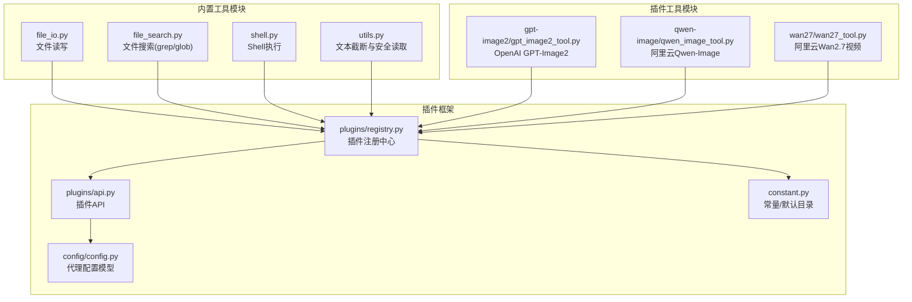
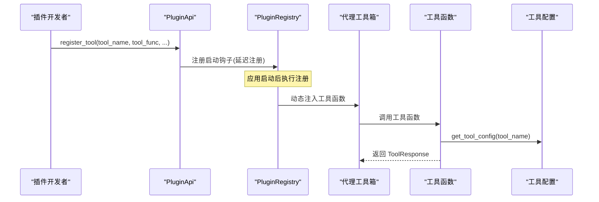
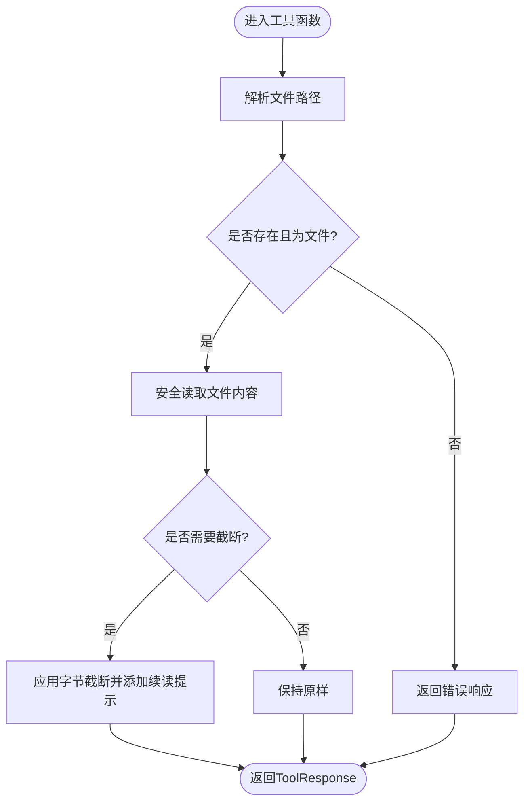
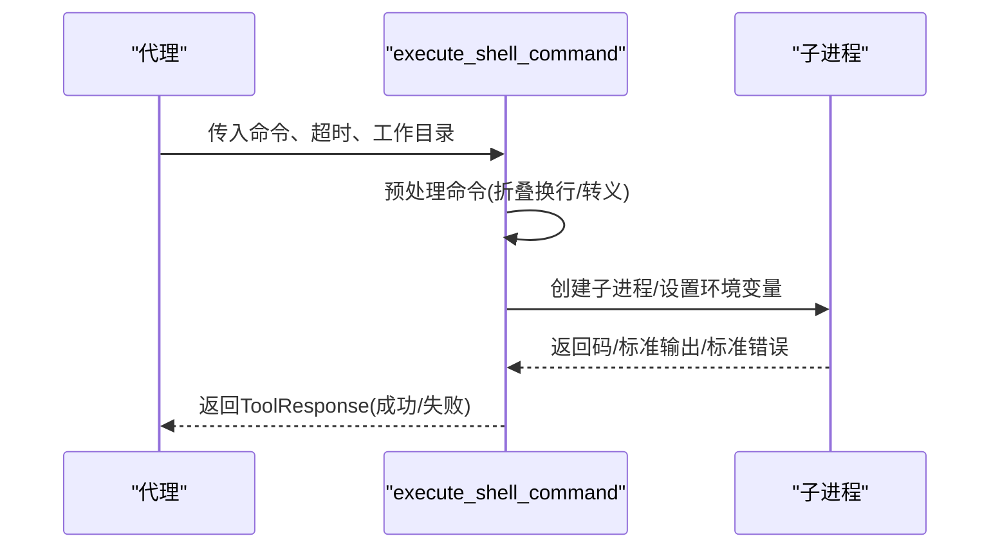
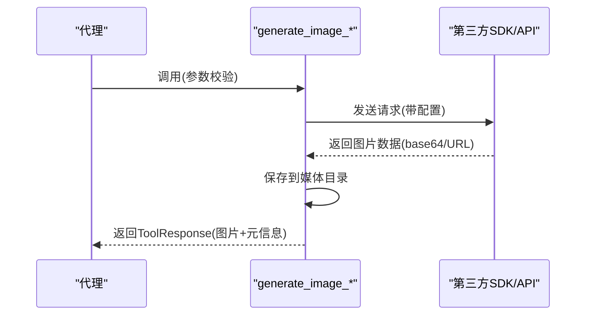
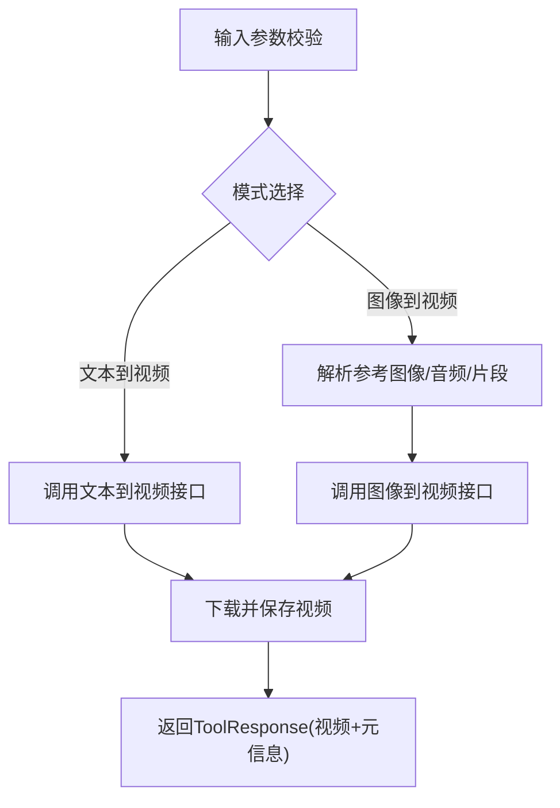
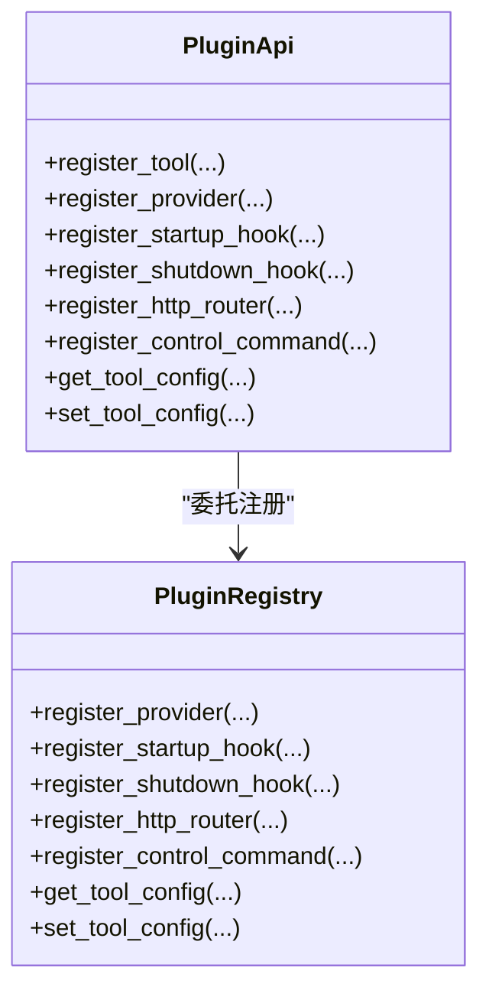
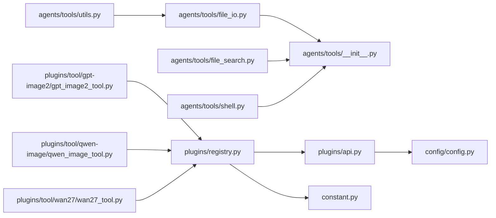

# 工具插件开发

<cite>
**本文档引用的文件**
- [src/qwenpaw/agents/tools/__init__.py](file://src/qwenpaw/agents/tools/__init__.py)
- [src/qwenpaw/agents/tools/file_io.py](file://src/qwenpaw/agents/tools/file_io.py)
- [src/qwenpaw/agents/tools/file_search.py](file://src/qwenpaw/agents/tools/file_search.py)
- [src/qwenpaw/agents/tools/shell.py](file://src/qwenpaw/agents/tools/shell.py)
- [src/qwenpaw/agents/tools/utils.py](file://src/qwenpaw/agents/tools/utils.py)
- [src/qwenpaw/plugins/api.py](file://src/qwenpaw/plugins/api.py)
- [src/qwenpaw/plugins/registry.py](file://src/qwenpaw/plugins/registry.py)
- [src/qwenpaw/plugins/tool/gpt-image2/gpt_image2_tool.py](file://src/qwenpaw/plugins/tool/gpt-image2/gpt_image2_tool.py)
- [src/qwenpaw/plugins/tool/qwen-image/qwen_image_tool.py](file://src/qwenpaw/plugins/tool/qwen-image/qwen_image_tool.py)
- [src/qwenpaw/plugins/tool/wan27/wan27_tool.py](file://src/qwenpaw/plugins/tool/wan27/wan27_tool.py)
- [src/qwenpaw/constant.py](file://src/qwenpaw/constant.py)
- [src/qwenpaw/config/config.py](file://src/qwenpaw/config/config.py)
</cite>

## 目录
1. [简介](#简介)
2. [项目结构](#项目结构)
3. [核心组件](#核心组件)
4. [架构总览](#架构总览)
5. [详细组件分析](#详细组件分析)
6. [依赖分析](#依赖分析)
7. [性能考虑](#性能考虑)
8. [故障排查指南](#故障排查指南)
9. [结论](#结论)
10. [附录](#附录)

## 简介
本指南面向希望为 QwenPaw 开发“工具插件”的开发者，系统讲解工具在代理系统中的作用、工具函数的定义与参数规范、代码结构与实现模式（含工具类继承与方法重写）、完整开发示例（图像生成、文件处理等）、工具注册流程、参数校验、错误处理与性能优化最佳实践，以及测试与调试技巧。

## 项目结构
QwenPaw 的工具体系由“内置工具模块”和“插件工具模块”两部分组成：
- 内置工具模块位于 src/qwenpaw/agents/tools/，提供文件读写、搜索、Shell 执行、媒体查看等基础能力。
- 插件工具模块位于 plugins/tool/<tool-name>/，封装第三方服务（如图像生成、视频合成）的能力，通过插件 API 注册到代理工具箱中。

**图表来源**
- [src/qwenpaw/agents/tools/file_io.py:1-396](file://src/qwenpaw/agents/tools/file_io.py#L1-L396)
- [src/qwenpaw/agents/tools/file_search.py:1-629](file://src/qwenpaw/agents/tools/file_search.py#L1-L629)
- [src/qwenpaw/agents/tools/shell.py:1-542](file://src/qwenpaw/agents/tools/shell.py#L1-L542)
- [src/qwenpaw/agents/tools/utils.py:1-242](file://src/qwenpaw/agents/tools/utils.py#L1-L242)
- [src/qwenpaw/plugins/tool/gpt-image2/gpt_image2_tool.py:1-575](file://src/qwenpaw/plugins/tool/gpt-image2/gpt_image2_tool.py#L1-L575)
- [src/qwenpaw/plugins/tool/qwen-image/qwen_image_tool.py:1-735](file://src/qwenpaw/plugins/tool/qwen-image/qwen_image_tool.py#L1-L735)
- [src/qwenpaw/plugins/tool/wan27/wan27_tool.py:1-945](file://src/qwenpaw/plugins/tool/wan27/wan27_tool.py#L1-L945)
- [src/qwenpaw/plugins/registry.py:1-598](file://src/qwenpaw/plugins/registry.py#L1-L598)
- [src/qwenpaw/plugins/api.py:1-401](file://src/qwenpaw/plugins/api.py#L1-L401)
- [src/qwenpaw/constant.py:1-368](file://src/qwenpaw/constant.py#L1-L368)
- [src/qwenpaw/config/config.py:1-2128](file://src/qwenpaw/config/config.py#L1-L2128)

**章节来源**
- [src/qwenpaw/agents/tools/__init__.py:1-58](file://src/qwenpaw/agents/tools/__init__.py#L1-L58)
- [src/qwenpaw/plugins/registry.py:95-598](file://src/qwenpaw/plugins/registry.py#L95-L598)
- [src/qwenpaw/plugins/api.py:48-401](file://src/qwenpaw/plugins/api.py#L48-L401)

## 核心组件
- 工具函数统一返回 ToolResponse，内容可包含文本块、图片块、视频块等多模态消息体，便于代理系统渲染与传递。
- 工具参数校验：类型检查、范围限制、必填项校验、格式校验（如路径、正则、URL、文件扩展名等）。
- 错误处理：捕获网络异常、超时、权限不足、配置缺失等情况，统一返回带错误信息的 ToolResponse。
- 性能优化：异步 I/O、流式下载、内存保护、输出截断、超时控制、线程锁保护全局 SDK 配置。
- 安全性：路径解析与工作区隔离、编码处理、二进制文件跳过、白名单过滤、只读访问策略。

**章节来源**
- [src/qwenpaw/agents/tools/file_io.py:66-396](file://src/qwenpaw/agents/tools/file_io.py#L66-L396)
- [src/qwenpaw/agents/tools/file_search.py:478-629](file://src/qwenpaw/agents/tools/file_search.py#L478-L629)
- [src/qwenpaw/agents/tools/shell.py:357-542](file://src/qwenpaw/agents/tools/shell.py#L357-L542)
- [src/qwenpaw/agents/tools/utils.py:154-242](file://src/qwenpaw/agents/tools/utils.py#L154-L242)

## 架构总览
工具插件的开发与运行遵循以下流程：
- 插件通过 PluginApi.register_tool 将工具函数注册到代理工具箱。
- 工具函数从 get_tool_config 获取当前代理的工具配置（如 API Key、Endpoint、Timeout）。
- 工具函数执行业务逻辑（网络请求、文件操作、命令执行），统一以 ToolResponse 返回结果。
- 插件注册中心负责管理插件清单、HTTP 路由、启动/关闭钩子、工具配置持久化。

**图表来源**
- [src/qwenpaw/plugins/api.py:287-401](file://src/qwenpaw/plugins/api.py#L287-L401)
- [src/qwenpaw/plugins/registry.py:325-397](file://src/qwenpaw/plugins/registry.py#L325-L397)
- [src/qwenpaw/plugins/api.py:10-46](file://src/qwenpaw/plugins/api.py#L10-L46)

**章节来源**
- [src/qwenpaw/plugins/api.py:10-46](file://src/qwenpaw/plugins/api.py#L10-L46)
- [src/qwenpaw/plugins/registry.py:530-598](file://src/qwenpaw/plugins/registry.py#L530-L598)

## 详细组件分析

### 文件工具链（file_io + file_search + utils）
- 路径解析：支持绝对路径与相对路径（基于当前工作区或默认工作目录）。
- 编码策略：针对不同文件类型选择合适的编码（如 CSV/TSV/TXT 使用带 BOM 的 UTF-8，其他使用 UTF-8）。
- 文本截断：按字节限制截断输出，保留行完整性，并在消息中标注续读提示，便于分页读取。
- 安全读取：限制最大读取字节数，避免大文件导致内存压力；遇到编码错误时采用容错策略。
- 搜索工具：grep 支持正则/大小写/上下文行数/文件名过滤；glob 支持通配符匹配；均设置扫描上限与超时。

**图表来源**
- [src/qwenpaw/agents/tools/file_io.py:66-206](file://src/qwenpaw/agents/tools/file_io.py#L66-L206)
- [src/qwenpaw/agents/tools/utils.py:154-208](file://src/qwenpaw/agents/tools/utils.py#L154-L208)

**章节来源**
- [src/qwenpaw/agents/tools/file_io.py:23-206](file://src/qwenpaw/agents/tools/file_io.py#L23-L206)
- [src/qwenpaw/agents/tools/file_search.py:478-629](file://src/qwenpaw/agents/tools/file_search.py#L478-L629)
- [src/qwenpaw/agents/tools/utils.py:26-208](file://src/qwenpaw/agents/tools/utils.py#L26-L208)

### Shell 工具（跨平台命令执行）
- 命令预处理：折叠换行、修复 Windows 反斜杠转义问题、识别 PowerShell 命令包装。
- 进程管理：Windows 使用线程池执行同步子进程，避免 asyncio 子进程阻塞；非 Windows 使用进程组信号控制。
- 输出解码：优先 UTF-8，失败时回退到系统本地编码，确保跨平台兼容。
- 超时与清理：统一超时处理与进程树清理，避免僵尸进程。

**图表来源**
- [src/qwenpaw/agents/tools/shell.py:357-542](file://src/qwenpaw/agents/tools/shell.py#L357-L542)

**章节来源**
- [src/qwenpaw/agents/tools/shell.py:214-542](file://src/qwenpaw/agents/tools/shell.py#L214-L542)

### 图像生成工具（GPT-Image2、Qwen-Image）
- 配置获取：通过 get_tool_config 获取 API Key、Endpoint、Timeout、模型等参数。
- 参数校验：尺寸、质量/分辨率、数量、提示词长度等严格校验。
- 多模态响应：将生成的图片保存到默认媒体目录，并以 ImageBlock + 文本描述的形式返回。
- 异常处理：网络错误、超时、保存失败等均转换为 ToolResponse 错误信息。

**图表来源**
- [src/qwenpaw/plugins/tool/gpt-image2/gpt_image2_tool.py:20-243](file://src/qwenpaw/plugins/tool/gpt-image2/gpt_image2_tool.py#L20-L243)
- [src/qwenpaw/plugins/tool/qwen-image/qwen_image_tool.py:241-470](file://src/qwenpaw/plugins/tool/qwen-image/qwen_image_tool.py#L241-L470)

**章节来源**
- [src/qwenpaw/plugins/tool/gpt-image2/gpt_image2_tool.py:20-243](file://src/qwenpaw/plugins/tool/gpt-image2/gpt_image2_tool.py#L20-L243)
- [src/qwenpaw/plugins/tool/qwen-image/qwen_image_tool.py:241-470](file://src/qwenpaw/plugins/tool/qwen-image/qwen_image_tool.py#L241-L470)

### 视频生成工具（Wan2.7）
- 模式化输入：支持文本到视频、图像到视频（单帧/双帧/驱动音频/片段续播）。
- 参数校验：分辨率、宽高比、时长、音频 URL 等。
- 下载与保存：异步流式下载视频并落盘，返回本地路径供代理渲染。

**图表来源**
- [src/qwenpaw/plugins/tool/wan27/wan27_tool.py:178-375](file://src/qwenpaw/plugins/tool/wan27/wan27_tool.py#L178-L375)
- [src/qwenpaw/plugins/tool/wan27/wan27_tool.py:377-664](file://src/qwenpaw/plugins/tool/wan27/wan27_tool.py#L377-L664)

**章节来源**
- [src/qwenpaw/plugins/tool/wan27/wan27_tool.py:178-375](file://src/qwenpaw/plugins/tool/wan27/wan27_tool.py#L178-L375)
- [src/qwenpaw/plugins/tool/wan27/wan27_tool.py:377-664](file://src/qwenpaw/plugins/tool/wan27/wan27_tool.py#L377-L664)

### 插件注册与配置
- 插件 API：提供 register_tool、register_provider、register_startup_hook、register_shutdown_hook、register_http_router、register_control_command 等能力。
- 注册机制：通过延迟启动钩子完成工具函数注入与代理配置更新，保证上下文可用。
- 配置存储：get_tool_config/set_tool_config 从代理配置中读取/写入工具配置（如 API Key、Endpoint、Timeout）。

**图表来源**
- [src/qwenpaw/plugins/api.py:48-401](file://src/qwenpaw/plugins/api.py#L48-L401)
- [src/qwenpaw/plugins/registry.py:95-598](file://src/qwenpaw/plugins/registry.py#L95-L598)

**章节来源**
- [src/qwenpaw/plugins/api.py:10-46](file://src/qwenpaw/plugins/api.py#L10-L46)
- [src/qwenpaw/plugins/registry.py:530-598](file://src/qwenpaw/plugins/registry.py#L530-L598)

## 依赖分析
- 工具函数依赖 agentscope 的 ToolResponse 与消息块类型（TextBlock、ImageBlock、VideoBlock）进行统一输出。
- 插件工具依赖 qwenpaw.plugins.get_tool_config 从代理配置中读取工具参数。
- 常量模块提供默认工作目录、媒体目录、截断标记等全局约定。
- 配置模块提供代理工具配置的数据模型与持久化接口。

**图表来源**
- [src/qwenpaw/agents/tools/__init__.py:1-58](file://src/qwenpaw/agents/tools/__init__.py#L1-L58)
- [src/qwenpaw/agents/tools/file_io.py:1-396](file://src/qwenpaw/agents/tools/file_io.py#L1-L396)
- [src/qwenpaw/agents/tools/file_search.py:1-629](file://src/qwenpaw/agents/tools/file_search.py#L1-L629)
- [src/qwenpaw/agents/tools/shell.py:1-542](file://src/qwenpaw/agents/tools/shell.py#L1-L542)
- [src/qwenpaw/plugins/tool/gpt-image2/gpt_image2_tool.py:1-575](file://src/qwenpaw/plugins/tool/gpt-image2/gpt_image2_tool.py#L1-L575)
- [src/qwenpaw/plugins/tool/qwen-image/qwen_image_tool.py:1-735](file://src/qwenpaw/plugins/tool/qwen-image/qwen_image_tool.py#L1-L735)
- [src/qwenpaw/plugins/tool/wan27/wan27_tool.py:1-945](file://src/qwenpaw/plugins/tool/wan27/wan27_tool.py#L1-L945)
- [src/qwenpaw/plugins/registry.py:1-598](file://src/qwenpaw/plugins/registry.py#L1-L598)
- [src/qwenpaw/plugins/api.py:1-401](file://src/qwenpaw/plugins/api.py#L1-L401)
- [src/qwenpaw/constant.py:1-368](file://src/qwenpaw/constant.py#L1-L368)
- [src/qwenpaw/config/config.py:1-2128](file://src/qwenpaw/config/config.py#L1-L2128)

**章节来源**
- [src/qwenpaw/agents/tools/__init__.py:1-58](file://src/qwenpaw/agents/tools/__init__.py#L1-L58)
- [src/qwenpaw/plugins/registry.py:530-598](file://src/qwenpaw/plugins/registry.py#L530-L598)

## 性能考虑
- 异步 I/O 与线程池：网络请求与文件下载采用异步客户端与 to_thread，避免阻塞事件循环。
- 流式下载：视频/图片下载使用流式读取与分块写入，降低内存峰值。
- 内存保护：文件读取限制最大字节数，防止超大文件导致内存溢出。
- 输出截断：按字节截断并保留行边界，减少消息体积，提升吞吐。
- 超时控制：网络请求、Shell 执行、文件扫描均设置合理超时，避免长时间挂起。
- 线程锁：第三方 SDK 全局配置修改使用锁保护，避免并发冲突。

**章节来源**
- [src/qwenpaw/agents/tools/utils.py:210-242](file://src/qwenpaw/agents/tools/utils.py#L210-L242)
- [src/qwenpaw/agents/tools/shell.py:422-498](file://src/qwenpaw/agents/tools/shell.py#L422-L498)
- [src/qwenpaw/plugins/tool/qwen-image/qwen_image_tool.py:134-169](file://src/qwenpaw/plugins/tool/qwen-image/qwen_image_tool.py#L134-L169)
- [src/qwenpaw/plugins/tool/wan27/wan27_tool.py:107-142](file://src/qwenpaw/plugins/tool/wan27/wan27_tool.py#L107-L142)

## 故障排查指南
- 配置缺失：当 get_tool_config 返回空时，工具应立即返回错误提示，引导用户在界面中填写 API Key、Endpoint、Timeout 等。
- 超时与网络错误：捕获超时异常与 HTTP 错误，记录详细日志并返回人类可读的错误信息。
- 权限与路径：检查文件路径是否存在、是否为文件、是否具备读写权限；相对路径需解析到工作区。
- 编码问题：读取文件时若出现 UnicodeDecodeError，采用容错策略并提示用户调整编码。
- 平台差异：Windows 上命令换行与反斜杠转义需特殊处理；进程树清理需使用 taskkill。
- 截断与续读：当输出被截断时，根据提示使用 read_file 的 start_line 继续读取。

**章节来源**
- [src/qwenpaw/plugins/api.py:10-46](file://src/qwenpaw/plugins/api.py#L10-L46)
- [src/qwenpaw/agents/tools/file_io.py:114-206](file://src/qwenpaw/agents/tools/file_io.py#L114-L206)
- [src/qwenpaw/agents/tools/shell.py:455-498](file://src/qwenpaw/agents/tools/shell.py#L455-L498)
- [src/qwenpaw/agents/tools/utils.py:210-242](file://src/qwenpaw/agents/tools/utils.py#L210-L242)

## 结论
QwenPaw 的工具插件开发以“统一返回、严格校验、异步高效、安全可控”为核心原则。通过插件 API 与注册中心，开发者可以快速将第三方能力接入代理工具箱；借助内置工具链与最佳实践，能够稳定地处理文件、命令、网络与多媒体任务。

## 附录

### 工具函数定义与参数规范（模板要点）
- 函数签名：async def your_tool(..., tool_name: str) -> ToolResponse
- 参数校验：类型、范围、必填、格式（路径/正则/URL/扩展名）
- 配置获取：get_tool_config(tool_name) 读取 API Key、Endpoint、Timeout、模型等
- 错误处理：捕获异常并返回包含错误信息的 ToolResponse
- 多模态输出：使用 TextBlock、ImageBlock、VideoBlock 组合返回

**章节来源**
- [src/qwenpaw/plugins/api.py:10-46](file://src/qwenpaw/plugins/api.py#L10-L46)
- [src/qwenpaw/plugins/tool/gpt-image2/gpt_image2_tool.py:20-243](file://src/qwenpaw/plugins/tool/gpt-image2/gpt_image2_tool.py#L20-L243)
- [src/qwenpaw/plugins/tool/qwen-image/qwen_image_tool.py:241-470](file://src/qwenpaw/plugins/tool/qwen-image/qwen_image_tool.py#L241-L470)
- [src/qwenpaw/plugins/tool/wan27/wan27_tool.py:178-375](file://src/qwenpaw/plugins/tool/wan27/wan27_tool.py#L178-L375)

### 开发示例（步骤指引）
- 图像生成工具
  - 在插件目录编写工具函数，调用 get_tool_config 获取配置
  - 校验参数（尺寸、质量、数量等）
  - 调用第三方 API，保存图片至 DEFAULT_MEDIA_DIR
  - 返回包含 ImageBlock 与文本描述的 ToolResponse
- 文件处理工具
  - 解析路径，判断存在性与类型
  - 安全读取文件内容，必要时应用截断策略
  - 执行编辑/追加操作，返回结果状态
- Shell 工具
  - 预处理命令字符串，适配平台差异
  - 设置超时与环境变量，执行子进程
  - 解码输出，返回 ToolResponse

**章节来源**
- [src/qwenpaw/plugins/tool/gpt-image2/gpt_image2_tool.py:20-243](file://src/qwenpaw/plugins/tool/gpt-image2/gpt_image2_tool.py#L20-L243)
- [src/qwenpaw/agents/tools/file_io.py:66-396](file://src/qwenpaw/agents/tools/file_io.py#L66-L396)
- [src/qwenpaw/agents/tools/shell.py:357-542](file://src/qwenpaw/agents/tools/shell.py#L357-L542)
- [src/qwenpaw/constant.py:131-133](file://src/qwenpaw/constant.py#L131-L133)

### 工具注册、参数验证、错误处理与性能优化最佳实践
- 注册：使用 PluginApi.register_tool，启用延迟注册钩子，确保代理上下文就绪
- 参数验证：在函数入口集中校验，使用明确的错误消息与建议
- 错误处理：区分网络/超时/权限/配置错误，统一返回 ToolResponse
- 性能优化：异步 I/O、流式下载、内存保护、输出截断、超时控制、线程锁保护

**章节来源**
- [src/qwenpaw/plugins/api.py:287-401](file://src/qwenpaw/plugins/api.py#L287-L401)
- [src/qwenpaw/plugins/registry.py:325-397](file://src/qwenpaw/plugins/registry.py#L325-L397)
- [src/qwenpaw/agents/tools/utils.py:154-208](file://src/qwenpaw/agents/tools/utils.py#L154-L208)
- [src/qwenpaw/agents/tools/shell.py:422-498](file://src/qwenpaw/agents/tools/shell.py#L422-L498)

### 测试方法与调试技巧
- 单元测试：针对工具函数的关键分支（参数校验、异常路径、截断逻辑）编写测试用例
- 集成测试：模拟代理调用工具，验证 ToolResponse 结构与消息渲染
- 调试技巧：开启日志、记录请求/响应摘要、使用最小化输入复现问题、逐步缩小范围

**章节来源**
- [src/qwenpaw/agents/tools/file_search.py:478-629](file://src/qwenpaw/agents/tools/file_search.py#L478-L629)
- [src/qwenpaw/agents/tools/shell.py:422-498](file://src/qwenpaw/agents/tools/shell.py#L422-L498)