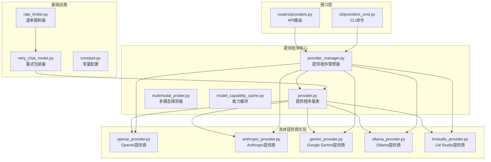
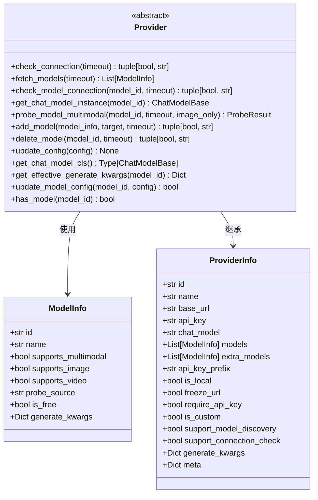
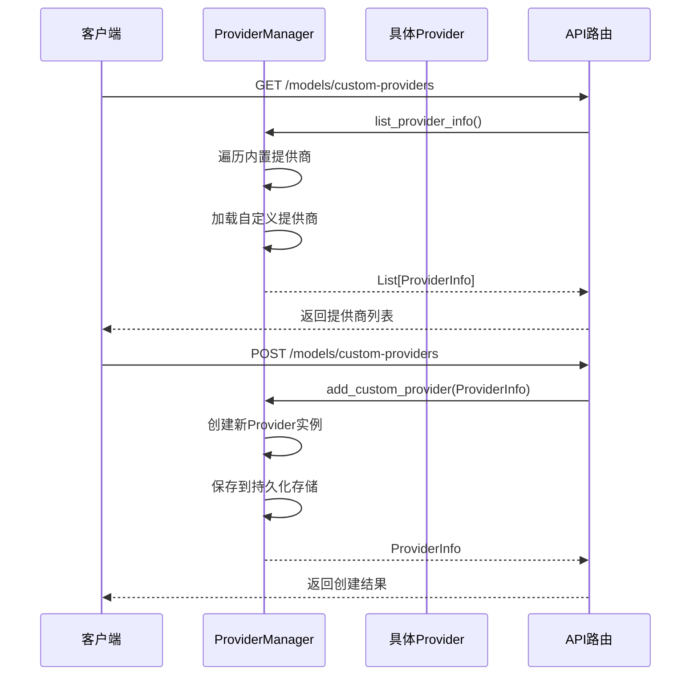
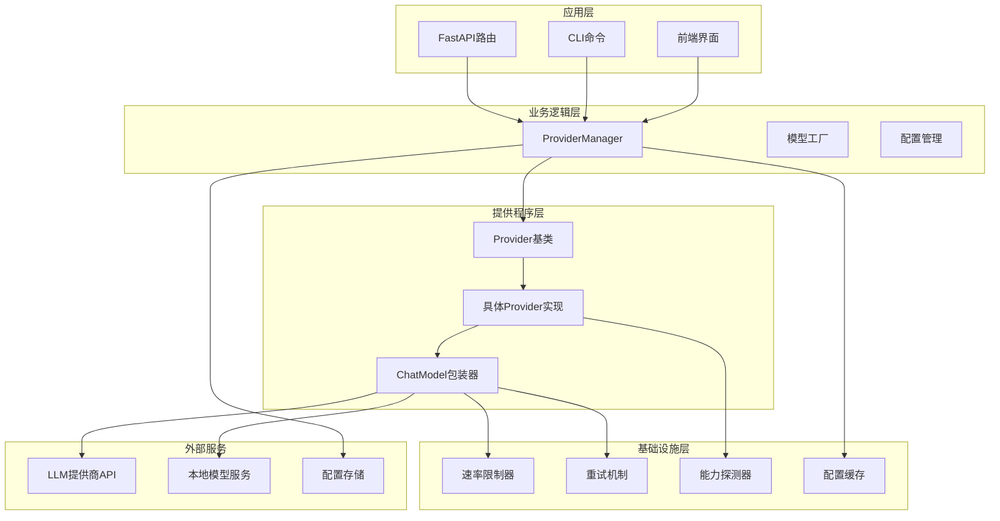
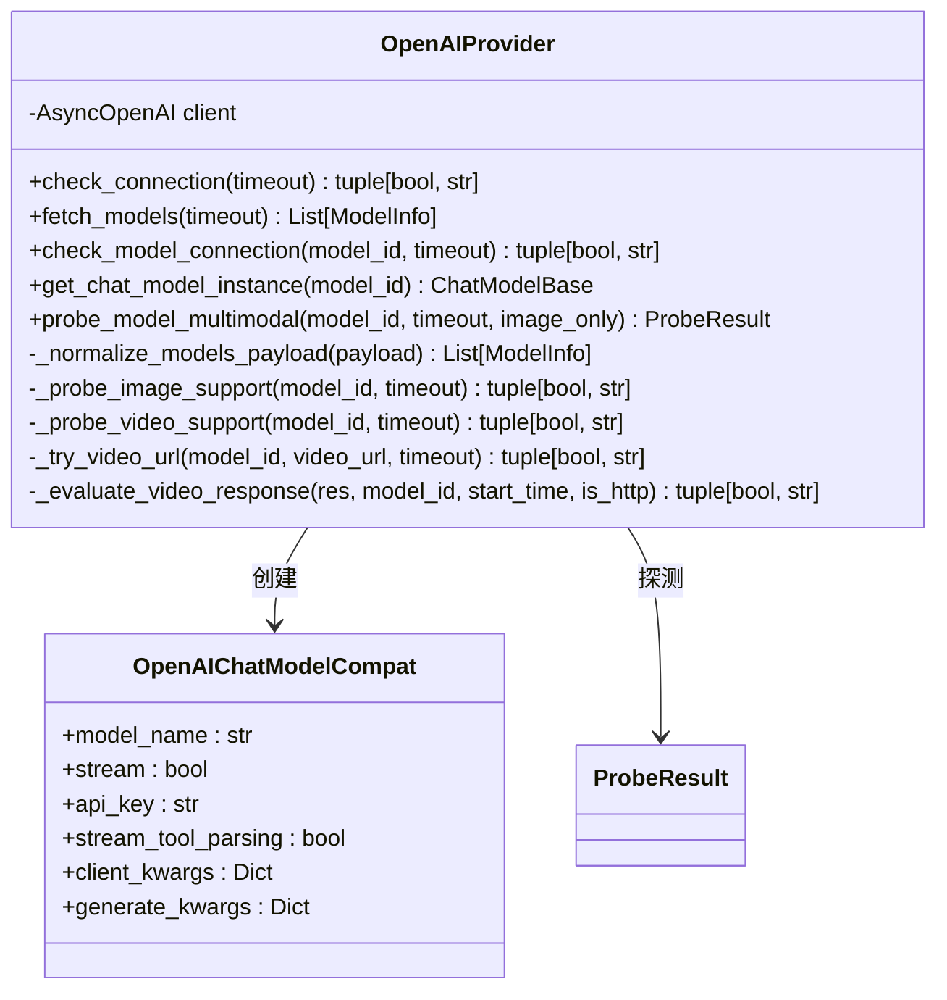
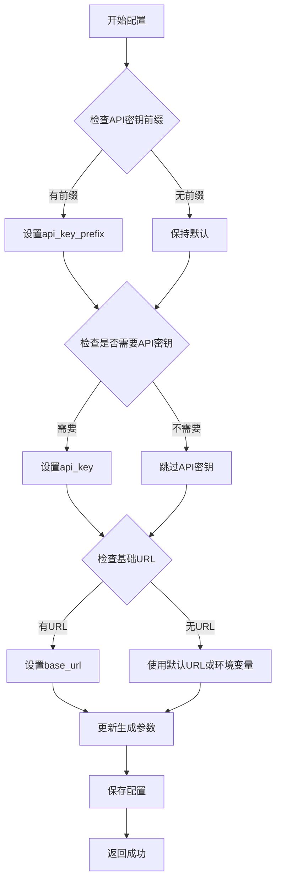
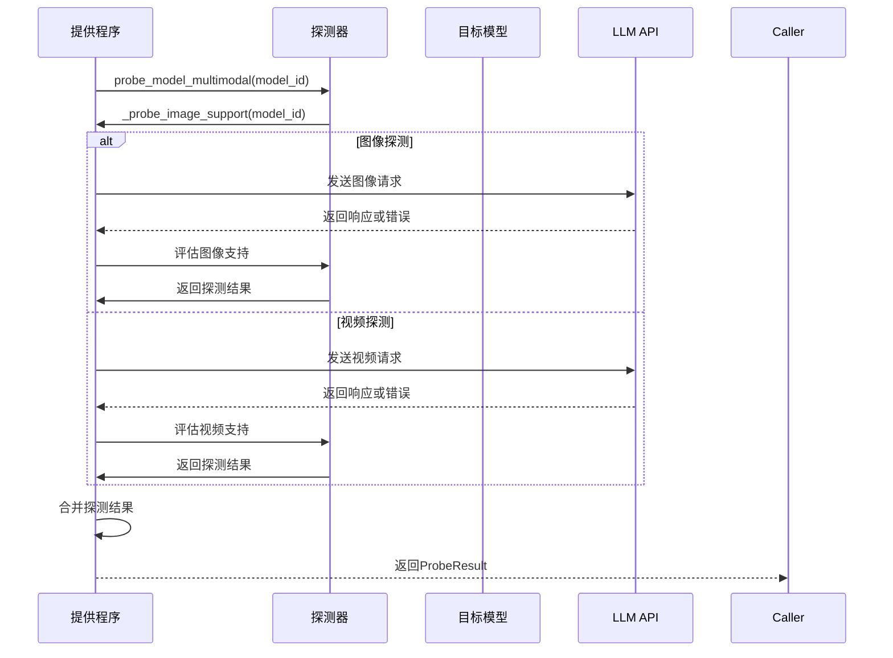
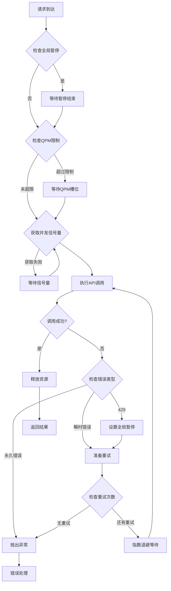
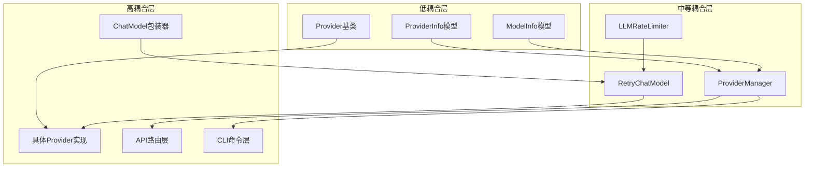
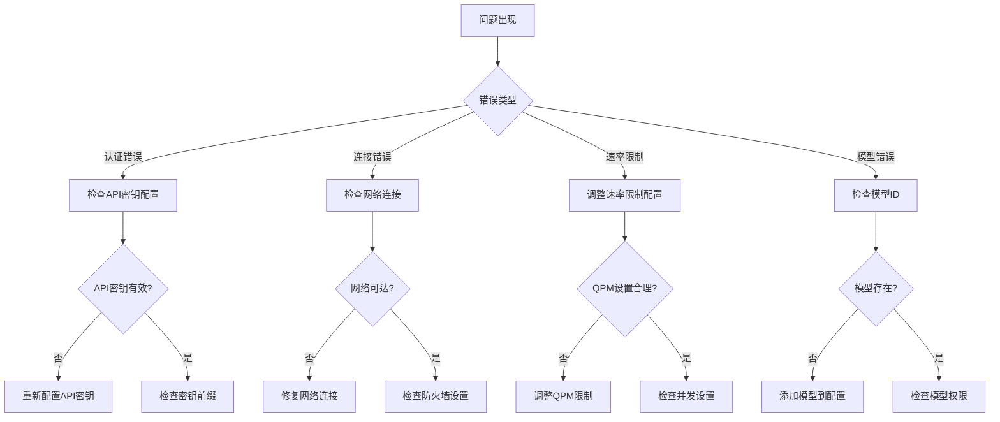

# 提供程序插件开发

<cite>
**本文档引用的文件**
- [provider.py](file://src/qwenpaw/providers/provider.py)
- [provider_manager.py](file://src/qwenpaw/providers/provider_manager.py)
- [openai_provider.py](file://src/qwenpaw/providers/openai_provider.py)
- [anthropic_provider.py](file://src/qwenpaw/providers/anthropic_provider.py)
- [gemini_provider.py](file://src/qwenpaw/providers/gemini_provider.py)
- [ollama_provider.py](file://src/qwenpaw/providers/ollama_provider.py)
- [lmstudio_provider.py](file://src/qwenpaw/providers/lmstudio_provider.py)
- [rate_limiter.py](file://src/qwenpaw/providers/rate_limiter.py)
- [retry_chat_model.py](file://src/qwenpaw/providers/retry_chat_model.py)
- [multimodal_prober.py](file://src/qwenpaw/providers/multimodal_prober.py)
- [model_capability_cache.py](file://src/qwenpaw/providers/model_capability_cache.py)
- [constant.py](file://src/qwenpaw/constant.py)
- [providers.py](file://src/qwenpaw/app/routers/providers.py)
- [providers_cmd.py](file://src/qwenpaw/cli/providers_cmd.py)
- [test_openai_provider.py](file://tests/unit/providers/test_openai_provider.py)
</cite>

## 目录
1. [简介](#简介)
2. [项目结构](#项目结构)
3. [核心组件](#核心组件)
4. [架构概览](#架构概览)
5. [详细组件分析](#详细组件分析)
6. [依赖关系分析](#依赖关系分析)
7. [性能考虑](#性能考虑)
8. [故障排除指南](#故障排除指南)
9. [结论](#结论)
10. [附录](#附录)

## 简介

QwenPaw 的提供程序插件系统是其模型调用架构的核心组成部分。提供程序插件作为统一的抽象层，为各种 AI 模型提供商（如 OpenAI、Anthropic、Google Gemini 等）提供了标准化的接口，使得系统能够以一致的方式与不同的 LLM API 进行交互。

提供程序插件的重要性体现在以下几个方面：

- **统一抽象**：通过 Provider 基类定义标准接口，屏蔽不同提供商的 API 差异
- **多提供商支持**：支持 OpenAI 兼容 API、Anthropic API、Google Gemini API 等多种提供商
- **本地模型集成**：支持本地 LLM 托管平台（如 Ollama、LM Studio）
- **能力探测**：自动探测模型的多模态能力（图像、视频支持）
- **配置管理**：提供完整的配置、发现、测试功能

## 项目结构

QwenPaw 的提供程序系统采用模块化的架构设计，主要包含以下核心目录和文件：

**图表来源**
- [provider.py:147-374](file://src/qwenpaw/providers/provider.py#L147-L374)
- [provider_manager.py:1-200](file://src/qwenpaw/providers/provider_manager.py#L1-L200)
- [openai_provider.py:46-537](file://src/qwenpaw/providers/openai_provider.py#L46-L537)

**章节来源**
- [provider.py:1-374](file://src/qwenpaw/providers/provider.py#L1-L374)
- [provider_manager.py:1-200](file://src/qwenpaw/providers/provider_manager.py#L1-L200)

## 核心组件

### Provider 基类

Provider 是所有提供程序实现的基础抽象类，定义了统一的接口规范：

**图表来源**
- [provider.py:18-374](file://src/qwenpaw/providers/provider.py#L18-L374)

### 提供程序管理器

ProviderManager 负责管理所有提供程序实例，包括内置和自定义提供商：

**图表来源**
- [provider_manager.py:1-200](file://src/qwenpaw/providers/provider_manager.py#L1-L200)
- [providers.py:165-235](file://src/qwenpaw/app/routers/providers.py#L165-L235)

**章节来源**
- [provider_manager.py:1-200](file://src/qwenpaw/providers/provider_manager.py#L1-L200)
- [providers.py:165-235](file://src/qwenpaw/app/routers/providers.py#L165-L235)

## 架构概览

QwenPaw 的提供程序系统采用分层架构设计，确保了良好的可扩展性和维护性：

**图表来源**
- [provider.py:147-374](file://src/qwenpaw/providers/provider.py#L147-L374)
- [provider_manager.py:1-200](file://src/qwenpaw/providers/provider_manager.py#L1-L200)
- [rate_limiter.py:30-279](file://src/qwenpaw/providers/rate_limiter.py#L30-L279)

## 详细组件分析

### OpenAI 提供程序实现

OpenAIProvider 展示了如何实现一个完整的提供程序插件：

**图表来源**
- [openai_provider.py:46-537](file://src/qwenpaw/providers/openai_provider.py#L46-L537)

#### 认证配置实现

OpenAIProvider 实现了完整的认证配置机制：

**图表来源**
- [openai_provider.py:145-194](file://src/qwenpaw/providers/openai_provider.py#L145-L194)

#### API 调用封装

OpenAIProvider 封装了 OpenAI SDK 的调用：

**章节来源**
- [openai_provider.py:46-537](file://src/qwenpaw/providers/openai_provider.py#L46-L537)

### 多模态探测系统

QwenPaw 实现了智能的多模态能力探测系统：

**图表来源**
- [multimodal_prober.py:75-162](file://src/qwenpaw/providers/multimodal_prober.py#L75-L162)
- [openai_provider.py:196-236](file://src/qwenpaw/providers/openai_provider.py#L196-L236)

#### 探测算法实现

探测系统使用了精心设计的探测策略：

**章节来源**
- [multimodal_prober.py:1-162](file://src/qwenpaw/providers/multimodal_prober.py#L1-L162)
- [openai_provider.py:196-537](file://src/qwenpaw/providers/openai_provider.py#L196-L537)

### 速率限制和重试机制

QwenPaw 实现了完善的速率限制和重试机制：

**图表来源**
- [rate_limiter.py:70-174](file://src/qwenpaw/providers/rate_limiter.py#L70-L174)
- [retry_chat_model.py:342-447](file://src/qwenpaw/providers/retry_chat_model.py#L342-L447)

**章节来源**
- [rate_limiter.py:1-279](file://src/qwenpaw/providers/rate_limiter.py#L1-L279)
- [retry_chat_model.py:1-570](file://src/qwenpaw/providers/retry_chat_model.py#L1-L570)

## 依赖关系分析

### 组件耦合度分析

**图表来源**
- [provider.py:147-374](file://src/qwenpaw/providers/provider.py#L147-L374)
- [provider_manager.py:1-200](file://src/qwenpaw/providers/provider_manager.py#L1-L200)

### 外部依赖关系

系统对外部依赖的管理采用了松耦合的设计：

**章节来源**
- [provider.py:1-374](file://src/qwenpaw/providers/provider.py#L1-L374)
- [provider_manager.py:1-200](file://src/qwenpaw/providers/provider_manager.py#L1-L200)

## 性能考虑

### 速率限制最佳实践

QwenPaw 的速率限制系统实现了多项优化策略：

1. **滑动窗口 QPM 限制**：使用 60 秒滑动窗口防止 429 错误
2. **并发信号量控制**：限制同时进行的 API 调用数量
3. **全局暂停机制**：当收到 429 时，所有调用者共享暂停状态
4. **随机抖动**：避免所有调用者同时恢复导致的新突发

### 缓存策略

系统实现了多层次的缓存机制：

1. **模型能力缓存**：记录模型的已知能力特征
2. **配置缓存**：避免重复的配置验证
3. **探测结果缓存**：缓存多模态探测结果

### 监控指标收集

系统提供了丰富的监控指标：

**章节来源**
- [rate_limiter.py:175-196](file://src/qwenpaw/providers/rate_limiter.py#L175-L196)
- [model_capability_cache.py:24-95](file://src/qwenpaw/providers/model_capability_cache.py#L24-L95)

## 故障排除指南

### 常见问题诊断

### 调试工具和方法

系统提供了多种调试工具：

1. **连接测试**：验证提供商配置的有效性
2. **模型测试**：验证特定模型的可用性
3. **能力探测**：检查模型的多模态支持情况
4. **配置验证**：验证配置文件的正确性

**章节来源**
- [providers.py:292-413](file://src/qwenpaw/app/routers/providers.py#L292-L413)
- [test_openai_provider.py:21-269](file://tests/unit/providers/test_openai_provider.py#L21-L269)

## 结论

QwenPaw 的提供程序插件系统展现了优秀的软件工程实践：

1. **高度抽象**：通过 Provider 基类实现了统一的接口规范
2. **良好扩展性**：支持轻松添加新的提供商实现
3. **健壮性设计**：包含了完整的错误处理和重试机制
4. **性能优化**：实现了智能的速率限制和缓存策略
5. **用户友好**：提供了完整的配置管理和调试工具

该系统为开发者提供了一个清晰的框架，用于集成任何新的 AI 模型提供商，同时保持了系统的稳定性和性能。

## 附录

### 开发新提供程序的步骤

1. **继承 Provider 基类**：实现必需的抽象方法
2. **实现认证逻辑**：处理 API 密钥和基础 URL 配置
3. **封装 API 调用**：实现模型发现和连接测试
4. **集成 ChatModel**：创建与具体提供商兼容的聊天模型
5. **添加多模态支持**：实现图像和视频探测功能
6. **配置管理**：添加到 ProviderManager 中
7. **测试验证**：编写单元测试和集成测试

### 配置选项参考

系统支持的环境变量配置：

- `QWENPAW_LLM_MAX_RETRIES`：最大重试次数
- `QWENPAW_LLM_MAX_CONCURRENT`：最大并发数
- `QWENPAW_LLM_MAX_QPM`：每分钟查询限制
- `QWENPAW_LLM_RATE_LIMIT_PAUSE`：429暂停时间
- `QWENPAW_LLM_RATE_LIMIT_JITTER`：随机抖动范围

**章节来源**
- [constant.py:262-324](file://src/qwenpaw/constant.py#L262-L324)