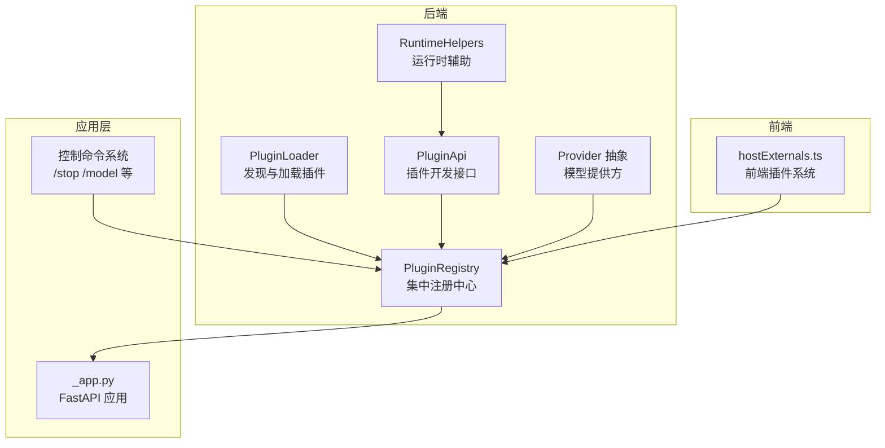
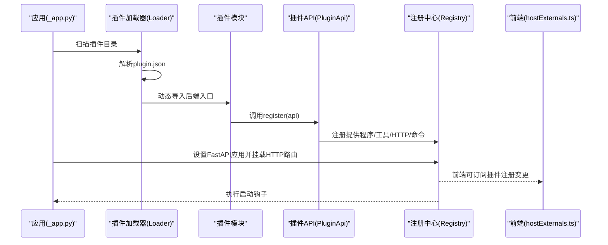
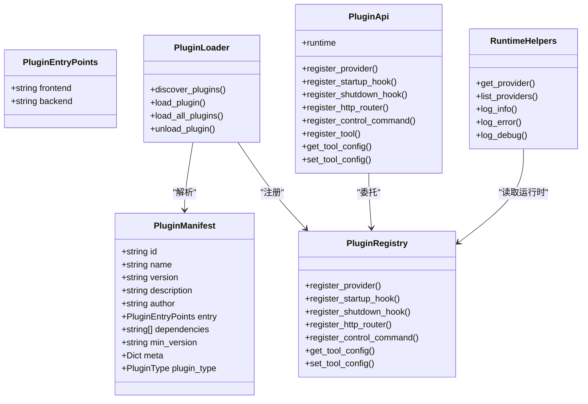

# 插件开发指南

<cite>
**本文档引用的文件**
- [src/qwenpaw/plugins/__init__.py](file://src/qwenpaw/plugins/__init__.py)
- [src/qwenpaw/plugins/api.py](file://src/qwenpaw/plugins/api.py)
- [src/qwenpaw/plugins/architecture.py](file://src/qwenpaw/plugins/architecture.py)
- [src/qwenpaw/plugins/loader.py](file://src/qwenpaw/plugins/loader.py)
- [src/qwenpaw/plugins/registry.py](file://src/qwenpaw/plugins/registry.py)
- [src/qwenpaw/plugins/runtime.py](file://src/qwenpaw/plugins/runtime.py)
- [src/qwenpaw/cli/plugin_commands.py](file://src/qwenpaw/cli/plugin_commands.py)
- [src/qwenpaw/app/_app.py](file://src/qwenpaw/app/_app.py)
- [src/qwenpaw/app/runner/control_commands/__init__.py](file://src/qwenpaw/app/runner/control_commands/__init__.py)
- [src/qwenpaw/providers/provider.py](file://src/qwenpaw/providers/provider.py)
- [plugins/tool/qwen-image/plugin.json](file://plugins/tool/qwen-image/plugin.json)
- [plugins/tool/qwen-image/qwen_image.py](file://plugins/tool/qwen-image/qwen_image.py)
- [plugins/tool/gpt-image2/plugin.json](file://plugins/tool/gpt-image2/plugin.json)
- [scripts/pack/build_common.py](file://scripts/pack/build_common.py)
</cite>

## 目录
1. [简介](#简介)
2. [项目结构](#项目结构)
3. [核心组件](#核心组件)
4. [架构总览](#架构总览)
5. [详细组件分析](#详细组件分析)
6. [依赖关系分析](#依赖关系分析)
7. [性能考虑](#性能考虑)
8. [故障排查指南](#故障排查指南)
9. [结论](#结论)
10. [附录](#附录)

## 简介
本指南面向希望在 QwenPaw 平台上开发插件的开发者，覆盖从项目初始化、清单文件编写、插件框架使用、多类型插件示例（工具插件、提供程序插件、控制命令插件）到打包分发与版本管理的全流程。文档基于仓库中的实际实现进行总结，帮助你快速上手并构建高质量的插件。

## 项目结构
QwenPaw 的插件系统由后端 Python 框架与前端动态注册机制共同组成：
- 后端负责插件发现、加载、注册与生命周期管理
- 前端通过全局插件系统订阅并渲染插件路由与工具渲染器
- CLI 提供安装、卸载与信息查询能力
- 应用入口在启动时挂载插件 HTTP 路由并执行启动/关闭钩子

图表来源
- [src/qwenpaw/plugins/loader.py:23-263](file://src/qwenpaw/plugins/loader.py#L23-L263)
- [src/qwenpaw/plugins/registry.py:95-598](file://src/qwenpaw/plugins/registry.py#L95-L598)
- [src/qwenpaw/plugins/api.py:48-401](file://src/qwenpaw/plugins/api.py#L48-L401)
- [src/qwenpaw/plugins/runtime.py:10-68](file://src/qwenpaw/plugins/runtime.py#L10-L68)
- [src/qwenpaw/providers/provider.py:147-200](file://src/qwenpaw/providers/provider.py#L147-L200)
- [src/qwenpaw/app/_app.py:1-200](file://src/qwenpaw/app/_app.py#L1-L200)
- [src/qwenpaw/app/runner/control_commands/__init__.py:34-258](file://src/qwenpaw/app/runner/control_commands/__init__.py#L34-L258)
- [console/src/plugins/hostExternals.ts:34-122](file://console/src/plugins/hostExternals.ts#L34-L122)

章节来源
- [src/qwenpaw/plugins/__init__.py:1-17](file://src/qwenpaw/plugins/__init__.py#L1-L17)
- [src/qwenpaw/plugins/loader.py:23-263](file://src/qwenpaw/plugins/loader.py#L23-L263)
- [src/qwenpaw/plugins/registry.py:95-598](file://src/qwenpaw/plugins/registry.py#L95-L598)
- [src/qwenpaw/plugins/api.py:48-401](file://src/qwenpaw/plugins/api.py#L48-L401)
- [src/qwenpaw/plugins/runtime.py:10-68](file://src/qwenpaw/plugins/runtime.py#L10-L68)
- [src/qwenpaw/providers/provider.py:147-200](file://src/qwenpaw/providers/provider.py#L147-L200)
- [src/qwenpaw/app/_app.py:1-200](file://src/qwenpaw/app/_app.py#L1-L200)
- [src/qwenpaw/app/runner/control_commands/__init__.py:34-258](file://src/qwenpaw/app/runner/control_commands/__init__.py#L34-L258)
- [console/src/plugins/hostExternals.ts:34-122](file://console/src/plugins/hostExternals.ts#L34-L122)

## 核心组件
- 插件清单与类型：通过 plugin.json 定义插件元数据、入口点、依赖与类型；支持自动推断类型或显式声明
- 插件加载器：扫描目录、解析清单、动态导入后端模块、调用 register 方法
- 注册中心：统一管理提供程序、启动/关闭钩子、HTTP 路由、控制命令与工具配置
- 插件 API：提供注册工具、提供程序、HTTP 路由、控制命令、运行时辅助等能力
- 运行时辅助：访问 ProviderManager、日志与列表提供程序
- 控制命令系统：内置与插件注册的命令处理器，支持优先级与参数解析
- CLI 插件管理：支持本地/URL 安装、热加载、卸载与信息查询

章节来源
- [src/qwenpaw/plugins/architecture.py:10-142](file://src/qwenpaw/plugins/architecture.py#L10-L142)
- [src/qwenpaw/plugins/loader.py:71-238](file://src/qwenpaw/plugins/loader.py#L71-L238)
- [src/qwenpaw/plugins/registry.py:95-598](file://src/qwenpaw/plugins/registry.py#L95-L598)
- [src/qwenpaw/plugins/api.py:48-401](file://src/qwenpaw/plugins/api.py#L48-L401)
- [src/qwenpaw/plugins/runtime.py:10-68](file://src/qwenpaw/plugins/runtime.py#L10-L68)
- [src/qwenpaw/app/runner/control_commands/__init__.py:34-258](file://src/qwenpaw/app/runner/control_commands/__init__.py#L34-L258)
- [src/qwenpaw/cli/plugin_commands.py:500-800](file://src/qwenpaw/cli/plugin_commands.py#L500-L800)

## 架构总览
下图展示了插件从发现到运行的关键流程：应用启动时加载插件，注册 HTTP 路由与控制命令，执行启动钩子，前端动态注册路由与工具渲染器。

图表来源
- [src/qwenpaw/app/_app.py:1-200](file://src/qwenpaw/app/_app.py#L1-L200)
- [src/qwenpaw/plugins/loader.py:88-238](file://src/qwenpaw/plugins/loader.py#L88-L238)
- [src/qwenpaw/plugins/api.py:48-401](file://src/qwenpaw/plugins/api.py#L48-L401)
- [src/qwenpaw/plugins/registry.py:130-214](file://src/qwenpaw/plugins/registry.py#L130-L214)
- [console/src/plugins/hostExternals.ts:57-118](file://console/src/plugins/hostExternals.ts#L57-L118)

## 详细组件分析

### 插件清单文件（plugin.json）
- 必填字段：id、name、version
- 入口点：entry.backend（后端入口）、entry.frontend（前端入口）
- 类型：type 字段显式声明，或根据 meta 与入口点自动推断
- 依赖：dependencies 列表用于安装 Python 依赖
- 最低版本：min_version 限制兼容性
- 元数据：meta 中可定义工具、提供程序、命令等扩展信息

章节来源
- [plugins/tool/qwen-image/plugin.json:1-129](file://plugins/tool/qwen-image/plugin.json#L1-L129)
- [plugins/tool/gpt-image2/plugin.json:1-89](file://plugins/tool/gpt-image2/plugin.json#L1-L89)
- [src/qwenpaw/plugins/architecture.py:44-131](file://src/qwenpaw/plugins/architecture.py#L44-L131)

### 插件加载与发现（PluginLoader）
- 发现：遍历插件目录，读取 plugin.json 构造 Manifest
- 加载：动态导入后端模块，校验导出对象，调用 register(api)
- 依赖安装：支持 pip 与 uv 两种方式安装 requirements.txt
- 卸载：执行关闭钩子、清理模块缓存、移除注册项与工具

章节来源
- [src/qwenpaw/plugins/loader.py:36-262](file://src/qwenpaw/plugins/loader.py#L36-L262)
- [src/qwenpaw/plugins/loader.py:295-405](file://src/qwenpaw/plugins/loader.py#L295-L405)
- [src/qwenpaw/plugins/loader.py:487-609](file://src/qwenpaw/plugins/loader.py#L487-L609)

### 注册中心（PluginRegistry）
- 提供程序注册：避免重复注册，支持查询与列表
- 钩子管理：按优先级排序的启动/关闭钩子
- HTTP 路由：在 FastAPI 应用中挂载前确保覆盖 SPA 路由
- 控制命令：注册与分发命令处理器
- 工具配置：按 agent_id 读取/保存工具配置

章节来源
- [src/qwenpaw/plugins/registry.py:130-214](file://src/qwenpaw/plugins/registry.py#L130-L214)
- [src/qwenpaw/plugins/registry.py:249-430](file://src/qwenpaw/plugins/registry.py#L249-L430)
- [src/qwenpaw/plugins/registry.py:505-598](file://src/qwenpaw/plugins/registry.py#L505-L598)

### 插件 API（PluginApi）
- 注册工具：向 agents.tools 注入函数并写入 agent 配置
- 注册提供程序：桥接 Provider 与注册中心
- 注册钩子：启动/关闭钩子，支持优先级
- 注册 HTTP 路由：挂载 FastAPI 路由至 /api 前缀
- 注册控制命令：注册命令处理器
- 运行时辅助：访问 RuntimeHelpers

章节来源
- [src/qwenpaw/plugins/api.py:48-401](file://src/qwenpaw/plugins/api.py#L48-L401)

### 运行时辅助（RuntimeHelpers）
- 获取 Provider 实例与列表
- 日志记录（info/error/debug）

章节来源
- [src/qwenpaw/plugins/runtime.py:10-68](file://src/qwenpaw/plugins/runtime.py#L10-L68)

### 控制命令系统
- 默认命令：/stop、/model、/skills、/approval 等
- 插件注册：通过 PluginApi.register_control_command 注册自定义命令
- 参数解析：支持键值对与特殊命令的参数格式
- 分发处理：根据命令名查找处理器并异步执行

章节来源
- [src/qwenpaw/app/runner/control_commands/__init__.py:34-258](file://src/qwenpaw/app/runner/control_commands/__init__.py#L34-L258)
- [src/qwenpaw/plugins/api.py:222-244](file://src/qwenpaw/plugins/api.py#L222-L244)
- [src/qwenpaw/plugins/registry.py:399-430](file://src/qwenpaw/plugins/registry.py#L399-L430)

### 提供程序抽象（Provider）
- 统一的 ProviderInfo 与 Provider 抽象，定义连接检查、模型拉取、模型可用性检查等接口
- 支持扩展模型列表与删除模型

章节来源
- [src/qwenpaw/providers/provider.py:75-200](file://src/qwenpaw/providers/provider.py#L75-L200)

### 前端插件系统（hostExternals.ts）
- 全局单例维护插件注册记录
- 订阅注册变更以更新路由与工具渲染器
- 支持路由声明、图标与优先级

章节来源
- [console/src/plugins/hostExternals.ts:34-122](file://console/src/plugins/hostExternals.ts#L34-L122)

## 依赖关系分析

图表来源
- [src/qwenpaw/plugins/architecture.py:44-142](file://src/qwenpaw/plugins/architecture.py#L44-L142)
- [src/qwenpaw/plugins/loader.py:23-263](file://src/qwenpaw/plugins/loader.py#L23-L263)
- [src/qwenpaw/plugins/registry.py:95-598](file://src/qwenpaw/plugins/registry.py#L95-L598)
- [src/qwenpaw/plugins/api.py:48-401](file://src/qwenpaw/plugins/api.py#L48-L401)
- [src/qwenpaw/plugins/runtime.py:10-68](file://src/qwenpaw/plugins/runtime.py#L10-L68)

章节来源
- [src/qwenpaw/plugins/architecture.py:44-142](file://src/qwenpaw/plugins/architecture.py#L44-L142)
- [src/qwenpaw/plugins/loader.py:23-263](file://src/qwenpaw/plugins/loader.py#L23-L263)
- [src/qwenpaw/plugins/registry.py:95-598](file://src/qwenpaw/plugins/registry.py#L95-L598)
- [src/qwenpaw/plugins/api.py:48-401](file://src/qwenpaw/plugins/api.py#L48-L401)
- [src/qwenpaw/plugins/runtime.py:10-68](file://src/qwenpaw/plugins/runtime.py#L10-L68)

## 性能考虑
- 异步加载：插件注册支持同步与异步，建议在 PluginApi.register_* 中使用异步回调以避免阻塞事件循环
- 依赖安装：优先使用 pip，若环境不支持则回退到 uv，超时时间限制为 300 秒
- HTTP 路由挂载：注册中心会调整路由顺序以确保插件路由在 SPA 路由之前匹配，避免 OpenAPI 缓存问题
- 工具注册延迟：工具注册通过启动钩子延后执行，确保应用与 agent 上下文已初始化

章节来源
- [src/qwenpaw/plugins/loader.py:210-215](file://src/qwenpaw/plugins/loader.py#L210-L215)
- [src/qwenpaw/plugins/loader.py:323-401](file://src/qwenpaw/plugins/loader.py#L323-L401)
- [src/qwenpaw/plugins/registry.py:194-214](file://src/qwenpaw/plugins/registry.py#L194-L214)
- [src/qwenpaw/plugins/api.py:329-396](file://src/qwenpaw/plugins/api.py#L329-L396)

## 故障排查指南
- 插件未加载：检查 plugin.json 是否存在、字段是否完整、后端入口文件是否存在
- 依赖安装失败：确认当前 Python 环境是否具备 pip 或 uv；查看超时与错误输出
- HTTP 路由冲突：确保前缀不为 “/”，且未被其他插件占用
- 工具未出现在 UI：确认工具已在启动钩子中注册并保存 agent 配置
- 控制命令无效：确认命令名唯一且已正确注册，参数格式符合解析规则

章节来源
- [src/qwenpaw/plugins/loader.py:104-145](file://src/qwenpaw/plugins/loader.py#L104-L145)
- [src/qwenpaw/plugins/loader.py:323-401](file://src/qwenpaw/plugins/loader.py#L323-L401)
- [src/qwenpaw/plugins/registry.py:170-186](file://src/qwenpaw/plugins/registry.py#L170-L186)
- [src/qwenpaw/plugins/api.py:329-396](file://src/qwenpaw/plugins/api.py#L329-L396)
- [src/qwenpaw/app/runner/control_commands/__init__.py:101-197](file://src/qwenpaw/app/runner/control_commands/__init__.py#L101-L197)

## 结论
QwenPaw 的插件系统提供了清晰的生命周期与强大的扩展能力。通过 plugin.json 清单、PluginApi 接口与 PluginRegistry 中心化管理，开发者可以快速实现工具、提供程序与控制命令等多类型插件，并借助 CLI 与应用入口完成安装、热加载与卸载。遵循本文档的开发规范与最佳实践，可确保插件的稳定性、可维护性与可分发性。

## 附录

### 多类型插件开发示例

#### 工具插件（Tool Plugin）
- 示例：Qwen-Image 与 GPT Image 2 插件
- 关键点：在 plugin.json 的 meta.tools 中声明工具名称、描述、图标与配置字段；在后端入口中调用 PluginApi.register_tool 注册工具函数

章节来源
- [plugins/tool/qwen-image/plugin.json:12-127](file://plugins/tool/qwen-image/plugin.json#L12-L127)
- [plugins/tool/qwen-image/qwen_image.py:27-63](file://plugins/tool/qwen-image/qwen_image.py#L27-L63)
- [plugins/tool/gpt-image2/plugin.json:13-87](file://plugins/tool/gpt-image2/plugin.json#L13-L87)
- [src/qwenpaw/plugins/api.py:287-401](file://src/qwenpaw/plugins/api.py#L287-L401)

#### 提供程序插件（Provider Plugin）
- 关键点：实现 Provider 抽象类，提供连接检查、模型拉取与模型可用性检查；通过 PluginApi.register_provider 注册

章节来源
- [src/qwenpaw/providers/provider.py:147-200](file://src/qwenpaw/providers/provider.py#L147-L200)
- [src/qwenpaw/plugins/api.py:81-126](file://src/qwenpaw/plugins/api.py#L81-L126)
- [src/qwenpaw/plugins/registry.py:249-289](file://src/qwenpaw/plugins/registry.py#L249-L289)

#### 控制命令插件（Command Plugin）
- 关键点：实现命令处理器并通过 PluginApi.register_control_command 注册；利用控制命令系统解析参数与分发处理

章节来源
- [src/qwenpaw/plugins/api.py:222-244](file://src/qwenpaw/plugins/api.py#L222-L244)
- [src/qwenpaw/plugins/registry.py:399-430](file://src/qwenpaw/plugins/registry.py#L399-L430)
- [src/qwenpaw/app/runner/control_commands/__init__.py:34-258](file://src/qwenpaw/app/runner/control_commands/__init__.py#L34-L258)

### 开发规范与测试策略
- 清单完整性：确保 plugin.json 字段齐全，类型与入口点正确
- 依赖管理：requirements.txt 与依赖安装流程需稳定可靠
- 配置持久化：工具配置通过注册中心保存到 agent 配置
- 前端集成：如需前端路由与工具渲染器，参考 hostExternals.ts 的注册模式
- 测试建议：单元测试覆盖插件注册、HTTP 路由挂载、控制命令分发与工具配置读写

章节来源
- [src/qwenpaw/plugins/architecture.py:44-131](file://src/qwenpaw/plugins/architecture.py#L44-L131)
- [src/qwenpaw/plugins/loader.py:295-405](file://src/qwenpaw/plugins/loader.py#L295-L405)
- [src/qwenpaw/plugins/registry.py:530-598](file://src/qwenpaw/plugins/registry.py#L530-L598)
- [console/src/plugins/hostExternals.ts:34-122](file://console/src/plugins/hostExternals.ts#L34-L122)

### 调试技巧
- 使用 RuntimeHelpers 记录日志，定位 Provider 与工具调用问题
- 在启动钩子中打印关键信息，确认注册顺序与上下文状态
- 通过 CLI 查询插件信息与安装状态，便于快速验证

章节来源
- [src/qwenpaw/plugins/runtime.py:44-68](file://src/qwenpaw/plugins/runtime.py#L44-L68)
- [src/qwenpaw/cli/plugin_commands.py:709-760](file://src/qwenpaw/cli/plugin_commands.py#L709-L760)

### 打包、分发与版本管理
- 打包：使用脚本生成打包环境并进行打包归档
- 版本：通过 plugin.json 的 min_version 与应用版本号保持兼容
- 分发：支持本地路径、URL 下载与 ZIP 上传安装；运行时可通过 API 热加载

章节来源
- [scripts/pack/build_common.py:75-242](file://scripts/pack/build_common.py#L75-L242)
- [src/qwenpaw/cli/plugin_commands.py:500-800](file://src/qwenpaw/cli/plugin_commands.py#L500-L800)
- [plugins/tool/qwen-image/plugin.json:10-11](file://plugins/tool/qwen-image/plugin.json#L10-L11)