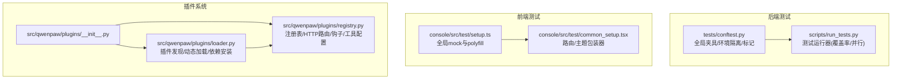
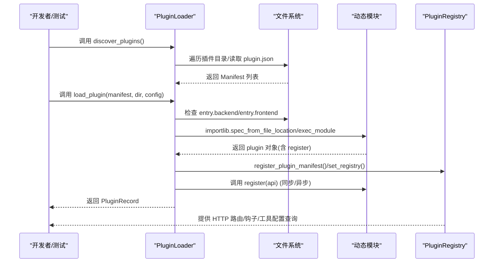
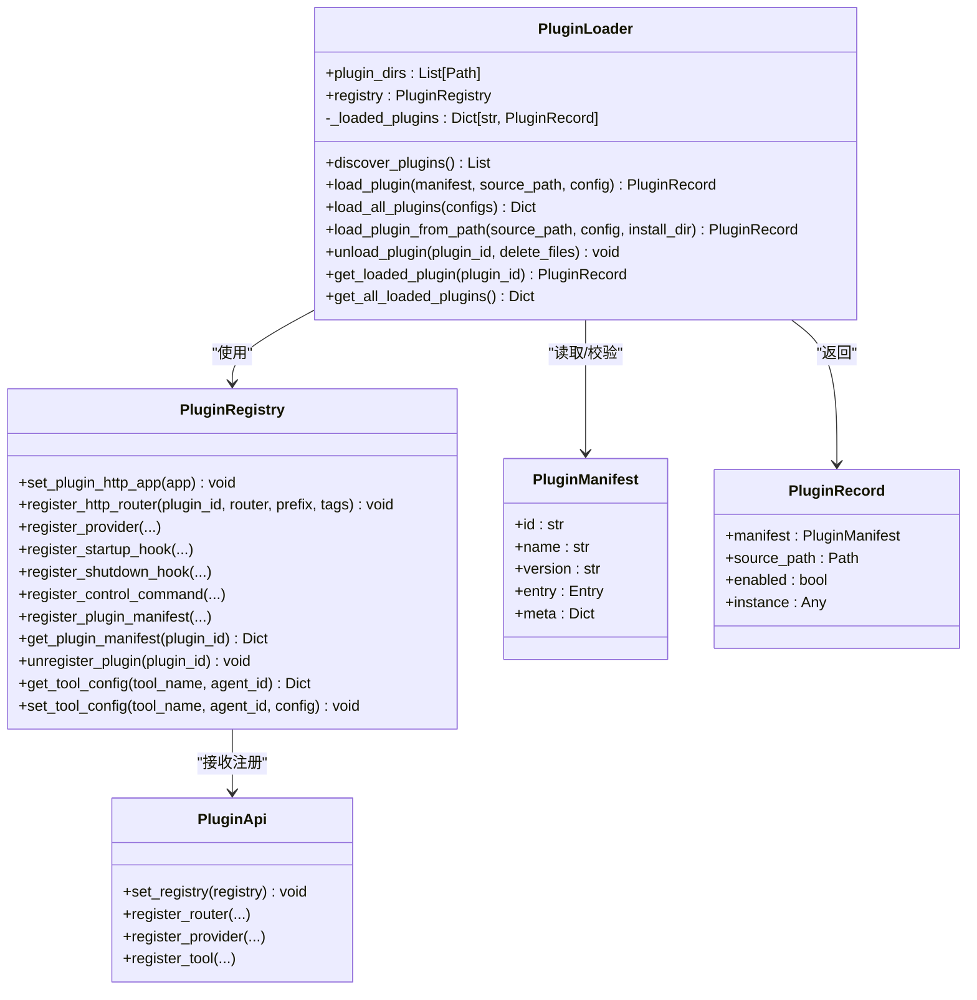
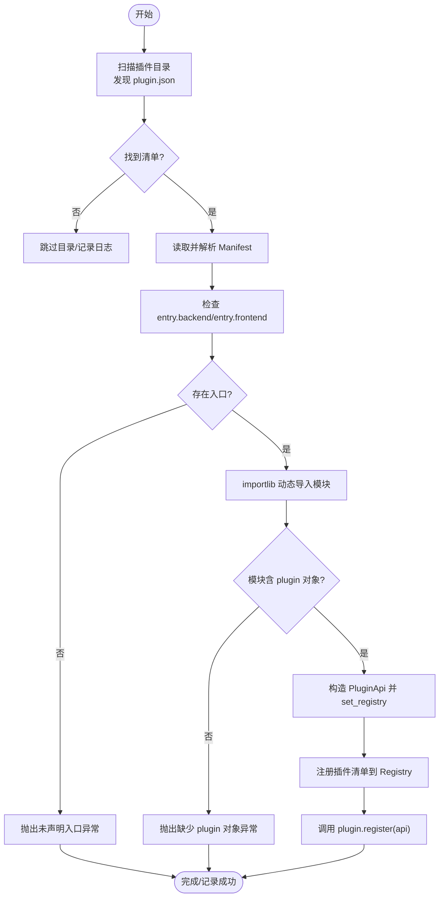
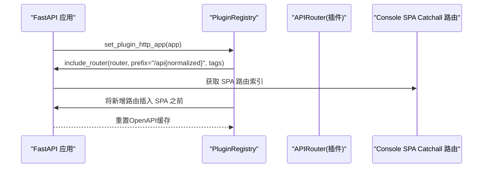
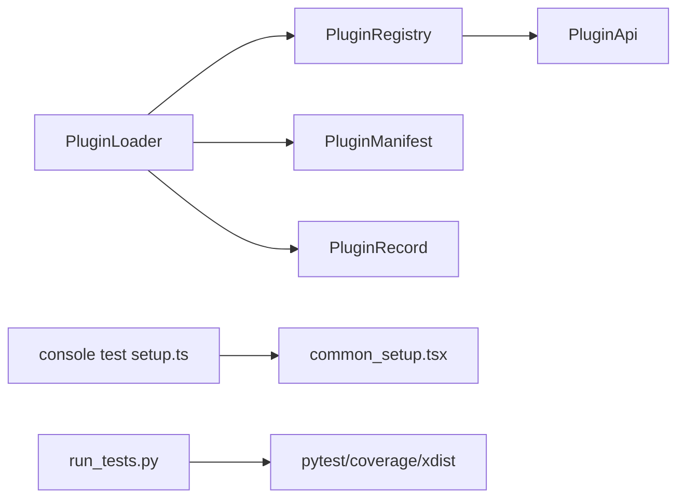

# 插件测试与调试

<cite>
**本文引用的文件**   
- [tests/conftest.py](file://tests/conftest.py)
- [scripts/run_tests.py](file://scripts/run_tests.py)
- [console/src/test/setup.ts](file://console/src/test/setup.ts)
- [console/src/test/common_setup.tsx](file://console/src/test/common_setup.tsx)
- [console/src/api/modules/auth.test.ts](file://console/src/api/modules/auth.test.ts)
- [console/src/stores/agentStore.test.ts](file://console/src/stores/agentStore.test.ts)
- [src/qwenpaw/plugins/__init__.py](file://src/qwenpaw/plugins/__init__.py)
- [src/qwenpaw/plugins/loader.py](file://src/qwenpaw/plugins/loader.py)
- [src/qwenpaw/plugins/registry.py](file://src/qwenpaw/plugins/registry.py)
</cite>

## 目录
1. [简介](#简介)
2. [项目结构](#项目结构)
3. [核心组件](#核心组件)
4. [架构总览](#架构总览)
5. [详细组件分析](#详细组件分析)
6. [依赖分析](#依赖分析)
7. [性能考虑](#性能考虑)
8. [故障排查指南](#故障排查指南)
9. [结论](#结论)
10. [附录](#附录)

## 简介
本指南面向QwenPaw插件的测试与调试，覆盖单元测试、集成测试与端到端测试策略，聚焦插件加载、功能与性能测试方法，并提供调试工具使用技巧（日志、断点、错误追踪）、常见问题诊断与解决方案，以及测试覆盖率与质量保障最佳实践。文档同时给出可直接映射到源码的架构图与流程图，帮助读者快速定位问题与优化路径。

## 项目结构
QwenPaw在后端通过Python实现插件系统，在前端通过Vite+React+Testing Library/Vitest进行组件与API测试。测试框架与脚本分布如下：
- 后端测试：tests目录按单元/集成划分，全局夹具与环境隔离由tests/conftest.py提供；scripts/run_tests.py提供统一的本地测试运行器，支持覆盖率与并行执行。
- 前端测试：console/src/test下提供setup与通用渲染封装，便于组件与API模块测试复用。
- 插件系统：src/qwenpaw/plugins/提供插件发现、加载、注册表与生命周期钩子等核心能力。

图表来源
- [tests/conftest.py:1-431](file://tests/conftest.py#L1-L431)
- [scripts/run_tests.py:1-282](file://scripts/run_tests.py#L1-L282)
- [console/src/test/setup.ts:1-27](file://console/src/test/setup.ts#L1-L27)
- [console/src/test/common_setup.tsx:1-38](file://console/src/test/common_setup.tsx#L1-L38)
- [src/qwenpaw/plugins/__init__.py:1-17](file://src/qwenpaw/plugins/__init__.py#L1-L17)
- [src/qwenpaw/plugins/loader.py:1-628](file://src/qwenpaw/plugins/loader.py#L1-L628)
- [src/qwenpaw/plugins/registry.py:1-598](file://src/qwenpaw/plugins/registry.py#L1-L598)

章节来源
- [tests/conftest.py:1-431](file://tests/conftest.py#L1-L431)
- [scripts/run_tests.py:1-282](file://scripts/run_tests.py#L1-L282)
- [console/src/test/setup.ts:1-27](file://console/src/test/setup.ts#L1-L27)
- [console/src/test/common_setup.tsx:1-38](file://console/src/test/common_setup.tsx#L1-L38)
- [src/qwenpaw/plugins/__init__.py:1-17](file://src/qwenpaw/plugins/__init__.py#L1-L17)

## 核心组件
- 测试运行器与夹具
  - scripts/run_tests.py：支持按子目录运行单元测试、全量测试、覆盖率报告生成、并行执行（需pytest-xdist）。
  - tests/conftest.py：提供临时工作空间、隔离COPAW_HOME、LLM/通道mock、最小配置、进程处理mock、提供器工厂等，自动为不同测试目录打标unit/integration/e2e。
- 前端测试基础
  - console/src/test/setup.ts：为Ant Design组件补齐matchMedia与ResizeObserver。
  - console/src/test/common_setup.tsx：统一App/MemoryRouter包装，便于路由驱动的组件测试。
- 插件系统
  - src/qwenpaw/plugins/__init__.py：导出PluginLoader、PluginRegistry、PluginApi、PluginManifest、PluginRecord、get_tool_config。
  - src/qwenpaw/plugins/loader.py：扫描插件目录、解析plugin.json、动态导入后端入口、调用plugin.register、安装依赖、记录加载状态。
  - src/qwenpaw/plugins/registry.py：集中管理HTTP路由挂载、提供者注册、启动/关闭钩子、控制命令、工具配置读写、插件清单与卸载清理。

章节来源
- [scripts/run_tests.py:1-282](file://scripts/run_tests.py#L1-L282)
- [tests/conftest.py:1-431](file://tests/conftest.py#L1-L431)
- [console/src/test/setup.ts:1-27](file://console/src/test/setup.ts#L1-L27)
- [console/src/test/common_setup.tsx:1-38](file://console/src/test/common_setup.tsx#L1-L38)
- [src/qwenpaw/plugins/__init__.py:1-17](file://src/qwenpaw/plugins/__init__.py#L1-L17)
- [src/qwenpaw/plugins/loader.py:1-628](file://src/qwenpaw/plugins/loader.py#L1-L628)
- [src/qwenpaw/plugins/registry.py:1-598](file://src/qwenpaw/plugins/registry.py#L1-L598)

## 架构总览
下图展示插件系统从“发现→加载→注册→运行”的关键流程，以及与注册表、HTTP路由、工具配置的关系。

图表来源
- [src/qwenpaw/plugins/loader.py:36-262](file://src/qwenpaw/plugins/loader.py#L36-L262)
- [src/qwenpaw/plugins/registry.py:141-214](file://src/qwenpaw/plugins/registry.py#L141-L214)

## 详细组件分析

### 测试运行器与夹具
- 运行器特性
  - 支持按子目录运行单元测试、全量测试、覆盖率HTML/缺失行报告、并行执行（pytest-xdist）。
  - 自动检查pytest可用性，失败时提示安装开发依赖。
- 全局夹具
  - temp_workspace/temp_copaw_home：隔离测试环境，清理敏感变量，确保测试可重复。
  - mock_llm_provider/mock_channel：预置常用行为，便于验证业务逻辑与错误分支。
  - minimal_config：最小化配置模板，用于应用启动类测试。
  - mock_process_handler/mock_channel_config/mock_provider_factory：通道契约测试与提供器工厂。
  - 自动标记：根据路径自动为测试打unit/integration/e2e标签，便于选择性执行。

章节来源
- [scripts/run_tests.py:76-173](file://scripts/run_tests.py#L76-L173)
- [tests/conftest.py:41-117](file://tests/conftest.py#L41-L117)
- [tests/conftest.py:125-239](file://tests/conftest.py#L125-L239)
- [tests/conftest.py:247-268](file://tests/conftest.py#L247-L268)
- [tests/conftest.py:316-395](file://tests/conftest.py#L316-L395)
- [tests/conftest.py:410-431](file://tests/conftest.py#L410-L431)

### 前端测试基础
- setup.ts：补齐matchMedia与ResizeObserver，避免Ant Design组件渲染报错。
- common_setup.tsx：统一App与MemoryRouter包装，便于路由驱动组件测试；提供renderWithProviders便捷函数。

章节来源
- [console/src/test/setup.ts:1-27](file://console/src/test/setup.ts#L1-L27)
- [console/src/test/common_setup.tsx:1-38](file://console/src/test/common_setup.tsx#L1-L38)

### 前端API与状态测试示例
- auth.test.ts：演示对auth接口的登录/注册/状态/更新资料等场景的断言，包括请求体、响应体、错误消息与Authorization头注入。
- agentStore.test.ts：演示Zustand store的状态初始化、增删改查与边界条件（不存在id的更新/删除不抛错）。

章节来源
- [console/src/api/modules/auth.test.ts:1-150](file://console/src/api/modules/auth.test.ts#L1-L150)
- [console/src/stores/agentStore.test.ts:1-115](file://console/src/stores/agentStore.test.ts#L1-L115)

### 插件系统类图

图表来源
- [src/qwenpaw/plugins/loader.py:23-628](file://src/qwenpaw/plugins/loader.py#L23-L628)
- [src/qwenpaw/plugins/registry.py:95-598](file://src/qwenpaw/plugins/registry.py#L95-L598)
- [src/qwenpaw/plugins/__init__.py:4-16](file://src/qwenpaw/plugins/__init__.py#L4-L16)

### 插件加载流程图

图表来源
- [src/qwenpaw/plugins/loader.py:36-238](file://src/qwenpaw/plugins/loader.py#L36-L238)
- [src/qwenpaw/plugins/registry.py:431-451](file://src/qwenpaw/plugins/registry.py#L431-L451)

### 插件HTTP路由挂载序列图

图表来源
- [src/qwenpaw/plugins/registry.py:130-52](file://src/qwenpaw/plugins/registry.py#L130-L52)

## 依赖分析
- 组件耦合
  - PluginLoader与PluginRegistry强耦合：Loader负责加载并将信息注册到Registry；Registry负责集中管理HTTP路由、提供者、钩子与工具配置。
  - 前端测试依赖于setup.ts与common_setup.tsx提供的全局环境与包装器，降低重复代码。
- 外部依赖
  - 运行器依赖pytest、pytest-cov、pytest-xdist（可选）。
  - 插件加载可能触发pip或uv安装依赖，要求系统具备相应包管理器或可访问网络。
- 潜在循环依赖
  - 当前设计中，Loader与Registry相互协作但无直接循环导入；前端测试夹具与被测模块解耦良好。

图表来源
- [src/qwenpaw/plugins/loader.py:23-628](file://src/qwenpaw/plugins/loader.py#L23-L628)
- [src/qwenpaw/plugins/registry.py:95-598](file://src/qwenpaw/plugins/registry.py#L95-L598)
- [console/src/test/setup.ts:1-27](file://console/src/test/setup.ts#L1-L27)
- [console/src/test/common_setup.tsx:1-38](file://console/src/test/common_setup.tsx#L1-L38)
- [scripts/run_tests.py:148-173](file://scripts/run_tests.py#L148-L173)

章节来源
- [src/qwenpaw/plugins/loader.py:23-628](file://src/qwenpaw/plugins/loader.py#L23-L628)
- [src/qwenpaw/plugins/registry.py:95-598](file://src/qwenpaw/plugins/registry.py#L95-L598)
- [console/src/test/setup.ts:1-27](file://console/src/test/setup.ts#L1-L27)
- [console/src/test/common_setup.tsx:1-38](file://console/src/test/common_setup.tsx#L1-L38)
- [scripts/run_tests.py:148-173](file://scripts/run_tests.py#L148-L173)

## 性能考虑
- 并行执行
  - 使用run_tests.py的并行模式（pytest-xdist）提升大规模测试集执行效率；注意资源竞争与共享状态隔离。
- 覆盖率
  - 通过--cov=src/qwenpaw生成覆盖率报告，结合“缺失行”报告定位未覆盖路径，优先补齐关键分支与异常路径。
- 插件加载性能
  - 动态导入与依赖安装可能成为瓶颈；建议在CI中缓存依赖与虚拟环境，减少重复安装时间。
- 前端测试
  - 使用最小化渲染包装与轻量mock，避免不必要的重渲染与副作用。

## 故障排查指南
- 插件未加载/找不到入口
  - 检查plugin.json是否存在且字段完整；确认entry.backend/entry.frontend路径正确；查看Loader日志输出。
- 依赖安装失败
  - 若当前Python环境无pip，尝试uv；若超时，检查网络或手动安装requirements.txt。
- 注册表冲突
  - HTTP前缀冲突会抛出异常；确保每个插件前缀唯一；卸载插件后清理前缀映射。
- 工具配置读取失败
  - get_tool_config依赖agent配置；确认agent存在且工具名匹配；查看日志中的错误堆栈。
- 前端测试报错
  - 缺少matchMedia/ResizeObserver会导致组件渲染失败；确保引入setup.ts；使用renderWithProviders包裹测试UI。

章节来源
- [src/qwenpaw/plugins/loader.py:126-144](file://src/qwenpaw/plugins/loader.py#L126-L144)
- [src/qwenpaw/plugins/loader.py:317-404](file://src/qwenpaw/plugins/loader.py#L317-L404)
- [src/qwenpaw/plugins/registry.py:163-186](file://src/qwenpaw/plugins/registry.py#L163-L186)
- [src/qwenpaw/plugins/registry.py:544-558](file://src/qwenpaw/plugins/registry.py#L544-L558)
- [console/src/test/setup.ts:4-26](file://console/src/test/setup.ts#L4-L26)
- [console/src/test/common_setup.tsx:10-37](file://console/src/test/common_setup.tsx#L10-L37)

## 结论
通过统一的测试运行器、完善的全局夹具与前端测试基础设施，QwenPaw实现了对插件系统的全链路测试支撑。结合覆盖率与并行执行策略，可在保证质量的同时显著提升测试效率。针对插件加载、注册表与工具配置的关键路径，建议持续补充单元与集成测试，配合日志与断点调试，快速定位并修复问题。

## 附录
- 快速开始
  - 运行全部测试：python scripts/run_tests.py
  - 仅运行单元测试：python scripts/run_tests.py -u
  - 生成覆盖率报告：python scripts/run_tests.py -a -c
  - 并行执行：python scripts/run_tests.py -p
- 建议的测试分层
  - 单元：插件加载器、注册表、工具配置读写、API模块（auth等）
  - 集成：插件HTTP路由挂载、提供者注册、控制命令
  - 端到端：Console路由驱动的组件交互、用户操作流
- 质量保障最佳实践
  - 为每个新插件提供最小化契约测试与加载/卸载流程测试
  - 为关键分支与异常路径编写断言，保持覆盖率稳定提升
  - 使用mock隔离外部依赖，确保测试可重复
  - 在PR中强制覆盖率阈值与关键模块必测清单