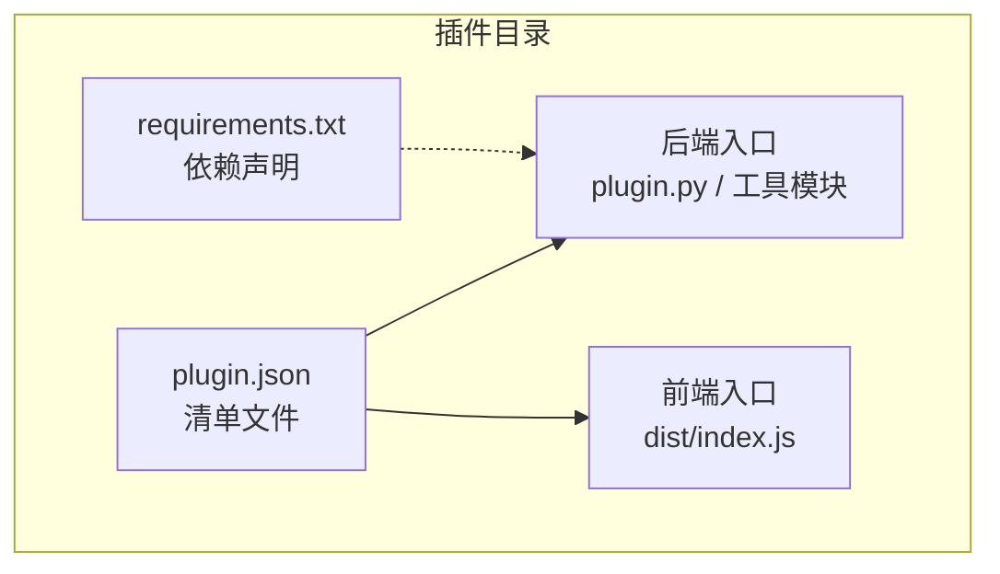
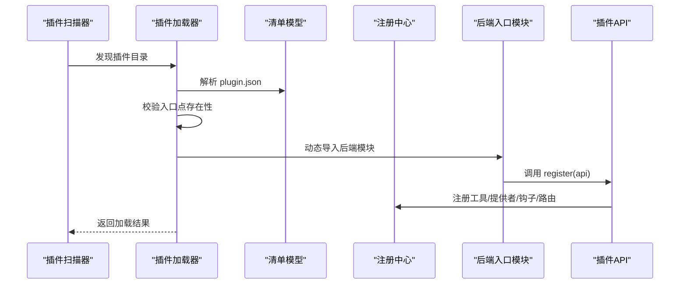
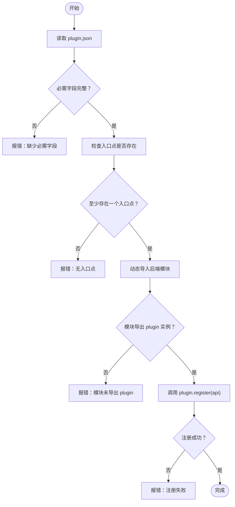
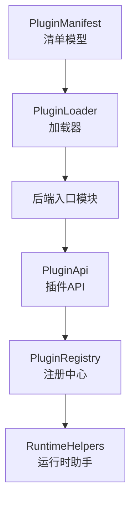

# 插件清单配置

<cite>
**本文档引用的文件**
- [plugin.json（GPT 图像 2）](file://plugins/tool/gpt-image2/plugin.json)
- [plugin.json（Qwen 图像）](file://plugins/tool/qwen-image/plugin.json)
- [plugin.json（Wan 2.7 视频）](file://plugins/tool/wan27/plugin.json)
- [插件架构定义](file://src/qwenpaw/plugins/architecture.py)
- [插件加载器](file://src/qwenpaw/plugins/loader.py)
- [插件 API](file://src/qwenpaw/plugins/api.py)
- [插件注册表](file://src/qwenpaw/plugins/registry.py)
- [插件运行时助手](file://src/qwenpaw/plugins/runtime.py)
- [GPT 图像 2 工具实现](file://plugins/tool/gpt-image2/gpt_image2_tool.py)
- [Qwen 图像 工具实现](file://plugins/tool/qwen-image/qwen_image_tool.py)
- [Wan 2.7 工具实现](file://plugins/tool/wan27/wan27_tool.py)
- [CLI 插件命令](file://src/qwenpaw/cli/plugin_commands.py)
- [插件文档示例](file://website/public/docs/plugins.en.md)
</cite>

## 目录
1. [简介](#简介)
2. [项目结构](#项目结构)
3. [核心组件](#核心组件)
4. [架构总览](#架构总览)
5. [详细组件分析](#详细组件分析)
6. [依赖关系分析](#依赖关系分析)
7. [性能考虑](#性能考虑)
8. [故障排除指南](#故障排除指南)
9. [结论](#结论)
10. [附录](#附录)

## 简介
本指南面向希望为 QwenPaw 开发或集成插件的开发者，系统性讲解 plugin.json 插件清单文件的结构与配置方法。内容涵盖必需字段与可选字段、插件元数据（meta）配置、入口点（entry）设置（前端与后端）、配置示例、常见错误与解决方案、配置验证规则及最佳实践。

## 项目结构
QwenPaw 的插件体系由“清单文件 + 后端入口 + 可选前端入口 + 依赖声明”构成。典型插件目录结构如下：
- plugin.json：插件清单，描述插件基本信息、入口点、依赖与元数据
- 后端入口文件（如 plugin.py 或具体工具模块）：动态导入并注册插件能力
- 前端入口文件（如 dist/index.js）：仅前端插件使用
- requirements.txt：Python 依赖（可选）

**图表来源**
- [插件加载器:36-69](file://src/qwenpaw/plugins/loader.py#L36-L69)
- [插件架构定义:36-63](file://src/qwenpaw/plugins/architecture.py#L36-L63)

**章节来源**
- [插件加载器:36-69](file://src/qwenpaw/plugins/loader.py#L36-L69)
- [插件架构定义:36-63](file://src/qwenpaw/plugins/architecture.py#L36-L63)

## 核心组件
- 清单解析与模型：PluginManifest 定义了插件清单的数据结构，支持从 JSON 字典构建对象，并推断插件类型。
- 加载流程：PluginLoader 负责扫描插件目录、读取 plugin.json、校验入口点、动态导入后端模块并调用插件注册接口。
- 注册接口：PluginApi 提供注册工具、提供者、钩子、HTTP 路由、控制命令等能力。
- 注册中心：PluginRegistry 统一管理插件注册信息，提供查询、卸载、HTTP 路由挂载等功能。
- 运行时助手：RuntimeHelpers 提供日志、提供者访问等辅助能力。

**章节来源**
- [插件架构定义:44-131](file://src/qwenpaw/plugins/architecture.py#L44-L131)
- [插件加载器:23-262](file://src/qwenpaw/plugins/loader.py#L23-L262)
- [插件 API:48-401](file://src/qwenpaw/plugins/api.py#L48-L401)
- [插件注册表:95-598](file://src/qwenpaw/plugins/registry.py#L95-L598)
- [插件运行时助手:10-68](file://src/qwenpaw/plugins/runtime.py#L10-L68)

## 架构总览
下图展示了从发现插件到加载完成的关键步骤与组件交互：

**图表来源**
- [插件加载器:36-238](file://src/qwenpaw/plugins/loader.py#L36-L238)
- [插件架构定义:92-131](file://src/qwenpaw/plugins/architecture.py#L92-L131)
- [插件 API:287-401](file://src/qwenpaw/plugins/api.py#L287-L401)
- [插件注册表:141-214](file://src/qwenpaw/plugins/registry.py#L141-L214)

## 详细组件分析

### plugin.json 结构与字段详解
- 必需字段
  - id：插件唯一标识符，用于区分不同插件
  - name：插件显示名称
  - version：插件版本号
- 可选字段
  - description：插件描述
  - author：作者信息
  - type：插件类型（tool/provider/hook/command/frontend/general），未指定时将根据 meta 或入口点推断
  - entry：入口点配置，包含 backend（后端入口）与 frontend（前端入口）
  - dependencies：Python 依赖列表（如 ["httpx>=0.24.0"]）
  - min_version：最低兼容版本
  - meta：插件元数据，承载工具定义、UI 提示、API 文档链接等
- 元数据（meta）配置要点
  - tools：工具数组，每个工具包含 name、description、icon、requires_config、config_fields 等
  - config_fields：工具配置项数组，支持类型（password/text/number/select）、是否必填、默认值、范围限制、占位符与帮助文本
  - api_key_url / api_key_hint / model_url：用于 UI 展示的外部链接与提示
- 入口点（entry）
  - backend：后端入口文件路径（相对插件目录）
  - frontend：前端入口文件路径（相对插件目录，仅前端插件使用）

参考示例文件：
- [plugin.json（GPT 图像 2）:1-89](file://plugins/tool/gpt-image2/plugin.json#L1-L89)
- [plugin.json（Qwen 图像）:1-129](file://plugins/tool/qwen-image/plugin.json#L1-L129)
- [plugin.json（Wan 2.7 视频）:1-122](file://plugins/tool/wan27/plugin.json#L1-L122)

**章节来源**
- [插件架构定义:44-131](file://src/qwenpaw/plugins/architecture.py#L44-L131)
- [插件加载器:109-157](file://src/qwenpaw/plugins/loader.py#L109-L157)
- [插件注册表:505-529](file://src/qwenpaw/plugins/registry.py#L505-L529)
- [插件文档示例:86-165](file://website/public/docs/plugins.en.md#L86-L165)

### 元数据（meta）配置详解
- tools 数组：定义一个或多个工具函数，每个工具包含以下关键属性：
  - name：工具函数名（需与后端注册一致）
  - description：工具功能描述（UI 显示）
  - icon：工具图标（emoji）
  - requires_config：是否需要用户配置
  - config_fields：配置项数组，支持多种输入类型与约束
- config_fields 字段类型与约束
  - 类型：password、text、number、select
  - 必填：required
  - 默认值：default（select）
  - 数值范围：min/max（number）
  - 选项：options（select）
  - 占位符：placeholder
  - 帮助文本：help
- api_key_url / api_key_hint / model_url：用于引导用户获取密钥与查看模型文档

参考示例：
- [Qwen 图像 meta 配置:12-127](file://plugins/tool/qwen-image/plugin.json#L12-L127)
- [Wan 2.7 meta 配置:12-120](file://plugins/tool/wan27/plugin.json#L12-L120)

**章节来源**
- [插件架构定义:44-131](file://src/qwenpaw/plugins/architecture.py#L44-L131)
- [Qwen 图像插件清单:12-127](file://plugins/tool/qwen-image/plugin.json#L12-L127)
- [Wan 2.7 插件清单:12-120](file://plugins/tool/wan27/plugin.json#L12-L120)

### 入口点（entry）配置
- 后端入口（backend）
  - 必须存在且可被动态导入
  - 模块需导出名为 plugin 的实例，该实例包含 register(api) 方法
- 前端入口（frontend）
  - 仅前端插件使用，指向打包后的 JS 文件
- 兼容性
  - 若未显式声明 type，将通过 meta 或入口点进行推断

参考示例：
- [GPT 图像 2 后端入口:62-64](file://plugins/tool/gpt-image2/gpt_image2.py#L62-L64)
- [Qwen 图像 后端入口:61-63](file://plugins/tool/qwen-image/qwen_image.py#L61-L63)
- [Wan 2.7 后端入口:68-70](file://plugins/tool/wan27/wan27.py#L68-L70)

**章节来源**
- [插件加载器:115-238](file://src/qwenpaw/plugins/loader.py#L115-L238)
- [GPT 图像 2 后端入口:62-64](file://plugins/tool/gpt-image2/gpt_image2.py#L62-L64)
- [Qwen 图像 后端入口:61-63](file://plugins/tool/qwen-image/qwen_image.py#L61-L63)
- [Wan 2.7 后端入口:68-70](file://plugins/tool/wan27/wan27.py#L68-L70)

### 插件类型与推断
- 显式类型：type 字段
- 推断逻辑：若未指定 type，则依据 meta 或入口点推断
  - meta 中存在 tools/tool_name → tool
  - meta 中存在 provider_id/chat_model → provider
  - meta 中存在 hook_type → hook
  - meta 中存在 command_name/commands → command
  - 存在 frontend 入口 → frontend
  - 否则 → general

参考实现：
- [类型推断逻辑:65-91](file://src/qwenpaw/plugins/architecture.py#L65-L91)

**章节来源**
- [插件架构定义:65-91](file://src/qwenpaw/plugins/architecture.py#L65-L91)

### 配置验证与加载流程
- 清单校验
  - 必需字段检查（id/name/version）
  - 入口点存在性检查（backend/frontend 至少一个）
- 动态导入
  - 使用 importlib.spec_from_file_location 动态导入后端模块
  - 确保模块导出 plugin 实例并实现 register(api)
- 注册与挂载
  - 通过 PluginApi.register_* 将工具/提供者/钩子/路由注册到 PluginRegistry
  - HTTP 路由按优先级插入应用路由表

**图表来源**
- [插件加载器:71-238](file://src/qwenpaw/plugins/loader.py#L71-L238)
- [插件 API:287-401](file://src/qwenpaw/plugins/api.py#L287-L401)

**章节来源**
- [插件加载器:71-238](file://src/qwenpaw/plugins/loader.py#L71-L238)
- [插件 API:287-401](file://src/qwenpaw/plugins/api.py#L287-L401)

### 工具配置与使用
- 工具配置获取
  - 在工具函数中通过 get_tool_config 获取当前代理的工具配置
  - 支持从 agent 配置中读取工具参数（如 API Key、超时、端点等）
- 工具注册
  - 通过 PluginApi.register_tool 将工具函数注册到 Agent 的工具集中
  - 工具默认禁用，需用户手动启用

参考实现：
- [GPT 图像 2 工具函数:20-243](file://plugins/tool/gpt-image2/gpt_image2_tool.py#L20-L243)
- [Qwen 图像 工具函数:241-470](file://plugins/tool/qwen-image/qwen_image_tool.py#L241-L470)
- [Wan 2.7 工具函数:178-375](file://plugins/tool/wan27/wan27_tool.py#L178-L375)

**章节来源**
- [插件 API:10-46](file://src/qwenpaw/plugins/api.py#L10-L46)
- [GPT 图像 2 工具实现:20-243](file://plugins/tool/gpt-image2/gpt_image2_tool.py#L20-L243)
- [Qwen 图像 工具实现:241-470](file://plugins/tool/qwen-image/qwen_image_tool.py#L241-L470)
- [Wan 2.7 工具实现:178-375](file://plugins/tool/wan27/wan27_tool.py#L178-L375)

## 依赖关系分析
- 插件清单依赖于后端入口模块；后端入口模块通过 PluginApi 与 PluginRegistry 交互
- 插件类型推断依赖于 meta 与入口点；入口点缺失会导致加载失败
- HTTP 路由注册依赖于已设置的 FastAPI 应用实例

**图表来源**
- [插件架构定义:44-131](file://src/qwenpaw/plugins/architecture.py#L44-L131)
- [插件加载器:23-262](file://src/qwenpaw/plugins/loader.py#L23-L262)
- [插件 API:48-401](file://src/qwenpaw/plugins/api.py#L48-L401)
- [插件注册表:95-598](file://src/qwenpaw/plugins/registry.py#L95-L598)
- [插件运行时助手:10-68](file://src/qwenpaw/plugins/runtime.py#L10-L68)

**章节来源**
- [插件架构定义:44-131](file://src/qwenpaw/plugins/architecture.py#L44-L131)
- [插件加载器:23-262](file://src/qwenpaw/plugins/loader.py#L23-L262)
- [插件注册表:95-598](file://src/qwenpaw/plugins/registry.py#L95-L598)

## 性能考虑
- 异步 I/O：工具函数普遍采用异步 HTTP 客户端（如 httpx.AsyncClient），避免阻塞事件循环
- 超时控制：工具配置支持超时参数，建议根据服务特性合理设置
- 并发下载：视频/图像生成后通常需要下载到本地，采用流式下载减少内存占用
- 依赖安装：插件依赖通过 pip/uv 安装，建议在 CI/CD 中缓存依赖以提升安装速度

[本节为通用指导，不直接分析具体文件]

## 故障排除指南
- 常见错误与解决
  - 缺少必需字段：确保 id、name、version 存在
  - 入口点不存在：检查 backend 或 frontend 路径是否正确
  - 模块未导出 plugin：确认后端入口模块导出 plugin 实例
  - 未实现 register(api)：确保 plugin 实例包含 register 方法
  - 依赖安装失败：检查 requirements.txt 语法与网络环境
- CLI 查看插件清单
  - 使用 CLI 命令查看插件清单与依赖，便于快速定位问题

参考实现：
- [CLI 插件命令（查看清单）:715-746](file://src/qwenpaw/cli/plugin_commands.py#L715-L746)

**章节来源**
- [插件加载器:109-157](file://src/qwenpaw/plugins/loader.py#L109-L157)
- [CLI 插件命令:715-746](file://src/qwenpaw/cli/plugin_commands.py#L715-L746)

## 结论
plugin.json 是 QwenPaw 插件生态的核心配置文件。通过规范的字段定义、严谨的入口点配置与完善的元数据描述，开发者可以快速构建高质量的插件。遵循本文档的配置规则与最佳实践，可显著降低集成成本并提升稳定性。

[本节为总结性内容，不直接分析具体文件]

## 附录

### 完整配置示例（基于仓库现有插件）
- GPT 图像 2 插件清单
  - [plugin.json（GPT 图像 2）:1-89](file://plugins/tool/gpt-image2/plugin.json#L1-L89)
- Qwen 图像 插件清单
  - [plugin.json（Qwen 图像）:1-129](file://plugins/tool/qwen-image/plugin.json#L1-L129)
- Wan 2.7 视频 插件清单
  - [plugin.json（Wan 2.7 视频）:1-122](file://plugins/tool/wan27/plugin.json#L1-L122)

### 配置验证规则清单
- 必需字段：id、name、version
- 可选字段：description、author、type、entry、dependencies、min_version、meta
- 元数据 tools：name、description、icon、requires_config、config_fields
- config_fields：name、label、type、required、default/placeholder/help/min/max/options
- 元数据扩展：api_key_url、api_key_hint、model_url
- 入口点：backend（后端）、frontend（前端，仅前端插件）

**章节来源**
- [插件架构定义:44-131](file://src/qwenpaw/plugins/architecture.py#L44-L131)
- [插件加载器:109-157](file://src/qwenpaw/plugins/loader.py#L109-L157)
- [插件文档示例:86-165](file://website/public/docs/plugins.en.md#L86-L165)