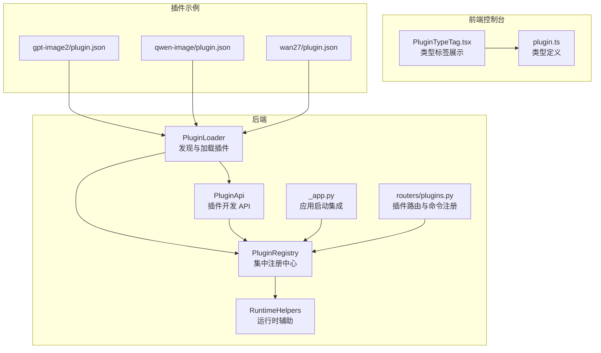
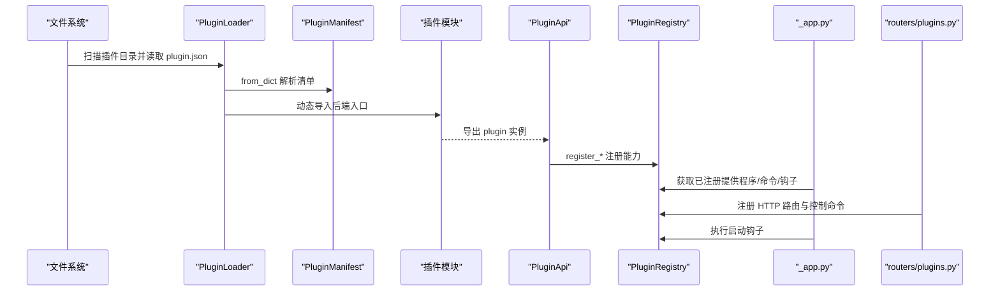
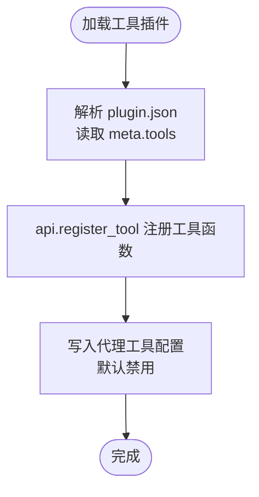
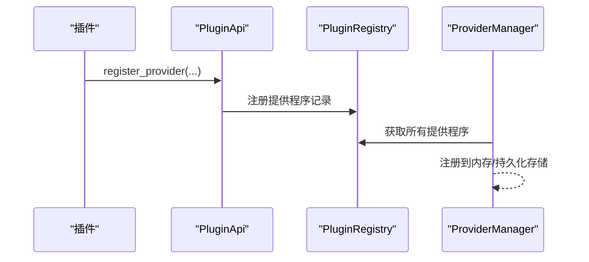
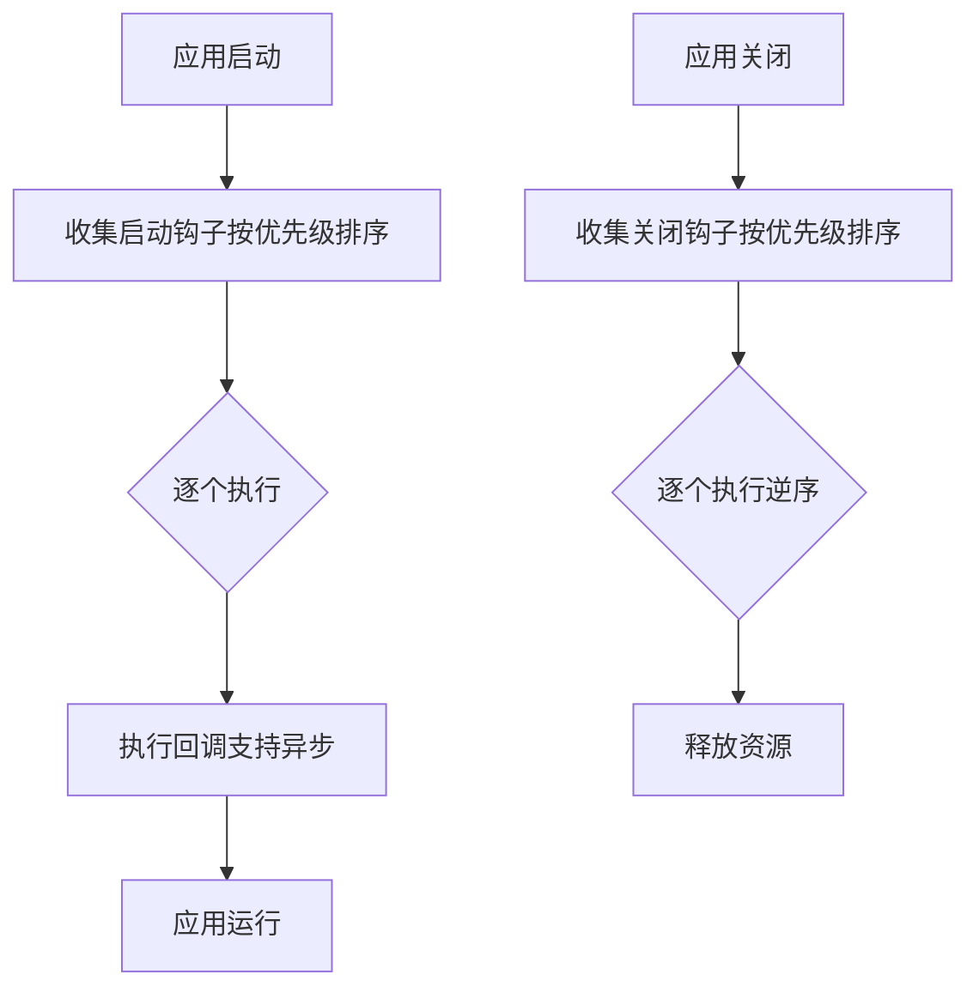
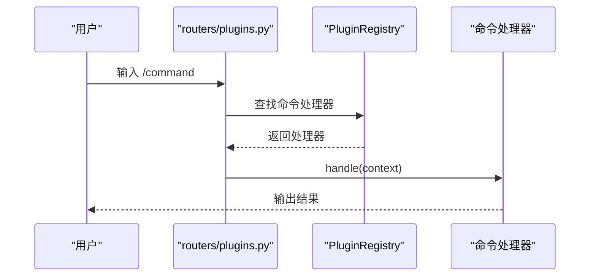
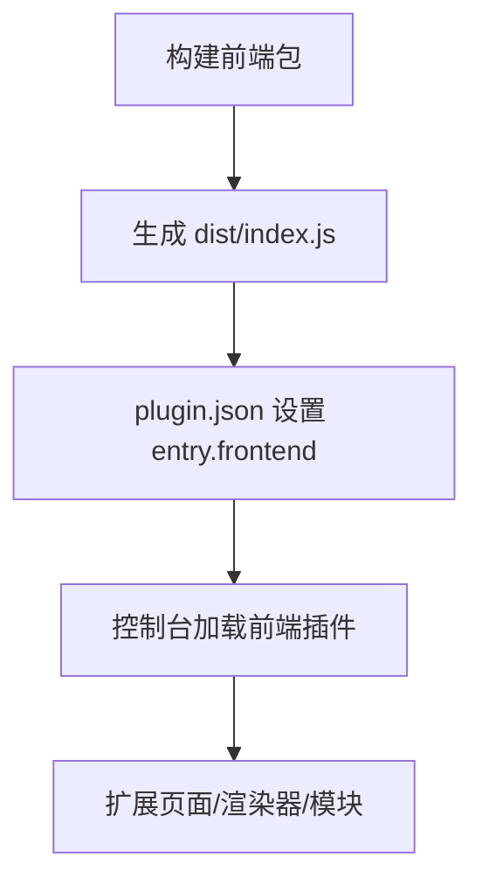
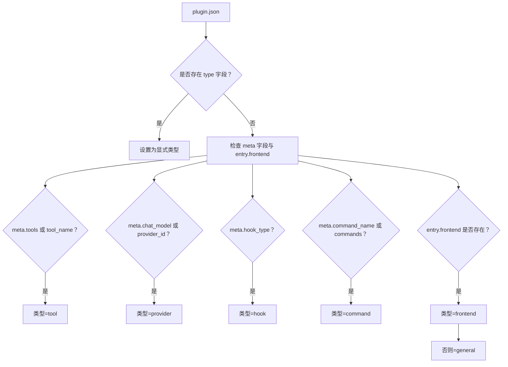

# 插件类型概览

<cite>
**本文引用的文件**
- [architecture.py](file://src/qwenpaw/plugins/architecture.py)
- [loader.py](file://src/qwenpaw/plugins/loader.py)
- [registry.py](file://src/qwenpaw/plugins/registry.py)
- [api.py](file://src/qwenpaw/plugins/api.py)
- [runtime.py](file://src/qwenpaw/plugins/runtime.py)
- [_app.py](file://src/qwenpaw/app/_app.py)
- [plugins.py](file://src/qwenpaw/app/routers/plugins.py)
- [plugin.json（gpt-image2）](file://plugins/tool/gpt-image2/plugin.json)
- [plugin.json（qwen-image）](file://plugins/tool/qwen-image/plugin.json)
- [plugin.json（wan27）](file://plugins/tool/wan27/plugin.json)
- [gpt_image2.py](file://plugins/tool/gpt-image2/gpt_image2.py)
- [qwen_image.py](file://plugins/tool/qwen-image/qwen_image.py)
- [PluginTypeTag.tsx](file://console/src/pages/Settings/PluginManager/components/PluginTypeTag.tsx)
- [plugin.ts](file://console/src/api/modules/plugin.ts)
- [plugins.en.md](file://website/public/docs/plugins.en.md)
</cite>

## 目录
1. [简介](#简介)
2. [项目结构](#项目结构)
3. [核心组件](#核心组件)
4. [架构总览](#架构总览)
5. [详细组件分析](#详细组件分析)
6. [依赖分析](#依赖分析)
7. [性能考虑](#性能考虑)
8. [故障排查指南](#故障排查指南)
9. [结论](#结论)
10. [附录](#附录)

## 简介
本文件为 QwenPaw 插件系统的“插件类型概览”，聚焦于五种主要插件类型：工具插件（tool）、提供程序插件（provider）、钩子插件（hook）、命令插件（command）与前端插件（frontend）。文档从系统架构、类型识别机制、元数据推断规则、基本结构示例、配置要点到选择指南与最佳实践进行完整阐述，帮助开发者快速理解并正确使用插件体系。

## 项目结构
QwenPaw 的插件系统由后端 Python 模块与前端控制台共同组成：
- 后端负责插件发现、加载、注册与生命周期管理
- 前端控制台展示插件列表、类型标签与安装管理
- 插件以目录形式存放，每个插件包含 plugin.json 清单与后端入口（可选前端入口）

图示来源
- [loader.py:23-263](file://src/qwenpaw/plugins/loader.py#L23-L263)
- [registry.py:95-598](file://src/qwenpaw/plugins/registry.py#L95-L598)
- [api.py:48-401](file://src/qwenpaw/plugins/api.py#L48-L401)
- [_app.py:355-419](file://src/qwenpaw/app/_app.py#L355-L419)
- [plugins.py:171-205](file://src/qwenpaw/app/routers/plugins.py#L171-L205)
- [PluginTypeTag.tsx:12-46](file://console/src/pages/Settings/PluginManager/components/PluginTypeTag.tsx#L12-L46)
- [plugin.ts:4-11](file://console/src/api/modules/plugin.ts#L4-L11)
- [plugin.json（gpt-image2）:1-89](file://plugins/tool/gpt-image2/plugin.json#L1-L89)
- [plugin.json（qwen-image）:1-129](file://plugins/tool/qwen-image/plugin.json#L1-L129)
- [plugin.json（wan27）:1-122](file://plugins/tool/wan27/plugin.json#L1-L122)

章节来源
- [loader.py:23-263](file://src/qwenpaw/plugins/loader.py#L23-L263)
- [registry.py:95-598](file://src/qwenpaw/plugins/registry.py#L95-L598)
- [api.py:48-401](file://src/qwenpaw/plugins/api.py#L48-L401)
- [_app.py:355-419](file://src/qwenpaw/app/_app.py#L355-L419)
- [plugins.py:171-205](file://src/qwenpaw/app/routers/plugins.py#L171-L205)
- [PluginTypeTag.tsx:12-46](file://console/src/pages/Settings/PluginManager/components/PluginTypeTag.tsx#L12-L46)
- [plugin.ts:4-11](file://console/src/api/modules/plugin.ts#L4-L11)

## 核心组件
- 插件类型枚举与清单
  - 类型枚举：tool、provider、hook、command、frontend、general
  - 清单字段：id、name、version、description、author、entry、dependencies、min_version、meta、plugin_type
- 加载器：扫描目录、解析清单、动态导入后端模块、调用插件注册方法
- 注册中心：集中管理提供程序、启动/关闭钩子、控制命令、HTTP 路由、插件清单与工具配置
- 插件 API：提供注册能力的统一接口（工具、提供程序、钩子、HTTP 路由、控制命令）
- 运行时辅助：提供日志、提供商访问等便捷函数
- 应用集成：在启动阶段注册插件提供的能力，并执行启动钩子

章节来源
- [architecture.py:10-34](file://src/qwenpaw/plugins/architecture.py#L10-L34)
- [architecture.py:44-131](file://src/qwenpaw/plugins/architecture.py#L44-L131)
- [loader.py:23-263](file://src/qwenpaw/plugins/loader.py#L23-L263)
- [registry.py:95-598](file://src/qwenpaw/plugins/registry.py#L95-L598)
- [api.py:48-401](file://src/qwenpaw/plugins/api.py#L48-L401)
- [runtime.py:10-68](file://src/qwenpaw/plugins/runtime.py#L10-L68)
- [_app.py:355-419](file://src/qwenpaw/app/_app.py#L355-L419)

## 架构总览
下图展示了插件从发现到注册、再到运行时生效的关键流程。

图示来源
- [loader.py:36-238](file://src/qwenpaw/plugins/loader.py#L36-L238)
- [architecture.py:92-131](file://src/qwenpaw/plugins/architecture.py#L92-L131)
- [api.py:81-243](file://src/qwenpaw/plugins/api.py#L81-L243)
- [registry.py:249-430](file://src/qwenpaw/plugins/registry.py#L249-L430)
- [_app.py:355-419](file://src/qwenpaw/app/_app.py#L355-L419)
- [plugins.py:171-205](file://src/qwenpaw/app/routers/plugins.py#L171-L205)

## 详细组件分析

### 工具插件（tool）
- 核心功能
  - 将工具函数注册到代理工具箱，使大模型可在提示中调用
  - 支持多工具批量注册，自动写入代理配置并默认禁用，便于用户按需启用
- 元数据与配置
  - 清单中通过 meta.tools 定义工具名称、描述、图标、是否需要配置及配置字段
  - 可通过 get_tool_config 获取当前代理对该工具的配置
- 开发要点
  - 后端入口导出 plugin 实例，调用 api.register_tool 完成注册
  - 工具函数可同步或异步；建议默认禁用，让用户显式启用
- 示例与参考
  - gpt-image2、qwen-image、wan27 等图像/视频生成工具插件
  - 清单中包含多个工具条目与配置字段定义

图示来源
- [api.py:287-401](file://src/qwenpaw/plugins/api.py#L287-L401)
- [registry.py:505-529](file://src/qwenpaw/plugins/registry.py#L505-L529)
- [plugin.json（gpt-image2）:13-88](file://plugins/tool/gpt-image2/plugin.json#L13-L88)
- [plugin.json（qwen-image）:12-128](file://plugins/tool/qwen-image/plugin.json#L12-L128)
- [plugin.json（wan27）:12-122](file://plugins/tool/wan27/plugin.json#L12-L122)

章节来源
- [api.py:287-401](file://src/qwenpaw/plugins/api.py#L287-L401)
- [registry.py:505-529](file://src/qwenpaw/plugins/registry.py#L505-L529)
- [plugin.json（gpt-image2）:1-89](file://plugins/tool/gpt-image2/plugin.json#L1-L89)
- [plugin.json（qwen-image）:1-129](file://plugins/tool/qwen-image/plugin.json#L1-L129)
- [plugin.json（wan27）:1-122](file://plugins/tool/wan27/plugin.json#L1-L122)

### 提供程序插件（provider）
- 核心功能
  - 注册自定义 LLM 提供程序，扩展可用模型与推理后端
  - 提供程序信息包含 provider_id、类、显示名、基础 URL 与元数据
- 元数据与配置
  - 清单中通过 meta.provider_id 或 meta.chat_model 标识提供程序类型
  - 运行时可通过 RuntimeHelpers 访问提供商实例
- 开发要点
  - 使用 api.register_provider 完成注册
  - 注意 provider_id 唯一性，避免冲突
- 应用集成
  - 启动阶段将插件提供程序注入 ProviderManager，UI 中可见

图示来源
- [api.py:81-126](file://src/qwenpaw/plugins/api.py#L81-L126)
- [registry.py:249-308](file://src/qwenpaw/plugins/registry.py#L249-L308)
- [_app.py:355-369](file://src/qwenpaw/app/_app.py#L355-L369)

章节来源
- [api.py:81-126](file://src/qwenpaw/plugins/api.py#L81-L126)
- [registry.py:249-308](file://src/qwenpaw/plugins/registry.py#L249-L308)
- [_app.py:355-369](file://src/qwenpaw/app/_app.py#L355-L369)

### 钩子插件（hook）
- 核心功能
  - 在应用启动/关闭阶段执行自定义逻辑，如初始化 SDK、清理资源
- 元数据与配置
  - 清单中通过 meta.hook_type 标识钩子类型（系统保留字段）
- 开发要点
  - 使用 api.register_startup_hook / api.register_shutdown_hook 注册
  - 启动钩子按优先级升序执行，关闭钩子按优先级降序执行

图示来源
- [api.py:127-189](file://src/qwenpaw/plugins/api.py#L127-L189)
- [registry.py:325-397](file://src/qwenpaw/plugins/registry.py#L325-L397)
- [_app.py:404-419](file://src/qwenpaw/app/_app.py#L404-L419)

章节来源
- [api.py:127-189](file://src/qwenpaw/plugins/api.py#L127-L189)
- [registry.py:325-397](file://src/qwenpaw/plugins/registry.py#L325-L397)
- [_app.py:404-419](file://src/qwenpaw/app/_app.py#L404-L419)

### 命令插件（command）
- 核心功能
  - 注册系统控制命令处理器，扩展 /slash 命令集
- 元数据与配置
  - 清单中通过 meta.command_name 或 meta.commands 标识命令
- 开发要点
  - 使用 api.register_control_command 注册命令处理器
  - 命令名需唯一，支持优先级设置

图示来源
- [api.py:222-243](file://src/qwenpaw/plugins/api.py#L222-L243)
- [registry.py:399-430](file://src/qwenpaw/plugins/registry.py#L399-L430)
- [plugins.py:171-205](file://src/qwenpaw/app/routers/plugins.py#L171-L205)

章节来源
- [api.py:222-243](file://src/qwenpaw/plugins/api.py#L222-L243)
- [registry.py:399-430](file://src/qwenpaw/plugins/registry.py#L399-L430)
- [plugins.py:171-205](file://src/qwenpaw/app/routers/plugins.py#L171-L205)

### 前端插件（frontend）
- 核心功能
  - 动态加载前端 JS 包，扩展控制台界面与交互
- 结构与清单
  - 清单中 entry.frontend 指向构建产物入口
  - 控制台通过 window.QwenPaw.host 与共享库交互
- 开发要点
  - 构建时外部化 React/antd，使用经典 JSX 编译模式
  - 通过注册路由、工具渲染器等方式扩展 UI

图示来源
- [plugins.en.md:139-262](file://website/public/docs/plugins.en.md#L139-L262)
- [plugin.json（gpt-image2）:8-10](file://plugins/tool/gpt-image2/plugin.json#L8-L10)
- [plugin.json（qwen-image）:7-9](file://plugins/tool/qwen-image/plugin.json#L7-L9)

章节来源
- [plugins.en.md:139-262](file://website/public/docs/plugins.en.md#L139-L262)
- [plugin.json（gpt-image2）:1-89](file://plugins/tool/gpt-image2/plugin.json#L1-L89)
- [plugin.json（qwen-image）:1-129](file://plugins/tool/qwen-image/plugin.json#L1-L129)

## 依赖分析
- 插件类型识别与元数据推断
  - 显式 type 字段优先：若存在则直接映射到对应类型
  - 元数据回退：根据 meta 字段与入口点推断类型（工具/提供程序/钩子/命令/前端）
- 插件加载与注册
  - 加载器负责发现与加载，注册中心统一管理生命周期与能力
  - 应用启动时集中注册提供程序、命令与执行启动钩子

图示来源
- [architecture.py:65-131](file://src/qwenpaw/plugins/architecture.py#L65-L131)

章节来源
- [architecture.py:65-131](file://src/qwenpaw/plugins/architecture.py#L65-L131)

## 性能考虑
- 异步钩子与工具：支持异步回调与工具函数，避免阻塞事件循环
- 依赖安装：加载器支持 pip 与 uv 两种方式安装依赖，超时保护与错误提示
- 路由挂载：HTTP 路由在 FastAPI 应用中插入，确保在 SPA 路由之前匹配
- 工具配置：按代理维度缓存与读取工具配置，减少重复 IO

章节来源
- [loader.py:295-405](file://src/qwenpaw/plugins/loader.py#L295-L405)
- [registry.py:130-214](file://src/qwenpaw/plugins/registry.py#L130-L214)
- [api.py:287-401](file://src/qwenpaw/plugins/api.py#L287-L401)

## 故障排查指南
- 插件未加载
  - 检查 plugin.json 是否存在且格式正确
  - 确认 entry.backend 或 entry.frontend 文件路径有效
  - 查看后端日志中的加载失败原因
- 提供程序冲突
  - provider_id 必须唯一，避免重复注册
- 命令冲突
  - 命令名需唯一，避免覆盖内置命令
- 前端插件不生效
  - 确认 entry.frontend 指向正确的构建产物
  - 检查控制台是否成功加载前端包
- 工具未出现在代理工具箱
  - 确认 api.register_tool 已被调用
  - 检查代理配置中工具是否被禁用

章节来源
- [loader.py:115-145](file://src/qwenpaw/plugins/loader.py#L115-L145)
- [registry.py:271-277](file://src/qwenpaw/plugins/registry.py#L271-L277)
- [plugins.py:171-205](file://src/qwenpaw/app/routers/plugins.py#L171-L205)
- [plugins.en.md:139-262](file://website/public/docs/plugins.en.md#L139-L262)

## 结论
QwenPaw 的插件系统以清晰的类型划分与统一的注册中心为核心，结合清单驱动的发现与加载机制，实现了对工具、提供程序、钩子、命令与前端扩展的全栈支持。遵循本文档的类型识别规则、开发要点与最佳实践，可高效构建稳定可靠的插件生态。

## 附录

### 插件类型选择指南
- 工具插件（tool）
  - 适用场景：为代理提供具体可调用的工具函数（如图像生成、视频生成）
  - 选择依据：清单中 meta.tools 或 tool_name 存在
- 提供程序插件（provider）
  - 适用场景：接入新的 LLM 推理后端（如企业内部模型）
  - 选择依据：清单中 meta.provider_id 或 meta.chat_model 存在
- 钩子插件（hook）
  - 适用场景：应用启动/关闭时的初始化/清理逻辑
  - 选择依据：清单中 meta.hook_type 存在
- 命令插件（command）
  - 适用场景：扩展系统控制命令（/slash 命令）
  - 选择依据：清单中 meta.command_name 或 meta.commands 存在
- 前端插件（frontend）
  - 适用场景：扩展控制台界面与交互
  - 选择依据：清单中 entry.frontend 存在

章节来源
- [architecture.py:65-90](file://src/qwenpaw/plugins/architecture.py#L65-L90)
- [plugin.json（gpt-image2）:1-89](file://plugins/tool/gpt-image2/plugin.json#L1-L89)
- [plugin.json（qwen-image）:1-129](file://plugins/tool/qwen-image/plugin.json#L1-L129)
- [plugin.json（wan27）:1-122](file://plugins/tool/wan27/plugin.json#L1-L122)

### 最佳实践建议
- 工具插件
  - 默认禁用工具，让用户显式启用
  - 为工具提供清晰的描述与图标
  - 使用 get_tool_config 获取用户配置，避免硬编码
- 提供程序插件
  - 唯一 provider_id，避免冲突
  - 提供友好的 label 与 base_url
- 钩子插件
  - 合理设置优先级，保证依赖顺序
  - 处理异常，避免影响应用启动/关闭
- 命令插件
  - 命令名唯一，语义明确
  - 提供清晰的帮助信息与参数校验
- 前端插件
  - 构建时外部化 React/antd，避免打包体积过大
  - 使用经典 JSX 编译模式，兼容宿主环境

章节来源
- [api.py:287-401](file://src/qwenpaw/plugins/api.py#L287-L401)
- [registry.py:249-308](file://src/qwenpaw/plugins/registry.py#L249-L308)
- [plugins.en.md:139-262](file://website/public/docs/plugins.en.md#L139-L262)