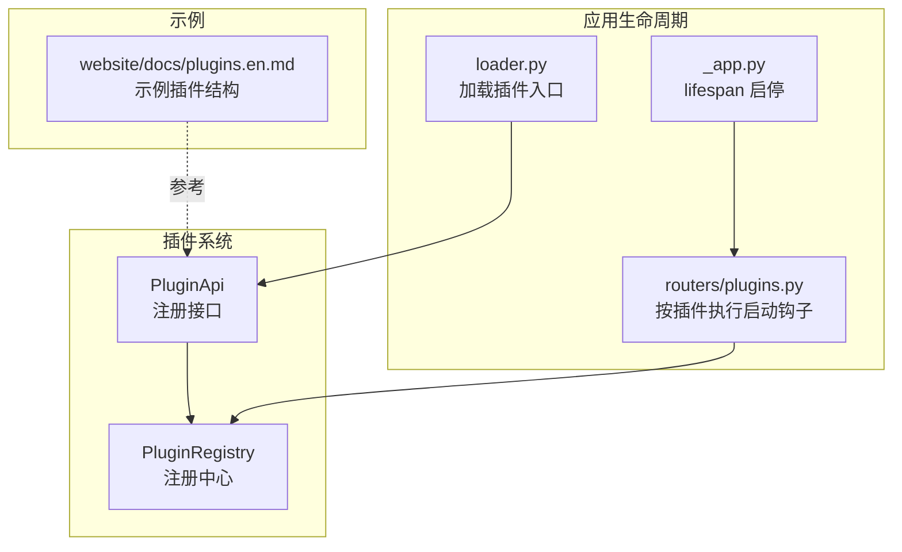
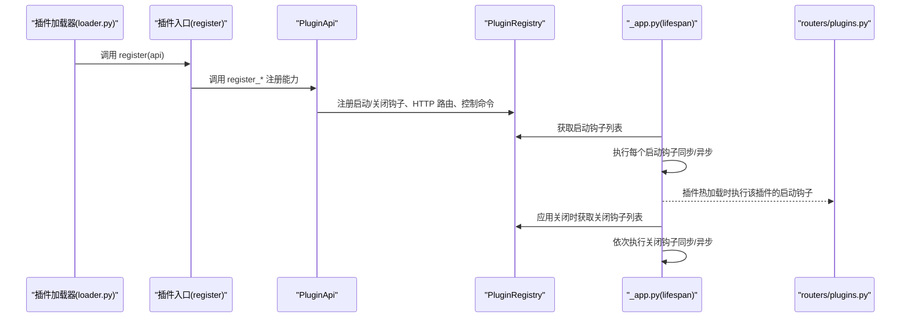
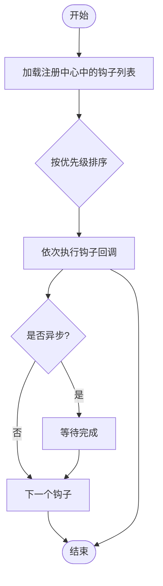
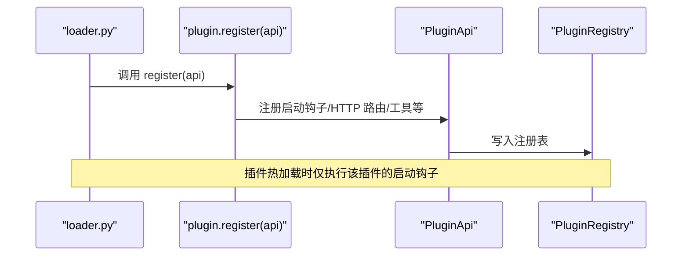
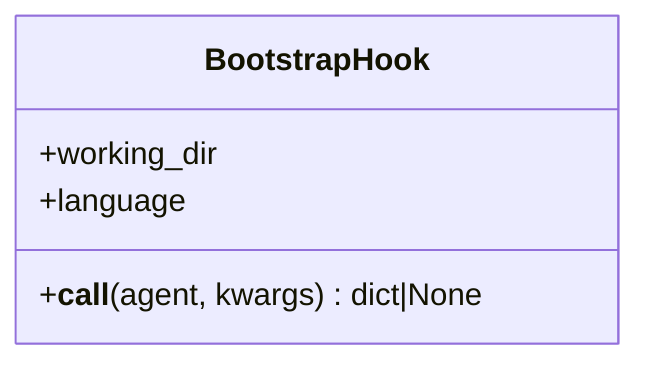
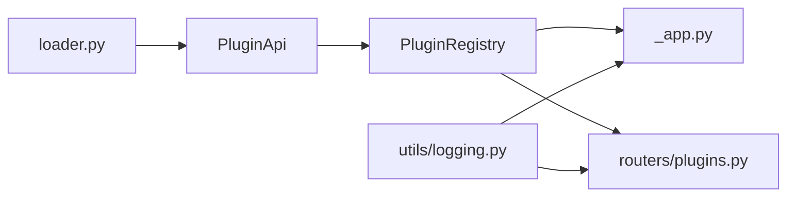

# 钩子插件开发

<cite>
**本文引用的文件**
- [src/qwenpaw/agents/hooks/__init__.py](file://src/qwenpaw/agents/hooks/__init__.py)
- [src/qwenpaw/agents/hooks/bootstrap.py](file://src/qwenpaw/agents/hooks/bootstrap.py)
- [src/qwenpaw/plugins/api.py](file://src/qwenpaw/plugins/api.py)
- [src/qwenpaw/plugins/registry.py](file://src/qwenpaw/plugins/registry.py)
- [src/qwenpaw/app/_app.py](file://src/qwenpaw/app/_app.py)
- [src/qwenpaw/app/routers/plugins.py](file://src/qwenpaw/app/routers/plugins.py)
- [src/qwenpaw/plugins/loader.py](file://src/qwenpaw/plugins/loader.py)
- [src/qwenpaw/utils/logging.py](file://src/qwenpaw/utils/logging.py)
- [website/public/docs/plugins.en.md](file://website/public/docs/plugins.en.md)
</cite>

## 目录
1. [简介](#简介)
2. [项目结构](#项目结构)
3. [核心组件](#核心组件)
4. [架构总览](#架构总览)
5. [详细组件分析](#详细组件分析)
6. [依赖分析](#依赖分析)
7. [性能考虑](#性能考虑)
8. [故障排查指南](#故障排查指南)
9. [结论](#结论)
10. [附录](#附录)

## 简介
本指南面向希望在 QwenPaw 中开发“钩子插件”的开发者，系统讲解插件生命周期（启动与关闭）、钩子类型与注册方式、执行顺序与优先级、参数与返回值规范、异常处理策略，以及调试与排障方法。文档同时提供可直接参考的实现路径与图示，帮助快速上手。

## 项目结构
围绕钩子插件的关键模块包括：
- 插件注册中心：集中管理启动/关闭钩子、HTTP 路由、控制命令等
- 插件 API：为插件提供注册接口（启动/关闭钩子、HTTP 路由、工具等）
- 应用生命周期：在应用启动/关闭阶段遍历并执行钩子
- 示例插件：展示如何通过插件入口注册能力（含启动钩子）

**图表来源**
- [src/qwenpaw/plugins/api.py](file://src/qwenpaw/plugins/api.py)
- [src/qwenpaw/plugins/registry.py](file://src/qwenpaw/plugins/registry.py)
- [src/qwenpaw/app/_app.py](file://src/qwenpaw/app/_app.py)
- [src/qwenpaw/app/routers/plugins.py](file://src/qwenpaw/app/routers/plugins.py)
- [src/qwenpaw/plugins/loader.py](file://src/qwenpaw/plugins/loader.py)
- [website/public/docs/plugins.en.md](file://website/public/docs/plugins.en.md)

**章节来源**
- [src/qwenpaw/plugins/api.py](file://src/qwenpaw/plugins/api.py)
- [src/qwenpaw/plugins/registry.py](file://src/qwenpaw/plugins/registry.py)
- [src/qwenpaw/app/_app.py](file://src/qwenpaw/app/_app.py)
- [src/qwenpaw/app/routers/plugins.py](file://src/qwenpaw/app/routers/plugins.py)
- [src/qwenpaw/plugins/loader.py](file://src/qwenpaw/plugins/loader.py)
- [website/public/docs/plugins.en.md](file://website/public/docs/plugins.en.md)

## 核心组件
- 插件 API（PluginApi）：提供注册启动/关闭钩子、HTTP 路由、控制命令、工具等能力
- 注册中心（PluginRegistry）：维护钩子列表、排序与查询；支持运行时辅助对象
- 应用生命周期（_app.py）：在应用启动/关闭阶段执行钩子
- 插件路由（routers/plugins.py）：按插件维度执行其专属启动钩子
- 加载器（loader.py）：调用插件入口的 register 方法，传入 PluginApi
- 日志（utils/logging.py）：统一日志格式与级别，便于调试

**章节来源**
- [src/qwenpaw/plugins/api.py](file://src/qwenpaw/plugins/api.py)
- [src/qwenpaw/plugins/registry.py](file://src/qwenpaw/plugins/registry.py)
- [src/qwenpaw/app/_app.py](file://src/qwenpaw/app/_app.py)
- [src/qwenpaw/app/routers/plugins.py](file://src/qwenpaw/app/routers/plugins.py)
- [src/qwenpaw/plugins/loader.py](file://src/qwenpaw/plugins/loader.py)
- [src/qwenpaw/utils/logging.py](file://src/qwenpaw/utils/logging.py)

## 架构总览
下图展示了从插件加载到钩子执行的整体流程，包括启动钩子与关闭钩子的触发点与执行顺序。

**图表来源**
- [src/qwenpaw/plugins/loader.py](file://src/qwenpaw/plugins/loader.py)
- [src/qwenpaw/plugins/api.py](file://src/qwenpaw/plugins/api.py)
- [src/qwenpaw/plugins/registry.py](file://src/qwenpaw/plugins/registry.py)
- [src/qwenpaw/app/_app.py](file://src/qwenpaw/app/_app.py)
- [src/qwenpaw/app/routers/plugins.py](file://src/qwenpaw/app/routers/plugins.py)

## 详细组件分析

### 组件A：启动/关闭钩子（Hook）与执行顺序
- 钩子类型
  - 启动钩子：在应用启动或插件热加载时执行，适合初始化资源、注册路由、预热缓存等
  - 关闭钩子：在应用关闭时执行，适合释放资源、持久化状态、清理临时文件等
- 注册方式
  - 通过 PluginApi.register_startup_hook / register_shutdown_hook 完成注册
  - 支持设置优先级（数值越小越早执行）
- 执行顺序
  - 应用启动：按优先级升序执行所有启动钩子
  - 插件热加载：仅执行该插件的启动钩子
  - 应用关闭：按优先级升序执行所有关闭钩子
- 异常处理
  - 单个钩子失败不会阻断其他钩子执行
  - 失败会记录错误日志，建议在钩子内部自行捕获并降级

**图表来源**
- [src/qwenpaw/plugins/registry.py](file://src/qwenpaw/plugins/registry.py)
- [src/qwenpaw/app/_app.py](file://src/qwenpaw/app/_app.py)
- [src/qwenpaw/app/routers/plugins.py](file://src/qwenpaw/app/routers/plugins.py)

**章节来源**
- [src/qwenpaw/plugins/api.py](file://src/qwenpaw/plugins/api.py)
- [src/qwenpaw/plugins/registry.py](file://src/qwenpaw/plugins/registry.py)
- [src/qwenpaw/app/_app.py](file://src/qwenpaw/app/_app.py)
- [src/qwenpaw/app/routers/plugins.py](file://src/qwenpaw/app/routers/plugins.py)

### 组件B：插件入口与注册流程
- 插件入口需实现 register(api) 方法，框架加载时会传入 PluginApi 实例
- 在 register 中调用 api.register_* 完成能力注册（如启动钩子、HTTP 路由、工具等）
- 插件热加载时，routers/plugins.py 会筛选并执行该插件的启动钩子

**图表来源**
- [src/qwenpaw/plugins/loader.py](file://src/qwenpaw/plugins/loader.py)
- [src/qwenpaw/app/routers/plugins.py](file://src/qwenpaw/app/routers/plugins.py)
- [src/qwenpaw/plugins/api.py](file://src/qwenpaw/plugins/api.py)
- [src/qwenpaw/plugins/registry.py](file://src/qwenpaw/plugins/registry.py)

**章节来源**
- [src/qwenpaw/plugins/loader.py](file://src/qwenpaw/plugins/loader.py)
- [src/qwenpaw/app/routers/plugins.py](file://src/qwenpaw/app/routers/plugins.py)
- [src/qwenpaw/plugins/api.py](file://src/qwenpaw/plugins/api.py)
- [src/qwenpaw/plugins/registry.py](file://src/qwenpaw/plugins/registry.py)

### 组件C：Agent 钩子（示例：引导钩子）
- 位置：agents/hooks
- 类型：类实例，实现 __call__ 以遵循可调用接口
- 用途：首次用户交互时注入引导内容（如 BOOTSTRAP.md 的引导信息）
- 生命周期：在 Agent 的推理流程中被调用，非应用级生命周期钩子

**图表来源**
- [src/qwenpaw/agents/hooks/bootstrap.py](file://src/qwenpaw/agents/hooks/bootstrap.py)

**章节来源**
- [src/qwenpaw/agents/hooks/__init__.py](file://src/qwenpaw/agents/hooks/__init__.py)
- [src/qwenpaw/agents/hooks/bootstrap.py](file://src/qwenpaw/agents/hooks/bootstrap.py)

### 组件D：参数规范、返回值与异常处理
- 参数规范
  - 启动/关闭钩子：回调函数签名应兼容同步或异步；不强制要求参数，但建议在回调内自行处理上下文
  - 插件 API：register_* 方法均支持 hook_name、callback、priority 等参数
- 返回值要求
  - 钩子回调返回值通常不作强制约束；若为异步，框架会等待完成
- 异常处理
  - 框架在执行钩子时会捕获异常并记录日志，不影响其他钩子执行
  - 建议在钩子内部进行幂等性与降级处理，避免副作用

**章节来源**
- [src/qwenpaw/plugins/api.py](file://src/qwenpaw/plugins/api.py)
- [src/qwenpaw/plugins/registry.py](file://src/qwenpaw/plugins/registry.py)
- [src/qwenpaw/app/_app.py](file://src/qwenpaw/app/_app.py)
- [src/qwenpaw/app/routers/plugins.py](file://src/qwenpaw/app/routers/plugins.py)

### 组件E：完整开发示例（基于网站文档）
- 参考网站文档中的示例插件结构，展示如何：
  - 编写 plugin.json（定义插件元数据与入口）
  - 编写后端入口 plugin.py（实现 register 方法，使用 PluginApi 注册 HTTP 路由）
  - 在 register 中调用 api.register_http_router 完成路由挂载
- 该示例可作为“启动钩子 + HTTP 路由”的综合范式参考

**章节来源**
- [website/public/docs/plugins.en.md](file://website/public/docs/plugins.en.md)

## 依赖分析
- 插件 API 依赖注册中心进行钩子登记
- 应用生命周期依赖注册中心获取钩子列表并执行
- 插件路由在插件热加载时也依赖注册中心获取该插件的启动钩子
- 日志模块提供统一输出，便于定位钩子执行问题

**图表来源**
- [src/qwenpaw/plugins/api.py](file://src/qwenpaw/plugins/api.py)
- [src/qwenpaw/plugins/registry.py](file://src/qwenpaw/plugins/registry.py)
- [src/qwenpaw/app/_app.py](file://src/qwenpaw/app/_app.py)
- [src/qwenpaw/app/routers/plugins.py](file://src/qwenpaw/app/routers/plugins.py)
- [src/qwenpaw/plugins/loader.py](file://src/qwenpaw/plugins/loader.py)
- [src/qwenpaw/utils/logging.py](file://src/qwenpaw/utils/logging.py)

**章节来源**
- [src/qwenpaw/plugins/api.py](file://src/qwenpaw/plugins/api.py)
- [src/qwenpaw/plugins/registry.py](file://src/qwenpaw/plugins/registry.py)
- [src/qwenpaw/app/_app.py](file://src/qwenpaw/app/_app.py)
- [src/qwenpaw/app/routers/plugins.py](file://src/qwenpaw/app/routers/plugins.py)
- [src/qwenpaw/plugins/loader.py](file://src/qwenpaw/plugins/loader.py)
- [src/qwenpaw/utils/logging.py](file://src/qwenpaw/utils/logging.py)

## 性能考虑
- 钩子执行顺序固定且线性，优先级越低越早执行；建议合理分配优先级，避免长耗时阻塞
- 异步钩子会等待完成，注意避免长时间阻塞主生命周期
- 启动钩子中尽量避免重 IO 或网络请求；必要时采用延迟初始化或后台任务
- 关闭钩子应尽快释放资源，避免应用退出超时

## 故障排查指南
- 如何确认钩子已注册
  - 查看应用日志中“注册启动/关闭钩子”的信息，确认 plugin_id、hook_name、priority
- 如何定位执行失败
  - 查看应用日志中“执行启动/关闭钩子失败”的错误堆栈
  - 使用更细粒度的日志输出（如设置日志级别为 DEBUG）
- 如何验证插件热加载后的钩子
  - 在插件热加载接口调用后，检查对应插件的启动钩子是否被执行
- 常见问题
  - 钩子未执行：检查优先级、插件是否正确加载、回调是否可调用
  - 异步钩子卡住：确保回调返回 awaitable 并在框架中正确等待
  - 资源未释放：在关闭钩子中补充清理逻辑，并在日志中确认执行

**章节来源**
- [src/qwenpaw/app/_app.py](file://src/qwenpaw/app/_app.py)
- [src/qwenpaw/app/routers/plugins.py](file://src/qwenpaw/app/routers/plugins.py)
- [src/qwenpaw/utils/logging.py](file://src/qwenpaw/utils/logging.py)

## 结论
QwenPaw 的钩子插件体系通过 PluginApi 与 PluginRegistry 将插件能力与应用生命周期解耦，既支持应用级启动/关闭钩子，也支持插件热加载场景下的局部钩子执行。开发者只需在插件入口中正确注册钩子并合理设置优先级，即可在合适的时机完成初始化或清理工作。配合统一日志与清晰的错误处理，可以高效地开发、调试与维护钩子插件。

## 附录
- 快速参考
  - 启动钩子注册：[register_startup_hook](file://src/qwenpaw/plugins/api.py)
  - 关闭钩子注册：[register_shutdown_hook](file://src/qwenpaw/plugins/api.py)
  - 钩子执行顺序：[启动钩子执行](file://src/qwenpaw/app/_app.py)，[关闭钩子执行](file://src/qwenpaw/app/_app.py)
  - 插件热加载钩子执行：[按插件执行启动钩子](file://src/qwenpaw/app/routers/plugins.py)
  - 插件入口注册：[loader 调用 register](file://src/qwenpaw/plugins/loader.py)
  - Agent 引导钩子示例：[BootstrapHook](file://src/qwenpaw/agents/hooks/bootstrap.py)