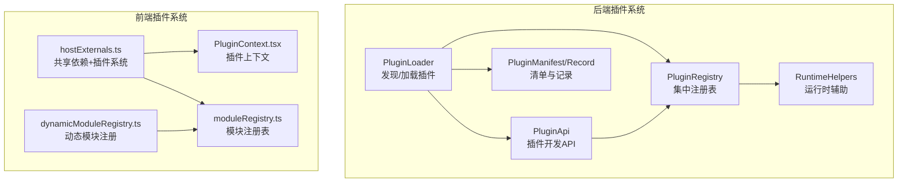
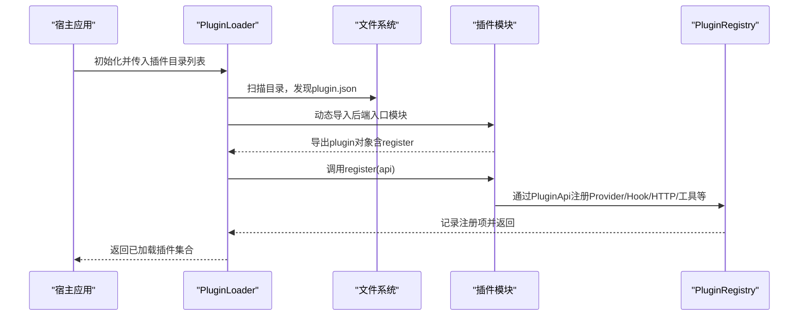
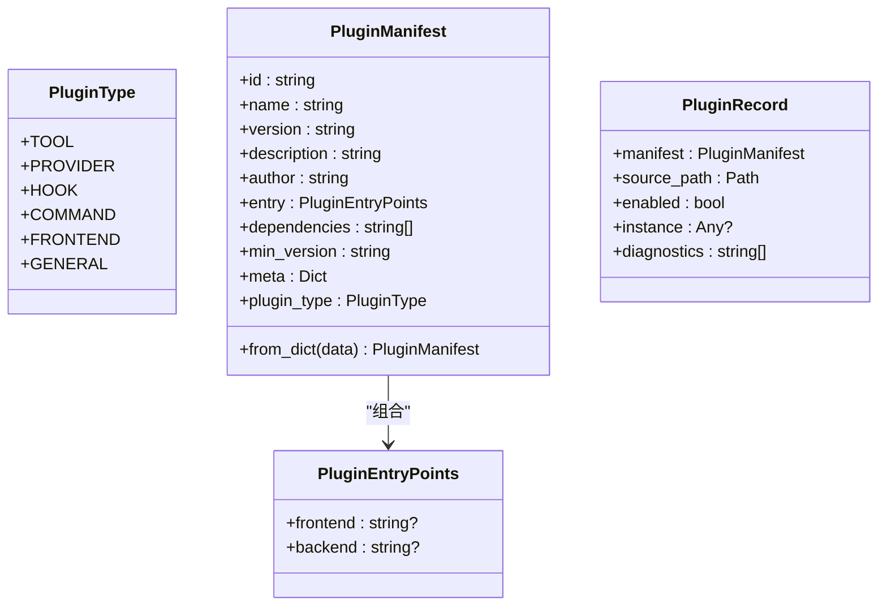
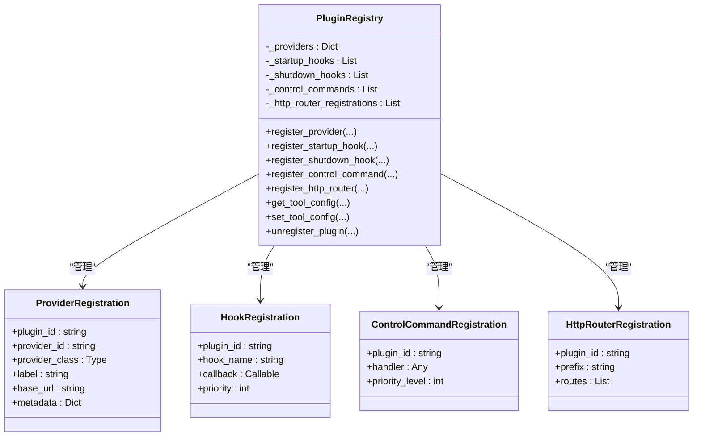
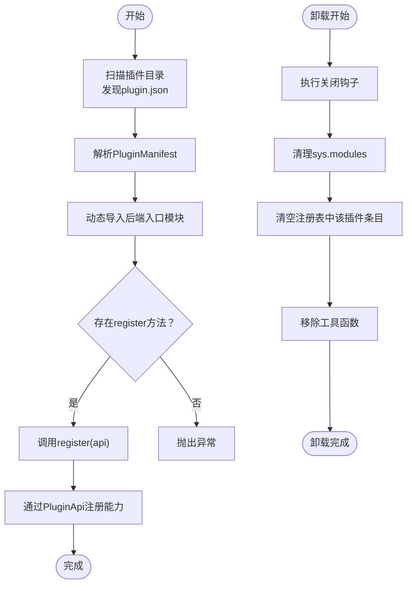
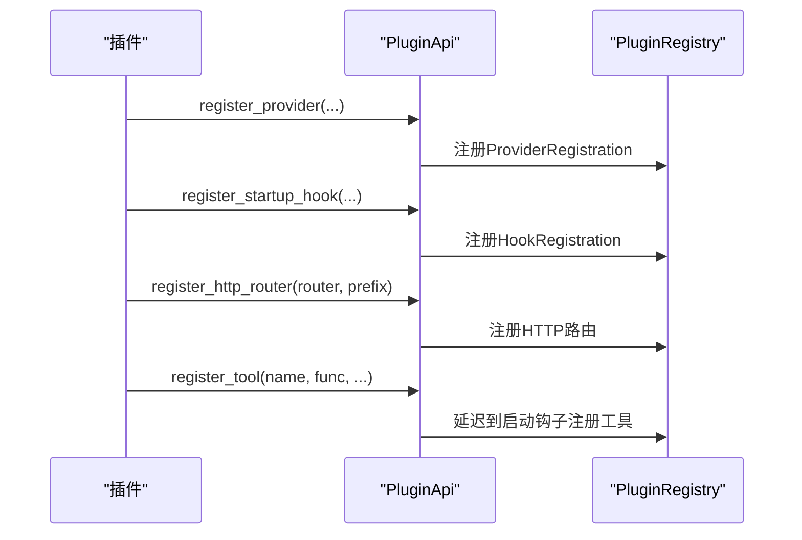
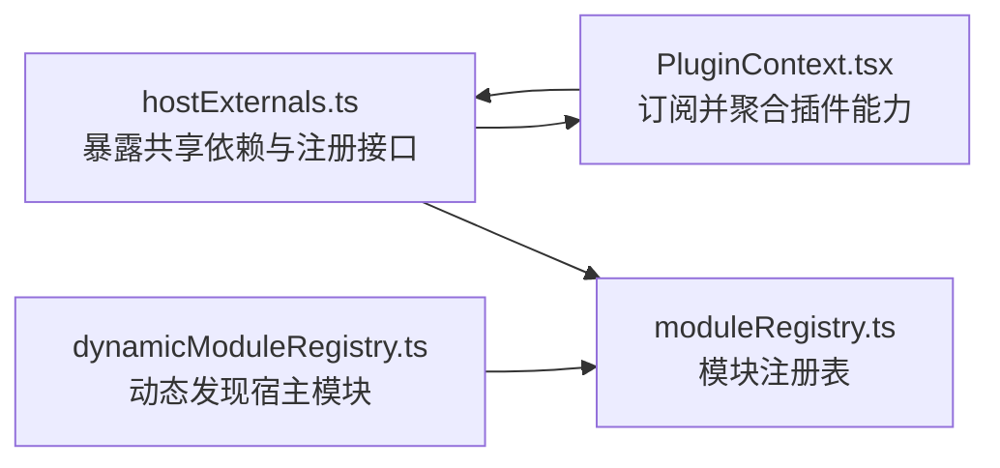
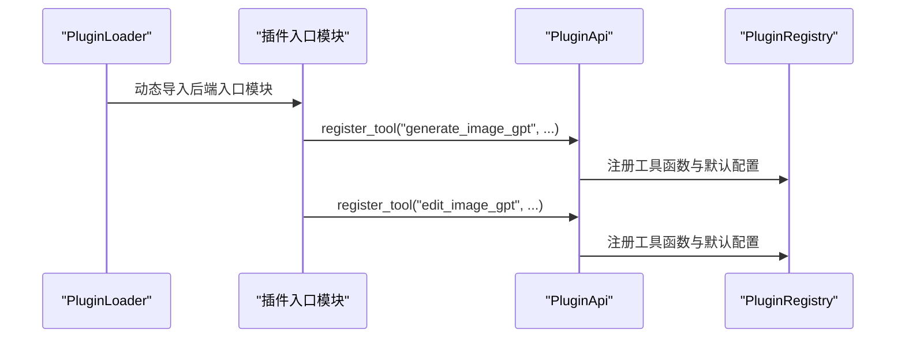
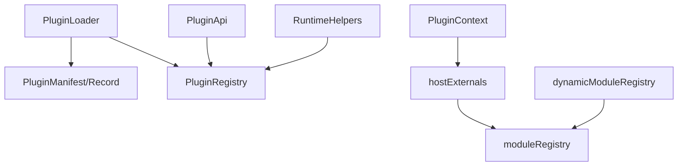

# 插件架构设计

<cite>
**本文档引用的文件**
- [src/qwenpaw/plugins/__init__.py](file://src/qwenpaw/plugins/__init__.py)
- [src/qwenpaw/plugins/architecture.py](file://src/qwenpaw/plugins/architecture.py)
- [src/qwenpaw/plugins/registry.py](file://src/qwenpaw/plugins/registry.py)
- [src/qwenpaw/plugins/loader.py](file://src/qwenpaw/plugins/loader.py)
- [src/qwenpaw/plugins/runtime.py](file://src/qwenpaw/plugins/runtime.py)
- [src/qwenpaw/plugins/api.py](file://src/qwenpaw/plugins/api.py)
- [plugins/tool/gpt-image2/plugin.json](file://plugins/tool/gpt-image2/plugin.json)
- [plugins/tool/gpt-image2/gpt_image2.py](file://plugins/tool/gpt-image2/gpt_image2.py)
- [plugins/tool/qwen-image/plugin.json](file://plugins/tool/qwen-image/plugin.json)
- [plugins/tool/qwen-image/qwen_image.py](file://plugins/tool/qwen-image/qwen_image.py)
- [console/src/plugins/moduleRegistry.ts](file://console/src/plugins/moduleRegistry.ts)
- [console/src/plugins/dynamicModuleRegistry.ts](file://console/src/plugins/dynamicModuleRegistry.ts)
- [console/src/plugins/hostExternals.ts](file://console/src/plugins/hostExternals.ts)
- [console/src/plugins/PluginContext.tsx](file://console/src/plugins/PluginContext.tsx)
</cite>

## 目录
1. [简介](#简介)
2. [项目结构](#项目结构)
3. [核心组件](#核心组件)
4. [架构总览](#架构总览)
5. [详细组件分析](#详细组件分析)
6. [依赖关系分析](#依赖关系分析)
7. [性能考量](#性能考量)
8. [故障排查指南](#故障排查指南)
9. [结论](#结论)
10. [附录](#附录)

## 简介
本文件面向QwenPaw插件架构设计，系统性阐述后端Python插件系统与前端React插件生态的整体设计与实现要点。重点包括：
- 插件注册表的核心作用与集中式管理
- 插件生命周期（发现、加载、注册、卸载）与依赖注入机制
- 模块化设计原则与扩展点定义
- 关键数据结构：ProviderRegistration、HookRegistration、ControlCommandRegistration 的设计理念与使用场景
- 插件与核心系统的解耦机制、接口抽象层与扩展点
- 最佳实践与设计模式，帮助开发者构建可维护、可扩展的插件系统

## 项目结构
QwenPaw采用“后端Python + 前端React”的双栈插件体系：
- 后端：通过插件清单（plugin.json）描述能力，动态加载后端入口模块，调用其register方法完成注册；同时支持HTTP路由挂载、启动/关闭钩子、工具函数注册等扩展点。
- 前端：通过全局命名空间暴露共享依赖与插件系统，插件包可注册页面路由与工具渲染器，实现UI层面的动态扩展。

**图表来源**
- [src/qwenpaw/plugins/loader.py:23-628](file://src/qwenpaw/plugins/loader.py#L23-L628)
- [src/qwenpaw/plugins/registry.py:95-598](file://src/qwenpaw/plugins/registry.py#L95-L598)
- [src/qwenpaw/plugins/api.py:48-401](file://src/qwenpaw/plugins/api.py#L48-L401)
- [src/qwenpaw/plugins/runtime.py:10-68](file://src/qwenpaw/plugins/runtime.py#L10-L68)
- [console/src/plugins/hostExternals.ts:57-192](file://console/src/plugins/hostExternals.ts#L57-L192)
- [console/src/plugins/PluginContext.tsx:47-96](file://console/src/plugins/PluginContext.tsx#L47-L96)
- [console/src/plugins/dynamicModuleRegistry.ts:22-117](file://console/src/plugins/dynamicModuleRegistry.ts#L22-L117)
- [console/src/plugins/moduleRegistry.ts:39-138](file://console/src/plugins/moduleRegistry.ts#L39-L138)

**章节来源**
- [src/qwenpaw/plugins/__init__.py:1-17](file://src/qwenpaw/plugins/__init__.py#L1-L17)
- [src/qwenpaw/plugins/architecture.py:10-142](file://src/qwenpaw/plugins/architecture.py#L10-L142)
- [src/qwenpaw/plugins/registry.py:95-598](file://src/qwenpaw/plugins/registry.py#L95-L598)
- [src/qwenpaw/plugins/loader.py:23-628](file://src/qwenpaw/plugins/loader.py#L23-L628)
- [src/qwenpaw/plugins/runtime.py:10-68](file://src/qwenpaw/plugins/runtime.py#L10-L68)
- [src/qwenpaw/plugins/api.py:48-401](file://src/qwenpaw/plugins/api.py#L48-L401)
- [console/src/plugins/hostExternals.ts:57-192](file://console/src/plugins/hostExternals.ts#L57-L192)
- [console/src/plugins/PluginContext.tsx:47-96](file://console/src/plugins/PluginContext.tsx#L47-L96)
- [console/src/plugins/dynamicModuleRegistry.ts:22-117](file://console/src/plugins/dynamicModuleRegistry.ts#L22-L117)
- [console/src/plugins/moduleRegistry.ts:39-138](file://console/src/plugins/moduleRegistry.ts#L39-L138)

## 核心组件
- 插件清单与记录：PluginManifest、PluginRecord，用于描述插件元信息、类型与来源路径。
- 注册表：PluginRegistry，集中管理Provider、Hook、ControlCommand、HTTP路由、工具配置等注册项，并提供查询与清理能力。
- 加载器：PluginLoader，负责扫描目录、解析清单、动态导入后端模块并调用register完成注册。
- 插件API：PluginApi，为插件开发者提供统一的注册入口（提供者、钩子、HTTP路由、控制命令、工具函数等）。
- 运行时辅助：RuntimeHelpers，向插件暴露运行时能力（如获取Provider、日志等）。
- 前端插件系统：hostExternals.ts + PluginContext.tsx + dynamicModuleRegistry.ts + moduleRegistry.ts，提供共享依赖、路由与工具渲染器注册、模块猴子补丁能力。

**章节来源**
- [src/qwenpaw/plugins/architecture.py:44-142](file://src/qwenpaw/plugins/architecture.py#L44-L142)
- [src/qwenpaw/plugins/registry.py:95-598](file://src/qwenpaw/plugins/registry.py#L95-L598)
- [src/qwenpaw/plugins/loader.py:23-628](file://src/qwenpaw/plugins/loader.py#L23-L628)
- [src/qwenpaw/plugins/api.py:48-401](file://src/qwenpaw/plugins/api.py#L48-L401)
- [src/qwenpaw/plugins/runtime.py:10-68](file://src/qwenpaw/plugins/runtime.py#L10-L68)
- [console/src/plugins/hostExternals.ts:57-192](file://console/src/plugins/hostExternals.ts#L57-L192)
- [console/src/plugins/PluginContext.tsx:47-96](file://console/src/plugins/PluginContext.tsx#L47-L96)
- [console/src/plugins/dynamicModuleRegistry.ts:22-117](file://console/src/plugins/dynamicModuleRegistry.ts#L22-L117)
- [console/src/plugins/moduleRegistry.ts:39-138](file://console/src/plugins/moduleRegistry.ts#L39-L138)

## 架构总览
后端插件系统围绕“清单驱动 + 动态加载 + 集中式注册表”展开，前端则通过全局命名空间与模块注册表实现UI级扩展。两者在“能力声明（清单）”和“运行时注册（API）”两个维度协同工作。

**图表来源**
- [src/qwenpaw/plugins/loader.py:88-238](file://src/qwenpaw/plugins/loader.py#L88-L238)
- [src/qwenpaw/plugins/api.py:48-286](file://src/qwenpaw/plugins/api.py#L48-L286)
- [src/qwenpaw/plugins/registry.py:95-598](file://src/qwenpaw/plugins/registry.py#L95-L598)

**章节来源**
- [src/qwenpaw/plugins/loader.py:23-262](file://src/qwenpaw/plugins/loader.py#L23-L262)
- [src/qwenpaw/plugins/api.py:48-286](file://src/qwenpaw/plugins/api.py#L48-L286)
- [src/qwenpaw/plugins/registry.py:95-598](file://src/qwenpaw/plugins/registry.py#L95-L598)

## 详细组件分析

### 插件清单与类型体系
- PluginType：标准化插件类型（工具、提供者、钩子、控制命令、前端、通用），便于分类处理与兼容旧版清单。
- PluginManifest：从plugin.json反序列化而来，包含id/name/version/description/author/entry/dependencies/min_version/meta/type等字段；支持从meta推断类型以兼容旧清单。
- PluginRecord：加载后的内存记录，包含manifest、source_path、enabled、instance、diagnostics等。

**图表来源**
- [src/qwenpaw/plugins/architecture.py:10-142](file://src/qwenpaw/plugins/architecture.py#L10-L142)

**章节来源**
- [src/qwenpaw/plugins/architecture.py:44-142](file://src/qwenpaw/plugins/architecture.py#L44-L142)

### 插件注册表与扩展点
- ProviderRegistration：注册自定义LLM提供者，包含provider_id、provider_class、label、base_url、metadata等。
- HookRegistration：注册启动/关闭钩子，支持优先级排序，确保执行顺序可控。
- ControlCommandRegistration：注册控制命令处理器，支持优先级。
- HttpRouterRegistration：记录HTTP路由挂载信息，便于卸载与诊断。
- 工具配置：支持按agent维度读取/保存工具配置，便于插件工具按用户配置运行。

**图表来源**
- [src/qwenpaw/plugins/registry.py:55-94](file://src/qwenpaw/plugins/registry.py#L55-L94)
- [src/qwenpaw/plugins/registry.py:95-598](file://src/qwenpaw/plugins/registry.py#L95-L598)

**章节来源**
- [src/qwenpaw/plugins/registry.py:55-598](file://src/qwenpaw/plugins/registry.py#L55-L598)

### 插件加载器与生命周期
- 发现阶段：遍历插件目录，定位plugin.json并解析为PluginManifest。
- 加载阶段：动态导入后端入口模块，校验导出对象是否包含register方法，调用之并传入PluginApi。
- 卸载阶段：执行关闭钩子、清理sys.modules缓存、清空注册表中该插件的条目、移除工具函数。
- 依赖安装：支持pip与uv两种方式安装requirements.txt，避免阻塞事件循环。

**图表来源**
- [src/qwenpaw/plugins/loader.py:36-262](file://src/qwenpaw/plugins/loader.py#L36-L262)
- [src/qwenpaw/plugins/loader.py:487-560](file://src/qwenpaw/plugins/loader.py#L487-L560)

**章节来源**
- [src/qwenpaw/plugins/loader.py:23-628](file://src/qwenpaw/plugins/loader.py#L23-L628)

### 插件API与依赖注入
- PluginApi提供统一的注册入口：register_provider、register_startup_hook、register_shutdown_hook、register_http_router、register_control_command、register_tool等。
- 通过set_registry注入PluginRegistry引用，使插件能与宿主系统交互。
- get_tool_config提供便捷工具配置读取，无需插件持有PluginApi实例。

**图表来源**
- [src/qwenpaw/plugins/api.py:81-286](file://src/qwenpaw/plugins/api.py#L81-L286)
- [src/qwenpaw/plugins/registry.py:249-430](file://src/qwenpaw/plugins/registry.py#L249-L430)

**章节来源**
- [src/qwenpaw/plugins/api.py:48-401](file://src/qwenpaw/plugins/api.py#L48-L401)
- [src/qwenpaw/plugins/registry.py:95-598](file://src/qwenpaw/plugins/registry.py#L95-L598)

### 前端插件系统与模块猴子补丁
- hostExternals.ts：在window.QwenPaw上暴露共享依赖（React、antd等）、API基础URL与工具函数，并提供registerRoutes/registerToolRender接口供插件包调用。
- PluginContext.tsx：订阅插件系统变化，聚合所有插件注册的工具渲染器与页面路由，供应用消费。
- dynamicModuleRegistry.ts：基于Vite import.meta.glob动态发现并注册宿主模块，形成可被插件猴子补丁的模块注册表。
- moduleRegistry.ts：提供安全的模块注册与访问接口，支持get/call/keys/getModule等操作，保证插件对宿主模块的修改可被宿主代码感知。

**图表来源**
- [console/src/plugins/hostExternals.ts:57-192](file://console/src/plugins/hostExternals.ts#L57-L192)
- [console/src/plugins/PluginContext.tsx:47-96](file://console/src/plugins/PluginContext.tsx#L47-L96)
- [console/src/plugins/dynamicModuleRegistry.ts:22-117](file://console/src/plugins/dynamicModuleRegistry.ts#L22-L117)
- [console/src/plugins/moduleRegistry.ts:39-138](file://console/src/plugins/moduleRegistry.ts#L39-L138)

**章节来源**
- [console/src/plugins/hostExternals.ts:57-192](file://console/src/plugins/hostExternals.ts#L57-L192)
- [console/src/plugins/PluginContext.tsx:47-96](file://console/src/plugins/PluginContext.tsx#L47-L96)
- [console/src/plugins/dynamicModuleRegistry.ts:22-117](file://console/src/plugins/dynamicModuleRegistry.ts#L22-L117)
- [console/src/plugins/moduleRegistry.ts:39-138](file://console/src/plugins/moduleRegistry.ts#L39-L138)

### 示例插件：图像生成工具
- 清单（plugin.json）：声明插件类型为tool，定义后端入口文件与工具元数据（名称、描述、图标、配置字段等）。
- 入口（gpt_image2.py / qwen_image.py）：加载对应工具模块并通过PluginApi.register_tool注册工具函数，实现“生成图像/编辑图像”能力。

**图表来源**
- [plugins/tool/gpt-image2/plugin.json:1-89](file://plugins/tool/gpt-image2/plugin.json#L1-L89)
- [plugins/tool/gpt-image2/gpt_image2.py:34-57](file://plugins/tool/gpt-image2/gpt_image2.py#L34-L57)
- [plugins/tool/qwen-image/plugin.json:1-129](file://plugins/tool/qwen-image/plugin.json#L1-L129)
- [plugins/tool/qwen-image/qwen_image.py:34-56](file://plugins/tool/qwen-image/qwen_image.py#L34-L56)

**章节来源**
- [plugins/tool/gpt-image2/plugin.json:1-89](file://plugins/tool/gpt-image2/plugin.json#L1-L89)
- [plugins/tool/gpt-image2/gpt_image2.py:27-64](file://plugins/tool/gpt-image2/gpt_image2.py#L27-L64)
- [plugins/tool/qwen-image/plugin.json:1-129](file://plugins/tool/qwen-image/plugin.json#L1-L129)
- [plugins/tool/qwen-image/qwen_image.py:27-63](file://plugins/tool/qwen-image/qwen_image.py#L27-L63)

## 依赖关系分析
- 后端依赖链：PluginLoader依赖PluginManifest/PluginRecord与PluginRegistry；PluginApi依赖PluginRegistry；RuntimeHelpers依赖ProviderManager。
- 前端依赖链：PluginContext依赖PluginSystem；PluginSystem依赖window.QwenPaw.host与模块注册表；dynamicModuleRegistry依赖moduleRegistry。
- 解耦策略：通过PluginApi与window.QwenPaw作为抽象接口，插件仅依赖这些接口，不直接耦合具体实现。

**图表来源**
- [src/qwenpaw/plugins/loader.py:23-628](file://src/qwenpaw/plugins/loader.py#L23-L628)
- [src/qwenpaw/plugins/api.py:48-286](file://src/qwenpaw/plugins/api.py#L48-L286)
- [src/qwenpaw/plugins/registry.py:95-598](file://src/qwenpaw/plugins/registry.py#L95-L598)
- [src/qwenpaw/plugins/runtime.py:10-68](file://src/qwenpaw/plugins/runtime.py#L10-L68)
- [console/src/plugins/PluginContext.tsx:47-96](file://console/src/plugins/PluginContext.tsx#L47-L96)
- [console/src/plugins/hostExternals.ts:57-192](file://console/src/plugins/hostExternals.ts#L57-L192)
- [console/src/plugins/dynamicModuleRegistry.ts:22-117](file://console/src/plugins/dynamicModuleRegistry.ts#L22-L117)
- [console/src/plugins/moduleRegistry.ts:39-138](file://console/src/plugins/moduleRegistry.ts#L39-L138)

**章节来源**
- [src/qwenpaw/plugins/loader.py:23-628](file://src/qwenpaw/plugins/loader.py#L23-L628)
- [src/qwenpaw/plugins/api.py:48-286](file://src/qwenpaw/plugins/api.py#L48-L286)
- [src/qwenpaw/plugins/registry.py:95-598](file://src/qwenpaw/plugins/registry.py#L95-L598)
- [src/qwenpaw/plugins/runtime.py:10-68](file://src/qwenpaw/plugins/runtime.py#L10-L68)
- [console/src/plugins/PluginContext.tsx:47-96](file://console/src/plugins/PluginContext.tsx#L47-L96)
- [console/src/plugins/hostExternals.ts:57-192](file://console/src/plugins/hostExternals.ts#L57-L192)
- [console/src/plugins/dynamicModuleRegistry.ts:22-117](file://console/src/plugins/dynamicModuleRegistry.ts#L22-L117)
- [console/src/plugins/moduleRegistry.ts:39-138](file://console/src/plugins/moduleRegistry.ts#L39-L138)

## 性能考量
- 异步加载与事件循环：PluginLoader在安装依赖时使用异步线程池，避免阻塞事件循环。
- HTTP路由挂载优化：在FastAPI应用中插入路由前定位SPA捕获路由位置，确保插件路由优先匹配，减少路由冲突。
- 模块缓存与清理：卸载插件时清理sys.modules缓存，避免模块状态残留影响后续加载。
- 前端懒加载：dynamicModuleRegistry使用Vite的import.meta.glob进行懒加载，降低初始包体与首屏压力。

**章节来源**
- [src/qwenpaw/plugins/loader.py:295-405](file://src/qwenpaw/plugins/loader.py#L295-L405)
- [src/qwenpaw/plugins/registry.py:18-53](file://src/qwenpaw/plugins/registry.py#L18-L53)
- [console/src/plugins/dynamicModuleRegistry.ts:22-117](file://console/src/plugins/dynamicModuleRegistry.ts#L22-L117)

## 故障排查指南
- 插件未加载：检查plugin.json是否存在且格式正确；确认后端入口文件路径与导出对象包含register方法。
- 重复注册：Provider或HTTP前缀重复会触发异常；检查已有注册项并调整插件ID或前缀。
- 工具配置读取失败：确认当前agent上下文存在，以及agent配置中包含对应工具；查看日志错误信息。
- 卸载失败：若插件未加载或文件已被删除，卸载会报错；先确认插件状态再重试。
- 前端模块无法访问：检查moduleRegistry是否正确注册宿主模块，插件是否通过window.QwenPaw.modules访问。

**章节来源**
- [src/qwenpaw/plugins/loader.py:88-238](file://src/qwenpaw/plugins/loader.py#L88-L238)
- [src/qwenpaw/plugins/registry.py:141-248](file://src/qwenpaw/plugins/registry.py#L141-L248)
- [src/qwenpaw/plugins/api.py:10-46](file://src/qwenpaw/plugins/api.py#L10-L46)
- [console/src/plugins/moduleRegistry.ts:39-138](file://console/src/plugins/moduleRegistry.ts#L39-L138)

## 结论
QwenPaw插件架构通过“清单驱动 + 动态加载 + 集中式注册表”的设计，实现了后端能力的模块化扩展；前端通过全局命名空间与模块注册表提供了UI级的猴子补丁能力。该架构在解耦、扩展性与可维护性方面表现良好，配合清晰的扩展点与最佳实践，能够支撑复杂场景下的插件生态建设。

## 附录
- 最佳实践
  - 使用明确的插件类型与元数据，便于宿主系统识别与兼容。
  - 在register中统一完成所有注册动作，避免分散逻辑。
  - 对工具函数提供默认禁用与可配置项，尊重用户选择。
  - 控制钩子优先级，确保关键初始化/清理步骤按时执行。
  - 前端插件尽量复用hostExternals提供的共享依赖，减少打包体积。
- 设计模式
  - 工厂模式：通过PluginApi统一创建Provider与工具函数。
  - 观察者模式：前端PluginSystem通过订阅通知更新UI。
  - 策略模式：不同类型的插件（工具/提供者/钩子）按策略注册到注册表。