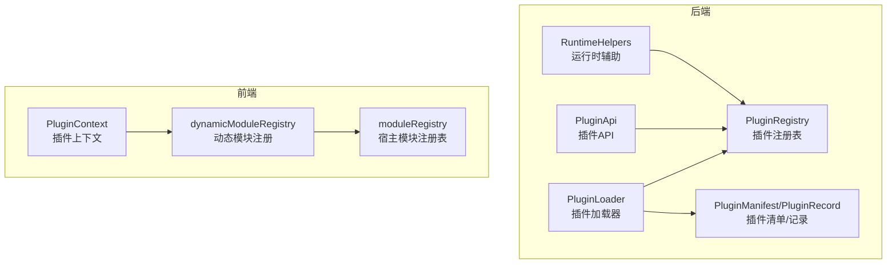
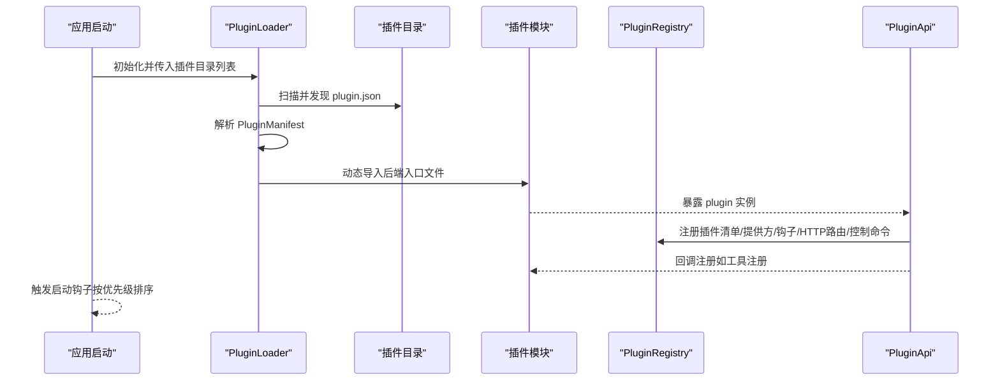
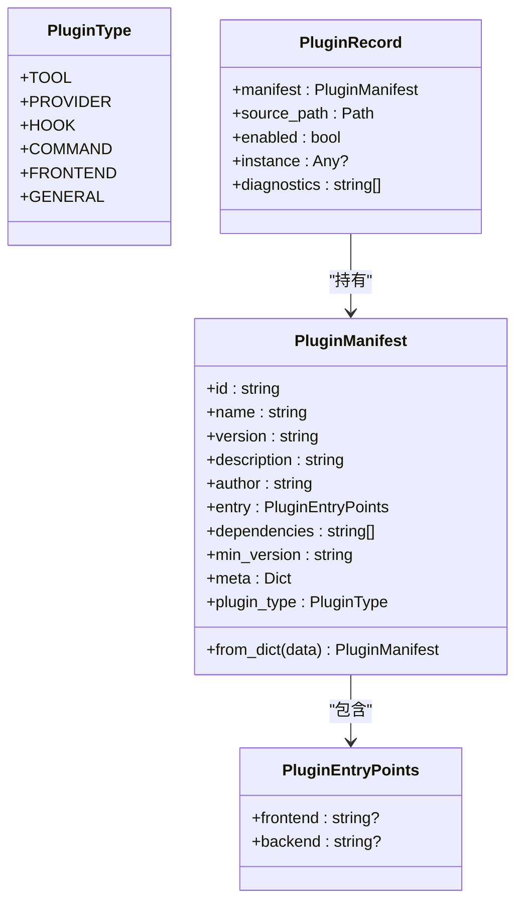
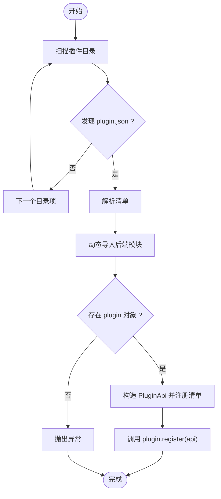
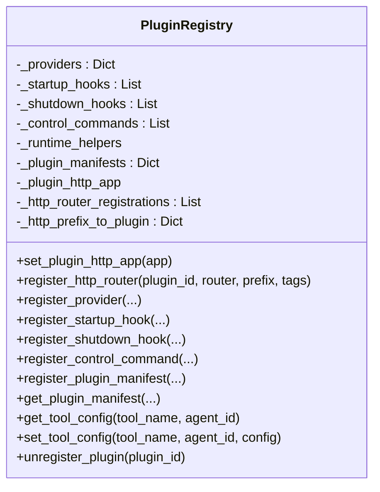
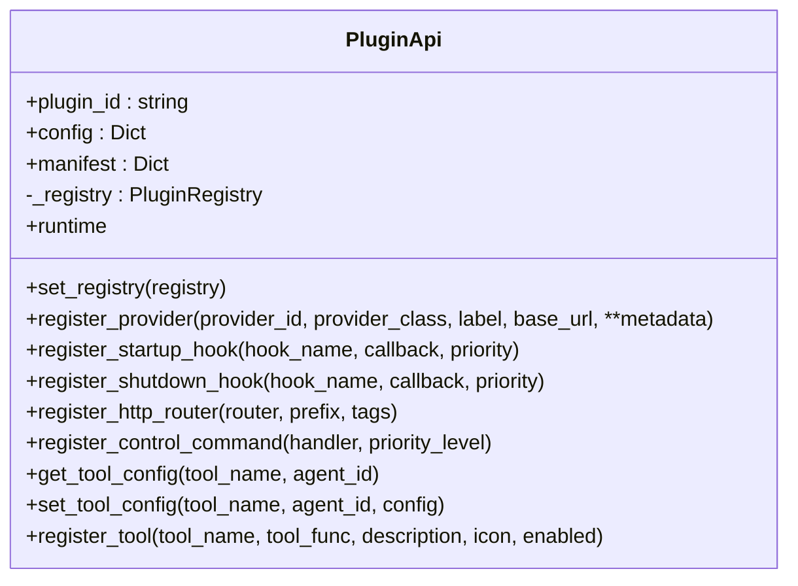
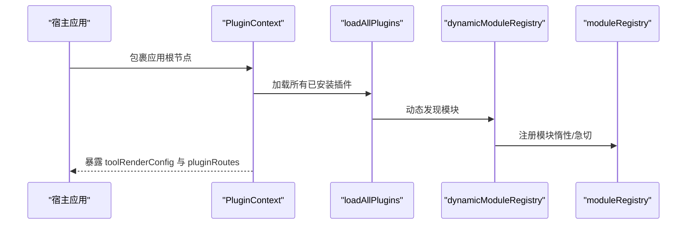
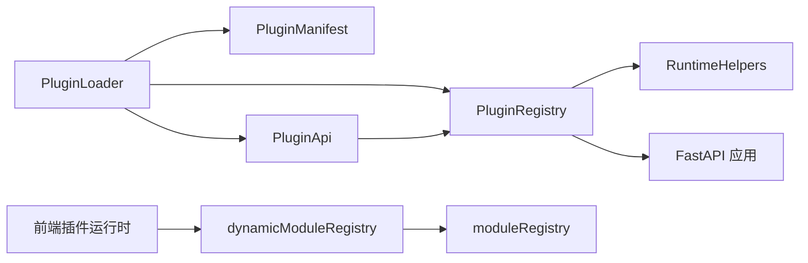

# 插件生态

<cite>
**本文引用的文件**
- [src/qwenpaw/plugins/__init__.py](file://src/qwenpaw/plugins/__init__.py)
- [src/qwenpaw/plugins/api.py](file://src/qwenpaw/plugins/api.py)
- [src/qwenpaw/plugins/architecture.py](file://src/qwenpaw/plugins/architecture.py)
- [src/qwenpaw/plugins/loader.py](file://src/qwenpaw/plugins/loader.py)
- [src/qwenpaw/plugins/registry.py](file://src/qwenpaw/plugins/registry.py)
- [src/qwenpaw/plugins/runtime.py](file://src/qwenpaw/plugins/runtime.py)
- [console/src/plugins/PluginContext.tsx](file://console/src/plugins/PluginContext.tsx)
- [console/src/plugins/dynamicModuleRegistry.ts](file://console/src/plugins/dynamicModuleRegistry.ts)
- [console/src/plugins/moduleRegistry.ts](file://console/src/plugins/moduleRegistry.ts)
- [plugins/tool/gpt-image2/plugin.json](file://plugins/tool/gpt-image2/plugin.json)
- [plugins/tool/gpt-image2/gpt_image2.py](file://plugins/tool/gpt-image2/gpt_image2.py)
- [plugins/tool/qwen-image/plugin.json](file://plugins/tool/qwen-image/plugin.json)
- [plugins/tool/qwen-image/qwen_image.py](file://plugins/tool/qwen-image/qwen_image.py)
- [plugins/tool/wan27/plugin.json](file://plugins/tool/wan27/plugin.json)
- [plugins/tool/wan27/wan27.py](file://plugins/tool/wan27/wan27.py)
</cite>

## 目录
1. [简介](#简介)
2. [项目结构](#项目结构)
3. [核心组件](#核心组件)
4. [架构总览](#架构总览)
5. [详细组件分析](#详细组件分析)
6. [依赖分析](#依赖分析)
7. [性能考虑](#性能考虑)
8. [故障排查指南](#故障排查指南)
9. [结论](#结论)
10. [附录](#附录)

## 简介
本文件系统化阐述 QwenPaw 的插件生态系统：从插件注册表、加载器、架构模型到运行时管理；从后端动态加载、依赖安装、生命周期钩子，到前端模块注册与路由挂载；并给出插件开发框架、API 接口、生命周期管理、依赖注入机制、开发规范、调试方法、发布流程、与核心系统的集成方式（含 MCP 协议支持与安全沙箱建议）、插件市场运营模式、版本管理与兼容性保障等。文末提供可直接参考的插件示例与最佳实践。

## 项目结构
QwenPaw 插件体系由“后端 Python 插件系统”和“前端插件运行时”两部分组成：
- 后端：定义插件清单、注册表、加载器、API、运行时辅助类，负责动态导入、依赖安装、生命周期钩子、HTTP 路由挂载、工具注册与配置持久化。
- 前端：提供插件上下文、动态模块注册与宿主模块注册表，实现前端能力的动态发现与挂载。

图表来源
- [src/qwenpaw/plugins/loader.py:23-628](file://src/qwenpaw/plugins/loader.py#L23-L628)
- [src/qwenpaw/plugins/registry.py:95-598](file://src/qwenpaw/plugins/registry.py#L95-L598)
- [src/qwenpaw/plugins/api.py:48-401](file://src/qwenpaw/plugins/api.py#L48-L401)
- [src/qwenpaw/plugins/runtime.py:10-68](file://src/qwenpaw/plugins/runtime.py#L10-L68)
- [src/qwenpaw/plugins/architecture.py:36-142](file://src/qwenpaw/plugins/architecture.py#L36-L142)
- [console/src/plugins/PluginContext.tsx:47-96](file://console/src/plugins/PluginContext.tsx#L47-L96)
- [console/src/plugins/dynamicModuleRegistry.ts:22-117](file://console/src/plugins/dynamicModuleRegistry.ts#L22-L117)
- [console/src/plugins/moduleRegistry.ts:39-138](file://console/src/plugins/moduleRegistry.ts#L39-L138)

章节来源
- [src/qwenpaw/plugins/__init__.py:1-17](file://src/qwenpaw/plugins/__init__.py#L1-L17)
- [src/qwenpaw/plugins/loader.py:23-628](file://src/qwenpaw/plugins/loader.py#L23-L628)
- [src/qwenpaw/plugins/registry.py:95-598](file://src/qwenpaw/plugins/registry.py#L95-L598)
- [src/qwenpaw/plugins/api.py:48-401](file://src/qwenpaw/plugins/api.py#L48-L401)
- [src/qwenpaw/plugins/runtime.py:10-68](file://src/qwenpaw/plugins/runtime.py#L10-L68)
- [src/qwenpaw/plugins/architecture.py:36-142](file://src/qwenpaw/plugins/architecture.py#L36-L142)
- [console/src/plugins/PluginContext.tsx:47-96](file://console/src/plugins/PluginContext.tsx#L47-L96)
- [console/src/plugins/dynamicModuleRegistry.ts:22-117](file://console/src/plugins/dynamicModuleRegistry.ts#L22-L117)
- [console/src/plugins/moduleRegistry.ts:39-138](file://console/src/plugins/moduleRegistry.ts#L39-L138)

## 核心组件
- 插件清单与类型：通过插件清单描述插件元数据、入口点、类型、依赖与最小版本要求；类型涵盖工具、提供方、启动/关闭钩子、控制命令、前端模块等。
- 插件加载器：扫描插件目录、解析清单、动态导入后端模块、执行插件注册方法、安装依赖、记录加载结果。
- 插件注册表：集中管理提供方、启动/关闭钩子、控制命令、HTTP 路由、插件清单、工具配置；支持卸载时清理。
- 插件 API：为插件开发者提供统一接口，包括工具注册、提供方注册、HTTP 路由挂载、启动/关闭钩子注册、控制命令注册、运行时辅助访问、工具配置读写。
- 运行时辅助：提供获取提供方实例、列举可用提供方、日志记录等能力。
- 前端插件运行时：提供插件上下文、动态模块注册与宿主模块注册表，支持前端能力的动态发现与挂载。

章节来源
- [src/qwenpaw/plugins/architecture.py:10-142](file://src/qwenpaw/plugins/architecture.py#L10-L142)
- [src/qwenpaw/plugins/loader.py:23-628](file://src/qwenpaw/plugins/loader.py#L23-L628)
- [src/qwenpaw/plugins/registry.py:95-598](file://src/qwenpaw/plugins/registry.py#L95-L598)
- [src/qwenpaw/plugins/api.py:48-401](file://src/qwenpaw/plugins/api.py#L48-L401)
- [src/qwenpaw/plugins/runtime.py:10-68](file://src/qwenpaw/plugins/runtime.py#L10-L68)
- [console/src/plugins/PluginContext.tsx:47-96](file://console/src/plugins/PluginContext.tsx#L47-L96)
- [console/src/plugins/dynamicModuleRegistry.ts:22-117](file://console/src/plugins/dynamicModuleRegistry.ts#L22-L117)
- [console/src/plugins/moduleRegistry.ts:39-138](file://console/src/plugins/moduleRegistry.ts#L39-L138)

## 架构总览
下图展示插件系统在启动时的后端加载与注册流程，以及前端插件上下文如何订阅并加载已注册的能力。

图表来源
- [src/qwenpaw/plugins/loader.py:240-262](file://src/qwenpaw/plugins/loader.py#L240-L262)
- [src/qwenpaw/plugins/loader.py:88-238](file://src/qwenpaw/plugins/loader.py#L88-L238)
- [src/qwenpaw/plugins/registry.py:141-214](file://src/qwenpaw/plugins/registry.py#L141-L214)
- [src/qwenpaw/plugins/api.py:81-244](file://src/qwenpaw/plugins/api.py#L81-L244)

## 详细组件分析

### 插件架构与清单
- 插件类型枚举：涵盖工具、提供方、钩子、命令、前端、通用类型，便于分类与兼容旧清单。
- 插件清单：包含标识、名称、版本、描述、作者、入口点（前后端）、依赖、最小版本、扩展元数据与类型。
- 清单解析：支持显式类型与基于元数据的推断，确保向后兼容。
- 插件记录：记录已加载插件的清单、源路径、启用状态、实例与诊断信息。

图表来源
- [src/qwenpaw/plugins/architecture.py:10-142](file://src/qwenpaw/plugins/architecture.py#L10-L142)

章节来源
- [src/qwenpaw/plugins/architecture.py:10-142](file://src/qwenpaw/plugins/architecture.py#L10-L142)

### 插件加载器
- 发现与解析：遍历插件目录，定位 plugin.json 并解析为清单对象。
- 动态导入：为每个插件生成唯一模块名，设置包与路径以支持相对导入，执行模块并获取 plugin 对象。
- 注册与回调：构造 PluginApi 并注册插件清单；调用插件的 register 方法（支持同步/异步）。
- 依赖安装：优先使用当前 Python 环境的 pip 安装 requirements.txt；若不可用则尝试 uv；超时或失败抛出错误。
- 运行时安装：支持从任意路径复制到目标插件目录、安装依赖、重新加载清单并加载插件。
- 卸载：执行关闭钩子、移除模块、清理注册表、移除工具、可选删除磁盘文件。

图表来源
- [src/qwenpaw/plugins/loader.py:36-238](file://src/qwenpaw/plugins/loader.py#L36-L238)

章节来源
- [src/qwenpaw/plugins/loader.py:23-628](file://src/qwenpaw/plugins/loader.py#L23-L628)

### 插件注册表
- HTTP 路由挂载：在 FastAPI 应用中挂载插件路由，并确保在 SPA 路由之前匹配；支持前缀校验与重复检测；变更后失效 OpenAPI 缓存。
- 提供方注册：去重校验，保存提供方元数据，支持查询与列表。
- 钩子管理：启动/关闭钩子按优先级排序，支持查询与清理。
- 控制命令：注册命令处理器，支持优先级。
- 工具配置：按工具名与代理 ID 查询/保存工具配置，持久化到代理配置。
- 插件清单：维护所有插件清单字典，支持查询与清理。

图表来源
- [src/qwenpaw/plugins/registry.py:95-598](file://src/qwenpaw/plugins/registry.py#L95-L598)

章节来源
- [src/qwenpaw/plugins/registry.py:95-598](file://src/qwenpaw/plugins/registry.py#L95-L598)

### 插件 API
- 提供方注册：合并清单元数据与自定义元数据，注册提供方标识、标签、基础地址与扩展字段。
- 生命周期钩子：注册启动/关闭钩子，支持优先级；工具注册通过延迟启动钩子实现。
- HTTP 路由：挂载 FastAPI 路由，自动处理前缀与标签，确保在 SPA 路由前生效。
- 控制命令：注册命令处理器，支持优先级。
- 运行时辅助：提供运行时助手访问入口。
- 工具配置：读取/保存工具配置，与代理配置持久化联动。

图表来源
- [src/qwenpaw/plugins/api.py:48-401](file://src/qwenpaw/plugins/api.py#L48-L401)

章节来源
- [src/qwenpaw/plugins/api.py:48-401](file://src/qwenpaw/plugins/api.py#L48-L401)

### 运行时辅助
- 提供方访问：通过 ProviderManager 获取指定提供方实例或列出可用提供方。
- 日志：提供 info/error/debug 记录方法，便于插件在运行时输出日志。

章节来源
- [src/qwenpaw/plugins/runtime.py:10-68](file://src/qwenpaw/plugins/runtime.py#L10-L68)

### 前端插件运行时
- 插件上下文：订阅插件系统变化，暴露工具渲染配置与页面路由，支持初始加载状态与错误聚合。
- 动态模块注册：使用 Vite 的 import.meta.glob 自动发现并注册页面模块，排除测试文件，支持惰性与急切两种模式。
- 宿主模块注册表：提供模块注册、获取导出、调用函数、键集合与全部模块访问，通过 window.QwenPaw.modules 暴露给插件。

图表来源
- [console/src/plugins/PluginContext.tsx:47-96](file://console/src/plugins/PluginContext.tsx#L47-L96)
- [console/src/plugins/dynamicModuleRegistry.ts:22-117](file://console/src/plugins/dynamicModuleRegistry.ts#L22-L117)
- [console/src/plugins/moduleRegistry.ts:39-138](file://console/src/plugins/moduleRegistry.ts#L39-L138)

章节来源
- [console/src/plugins/PluginContext.tsx:47-96](file://console/src/plugins/PluginContext.tsx#L47-L96)
- [console/src/plugins/dynamicModuleRegistry.ts:22-117](file://console/src/plugins/dynamicModuleRegistry.ts#L22-L117)
- [console/src/plugins/moduleRegistry.ts:39-138](file://console/src/plugins/moduleRegistry.ts#L39-L138)

## 依赖分析
- 后端依赖：插件加载器依赖清单解析、动态导入、依赖安装（pip/uv）、事件循环线程池；注册表依赖 FastAPI 路由挂载与应用实例；API 依赖注册表与运行时助手；运行时辅助依赖 ProviderManager。
- 前端依赖：动态模块注册依赖 Vite 的 import.meta.glob；模块注册表依赖宿主模块导出与属性描述符；插件上下文依赖插件系统与加载器。

图表来源
- [src/qwenpaw/plugins/loader.py:16-34](file://src/qwenpaw/plugins/loader.py#L16-L34)
- [src/qwenpaw/plugins/registry.py:130-214](file://src/qwenpaw/plugins/registry.py#L130-L214)
- [src/qwenpaw/plugins/api.py:73-80](file://src/qwenpaw/plugins/api.py#L73-L80)
- [src/qwenpaw/plugins/runtime.py:13-19](file://src/qwenpaw/plugins/runtime.py#L13-L19)
- [console/src/plugins/dynamicModuleRegistry.ts:24-39](file://console/src/plugins/dynamicModuleRegistry.ts#L24-L39)
- [console/src/plugins/moduleRegistry.ts:124-137](file://console/src/plugins/moduleRegistry.ts#L124-L137)

章节来源
- [src/qwenpaw/plugins/loader.py:16-34](file://src/qwenpaw/plugins/loader.py#L16-L34)
- [src/qwenpaw/plugins/registry.py:130-214](file://src/qwenpaw/plugins/registry.py#L130-L214)
- [src/qwenpaw/plugins/api.py:73-80](file://src/qwenpaw/plugins/api.py#L73-L80)
- [src/qwenpaw/plugins/runtime.py:13-19](file://src/qwenpaw/plugins/runtime.py#L13-L19)
- [console/src/plugins/dynamicModuleRegistry.ts:24-39](file://console/src/plugins/dynamicModuleRegistry.ts#L24-L39)
- [console/src/plugins/moduleRegistry.ts:124-137](file://console/src/plugins/moduleRegistry.ts#L124-L137)

## 性能考虑
- 异步加载与事件循环：加载器对依赖安装使用线程池，避免阻塞事件循环；HTTP 路由挂载后失效 OpenAPI 缓存，减少后续请求开销。
- 惰性模块注册：前端动态模块注册采用惰性模式，按需加载，降低首屏压力。
- 依赖安装策略：优先 pip，回退 uv，避免重复安装与长时间阻塞。
- 工具注册延迟：工具注册通过启动钩子延迟执行，确保应用与代理上下文初始化完成后再注册，减少初始化阶段的耦合。

## 故障排查指南
- 插件未加载：检查插件目录是否存在、plugin.json 是否存在且格式正确、后端入口文件是否声明且可导入、是否已注册到清单。
- 依赖安装失败：确认当前环境可用 pip 或 uv；检查 requirements.txt 内容与网络；关注超时与权限问题。
- HTTP 路由冲突：检查前缀是否以斜杠开头且不为单独“/”，确认是否与其他插件重复。
- 工具配置读取失败：确认代理 ID 有效、工具名存在于代理配置中、配置字段完整。
- 卸载后残留：确认模块已被从 sys.modules 移除、注册表清理完成、工具从 agents.tools 中移除。

章节来源
- [src/qwenpaw/plugins/loader.py:264-405](file://src/qwenpaw/plugins/loader.py#L264-L405)
- [src/qwenpaw/plugins/registry.py:163-214](file://src/qwenpaw/plugins/registry.py#L163-L214)
- [src/qwenpaw/plugins/registry.py:530-597](file://src/qwenpaw/plugins/registry.py#L530-L597)

## 结论
QwenPaw 的插件生态以“清单驱动 + 动态加载 + 注册表集中管理”为核心，结合后端 Python 与前端 TypeScript 的双端运行时，实现了灵活、可扩展、可维护的插件体系。通过清晰的生命周期钩子、HTTP 路由挂载、工具配置持久化与前端模块注册机制，开发者可以快速构建高质量插件并融入核心系统。

## 附录

### 插件开发指南（后端）
- 插件目录结构
  - 必备文件：plugin.json（清单）、后端入口文件（默认 plugin.py，可在清单中指定）
  - 可选文件：requirements.txt（依赖）、工具实现文件（被入口文件导入）
- 清单字段要点
  - id/name/version/type/entry.dependencies/min_version/meta
  - type 优先显式声明，否则根据 meta 与入口点推断
- 入口文件规范
  - 导出 plugin 实例，实现 register(api) 方法
  - 使用 importlib.util.spec_from_file_location 动态导入工具模块
- 使用 PluginApi
  - 注册提供方：register_provider(...)
  - 注册工具：register_tool(...)（推荐使用，内部自动处理模块注入与配置）
  - 注册 HTTP 路由：register_http_router(...)
  - 注册启动/关闭钩子：register_startup_hook(...) / register_shutdown_hook(...)
  - 注册控制命令：register_control_command(...)
  - 工具配置：get_tool_config(...) / set_tool_config(...)
- 依赖安装
  - requirements.txt 将在加载时自动安装；若当前环境无 pip，尝试 uv
- 卸载与清理
  - 卸载会执行关闭钩子、移除模块、清理注册表、移除工具、可选删除磁盘文件

章节来源
- [src/qwenpaw/plugins/api.py:81-401](file://src/qwenpaw/plugins/api.py#L81-L401)
- [src/qwenpaw/plugins/loader.py:88-238](file://src/qwenpaw/plugins/loader.py#L88-L238)
- [src/qwenpaw/plugins/loader.py:295-405](file://src/qwenpaw/plugins/loader.py#L295-L405)
- [src/qwenpaw/plugins/registry.py:467-503](file://src/qwenpaw/plugins/registry.py#L467-L503)

### 插件开发指南（前端）
- 插件上下文
  - 使用 PluginContext.Provider 包裹根节点，通过 usePlugins() 获取 toolRenderConfig 与 pluginRoutes
- 动态模块注册
  - 使用 import.meta.glob 自动发现页面模块，排除测试文件；支持惰性与急切两种模式
- 宿主模块注册表
  - 通过 moduleRegistry.register/get/call/keys/getModule 访问与修改模块导出
  - window.QwenPaw.modules 暴露全部模块，供插件动态访问

章节来源
- [console/src/plugins/PluginContext.tsx:47-96](file://console/src/plugins/PluginContext.tsx#L47-L96)
- [console/src/plugins/dynamicModuleRegistry.ts:22-117](file://console/src/plugins/dynamicModuleRegistry.ts#L22-L117)
- [console/src/plugins/moduleRegistry.ts:39-138](file://console/src/plugins/moduleRegistry.ts#L39-L138)

### 插件示例与最佳实践
- 示例插件
  - GPT Image 2：工具型插件，注册 generate_image_gpt 与 edit_image_gpt 两个工具，清单中声明 tools 数组与配置字段。
  - Qwen-Image：工具型插件，注册 generate_image_qwen 与 edit_image_qwen 两个工具，清单中声明多模型选项与配置字段。
  - Wan 2.7：工具型插件，注册 text_to_video_wan、image_to_video_wan、reference_to_video_wan 三个工具，清单中声明多种模式与配置字段。
- 最佳实践
  - 清单字段完整：明确 type、entry、dependencies、min_version、meta
  - 工具命名规范：与提示词中使用的函数名一致，避免歧义
  - 配置字段友好：提供 label、type、required、placeholder、help、min/max/default 等
  - 依赖最小化：仅声明必要依赖，避免冗余
  - 错误处理：在 register 中捕获异常并记录日志
  - 前端模块：使用动态模块注册，避免硬编码与冲突

章节来源
- [plugins/tool/gpt-image2/plugin.json:1-89](file://plugins/tool/gpt-image2/plugin.json#L1-L89)
- [plugins/tool/gpt-image2/gpt_image2.py:27-64](file://plugins/tool/gpt-image2/gpt_image2.py#L27-L64)
- [plugins/tool/qwen-image/plugin.json:1-129](file://plugins/tool/qwen-image/plugin.json#L1-L129)
- [plugins/tool/qwen-image/qwen_image.py:27-63](file://plugins/tool/qwen-image/qwen_image.py#L27-L63)
- [plugins/tool/wan27/plugin.json:1-122](file://plugins/tool/wan27/plugin.json#L1-L122)
- [plugins/tool/wan27/wan27.py:27-70](file://plugins/tool/wan27/wan27.py#L27-L70)

### 与核心系统的集成方式
- HTTP 路由集成：通过 PluginRegistry.register_http_router 在 FastAPI 应用中挂载插件路由，确保在 SPA 路由前匹配。
- 提供方集成：通过 PluginApi.register_provider 注册自定义提供方，配合 RuntimeHelpers 获取提供方实例。
- 工具集成：通过 PluginApi.register_tool 注册工具，自动注入 agents.tools 并在代理配置中创建内置工具条目。
- 控制命令集成：通过 PluginApi.register_control_command 注册命令处理器，支持优先级调度。
- 前端集成：通过 PluginContext 暴露工具渲染配置与页面路由，前端组件可直接消费。

章节来源
- [src/qwenpaw/plugins/registry.py:141-214](file://src/qwenpaw/plugins/registry.py#L141-L214)
- [src/qwenpaw/plugins/api.py:81-244](file://src/qwenpaw/plugins/api.py#L81-L244)
- [console/src/plugins/PluginContext.tsx:47-96](file://console/src/plugins/PluginContext.tsx#L47-L96)

### MCP 协议支持与安全沙箱机制
- MCP 协议支持：当前代码库未直接出现 MCP 协议相关实现。若需支持 MCP，建议在提供方注册与运行时辅助中增加 MCP 客户端/服务端适配层，并通过 PluginApi.register_provider 与 RuntimeHelpers 进行集成。
- 安全沙箱机制：建议在插件加载与执行过程中引入受限执行环境（如子进程隔离、资源限制、白名单依赖、只读文件系统等），并在工具调用时进行输入验证与输出过滤，防止恶意行为。

[本节为概念性建议，不直接对应具体源码实现]

### 插件市场运营模式、版本管理与兼容性
- 插件市场运营模式：建议采用“清单托管 + 版本索引 + 依赖解析 + 用户评分与审核”的模式，确保插件质量与安全性。
- 版本管理：严格遵循语义化版本；清单中的 min_version 字段用于强制兼容性；后端加载器可据此拒绝不兼容插件。
- 兼容性保证：提供方注册时应保持接口稳定；工具注册应向后兼容；前端模块注册应避免破坏现有路由与组件。

章节来源
- [src/qwenpaw/plugins/architecture.py:65-130](file://src/qwenpaw/plugins/architecture.py#L65-L130)
- [src/qwenpaw/plugins/loader.py:240-262](file://src/qwenpaw/plugins/loader.py#L240-L262)