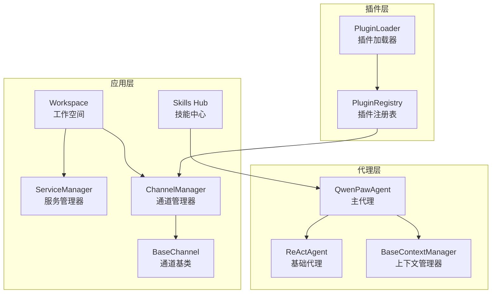
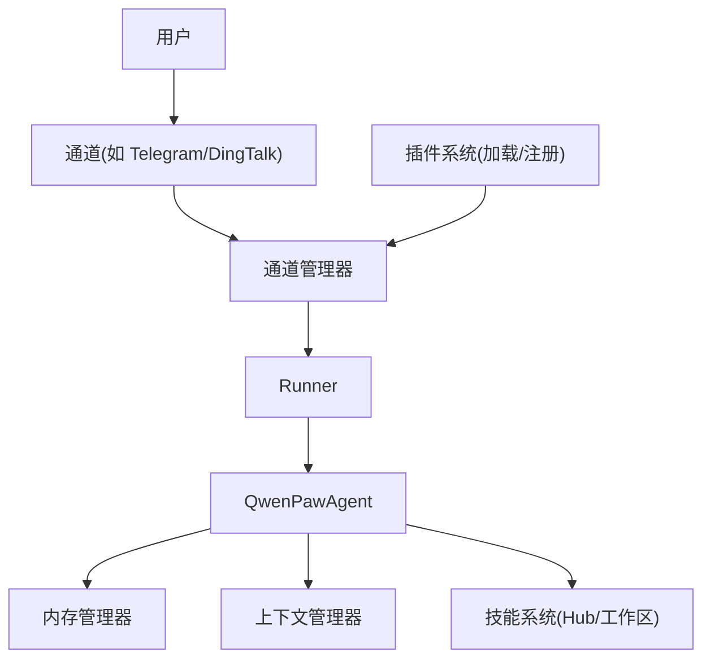
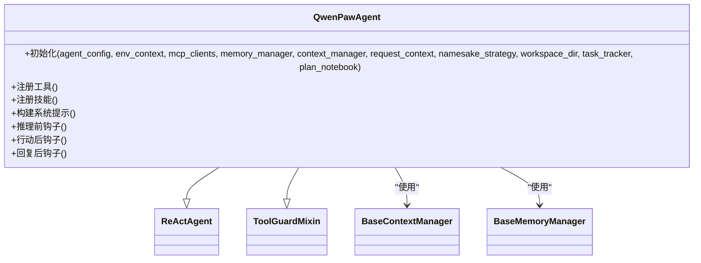
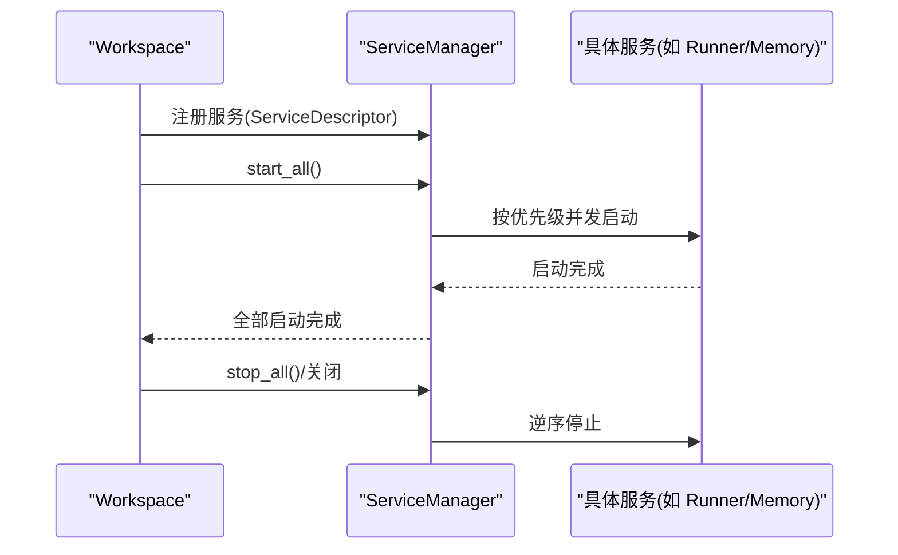
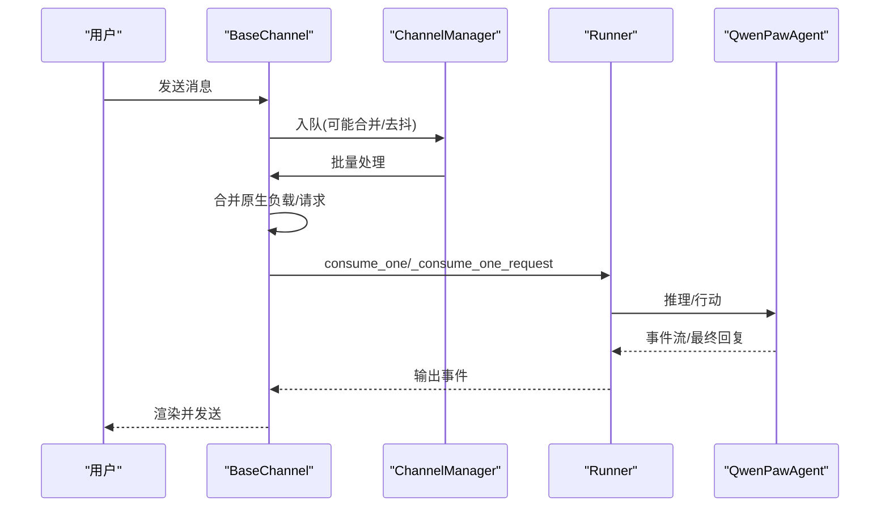
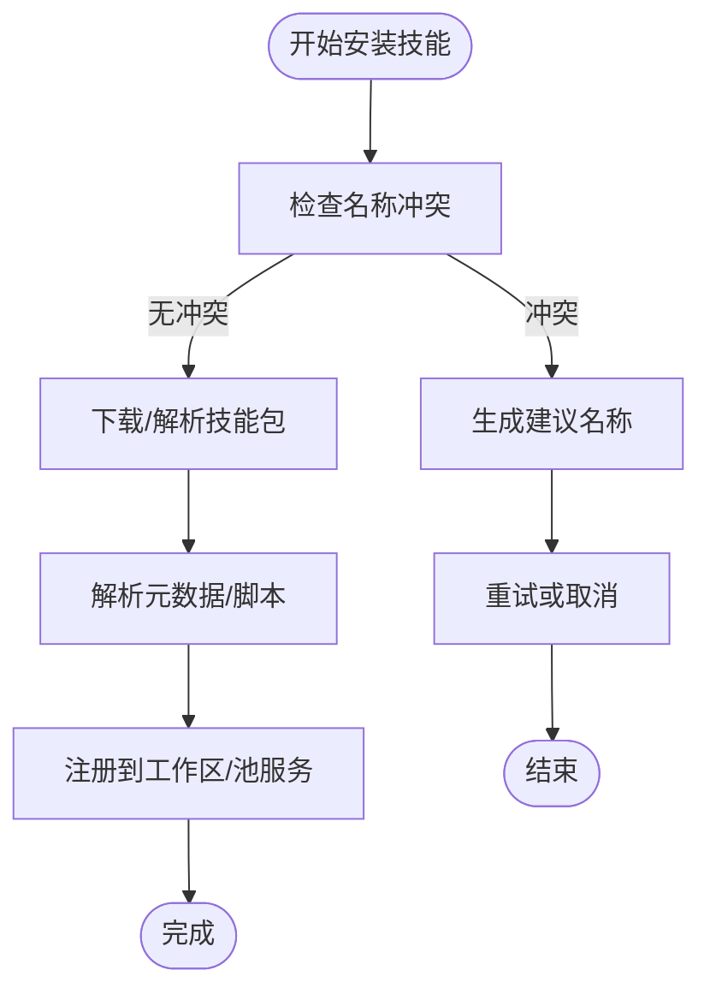
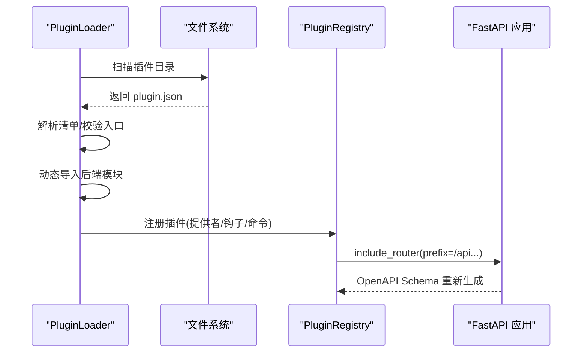
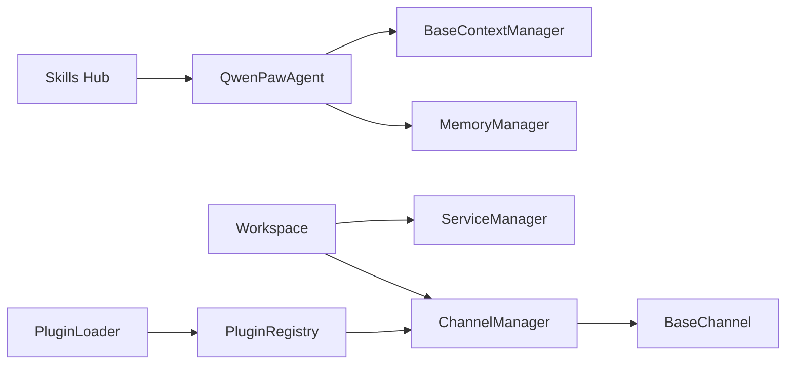

# 核心概念

<cite>
**本文引用的文件**
- [src/qwenpaw/__init__.py](file://src/qwenpaw/__init__.py)
- [src/qwenpaw/agents/__init__.py](file://src/qwenpaw/agents/__init__.py)
- [src/qwenpaw/agents/react_agent.py](file://src/qwenpaw/agents/react_agent.py)
- [src/qwenpaw/app/workspace/__init__.py](file://src/qwenpaw/app/workspace/__init__.py)
- [src/qwenpaw/app/workspace/workspace.py](file://src/qwenpaw/app/workspace/workspace.py)
- [src/qwenpaw/app/workspace/service_manager.py](file://src/qwenpaw/app/workspace/service_manager.py)
- [src/qwenpaw/agents/skill_system/models.py](file://src/qwenpaw/agents/skill_system/models.py)
- [src/qwenpaw/agents/skill_system/hub.py](file://src/qwenpaw/agents/skill_system/hub.py)
- [src/qwenpaw/app/channels/base.py](file://src/qwenpaw/app/channels/base.py)
- [src/qwenpaw/app/channels/manager.py](file://src/qwenpaw/app/channels/manager.py)
- [src/qwenpaw/plugins/__init__.py](file://src/qwenpaw/plugins/__init__.py)
- [src/qwenpaw/plugins/loader.py](file://src/qwenpaw/plugins/loader.py)
- [src/qwenpaw/plugins/registry.py](file://src/qwenpaw/plugins/registry.py)
- [src/qwenpaw/agents/context/base_context_manager.py](file://src/qwenpaw/agents/context/base_context_manager.py)
</cite>

## 目录
1. [引言](#引言)
2. [项目结构](#项目结构)
3. [核心组件](#核心组件)
4. [架构总览](#架构总览)
5. [详细组件分析](#详细组件分析)
6. [依赖分析](#依赖分析)
7. [性能考量](#性能考量)
8. [故障排查指南](#故障排查指南)
9. [结论](#结论)
10. [附录](#附录)

## 引言
本文件围绕 QwenPaw 的核心概念进行系统化阐述，重点解释代理系统、工作空间、通道系统、技能系统与插件生态的设计理念与实现原理，并梳理它们之间的关系与交互机制。内容兼顾初学者可读性与工程师级技术深度，辅以架构图与流程图帮助理解。

## 项目结构
从整体上，QwenPaw 将“运行时”与“功能模块”分层组织：
- 应用层：负责统一的服务编排（工作空间）、通道接入（消息路由）、任务调度（定时任务）等
- 代理层：封装 ReActAgent，集成工具、技能、内存与上下文管理
- 技能层：提供技能的安装、冲突处理、工作区与 Hub 同步能力
- 插件层：支持后端/前端入口、动态加载、HTTP 路由挂载与注册表管理
- 通道层：抽象消息通道，统一入队、合并、消费与渲染

图表来源
- [src/qwenpaw/app/workspace/workspace.py:38-118](file://src/qwenpaw/app/workspace/workspace.py#L38-L118)
- [src/qwenpaw/app/workspace/service_manager.py:76-158](file://src/qwenpaw/app/workspace/service_manager.py#L76-L158)
- [src/qwenpaw/app/channels/manager.py:68-109](file://src/qwenpaw/app/channels/manager.py#L68-L109)
- [src/qwenpaw/app/channels/base.py:78-168](file://src/qwenpaw/app/channels/base.py#L78-L168)
- [src/qwenpaw/agents/react_agent.py:80-200](file://src/qwenpaw/agents/react_agent.py#L80-L200)
- [src/qwenpaw/agents/context/base_context_manager.py:15-80](file://src/qwenpaw/agents/context/base_context_manager.py#L15-L80)
- [src/qwenpaw/agents/skill_system/hub.py:1-100](file://src/qwenpaw/agents/skill_system/hub.py#L1-L100)
- [src/qwenpaw/plugins/loader.py:23-100](file://src/qwenpaw/plugins/loader.py#L23-L100)
- [src/qwenpaw/plugins/registry.py:95-128](file://src/qwenpaw/plugins/registry.py#L95-L128)

章节来源
- [src/qwenpaw/__init__.py:1-33](file://src/qwenpaw/__init__.py#L1-L33)
- [src/qwenpaw/app/workspace/__init__.py:1-14](file://src/qwenpaw/app/workspace/__init__.py#L1-L14)
- [src/qwenpaw/agents/__init__.py:1-35](file://src/qwenpaw/agents/__init__.py#L1-L35)

## 核心组件
- 代理系统：以 ReActAgent 为基础，扩展工具集、技能加载、内存与上下文管理、命令处理与安全守卫
- 工作空间：为单个代理实例提供独立运行时环境，统一管理 Runner、通道、内存、MCP、定时任务等服务
- 通道系统：抽象消息通道，统一入队、去抖、合并、消费与渲染，支持多渠道接入
- 技能系统：提供技能工作区与 Hub 的安装、冲突处理、版本与依赖管理
- 插件生态：支持后端/前端入口、动态加载、HTTP 路由挂载与注册表管理

章节来源
- [src/qwenpaw/agents/react_agent.py:80-200](file://src/qwenpaw/agents/react_agent.py#L80-L200)
- [src/qwenpaw/app/workspace/workspace.py:38-118](file://src/qwenpaw/app/workspace/workspace.py#L38-L118)
- [src/qwenpaw/app/channels/base.py:78-168](file://src/qwenpaw/app/channels/base.py#L78-L168)
- [src/qwenpaw/agents/skill_system/models.py:1-77](file://src/qwenpaw/agents/skill_system/models.py#L1-L77)
- [src/qwenpaw/plugins/loader.py:23-100](file://src/qwenpaw/plugins/loader.py#L23-L100)

## 架构总览
下图展示 QwenPaw 的高层架构：代理在工作空间内运行，通过通道接收用户输入，经 Runner 处理后调用代理；代理使用工具与技能，结合内存与上下文管理器完成推理与行动；插件通过注册表挂载 HTTP 路由并与通道协同。

图表来源
- [src/qwenpaw/app/channels/manager.py:68-109](file://src/qwenpaw/app/channels/manager.py#L68-L109)
- [src/qwenpaw/app/workspace/workspace.py:38-118](file://src/qwenpaw/app/workspace/workspace.py#L38-L118)
- [src/qwenpaw/agents/react_agent.py:80-200](file://src/qwenpaw/agents/react_agent.py#L80-L200)
- [src/qwenpaw/agents/context/base_context_manager.py:15-80](file://src/qwenpaw/agents/context/base_context_manager.py#L15-L80)
- [src/qwenpaw/agents/skill_system/hub.py:1-100](file://src/qwenpaw/agents/skill_system/hub.py#L1-L100)
- [src/qwenpaw/plugins/registry.py:95-128](file://src/qwenpaw/plugins/registry.py#L95-L128)

## 详细组件分析

### 代理系统
- 设计理念
  - 基于 ReActAgent 的推理-行动循环，内置常用工具（文件、Shell、截图、时间等），支持动态技能加载
  - 集成内存与上下文管理器，提供会话压缩、工具输出裁剪与上下文健康检查
  - 提供命令处理与安全守卫，拦截潜在风险操作
- 关键实现要点
  - 工具注册与命名冲突策略
  - 系统提示构建与模型/格式化器工厂
  - 内存工具注入与上下文钩子
- 生命周期
  - 初始化：创建模型/格式化器、构建系统提示、注册工具与技能
  - 运行期：推理前上下文压缩、行动后工具输出裁剪、回复前后钩子
  - 关闭：释放资源、关闭内存与上下文管理器

图表来源
- [src/qwenpaw/agents/react_agent.py:80-200](file://src/qwenpaw/agents/react_agent.py#L80-L200)
- [src/qwenpaw/agents/context/base_context_manager.py:15-80](file://src/qwenpaw/agents/context/base_context_manager.py#L15-L80)

章节来源
- [src/qwenpaw/agents/react_agent.py:80-200](file://src/qwenpaw/agents/react_agent.py#L80-L200)
- [src/qwenpaw/agents/context/base_context_manager.py:15-80](file://src/qwenpaw/agents/context/base_context_manager.py#L15-L80)

### 工作空间
- 设计理念
  - 每个代理拥有独立的工作空间，包含 Runner、通道、内存、MCP、定时任务等服务
  - 使用声明式服务描述与服务管理器统一生命周期与依赖
- 关键实现要点
  - 服务注册：优先级、并发初始化、依赖关系、启动/停止方法
  - 服务访问：通过属性委托到服务管理器
  - 配置加载：按需加载代理配置
- 生命周期
  - 创建：准备目录、注册服务
  - 启动：按优先级并发启动，支持可复用服务重用
  - 关闭：逆序停止，释放资源

图表来源
- [src/qwenpaw/app/workspace/workspace.py:137-200](file://src/qwenpaw/app/workspace/workspace.py#L137-L200)
- [src/qwenpaw/app/workspace/service_manager.py:76-158](file://src/qwenpaw/app/workspace/service_manager.py#L76-L158)

章节来源
- [src/qwenpaw/app/workspace/workspace.py:38-118](file://src/qwenpaw/app/workspace/workspace.py#L38-L118)
- [src/qwenpaw/app/workspace/service_manager.py:76-158](file://src/qwenpaw/app/workspace/service_manager.py#L76-L158)

### 通道系统
- 设计理念
  - 统一抽象消息通道，屏蔽不同渠道差异；通道管理器负责队列、合并、去抖与消费循环
  - 支持实时流式事件与完成消息两条路径；渲染器控制工具细节与思考内容过滤
- 关键实现要点
  - 通道基类定义处理契约、渲染样式、去抖策略
  - 通道管理器从配置或环境创建通道实例，统一入队与批量处理
  - 命令注册与统一队列管理提升扩展性
- 交互机制
  - 用户消息进入通道队列，通道合并后交由通道消费逻辑处理
  - 渠道可选择是否启用实时流式事件回调

图表来源
- [src/qwenpaw/app/channels/base.py:78-168](file://src/qwenpaw/app/channels/base.py#L78-L168)
- [src/qwenpaw/app/channels/manager.py:39-66](file://src/qwenpaw/app/channels/manager.py#L39-L66)

章节来源
- [src/qwenpaw/app/channels/base.py:78-168](file://src/qwenpaw/app/channels/base.py#L78-L168)
- [src/qwenpaw/app/channels/manager.py:68-109](file://src/qwenpaw/app/channels/manager.py#L68-L109)

### 技能系统
- 设计理念
  - 技能工作区与 Hub 双轨：本地工作区用于开发与测试，Hub 提供共享安装与冲突建议
  - 通过池服务与工作区服务协调技能的存储、索引与路由
- 关键实现要点
  - 冲突检测与建议重命名
  - HTTP 超时、重试与指数回退策略
  - GitHub 缓存与取消检查上下文
- 交互机制
  - 安装/导入技能时进行冲突检查与缓存命中判断
  - 通过工作区服务与池服务协调技能状态与依赖

图表来源
- [src/qwenpaw/agents/skill_system/hub.py:37-94](file://src/qwenpaw/agents/skill_system/hub.py#L37-L94)
- [src/qwenpaw/agents/skill_system/models.py:45-77](file://src/qwenpaw/agents/skill_system/models.py#L45-L77)

章节来源
- [src/qwenpaw/agents/skill_system/hub.py:1-200](file://src/qwenpaw/agents/skill_system/hub.py#L1-L200)
- [src/qwenpaw/agents/skill_system/models.py:1-77](file://src/qwenpaw/agents/skill_system/models.py#L1-L77)

### 插件生态
- 设计理念
  - 支持后端/前端入口，动态发现与加载插件模块
  - 通过注册表集中管理提供者、钩子、控制命令与 HTTP 路由
- 关键实现要点
  - 插件发现：扫描目录、读取 plugin.json、构造清单
  - 动态加载：唯一模块名、相对导入支持、异常处理
  - HTTP 路由挂载：在控制台 SPA 路由之前插入插件路由，避免覆盖
- 交互机制
  - 插件加载后注册到注册表，插件可贡献 HTTP 路由、提供者、钩子等
  - 插件路由与应用生命周期绑定，确保 OpenAPI Schema 更新

图表来源
- [src/qwenpaw/plugins/loader.py:36-100](file://src/qwenpaw/plugins/loader.py#L36-L100)
- [src/qwenpaw/plugins/registry.py:130-200](file://src/qwenpaw/plugins/registry.py#L130-L200)

章节来源
- [src/qwenpaw/plugins/__init__.py:1-17](file://src/qwenpaw/plugins/__init__.py#L1-L17)
- [src/qwenpaw/plugins/loader.py:23-200](file://src/qwenpaw/plugins/loader.py#L23-L200)
- [src/qwenpaw/plugins/registry.py:95-200](file://src/qwenpaw/plugins/registry.py#L95-L200)

## 依赖分析
- 组件耦合
  - 代理对上下文与内存管理器存在使用耦合，但通过接口解耦
  - 工作空间通过服务管理器统一编排，降低跨模块直接依赖
  - 通道系统与 Runner 通过统一处理函数对接，便于替换与扩展
  - 插件注册表集中管理，避免插件间直接耦合
- 外部依赖
  - 通道渲染依赖消息类型与渲染风格配置
  - 技能 Hub 依赖 HTTP 客户端与缓存策略
  - 插件加载依赖 Python 动态导入与模块搜索路径

图表来源
- [src/qwenpaw/agents/react_agent.py:80-200](file://src/qwenpaw/agents/react_agent.py#L80-L200)
- [src/qwenpaw/app/workspace/workspace.py:38-118](file://src/qwenpaw/app/workspace/workspace.py#L38-L118)
- [src/qwenpaw/app/channels/manager.py:68-109](file://src/qwenpaw/app/channels/manager.py#L68-L109)
- [src/qwenpaw/plugins/loader.py:23-100](file://src/qwenpaw/plugins/loader.py#L23-L100)
- [src/qwenpaw/plugins/registry.py:95-128](file://src/qwenpaw/plugins/registry.py#L95-L128)
- [src/qwenpaw/agents/skill_system/hub.py:1-100](file://src/qwenpaw/agents/skill_system/hub.py#L1-L100)

章节来源
- [src/qwenpaw/app/workspace/service_manager.py:76-158](file://src/qwenpaw/app/workspace/service_manager.py#L76-L158)
- [src/qwenpaw/app/channels/base.py:78-168](file://src/qwenpaw/app/channels/base.py#L78-L168)

## 性能考量
- 并发与批处理
  - 服务管理器按优先级并发启动，减少冷启动时间
  - 通道批量处理与去抖策略降低重复渲染与网络开销
- 资源与缓存
  - 技能 Hub 的 GitHub 缓存与超时/重试策略提升网络稳定性
  - 插件 HTTP 路由挂载后刷新 OpenAPI Schema，避免重复扫描
- 上下文与内存
  - 上下文管理器在推理前进行压缩与裁剪，避免超出模型上下文限制
  - 内存工具按需注册，减少不必要的状态维护

## 故障排查指南
- 通道连接性
  - 通道基类提供可达性检查钩子，自定义通道可覆盖以补充诊断信息
- 技能安装失败
  - 检查冲突与建议名称；确认网络超时/重试配置；查看取消检查上下文
- 插件加载错误
  - 确认 plugin.json 存在且字段完整；检查后端入口文件是否存在；捕获动态导入异常
- 服务启动失败
  - 查看服务描述符的依赖与优先级；确认并发初始化开关；检查启动/停止方法名

章节来源
- [src/qwenpaw/app/channels/base.py:89-111](file://src/qwenpaw/app/channels/base.py#L89-L111)
- [src/qwenpaw/agents/skill_system/hub.py:167-188](file://src/qwenpaw/agents/skill_system/hub.py#L167-L188)
- [src/qwenpaw/plugins/loader.py:108-144](file://src/qwenpaw/plugins/loader.py#L108-L144)
- [src/qwenpaw/app/workspace/service_manager.py:173-200](file://src/qwenpaw/app/workspace/service_manager.py#L173-L200)

## 结论
QwenPaw 的核心在于“以工作空间为单位的统一运行时”，配合“通道即消息路由”的设计，使代理能够在多渠道、多技能、多插件的复杂场景中稳定运行。代理系统提供强大的推理与行动能力，技能系统与插件生态则保证了扩展性与可维护性。通过服务管理器与通道管理器的解耦设计，系统具备良好的可演进性与可观测性。

## 附录
- 术语
  - 工作空间：单个代理实例的独立运行时环境
  - 通道：统一抽象的消息接入点，负责入队、合并与消费
  - 技能：可复用的推理/行动模板，支持工作区与 Hub
  - 插件：可动态加载的功能模块，支持后端/前端入口与 HTTP 路由
- 最佳实践
  - 在工作空间中按优先级组织服务，合理设置并发与依赖
  - 使用通道的去抖与合并策略优化消息吞吐
  - 在技能安装前进行冲突检查与缓存预热
  - 插件路由挂载时注意与控制台 SPA 的顺序，确保 API 可见性