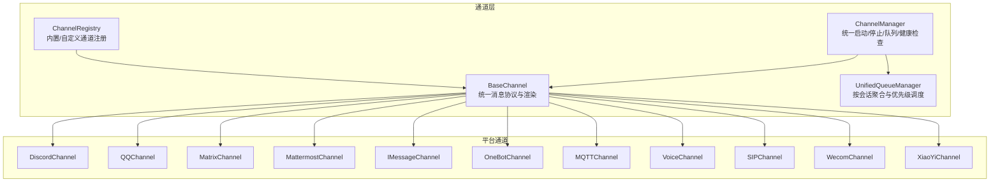
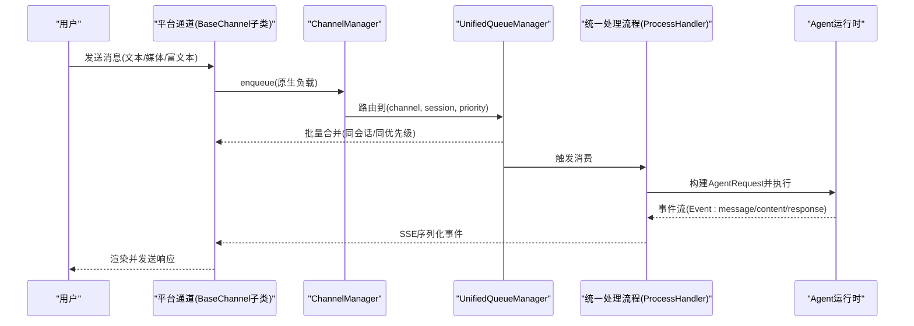
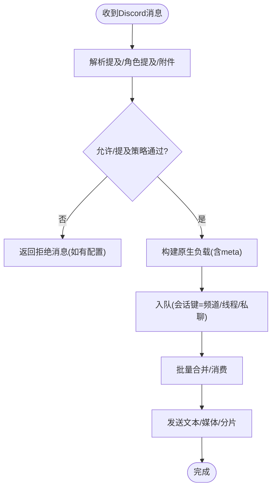
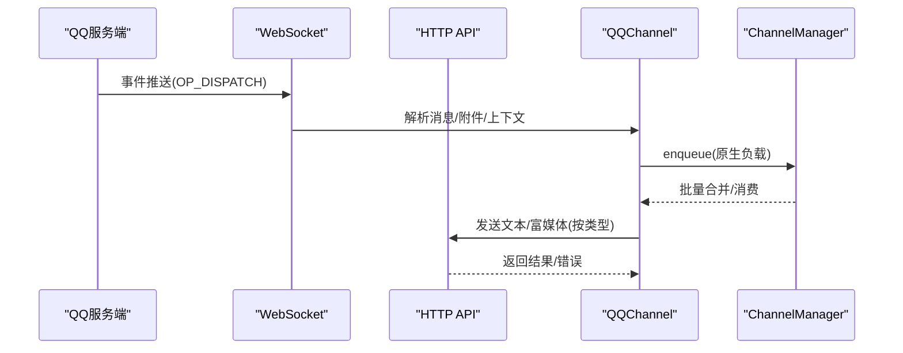
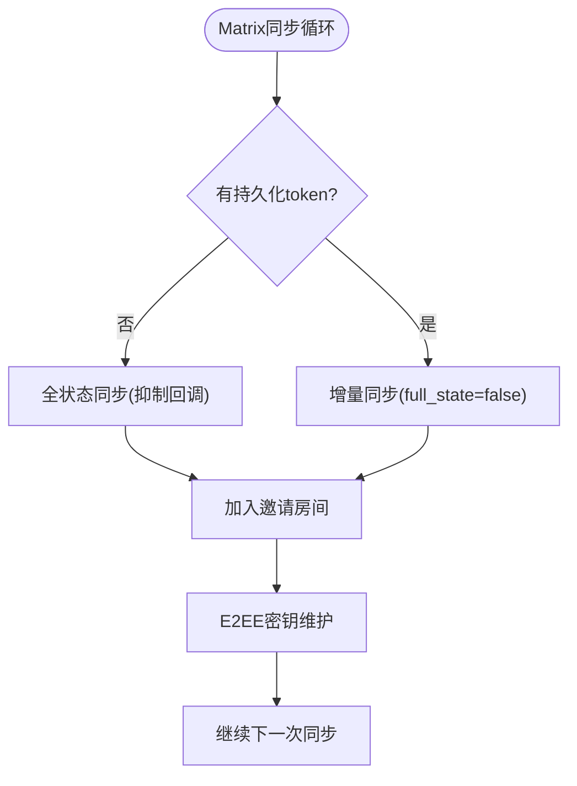
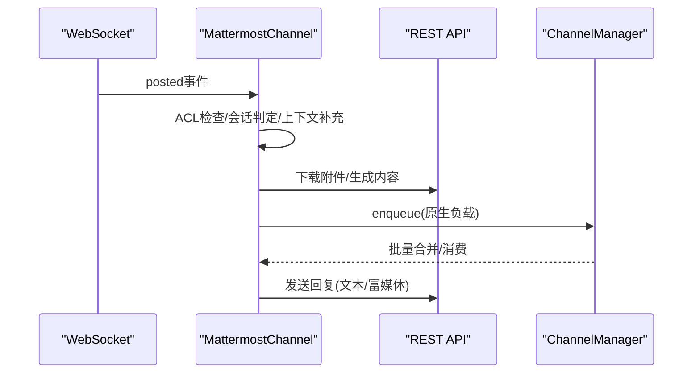
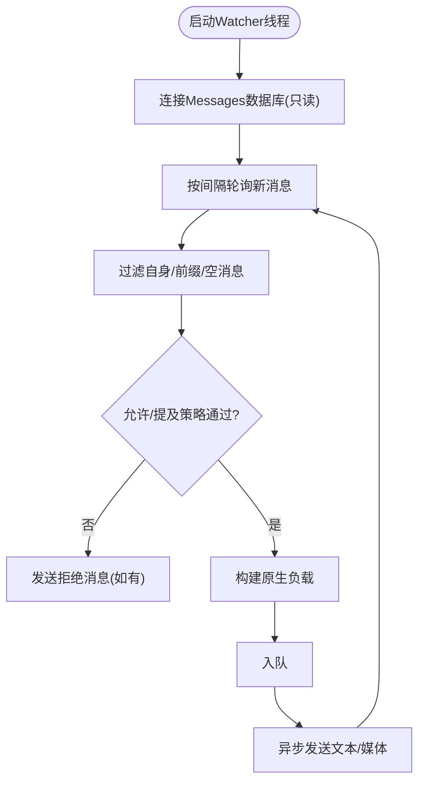
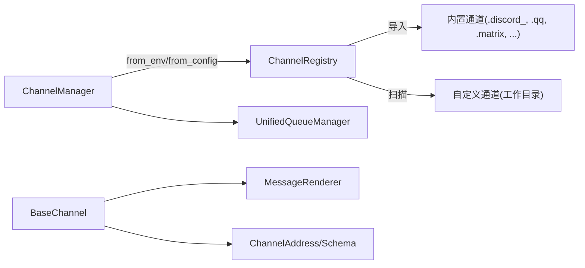

# 其他平台集成

<cite>
**本文引用的文件**
- [src/qwenpaw/app/channels/base.py](file://src/qwenpaw/app/channels/base.py)
- [src/qwenpaw/app/channels/manager.py](file://src/qwenpaw/app/channels/manager.py)
- [src/qwenpaw/app/channels/registry.py](file://src/qwenpaw/app/channels/registry.py)
- [src/qwenpaw/app/channels/schema.py](file://src/qwenpaw/app/channels/schema.py)
- [src/qwenpaw/app/channels/discord_/channel.py](file://src/qwenpaw/app/channels/discord_/channel.py)
- [src/qwenpaw/app/channels/qq/channel.py](file://src/qwenpaw/app/channels/qq/channel.py)
- [src/qwenpaw/app/channels/matrix/channel.py](file://src/qwenpaw/app/channels/matrix/channel.py)
- [src/qwenpaw/app/channels/mattermost/channel.py](file://src/qwenpaw/app/channels/mattermost/channel.py)
- [src/qwenpaw/app/channels/imessage/channel.py](file://src/qwenpaw/app/channels/imessage/channel.py)
- [src/qwenpaw/app/channels/onebot/channel.py](file://src/qwenpaw/app/channels/onebot/channel.py)
- [src/qwenpaw/app/channels/mqtt/channel.py](file://src/qwenpaw/app/channels/mqtt/channel.py)
- [src/qwenpaw/app/channels/voice/channel.py](file://src/qwenpaw/app/channels/voice/channel.py)
- [src/qwenpaw/app/channels/wecom/channel.py](file://src/qwenpaw/app/channels/wecom/channel.py)
- [src/qwenpaw/app/channels/xiaoyi/channel.py](file://src/qwenpaw/app/channels/xiaoyi/channel.py)
- [src/qwenpaw/app/channels/unified_queue_manager.py](file://src/qwenpaw/app/channels/unified_queue_manager.py)
- [src/qwenpaw/app/channels/utils.py](file://src/qwenpaw/app/channels/utils.py)
- [src/qwenpaw/app/channels/renderer.py](file://src/qwenpaw/app/channels/renderer.py)
- [src/qwenpaw/app/channels/command_registry.py](file://src/qwenpaw/app/channels/command_registry.py)
- [src/qwenpaw/app/channels/qrcode_auth_handler.py](file://src/qwenpaw/app/channels/qrcode_auth_handler.py)
- [src/qwenpaw/app/channels/sip/channel.py](file://src/qwenpaw/app/channels/sip/channel.py)
- [src/qwenpaw/app/channels/telegram/channel.py](file://src/qwenpaw/app/channels/telegram/channel.py)
- [src/qwenpaw/app/channels/wechat/channel.py](file://src/qwenpaw/app/channels/wechat/channel.py)
- [src/qwenpaw/app/channels/console/channel.py](file://src/qwenpaw/app/channels/console/channel.py)
- [src/qwenpaw/app/channels/dingtalk/channel.py](file://src/qwenpaw/app/channels/dingtalk/channel.py)
- [src/qwenpaw/app/channels/feishu/channel.py](file://src/qwenpaw/app/channels/feishu/channel.py)
</cite>

## 目录
1. [简介](#简介)
2. [项目结构](#项目结构)
3. [核心组件](#核心组件)
4. [架构总览](#架构总览)
5. [详细组件分析](#详细组件分析)
6. [依赖关系分析](#依赖关系分析)
7. [性能考量](#性能考量)
8. [故障排查指南](#故障排查指南)
9. [结论](#结论)
10. [附录](#附录)

## 简介
本文件面向平台管理员与开发者，系统性梳理 QwenPaw 在多通信平台上的集成方案，覆盖 Discord、QQ、Matrix、Mattermost、iMessage、OneBot、MQTT、语音通话（Voice/SIP）、企业微信（WeCom）与小艺（XiaoYi）等平台。内容包括：
- 统一通道框架与消息处理流程
- 各平台认证机制与 API 调用方式
- 消息处理与会话路由策略
- 平台特性与差异（如 Discord 的服务器角色、QQ 的群聊、Matrix 的去中心化）
- 配置模板、环境变量、Webhook 与安全要点
- 运维部署与扩展规范

## 项目结构
QwenPaw 将“通道”抽象为统一的 BaseChannel 实现，通过 ChannelManager 统一调度与队列化处理，支持按需启用/禁用与热重启。

图示来源
- [src/qwenpaw/app/channels/base.py:78-168](file://src/qwenpaw/app/channels/base.py#L78-L168)
- [src/qwenpaw/app/channels/registry.py:20-37](file://src/qwenpaw/app/channels/registry.py#L20-L37)
- [src/qwenpaw/app/channels/manager.py:68-110](file://src/qwenpaw/app/channels/manager.py#L68-L110)
- [src/qwenpaw/app/channels/unified_queue_manager.py](file://src/qwenpaw/app/channels/unified_queue_manager.py)

章节来源
- [src/qwenpaw/app/channels/base.py:78-168](file://src/qwenpaw/app/channels/base.py#L78-L168)
- [src/qwenpaw/app/channels/registry.py:20-37](file://src/qwenpaw/app/channels/registry.py#L20-L37)
- [src/qwenpaw/app/channels/manager.py:68-110](file://src/qwenpaw/app/channels/manager.py#L68-L110)

## 核心组件
- BaseChannel：定义统一的消息协议、渲染器、会话解析、时间抖动合并、流式事件分发与错误处理骨架。
- ChannelManager：从配置或环境加载通道实例，注入统一处理函数，统一队列与消费者，支持健康检查与单通道热重启。
- ChannelRegistry：内置通道映射与自定义通道发现，支持按需加载与缓存。
- UnifiedQueueManager：按 (channel, session, priority) 聚合消息，批处理与超时保护，避免并发冲突。
- Renderer/Schema：消息渲染风格与通道地址模型，保证跨平台一致输出。

章节来源
- [src/qwenpaw/app/channels/base.py:78-168](file://src/qwenpaw/app/channels/base.py#L78-L168)
- [src/qwenpaw/app/channels/manager.py:68-110](file://src/qwenpaw/app/channels/manager.py#L68-L110)
- [src/qwenpaw/app/channels/registry.py:20-37](file://src/qwenpaw/app/channels/registry.py#L20-L37)
- [src/qwenpaw/app/channels/unified_queue_manager.py](file://src/qwenpaw/app/channels/unified_queue_manager.py)

## 架构总览
统一通道框架以 BaseChannel 为核心，所有平台通道遵循相同的输入/输出契约，经由 ChannelManager 注入统一的 Agent 处理流程，并通过队列与批处理提升吞吐与稳定性。

图示来源
- [src/qwenpaw/app/channels/manager.py:39-66](file://src/qwenpaw/app/channels/manager.py#L39-L66)
- [src/qwenpaw/app/channels/unified_queue_manager.py](file://src/qwenpaw/app/channels/unified_queue_manager.py)
- [src/qwenpaw/app/channels/base.py:630-748](file://src/qwenpaw/app/channels/base.py#L630-L748)

## 详细组件分析

### Discord 通道
- 认证机制：OAuth 应用令牌（Bot Token），可选代理与代理鉴权。
- 消息处理：监听 on_message，识别提及/角色提及，过滤重复消息，支持线程场景；按频道/私聊/线程确定会话。
- 媒体发送：支持图片/视频/音频/文件上传，自动分片与 Markdown 代码块修复。
- 安全与策略：支持白名单/黑名单、提及触发、机器人消息接受开关。
- 环境变量：DISCORD_BOT_TOKEN、DISCORD_HTTP_PROXY、DISCORD_HTTP_PROXY_AUTH、DISCORD_DM_POLICY、DISCORD_GROUP_POLICY、DISCORD_ALLOW_FROM、DISCORD_DENY_MESSAGE、DISCORD_REQUIRE_MENTION、DISCORD_ACCEPT_BOT_MESSAGES、DISCORD_BOT_PREFIX。

图示来源
- [src/qwenpaw/app/channels/discord_/channel.py:114-316](file://src/qwenpaw/app/channels/discord_/channel.py#L114-L316)
- [src/qwenpaw/app/channels/discord_/channel.py:693-714](file://src/qwenpaw/app/channels/discord_/channel.py#L693-L714)

章节来源
- [src/qwenpaw/app/channels/discord_/channel.py:42-120](file://src/qwenpaw/app/channels/discord_/channel.py#L42-L120)
- [src/qwenpaw/app/channels/discord_/channel.py:338-400](file://src/qwenpaw/app/channels/discord_/channel.py#L338-L400)
- [src/qwenpaw/app/channels/discord_/channel.py:495-566](file://src/qwenpaw/app/channels/discord_/channel.py#L495-L566)
- [src/qwenpaw/app/channels/discord_/channel.py:676-692](file://src/qwenpaw/app/channels/discord_/channel.py#L676-L692)
- [src/qwenpaw/app/channels/discord_/channel.py:693-714](file://src/qwenpaw/app/channels/discord_/channel.py#L693-L714)

### QQ 通道
- 认证机制：应用 ID + 客户端密钥换取 Access Token；WebSocket 接收事件，HTTP API 发送消息。
- 消息处理：支持 C2C/频道/群组/私信等事件类型；心跳与断线重连；消息序号与 Markdown 控制；URL 敏感内容清洗。
- 媒体发送：本地/远程 URL/Base64 数据下载后上传；支持图片/音视频/文件；按类型选择 API。
- 安全与策略：URL 清洗、Markdown 降级、错误码识别与恢复；消息序号防抖。
- 环境变量：QQ_APP_ID、QQ_CLIENT_SECRET、QQ_API_BASE、QQ_BOT_PREFIX、QQ_MARKDOWN_ENABLED、QQ_CHANNEL_ENABLED。

图示来源
- [src/qwenpaw/app/channels/qq/channel.py:54-91](file://src/qwenpaw/app/channels/qq/channel.py#L54-L91)
- [src/qwenpaw/app/channels/qq/channel.py:787-800](file://src/qwenpaw/app/channels/qq/channel.py#L787-L800)
- [src/qwenpaw/app/channels/qq/channel.py:356-420](file://src/qwenpaw/app/channels/qq/channel.py#L356-L420)
- [src/qwenpaw/app/channels/qq/channel.py:440-526](file://src/qwenpaw/app/channels/qq/channel.py#L440-L526)

章节来源
- [src/qwenpaw/app/channels/qq/channel.py:646-702](file://src/qwenpaw/app/channels/qq/channel.py#L646-L702)
- [src/qwenpaw/app/channels/qq/channel.py:787-800](file://src/qwenpaw/app/channels/qq/channel.py#L787-L800)
- [src/qwenpaw/app/channels/qq/channel.py:356-420](file://src/qwenpaw/app/channels/qq/channel.py#L356-L420)

### Matrix 通道
- 认证机制：访问令牌或用户名/密码登录；可启用端到端加密（E2EE）。
- 消息处理：长轮询同步，历史缓冲与提及检测；支持 Markdown 到 HTML 转换；DM/群组/房间策略与权限。
- 媒体发送：下载/上传媒体，支持加密事件回调；设备密钥维护。
- 安全与策略：允许列表/禁止列表、每房间策略、提及要求、历史上下文标记。
- 环境变量：HICLAW_MATRIX_SERVER、HICLAW_MATRIX_TOKEN。

图示来源
- [src/qwenpaw/app/channels/matrix/channel.py:591-701](file://src/qwenpaw/app/channels/matrix/channel.py#L591-L701)
- [src/qwenpaw/app/channels/matrix/channel.py:342-368](file://src/qwenpaw/app/channels/matrix/channel.py#L342-L368)

章节来源
- [src/qwenpaw/app/channels/matrix/channel.py:213-256](file://src/qwenpaw/app/channels/matrix/channel.py#L213-L256)
- [src/qwenpaw/app/channels/matrix/channel.py:342-368](file://src/qwenpaw/app/channels/matrix/channel.py#L342-L368)
- [src/qwenpaw/app/channels/matrix/channel.py:591-701](file://src/qwenpaw/app/channels/matrix/channel.py#L591-L701)

### Mattermost 通道
- 认证机制：Bearer Token；WebSocket 监听 posted 事件。
- 消息处理：DM/线程会话模型；上下文补充策略；打字指示器；附件下载与分类。
- 媒体发送：本地/远程文件下载后上传；支持图片/音视频/文件。
- 安全与策略：提及/跟随线程策略、允许列表/禁止列表、提示消息。
- 环境变量：MATTERMOST_URL、MATTERMOST_BOT_TOKEN、MATTERMOST_CHANNEL_ENABLED、MATTERMOST_BOT_PREFIX、MATTERMOST_MEDIA_DIR、MATTERMOST_SHOW_TYPING、MATTERMOST_THREAD_FOLLOW、MATTERMOST_ALLOW_FROM、MATTERMOST_DM_POLICY、MATTERMOST_GROUP_POLICY、MATTERMOST_DENY_MESSAGE。

图示来源
- [src/qwenpaw/app/channels/mattermost/channel.py:502-613](file://src/qwenpaw/app/channels/mattermost/channel.py#L502-L613)
- [src/qwenpaw/app/channels/mattermost/channel.py:286-312](file://src/qwenpaw/app/channels/mattermost/channel.py#L286-L312)

章节来源
- [src/qwenpaw/app/channels/mattermost/channel.py:75-174](file://src/qwenpaw/app/channels/mattermost/channel.py#L75-L174)
- [src/qwenpaw/app/channels/mattermost/channel.py:220-250](file://src/qwenpaw/app/channels/mattermost/channel.py#L220-L250)
- [src/qwenpaw/app/channels/mattermost/channel.py:502-613](file://src/qwenpaw/app/channels/mattermost/channel.py#L502-L613)

### iMessage 通道（macOS）
- 认证机制：依赖系统 Messages 数据库与 imsg 工具；无需额外令牌。
- 消息处理：轮询 SQLite 数据库，过滤自身消息与前缀匹配；支持媒体下载与发送。
- 媒体发送：远程 URL 下载、Base64 数据解码、本地文件直传；大小限制与路径清理。
- 安全与策略：白名单/黑名单、提及要求、拒绝消息回发。
- 环境变量：IMESSAGE_CHANNEL_ENABLED、IMESSAGE_DB_PATH、IMESSAGE_POLL_SEC、IMESSAGE_BOT_PREFIX、IMESSAGE_MEDIA_DIR、IMESSAGE_MAX_DECODED_SIZE、IMESSAGE_DM_POLICY、IMESSAGE_GROUP_POLICY、IMESSAGE_ALLOW_FROM、IMESSAGE_DENY_MESSAGE、IMESSAGE_REQUIRE_MENTION。

图示来源
- [src/qwenpaw/app/channels/imessage/channel.py:241-316](file://src/qwenpaw/app/channels/imessage/channel.py#L241-L316)
- [src/qwenpaw/app/channels/imessage/channel.py:390-400](file://src/qwenpaw/app/channels/imessage/channel.py#L390-L400)
- [src/qwenpaw/app/channels/imessage/channel.py:683-733](file://src/qwenpaw/app/channels/imessage/channel.py#L683-L733)

章节来源
- [src/qwenpaw/app/channels/imessage/channel.py:39-101](file://src/qwenpaw/app/channels/imessage/channel.py#L39-L101)
- [src/qwenpaw/app/channels/imessage/channel.py:102-139](file://src/qwenpaw/app/channels/imessage/channel.py#L102-L139)
- [src/qwenpaw/app/channels/imessage/channel.py:241-316](file://src/qwenpaw/app/channels/imessage/channel.py#L241-L316)

### OneBot 通道
- 认证机制：基于 OneBot 协议（如 GoCQHTTP/ZeroBot），通常使用 WebSocket 或 HTTP 回调。
- 消息处理：适配 OneBot 事件模型，区分私聊/群聊/频道；支持富文本与媒体。
- 媒体发送：按 OneBot API 发送图片/文件/视频等。
- 安全与策略：可结合平台 ACL 与前缀策略。
- 环境变量：根据具体 OneBot 实现而定，常见包括 BOT_ID、ACCESS_TOKEN、API_BASE、WEBSOCKET_URL 等。

章节来源
- [src/qwenpaw/app/channels/onebot/channel.py](file://src/qwenpaw/app/channels/onebot/channel.py)

### MQTT 通道
- 认证机制：用户名/密码或 TLS 客户端证书；主题订阅/发布。
- 消息处理：订阅主题，解析消息为原生负载；发布响应到指定主题。
- 媒体发送：二进制/文本/JSON 消息发布。
- 安全与策略：TLS/认证、主题白名单、QoS 等。
- 环境变量：MQTT_SERVER、MQTT_PORT、MQTT_USERNAME、MQTT_PASSWORD、MQTT_TOPIC_SUB、MQTT_TOPIC_PUB、MQTT_QOS 等。

章节来源
- [src/qwenpaw/app/channels/mqtt/channel.py](file://src/qwenpaw/app/channels/mqtt/channel.py)

### 语音通话（Voice/SIP）
- 认证机制：SIP 注册/鉴权；可结合 Twilio/Twiml。
- 消息处理：语音转写（STT）与语音合成（TTS）；会话管理与呼叫控制。
- 媒体发送：实时音频流转发与回放。
- 安全与策略：DTLS/SRTP 加密、SIP TLS、防火墙穿透。
- 环境变量：SIP_SERVER、SIP_USERNAME、SIP_PASSWORD、TWILIO_ACCOUNT_SID、TWILIO_AUTH_TOKEN 等。

章节来源
- [src/qwenpaw/app/channels/voice/channel.py](file://src/qwenpaw/app/channels/voice/channel.py)
- [src/qwenpaw/app/channels/sip/channel.py](file://src/qwenpaw/app/channels/sip/channel.py)

### 企业微信（WeCom）与小艺（XiaoYi）
- 认证机制：企业应用凭证/应用 Token；回调校验与加解密。
- 消息处理：事件回调（文本/图片/文件/视频/语音）；富文本卡片与工具调用。
- 媒体发送：上传/下载媒体；卡片消息与交互按钮。
- 安全与策略：回调签名、敏感词过滤、会话隔离。
- 环境变量：WECOM_CORP_ID、WECOM_AGENT_ID、WECOM_SECRET、WECOM_TOKEN、WECOM_AES_KEY、XIAOYI_APP_ID、XIAOYI_SECRET 等。

章节来源
- [src/qwenpaw/app/channels/wecom/channel.py](file://src/qwenpaw/app/channels/wecom/channel.py)
- [src/qwenpaw/app/channels/xiaoyi/channel.py](file://src/qwenpaw/app/channels/xiaoyi/channel.py)

## 依赖关系分析
- 通道注册：内置通道映射与自定义通道发现，支持模块级钩子注册 WebAPI。
- 统一队列：按会话键聚合，避免并发冲突；支持优先级与批处理。
- 渲染与样式：统一消息渲染风格，支持隐藏工具详情、过滤思考过程。
- 命令注册：控制命令优先级与路由，影响队列优先级。

图示来源
- [src/qwenpaw/app/channels/registry.py:98-131](file://src/qwenpaw/app/channels/registry.py#L98-L131)
- [src/qwenpaw/app/channels/manager.py:111-216](file://src/qwenpaw/app/channels/manager.py#L111-L216)
- [src/qwenpaw/app/channels/renderer.py](file://src/qwenpaw/app/channels/renderer.py)
- [src/qwenpaw/app/channels/schema.py:12-51](file://src/qwenpaw/app/channels/schema.py#L12-L51)

章节来源
- [src/qwenpaw/app/channels/registry.py:98-131](file://src/qwenpaw/app/channels/registry.py#L98-L131)
- [src/qwenpaw/app/channels/manager.py:111-216](file://src/qwenpaw/app/channels/manager.py#L111-L216)
- [src/qwenpaw/app/channels/schema.py:12-51](file://src/qwenpaw/app/channels/schema.py#L12-L51)

## 性能考量
- 队列与批处理：同会话/同优先级消息合并，降低 Agent 处理次数与网络开销。
- 时间抖动与去抖：无文本消息合并等待，语音消息即时处理，减少延迟。
- 流式事件：支持 reasoning/message 分段事件，前端可渐进展示。
- 并发控制：每通道独立消费者，避免跨通道串扰；支持单通道热重启。
- 资源限制：媒体下载/上传大小限制、URL 白名单/清洗、Markdown 降级。

章节来源
- [src/qwenpaw/app/channels/base.py:290-323](file://src/qwenpaw/app/channels/base.py#L290-L323)
- [src/qwenpaw/app/channels/base.py:488-629](file://src/qwenpaw/app/channels/base.py#L488-L629)
- [src/qwenpaw/app/channels/manager.py:305-351](file://src/qwenpaw/app/channels/manager.py#L305-L351)

## 故障排查指南
- 健康检查：各通道提供 health_check，快速定位连接/令牌/任务状态问题。
- 日志与异常：统一异常封装 ChannelError；事件序列化失败安全回退；错误事件上报。
- 断线重连：QQ（会话/心跳/恢复）、Mattermost（WebSocket 重连）、Matrix（E2EE 维护）。
- 环境变量缺失：通道启动前检查必要参数，失败时记录警告并跳过。
- Webhook/回调：确保回调地址可达、签名验证通过、幂等处理。

章节来源
- [src/qwenpaw/app/channels/discord_/channel.py:641-675](file://src/qwenpaw/app/channels/discord_/channel.py#L641-L675)
- [src/qwenpaw/app/channels/mattermost/channel.py:256-284](file://src/qwenpaw/app/channels/mattermost/channel.py#L256-L284)
- [src/qwenpaw/app/channels/matrix/channel.py:342-368](file://src/qwenpaw/app/channels/matrix/channel.py#L342-L368)
- [src/qwenpaw/app/channels/qq/channel.py:705-746](file://src/qwenpaw/app/channels/qq/channel.py#L705-L746)

## 结论
QwenPaw 通过统一通道框架与队列化处理，实现了对多平台通信的标准化接入。开发者只需关注平台特定的认证与消息转换逻辑，即可快速扩展新的通道；平台管理员可通过配置与环境变量灵活控制行为与安全策略，并借助健康检查与热重启能力保障线上稳定运行。

## 附录

### 统一配置模板（概念示意）
- 通用字段
  - enabled: 是否启用
  - bot_prefix: 前缀（用于过滤自身消息）
  - dm_policy/group_policy: 开放/白名单策略
  - allow_from/deny_message: 允许列表/拒绝消息
  - filter_tool_messages/filter_thinking: 输出过滤
- 平台特有字段（示例）
  - Discord: token、http_proxy、require_mention、accept_bot_messages
  - QQ: app_id、client_secret、markdown_enabled、media_dir
  - Matrix: homeserver、access_token、encryption、history_limit
  - Mattermost: url、bot_token、show_typing、thread_follow_without_mention
  - iMessage: db_path、poll_sec、media_dir、max_decoded_size
  - OneBot/MQTT/Voice/SIP/WeCom/XiaoYi：按平台文档配置

### 部署与运维要点
- 环境变量集中管理，建议使用配置文件与密钥管理服务。
- Webhook/回调需暴露公网地址并配置反向代理与 TLS。
- 媒体存储目录与下载缓存需定期清理。
- 健康检查与告警：定时巡检通道状态，异常自动重启。
- 扩展通道：在自定义通道目录实现 from_config/from_env 与 send/send_content_parts。