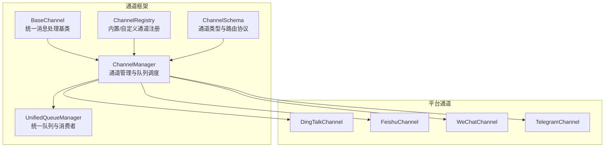
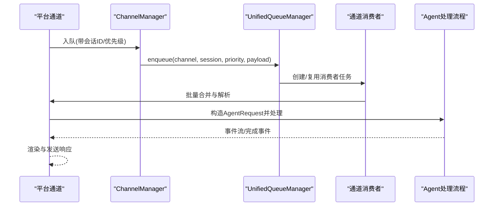
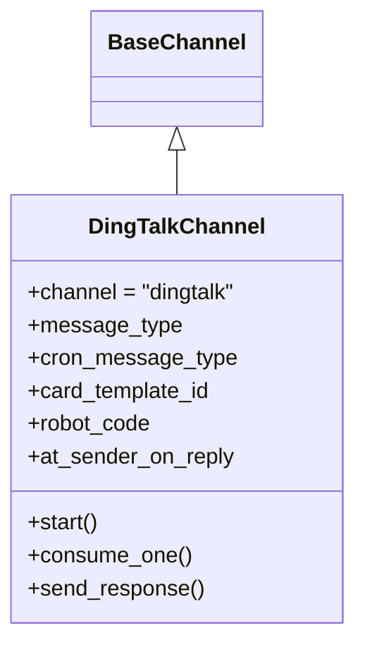
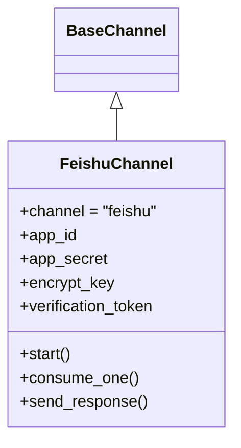
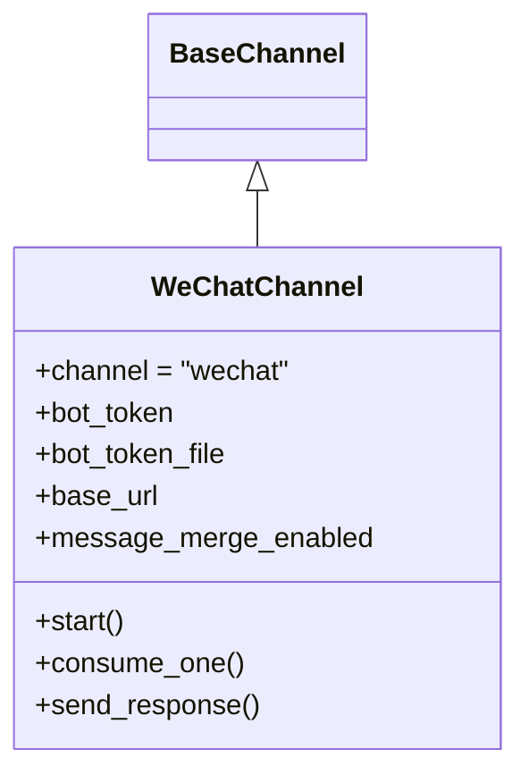
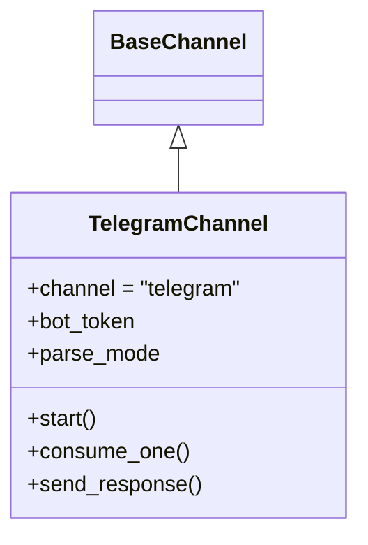
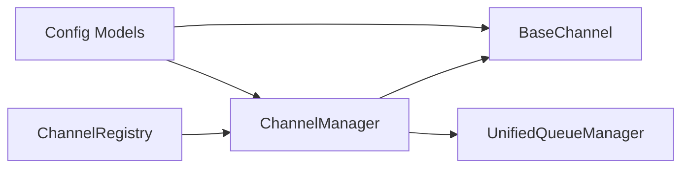

# 平台集成指南

<cite>
**本文引用的文件**
- [src/qwenpaw/app/channels/base.py](file://src/qwenpaw/app/channels/base.py)
- [src/qwenpaw/app/channels/manager.py](file://src/qwenpaw/app/channels/manager.py)
- [src/qwenpaw/app/channels/registry.py](file://src/qwenpaw/app/channels/registry.py)
- [src/qwenpaw/app/channels/schema.py](file://src/qwenpaw/app/channels/schema.py)
- [src/qwenpaw/app/channels/unified_queue_manager.py](file://src/qwenpaw/app/channels/unified_queue_manager.py)
- [src/qwenpaw/app/channels/dingtalk/channel.py](file://src/qwenpaw/app/channels/dingtalk/channel.py)
- [src/qwenpaw/app/channels/feishu/channel.py](file://src/qwenpaw/app/channels/feishu/channel.py)
- [src/qwenpaw/app/channels/wechat/channel.py](file://src/qwenpaw/app/channels/wechat/channel.py)
- [src/qwenpaw/app/channels/telegram/channel.py](file://src/qwenpaw/app/channels/telegram/channel.py)
- [src/qwenpaw/config/config.py](file://src/qwenpaw/config/config.py)
</cite>

## 目录
1. [简介](#简介)
2. [项目结构](#项目结构)
3. [核心组件](#核心组件)
4. [架构总览](#架构总览)
5. [详细组件分析](#详细组件分析)
6. [依赖分析](#依赖分析)
7. [性能考量](#性能考量)
8. [故障排查指南](#故障排查指南)
9. [结论](#结论)
10. [附录](#附录)

## 简介
本指南面向平台管理员与开发者，系统性阐述 QwenPaw 在多通信平台（钉钉、飞书、微信、Telegram 等）的集成方案。内容涵盖：
- 平台认证机制与 Webhook 配置要点
- 消息格式转换与平台特定功能适配
- 消息推送与接收处理流程
- 配置参数、环境变量与安全注意事项
- 跨平台消息同步、用户 ID 映射与群组管理
- 实际配置示例、常见问题与性能优化建议

## 项目结构
QwenPaw 的通道体系以统一的基类与管理器为核心，通过注册表动态加载内置与自定义通道，并使用统一队列管理器实现并发与去重。

图表来源
- [src/qwenpaw/app/channels/base.py](file://src/qwenpaw/app/channels/base.py)
- [src/qwenpaw/app/channels/manager.py](file://src/qwenpaw/app/channels/manager.py)
- [src/qwenpaw/app/channels/registry.py](file://src/qwenpaw/app/channels/registry.py)
- [src/qwenpaw/app/channels/schema.py](file://src/qwenpaw/app/channels/schema.py)
- [src/qwenpaw/app/channels/unified_queue_manager.py](file://src/qwenpaw/app/channels/unified_queue_manager.py)

章节来源
- [src/qwenpaw/app/channels/base.py](file://src/qwenpaw/app/channels/base.py)
- [src/qwenpaw/app/channels/manager.py](file://src/qwenpaw/app/channels/manager.py)
- [src/qwenpaw/app/channels/registry.py](file://src/qwenpaw/app/channels/registry.py)
- [src/qwenpaw/app/channels/schema.py](file://src/qwenpaw/app/channels/schema.py)
- [src/qwenpaw/app/channels/unified_queue_manager.py](file://src/qwenpaw/app/channels/unified_queue_manager.py)

## 核心组件
- 基类 BaseChannel：定义统一的消息处理接口、事件流式回调、会话合并与防抖策略、渲染样式控制等。
- ChannelManager：从配置或环境加载通道实例，注入统一进程处理器，启动统一队列管理器，负责入队、批处理与消费。
- UnifiedQueueManager：基于 (channel_id, session_id, priority) 的三元键实现按会话与优先级隔离的动态消费者模型，支持自动清理空闲队列。
- ChannelRegistry：内置通道清单与自定义通道发现，支持运行时注册额外 HTTP 路由。
- ChannelSchema：通道类型标识、路由地址模型与消息转换协议。

章节来源
- [src/qwenpaw/app/channels/base.py](file://src/qwenpaw/app/channels/base.py)
- [src/qwenpaw/app/channels/manager.py](file://src/qwenpaw/app/channels/manager.py)
- [src/qwenpaw/app/channels/unified_queue_manager.py](file://src/qwenpaw/app/channels/unified_queue_manager.py)
- [src/qwenpaw/app/channels/registry.py](file://src/qwenpaw/app/channels/registry.py)
- [src/qwenpaw/app/channels/schema.py](file://src/qwenpaw/app/channels/schema.py)

## 架构总览
下图展示从平台到统一处理再到响应发送的整体链路，以及统一队列如何保障同一会话的串行化与不同会话的并发化。

图表来源
- [src/qwenpaw/app/channels/manager.py](file://src/qwenpaw/app/channels/manager.py)
- [src/qwenpaw/app/channels/unified_queue_manager.py](file://src/qwenpaw/app/channels/unified_queue_manager.py)
- [src/qwenpaw/app/channels/base.py](file://src/qwenpaw/app/channels/base.py)

## 详细组件分析

### 钉钉（DingTalk）集成
- 认证与接入
  - 使用机器人客户端与卡片能力，支持“会话 Webhook”进行多条消息推送；同时保留单次回复路径以兼容流式回调。
  - 支持卡片模板与自动布局，具备主动发送（proactive send）能力，存储会话 Webhook 以便后续推送。
- 消息格式与适配
  - 输入：解析来自钉钉的事件载荷，提取会话 ID、消息 ID、提及信息等元数据。
  - 输出：将 AgentResponse 渲染为 Markdown 或卡片内容，按需分片发送。
- 队列与并发
  - 通过统一队列按会话隔离，合并短时间内到达的多条消息，避免重复与乱序。
- 关键特性
  - 会话 Webhook 过期时间管理、AI 卡状态机与预刷新、媒体文件下载与本地缓存。
  - 支持“@我”触发与免打扰策略，支持允许白名单与拒绝提示语。

图表来源
- [src/qwenpaw/app/channels/dingtalk/channel.py](file://src/qwenpaw/app/channels/dingtalk/channel.py)
- [src/qwenpaw/app/channels/base.py](file://src/qwenpaw/app/channels/base.py)

章节来源
- [src/qwenpaw/app/channels/dingtalk/channel.py](file://src/qwenpaw/app/channels/dingtalk/channel.py)
- [src/qwenpaw/app/channels/manager.py](file://src/qwenpaw/app/channels/manager.py)
- [src/qwenpaw/app/channels/unified_queue_manager.py](file://src/qwenpaw/app/channels/unified_queue_manager.py)

### 飞书（Feishu）集成
- 认证与接入
  - 通过 WebSocket 接收事件，使用 Open API 发送消息；支持交互式卡片与富文本。
  - 提供加密密钥与验证令牌配置，确保消息安全。
- 消息格式与适配
  - 输入：解析事件中的聊天 ID、消息 ID、发送者信息与媒体资源。
  - 输出：将内容拆分为文本块与交互式内容，按平台限制分片发送。
- 队列与并发
  - 统一队列按会话隔离，结合去重集合防止重复处理。
- 关键特性
  - 会话 ID 规范化（群聊/私聊），昵称缓存与过期阈值，长连接重试退避策略。

图表来源
- [src/qwenpaw/app/channels/feishu/channel.py](file://src/qwenpaw/app/channels/feishu/channel.py)
- [src/qwenpaw/app/channels/base.py](file://src/qwenpaw/app/channels/base.py)

章节来源
- [src/qwenpaw/app/channels/feishu/channel.py](file://src/qwenpaw/app/channels/feishu/channel.py)
- [src/qwenpaw/app/channels/manager.py](file://src/qwenpaw/app/channels/manager.py)
- [src/qwenpaw/app/channels/unified_queue_manager.py](file://src/qwenpaw/app/channels/unified_queue_manager.py)

### 微信（WeChat iLink Bot）集成
- 认证与接入
  - 支持固定 Token 与二维码登录两种模式；首次登录后持久化 Token 文件，便于后续启动。
- 消息格式与适配
  - 输入：长轮询拉取更新，解析文本、图片、语音（转文本）、文件等。
  - 输出：按平台限制拆分文本，支持媒体文件上传与本地缓存。
- 队列与并发
  - 统一队列按用户会话隔离；支持消息合并缓冲与定时器，缓解上下文令牌限制。
- 关键特性
  - 上下文令牌缓存、打字指示器、消息去重集合、媒体文件下载与本地存储。

图表来源
- [src/qwenpaw/app/channels/wechat/channel.py](file://src/qwenpaw/app/channels/wechat/channel.py)
- [src/qwenpaw/app/channels/base.py](file://src/qwenpaw/app/channels/base.py)

章节来源
- [src/qwenpaw/app/channels/wechat/channel.py](file://src/qwenpaw/app/channels/wechat/channel.py)
- [src/qwenpaw/app/channels/manager.py](file://src/qwenpaw/app/channels/manager.py)
- [src/qwenpaw/app/channels/unified_queue_manager.py](file://src/qwenpaw/app/channels/unified_queue_manager.py)

### Telegram 集成
- 认证与接入
  - 使用 Bot API 进行轮询与发送；支持 HTML 解析模式与媒体文件上传。
- 消息格式与适配
  - 输入：解析文本、命令实体、提及等；支持媒体 caption。
  - 输出：按长度限制拆分文本，支持多种媒体类型与远程 URL 解析。
- 队列与并发
  - 统一队列按会话隔离；流式编辑存在速率限制，采用最小间隔策略。
- 关键特性
  - 重连退避、网络错误处理、冲突重试、打字超时与本地媒体缓存。

图表来源
- [src/qwenpaw/app/channels/telegram/channel.py](file://src/qwenpaw/app/channels/telegram/channel.py)
- [src/qwenpaw/app/channels/base.py](file://src/qwenpaw/app/channels/base.py)

章节来源
- [src/qwenpaw/app/channels/telegram/channel.py](file://src/qwenpaw/app/channels/telegram/channel.py)
- [src/qwenpaw/app/channels/manager.py](file://src/qwenpaw/app/channels/manager.py)
- [src/qwenpaw/app/channels/unified_queue_manager.py](file://src/qwenpaw/app/channels/unified_queue_manager.py)

## 依赖分析
- 通道注册与发现
  - 内置通道清单与自定义通道目录扫描，支持模块级路由注册钩子。
- 配置与环境变量
  - 通道配置模型与环境变量映射，支持按通道启用/禁用与策略控制。
- 统一队列与消费者
  - 动态消费者创建、空闲清理、指标统计与批量处理逻辑。

图表来源
- [src/qwenpaw/app/channels/registry.py](file://src/qwenpaw/app/channels/registry.py)
- [src/qwenpaw/app/channels/manager.py](file://src/qwenpaw/app/channels/manager.py)
- [src/qwenpaw/app/channels/unified_queue_manager.py](file://src/qwenpaw/app/channels/unified_queue_manager.py)
- [src/qwenpaw/config/config.py](file://src/qwenpaw/config/config.py)

章节来源
- [src/qwenpaw/app/channels/registry.py](file://src/qwenpaw/app/channels/registry.py)
- [src/qwenpaw/app/channels/manager.py](file://src/qwenpaw/app/channels/manager.py)
- [src/qwenpaw/app/channels/unified_queue_manager.py](file://src/qwenpaw/app/channels/unified_queue_manager.py)
- [src/qwenpaw/config/config.py](file://src/qwenpaw/config/config.py)

## 性能考量
- 队列与批处理
  - 合理设置统一队列最大长度与清理周期，避免内存膨胀。
  - 对于高并发场景，利用会话级隔离与优先级队列提升吞吐。
- 流式输出与速率限制
  - 平台侧存在编辑/发送速率限制时，采用最小间隔策略与占位符提示。
- 媒体处理
  - 下载/解析远端媒体文件前先做大小校验与本地缓存，减少重复 IO。
- 重试与退避
  - 长连接与轮询均应采用指数退避与冲突重试，降低平台限流影响。

## 故障排查指南
- 通道健康检查
  - 通过管理器对指定通道执行健康检查，定位连接与鉴权问题。
- 日志与追踪
  - 统一事件序列化与 UTF-8 安全清洗，异常时记录会话 ID 与代理信息。
- 常见问题
  - 钉钉：会话 Webhook 过期导致主动推送失败，需重新获取或切换 Open API。
  - 飞书：WebSocket 断线重连与加密校验失败，检查密钥与验证令牌。
  - 微信：二维码登录失败或 Token 失效，检查持久化文件与有效期。
  - Telegram：文件过大或网络错误，检查上传限制与代理设置。

章节来源
- [src/qwenpaw/app/channels/manager.py](file://src/qwenpaw/app/channels/manager.py)
- [src/qwenpaw/app/channels/base.py](file://src/qwenpaw/app/channels/base.py)

## 结论
QwenPaw 的通道体系通过统一基类、管理器与队列模型，实现了跨平台的一致行为与可扩展性。平台集成的关键在于：
- 正确的认证与 Webhook 配置
- 消息格式转换与平台能力适配
- 会话隔离与批处理策略
- 安全与性能的平衡

## 附录

### 平台配置参数与环境变量（示例）
- 通用通道参数
  - enabled：是否启用
  - bot_prefix：消息前缀
  - filter_tool_messages / filter_thinking：过滤工具消息与思考过程
  - dm_policy / group_policy：私聊/群组策略（open/allowlist）
  - allow_from / deny_message：允许列表与拒绝提示
- 平台特有参数
  - 钉钉：client_id、client_secret、message_type、cron_message_type、card_template_id、robot_code、at_sender_on_reply
  - 飞书：app_id、app_secret、encrypt_key、verification_token
  - 微信：bot_token、bot_token_file、base_url、message_merge_enabled、message_merge_delay_ms
  - Telegram：bot_token、parse_mode

章节来源
- [src/qwenpaw/config/config.py](file://src/qwenpaw/config/config.py)
- [src/qwenpaw/app/channels/dingtalk/channel.py](file://src/qwenpaw/app/channels/dingtalk/channel.py)
- [src/qwenpaw/app/channels/feishu/channel.py](file://src/qwenpaw/app/channels/feishu/channel.py)
- [src/qwenpaw/app/channels/wechat/channel.py](file://src/qwenpaw/app/channels/wechat/channel.py)
- [src/qwenpaw/app/channels/telegram/channel.py](file://src/qwenpaw/app/channels/telegram/channel.py)

### 跨平台消息同步与用户映射
- 会话 ID 规范
  - 钉钉：会话 Webhook 会话短 ID
  - 飞书：群聊/私聊统一会话前缀
  - 微信：私聊/群组前缀区分
  - Telegram：chat_id
- 用户 ID 映射
  - 平台内唯一标识（如 open_id、chat_id）作为用户与会话的稳定键
- 群组管理
  - 通过平台提供的群组/房间 API 获取成员列表与权限，结合策略控制消息范围

章节来源
- [src/qwenpaw/app/channels/dingtalk/channel.py](file://src/qwenpaw/app/channels/dingtalk/channel.py)
- [src/qwenpaw/app/channels/feishu/channel.py](file://src/qwenpaw/app/channels/feishu/channel.py)
- [src/qwenpaw/app/channels/wechat/channel.py](file://src/qwenpaw/app/channels/wechat/channel.py)
- [src/qwenpaw/app/channels/telegram/channel.py](file://src/qwenpaw/app/channels/telegram/channel.py)

### 开发者扩展新平台的技术规范
- 必备步骤
  - 新建通道类继承 BaseChannel，实现 start/consume_one/send_event/send_response
  - 在注册表中声明通道键名与类映射
  - 如需 HTTP 路由，提供模块级 register_app_routes 钩子并在 /api 前缀下注册
- 配置模型
  - 定义通道配置模型，支持 from_config/from_env 工厂方法
- 队列与批处理
  - 利用统一队列进行会话隔离与批处理，必要时实现 merge_native_items/merge_requests
- 安全与健壮性
  - 异常捕获与健康检查，日志记录与事件序列化清洗

章节来源
- [src/qwenpaw/app/channels/base.py](file://src/qwenpaw/app/channels/base.py)
- [src/qwenpaw/app/channels/registry.py](file://src/qwenpaw/app/channels/registry.py)
- [src/qwenpaw/app/channels/manager.py](file://src/qwenpaw/app/channels/manager.py)
- [src/qwenpaw/app/channels/unified_queue_manager.py](file://src/qwenpaw/app/channels/unified_queue_manager.py)