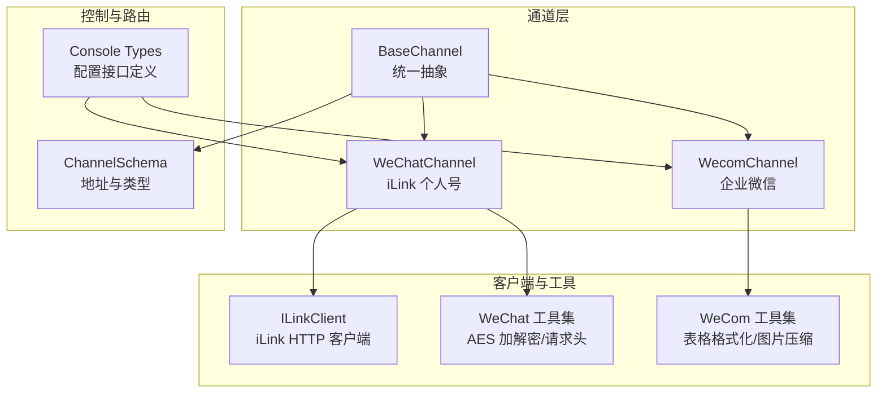
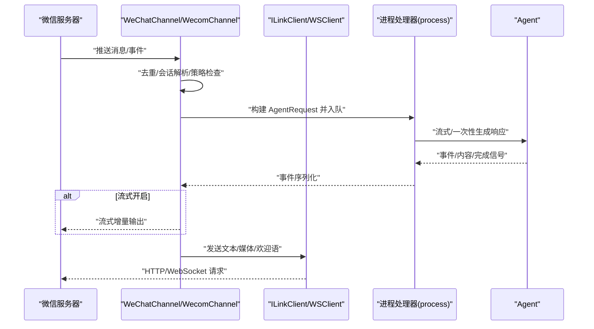
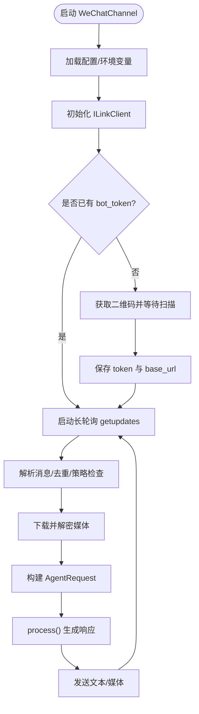
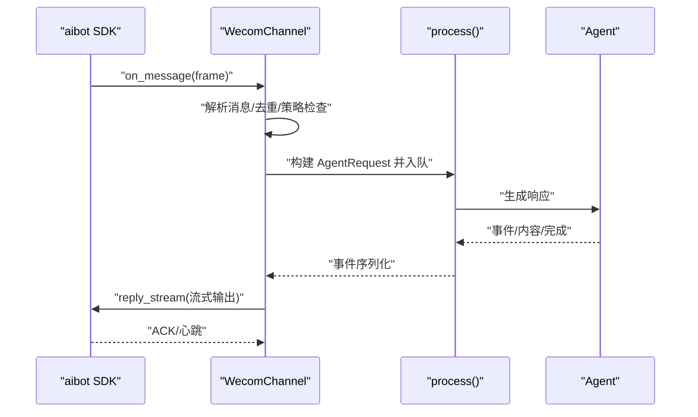
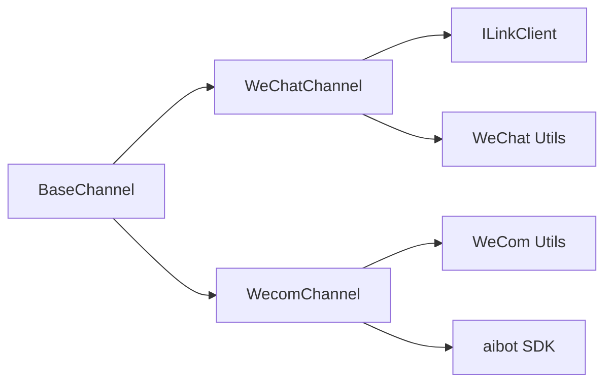

# 微信平台集成

<cite>
**本文引用的文件**
- [src/qwenpaw/app/channels/wechat/channel.py](file://src/qwenpaw/app/channels/wechat/channel.py)
- [src/qwenpaw/app/channels/wechat/client.py](file://src/qwenpaw/app/channels/wechat/client.py)
- [src/qwenpaw/app/channels/wechat/utils.py](file://src/qwenpaw/app/channels/wechat/utils.py)
- [src/qwenpaw/app/channels/wecom/channel.py](file://src/qwenpaw/app/channels/wecom/channel.py)
- [src/qwenpaw/app/channels/wecom/utils.py](file://src/qwenpaw/app/channels/wecom/utils.py)
- [src/qwenpaw/app/channels/base.py](file://src/qwenpaw/app/channels/base.py)
- [src/qwenpaw/app/channels/schema.py](file://src/qwenpaw/app/channels/schema.py)
- [src/qwenpaw/app/channels/wechat/__init__.py](file://src/qwenpaw/app/channels/wechat/__init__.py)
- [src/qwenpaw/app/channels/wecom/__init__.py](file://src/qwenpaw/app/channels/wecom/__init__.py)
- [src/qwenpaw/app/channels/__init__.py](file://src/qwenpaw/app/channels/__init__.py)
- [console/src/api/types/channel.ts](file://console/src/api/types/channel.ts)
- [tests/unit/channels/test_wechat.py](file://tests/unit/channels/test_wechat.py)
- [tests/unit/channels/test_wecom.py](file://tests/unit/channels/test_wecom.py)
</cite>

## 目录
1. [简介](#简介)
2. [项目结构](#项目结构)
3. [核心组件](#核心组件)
4. [架构总览](#架构总览)
5. [详细组件分析](#详细组件分析)
6. [依赖关系分析](#依赖关系分析)
7. [性能考虑](#性能考虑)
8. [故障排查指南](#故障排查指南)
9. [结论](#结论)
10. [附录](#附录)

## 简介
本文件面向平台管理员与开发者，系统化阐述在本项目中对微信平台（微信公众号/个人号机器人 iLink 与企业微信）的集成方案与实现细节。内容涵盖：

- 公众号与企业微信通道的初始化、配置与生命周期管理
- 服务器验证与消息接收/回复处理机制
- 微信特有消息类型的解析与渲染（文本、图片、语音、视频、文件）
- 媒体文件的上传与下载流程（含加密解密）
- 小程序卡片展示能力（企业微信）
- 配置参数说明（AppId/AppSecret/Token/EncodingAESKey 的获取与配置）
- 用户信息获取、关注/取消关注事件处理、群发消息能力
- 微信支付、JSSDK 使用与 OAuth2.0 授权流程的实现要点
- 面向管理员的部署指导与面向开发者的扩展规范及安全注意事项

## 项目结构
微信相关代码主要位于应用层通道模块，采用“通道抽象 + 具体实现”的分层设计，统一通过基类进行会话路由、策略控制与消息合并。



图表来源
- [src/qwenpaw/app/channels/base.py:78-168](file://src/qwenpaw/app/channels/base.py#L78-L168)
- [src/qwenpaw/app/channels/wechat/channel.py:60-162](file://src/qwenpaw/app/channels/wechat/channel.py#L60-L162)
- [src/qwenpaw/app/channels/wecom/channel.py:123-204](file://src/qwenpaw/app/channels/wecom/channel.py#L123-L204)
- [src/qwenpaw/app/channels/wechat/client.py:46-86](file://src/qwenpaw/app/channels/wechat/client.py#L46-L86)
- [src/qwenpaw/app/channels/wechat/utils.py:11-26](file://src/qwenpaw/app/channels/wechat/utils.py#L11-L26)
- [src/qwenpaw/app/channels/wecom/utils.py:17-222](file://src/qwenpaw/app/channels/wecom/utils.py#L17-L222)
- [src/qwenpaw/app/channels/schema.py:12-46](file://src/qwenpaw/app/channels/schema.py#L12-L46)
- [console/src/api/types/channel.ts:144-151](file://console/src/api/types/channel.ts#L144-L151)

章节来源
- [src/qwenpaw/app/channels/base.py:78-168](file://src/qwenpaw/app/channels/base.py#L78-L168)
- [src/qwenpaw/app/channels/wechat/channel.py:60-162](file://src/qwenpaw/app/channels/wechat/channel.py#L60-L162)
- [src/qwenpaw/app/channels/wecom/channel.py:123-204](file://src/qwenpaw/app/channels/wecom/channel.py#L123-L204)
- [src/qwenpaw/app/channels/wechat/client.py:46-86](file://src/qwenpaw/app/channels/wechat/client.py#L46-L86)
- [src/qwenpaw/app/channels/wechat/utils.py:11-26](file://src/qwenpaw/app/channels/wechat/utils.py#L11-L26)
- [src/qwenpaw/app/channels/wecom/utils.py:17-222](file://src/qwenpaw/app/channels/wecom/utils.py#L17-L222)
- [src/qwenpaw/app/channels/schema.py:12-46](file://src/qwenpaw/app/channels/schema.py#L12-L46)
- [console/src/api/types/channel.ts:144-151](file://console/src/api/types/channel.ts#L144-L151)

## 核心组件
- WeChatChannel（iLink 个人号通道）
  - 支持长轮询接收消息、HTTP 发送文本/媒体；支持去重、会话路由、策略控制、媒体下载与本地缓存。
  - 关键特性：QR 登录、上下文令牌持久化、消息合并、打字指示器。
- ILinkClient（iLink HTTP 客户端）
  - 提供二维码登录、消息拉取、发送文本/媒体、上传媒体、下载媒体等 API。
- WecomChannel（企业微信通道）
  - 基于 WebSocket SDK 接收/发送消息，支持文本、图片、语音、文件、视频与混合消息；支持欢迎语、交互卡片、会话共享策略。
- BaseChannel（通道基类）
  - 统一的策略控制（私聊/群聊白名单）、时间合并、流式回调、渲染风格、工作区集成。
- WeChat 工具集与 WeCom 工具集
  - AES-ECB 加解密、请求头生成、表格格式化、图片压缩等。

章节来源
- [src/qwenpaw/app/channels/wechat/channel.py:60-162](file://src/qwenpaw/app/channels/wechat/channel.py#L60-L162)
- [src/qwenpaw/app/channels/wechat/client.py:46-86](file://src/qwenpaw/app/channels/wechat/client.py#L46-L86)
- [src/qwenpaw/app/channels/wecom/channel.py:123-204](file://src/qwenpaw/app/channels/wecom/channel.py#L123-L204)
- [src/qwenpaw/app/channels/base.py:78-168](file://src/qwenpaw/app/channels/base.py#L78-L168)
- [src/qwenpaw/app/channels/wechat/utils.py:11-26](file://src/qwenpaw/app/channels/wechat/utils.py#L11-L26)
- [src/qwenpaw/app/channels/wecom/utils.py:17-222](file://src/qwenpaw/app/channels/wecom/utils.py#L17-L222)

## 架构总览
下图展示了从微信服务器到 Agent 处理再到回复发送的整体流程，以及媒体下载与上传的关键节点。



图表来源
- [src/qwenpaw/app/channels/wechat/channel.py:475-518](file://src/qwenpaw/app/channels/wechat/channel.py#L475-L518)
- [src/qwenpaw/app/channels/wecom/channel.py:412-736](file://src/qwenpaw/app/channels/wecom/channel.py#L412-L736)
- [src/qwenpaw/app/channels/wechat/client.py:205-246](file://src/qwenpaw/app/channels/wechat/client.py#L205-L246)
- [src/qwenpaw/app/channels/base.py:630-747](file://src/qwenpaw/app/channels/base.py#L630-L747)

## 详细组件分析

### WeChatChannel（iLink 个人号通道）
- 初始化与工厂方法
  - 支持从环境变量与配置对象加载参数，如 bot_token、bot_token_file、base_url、媒体目录、消息合并策略等。
- 会话与路由
  - 私聊：wechat:<from_user_id>；群聊：wechat:group:<group_id>。
- 长轮询接收
  - 后台线程运行异步事件循环，持续调用 getupdates，处理返回的消息列表。
- 去重与上下文令牌
  - 基于 context_token 或组合键维护有序去重集合，限制最大容量。
  - 记录用户最新 context_token 以便主动发送。
- 打字指示器
  - 在收到消息后启动“正在输入”指示，并在发送完成后停止。
- 媒体下载与本地缓存
  - 下载 CDN 加密媒体，按 AES-ECB 解密，保存到本地媒体目录，文件名包含 URL 哈希与安全命名。
- 发送文本/媒体
  - 通过 ILinkClient 的 send_text/send_file/send_image/send_video 发送，自动处理加密参数与上传。
- QR 登录
  - 获取二维码、轮询状态、等待确认后保存 bot_token 与 base_url。



图表来源
- [src/qwenpaw/app/channels/wechat/channel.py:168-233](file://src/qwenpaw/app/channels/wechat/channel.py#L168-L233)
- [src/qwenpaw/app/channels/wechat/channel.py:448-518](file://src/qwenpaw/app/channels/wechat/channel.py#L448-L518)
- [src/qwenpaw/app/channels/wechat/channel.py:523-800](file://src/qwenpaw/app/channels/wechat/channel.py#L523-L800)
- [src/qwenpaw/app/channels/wechat/client.py:134-200](file://src/qwenpaw/app/channels/wechat/client.py#L134-L200)
- [src/qwenpaw/app/channels/wechat/client.py:339-386](file://src/qwenpaw/app/channels/wechat/client.py#L339-L386)

章节来源
- [src/qwenpaw/app/channels/wechat/channel.py:60-162](file://src/qwenpaw/app/channels/wechat/channel.py#L60-L162)
- [src/qwenpaw/app/channels/wechat/channel.py:168-233](file://src/qwenpaw/app/channels/wechat/channel.py#L168-L233)
- [src/qwenpaw/app/channels/wechat/channel.py:448-518](file://src/qwenpaw/app/channels/wechat/channel.py#L448-L518)
- [src/qwenpaw/app/channels/wechat/channel.py:523-800](file://src/qwenpaw/app/channels/wechat/channel.py#L523-L800)
- [src/qwenpaw/app/channels/wechat/client.py:134-200](file://src/qwenpaw/app/channels/wechat/client.py#L134-L200)
- [src/qwenpaw/app/channels/wechat/client.py:339-386](file://src/qwenpaw/app/channels/wechat/client.py#L339-L386)

### ILinkClient（iLink HTTP 客户端）
- 生命周期
  - start()/stop() 创建/关闭 httpx.AsyncClient。
- 认证与请求头
  - make_headers() 生成带随机 UIN 与可选 Bearer 的请求头。
- 核心 API
  - get_bot_qrcode/get_qrcode_status/wait_for_login：二维码登录流程。
  - getupdates：长轮询消息。
  - sendmessage/send_text：发送消息。
  - getconfig/sendtyping：输入指示。
  - download_media：下载并解密媒体。
  - getuploadurl/upload_media/send_file/send_image/send_video：媒体上传与发送。

```mermaid
classDiagram
class ILinkClient {
+bot_token : str
+base_url : str
+start()
+stop()
+get_bot_qrcode()
+get_qrcode_status(qrcode)
+wait_for_login(qrcode, ...)
+getupdates(cursor)
+sendmessage(msg)
+send_text(to_user_id, text, context_token)
+getconfig(ilink_user_id, context_token)
+sendtyping(to_user_id, typing_ticket, status)
+download_media(url, aes_key_b64, encrypt_query_param)
+getuploadurl(...)
+upload_media(file_path, media_type, to_user_id)
+send_file/to_user_id, file_path, filename, context_token)
+send_image/to_user_id, image_path, context_token)
+send_video/to_user_id, video_path, context_token)
}
```

图表来源
- [src/qwenpaw/app/channels/wechat/client.py:46-86](file://src/qwenpaw/app/channels/wechat/client.py#L46-L86)
- [src/qwenpaw/app/channels/wechat/client.py:134-200](file://src/qwenpaw/app/channels/wechat/client.py#L134-L200)
- [src/qwenpaw/app/channels/wechat/client.py:205-246](file://src/qwenpaw/app/channels/wechat/client.py#L205-L246)
- [src/qwenpaw/app/channels/wechat/client.py:276-334](file://src/qwenpaw/app/channels/wechat/client.py#L276-L334)
- [src/qwenpaw/app/channels/wechat/client.py:339-386](file://src/qwenpaw/app/channels/wechat/client.py#L339-L386)
- [src/qwenpaw/app/channels/wechat/client.py:387-576](file://src/qwenpaw/app/channels/wechat/client.py#L387-L576)
- [src/qwenpaw/app/channels/wechat/client.py:577-725](file://src/qwenpaw/app/channels/wechat/client.py#L577-L725)

章节来源
- [src/qwenpaw/app/channels/wechat/client.py:46-86](file://src/qwenpaw/app/channels/wechat/client.py#L46-L86)
- [src/qwenpaw/app/channels/wechat/client.py:134-200](file://src/qwenpaw/app/channels/wechat/client.py#L134-L200)
- [src/qwenpaw/app/channels/wechat/client.py:205-246](file://src/qwenpaw/app/channels/wechat/client.py#L205-L246)
- [src/qwenpaw/app/channels/wechat/client.py:276-334](file://src/qwenpaw/app/channels/wechat/client.py#L276-L334)
- [src/qwenpaw/app/channels/wechat/client.py:339-386](file://src/qwenpaw/app/channels/wechat/client.py#L339-L386)
- [src/qwenpaw/app/channels/wechat/client.py:387-576](file://src/qwenpaw/app/channels/wechat/client.py#L387-L576)
- [src/qwenpaw/app/channels/wechat/client.py:577-725](file://src/qwenpaw/app/channels/wechat/client.py#L577-L725)

### WecomChannel（企业微信通道）
- 初始化与工厂方法
  - 支持从环境变量与配置对象加载 bot_id、secret、媒体目录、欢迎语、会话共享策略等。
- 会话与路由
  - 单聊：wecom:<userid>；群聊：wecom:group:<chatid>；可选择群内共享会话或隔离成员。
- WebSocket 接收与发送
  - 使用 aibot SDK 连接，接收帧后解析消息类型（text/image/voice/file/video/mixed），支持引用消息与 quoted 处理。
  - 发送时通过 reply_stream 实现流式输出，配合“正在输入”保持与服务端的心跳。
- 媒体下载与本地缓存
  - download_file 下载并解密，按 URL 哈希与安全命名写入本地媒体目录。
- 交互卡片与工具审批
  - 内置卡片处理器用于工具调用审批卡片的交互。
- 欢迎语
  - enter_chat 事件触发后发送欢迎文本。



图表来源
- [src/qwenpaw/app/channels/wecom/channel.py:412-736](file://src/qwenpaw/app/channels/wecom/channel.py#L412-L736)
- [src/qwenpaw/app/channels/wecom/channel.py:761-796](file://src/qwenpaw/app/channels/wecom/channel.py#L761-L796)
- [src/qwenpaw/app/channels/base.py:630-747](file://src/qwenpaw/app/channels/base.py#L630-L747)

章节来源
- [src/qwenpaw/app/channels/wecom/channel.py:123-204](file://src/qwenpaw/app/channels/wecom/channel.py#L123-L204)
- [src/qwenpaw/app/channels/wecom/channel.py:412-736](file://src/qwenpaw/app/channels/wecom/channel.py#L412-L736)
- [src/qwenpaw/app/channels/wecom/channel.py:761-796](file://src/qwenpaw/app/channels/wecom/channel.py#L761-L796)

### BaseChannel（通道基类）
- 统一策略
  - dm_policy/group_policy 白名单控制、require_mention 群聊@要求、deny_message 自定义拒绝文案。
- 时间合并与去抖
  - 对无文本内容进行缓冲合并，音频消息直接处理。
- 流式回调
  - on_streaming_start/delta/end 回调，支持“思考/消息”两类流式事件。
- 渲染与序列化
  - MessageRenderer 渲染风格控制，事件序列化为 SSE 字符串。

章节来源
- [src/qwenpaw/app/channels/base.py:78-168](file://src/qwenpaw/app/channels/base.py#L78-L168)
- [src/qwenpaw/app/channels/base.py:290-323](file://src/qwenpaw/app/channels/base.py#L290-L323)
- [src/qwenpaw/app/channels/base.py:488-628](file://src/qwenpaw/app/channels/base.py#L488-L628)
- [src/qwenpaw/app/channels/base.py:749-800](file://src/qwenpaw/app/channels/base.py#L749-L800)

### WeChat 工具集与 WeCom 工具集
- WeChat 工具集
  - make_headers：生成带随机 UIN 与可选 Authorization 的请求头。
  - aes_ecb_decrypt/aes_ecb_encrypt：AES-ECB 加解密，兼容多种密钥格式。
  - generate_aes_key_b64：生成随机 AES-128 密钥。
- WeCom 工具集
  - format_markdown_tables：GFM 表格格式化，确保列宽对齐。
  - compress_image_for_wecom：图片压缩至 1.9MB 以内，优先转 JPEG、降质量、再缩放。

章节来源
- [src/qwenpaw/app/channels/wechat/utils.py:11-26](file://src/qwenpaw/app/channels/wechat/utils.py#L11-L26)
- [src/qwenpaw/app/channels/wechat/utils.py:29-88](file://src/qwenpaw/app/channels/wechat/utils.py#L29-L88)
- [src/qwenpaw/app/channels/wechat/utils.py:115-123](file://src/qwenpaw/app/channels/wechat/utils.py#L115-L123)
- [src/qwenpaw/app/channels/wecom/utils.py:17-116](file://src/qwenpaw/app/channels/wecom/utils.py#L17-L116)
- [src/qwenpaw/app/channels/wecom/utils.py:119-222](file://src/qwenpaw/app/channels/wecom/utils.py#L119-L222)

## 依赖关系分析
- 组件耦合
  - WeChatChannel 依赖 ILinkClient 与 BaseChannel；WecomChannel 依赖 BaseChannel 与 aibot SDK。
  - 工具集独立，被各通道复用。
- 外部依赖
  - httpx（WeChat）、aibot SDK（WeCom）、pycryptodome（AES）、Pillow（WeCom 图片压缩）。
- 可能的循环依赖
  - 通道与工具集单向依赖，未见循环。



图表来源
- [src/qwenpaw/app/channels/base.py:78-168](file://src/qwenpaw/app/channels/base.py#L78-L168)
- [src/qwenpaw/app/channels/wechat/channel.py:60-162](file://src/qwenpaw/app/channels/wechat/channel.py#L60-L162)
- [src/qwenpaw/app/channels/wecom/channel.py:123-204](file://src/qwenpaw/app/channels/wecom/channel.py#L123-L204)
- [src/qwenpaw/app/channels/wechat/client.py:46-86](file://src/qwenpaw/app/channels/wechat/client.py#L46-L86)
- [src/qwenpaw/app/channels/wechat/utils.py:11-26](file://src/qwenpaw/app/channels/wechat/utils.py#L11-L26)
- [src/qwenpaw/app/channels/wecom/utils.py:17-222](file://src/qwenpaw/app/channels/wecom/utils.py#L17-L222)

章节来源
- [src/qwenpaw/app/channels/base.py:78-168](file://src/qwenpaw/app/channels/base.py#L78-L168)
- [src/qwenpaw/app/channels/wechat/channel.py:60-162](file://src/qwenpaw/app/channels/wechat/channel.py#L60-L162)
- [src/qwenpaw/app/channels/wecom/channel.py:123-204](file://src/qwenpaw/app/channels/wecom/channel.py#L123-L204)
- [src/qwenpaw/app/channels/wechat/client.py:46-86](file://src/qwenpaw/app/channels/wechat/client.py#L46-L86)
- [src/qwenpaw/app/channels/wechat/utils.py:11-26](file://src/qwenpaw/app/channels/wechat/utils.py#L11-L26)
- [src/qwenpaw/app/channels/wecom/utils.py:17-222](file://src/qwenpaw/app/channels/wecom/utils.py#L17-L222)

## 性能考虑
- 长轮询与后台线程
  - WeChatChannel 使用独立线程与事件循环执行长轮询，避免阻塞主线程。
- 媒体下载与加密
  - 下载与解密在通道侧完成，建议结合本地缓存减少重复下载。
- 去重与合并
  - 去重集合限制大小，消息合并降低上下文碎片化。
- 流式输出
  - WeCom 支持流式增量输出，配合心跳维持连接，提升用户体验。

[本节为通用指导，无需特定文件引用]

## 故障排查指南
- 二维码登录失败
  - 检查网络可达性与超时设置；确认 wait_for_login 返回的 base_url 是否更新。
- 媒体下载失败
  - 确认 encrypt_query_param 与 aes_key 参数正确；检查 CDN 地址与权限。
- AES 解密报错
  - 确认密钥格式（base64/raw hex）与长度（16/24/32 字节）；安装 pycryptodome。
- WeCom 图片过大
  - 使用 compress_image_for_wecom 压缩至 1.9MB 以内。
- 权限与白名单
  - 检查 dm_policy/group_policy 与 allow_from 列表；deny_message 是否被触发。

章节来源
- [src/qwenpaw/app/channels/wechat/client.py:157-200](file://src/qwenpaw/app/channels/wechat/client.py#L157-L200)
- [src/qwenpaw/app/channels/wechat/client.py:339-386](file://src/qwenpaw/app/channels/wechat/client.py#L339-L386)
- [src/qwenpaw/app/channels/wechat/utils.py:29-88](file://src/qwenpaw/app/channels/wechat/utils.py#L29-L88)
- [src/qwenpaw/app/channels/wecom/utils.py:119-222](file://src/qwenpaw/app/channels/wecom/utils.py#L119-L222)
- [src/qwenpaw/app/channels/base.py:324-346](file://src/qwenpaw/app/channels/base.py#L324-L346)

## 结论
本项目对微信平台的集成以“通道抽象 + 具体实现”的方式实现高内聚低耦合的设计，既满足微信公众号（iLink 个人号）的长轮询与 HTTP 发送，也覆盖企业微信的 WebSocket 接收与流式输出。通过完善的去重、合并、策略控制与媒体处理能力，能够稳定支撑多场景的消息交互与业务扩展。

[本节为总结，无需特定文件引用]

## 附录

### 配置参数说明（面向管理员）
- WeChat（iLink 个人号）
  - enabled：启用开关
  - bot_token：机器人令牌（优先使用）
  - bot_token_file：令牌文件路径（首次启动可通过二维码登录生成）
  - base_url：iLink API 基础地址
  - media_dir：媒体文件本地存储目录
  - message_merge_enabled/message_merge_delay_ms：消息合并策略
  - dm_policy/group_policy/allow_from/deny_message：访问控制
- WeCom（企业微信）
  - enabled：启用开关
  - bot_id/secret：机器人标识与密钥
  - media_dir：媒体文件本地存储目录
  - welcome_text：入群欢迎语
  - share_session_in_group：群聊会话共享策略
  - max_reconnect_attempts：最大重连次数
  - dm_policy/group_policy/allow_from/deny_message：访问控制

章节来源
- [console/src/api/types/channel.ts:88-96](file://console/src/api/types/channel.ts#L88-L96)
- [console/src/api/types/channel.ts:144-151](file://console/src/api/types/channel.ts#L144-L151)

### 开发者扩展规范与安全注意事项
- 扩展规范
  - 新增通道需继承 BaseChannel，实现 build_agent_request_from_native 与发送逻辑。
  - 使用统一的策略控制与渲染风格，保证跨通道一致性。
- 安全注意事项
  - 严格管理 bot_token/secret 等敏感信息，避免明文存储与泄露。
  - 媒体下载与上传必须校验加密参数与文件大小，防止越权与滥用。
  - 对外部依赖（httpx/aibot/pycryptodome/Pillow）进行版本锁定与漏洞扫描。

章节来源
- [src/qwenpaw/app/channels/base.py:78-168](file://src/qwenpaw/app/channels/base.py#L78-L168)
- [src/qwenpaw/app/channels/wechat/client.py:387-576](file://src/qwenpaw/app/channels/wechat/client.py#L387-L576)
- [src/qwenpaw/app/channels/wecom/utils.py:119-222](file://src/qwenpaw/app/channels/wecom/utils.py#L119-L222)