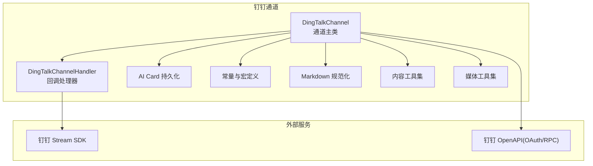
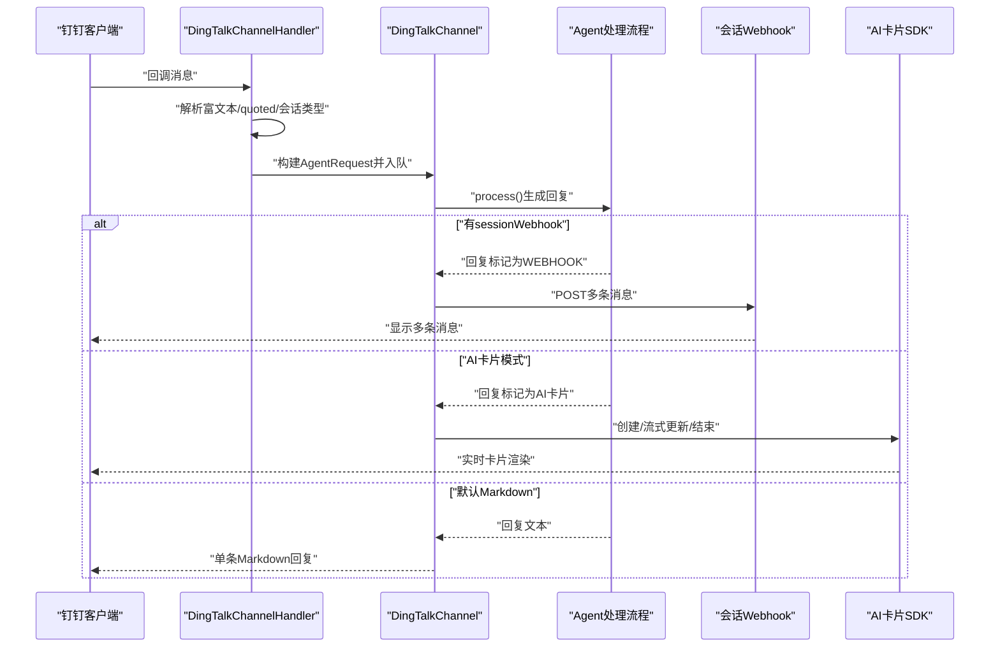
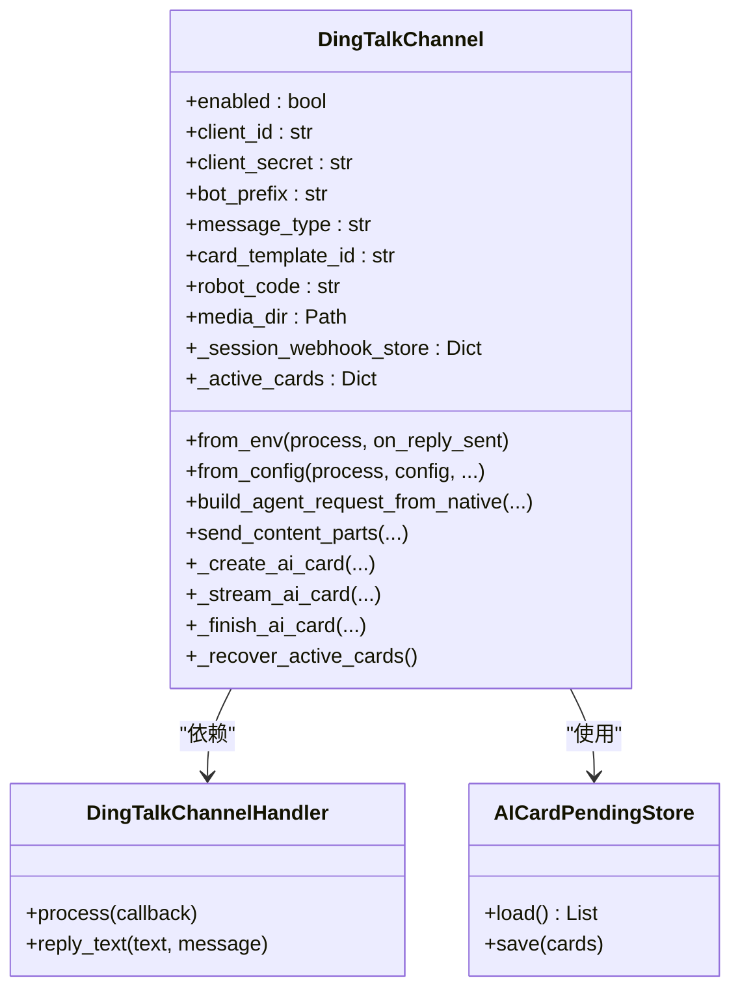
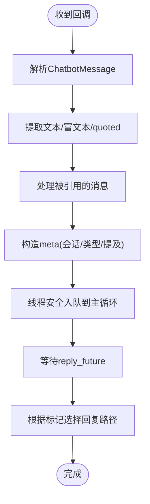
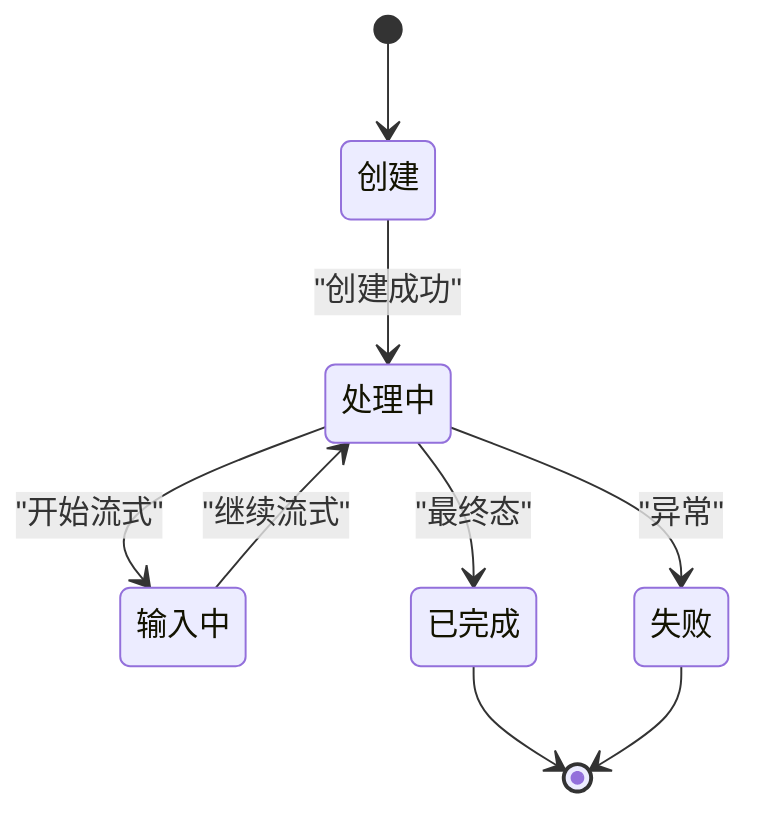
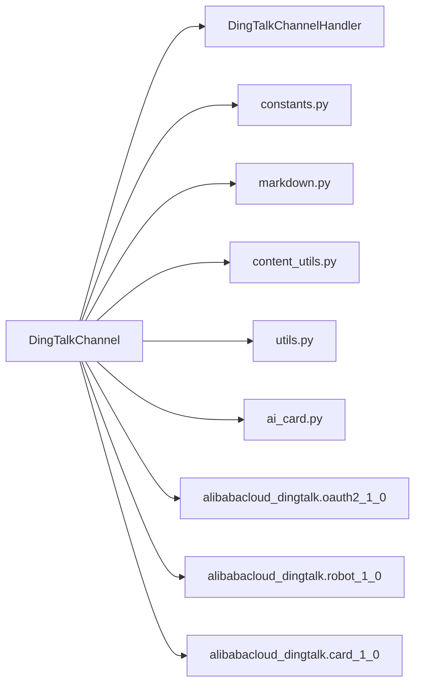

# 钉钉平台集成

<cite>
**本文引用的文件**
- [src/qwenpaw/app/channels/dingtalk/channel.py](file://src/qwenpaw/app/channels/dingtalk/channel.py)
- [src/qwenpaw/app/channels/dingtalk/handler.py](file://src/qwenpaw/app/channels/dingtalk/handler.py)
- [src/qwenpaw/app/channels/dingtalk/ai_card.py](file://src/qwenpaw/app/channels/dingtalk/ai_card.py)
- [src/qwenpaw/app/channels/dingtalk/constants.py](file://src/qwenpaw/app/channels/dingtalk/constants.py)
- [src/qwenpaw/app/channels/dingtalk/markdown.py](file://src/qwenpaw/app/channels/dingtalk/markdown.py)
- [src/qwenpaw/app/channels/dingtalk/utils.py](file://src/qwenpaw/app/channels/dingtalk/utils.py)
- [src/qwenpaw/app/channels/dingtalk/content_utils.py](file://src/qwenpaw/app/channels/dingtalk/content_utils.py)
- [src/qwenpaw/config/config.py](file://src/qwenpaw/config/config.py)
- [tests/unit/channels/test_dingtalk.py](file://tests/unit/channels/test_dingtalk.py)
- [console/src/api/types/channel.ts](file://console/src/api/types/channel.ts)
- [console/src/constants/channel.ts](file://console/src/constants/channel.ts)
</cite>

## 目录
1. [简介](#简介)
2. [项目结构](#项目结构)
3. [核心组件](#核心组件)
4. [架构总览](#架构总览)
5. [详细组件分析](#详细组件分析)
6. [依赖分析](#依赖分析)
7. [性能考虑](#性能考虑)
8. [故障排查指南](#故障排查指南)
9. [结论](#结论)
10. [附录](#附录)

## 简介
本技术文档面向平台管理员与开发者，系统化阐述在本仓库中对钉钉企业内部沟通平台的集成实现。内容涵盖应用与机器人配置、Webhook 回调接入、消息处理机制、消息格式转换与 Markdown 渲染、AI 卡片展示与富文本处理、配置参数（如 CorpId、AppKey、AppSecret 等）的获取与配置方法、用户 ID 映射与群组管理策略，以及部署与 API 调用示例与常见问题解决方案。

## 项目结构
钉钉通道位于后端应用通道模块下，采用“通道 + 处理器 + 工具集”的分层设计：
- 通道层：负责与钉钉 Stream/Webhook 对接、消息收发与状态管理
- 处理器层：负责将钉钉回调转换为统一的 AgentRequest 并协调回复
- 工具层：负责类型映射、Markdown 规范化、媒体后缀猜测、会话 Webhook 存储等

图表来源
- [src/qwenpaw/app/channels/dingtalk/channel.py:112-326](file://src/qwenpaw/app/channels/dingtalk/channel.py#L112-L326)
- [src/qwenpaw/app/channels/dingtalk/handler.py:39-619](file://src/qwenpaw/app/channels/dingtalk/handler.py#L39-L619)
- [src/qwenpaw/app/channels/dingtalk/ai_card.py:19-79](file://src/qwenpaw/app/channels/dingtalk/ai_card.py#L19-L79)
- [src/qwenpaw/app/channels/dingtalk/constants.py:1-33](file://src/qwenpaw/app/channels/dingtalk/constants.py#L1-L33)
- [src/qwenpaw/app/channels/dingtalk/markdown.py:1-111](file://src/qwenpaw/app/channels/dingtalk/markdown.py#L1-L111)
- [src/qwenpaw/app/channels/dingtalk/content_utils.py:1-146](file://src/qwenpaw/app/channels/dingtalk/content_utils.py#L1-L146)
- [src/qwenpaw/app/channels/dingtalk/utils.py:1-34](file://src/qwenpaw/app/channels/dingtalk/utils.py#L1-L34)

章节来源
- [src/qwenpaw/app/channels/dingtalk/channel.py:112-326](file://src/qwenpaw/app/channels/dingtalk/channel.py#L112-L326)
- [src/qwenpaw/app/channels/dingtalk/handler.py:39-619](file://src/qwenpaw/app/channels/dingtalk/handler.py#L39-L619)

## 核心组件
- 通道主类：负责初始化、环境变量与配置对象注入、会话 Webhook 存储与恢复、消息去重、回复合并、AI 卡片生命周期管理、OpenAPI 客户端封装与令牌缓存。
- 回调处理器：负责将钉钉回调解析为统一内容结构，提取会话 Webhook、对话类型、提及状态等元数据，并通过 Future 机制与通道主类协作完成回复。
- AI 卡片持久化：记录进行中的卡片实例，支持崩溃恢复与最终态更新。
- 常量与宏定义：统一管理钉钉消息类型映射、令牌缓存时长、最小流式间隔、会话 ID 截断长度、Webhook 过期安全边界等。
- Markdown 规范化：确保列表与代码块在钉钉渲染正确性。
- 内容工具集：解析富文本、提取 quoted 内容、生成短会话 ID、从 URL 提取 session 参数等。
- 媒体工具集：根据文件头猜测真实后缀，修复下载链接返回 .file 的问题。

章节来源
- [src/qwenpaw/app/channels/dingtalk/channel.py:112-326](file://src/qwenpaw/app/channels/dingtalk/channel.py#L112-L326)
- [src/qwenpaw/app/channels/dingtalk/handler.py:39-619](file://src/qwenpaw/app/channels/dingtalk/handler.py#L39-L619)
- [src/qwenpaw/app/channels/dingtalk/ai_card.py:19-79](file://src/qwenpaw/app/channels/dingtalk/ai_card.py#L19-L79)
- [src/qwenpaw/app/channels/dingtalk/constants.py:1-33](file://src/qwenpaw/app/channels/dingtalk/constants.py#L1-L33)
- [src/qwenpaw/app/channels/dingtalk/markdown.py:1-111](file://src/qwenpaw/app/channels/dingtalk/markdown.py#L1-L111)
- [src/qwenpaw/app/channels/dingtalk/content_utils.py:1-146](file://src/qwenpaw/app/channels/dingtalk/content_utils.py#L1-L146)
- [src/qwenpaw/app/channels/dingtalk/utils.py:1-34](file://src/qwenpaw/app/channels/dingtalk/utils.py#L1-L34)

## 架构总览
钉钉集成采用“Stream 回调 + Webhook 多消息 + AI 卡片流式”三通道协同：
- Stream 回调：请求-应答模型，适合单次回复；通道在收到回调后解析消息、去重、构建 AgentRequest，并通过 Future 等待回复文本。
- Webhook 多消息：当存在 sessionWebhook 时，通道可直接向钉钉会话发送多条消息，适合长文本或分步反馈。
- AI 卡片流式：在开启卡片模式时，先创建卡片实例，随后以流式更新方式推送中间态与最终态，支持崩溃恢复与令牌刷新。

图表来源
- [src/qwenpaw/app/channels/dingtalk/handler.py:384-619](file://src/qwenpaw/app/channels/dingtalk/handler.py#L384-L619)
- [src/qwenpaw/app/channels/dingtalk/channel.py:776-800](file://src/qwenpaw/app/channels/dingtalk/channel.py#L776-L800)
- [src/qwenpaw/app/channels/dingtalk/constants.py:4-6](file://src/qwenpaw/app/channels/dingtalk/constants.py#L4-L6)

## 详细组件分析

### 通道主类（DingTalkChannel）
职责与特性：
- 初始化与配置注入：支持从环境变量与配置对象注入，含消息类型、卡片模板、机器人编码、媒体目录、策略开关等。
- 会话 Webhook 管理：内存与磁盘双层存储，键值为“dingtalk:sw:<session_id>”，支持加载、保存、失效清理与过期判断。
- 去重与回复合并：基于消息 ID 去重，支持批量 Future 合并一次性回复，避免重复与风暴。
- OpenAPI 客户端封装：封装 OAuth、Robot、Card 三大 SDK 客户端，提供令牌缓存与预刷新。
- AI 卡片生命周期：创建、流式更新、结束、崩溃恢复、持久化存储。
- Markdown 与富文本处理：统一输出格式，保证渲染一致性。

图表来源
- [src/qwenpaw/app/channels/dingtalk/channel.py:112-326](file://src/qwenpaw/app/channels/dingtalk/channel.py#L112-L326)
- [src/qwenpaw/app/channels/dingtalk/handler.py:39-619](file://src/qwenpaw/app/channels/dingtalk/handler.py#L39-L619)
- [src/qwenpaw/app/channels/dingtalk/ai_card.py:32-79](file://src/qwenpaw/app/channels/dingtalk/ai_card.py#L32-L79)

章节来源
- [src/qwenpaw/app/channels/dingtalk/channel.py:112-326](file://src/qwenpaw/app/channels/dingtalk/channel.py#L112-L326)
- [src/qwenpaw/app/channels/dingtalk/channel.py:776-800](file://src/qwenpaw/app/channels/dingtalk/channel.py#L776-L800)
- [src/qwenpaw/app/channels/dingtalk/channel.py:1885-1925](file://src/qwenpaw/app/channels/dingtalk/channel.py#L1885-L1925)
- [src/qwenpaw/app/channels/dingtalk/channel.py:2035-2058](file://src/qwenpaw/app/channels/dingtalk/channel.py#L2035-L2058)
- [src/qwenpaw/app/channels/dingtalk/channel.py:2112-2147](file://src/qwenpaw/app/channels/dingtalk/channel.py#L2112-L2147)

### 回调处理器（DingTalkChannelHandler）
职责与特性：
- 将钉钉回调转换为统一的 native 字典，包含渠道 ID、发送者、内容部件、会话 Webhook、对话类型、提及状态等。
- 解析富文本与 quoted 内容，优先使用语音识别结果而非下载音频文件。
- 通过线程安全方式将 native 消息投递到主循环，等待 Future 结果并回复。

图表来源
- [src/qwenpaw/app/channels/dingtalk/handler.py:384-619](file://src/qwenpaw/app/channels/dingtalk/handler.py#L384-L619)
- [src/qwenpaw/app/channels/dingtalk/content_utils.py:148-211](file://src/qwenpaw/app/channels/dingtalk/content_utils.py#L148-L211)

章节来源
- [src/qwenpaw/app/channels/dingtalk/handler.py:384-619](file://src/qwenpaw/app/channels/dingtalk/handler.py#L384-L619)

### AI 卡片与流式更新
- 卡片状态机：处理中、输入中、已完成、失败；仅非终态会被持久化。
- 流式最小间隔：避免频繁更新导致的抖动与风控。
- 崩溃恢复：启动时加载持久化的卡片并尝试续流。
- 令牌刷新：遇到 401 自动刷新令牌并重试。

图表来源
- [src/qwenpaw/app/channels/dingtalk/ai_card.py:12-16](file://src/qwenpaw/app/channels/dingtalk/ai_card.py#L12-L16)
- [src/qwenpaw/app/channels/dingtalk/ai_card.py:32-79](file://src/qwenpaw/app/channels/dingtalk/ai_card.py#L32-L79)
- [src/qwenpaw/app/channels/dingtalk/constants.py:11-12](file://src/qwenpaw/app/channels/dingtalk/constants.py#L11-L12)

章节来源
- [src/qwenpaw/app/channels/dingtalk/ai_card.py:12-16](file://src/qwenpaw/app/channels/dingtalk/ai_card.py#L12-L16)
- [src/qwenpaw/app/channels/dingtalk/ai_card.py:32-79](file://src/qwenpaw/app/channels/dingtalk/ai_card.py#L32-L79)
- [src/qwenpaw/app/channels/dingtalk/constants.py:11-12](file://src/qwenpaw/app/channels/dingtalk/constants.py#L11-L12)

### Markdown 渲染与富文本处理
- 列表空行：确保编号列表前有空行，避免与上一段落合并。
- 代码块缩进：移除缩进 fenced 代码块的统一缩进，避免渲染异常。
- 可选前缀：对代码块内每行添加前缀，作为兜底修复手段。
- 类型映射：picture/voice 等映射为统一内容类型，便于下游处理。

章节来源
- [src/qwenpaw/app/channels/dingtalk/markdown.py:7-111](file://src/qwenpaw/app/channels/dingtalk/markdown.py#L7-L111)
- [src/qwenpaw/app/channels/dingtalk/constants.py:20-24](file://src/qwenpaw/app/channels/dingtalk/constants.py#L20-L24)

### 会话 Webhook 管理与持久化
- 键命名：dingtalk:sw:<session_id>，其中 session_id 为 conversation_id 的短后缀。
- 存储位置：工作空间目录或全局配置目录，支持重启后恢复。
- 过期判定：Webhook 到期时间前 5 分钟视为过期，避免无效发送。
- 失效清理：发送失败时清空 webhook，保留必要元数据以便 OpenAPI 回退。

章节来源
- [src/qwenpaw/app/channels/dingtalk/channel.py:423-476](file://src/qwenpaw/app/channels/dingtalk/channel.py#L423-L476)
- [src/qwenpaw/app/channels/dingtalk/channel.py:513-584](file://src/qwenpaw/app/channels/dingtalk/channel.py#L513-L584)
- [src/qwenpaw/app/channels/dingtalk/constants.py:31-32](file://src/qwenpaw/app/channels/dingtalk/constants.py#L31-L32)

### 配置参数与获取方法
- 环境变量注入：from_env 支持 DINGTALK_* 系列环境变量，便于容器化部署。
- 配置对象注入：from_config 支持从配置对象注入，便于集中管理。
- 关键参数说明：
  - enabled：是否启用
  - client_id/client_secret：企业应用凭证
  - robot_code：机器人编码（未设置时回退为 client_id）
  - message_type/cron_message_type：消息类型（markdown/card/text）
  - card_template_id/key：AI 卡片模板标识与键名
  - dm_policy/group_policy：私聊/群聊策略（open/allowlist）
  - allow_from：允许来源白名单
  - require_mention：是否要求被 @ 才响应
  - at_sender_on_reply：回复时是否 @ 发送者
  - media_dir：媒体文件本地目录
  - card_auto_layout：卡片自动布局
- 获取方法：
  - 企业内部应用：在钉钉开发者后台创建应用，获取 AppKey/AppSecret/机器人编码。
  - Webhook：在会话中获取 sessionWebhook，用于多消息发送与定时任务推送。
  - 令牌：通过 OAuth SDK 获取 accessToken，通道内置缓存与预刷新。

章节来源
- [src/qwenpaw/app/channels/dingtalk/channel.py:235-279](file://src/qwenpaw/app/channels/dingtalk/channel.py#L235-L279)
- [src/qwenpaw/app/channels/dingtalk/channel.py:281-326](file://src/qwenpaw/app/channels/dingtalk/channel.py#L281-L326)
- [src/qwenpaw/config/config.py:220-260](file://src/qwenpaw/config/config.py#L220-L260)
- [src/qwenpaw/config/config.py:437-445](file://src/qwenpaw/config/config.py#L437-L445)

### 用户 ID 映射与群组管理
- 用户 ID 映射：发送者昵称 + 最后四位 ID 组合，避免泄露完整 ID。
- 群组管理：根据 conversation_type 区分私聊/群聊，结合策略与白名单控制。
- 提及检测：根据 isInAtList 判断是否需要 @ 才响应（受 require_mention 影响）。

章节来源
- [src/qwenpaw/app/channels/dingtalk/content_utils.py:63-90](file://src/qwenpaw/app/channels/dingtalk/content_utils.py#L63-L90)
- [src/qwenpaw/app/channels/dingtalk/handler.py:473-488](file://src/qwenpaw/app/channels/dingtalk/handler.py#L473-L488)
- [src/qwenpaw/app/channels/dingtalk/handler.py:490-523](file://src/qwenpaw/app/channels/dingtalk/handler.py#L490-L523)

### 部署配置示例与 API 调用示例
- 部署要点：
  - 设置 DINGTALK_CHANNEL_ENABLED、DINGTALK_CLIENT_ID、DINGTALK_CLIENT_SECRET、DINGTALK_ROBOT_CODE 等环境变量。
  - 若启用 AI 卡片，需配置 DINGTALK_CARD_TEMPLATE_ID 与 DINGTALK_CARD_TEMPLATE_KEY。
  - 若启用 Webhook 多消息，确保会话中存在有效的 sessionWebhook。
- API 调用要点：
  - 使用 OpenAPI 客户端进行主动推送（如 cron 任务），注意令牌有效期与预刷新。
  - 使用卡片 SDK 进行流式更新，遵循最小间隔与终态处理。
- 常见问题：
  - Webhook 过期：检查 sessionWebhookExpiredTime，提前清理失效项。
  - 401 令牌错误：通道会自动刷新令牌并重试。
  - 重复消息：通道内置去重，若仍出现请检查消息 ID 与回调幂等性。

章节来源
- [src/qwenpaw/app/channels/dingtalk/channel.py:2729-2731](file://src/qwenpaw/app/channels/dingtalk/channel.py#L2729-L2731)
- [src/qwenpaw/app/channels/dingtalk/channel.py:2035-2058](file://src/qwenpaw/app/channels/dingtalk/channel.py#L2035-L2058)
- [src/qwenpaw/app/channels/dingtalk/channel.py:513-584](file://src/qwenpaw/app/channels/dingtalk/channel.py#L513-L584)

## 依赖分析
- 组件耦合：
  - 通道主类依赖处理器、常量、Markdown、内容工具与媒体工具。
  - 处理器依赖通道提供的线程安全入队与 Future 机制。
  - AI 卡片依赖持久化存储与 OpenAPI/OAuth 客户端。
- 外部依赖：
  - 钉钉 Stream SDK：接收回调与回复。
  - 钉钉 OpenAPI：OAuth 获取令牌、机器人消息发送、卡片创建与流式更新。
- 循环依赖：
  - 未发现循环导入；模块间通过接口与回调解耦。

图表来源
- [src/qwenpaw/app/channels/dingtalk/channel.py:38-53](file://src/qwenpaw/app/channels/dingtalk/channel.py#L38-L53)
- [src/qwenpaw/app/channels/dingtalk/handler.py:10-11](file://src/qwenpaw/app/channels/dingtalk/handler.py#L10-L11)
- [src/qwenpaw/app/channels/dingtalk/ai_card.py:1-2](file://src/qwenpaw/app/channels/dingtalk/ai_card.py#L1-L2)
- [src/qwenpaw/app/channels/dingtalk/constants.py:1-33](file://src/qwenpaw/app/channels/dingtalk/constants.py#L1-L33)

章节来源
- [src/qwenpaw/app/channels/dingtalk/channel.py:38-53](file://src/qwenpaw/app/channels/dingtalk/channel.py#L38-L53)
- [src/qwenpaw/app/channels/dingtalk/handler.py:10-11](file://src/qwenpaw/app/channels/dingtalk/handler.py#L10-L11)

## 性能考虑
- 去重与批处理：基于消息 ID 去重，合并批量 Future，减少重复计算与网络往返。
- 流式最小间隔：限制 AI 卡片流式更新频率，降低 API 压力与渲染抖动。
- 令牌缓存与预刷新：避免频繁获取令牌带来的延迟与风控。
- Webhook 多消息：在存在 sessionWebhook 时优先使用，减少 Stream 回调压力。
- 媒体下载优化：优先使用语音识别文本，避免不必要的音频下载与转码。

## 故障排查指南
- Webhook 发送失败：
  - 检查 sessionWebhook 是否过期（提前 5 分钟视为过期）。
  - 清理失效项并回退至 OpenAPI 主动推送。
- 401 令牌错误：
  - 通道会自动刷新令牌并重试；若持续失败，请检查 AppKey/AppSecret 与网络连通性。
- 重复消息或消息丢失：
  - 检查消息 ID 去重逻辑与回调幂等性；确认 Stream SDK 版本与回调幂等策略。
- Markdown 渲染异常：
  - 使用 normalize_dingtalk_markdown 规范化文本；必要时启用代码块前缀修复。
- AI 卡片未更新：
  - 确认最小流式间隔与终态处理；检查持久化文件是否存在与权限。

章节来源
- [src/qwenpaw/app/channels/dingtalk/channel.py:513-584](file://src/qwenpaw/app/channels/dingtalk/channel.py#L513-L584)
- [src/qwenpaw/app/channels/dingtalk/channel.py:2035-2058](file://src/qwenpaw/app/channels/dingtalk/channel.py#L2035-L2058)
- [src/qwenpaw/app/channels/dingtalk/markdown.py:96-111](file://src/qwenpaw/app/channels/dingtalk/markdown.py#L96-L111)
- [src/qwenpaw/app/channels/dingtalk/ai_card.py:32-79](file://src/qwenpaw/app/channels/dingtalk/ai_card.py#L32-L79)

## 结论
本集成方案以“Stream 回调 + Webhook 多消息 + AI 卡片流式”为核心，结合去重、批处理、令牌缓存与崩溃恢复等机制，在钉钉平台上实现了稳定、可扩展的企业级消息处理能力。通过环境变量与配置对象注入，满足不同部署形态的需求；通过 Markdown 规范化与富文本处理，保障消息渲染质量；通过会话 Webhook 与 OpenAPI 回退，兼顾即时交互与主动推送场景。

## 附录
- 控制台前端对钉钉通道的枚举与颜色标识，便于在管理界面中识别与配置。
- 单元测试覆盖了会话 Webhook 存取、令牌缓存、消息去重、发送路径与 AI 卡片生命周期等关键逻辑，建议在变更时运行测试以验证行为。

章节来源
- [console/src/api/types/channel.ts:23-23](file://console/src/api/types/channel.ts#L23-L23)
- [console/src/api/types/channel.ts:162-162](file://console/src/api/types/channel.ts#L162-L162)
- [console/src/constants/channel.ts:3-3](file://console/src/constants/channel.ts#L3-L3)
- [console/src/constants/channel.ts:20-20](file://console/src/constants/channel.ts#L20-L20)
- [tests/unit/channels/test_dingtalk.py:1-200](file://tests/unit/channels/test_dingtalk.py#L1-L200)