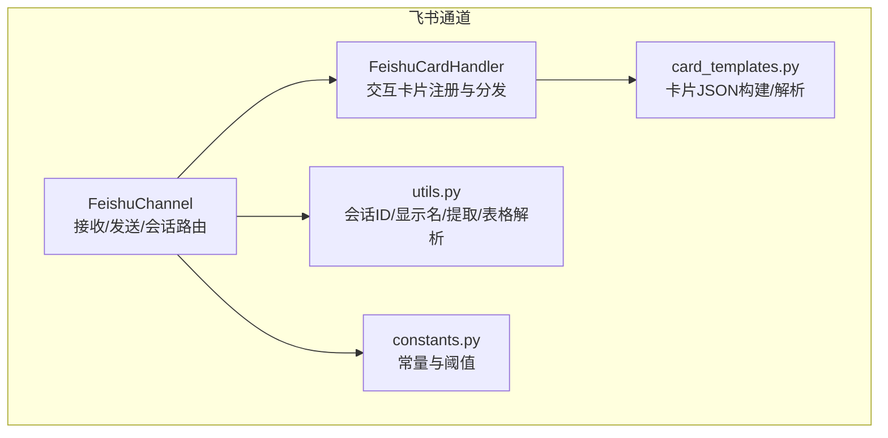
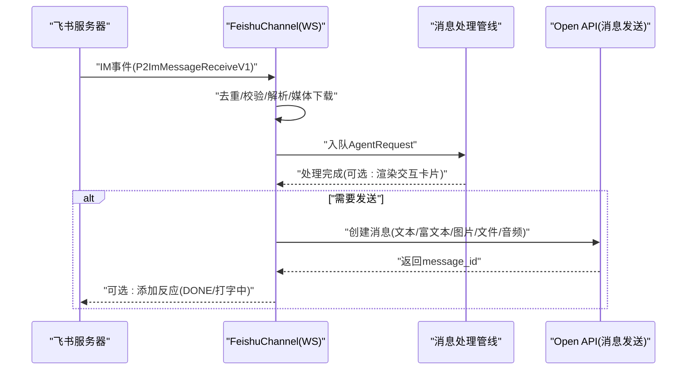
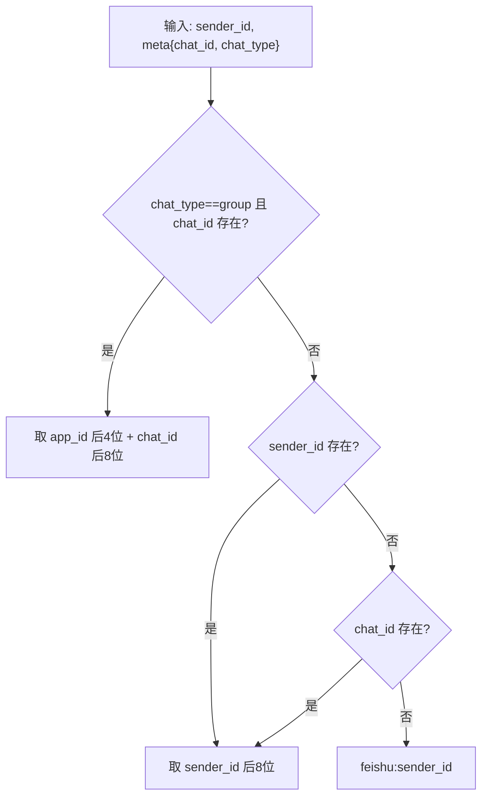
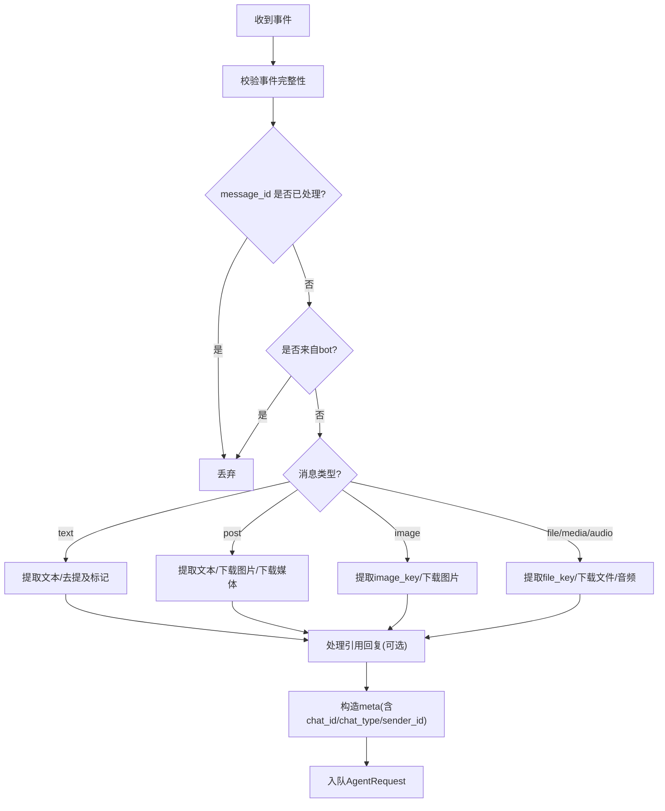
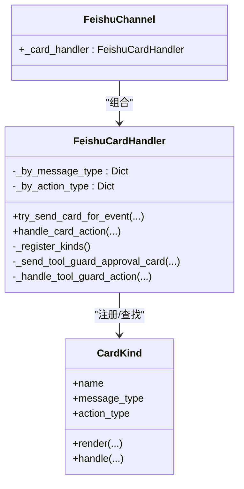
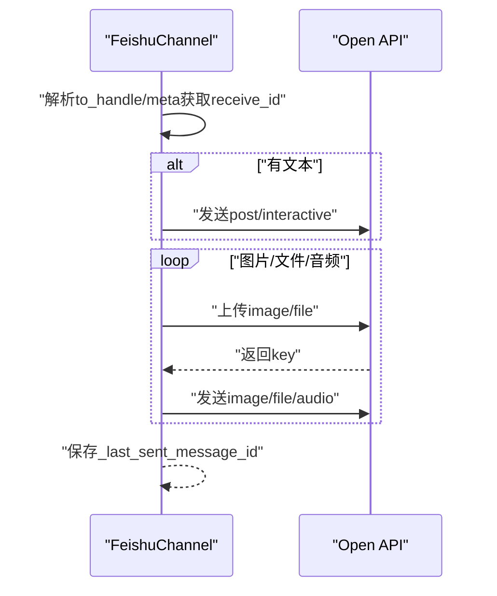
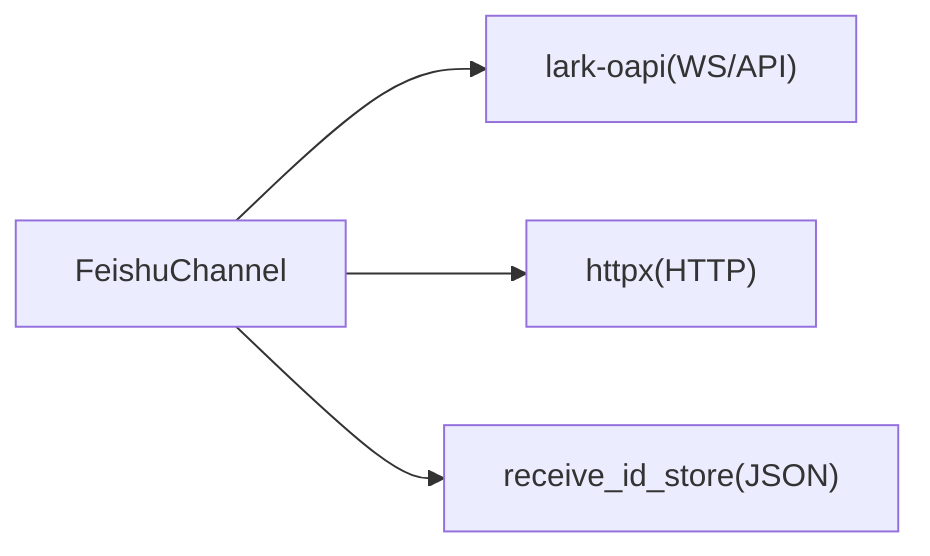

# 飞书平台集成

<cite>
**本文引用的文件**
- [src/qwenpaw/app/channels/feishu/channel.py](file://src/qwenpaw/app/channels/feishu/channel.py)
- [src/qwenpaw/app/channels/feishu/constants.py](file://src/qwenpaw/app/channels/feishu/constants.py)
- [src/qwenpaw/app/channels/feishu/card_handler.py](file://src/qwenpaw/app/channels/feishu/card_handler.py)
- [src/qwenpaw/app/channels/feishu/card_templates.py](file://src/qwenpaw/app/channels/feishu/card_templates.py)
- [src/qwenpaw/app/channels/feishu/utils.py](file://src/qwenpaw/app/channels/feishu/utils.py)
- [tests/unit/channels/test_feishu.py](file://tests/unit/channels/test_feishu.py)
- [tests/contract/channels/test_feishu_contract.py](file://tests/contract/channels/test_feishu_contract.py)
</cite>

## 目录
1. [简介](#简介)
2. [项目结构](#项目结构)
3. [核心组件](#核心组件)
4. [架构总览](#架构总览)
5. [详细组件分析](#详细组件分析)
6. [依赖分析](#依赖分析)
7. [性能考虑](#性能考虑)
8. [故障排查指南](#故障排查指南)
9. [结论](#结论)
10. [附录](#附录)

## 简介
本技术文档面向平台管理员与开发者，系统性阐述在飞书（Lark）多端协同平台上集成本项目的实现方案。内容覆盖应用创建与配置、机器人接入、事件订阅与回调、消息卡片与交互按钮、富文本表格渲染、用户信息与组织架构处理、群组权限策略、消息模板与事件处理流程，以及部署与扩展的最佳实践。

## 项目结构
飞书通道位于通道子系统中，采用“通道层 + 卡片处理器 + 模板库 + 工具函数”的分层设计，确保事件解析、媒体下载、卡片渲染与发送逻辑清晰可维护。

图示来源
- [src/qwenpaw/app/channels/feishu/channel.py:174-330](file://src/qwenpaw/app/channels/feishu/channel.py#L174-L330)
- [src/qwenpaw/app/channels/feishu/card_handler.py:98-133](file://src/qwenpaw/app/channels/feishu/card_handler.py#L98-L133)
- [src/qwenpaw/app/channels/feishu/card_templates.py:58-137](file://src/qwenpaw/app/channels/feishu/card_templates.py#L58-L137)
- [src/qwenpaw/app/channels/feishu/utils.py:11-364](file://src/qwenpaw/app/channels/feishu/utils.py#L11-L364)
- [src/qwenpaw/app/channels/feishu/constants.py:1-33](file://src/qwenpaw/app/channels/feishu/constants.py#L1-L33)

章节来源
- [src/qwenpaw/app/channels/feishu/channel.py:174-330](file://src/qwenpaw/app/channels/feishu/channel.py#L174-L330)
- [src/qwenpaw/app/channels/feishu/constants.py:1-33](file://src/qwenpaw/app/channels/feishu/constants.py#L1-L33)

## 核心组件
- FeishuChannel：负责 WebSocket 接收事件、消息去重、媒体下载、会话解析、消息发送（文本/图片/文件/音频）、交互卡片渲染、定时任务/主动推送等。
- FeishuCardHandler：集中注册与分发交互卡片（如工具审批），统一入口处理 outbound 渲染与 inbound 回调。
- card_templates：纯函数模板库，构建卡片 JSON、解析按钮动作值、生成 Toast 响应。
- utils：会话短ID、发送者显示名、post 内容提取、文件类型检测、Markdown 表格解析与拆分、交互卡片内容构建等。
- constants：令牌刷新、文件大小限制、缓存上限、过期阈值、WS 重连参数等。

章节来源
- [src/qwenpaw/app/channels/feishu/channel.py:174-330](file://src/qwenpaw/app/channels/feishu/channel.py#L174-L330)
- [src/qwenpaw/app/channels/feishu/card_handler.py:98-133](file://src/qwenpaw/app/channels/feishu/card_handler.py#L98-L133)
- [src/qwenpaw/app/channels/feishu/card_templates.py:58-137](file://src/qwenpaw/app/channels/feishu/card_templates.py#L58-L137)
- [src/qwenpaw/app/channels/feishu/utils.py:11-364](file://src/qwenpaw/app/channels/feishu/utils.py#L11-L364)
- [src/qwenpaw/app/channels/feishu/constants.py:1-33](file://src/qwenpaw/app/channels/feishu/constants.py#L1-L33)

## 架构总览
飞书通道采用“长连接 + 开放API”双通道模式：
- WebSocket：接收 IM 事件（消息、表情、卡片动作），进行去重、解析、媒体下载、入队处理。
- Open API：通过租户访问令牌发送消息（文本/富文本卡片/图片/文件/音频），支持主动推送与回复。

图示来源
- [src/qwenpaw/app/channels/feishu/channel.py:570-920](file://src/qwenpaw/app/channels/feishu/channel.py#L570-L920)
- [src/qwenpaw/app/channels/feishu/channel.py:1476-1564](file://src/qwenpaw/app/channels/feishu/channel.py#L1476-L1564)

章节来源
- [src/qwenpaw/app/channels/feishu/channel.py:570-920](file://src/qwenpaw/app/channels/feishu/channel.py#L570-L920)
- [src/qwenpaw/app/channels/feishu/channel.py:1476-1564](file://src/qwenpaw/app/channels/feishu/channel.py#L1476-L1564)

## 详细组件分析

### 会话解析与路由
- 群聊：session_id = app_id 后4位 + chat_id 后8位短码；便于跨实例/重启后按短码查找 receive_id。
- P2P：session_id = open_id 后8位短码；或回退到 chat_id。
- 发送路由：支持 feishu:sw:、feishu:chat_id:、feishu:open_id: 等前缀解析，兼容旧格式与 display 名称后缀匹配。

图示来源
- [src/qwenpaw/app/channels/feishu/channel.py:332-351](file://src/qwenpaw/app/channels/feishu/channel.py#L332-L351)

章节来源
- [src/qwenpaw/app/channels/feishu/channel.py:332-351](file://src/qwenpaw/app/channels/feishu/channel.py#L332-L351)

### 事件接收与消息去重
- 去重：基于 message_id 的有序字典，超过上限时淘汰最旧项。
- 过滤：丢弃来自 bot 的事件；丢弃超过阈值的重试消息（利用服务端时间与本地时钟偏移修正）。
- 解析：根据消息类型（text/post/image/file/media/audio）提取文本与资源键，下载图片/文件至本地媒体目录，构造内容部件列表。
- 引用回复：解析 parent_id/root_id，拉取被引用消息内容并拼接到当前消息前。

图示来源
- [src/qwenpaw/app/channels/feishu/channel.py:615-920](file://src/qwenpaw/app/channels/feishu/channel.py#L615-L920)
- [src/qwenpaw/app/channels/feishu/utils.py:77-166](file://src/qwenpaw/app/channels/feishu/utils.py#L77-L166)

章节来源
- [src/qwenpaw/app/channels/feishu/channel.py:615-920](file://src/qwenpaw/app/channels/feishu/channel.py#L615-L920)
- [src/qwenpaw/app/channels/feishu/utils.py:77-166](file://src/qwenpaw/app/channels/feishu/utils.py#L77-L166)

### 用户信息与昵称缓存
- 优先使用事件中的 name/nickname；若缺失则通过联系人 API 按 open_id 获取真实姓名，缓存于内存字典，达到上限时淘汰最旧。
- 显示名格式：昵称#后四位 sender_id，便于识别。

章节来源
- [src/qwenpaw/app/channels/feishu/channel.py:498-563](file://src/qwenpaw/app/channels/feishu/channel.py#L498-L563)
- [src/qwenpaw/app/channels/feishu/utils.py:17-26](file://src/qwenpaw/app/channels/feishu/utils.py#L17-L26)
- [src/qwenpaw/app/channels/feishu/constants.py:13-20](file://src/qwenpaw/app/channels/feishu/constants.py#L13-L20)

### 交互卡片系统
- 注册表：每种卡片类型定义为记录，包含 message_type/action_type/render/handle 四元组，分别用于出站渲染与入站处理。
- 出站：当事件元数据包含特定 message_type 时，交由卡片处理器尝试渲染并发送交互卡片。
- 入站：统一入口接收 card.action.trigger，按 action_type 查表执行 handle，返回同步响应（Toast + 新卡片内容）。
- 模板：纯函数模板库，构建卡片 JSON、解析按钮 value、生成 Toast。

图示来源
- [src/qwenpaw/app/channels/feishu/card_handler.py:82-133](file://src/qwenpaw/app/channels/feishu/card_handler.py#L82-L133)
- [src/qwenpaw/app/channels/feishu/card_handler.py:154-214](file://src/qwenpaw/app/channels/feishu/card_handler.py#L154-L214)
- [src/qwenpaw/app/channels/feishu/channel.py:265-265](file://src/qwenpaw/app/channels/feishu/channel.py#L265-L265)

章节来源
- [src/qwenpaw/app/channels/feishu/card_handler.py:82-133](file://src/qwenpaw/app/channels/feishu/card_handler.py#L82-L133)
- [src/qwenpaw/app/channels/feishu/card_handler.py:154-214](file://src/qwenpaw/app/channels/feishu/card_handler.py#L154-L214)
- [src/qwenpaw/app/channels/feishu/card_templates.py:58-137](file://src/qwenpaw/app/channels/feishu/card_templates.py#L58-L137)

### 富文本与表格处理
- 文本：支持普通 Markdown；对代码块前后自动补换行，避免渲染异常。
- 表格：解析 GFM 表格为飞书原生表格组件，支持列宽自适应与对齐；超过最大表格数量时拆分为多个卡片。
- 混合内容：将 Markdown 与表格混合拆分为元素块，按最多 5 张表格切片，逐片发送。

章节来源
- [src/qwenpaw/app/channels/feishu/utils.py:169-364](file://src/qwenpaw/app/channels/feishu/utils.py#L169-L364)
- [src/qwenpaw/app/channels/feishu/channel.py:1544-1564](file://src/qwenpaw/app/channels/feishu/channel.py#L1544-L1564)

### 发送流程与媒体上传
- 文本：优先作为富文本卡片（含表格）发送，否则转为 post(md)。
- 图片：先下载/解码 base64，再通过 SDK 上传 image_key，发送 image 消息。
- 文件/音频：检测文件类型映射，上传 file_key，发送 file/audio 消息。
- 主动推送：通过 receive_id_store 持久化存储会话与 receive_id 映射，支持重启后按短 session_id 解析。

图示来源
- [src/qwenpaw/app/channels/feishu/channel.py:1749-1928](file://src/qwenpaw/app/channels/feishu/channel.py#L1749-L1928)
- [src/qwenpaw/app/channels/feishu/channel.py:1342-1456](file://src/qwenpaw/app/channels/feishu/channel.py#L1342-L1456)

章节来源
- [src/qwenpaw/app/channels/feishu/channel.py:1342-1456](file://src/qwenpaw/app/channels/feishu/channel.py#L1342-L1456)
- [src/qwenpaw/app/channels/feishu/channel.py:1749-1928](file://src/qwenpaw/app/channels/feishu/channel.py#L1749-L1928)

### 权限与白名单策略
- 支持按群聊/私聊策略（open/allow/deny）与 allow_from 列表控制来源。
- 当未满足策略时，直接发送拒绝文案并阻断后续处理。

章节来源
- [src/qwenpaw/app/channels/feishu/channel.py:877-892](file://src/qwenpaw/app/channels/feishu/channel.py#L877-L892)

## 依赖分析
- 外部 SDK：lark-oapi（WebSocket 事件与 Open API 调用）
- HTTP 客户端：httpx（下载媒体、获取 bot 信息）
- 本地持久化：receive_id_store JSON 文件（工作空间目录或全局配置目录）

图示来源
- [src/qwenpaw/app/channels/feishu/channel.py:238-245](file://src/qwenpaw/app/channels/feishu/channel.py#L238-L245)
- [src/qwenpaw/app/channels/feishu/channel.py:1222-1283](file://src/qwenpaw/app/channels/feishu/channel.py#L1222-L1283)

章节来源
- [src/qwenpaw/app/channels/feishu/channel.py:238-245](file://src/qwenpaw/app/channels/feishu/channel.py#L238-L245)
- [src/qwenpaw/app/channels/feishu/channel.py:1222-1283](file://src/qwenpaw/app/channels/feishu/channel.py#L1222-L1283)

## 性能考虑
- 去重与缓存：message_id 去重表与昵称缓存限制，避免重复处理与频繁 API 调用。
- 重连与健康检查：WS 连接指数退避重连，静默超时检测，异常时主动停止并重建事件循环。
- 文件大小限制：上传前校验大小，避免超限失败。
- 表格拆分：单卡最多 5 张表格，超出自动拆分，保证渲染稳定性。

章节来源
- [src/qwenpaw/app/channels/feishu/constants.py:10-33](file://src/qwenpaw/app/channels/feishu/constants.py#L10-L33)
- [src/qwenpaw/app/channels/feishu/channel.py:2023-2226](file://src/qwenpaw/app/channels/feishu/channel.py#L2023-L2226)
- [src/qwenpaw/app/channels/feishu/channel.py:1400-1402](file://src/qwenpaw/app/channels/feishu/channel.py#L1400-L1402)
- [src/qwenpaw/app/channels/feishu/utils.py:268-347](file://src/qwenpaw/app/channels/feishu/utils.py#L268-L347)

## 故障排查指南
- 通道未启用或缺少凭据：启动时报错提示需安装 lark-oapi 或补齐 App ID/Secret。
- WS 连接问题：查看线程存活与事件循环状态，确认网络可达与域名配置（feishu/lark）。
- 交互卡片按钮无效：检查事件回调订阅是否开启，按钮 value 类型是否正确。
- 媒体下载失败：检查 file_key/image_key 是否存在、下载接口返回码、磁盘写入权限。
- 主动推送失败：确认 receive_id_store 是否存在对应 session_id，或显式传入 dispatch.meta.feishu_receive_id。

章节来源
- [src/qwenpaw/app/channels/feishu/channel.py:2255-2276](file://src/qwenpaw/app/channels/feishu/channel.py#L2255-L2276)
- [src/qwenpaw/app/channels/feishu/channel.py:2023-2226](file://src/qwenpaw/app/channels/feishu/channel.py#L2023-L2226)
- [src/qwenpaw/app/channels/feishu/card_handler.py:180-214](file://src/qwenpaw/app/channels/feishu/card_handler.py#L180-L214)
- [src/qwenpaw/app/channels/feishu/channel.py:952-1031](file://src/qwenpaw/app/channels/feishu/channel.py#L952-L1031)
- [src/qwenpaw/app/channels/feishu/channel.py:1749-1822](file://src/qwenpaw/app/channels/feishu/channel.py#L1749-L1822)

## 结论
本实现以模块化设计将飞书事件接收、消息解析、媒体处理、卡片渲染与发送流程解耦，既满足平台管理员的部署与运维需求，也为开发者提供了清晰的扩展点（新增卡片类型、消息类型、权限策略）。通过严格的去重、缓存与重连机制，保障在复杂场景下的稳定性与性能。

## 附录

### 配置参数与环境变量
- 通用
  - enabled：启用/禁用通道
  - app_id：飞书应用 ID
  - app_secret：飞书应用密钥
  - domain：feishu 或 lark
  - bot_prefix：发送前缀
  - media_dir：媒体文件目录
  - workspace_dir：工作空间目录（影响 receive_id 存储路径）
  - show_tool_details/filter_tool_messages/filter_thinking：消息过滤策略
  - dm_policy/group_policy：私聊/群聊策略（open/allow/deny）
  - allow_from：允许来源列表
  - deny_message：拒绝文案
  - require_mention：是否必须被 at
  - encrypt_key/verification_token：事件回调加密与校验
- 环境变量
  - FEISHU_CHANNEL_ENABLED、FEISHU_APP_ID、FEISHU_APP_SECRET、FEISHU_DOMAIN、FEISHU_BOT_PREFIX、FEISHU_MEDIA_DIR、FEISHU_DM_POLICY、FEISHU_GROUP_POLICY、FEISHU_ALLOW_FROM、FEISHU_DENY_MESSAGE、FEISHU_REQUIRE_MENTION、FEISHU_ENCRYPT_KEY、FEISHU_VERIFICATION_TOKEN

章节来源
- [src/qwenpaw/app/channels/feishu/channel.py:185-330](file://src/qwenpaw/app/channels/feishu/channel.py#L185-L330)
- [src/qwenpaw/app/channels/feishu/channel.py:268-297](file://src/qwenpaw/app/channels/feishu/channel.py#L268-L297)

### 事件订阅与回调
- 事件回调：注册 P2ImMessageReceiveV1、P2CardActionTrigger 等处理器。
- 回调校验：使用 verification_token 与 encrypt_key 初始化事件处理器。
- 交互卡片：统一入口 handle_card_action，按 action_type 分发处理。

章节来源
- [src/qwenpaw/app/channels/feishu/channel.py:2032-2048](file://src/qwenpaw/app/channels/feishu/channel.py#L2032-L2048)
- [src/qwenpaw/app/channels/feishu/card_handler.py:180-214](file://src/qwenpaw/app/channels/feishu/card_handler.py#L180-L214)

### 消息卡片模板使用
- 工具审批卡片：包含“批准/拒绝”按钮，点击后替换为状态卡片并返回 Toast。
- 模板函数：构建卡片 JSON、解析按钮 value、生成 Toast。
- 表格渲染：将 Markdown 表格转换为飞书原生表格，超过上限自动拆分。

章节来源
- [src/qwenpaw/app/channels/feishu/card_templates.py:58-137](file://src/qwenpaw/app/channels/feishu/card_templates.py#L58-L137)
- [src/qwenpaw/app/channels/feishu/card_handler.py:220-272](file://src/qwenpaw/app/channels/feishu/card_handler.py#L220-L272)
- [src/qwenpaw/app/channels/feishu/utils.py:268-364](file://src/qwenpaw/app/channels/feishu/utils.py#L268-L364)

### 用户信息与组织架构
- 用户名获取：通过联系人 API 按 open_id 获取真实姓名，缓存于内存字典。
- 组织架构：当前实现聚焦用户显示名与会话路由，未直接解析部门树。

章节来源
- [src/qwenpaw/app/channels/feishu/channel.py:498-563](file://src/qwenpaw/app/channels/feishu/channel.py#L498-L563)

### 群组权限管理
- 策略：支持私聊/群聊 open/allow/deny 三种策略，结合 allow_from 白名单。
- 提示：当策略不满足时，直接发送 deny_message 并阻断处理。

章节来源
- [src/qwenpaw/app/channels/feishu/channel.py:877-892](file://src/qwenpaw/app/channels/feishu/channel.py#L877-L892)

### API 调用示例（路径指引）
- 发送文本/富文本卡片：[send_content_parts:1824-1928](file://src/qwenpaw/app/channels/feishu/channel.py#L1824-L1928)
- 发送图片：[_send_image:1613-1649](file://src/qwenpaw/app/channels/feishu/channel.py#L1613-L1649)
- 发送文件/音频：[_send_file:1709-1747](file://src/qwenpaw/app/channels/feishu/channel.py#L1709-L1747)
- 上传图片/文件：[_upload_image/_upload_file:1342-1449](file://src/qwenpaw/app/channels/feishu/channel.py#L1342-L1449)
- 下载媒体：[_download_image_resource/_download_file_resource:952-1031](file://src/qwenpaw/app/channels/feishu/channel.py#L952-L1031)
- 交互卡片渲染：[try_send_card_for_event:154-178](file://src/qwenpaw/app/channels/feishu/card_handler.py#L154-L178)
- 交互卡片处理：[handle_card_action:180-214](file://src/qwenpaw/app/channels/feishu/card_handler.py#L180-L214)

### 测试与契约
- 单元测试：覆盖初始化、会话解析、接收 ID 存储、工具函数等。
- 合约测试：验证 FeishuChannel 实现 BaseChannel 抽象接口，具备令牌管理、接收 ID 存储、消息去重与媒体目录等特性。

章节来源
- [tests/unit/channels/test_feishu.py:126-200](file://tests/unit/channels/test_feishu.py#L126-L200)
- [tests/contract/channels/test_feishu_contract.py:25-100](file://tests/contract/channels/test_feishu_contract.py#L25-L100)