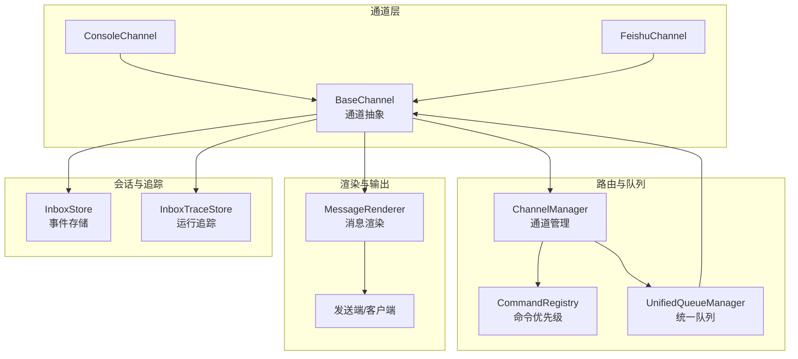
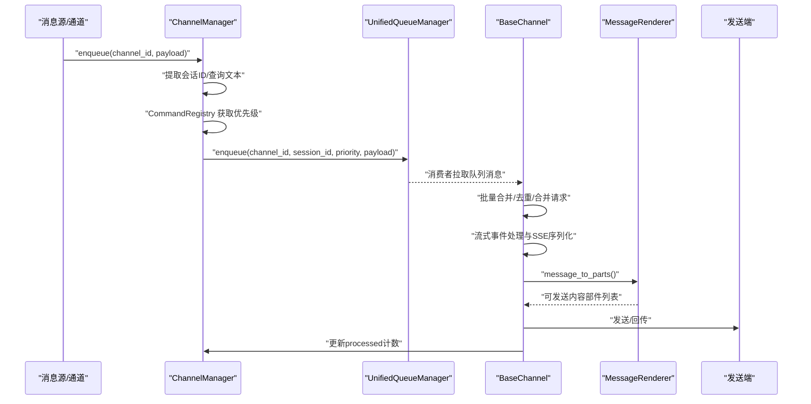
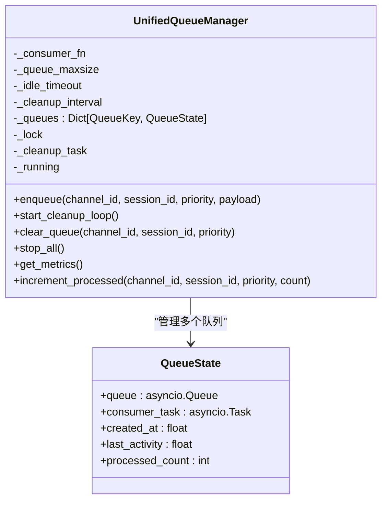
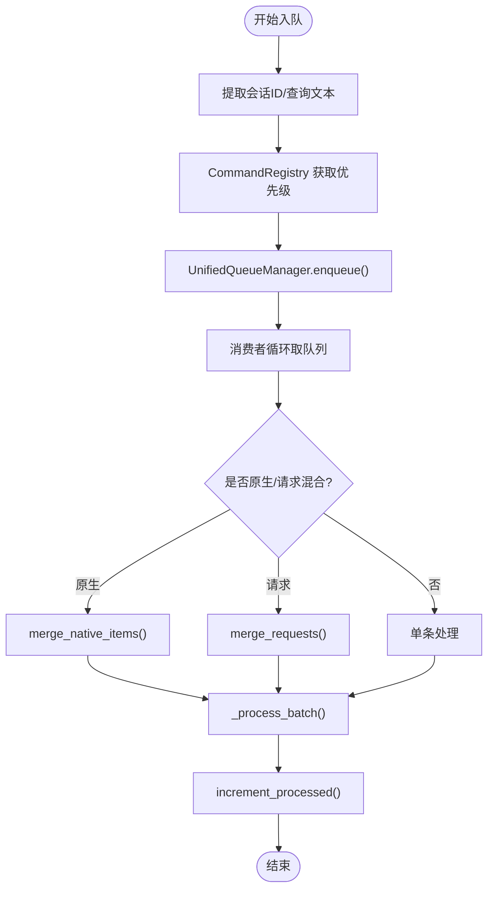
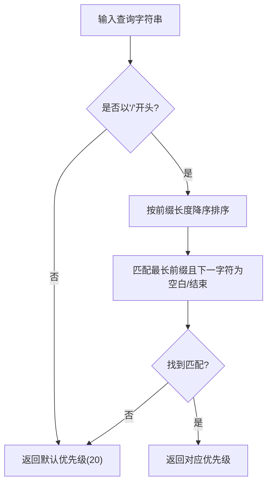
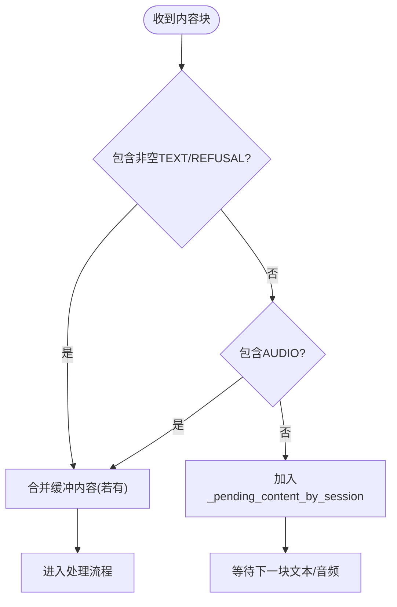
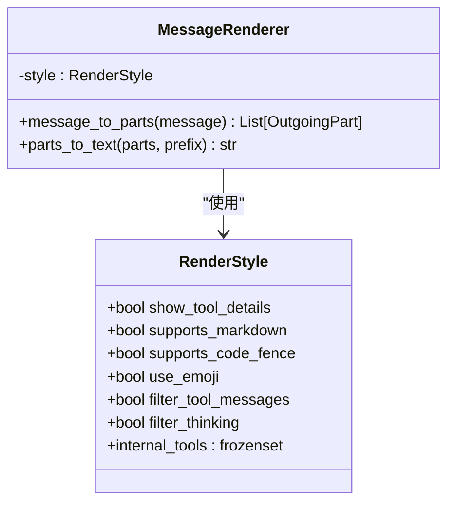
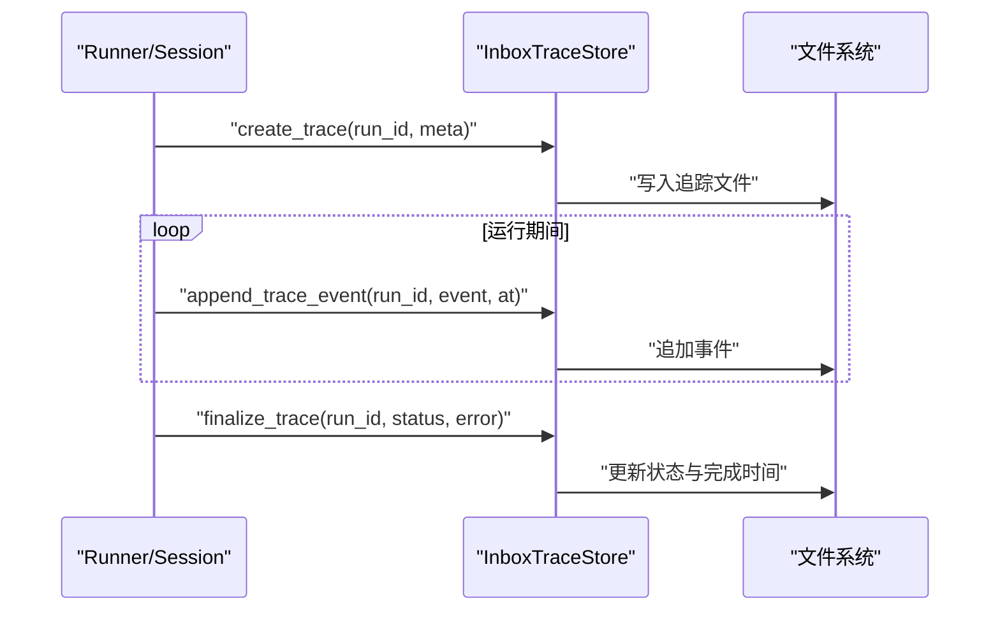
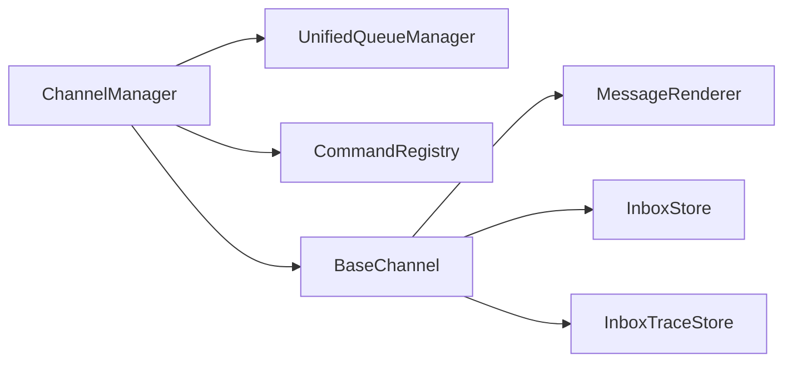

# 消息路由机制

<cite>
**本文档引用的文件**
- [unified_queue_manager.py](file://src/qwenpaw/app/channels/unified_queue_manager.py)
- [renderer.py](file://src/qwenpaw/app/channels/renderer.py)
- [base.py](file://src/qwenpaw/app/channels/base.py)
- [manager.py](file://src/qwenpaw/app/channels/manager.py)
- [command_registry.py](file://src/qwenpaw/app/channels/command_registry.py)
- [inbox_store.py](file://src/qwenpaw/app/inbox_store.py)
- [inbox_trace_store.py](file://src/qwenpaw/app/inbox_trace_store.py)
</cite>

## 目录
1. [简介](#简介)
2. [项目结构](#项目结构)
3. [核心组件](#核心组件)
4. [架构总览](#架构总览)
5. [详细组件分析](#详细组件分析)
6. [依赖关系分析](#依赖关系分析)
7. [性能考量](#性能考量)
8. [故障排查指南](#故障排查指南)
9. [结论](#结论)
10. [附录](#附录)

## 简介
本文件针对 QwenPaw 的消息路由机制进行系统化技术文档整理，重点覆盖以下方面：
- 消息在通道系统中的流转：从接收、解析、路由到分发的完整链路
- UnifiedQueueManager 的队列管理机制、消息优先级与并发控制策略
- MessageRenderer 的消息格式化、内容过滤与样式渲染能力
- 消息去重、会话管理与状态跟踪的技术实现
- 消息格式转换、内容安全过滤与性能优化建议
- 面向架构师的消息流设计指导与面向开发者的最佳实践

## 项目结构
消息路由相关的核心模块位于 src/qwenpaw/app/channels 下，围绕“通道抽象 + 统一队列 + 路由注册 + 渲染器”的架构组织：
- 通道抽象层：定义统一的通道接口与通用处理逻辑（含去重、合并、流式事件等）
- 统一队列层：按会话与优先级隔离的动态队列与消费者模型
- 路由层：命令前缀匹配与优先级映射
- 渲染层：消息到可发送内容部件的转换与过滤
- 会话与追踪：基于工作目录的事件存储与运行追踪

图表来源
- [manager.py:68-110](file://src/qwenpaw/app/channels/manager.py#L68-L110)
- [unified_queue_manager.py:60-118](file://src/qwenpaw/app/channels/unified_queue_manager.py#L60-L118)
- [command_registry.py:23-62](file://src/qwenpaw/app/channels/command_registry.py#L23-L62)
- [base.py:78-168](file://src/qwenpaw/app/channels/base.py#L78-L168)
- [renderer.py:78-86](file://src/qwenpaw/app/channels/renderer.py#L78-L86)
- [inbox_store.py:36-67](file://src/qwenpaw/app/inbox_store.py#L36-L67)
- [inbox_trace_store.py:64-78](file://src/qwenpaw/app/inbox_trace_store.py#L64-L78)

章节来源
- [manager.py:68-110](file://src/qwenpaw/app/channels/manager.py#L68-L110)
- [unified_queue_manager.py:60-118](file://src/qwenpaw/app/channels/unified_queue_manager.py#L60-L118)
- [command_registry.py:23-62](file://src/qwenpaw/app/channels/command_registry.py#L23-L62)
- [base.py:78-168](file://src/qwenpaw/app/channels/base.py#L78-L168)
- [renderer.py:78-86](file://src/qwenpaw/app/channels/renderer.py#L78-L86)
- [inbox_store.py:36-67](file://src/qwenpaw/app/inbox_store.py#L36-L67)
- [inbox_trace_store.py:64-78](file://src/qwenpaw/app/inbox_trace_store.py#L64-L78)

## 核心组件
- UnifiedQueueManager：以 (channel_id, session_id, priority_level) 为键的动态队列与消费者模型，支持按会话与优先级隔离、动态创建消费者、空闲清理与指标采集
- ChannelManager：通道生命周期管理、统一入队回调注入、批量合并与消费、通道替换与健康检查
- CommandRegistry：命令前缀到优先级的映射，支持预置控制命令与自定义扩展
- BaseChannel：通道通用能力（去重、合并、流式事件、错误处理、SSE 序列化等）
- MessageRenderer：消息到可发送内容部件的转换，支持样式控制、工具消息过滤、媒体块渲染与文本回退
- InboxStore/InboxTraceStore：事件持久化与运行追踪，支撑会话状态与可观测性

章节来源
- [unified_queue_manager.py:60-118](file://src/qwenpaw/app/channels/unified_queue_manager.py#L60-L118)
- [manager.py:68-110](file://src/qwenpaw/app/channels/manager.py#L68-L110)
- [command_registry.py:23-62](file://src/qwenpaw/app/channels/command_registry.py#L23-L62)
- [base.py:78-168](file://src/qwenpaw/app/channels/base.py#L78-L168)
- [renderer.py:78-86](file://src/qwenpaw/app/channels/renderer.py#L78-L86)
- [inbox_store.py:36-67](file://src/qwenpaw/app/inbox_store.py#L36-L67)
- [inbox_trace_store.py:64-78](file://src/qwenpaw/app/inbox_trace_store.py#L64-L78)

## 架构总览
消息从通道接收到最终发送的端到端流程如下：

图表来源
- [manager.py:258-351](file://src/qwenpaw/app/channels/manager.py#L258-L351)
- [unified_queue_manager.py:119-164](file://src/qwenpaw/app/channels/unified_queue_manager.py#L119-L164)
- [base.py:630-747](file://src/qwenpaw/app/channels/base.py#L630-L747)
- [renderer.py:87-350](file://src/qwenpaw/app/channels/renderer.py#L87-L350)

## 详细组件分析

### UnifiedQueueManager 队列管理与并发控制
- 键空间与隔离
  - 使用三元组键 (channel_id, session_id, priority_level) 实现：
    - 同一会话内严格串行
    - 同一会话不同优先级并行
    - 不同会话之间并行
- 动态消费者
  - 首次入队时按键创建队列与消费者任务，无固定 Worker 池
  - 消费者循环持续从队列取数据，支持批量合并
- 并发与超时
  - 入队/出队使用 asyncio.Queue，带超时保护避免阻塞
  - 提供增量 processed 计数与活动时间戳用于监控
- 清理策略
  - 后台清理任务定期扫描空队列，超过空闲阈值取消消费者并回收
- 指标与可观测性
  - 提供 get_metrics 输出队列总数、每个队列的大小、处理计数、年龄与空闲时长

图表来源
- [unified_queue_manager.py:60-118](file://src/qwenpaw/app/channels/unified_queue_manager.py#L60-L118)
- [unified_queue_manager.py:41-58](file://src/qwenpaw/app/channels/unified_queue_manager.py#L41-L58)

章节来源
- [unified_queue_manager.py:60-118](file://src/qwenpaw/app/channels/unified_queue_manager.py#L60-L118)
- [unified_queue_manager.py:119-164](file://src/qwenpaw/app/channels/unified_queue_manager.py#L119-L164)
- [unified_queue_manager.py:274-290](file://src/qwenpaw/app/channels/unified_queue_manager.py#L274-L290)
- [unified_queue_manager.py:291-327](file://src/qwenpaw/app/channels/unified_queue_manager.py#L291-L327)
- [unified_queue_manager.py:329-374](file://src/qwenpaw/app/channels/unified_queue_manager.py#L329-L374)
- [unified_queue_manager.py:376-428](file://src/qwenpaw/app/channels/unified_queue_manager.py#L376-L428)
- [unified_queue_manager.py:430-471](file://src/qwenpaw/app/channels/unified_queue_manager.py#L430-L471)
- [unified_queue_manager.py:473-497](file://src/qwenpaw/app/channels/unified_queue_manager.py#L473-L497)

### ChannelManager 路由与批处理
- 初始化与注入
  - 从环境或配置创建通道实例，注入统一的 process 处理器
  - 为启用队列的通道设置 enqueue 回调
- 入队与优先级
  - 从 payload 中提取查询文本，通过 CommandRegistry 映射优先级
  - 使用 _extract_session_id 规范化会话标识
  - 通过 _enqueue_with_timeout 将消息入队，带超时保护
- 批量合并与消费
  - 消费者循环中对同一队列键进行 drain + merge，支持原生与请求两种合并策略
  - 每批处理后更新 processed 计数
- 健康检查与通道替换
  - 提供 get_channel_health 与 restart_channel，支持通道热替换
- 发送事件与文本
  - 支持按通道、用户与会话发送事件或纯文本

图表来源
- [manager.py:258-351](file://src/qwenpaw/app/channels/manager.py#L258-L351)
- [manager.py:39-66](file://src/qwenpaw/app/channels/manager.py#L39-L66)
- [manager.py:365-461](file://src/qwenpaw/app/channels/manager.py#L365-L461)

章节来源
- [manager.py:68-110](file://src/qwenpaw/app/channels/manager.py#L68-L110)
- [manager.py:111-216](file://src/qwenpaw/app/channels/manager.py#L111-L216)
- [manager.py:218-364](file://src/qwenpaw/app/channels/manager.py#L218-L364)
- [manager.py:365-461](file://src/qwenpaw/app/channels/manager.py#L365-L461)
- [manager.py:462-541](file://src/qwenpaw/app/channels/manager.py#L462-L541)
- [manager.py:549-666](file://src/qwenpaw/app/channels/manager.py#L549-L666)
- [manager.py:763-800](file://src/qwenpaw/app/channels/manager.py#L763-L800)

### CommandRegistry 优先级路由
- 预置控制命令与默认优先级
  - critical(0)：/stop 等紧急控制命令
  - high(10)：/daemon 系列与短命令别名
  - normal(20)：普通对话（默认）
  - low(30)：未来批处理场景预留
- 查找策略
  - 对命令前缀进行降序匹配，确保最长前缀优先
  - 支持大小写不敏感与空白字符边界判断
- 可扩展性
  - 支持直接指定数字优先级插入中间级别
  - 提供注册、注销、查询与统计接口

图表来源
- [command_registry.py:179-222](file://src/qwenpaw/app/channels/command_registry.py#L179-L222)

章节来源
- [command_registry.py:23-62](file://src/qwenpaw/app/channels/command_registry.py#L23-L62)
- [command_registry.py:64-93](file://src/qwenpaw/app/channels/command_registry.py#L64-L93)
- [command_registry.py:94-139](file://src/qwenpaw/app/channels/command_registry.py#L94-L139)
- [command_registry.py:140-222](file://src/qwenpaw/app/channels/command_registry.py#L140-L222)
- [command_registry.py:224-291](file://src/qwenpaw/app/channels/command_registry.py#L224-L291)

### BaseChannel 会话管理与消息去重
- 会话与去重
  - _pending_content_by_session 缓存无文本内容，等待后续文本到达时合并
  - _content_has_text/_content_has_audio 判定是否立即处理
  - _apply_no_text_debounce 控制音频直达与文本合并策略
- 合并与请求合并
  - merge_native_items：合并原生内容部件与元信息
  - merge_requests：合并多个 AgentRequest 的输入内容
- 流式事件与 SSE
  - _dispatch_streaming_event 分发 reasoning/message 的增量事件
  - _serialize_event_for_sse 将事件序列化为 SSE 字符串
- 安全与容错
  - _sanitize_for_json/_sanitize_surrogate_text 处理不可见字符与编码问题
  - 统一异常捕获与错误上报

图表来源
- [base.py:290-322](file://src/qwenpaw/app/channels/base.py#L290-L322)

章节来源
- [base.py:169-168](file://src/qwenpaw/app/channels/base.py#L169-L168)
- [base.py:188-217](file://src/qwenpaw/app/channels/base.py#L188-L217)
- [base.py:219-249](file://src/qwenpaw/app/channels/base.py#L219-L249)
- [base.py:290-322](file://src/qwenpaw/app/channels/base.py#L290-L322)
- [base.py:488-628](file://src/qwenpaw/app/channels/base.py#L488-L628)
- [base.py:778-799](file://src/qwenpaw/app/channels/base.py#L778-L799)

### MessageRenderer 消息格式化与过滤
- 输入类型与部件映射
  - 支持 Text/Image/Video/Audio/File/Refusal 等内容部件
  - 对工具调用与输出进行专门处理（名称、参数、输出块）
- 样式与过滤控制
  - RenderStyle 控制是否显示工具详情、是否支持 Markdown/代码围栏、是否过滤思考内容、内部工具集合
- 文本回退
  - parts_to_text 将文本与拒绝内容拼接，并为媒体部件生成回退文本

图表来源
- [renderer.py:37-48](file://src/qwenpaw/app/channels/renderer.py#L37-L48)
- [renderer.py:78-86](file://src/qwenpaw/app/channels/renderer.py#L78-L86)
- [renderer.py:87-350](file://src/qwenpaw/app/channels/renderer.py#L87-L350)
- [renderer.py:352-384](file://src/qwenpaw/app/channels/renderer.py#L352-L384)

章节来源
- [renderer.py:37-48](file://src/qwenpaw/app/channels/renderer.py#L37-L48)
- [renderer.py:78-86](file://src/qwenpaw/app/channels/renderer.py#L78-L86)
- [renderer.py:87-350](file://src/qwenpaw/app/channels/renderer.py#L87-L350)
- [renderer.py:352-384](file://src/qwenpaw/app/channels/renderer.py#L352-L384)

### 会话管理与状态跟踪
- 事件存储（InboxStore）
  - 基于文件的事件追加、查询、标记已读与删除
  - 最大事件数量限制与原子写入
- 运行追踪（InboxTraceStore）
  - 以 run_id 为单位的追踪文件，记录事件时间线与状态
  - 支持从会话内存中抽取消息增量并写入追踪
  - 结束时标记完成状态与错误信息

图表来源
- [inbox_trace_store.py:64-78](file://src/qwenpaw/app/inbox_trace_store.py#L64-L78)
- [inbox_trace_store.py:81-97](file://src/qwenpaw/app/inbox_trace_store.py#L81-L97)
- [inbox_trace_store.py:173-185](file://src/qwenpaw/app/inbox_trace_store.py#L173-L185)

章节来源
- [inbox_store.py:36-67](file://src/qwenpaw/app/inbox_store.py#L36-L67)
- [inbox_store.py:70-95](file://src/qwenpaw/app/inbox_store.py#L70-L95)
- [inbox_store.py:98-122](file://src/qwenpaw/app/inbox_store.py#L98-L122)
- [inbox_store.py:125-157](file://src/qwenpaw/app/inbox_store.py#L125-L157)
- [inbox_trace_store.py:64-78](file://src/qwenpaw/app/inbox_trace_store.py#L64-L78)
- [inbox_trace_store.py:81-97](file://src/qwenpaw/app/inbox_trace_store.py#L81-L97)
- [inbox_trace_store.py:127-170](file://src/qwenpaw/app/inbox_trace_store.py#L127-L170)
- [inbox_trace_store.py:173-185](file://src/qwenpaw/app/inbox_trace_store.py#L173-L185)

## 依赖关系分析
- 组件耦合
  - ChannelManager 依赖 UnifiedQueueManager 与 CommandRegistry，负责路由与调度
  - BaseChannel 依赖 MessageRenderer 进行消息格式化，依赖 Workspace 进行会话与任务跟踪
  - InboxStore/InboxTraceStore 作为外部持久化依赖，被通道与追踪模块使用
- 关键依赖链
  - 入队路径：ChannelManager.enqueue → UnifiedQueueManager.enqueue
  - 消费路径：UnifiedQueueManager._consume_queue → ChannelManager._process_batch → BaseChannel._consume_one_request
  - 渲染路径：BaseChannel._stream_with_tracker → MessageRenderer.message_to_parts

图表来源
- [manager.py:68-110](file://src/qwenpaw/app/channels/manager.py#L68-L110)
- [unified_queue_manager.py:60-118](file://src/qwenpaw/app/channels/unified_queue_manager.py#L60-L118)
- [command_registry.py:23-62](file://src/qwenpaw/app/channels/command_registry.py#L23-L62)
- [base.py:78-168](file://src/qwenpaw/app/channels/base.py#L78-L168)
- [renderer.py:78-86](file://src/qwenpaw/app/channels/renderer.py#L78-L86)
- [inbox_store.py:36-67](file://src/qwenpaw/app/inbox_store.py#L36-L67)
- [inbox_trace_store.py:64-78](file://src/qwenpaw/app/inbox_trace_store.py#L64-L78)

章节来源
- [manager.py:68-110](file://src/qwenpaw/app/channels/manager.py#L68-L110)
- [unified_queue_manager.py:60-118](file://src/qwenpaw/app/channels/unified_queue_manager.py#L60-L118)
- [command_registry.py:23-62](file://src/qwenpaw/app/channels/command_registry.py#L23-L62)
- [base.py:78-168](file://src/qwenpaw/app/channels/base.py#L78-L168)
- [renderer.py:78-86](file://src/qwenpaw/app/channels/renderer.py#L78-L86)
- [inbox_store.py:36-67](file://src/qwenpaw/app/inbox_store.py#L36-L67)
- [inbox_trace_store.py:64-78](file://src/qwenpaw/app/inbox_trace_store.py#L64-L78)

## 性能考量
- 队列与并发
  - 使用 asyncio.Queue 与动态消费者，避免固定 Worker 池带来的资源浪费
  - 通过空闲清理降低僵尸消费者与内存占用
- 超时与背压
  - 入队/出队均设置超时，防止阻塞导致的级联故障
  - 队列最大长度可配置，结合清理策略控制峰值内存
- 批量合并
  - 在消费侧进行批量 drain 与合并，减少通道调用次数与上下文切换
- 渲染与序列化
  - RenderStyle 控制渲染复杂度，避免过度格式化造成 CPU 开销
  - SSE 序列化采用安全编码与不可见字符清洗，降低传输开销与兼容性问题
- I/O 与持久化
  - 事件与追踪文件采用临时文件写入再替换的方式，保证原子性与一致性

## 故障排查指南
- 入队失败或超时
  - 检查 UnifiedQueueManager 的队列是否满载或消费者异常
  - 查看 ChannelManager 的 _enqueue_with_timeout 日志与异常栈
- 消费者未启动或提前退出
  - 确认队列键是否存在、消费者任务是否被取消或异常
  - 检查空闲清理是否过早触发（idle_timeout 设置）
- 流式事件缺失
  - 确认通道是否开启 streaming_enabled
  - 检查 _dispatch_streaming_event 的分支与过滤条件（如 filter_thinking）
- 渲染异常或内容缺失
  - 检查 RenderStyle 的过滤开关与媒体类型支持
  - 确认 message_to_parts 的输入类型与内容部件完整性
- 会话状态不一致
  - 核对 InboxTraceStore 的 run_id 与会话状态同步情况
  - 检查 append_trace_from_session_delta 的基准计数与消息抽取逻辑

章节来源
- [unified_queue_manager.py:145-156](file://src/qwenpaw/app/channels/unified_queue_manager.py#L145-L156)
- [manager.py:305-351](file://src/qwenpaw/app/channels/manager.py#L305-L351)
- [base.py:488-628](file://src/qwenpaw/app/channels/base.py#L488-L628)
- [renderer.py:87-350](file://src/qwenpaw/app/channels/renderer.py#L87-L350)
- [inbox_trace_store.py:150-170](file://src/qwenpaw/app/inbox_trace_store.py#L150-L170)

## 结论
QwenPaw 的消息路由机制通过“通道抽象 + 统一队列 + 路由注册 + 渲染器 + 会话追踪”的组合，实现了高并发、低耦合、可扩展的消息处理流水线。UnifiedQueueManager 提供了以会话与优先级为中心的隔离与并发控制；ChannelManager 负责路由与批处理；CommandRegistry 保障控制命令的快速响应；BaseChannel 与 MessageRenderer 则分别承担会话管理与消息格式化；InboxStore/InboxTraceStore 提供可观测性与状态持久化。整体设计兼顾性能与可靠性，适合多通道、多会话、高吞吐的智能体应用。

## 附录
- 面向架构师的设计建议
  - 优先使用 UnifiedQueueManager 的动态消费者模型，避免固定 Worker 池
  - 合理设置队列最大长度与空闲清理阈值，平衡延迟与资源占用
  - 通过 CommandRegistry 为关键控制命令分配低优先级，确保系统稳定性
  - 在通道侧启用 streaming_enabled 与合适的 RenderStyle，提升用户体验
- 面向开发者的最佳实践
  - 在通道实现中遵循 BaseChannel 的去重与合并约定，避免重复处理
  - 使用 SSE 序列化与安全编码，确保跨平台兼容性
  - 对工具消息与思考内容进行显式过滤，避免泄露内部状态
  - 通过 InboxTraceStore 记录关键事件，便于问题定位与审计