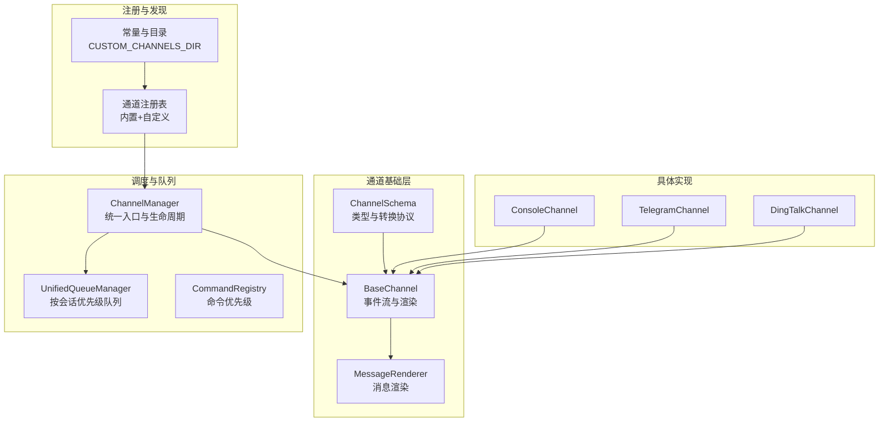
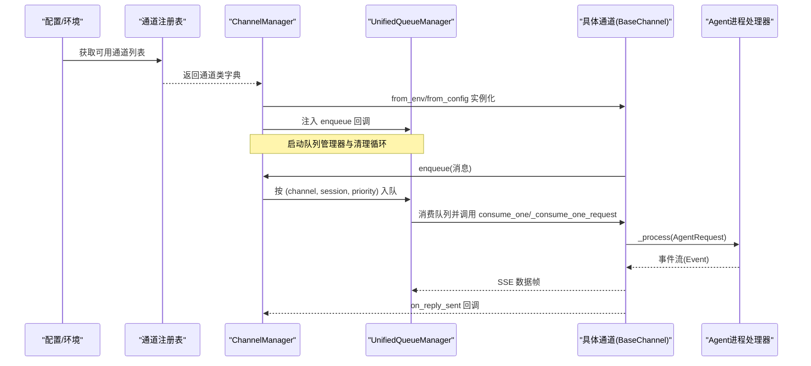
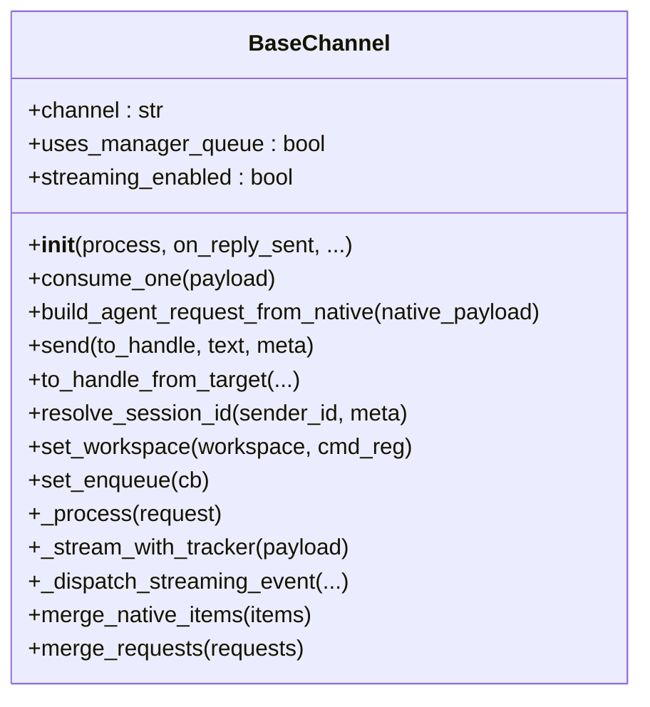
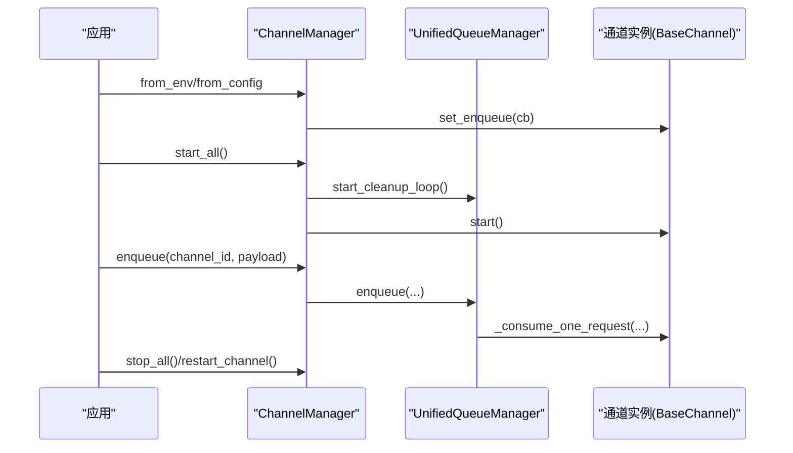
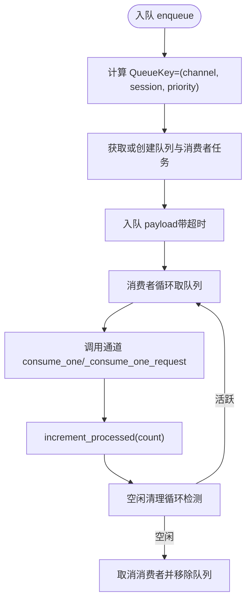
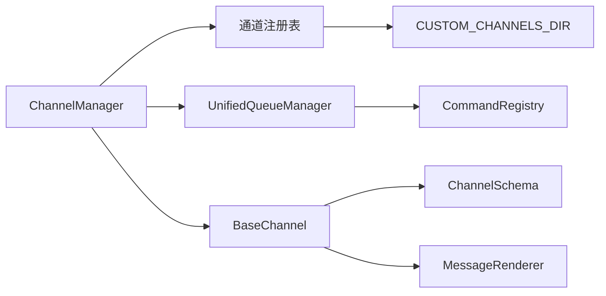

# 自定义通道开发

<cite>
**本文档引用的文件**
- [src/qwenpaw/app/channels/base.py](file://src/qwenpaw/app/channels/base.py)
- [src/qwenpaw/app/channels/manager.py](file://src/qwenpaw/app/channels/manager.py)
- [src/qwenpaw/app/channels/registry.py](file://src/qwenpaw/app/channels/registry.py)
- [src/qwenpaw/app/channels/unified_queue_manager.py](file://src/qwenpaw/app/channels/unified_queue_manager.py)
- [src/qwenpaw/app/channels/command_registry.py](file://src/qwenpaw/app/channels/command_registry.py)
- [src/qwenpaw/app/channels/schema.py](file://src/qwenpaw/app/channels/schema.py)
- [src/qwenpaw/app/channels/console/channel.py](file://src/qwenpaw/app/channels/console/channel.py)
- [src/qwenpaw/app/channels/telegram/channel.py](file://src/qwenpaw/app/channels/telegram/channel.py)
- [src/qwenpaw/app/channels/dingtalk/channel.py](file://src/qwenpaw/app/channels/dingtalk/channel.py)
- [src/qwenpaw/constant.py](file://src/qwenpaw/constant.py)
</cite>

## 目录
1. [简介](#简介)
2. [项目结构](#项目结构)
3. [核心组件](#核心组件)
4. [架构总览](#架构总览)
5. [详细组件分析](#详细组件分析)
6. [依赖分析](#依赖分析)
7. [性能考虑](#性能考虑)
8. [故障排查指南](#故障排查指南)
9. [结论](#结论)
10. [附录](#附录)

## 简介
本指南面向有经验的开发者，提供在 QwenPaw 中开发自定义通道（Channel）的完整技术路线图。内容涵盖：
- 如何继承 BaseChannel 基类实现新通道
- 必需与可选的方法清单、钩子函数与事件处理机制
- 通道注册流程、动态加载与插件化架构
- 生命周期管理、错误处理策略与性能监控
- 测试方法、调试技巧与部署注意事项
- 从简单 Echo 通道到复杂消息路由通道的开发示例路径

## 项目结构
QwenPaw 的通道系统由以下关键模块组成：
- 基类与协议：BaseChannel、ChannelMessageConverter、ChannelAddress、ChannelType
- 管理与调度：ChannelManager、UnifiedQueueManager、CommandRegistry
- 注册与发现：通道注册表、自定义通道目录扫描
- 典型实现：控制台通道、Telegram 通道、钉钉通道等

图表来源
- [src/qwenpaw/app/channels/base.py:78-800](file://src/qwenpaw/app/channels/base.py#L78-L800)
- [src/qwenpaw/app/channels/manager.py:68-800](file://src/qwenpaw/app/channels/manager.py#L68-L800)
- [src/qwenpaw/app/channels/unified_queue_manager.py:60-498](file://src/qwenpaw/app/channels/unified_queue_manager.py#L60-L498)
- [src/qwenpaw/app/channels/command_registry.py:23-291](file://src/qwenpaw/app/channels/command_registry.py#L23-L291)
- [src/qwenpaw/app/channels/registry.py:191-196](file://src/qwenpaw/app/channels/registry.py#L191-L196)
- [src/qwenpaw/app/channels/schema.py:12-72](file://src/qwenpaw/app/channels/schema.py#L12-L72)
- [src/qwenpaw/app/channels/console/channel.py:63-601](file://src/qwenpaw/app/channels/console/channel.py#L63-L601)
- [src/qwenpaw/app/channels/telegram/channel.py:283-800](file://src/qwenpaw/app/channels/telegram/channel.py#L283-L800)
- [src/qwenpaw/app/channels/dingtalk/channel.py:112-800](file://src/qwenpaw/app/channels/dingtalk/channel.py#L112-L800)
- [src/qwenpaw/constant.py:233-236](file://src/qwenpaw/constant.py#L233-L236)

章节来源
- [src/qwenpaw/app/channels/base.py:78-800](file://src/qwenpaw/app/channels/base.py#L78-L800)
- [src/qwenpaw/app/channels/manager.py:68-800](file://src/qwenpaw/app/channels/manager.py#L68-L800)
- [src/qwenpaw/app/channels/registry.py:191-196](file://src/qwenpaw/app/channels/registry.py#L191-L196)
- [src/qwenpaw/constant.py:233-236](file://src/qwenpaw/constant.py#L233-L236)

## 核心组件
- BaseChannel：所有通道的抽象基类，负责：
  - 事件流处理（SSE）、消息渲染、内容合并、去抖动、权限与提及策略、工作区注入、任务跟踪
  - 可选的实时流式钩子（on_streaming_start/delta/end）
  - 统一的 consume_one/build_agent_request_from_native/send 接口
- ChannelManager：通道生命周期与统一队列管理器的协调者
- UnifiedQueueManager：基于 (channel_id, session_id, priority) 的三元键队列，支持动态消费者创建与空闲清理
- CommandRegistry：命令前缀到优先级的映射，用于消息路由
- 通道注册表：内置通道与自定义通道的发现与缓存
- ChannelSchema：通道类型标识、路由地址与消息转换协议

章节来源
- [src/qwenpaw/app/channels/base.py:78-800](file://src/qwenpaw/app/channels/base.py#L78-L800)
- [src/qwenpaw/app/channels/manager.py:68-800](file://src/qwenpaw/app/channels/manager.py#L68-L800)
- [src/qwenpaw/app/channels/unified_queue_manager.py:60-498](file://src/qwenpaw/app/channels/unified_queue_manager.py#L60-L498)
- [src/qwenpaw/app/channels/command_registry.py:23-291](file://src/qwenpaw/app/channels/command_registry.py#L23-L291)
- [src/qwenpaw/app/channels/registry.py:191-196](file://src/qwenpaw/app/channels/registry.py#L191-L196)
- [src/qwenpaw/app/channels/schema.py:12-72](file://src/qwenpaw/app/channels/schema.py#L12-L72)

## 架构总览
通道系统采用“基类 + 管理器 + 队列 + 注册表”的分层设计：
- BaseChannel 定义统一的输入输出契约与事件处理
- ChannelManager 负责从配置或环境加载通道实例，并注入统一的 process 处理器
- UnifiedQueueManager 将同一会话、同一优先级的消息串行化，不同会话/优先级并发执行
- CommandRegistry 通过命令前缀识别控制命令，分配优先级
- 注册表支持内置通道与自定义通道（CUSTOM_CHANNELS_DIR）的动态发现与加载

图表来源
- [src/qwenpaw/app/channels/manager.py:90-216](file://src/qwenpaw/app/channels/manager.py#L90-L216)
- [src/qwenpaw/app/channels/unified_queue_manager.py:119-164](file://src/qwenpaw/app/channels/unified_queue_manager.py#L119-L164)
- [src/qwenpaw/app/channels/base.py:630-747](file://src/qwenpaw/app/channels/base.py#L630-L747)

章节来源
- [src/qwenpaw/app/channels/manager.py:90-216](file://src/qwenpaw/app/channels/manager.py#L90-L216)
- [src/qwenpaw/app/channels/unified_queue_manager.py:119-164](file://src/qwenpaw/app/channels/unified_queue_manager.py#L119-L164)
- [src/qwenpaw/app/channels/base.py:630-747](file://src/qwenpaw/app/channels/base.py#L630-L747)

## 详细组件分析

### BaseChannel 类与事件处理机制
- 必需接口
  - consume_one(payload)：处理单条消息（异步生成器或直接消费）
  - build_agent_request_from_native(native_payload)：将原生消息转为 AgentRequest
  - send/to_handle_from_target/send_content_parts：对外发送消息
- 可选钩子与增强能力
  - streaming_enabled：启用实时流式钩子
  - on_streaming_start/on_streaming_delta/on_streaming_end：增量文本事件
  - on_event_content/on_event_message_completed/on_event_response：非流式事件回调
  - resolve_session_id：会话 ID 解析（默认按通道规则）
  - set_workspace/set_enqueue：工作区与队列回调注入
- 内置特性
  - 去抖动（按会话合并无文本内容）、权限策略（DM/群组白名单/提及要求）、媒体解析与渲染
  - 任务跟踪与取消、SSE 序列化、UTF-8 清理与回退

图表来源
- [src/qwenpaw/app/channels/base.py:78-800](file://src/qwenpaw/app/channels/base.py#L78-L800)

章节来源
- [src/qwenpaw/app/channels/base.py:78-800](file://src/qwenpaw/app/channels/base.py#L78-L800)

### ChannelManager：通道注册、生命周期与队列集成
- from_env/from_config：从环境变量或配置文件创建通道实例
- start_all/stop_all：启动/停止所有通道与队列管理器
- enqueue：线程安全入队，支持跨线程回调
- replace_channel/restart_channel：热替换与重启通道
- get_channel/get_channel_health：通道查询与健康检查

图表来源
- [src/qwenpaw/app/channels/manager.py:90-541](file://src/qwenpaw/app/channels/manager.py#L90-L541)

章节来源
- [src/qwenpaw/app/channels/manager.py:68-800](file://src/qwenpaw/app/channels/manager.py#L68-L800)

### UnifiedQueueManager：按会话与优先级的队列调度
- QueueKey = (channel_id, session_id, priority_level)
- 动态消费者创建、空闲清理、处理计数与指标导出
- 支持清理循环、批量处理与超时保护

图表来源
- [src/qwenpaw/app/channels/unified_queue_manager.py:119-498](file://src/qwenpaw/app/channels/unified_queue_manager.py#L119-L498)

章节来源
- [src/qwenpaw/app/channels/unified_queue_manager.py:60-498](file://src/qwenpaw/app/channels/unified_queue_manager.py#L60-L498)

### CommandRegistry：命令优先级与路由
- 默认控制命令（如 /stop、/status、/restart 等）预注册
- 支持按命令前缀匹配与优先级分配（0/10/20/30）
- 提供 is_control_command、get_priority_level、get_priority_name 等查询接口

章节来源
- [src/qwenpaw/app/channels/command_registry.py:23-291](file://src/qwenpaw/app/channels/command_registry.py#L23-L291)

### 通道注册表与自定义通道目录
- 内置通道映射与缓存加载
- 自定义通道目录扫描（CUSTOM_CHANNELS_DIR），自动发现 BaseChannel 子类
- 支持自定义通道在模块级注册 HTTP 路由（/api/ 前缀）

章节来源
- [src/qwenpaw/app/channels/registry.py:191-196](file://src/qwenpaw/app/channels/registry.py#L191-L196)
- [src/qwenpaw/constant.py:233-236](file://src/qwenpaw/constant.py#L233-L236)

### 典型通道实现参考

#### 控制台通道 ConsoleChannel
- 输入：标准 AgentApp /agent/process 或 /console/chat；输出：打印到终端
- 关键点：resolve_session_id、build_agent_request_from_native、send/send_content_parts、stream_one
- 适用场景：本地调试、快速验证 Agent 输出

章节来源
- [src/qwenpaw/app/channels/console/channel.py:63-601](file://src/qwenpaw/app/channels/console/channel.py#L63-L601)

#### Telegram 通道 TelegramChannel
- 输入：Telegram Bot API 轮询；输出：Markdown/HTML 文本与媒体
- 关键点：_build_application、_build_content_parts_from_message、_chunk_text、typing 通知、流式编辑间隔
- 适用场景：公开聊天机器人、群组与私聊

章节来源
- [src/qwenpaw/app/channels/telegram/channel.py:283-800](file://src/qwenpaw/app/channels/telegram/channel.py#L283-L800)

#### 钉钉通道 DingTalkChannel
- 输入：DingTalk Stream 回调；输出：Markdown/AI 卡片；支持 sessionWebhook 主动推送
- 关键点：_reply_sync/_reply_sync_batch/_ack_early、去重与消息 ID 管理、会话 Webhook 存储与持久化
- 适用场景：企业内部机器人、卡片交互、主动推送

章节来源
- [src/qwenpaw/app/channels/dingtalk/channel.py:112-800](file://src/qwenpaw/app/channels/dingtalk/channel.py#L112-L800)

## 依赖分析
- BaseChannel 依赖
  - 事件模型与内容类型（ContentType、Message、RunStatus 等）
  - 渲染器与消息转换协议
  - 工作区注入（chat_manager/task_tracker）
- ChannelManager 依赖
  - 注册表与配置加载
  - UnifiedQueueManager 与 CommandRegistry
- UnifiedQueueManager 依赖
  - asyncio 队列与任务管理
  - 清理循环与指标导出
- 注册表依赖
  - CUSTOM_CHANNELS_DIR 动态导入
  - 缓存与线程安全

图表来源
- [src/qwenpaw/app/channels/base.py:37-39](file://src/qwenpaw/app/channels/base.py#L37-L39)
- [src/qwenpaw/app/channels/manager.py:21-25](file://src/qwenpaw/app/channels/manager.py#L21-L25)
- [src/qwenpaw/app/channels/unified_queue_manager.py:26-38](file://src/qwenpaw/app/channels/unified_queue_manager.py#L26-L38)
- [src/qwenpaw/app/channels/registry.py:12-13](file://src/qwenpaw/app/channels/registry.py#L12-L13)
- [src/qwenpaw/constant.py:233-236](file://src/qwenpaw/constant.py#L233-L236)

章节来源
- [src/qwenpaw/app/channels/base.py:37-39](file://src/qwenpaw/app/channels/base.py#L37-L39)
- [src/qwenpaw/app/channels/manager.py:21-25](file://src/qwenpaw/app/channels/manager.py#L21-L25)
- [src/qwenpaw/app/channels/unified_queue_manager.py:26-38](file://src/qwenpaw/app/channels/unified_queue_manager.py#L26-L38)
- [src/qwenpaw/app/channels/registry.py:12-13](file://src/qwenpaw/app/channels/registry.py#L12-L13)
- [src/qwenpaw/constant.py:233-236](file://src/qwenpaw/constant.py#L233-L236)

## 性能考虑
- 队列与并发
  - 使用 UnifiedQueueManager 的三元键隔离，避免全局阻塞
  - 通过 CommandRegistry 对控制命令设置更高优先级，减少响应延迟
- 去抖动与批处理
  - BaseChannel 的去抖动与合并逻辑减少重复渲染与网络请求
  - 管理器对同会话队列进行批处理合并
- 资源限制
  - 队列最大长度与入队超时保护，防止内存膨胀
  - 清理循环定期回收空闲队列，降低资源占用
- I/O 优化
  - 通道侧尽量使用流式发送（如 Telegram 的流式编辑间隔）
  - 媒体文件下载与本地化存储，避免重复传输

[本节为通用指导，无需列出章节来源]

## 故障排查指南
- 通道未生效
  - 检查是否在可用通道列表中（from_env/from_config）
  - 查看注册表是否正确发现自定义通道
- 消息未到达或重复
  - 检查去抖动与合并逻辑（BaseChannel.apply_no_text_debounce/merge_native_items）
  - 核对 resolve_session_id 与队列键一致性
- 队列积压或卡死
  - 使用 get_metrics 查看队列状态
  - 检查消费者任务是否被取消或异常
- 错误处理
  - BaseChannel 在 _stream_with_tracker 中捕获异常并触发 _on_consume_error
  - 通道侧可覆盖 on_event_response/on_event_message_completed 进行自定义错误上报

章节来源
- [src/qwenpaw/app/channels/base.py:630-747](file://src/qwenpaw/app/channels/base.py#L630-L747)
- [src/qwenpaw/app/channels/unified_queue_manager.py:430-498](file://src/qwenpaw/app/channels/unified_queue_manager.py#L430-L498)
- [src/qwenpaw/app/channels/manager.py:549-578](file://src/qwenpaw/app/channels/manager.py#L549-L578)

## 结论
通过继承 BaseChannel 并遵循统一的事件流与队列调度机制，开发者可以快速构建稳定、可扩展的自定义通道。结合 ChannelManager 的生命周期管理、UnifiedQueueManager 的并发隔离与 CommandRegistry 的优先级路由，通道系统具备良好的性能与可观测性。建议在开发过程中充分利用去抖动、批处理与流式钩子，确保用户体验与系统稳定性。

[本节为总结性内容，无需列出章节来源]

## 附录

### 开发步骤与最佳实践
- 继承 BaseChannel，至少实现：
  - consume_one 或 _consume_one_request
  - build_agent_request_from_native
  - send/send_content_parts/to_handle_from_target
- 在通道类中：
  - 设置 channel 字段与 uses_manager_queue
  - 实现 resolve_session_id（若需要）
  - 启用 streaming_enabled 并实现 on_streaming_* 钩子（可选）
- 注册与加载：
  - 将自定义通道类放入 CUSTOM_CHANNELS_DIR，确保其为 BaseChannel 子类且具有 channel 属性
  - 通道模块可导出 register_app_routes(app) 以挂载 /api/ 前缀的路由
- 生命周期：
  - start/stop 中初始化/释放外部连接（如 HTTP 客户端、SDK 客户端）
  - 使用 set_workspace 注入工作区以支持任务跟踪与聊天管理
- 错误处理：
  - 在事件回调中记录日志并返回安全回退
  - 利用 _on_consume_error 触发统一错误上报
- 性能监控：
  - 使用 get_metrics 获取队列统计
  - 在通道侧记录关键耗时指标（如下载、发送、渲染）

章节来源
- [src/qwenpaw/app/channels/base.py:78-800](file://src/qwenpaw/app/channels/base.py#L78-L800)
- [src/qwenpaw/app/channels/registry.py:98-131](file://src/qwenpaw/app/channels/registry.py#L98-L131)
- [src/qwenpaw/app/channels/unified_queue_manager.py:430-498](file://src/qwenpaw/app/channels/unified_queue_manager.py#L430-L498)
- [src/qwenpaw/constant.py:233-236](file://src/qwenpaw/constant.py#L233-L236)

### 示例路径（从简到繁）
- 简单 Echo 通道
  - 继承 BaseChannel，实现 build_agent_request_from_native 与 send
  - 使用 set_enqueue 与 ChannelManager 的统一入口
  - 参考 ConsoleChannel 的最小实现思路
- 消息路由通道
  - 实现 resolve_session_id 与 to_handle_from_target
  - 使用 CommandRegistry 的优先级进行路由
  - 参考 Telegram/DingTalk 的消息解析与发送逻辑
- 复杂交互通道
  - 引入流式钩子与去抖动
  - 实现会话 Webhook 存储与持久化（如钉钉）
  - 参考 DingTalkChannel 的 _ack_early 与 _reply_sync_batch

章节来源
- [src/qwenpaw/app/channels/console/channel.py:63-601](file://src/qwenpaw/app/channels/console/channel.py#L63-L601)
- [src/qwenpaw/app/channels/telegram/channel.py:283-800](file://src/qwenpaw/app/channels/telegram/channel.py#L283-L800)
- [src/qwenpaw/app/channels/dingtalk/channel.py:112-800](file://src/qwenpaw/app/channels/dingtalk/channel.py#L112-L800)