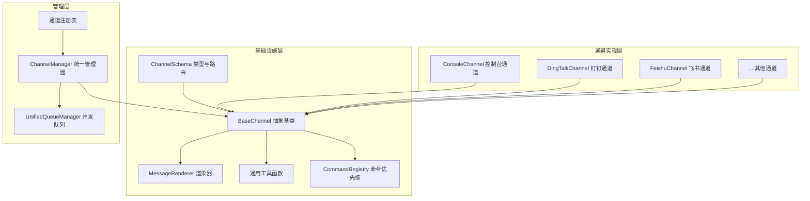
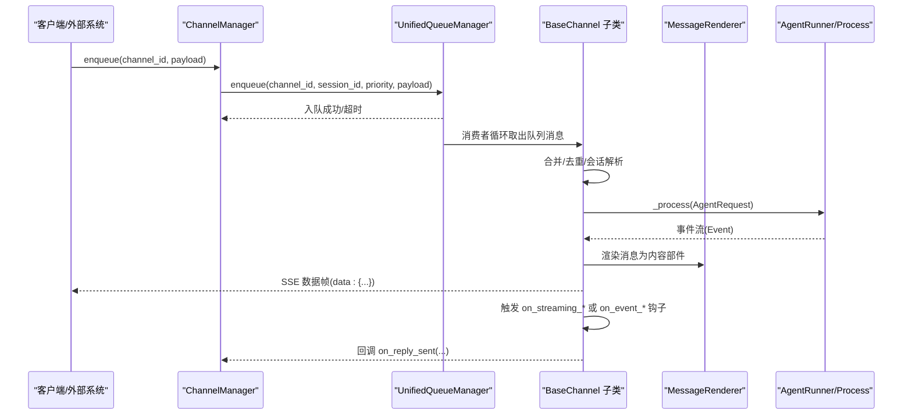
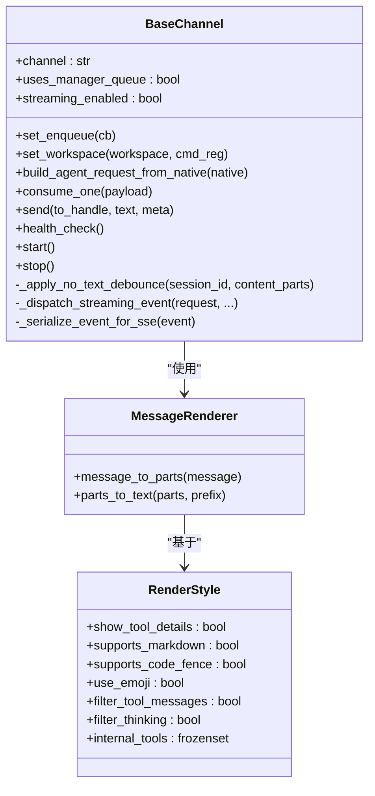
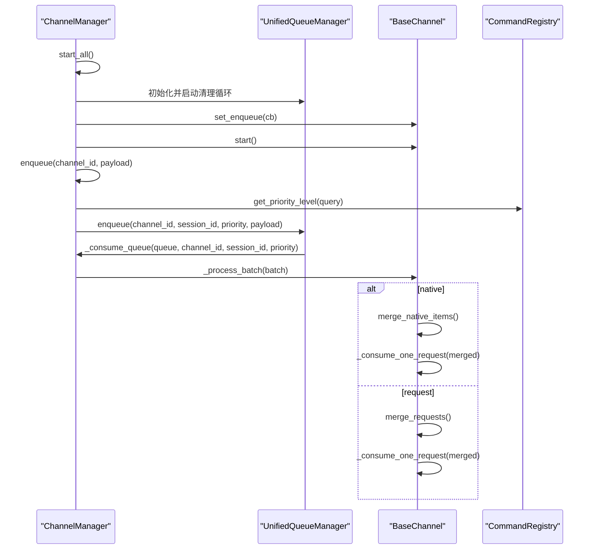
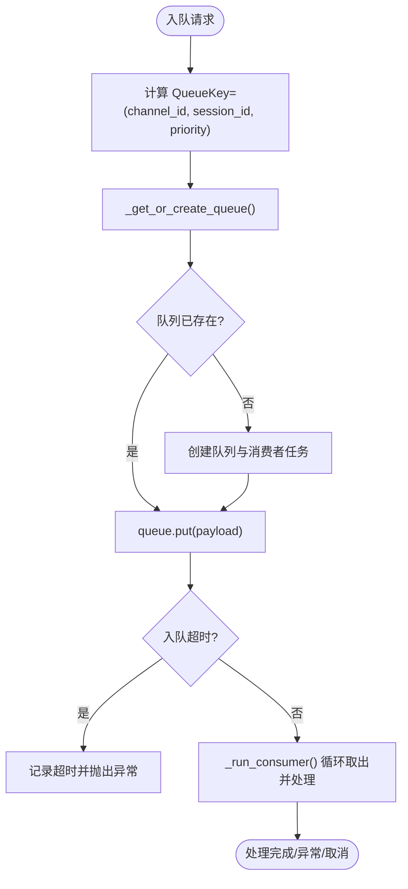
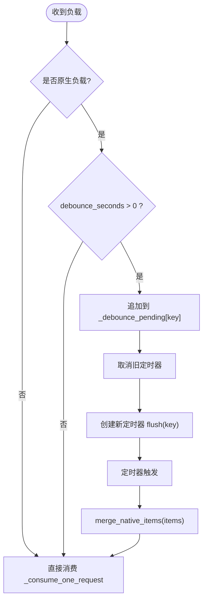
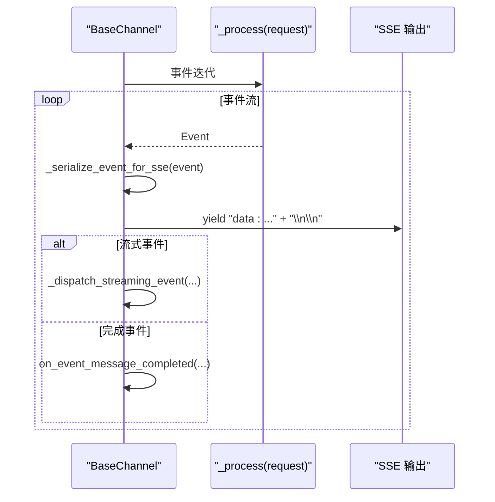
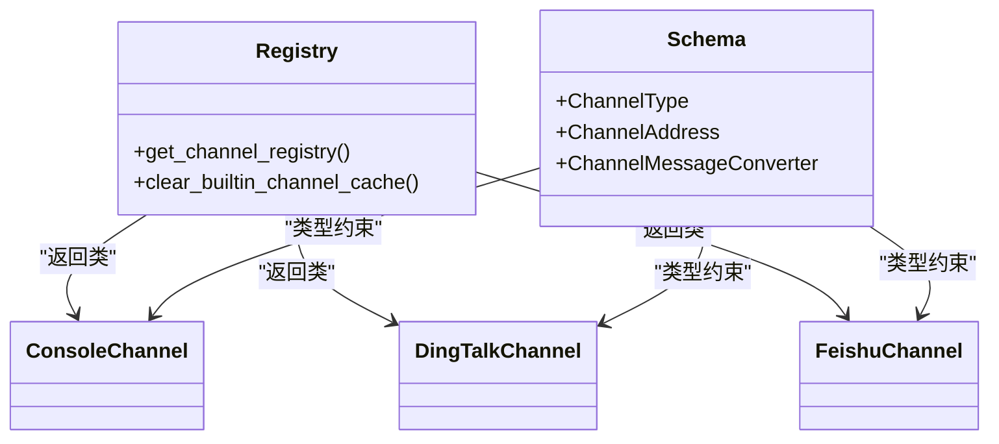
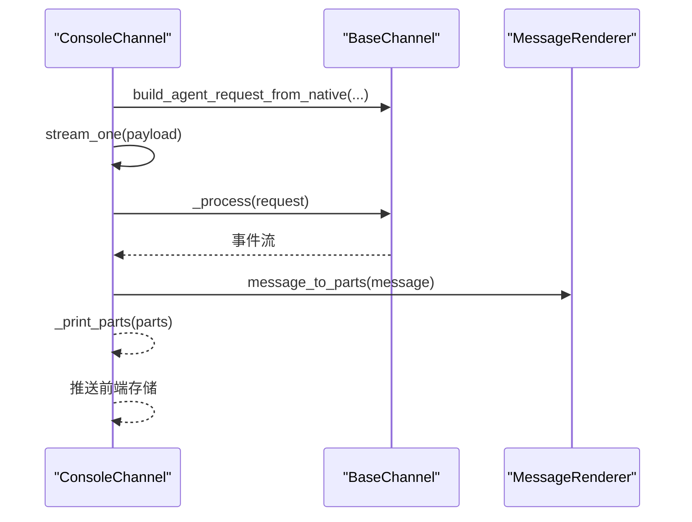
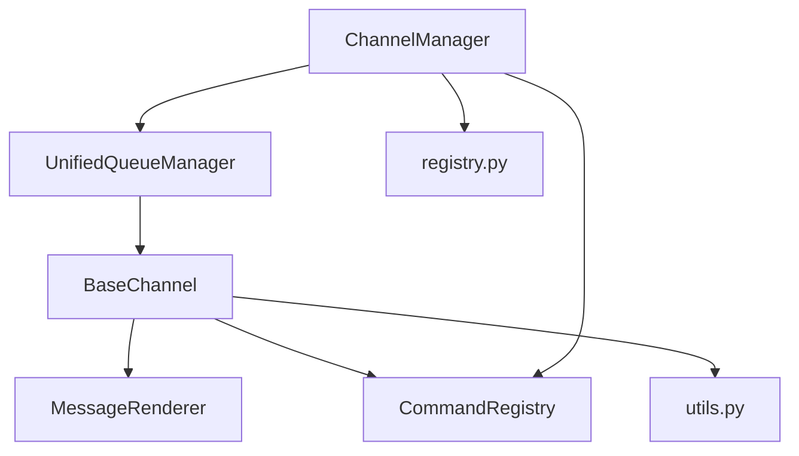

# 通道架构基础

<cite>
**本文档引用的文件**
- [base.py](file://src/qwenpaw/app/channels/base.py)
- [manager.py](file://src/qwenpaw/app/channels/manager.py)
- [unified_queue_manager.py](file://src/qwenpaw/app/channels/unified_queue_manager.py)
- [schema.py](file://src/qwenpaw/app/channels/schema.py)
- [registry.py](file://src/qwenpaw/app/channels/registry.py)
- [command_registry.py](file://src/qwenpaw/app/channels/command_registry.py)
- [renderer.py](file://src/qwenpaw/app/channels/renderer.py)
- [utils.py](file://src/qwenpaw/app/channels/utils.py)
- [console/channel.py](file://src/qwenpaw/app/channels/console/channel.py)
</cite>

## 目录
1. [引言](#引言)
2. [项目结构](#项目结构)
3. [核心组件](#核心组件)
4. [架构总览](#架构总览)
5. [详细组件分析](#详细组件分析)
6. [依赖关系分析](#依赖关系分析)
7. [性能考量](#性能考量)
8. [故障排查指南](#故障排查指南)
9. [结论](#结论)
10. [附录](#附录)

## 引言
本文件面向初学者与高级开发者，系统化阐述 QwenPaw 通道系统的核心架构：以 BaseChannel 抽象基类为核心，结合 ChannelManager 的统一调度与 UnifiedQueueManager 的并发队列模型，构建了可插拔、可扩展、具备实时流式能力的消息通道体系。文档重点覆盖以下主题：
- BaseChannel 的设计理念与职责边界
- ChannelManager 的统一管理机制与消息路由算法
- 队列处理机制与时间抖动合并策略
- 事件流处理与 SSE（Server-Sent Events）实现
- 通道生命周期管理、权限控制、会话管理与消息去重
- 通道注册流程、消息合并算法与时间抖动处理
- 面向扩展的架构建议与性能优化要点

## 项目结构
通道系统位于 src/qwenpaw/app/channels 目录下，采用“按功能域分层 + 按通道类型模块化”的组织方式：
- 基础设施层：抽象基类、队列管理、命令优先级、渲染器、工具函数
- 管理层：通道注册表、通道管理器、统一队列管理器
- 通道实现层：各平台通道的具体实现（如 Console、DingTalk、Feishu 等）

图表来源
- [base.py:78-168](file://src/qwenpaw/app/channels/base.py#L78-L168)
- [manager.py:68-110](file://src/qwenpaw/app/channels/manager.py#L68-L110)
- [unified_queue_manager.py:60-118](file://src/qwenpaw/app/channels/unified_queue_manager.py#L60-L118)
- [registry.py:191-196](file://src/qwenpaw/app/channels/registry.py#L191-L196)
- [schema.py:12-50](file://src/qwenpaw/app/channels/schema.py#L12-L50)
- [renderer.py:78-86](file://src/qwenpaw/app/channels/renderer.py#L78-L86)
- [utils.py:261-274](file://src/qwenpaw/app/channels/utils.py#L261-L274)
- [console/channel.py:63-190](file://src/qwenpaw/app/channels/console/channel.py#L63-L190)

章节来源
- [base.py:78-168](file://src/qwenpaw/app/channels/base.py#L78-L168)
- [manager.py:68-110](file://src/qwenpaw/app/channels/manager.py#L68-L110)
- [unified_queue_manager.py:60-118](file://src/qwenpaw/app/channels/unified_queue_manager.py#L60-L118)
- [registry.py:191-196](file://src/qwenpaw/app/channels/registry.py#L191-L196)
- [schema.py:12-50](file://src/qwenpaw/app/channels/schema.py#L12-L50)
- [renderer.py:78-86](file://src/qwenpaw/app/channels/renderer.py#L78-L86)
- [utils.py:261-274](file://src/qwenpaw/app/channels/utils.py#L261-L274)
- [console/channel.py:63-190](file://src/qwenpaw/app/channels/console/channel.py#L63-L190)

## 核心组件
本节从系统视角概述通道系统的关键构件及其职责。

- BaseChannel 抽象基类
  - 定义通道的统一接口与通用行为：请求构建、事件处理、消息发送、渲染、去重与时间抖动、权限与会话管理等
  - 提供 SSE 序列化、事件钩子（on_streaming_*、on_event_*）、错误处理与生命周期方法
  - 支持通过 set_enqueue 注入统一队列回调，以及 set_workspace 注入工作空间上下文

- ChannelManager 统一管理器
  - 负责通道实例的创建、注入、启动与停止
  - 通过 UnifiedQueueManager 实现按 (channel_id, session_id, priority) 的三元键隔离的并发队列
  - 提供消息路由、批量合并、命令优先级判定、健康检查与通道重启等能力

- UnifiedQueueManager 并发队列
  - 动态消费者创建：同一 QueueKey 首次入队时创建消费者任务
  - 自动清理空闲队列，避免资源泄漏
  - 提供入队、出队、统计与清理接口，支持超时保护与计数统计

- CommandRegistry 命令优先级
  - 将用户输入中的控制命令映射到优先级级别（0/10/20/30），用于队列调度
  - 支持默认控制命令注册与自定义扩展

- MessageRenderer 渲染器
  - 将运行时消息转换为可发送的内容部件（文本/图片/音频/视频/文件/拒绝）
  - 支持样式控制（是否显示工具详情、过滤思考内容、是否支持代码围栏等）

- 通道注册表与模式
  - 内置通道清单与加载逻辑，支持自定义通道目录扫描与动态注册
  - ChannelType 使用字符串标识，内置通道集合用于兼容性

章节来源
- [base.py:78-168](file://src/qwenpaw/app/channels/base.py#L78-L168)
- [manager.py:68-110](file://src/qwenpaw/app/channels/manager.py#L68-L110)
- [unified_queue_manager.py:60-118](file://src/qwenpaw/app/channels/unified_queue_manager.py#L60-L118)
- [command_registry.py:23-62](file://src/qwenpaw/app/channels/command_registry.py#L23-L62)
- [renderer.py:78-86](file://src/qwenpaw/app/channels/renderer.py#L78-L86)
- [registry.py:191-196](file://src/qwenpaw/app/channels/registry.py#L191-L196)
- [schema.py:12-50](file://src/qwenpaw/app/channels/schema.py#L12-L50)

## 架构总览
通道系统采用“抽象基类 + 管理器 + 并发队列”的分层设计，形成如下交互链路：

图表来源
- [manager.py:352-364](file://src/qwenpaw/app/channels/manager.py#L352-L364)
- [unified_queue_manager.py:119-164](file://src/qwenpaw/app/channels/unified_queue_manager.py#L119-L164)
- [base.py:630-748](file://src/qwenpaw/app/channels/base.py#L630-L748)
- [renderer.py:87-102](file://src/qwenpaw/app/channels/renderer.py#L87-L102)

## 详细组件分析

### BaseChannel 抽象基类
- 设计理念
  - 以“统一请求模型”为核心：所有通道输入统一转换为 AgentRequest，输出统一通过事件流驱动
  - 分离“消费流程”与“发送流程”：consume_one 负责消费与去重合并，on_event_* 与 send_* 负责发送
  - 可插拔的渲染与样式：通过 RenderStyle 与 MessageRenderer 控制消息格式
  - 可选的实时流式钩子：on_streaming_start/delta/end 与非流式 on_event_message_completed 并行存在

- 关键机制
  - 会话管理：resolve_session_id 默认以 channel:user_id 组合；部分通道可覆盖以支持会话持久化或 Webhook
  - 权限控制：dm_policy/group_policy/allow_from/deny_message/require_mention 等组合实现白名单/黑名单与提及策略
  - 时间抖动与去重：_apply_no_text_debounce 缓冲无文本内容，待有文本时合并发送；merge_native_items/merge_requests 支持同会话批量合并
  - SSE 序列化：_serialize_event_for_sse 将事件安全地序列化为 JSON 字符串，保证 UTF-8 兼容
  - 流式事件分派：_dispatch_streaming_event 将 reasoning/message 事件分流至实时钩子，其余走完成事件路径

- 生命周期与错误处理
  - start/stop 由具体通道实现；BaseChannel 提供健康检查默认实现
  - _on_consume_error 统一错误回传；_get_response_error_message 从响应中提取错误信息
  - _consume_with_tracker 与 TaskTracker 集成，支持 /stop 取消

- 代码级类图

图表来源
- [base.py:78-168](file://src/qwenpaw/app/channels/base.py#L78-L168)
- [base.py:1184-1317](file://src/qwenpaw/app/channels/base.py#L1184-L1317)
- [renderer.py:78-86](file://src/qwenpaw/app/channels/renderer.py#L78-L86)
- [renderer.py:37-48](file://src/qwenpaw/app/channels/renderer.py#L37-L48)

章节来源
- [base.py:78-168](file://src/qwenpaw/app/channels/base.py#L78-L168)
- [base.py:1184-1317](file://src/qwenpaw/app/channels/base.py#L1184-L1317)
- [base.py:1318-1519](file://src/qwenpaw/app/channels/base.py#L1318-L1519)
- [renderer.py:78-86](file://src/qwenpaw/app/channels/renderer.py#L78-L86)
- [renderer.py:37-48](file://src/qwenpaw/app/channels/renderer.py#L37-L48)

### ChannelManager 统一管理机制
- 通道创建与注入
  - from_env/from_config 根据环境变量或配置生成通道实例，并注入统一的 process 处理器
  - set_workspace 将工作空间与命令注册表注入各通道，以便会话管理与控制命令识别

- 统一队列与路由
  - _make_enqueue_cb 为每个通道生成入队回调
  - _enqueue_one 提取查询文本进行命令优先级判定，计算 session_id 并入队
  - _consume_queue 实现批合并逻辑：drain 同键队列后合并 native/request，再调用 _process_batch

- 批处理与合并
  - _process_batch 对 native 请求使用 merge_native_items，对 AgentRequest 使用 merge_requests
  - 特定通道（如 DingTalk）在合并时保留 session_webhook 等关键元数据

- 生命周期与重启
  - start_all 初始化 UnifiedQueueManager、启动清理循环、设置入队回调并逐个启动通道
  - stop_all 取消待处理入队任务、停止队列管理器、停止通道并清理回调
  - restart_channel 通过 clone + replace_channel 实现通道热重启，避免资源泄露

- 健康检查与运维
  - get_channel_health 获取单通道健康状态
  - clear_queue 支持清理指定队列

- 代码级时序图

图表来源
- [manager.py:462-541](file://src/qwenpaw/app/channels/manager.py#L462-L541)
- [manager.py:352-364](file://src/qwenpaw/app/channels/manager.py#L352-L364)
- [manager.py:365-461](file://src/qwenpaw/app/channels/manager.py#L365-L461)
- [command_registry.py:179-222](file://src/qwenpaw/app/channels/command_registry.py#L179-L222)

章节来源
- [manager.py:68-110](file://src/qwenpaw/app/channels/manager.py#L68-L110)
- [manager.py:111-216](file://src/qwenpaw/app/channels/manager.py#L111-L216)
- [manager.py:218-364](file://src/qwenpaw/app/channels/manager.py#L218-L364)
- [manager.py:365-541](file://src/qwenpaw/app/channels/manager.py#L365-L541)
- [manager.py:542-800](file://src/qwenpaw/app/channels/manager.py#L542-L800)
- [command_registry.py:23-62](file://src/qwenpaw/app/channels/command_registry.py#L23-L62)
- [command_registry.py:179-222](file://src/qwenpaw/app/channels/command_registry.py#L179-L222)

### UnifiedQueueManager 并发队列
- 核心数据结构
  - QueueKey = (channel_id, session_id, priority_level)，确保同一键严格串行，不同键并发执行
  - QueueState 包含队列、消费者任务、创建/活动时间戳与处理计数

- 动态消费者与自动清理
  - _get_or_create_queue 首次入队时创建消费者任务
  - _run_consumer 运行消费者循环，异常与取消均被妥善处理
  - start_cleanup_loop 定期清理空闲队列，避免内存与任务堆积

- 接口与监控
  - enqueue 支持超时保护与日志记录
  - increment_processed 与 get_metrics 提供运行时统计

- 代码级流程图

图表来源
- [unified_queue_manager.py:119-164](file://src/qwenpaw/app/channels/unified_queue_manager.py#L119-L164)
- [unified_queue_manager.py:165-213](file://src/qwenpaw/app/channels/unified_queue_manager.py#L165-L213)
- [unified_queue_manager.py:214-273](file://src/qwenpaw/app/channels/unified_queue_manager.py#L214-L273)
- [unified_queue_manager.py:274-428](file://src/qwenpaw/app/channels/unified_queue_manager.py#L274-L428)

章节来源
- [unified_queue_manager.py:60-118](file://src/qwenpaw/app/channels/unified_queue_manager.py#L60-L118)
- [unified_queue_manager.py:119-164](file://src/qwenpaw/app/channels/unified_queue_manager.py#L119-L164)
- [unified_queue_manager.py:165-213](file://src/qwenpaw/app/channels/unified_queue_manager.py#L165-L213)
- [unified_queue_manager.py:214-273](file://src/qwenpaw/app/channels/unified_queue_manager.py#L214-L273)
- [unified_queue_manager.py:274-428](file://src/qwenpaw/app/channels/unified_queue_manager.py#L274-L428)
- [unified_queue_manager.py:430-498](file://src/qwenpaw/app/channels/unified_queue_manager.py#L430-L498)

### 消息去重与时间抖动处理
- 无文本去重
  - _apply_no_text_debounce 对无文本内容进行缓冲，等待后续文本到达后再合并发送
  - 音频类内容（语音输入）视为完整输入，立即处理并清空缓冲

- 时间抖动合并
  - _is_native_payload 识别原生字典负载；get_debounce_key 以 session_id 为键
  - consume_one 在 _debounce_seconds > 0 且为原生负载时启用定时器合并，定时器到期后 flush 合并项

- 合并算法
  - merge_native_items 合并 content_parts 并保留 meta 中的关键字段（如 reply_future、incoming_message 等）
  - merge_requests 对多个 AgentRequest 的 input.content 进行拼接，保持首个请求的 meta/session

- 代码级流程图

图表来源
- [base.py:948-975](file://src/qwenpaw/app/channels/base.py#L948-L975)
- [base.py:961-973](file://src/qwenpaw/app/channels/base.py#L961-L973)
- [base.py:188-218](file://src/qwenpaw/app/channels/base.py#L188-L218)
- [base.py:219-249](file://src/qwenpaw/app/channels/base.py#L219-L249)

章节来源
- [base.py:169-187](file://src/qwenpaw/app/channels/base.py#L169-L187)
- [base.py:290-323](file://src/qwenpaw/app/channels/base.py#L290-L323)
- [base.py:948-975](file://src/qwenpaw/app/channels/base.py#L948-L975)
- [base.py:188-249](file://src/qwenpaw/app/channels/base.py#L188-L249)

### 事件流处理与 SSE 实现
- 事件序列化
  - _serialize_event_for_sse 优先使用 model_dump_json/json，失败时降级为字符串包装
  - _sanitize_surrogate_text/_sanitize_for_json 保证 UTF-8 兼容与 JSON 安全

- 流式与非流式路径
  - _dispatch_streaming_event 将 reasoning/message 事件分流至 on_streaming_* 钩子
  - 非流式路径在事件对象为 message 且状态为 Completed 时调用 on_event_message_completed
  - _stream_with_tracker 作为统一的事件流生成器，逐条产出 data: 行

- 代码级时序图

图表来源
- [base.py:630-748](file://src/qwenpaw/app/channels/base.py#L630-L748)
- [base.py:778-815](file://src/qwenpaw/app/channels/base.py#L778-L815)

章节来源
- [base.py:630-748](file://src/qwenpaw/app/channels/base.py#L630-L748)
- [base.py:778-815](file://src/qwenpaw/app/channels/base.py#L778-L815)

### 通道注册流程与模式
- 内置通道注册
  - registry 中维护内置通道映射，按模块名与类名加载，失败时根据是否必需决定抛错或跳过
  - 缓存机制避免重复导入

- 自定义通道发现
  - 扫描 CUSTOM_CHANNELS_DIR 下的 Python 文件或包，动态导入并收集继承自 BaseChannel 的类
  - 通过模块级 register_app_routes 钩子挂载 HTTP 路由（需以 /api/ 开头）

- 通道类型与路由
  - ChannelType 使用字符串标识，内置通道集合用于兼容性
  - ChannelAddress 提供统一的发送目标描述（kind/id/extra），简化跨通道路由

- 代码级类图

图表来源
- [registry.py:191-196](file://src/qwenpaw/app/channels/registry.py#L191-L196)
- [schema.py:12-50](file://src/qwenpaw/app/channels/schema.py#L12-L50)
- [console/channel.py:63-190](file://src/qwenpaw/app/channels/console/channel.py#L63-L190)

章节来源
- [registry.py:191-196](file://src/qwenpaw/app/channels/registry.py#L191-L196)
- [registry.py:98-131](file://src/qwenpaw/app/channels/registry.py#L98-L131)
- [schema.py:12-50](file://src/qwenpaw/app/channels/schema.py#L12-L50)
- [console/channel.py:63-190](file://src/qwenpaw/app/channels/console/channel.py#L63-L190)

### Console 通道示例
- 职责边界
  - 输入由 AgentApp 的 /agent/process 处理；Console 仅负责输出（打印到终端）
  - 支持工具详情显示、过滤思考内容、媒体文件解析与推送前端存储

- 关键实现
  - build_agent_request_from_native 解析原生负载为 AgentRequest
  - stream_one 与 consume_one 组合实现 SSE 事件流与终端打印
  - send/send_content_parts 将内容部件转为文本并打印，同时写入推送存储

- 代码级时序图

图表来源
- [console/channel.py:255-277](file://src/qwenpaw/app/channels/console/channel.py#L255-L277)
- [console/channel.py:332-447](file://src/qwenpaw/app/channels/console/channel.py#L332-L447)
- [renderer.py:87-102](file://src/qwenpaw/app/channels/renderer.py#L87-L102)

章节来源
- [console/channel.py:63-190](file://src/qwenpaw/app/channels/console/channel.py#L63-L190)
- [console/channel.py:255-277](file://src/qwenpaw/app/channels/console/channel.py#L255-L277)
- [console/channel.py:332-447](file://src/qwenpaw/app/channels/console/channel.py#L332-L447)
- [console/channel.py:540-574](file://src/qwenpaw/app/channels/console/channel.py#L540-L574)

## 依赖关系分析
- 组件耦合
  - BaseChannel 依赖 MessageRenderer、RenderStyle、CommandRegistry 与工具函数
  - ChannelManager 依赖 UnifiedQueueManager、CommandRegistry、通道注册表与配置加载
  - UnifiedQueueManager 仅依赖 asyncio 与内部数据结构，低耦合高内聚

- 外部集成点
  - AgentRunner/Process 作为统一处理器，所有通道共享同一 process
  - 工作空间（workspace）提供聊天管理与任务追踪能力，注入到通道与队列管理器

- 依赖可视化

图表来源
- [base.py:37-42](file://src/qwenpaw/app/channels/base.py#L37-L42)
- [manager.py:21-25](file://src/qwenpaw/app/channels/manager.py#L21-L25)
- [unified_queue_manager.py:20-28](file://src/qwenpaw/app/channels/unified_queue_manager.py#L20-L28)

章节来源
- [base.py:37-42](file://src/qwenpaw/app/channels/base.py#L37-L42)
- [manager.py:21-25](file://src/qwenpaw/app/channels/manager.py#L21-L25)
- [unified_queue_manager.py:20-28](file://src/qwenpaw/app/channels/unified_queue_manager.py#L20-L28)

## 性能考量
- 并发与隔离
  - 通过 QueueKey 实现会话与优先级隔离，避免全局锁竞争
  - 动态消费者创建减少固定线程池开销，按需扩展

- 资源回收
  - 自动清理空闲队列，防止内存与任务泄漏
  - 入队超时保护，避免阻塞导致的资源占用

- I/O 与序列化
  - SSE 序列化采用安全降级策略，保证事件传输稳定性
  - 文本拆分与表格块处理提升长消息渲染质量

- 建议
  - 合理设置 debounce_seconds，平衡实时性与吞吐量
  - 为高并发通道开启 uses_manager_queue 并使用统一队列
  - 利用 CommandRegistry 为关键命令分配更高优先级，缩短响应延迟

## 故障排查指南
- 常见问题定位
  - 入队失败/超时：检查队列容量与清理循环是否正常运行
  - 通道未启动：确认 from_env/from_config 是否正确加载，start_all 是否调用
  - 会话错乱：核对 resolve_session_id 实现与 session_id 提取逻辑
  - 流式事件未触发：确认 streaming_enabled 设置与 on_streaming_* 钩子实现

- 日志与指标
  - 使用 get_metrics 查看队列数量、大小与处理计数
  - 通过健康检查接口获取通道状态与错误详情

- 快速修复
  - 通道重启：使用 restart_channel 以最小停机时间恢复服务
  - 清理队列：使用 clear_queue 清除积压消息，释放资源

章节来源
- [unified_queue_manager.py:430-498](file://src/qwenpaw/app/channels/unified_queue_manager.py#L430-L498)
- [manager.py:549-579](file://src/qwenpaw/app/channels/manager.py#L549-L579)
- [manager.py:580-666](file://src/qwenpaw/app/channels/manager.py#L580-L666)
- [manager.py:680-703](file://src/qwenpaw/app/channels/manager.py#L680-L703)

## 结论
QwenPaw 通道系统以 BaseChannel 为核心，借助 ChannelManager 与 UnifiedQueueManager 实现了高内聚、低耦合、可扩展的消息通道架构。通过统一的事件流模型、严格的会话隔离与灵活的优先级调度，系统在保证实时性的同时兼顾了稳定性与可运维性。面向未来，可在以下方向持续演进：
- 扩展更多内置通道与自定义通道生态
- 引入更细粒度的速率限制与熔断策略
- 增强多通道协同与跨通道消息路由能力

## 附录
- 配置参数与权限控制
  - show_tool_details/filter_tool_messages/filter_thinking：控制工具详情与思考内容展示
  - dm_policy/group_policy/allow_from/deny_message/require_mention：实现白名单/黑名单与提及策略
  - bot_prefix：统一前缀注入，便于前端区分机器人消息

- 会话管理
  - resolve_session_id 默认以 channel:user_id 组合；部分通道可覆盖以支持 Webhook 或持久化会话

- 消息合并与去重
  - merge_native_items/merge_requests：同会话批量合并，减少重复请求
  - _apply_no_text_debounce：无文本缓冲，文本到达后一次性发送

章节来源
- [base.py:119-168](file://src/qwenpaw/app/channels/base.py#L119-L168)
- [base.py:836-847](file://src/qwenpaw/app/channels/base.py#L836-L847)
- [base.py:188-249](file://src/qwenpaw/app/channels/base.py#L188-L249)
- [base.py:290-323](file://src/qwenpaw/app/channels/base.py#L290-L323)