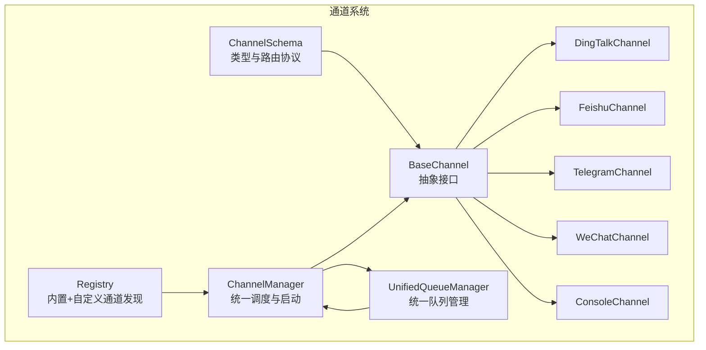
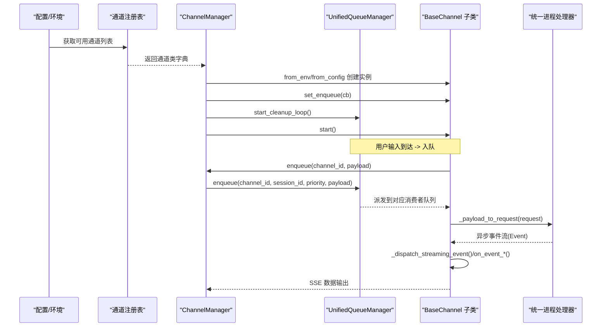
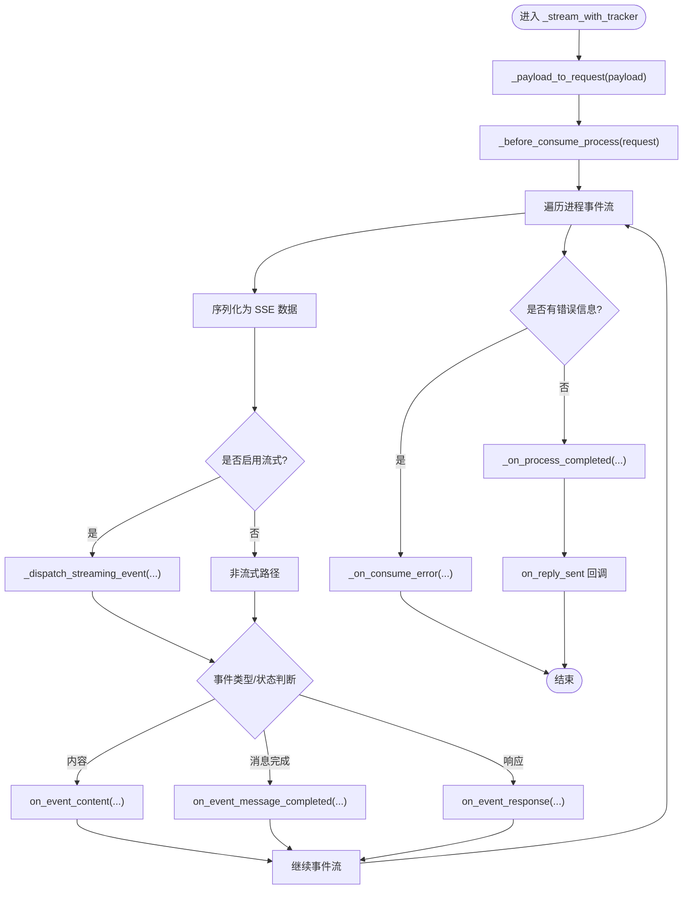
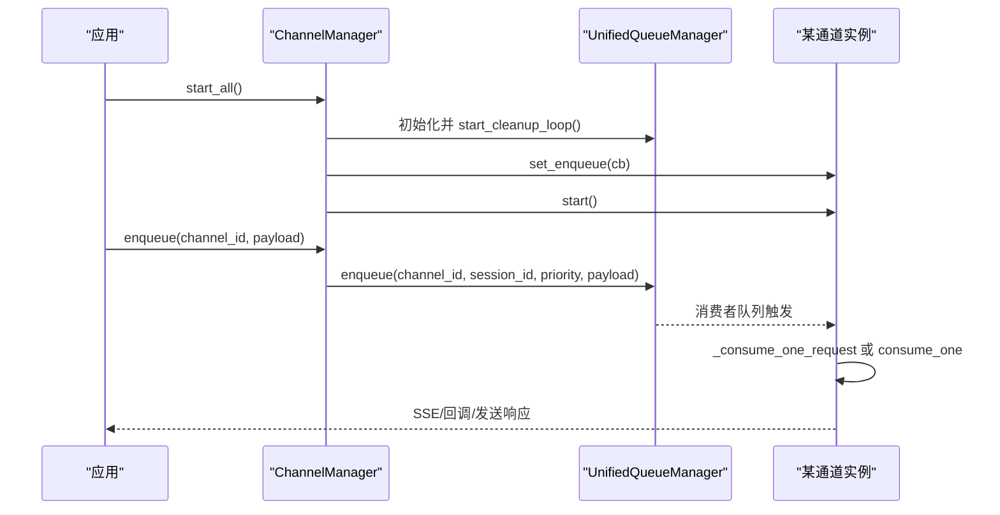
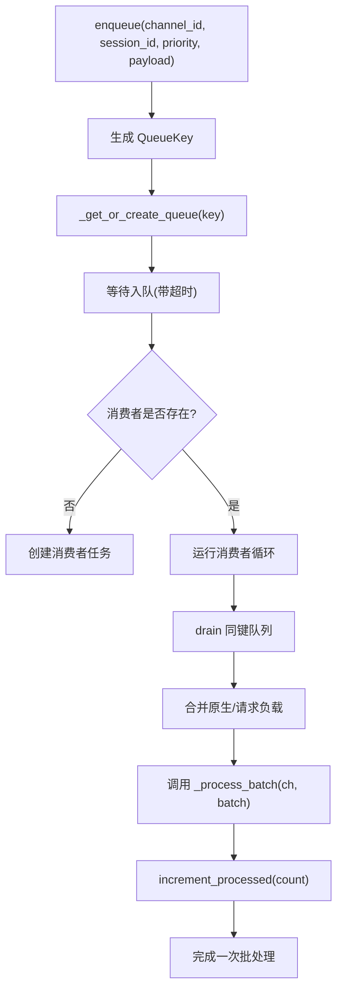
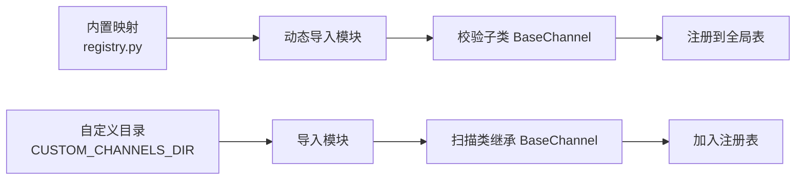
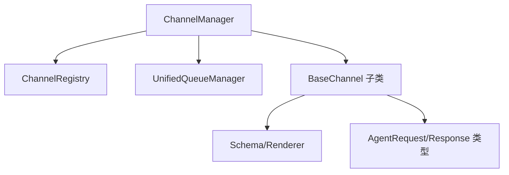

# 通道系统

<cite>
**本文引用的文件**
- [src/qwenpaw/app/channels/base.py](file://src/qwenpaw/app/channels/base.py)
- [src/qwenpaw/app/channels/manager.py](file://src/qwenpaw/app/channels/manager.py)
- [src/qwenpaw/app/channels/registry.py](file://src/qwenpaw/app/channels/registry.py)
- [src/qwenpaw/app/channels/schema.py](file://src/qwenpaw/app/channels/schema.py)
- [src/qwenpaw/app/channels/unified_queue_manager.py](file://src/qwenpaw/app/channels/unified_queue_manager.py)
- [src/qwenpaw/app/channels/dingtalk/channel.py](file://src/qwenpaw/app/channels/dingtalk/channel.py)
- [src/qwenpaw/app/channels/feishu/channel.py](file://src/qwenpaw/app/channels/feishu/channel.py)
- [src/qwenpaw/app/channels/telegram/channel.py](file://src/qwenpaw/app/channels/telegram/channel.py)
- [src/qwenpaw/app/channels/wechat/channel.py](file://src/qwenpaw/app/channels/wechat/channel.py)
- [src/qwenpaw/app/channels/console/channel.py](file://src/qwenpaw/app/channels/console/channel.py)
</cite>

## 目录
1. [简介](#简介)
2. [项目结构](#项目结构)
3. [核心组件](#核心组件)
4. [架构总览](#架构总览)
5. [详细组件分析](#详细组件分析)
6. [依赖分析](#依赖分析)
7. [性能考虑](#性能考虑)
8. [故障排查指南](#故障排查指南)
9. [结论](#结论)
10. [附录](#附录)

## 简介
本文件系统性阐述 QwenPaw 的通道系统设计与实现，重点覆盖以下方面：
- 统一管理：ChannelManager 如何集中管理各通道实例、队列与消费者循环
- 抽象接口：BaseChannel 的职责边界、消息处理生命周期与流式回调钩子
- 平台实现：内置通道（钉钉、飞书、微信、Telegram 等）的适配要点
- 消息路由：基于会话与优先级的统一队列管理与批合并策略
- 状态管理与错误处理：任务追踪、取消、健康检查与重启机制
- 扩展机制：通道注册表、自定义通道开发与路由钩子
- 多平台同步、认证与权限控制：会话隔离、提及策略、白名单/黑名单

## 项目结构
通道系统位于后端应用模块 src/qwenpaw/app/channels 下，采用“按平台分目录 + 公共基类”的组织方式：
- 基类与公共设施：base.py、schema.py、registry.py、unified_queue_manager.py、manager.py
- 平台通道：dingtalk/、feishu/、telegram/、wechat/、console/ 等目录下的 channel.py
- 注册与发现：registry.py 负责内置通道加载与自定义通道扫描

图表来源
- [src/qwenpaw/app/channels/base.py:78-168](file://src/qwenpaw/app/channels/base.py#L78-L168)
- [src/qwenpaw/app/channels/schema.py:12-72](file://src/qwenpaw/app/channels/schema.py#L12-L72)
- [src/qwenpaw/app/channels/registry.py:191-196](file://src/qwenpaw/app/channels/registry.py#L191-L196)
- [src/qwenpaw/app/channels/unified_queue_manager.py:60-118](file://src/qwenpaw/app/channels/unified_queue_manager.py#L60-L118)
- [src/qwenpaw/app/channels/manager.py:68-110](file://src/qwenpaw/app/channels/manager.py#L68-L110)

章节来源
- [src/qwenpaw/app/channels/registry.py:19-89](file://src/qwenpaw/app/channels/registry.py#L19-L89)
- [src/qwenpaw/app/channels/manager.py:68-110](file://src/qwenpaw/app/channels/manager.py#L68-L110)

## 核心组件
- BaseChannel：所有通道的抽象基类，定义消息消费契约、渲染器、流式回调、去抖与合并逻辑、会话提取与聊天上下文创建、事件序列化与 SSE 输出等
- ChannelManager：统一管理器，负责从环境或配置创建通道实例、注入统一进程处理器、设置工作区、启动/停止队列与通道、替换通道、发送事件等
- UnifiedQueueManager：以 (channel_id, session_id, priority_level) 为键的动态队列与消费者管理，支持自动清理空闲队列、并发隔离与批合并
- ChannelRegistry：内置通道映射与自定义通道扫描，提供通道注册表与自定义路由挂载能力
- ChannelSchema：通道类型标识、统一路由地址模型与消息转换协议

章节来源
- [src/qwenpaw/app/channels/base.py:78-168](file://src/qwenpaw/app/channels/base.py#L78-L168)
- [src/qwenpaw/app/channels/manager.py:68-110](file://src/qwenpaw/app/channels/manager.py#L68-L110)
- [src/qwenpaw/app/channels/unified_queue_manager.py:60-118](file://src/qwenpaw/app/channels/unified_queue_manager.py#L60-L118)
- [src/qwenpaw/app/channels/registry.py:191-196](file://src/qwenpaw/app/channels/registry.py#L191-L196)
- [src/qwenpaw/app/channels/schema.py:12-72](file://src/qwenpaw/app/channels/schema.py#L12-L72)

## 架构总览
通道系统采用“统一队列 + 通道抽象 + 动态注册”的架构：
- ChannelManager 通过注册表加载可用通道，注入统一的 AgentRequest -> Event 流处理器，并为每个通道设置入队回调
- UnifiedQueueManager 为每个 (通道, 会话, 优先级) 维度维护独立队列与消费者任务，实现严格串行化与并发隔离
- BaseChannel 定义 consume_one/_consume_one_request 的消费契约，内部完成消息到 AgentRequest 的转换、渲染、事件派发与流式回调
- 平台通道在 BaseChannel 基础上实现具体的消息解析、发送与平台特性（如钉钉卡片、飞书互动卡片、Telegram 格式化等）

图表来源
- [src/qwenpaw/app/channels/manager.py:90-110](file://src/qwenpaw/app/channels/manager.py#L90-L110)
- [src/qwenpaw/app/channels/unified_queue_manager.py:119-164](file://src/qwenpaw/app/channels/unified_queue_manager.py#L119-L164)
- [src/qwenpaw/app/channels/base.py:630-748](file://src/qwenpaw/app/channels/base.py#L630-L748)

## 详细组件分析

### BaseChannel 抽象与消息处理流程
- 关键职责
  - 消费契约：consume_one/_consume_one_request 将平台原生负载转换为 AgentRequest 并驱动统一进程处理器
  - 渲染与过滤：通过 MessageRenderer 与 RenderStyle 控制工具详情、思考内容与内部工具显示
  - 会话与聊天：根据 payload 提取会话 ID，创建或获取聊天上下文，支持语音/音频去抖与文本合并
  - 流式回调：当 streaming_enabled 为真时，对 reasoning/message 内容增量派发 on_streaming_start/delta/end
  - 事件序列化：将事件序列化为 SSE 字符串并安全处理编码问题
- 生命周期与错误处理
  - _stream_with_tracker 包裹统一进程迭代器，捕获异常并调用 _on_consume_error
  - _consume_with_tracker 集成 TaskTracker，支持 /stop 取消与幂等处理
  - on_event_content/on_event_message_completed/on_event_response 等钩子用于平台侧响应处理
- 权限与策略
  - 允许/拒绝列表、群聊/私聊策略、是否需要被提及等策略由 _check_allowlist/_check_group_mention 实现

图表来源
- [src/qwenpaw/app/channels/base.py:630-748](file://src/qwenpaw/app/channels/base.py#L630-L748)
- [src/qwenpaw/app/channels/base.py:488-629](file://src/qwenpaw/app/channels/base.py#L488-L629)

章节来源
- [src/qwenpaw/app/channels/base.py:78-168](file://src/qwenpaw/app/channels/base.py#L78-L168)
- [src/qwenpaw/app/channels/base.py:415-471](file://src/qwenpaw/app/channels/base.py#L415-L471)
- [src/qwenpaw/app/channels/base.py:630-748](file://src/qwenpaw/app/channels/base.py#L630-L748)

### ChannelManager 统一管理与启动
- 初始化
  - from_env：从环境变量中读取可用通道，结合注册表批量创建实例
  - from_config：从配置对象中逐项解析通道配置，过滤禁用项，按签名参数注入构造函数
- 启动与停止
  - start_all：初始化 UnifiedQueueManager，启动清理循环；为使用统一队列的通道设置入队回调并逐一启动
  - stop_all：取消待执行入队任务，停止队列管理器与所有通道
- 队列路由与批合并
  - enqueue：线程安全地将 payload 投递到事件循环，计算查询文本优先级与标准化会话 ID，委托 UnifiedQueueManager
  - _process_batch：对原生负载进行合并（merge_native_items），对请求负载进行合并（merge_requests）
- 运维能力
  - get_channel/get_channel_health/restart_channel：按名称获取通道、健康检查、热重启
  - replace_channel：替换指定通道实例（新实例先 start，再锁内交换并停止旧实例）
  - send_event/send_text：向指定通道发送事件或纯文本消息

图表来源
- [src/qwenpaw/app/channels/manager.py:462-541](file://src/qwenpaw/app/channels/manager.py#L462-L541)
- [src/qwenpaw/app/channels/manager.py:352-404](file://src/qwenpaw/app/channels/manager.py#L352-L404)

章节来源
- [src/qwenpaw/app/channels/manager.py:68-110](file://src/qwenpaw/app/channels/manager.py#L68-L110)
- [src/qwenpaw/app/channels/manager.py:352-404](file://src/qwenpaw/app/channels/manager.py#L352-L404)
- [src/qwenpaw/app/channels/manager.py:462-541](file://src/qwenpaw/app/channels/manager.py#L462-L541)

### UnifiedQueueManager 统一队列与批合并
- 设计要点
  - 键值：QueueKey = (channel_id, session_id, priority_level)，确保同一会话与优先级内的严格串行
  - 动态消费者：首次入队时创建队列与消费者任务，空闲超时自动清理
  - 批合并：同键队列持续 drain 并合并快速到达的消息（如图片上传）
- 关键方法
  - enqueue：带超时保护的入队，记录活动时间
  - _get_or_create_queue：按需创建队列与消费者
  - _run_consumer：委托外部消费者函数处理队列
  - start_cleanup_loop/clear_queue/stop_all：后台清理、清空队列、优雅停机
  - increment_processed：消费后更新统计

图表来源
- [src/qwenpaw/app/channels/unified_queue_manager.py:119-164](file://src/qwenpaw/app/channels/unified_queue_manager.py#L119-L164)
- [src/qwenpaw/app/channels/unified_queue_manager.py:165-213](file://src/qwenpaw/app/channels/unified_queue_manager.py#L165-L213)
- [src/qwenpaw/app/channels/manager.py:39-66](file://src/qwenpaw/app/channels/manager.py#L39-L66)

章节来源
- [src/qwenpaw/app/channels/unified_queue_manager.py:60-118](file://src/qwenpaw/app/channels/unified_queue_manager.py#L60-L118)
- [src/qwenpaw/app/channels/unified_queue_manager.py:119-164](file://src/qwenpaw/app/channels/unified_queue_manager.py#L119-L164)
- [src/qwenpaw/app/channels/manager.py:39-66](file://src/qwenpaw/app/channels/manager.py#L39-L66)

### 通道注册与自定义扩展
- 内置通道映射：registry.py 中定义了内置通道的模块名与类名映射，失败时按“必需/可选”策略处理
- 自定义通道：扫描 CUSTOM_CHANNELS_DIR，导入模块并查找继承自 BaseChannel 的类，注册其 channel 名称
- 自定义路由：允许自定义通道在模块级提供 register_app_routes(app) 钩子，挂载 /api/ 前缀的路由

图表来源
- [src/qwenpaw/app/channels/registry.py:46-79](file://src/qwenpaw/app/channels/registry.py#L46-L79)
- [src/qwenpaw/app/channels/registry.py:98-131](file://src/qwenpaw/app/channels/registry.py#L98-L131)
- [src/qwenpaw/app/channels/registry.py:136-196](file://src/qwenpaw/app/channels/registry.py#L136-L196)

章节来源
- [src/qwenpaw/app/channels/registry.py:19-89](file://src/qwenpaw/app/channels/registry.py#L19-L89)
- [src/qwenpaw/app/channels/registry.py:98-131](file://src/qwenpaw/app/channels/registry.py#L98-L131)
- [src/qwenpaw/app/channels/registry.py:136-196](file://src/qwenpaw/app/channels/registry.py#L136-L196)

### 平台通道实现概览
- 钉钉（DingTalk）
  - 特点：原生卡片、会话 Webhook、批量合并逻辑在队列层已处理
  - 关注点：消息解析、卡片渲染、机器人权限与群聊/私聊策略
- 飞书（Feishu）
  - 特点：交互卡片、按钮回调、富文本与媒体内容
  - 关注点：卡片模板、事件处理与会话关联
- Telegram
  - 特点：HTML 格式化、Inline/Keyboard 按钮、文件/多媒体
  - 关注点：格式化与转义、消息拆分与合并
- 微信（WeChat）
  - 特点：公众号/企业微信、扫码登录、消息类型丰富
  - 关注点：OAuth/二维码授权、消息解码与回复
- 控制台（Console）
  - 特点：本地调试、命令行交互、无外部依赖
  - 关注点：简单输入输出、快速验证

章节来源
- [src/qwenpaw/app/channels/dingtalk/channel.py](file://src/qwenpaw/app/channels/dingtalk/channel.py)
- [src/qwenpaw/app/channels/feishu/channel.py](file://src/qwenpaw/app/channels/feishu/channel.py)
- [src/qwenpaw/app/channels/telegram/channel.py](file://src/qwenpaw/app/channels/telegram/channel.py)
- [src/qwenpaw/app/channels/wechat/channel.py](file://src/qwenpaw/app/channels/wechat/channel.py)
- [src/qwenpaw/app/channels/console/channel.py](file://src/qwenpaw/app/channels/console/channel.py)

## 依赖分析
- 组件耦合
  - ChannelManager 依赖 ChannelRegistry、UnifiedQueueManager、BaseChannel 子类
  - BaseChannel 依赖 MessageRenderer、RenderStyle、AgentRequest/Response 类型
  - UnifiedQueueManager 仅依赖外部传入的消费者函数签名，低耦合
- 外部依赖
  - 平台通道依赖各自平台 SDK/HTTP 客户端（例如钉钉、飞书、Telegram、微信）
  - 注册表依赖 Python 动态导入机制与自定义目录扫描

图表来源
- [src/qwenpaw/app/channels/manager.py:21-30](file://src/qwenpaw/app/channels/manager.py#L21-L30)
- [src/qwenpaw/app/channels/base.py:25-40](file://src/qwenpaw/app/channels/base.py#L25-L40)
- [src/qwenpaw/app/channels/schema.py:12-72](file://src/qwenpaw/app/channels/schema.py#L12-L72)

章节来源
- [src/qwenpaw/app/channels/manager.py:21-30](file://src/qwenpaw/app/channels/manager.py#L21-L30)
- [src/qwenpaw/app/channels/base.py:25-40](file://src/qwenpaw/app/channels/base.py#L25-L40)

## 性能考虑
- 队列与并发
  - 使用 per-session + per-priority 的隔离，避免跨会话阻塞
  - 动态消费者创建，按需启动，减少固定池开销
  - 空闲队列自动清理，降低内存占用
- 批合并与去抖
  - 对原生负载与请求负载分别合并，减少重复处理
  - 文本去抖与音频直通策略，优化语音/图片等场景
- 序列化与编码
  - SSE 输出前进行安全编码与回退序列化，避免异常中断
- 超时与稳定性
  - 入队与清理循环均设置超时与取消保护，防止阻塞

## 故障排查指南
- 通道无法启动
  - 检查注册表是否正确加载（必要通道失败会抛出异常）
  - 查看 from_config 参数过滤是否遗漏关键字段
- 消息未送达或重复
  - 核对 session_id 标准化逻辑与去抖策略
  - 检查批合并逻辑是否误吞消息
- 流式输出异常
  - 确认 streaming_enabled 设置与平台支持情况
  - 检查 on_streaming_* 钩子实现与错误日志
- 健康检查与重启
  - 使用 get_channel_health 获取通道状态
  - 使用 restart_channel 热重启单通道，注意配置变更需重新加载

章节来源
- [src/qwenpaw/app/channels/registry.py:64-77](file://src/qwenpaw/app/channels/registry.py#L64-L77)
- [src/qwenpaw/app/channels/manager.py:549-579](file://src/qwenpaw/app/channels/manager.py#L549-L579)
- [src/qwenpaw/app/channels/manager.py:580-666](file://src/qwenpaw/app/channels/manager.py#L580-L666)

## 结论
通道系统通过“统一队列 + 抽象通道 + 动态注册”的设计，在保证多平台一致性的同时，提供了高并发、可扩展与可观测的运行时框架。BaseChannel 的清晰契约与 Manager/UQM 的解耦设计，使得新增平台通道与自定义扩展变得简单可控。

## 附录

### 通道注册机制与配置方法
- 环境模式
  - 通过环境变量获取可用通道列表，结合注册表批量创建
- 配置模式
  - 从配置对象读取 channels 段，逐项解析 enabled/filter_* 等参数，按签名注入构造函数
- 自定义通道
  - 在自定义目录下提供继承 BaseChannel 的类，并暴露 channel 名称
  - 可选提供 register_app_routes 钩子挂载 /api/ 前缀路由

章节来源
- [src/qwenpaw/app/channels/manager.py:90-110](file://src/qwenpaw/app/channels/manager.py#L90-L110)
- [src/qwenpaw/app/channels/manager.py:112-217](file://src/qwenpaw/app/channels/manager.py#L112-L217)
- [src/qwenpaw/app/channels/registry.py:98-131](file://src/qwenpaw/app/channels/registry.py#L98-L131)
- [src/qwenpaw/app/channels/registry.py:136-196](file://src/qwenpaw/app/channels/registry.py#L136-L196)

### 消息路由算法与会话管理
- 会话提取
  - 优先使用 payload 中已有的 session_id
  - 否则委托 get_debounce_key，后者进一步委托 resolve_session_id
- 优先级分类
  - 基于 CommandRegistry 的查询文本优先级，支持控制命令与普通消息分流
- 批合并
  - 原生负载：merge_native_items
  - 请求负载：merge_requests（拼接 input 内容）

章节来源
- [src/qwenpaw/app/channels/manager.py:226-257](file://src/qwenpaw/app/channels/manager.py#L226-L257)
- [src/qwenpaw/app/channels/manager.py:39-66](file://src/qwenpaw/app/channels/manager.py#L39-L66)
- [src/qwenpaw/app/channels/base.py:188-249](file://src/qwenpaw/app/channels/base.py#L188-L249)

### 状态管理与错误处理
- 任务追踪
  - _consume_with_tracker 与 TaskTracker 协作，支持 /stop 取消
- 流式事件
  - _dispatch_streaming_event 分派 reasoning/message 增量事件
- 错误处理
  - _on_consume_error 统一上报错误，_on_process_completed 处理完成态
  - _stream_with_tracker 捕获异常并记录详细日志

章节来源
- [src/qwenpaw/app/channels/base.py:415-471](file://src/qwenpaw/app/channels/base.py#L415-L471)
- [src/qwenpaw/app/channels/base.py:488-629](file://src/qwenpaw/app/channels/base.py#L488-L629)
- [src/qwenpaw/app/channels/base.py:736-748](file://src/qwenpaw/app/channels/base.py#L736-L748)

### 多平台消息同步、认证与权限控制
- 多平台同步
  - 通过统一队列与会话 ID 实现跨通道一致的对话体验
- 认证与权限
  - 允许/拒绝列表、群聊/私聊策略、提及要求等策略在 BaseChannel 内部实现
  - 平台特定的 OAuth/二维码登录由各通道自行实现（如微信）

章节来源
- [src/qwenpaw/app/channels/base.py:324-359](file://src/qwenpaw/app/channels/base.py#L324-L359)
- [src/qwenpaw/app/channels/wechat/channel.py](file://src/qwenpaw/app/channels/wechat/channel.py)

### 扩展机制与自定义通道开发指南
- 开发步骤
  - 新建类继承 BaseChannel，实现 consume_one/_consume_one_request/send_event 等
  - 在自定义目录导出该类并提供 channel 名称
  - 如需 HTTP 路由，提供 register_app_routes(app) 并挂载 /api/ 前缀
- 最佳实践
  - 明确 session_id 提取与标准化
  - 正确处理流式回调与错误上报
  - 使用 MessageRenderer 控制输出样式与敏感信息过滤

章节来源
- [src/qwenpaw/app/channels/registry.py:98-131](file://src/qwenpaw/app/channels/registry.py#L98-L131)
- [src/qwenpaw/app/channels/registry.py:136-196](file://src/qwenpaw/app/channels/registry.py#L136-L196)
- [src/qwenpaw/app/channels/base.py:78-168](file://src/qwenpaw/app/channels/base.py#L78-L168)