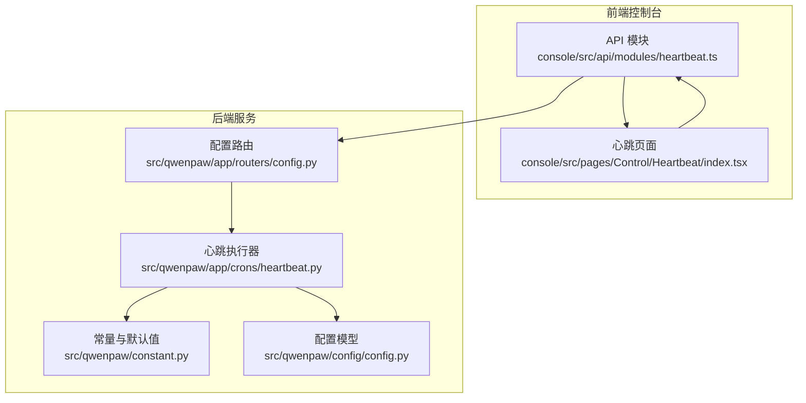
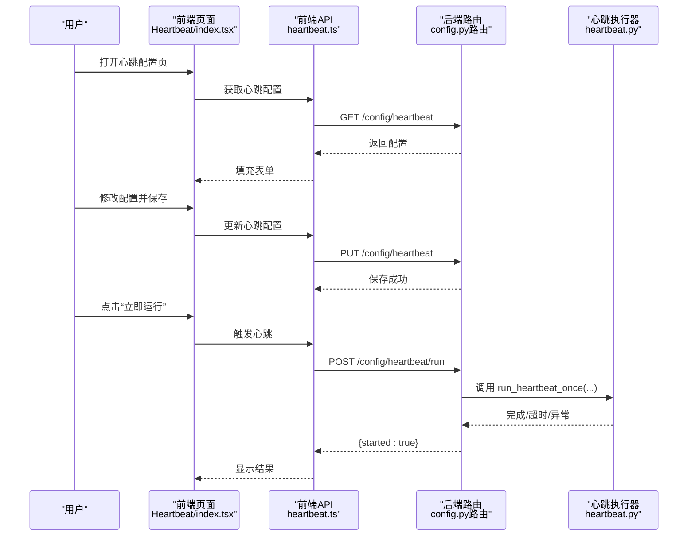
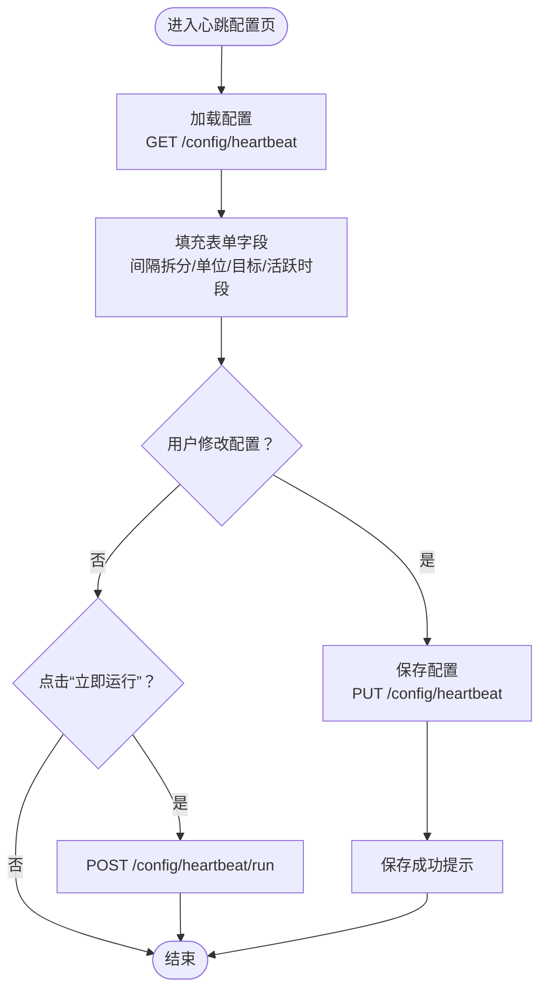
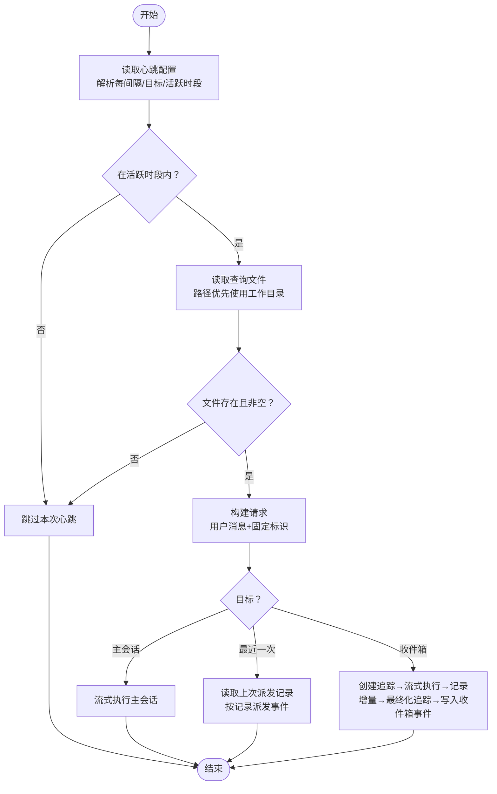
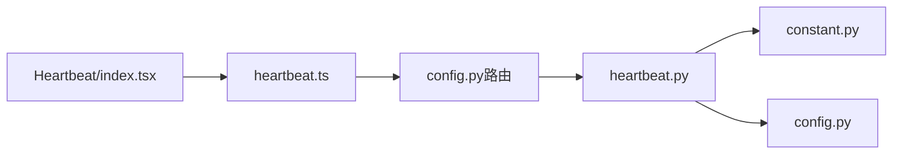

# 健康检查

<cite>
**本文引用的文件**
- [heartbeat.py](file://src/qwenpaw/app/crons/heartbeat.py)
- [heartbeat.ts](file://console/src/api/modules/heartbeat.ts)
- [heartbeat.ts（类型）](file://console/src/api/types/heartbeat.ts)
- [Heartbeat/index.tsx](file://console/src/pages/Control/Heartbeat/index.tsx)
- [constant.py](file://src/qwenpaw/constant.py)
- [config.py](file://src/qwenpaw/config/config.py)
- [config.py（路由）](file://src/qwenpaw/app/routers/config.py)
- [init_cmd.py](file://src/qwenpaw/cli/init_cmd.py)
- [heartbeat.en.md](file://website/public/docs/heartbeat.en.md)
- [heartbeat.zh.md](file://website/public/docs/heartbeat.zh.md)
</cite>

## 目录
1. [简介](#简介)
2. [项目结构](#项目结构)
3. [核心组件](#核心组件)
4. [架构总览](#架构总览)
5. [详细组件分析](#详细组件分析)
6. [依赖分析](#依赖分析)
7. [性能考虑](#性能考虑)
8. [故障排查指南](#故障排查指南)
9. [结论](#结论)
10. [附录](#附录)

## 简介
本技术文档围绕 QwenPaw 的健康检查系统展开，重点阐述心跳机制的实现原理、健康状态检测与故障自动恢复流程；覆盖应用启动时的自检程序、依赖服务可用性检查、关键组件状态监控；深入解析健康检查接口的实现、检查间隔配置与失败重试策略；并提供健康检查配置、自定义检查器开发与故障诊断的实用指南，以及健康状态报告、异常告警与系统恢复策略的技术实现。

## 项目结构
健康检查系统由三部分组成：
- 后端 Python 心跳执行器：负责按配置周期运行、读取查询文件、调度消息到目标通道或收件箱，并记录追踪与事件。
- 前端控制台：提供心跳配置界面与即时触发能力，支持启用/禁用、间隔设置、目标选择与活跃时段配置。
- 配置与常量：定义默认心跳文件名、默认间隔与目标、活跃时段校验逻辑等。

**图表来源**
- [heartbeat.ts:1-18](file://console/src/api/modules/heartbeat.ts#L1-L18)
- [Heartbeat/index.tsx:1-273](file://console/src/pages/Control/Heartbeat/index.tsx#L1-L273)
- [config.py（路由）:1-200](file://src/qwenpaw/app/routers/config.py#L1-L200)
- [heartbeat.py:1-379](file://src/qwenpaw/app/crons/heartbeat.py#L1-L379)
- [constant.py:181-186](file://src/qwenpaw/constant.py#L181-L186)
- [config.py:1-200](file://src/qwenpaw/config/config.py#L1-L200)

**章节来源**
- [heartbeat.ts:1-18](file://console/src/api/modules/heartbeat.ts#L1-L18)
- [Heartbeat/index.tsx:1-273](file://console/src/pages/Control/Heartbeat/index.tsx#L1-L273)
- [config.py（路由）:1-200](file://src/qwenpaw/app/routers/config.py#L1-L200)
- [heartbeat.py:1-379](file://src/qwenpaw/app/crons/heartbeat.py#L1-L379)
- [constant.py:181-186](file://src/qwenpaw/constant.py#L181-L186)
- [config.py:1-200](file://src/qwenpaw/config/config.py#L1-L200)

## 核心组件
- 前端心跳配置与触发
  - API 模块提供获取/更新心跳配置与立即运行心跳的请求封装。
  - 控制台页面负责表单渲染、字段拆分与合并、活跃时段联动显示、保存与错误提示。
- 后端心跳执行器
  - 解析“每间隔”字符串（支持 h/m/s 与 cron 表达式）、判断活跃时段、读取查询文件、构建请求、按目标执行（主会话、最近一次会话、收件箱），并记录追踪与事件。
- 配置与常量
  - 默认心跳文件名、默认间隔与目标、活跃时段校验、用户时区加载与容错。
- 路由与模型
  - FastAPI 路由暴露配置接口；配置模型中包含心跳配置类型，CLI 初始化时写入默认心跳配置与查询文件。

**章节来源**
- [heartbeat.ts:1-18](file://console/src/api/modules/heartbeat.ts#L1-L18)
- [Heartbeat/index.tsx:51-273](file://console/src/pages/Control/Heartbeat/index.tsx#L51-L273)
- [heartbeat.py:41-131](file://src/qwenpaw/app/crons/heartbeat.py#L41-L131)
- [constant.py:181-186](file://src/qwenpaw/constant.py#L181-L186)
- [config.py:1-200](file://src/qwenpaw/config/config.py#L1-L200)
- [config.py（路由）:1-200](file://src/qwenpaw/app/routers/config.py#L1-L200)
- [init_cmd.py:244-278](file://src/qwenpaw/cli/init_cmd.py#L244-L278)
- [init_cmd.py:483-522](file://src/qwenpaw/cli/init_cmd.py#L483-L522)

## 架构总览
心跳机制从控制台发起配置与触发请求，后端路由接收并调用心跳执行器，后者根据配置读取查询文件、构造消息并按目标进行分发或记录，同时生成追踪与收件箱事件，用于健康状态报告与异常告警。

**图表来源**
- [Heartbeat/index.tsx:80-139](file://console/src/pages/Control/Heartbeat/index.tsx#L80-L139)
- [heartbeat.ts:4-17](file://console/src/api/modules/heartbeat.ts#L4-L17)
- [config.py（路由）:1-200](file://src/qwenpaw/app/routers/config.py#L1-L200)
- [heartbeat.py:169-379](file://src/qwenpaw/app/crons/heartbeat.py#L169-L379)

## 详细组件分析

### 前端心跳配置与触发
- 表单设计
  - 字段：启用开关、间隔数值与单位（分钟/小时）、目标（主会话/最近一次/收件箱）、是否启用活跃时段、起止时间。
  - 字段拆分与合并：将“每间隔”字符串拆分为数字与单位，保存时序列化回字符串。
- 数据流
  - 加载：调用获取配置 API，填充表单初始值。
  - 保存：将表单值转换为后端期望的配置对象，调用更新配置 API。
  - 触发：调用“立即运行” API，后端执行一次心跳。
- 错误处理
  - 加载失败与保存失败均通过消息提示反馈。

**图表来源**
- [Heartbeat/index.tsx:80-139](file://console/src/pages/Control/Heartbeat/index.tsx#L80-L139)
- [heartbeat.ts:4-17](file://console/src/api/modules/heartbeat.ts#L4-L17)

**章节来源**
- [Heartbeat/index.tsx:51-273](file://console/src/pages/Control/Heartbeat/index.tsx#L51-L273)
- [heartbeat.ts:1-18](file://console/src/api/modules/heartbeat.ts#L1-L18)

### 后端心跳执行器
- 配置解析
  - “每间隔”解析：支持“NhMmSs”格式与空值，默认 30 分钟；cron 表达式单独识别与规范化。
  - 活跃时段校验：基于用户时区判断当前时间是否在 [start, end] 区间内，时区无效时回退至 UTC。
- 查询文件与请求构建
  - 读取工作空间中的默认心跳文件（可被传入的工作目录覆盖）；若文件不存在或为空则跳过。
  - 构造单条用户消息请求，固定会话/用户/渠道标识。
- 目标分发
  - 主会话：直接流式执行，不派发。
  - 最近一次：从配置中读取上次派发记录，按其通道/用户/会话派发事件，带超时保护。
  - 收件箱：创建追踪、流式执行、记录增量、最终化追踪并写入收件箱事件（成功/超时/异常）。
- 超时与异常
  - 统一超时上限（秒级），超时与异常均记录追踪并写入收件箱事件，便于告警与诊断。

**图表来源**
- [heartbeat.py:73-131](file://src/qwenpaw/app/crons/heartbeat.py#L73-L131)
- [heartbeat.py:169-379](file://src/qwenpaw/app/crons/heartbeat.py#L169-L379)

**章节来源**
- [heartbeat.py:41-131](file://src/qwenpaw/app/crons/heartbeat.py#L41-L131)
- [heartbeat.py:169-379](file://src/qwenpaw/app/crons/heartbeat.py#L169-L379)

### 配置与常量
- 默认值与键名
  - 心跳文件名、默认每间隔、默认目标（主会话/最近一次/收件箱）。
- 用户时区与活跃时段
  - 从全局配置加载用户时区，无效时回退；活跃时段边界处理跨午夜场景。
- CLI 初始化
  - 在首次初始化时写入默认心跳配置与查询文件，支持交互编辑或使用默认内容。

**章节来源**
- [constant.py:181-186](file://src/qwenpaw/constant.py#L181-L186)
- [heartbeat.py:95-131](file://src/qwenpaw/app/crons/heartbeat.py#L95-L131)
- [init_cmd.py:244-278](file://src/qwenpaw/cli/init_cmd.py#L244-L278)
- [init_cmd.py:483-522](file://src/qwenpaw/cli/init_cmd.py#L483-L522)

### 路由与模型
- 路由
  - 提供获取/更新心跳配置的接口；提供“立即运行”的触发端点。
- 模型
  - 配置模型中包含心跳配置类型，CLI 初始化时写入默认心跳配置。
- 文档
  - 官方文档提供心跳功能的使用说明与最佳实践。

**章节来源**
- [config.py（路由）:1-200](file://src/qwenpaw/app/routers/config.py#L1-L200)
- [config.py:1-200](file://src/qwenpaw/config/config.py#L1-L200)
- [heartbeat.en.md](file://website/public/docs/heartbeat.en.md)
- [heartbeat.zh.md](file://website/public/docs/heartbeat.zh.md)

## 依赖分析
- 前端依赖
  - API 模块依赖通用请求封装；页面依赖表单、国际化与消息提示。
- 后端依赖
  - 心跳执行器依赖配置加载函数、文件读取工具、通道管理器、收件箱与追踪存储。
  - 配置与常量提供默认值与解析规则；路由承载对外接口。

**图表来源**
- [Heartbeat/index.tsx:1-273](file://console/src/pages/Control/Heartbeat/index.tsx#L1-L273)
- [heartbeat.ts:1-18](file://console/src/api/modules/heartbeat.ts#L1-L18)
- [config.py（路由）:1-200](file://src/qwenpaw/app/routers/config.py#L1-L200)
- [heartbeat.py:1-379](file://src/qwenpaw/app/crons/heartbeat.py#L1-L379)
- [constant.py:181-186](file://src/qwenpaw/constant.py#L181-L186)
- [config.py:1-200](file://src/qwenpaw/config/config.py#L1-L200)

**章节来源**
- [Heartbeat/index.tsx:1-273](file://console/src/pages/Control/Heartbeat/index.tsx#L1-L273)
- [heartbeat.ts:1-18](file://console/src/api/modules/heartbeat.ts#L1-L18)
- [config.py（路由）:1-200](file://src/qwenpaw/app/routers/config.py#L1-L200)
- [heartbeat.py:1-379](file://src/qwenpaw/app/crons/heartbeat.py#L1-L379)
- [constant.py:181-186](file://src/qwenpaw/constant.py#L181-L186)
- [config.py:1-200](file://src/qwenpaw/config/config.py#L1-L200)

## 性能考虑
- 超时控制
  - 心跳执行统一超时上限，避免长时间阻塞；超时与异常均记录追踪，便于快速定位。
- 并发与资源
  - 流式执行避免一次性占用过多内存；按目标分发时对最近一次派发进行超时保护。
- 配置解析
  - “每间隔”解析与活跃时段校验为轻量计算，对性能影响可忽略。
- I/O 与文件
  - 查询文件读取为本地磁盘操作，建议保持文件较小以减少读取耗时。

[本节为通用指导，无需特定文件来源]

## 故障排查指南
- 常见问题与定位
  - 未生成心跳文件：确认工作空间中存在默认心跳文件；检查文件权限与编码。
  - 目标为“最近一次”但未派发：检查上次派发记录是否存在且包含有效通道/用户/会话信息。
  - 收件箱未出现结果：查看追踪是否创建与最终化，确认流式执行是否抛出异常。
  - 活跃时段不生效：检查用户时区配置与活跃时段边界；时区无效时会回退至 UTC。
- 告警与日志
  - 超时与异常均写入收件箱事件并记录追踪；可通过收件箱查看“心跳超时/错误”事件详情。
- 自检与修复
  - 使用“立即运行”触发一次心跳，观察返回状态与收件箱事件。
  - 检查配置接口返回值与保存结果，确保配置正确持久化。

**章节来源**
- [heartbeat.py:255-368](file://src/qwenpaw/app/crons/heartbeat.py#L255-L368)
- [heartbeat.py:95-131](file://src/qwenpaw/app/crons/heartbeat.py#L95-L131)

## 结论
QwenPaw 的健康检查系统通过“查询文件驱动的心跳任务”，结合灵活的目标分发与活跃时段控制，实现了稳定可靠的自检与状态报告能力。前端提供直观的配置界面与即时触发，后端以超时与追踪保障可观测性与可恢复性。通过合理的配置与监控，系统能够在异常发生时及时告警并在可控时间内完成恢复。

[本节为总结，无需特定文件来源]

## 附录

### 健康检查配置项说明
- enabled：是否启用心跳
- every：心跳间隔，支持“NhMmSs”格式与 cron 表达式
- target：目标（main/last/inbox）
- activeHours：活跃时段（start/end）

**章节来源**
- [heartbeat.ts（类型）:1-12](file://console/src/api/types/heartbeat.ts#L1-L12)
- [Heartbeat/index.tsx:51-273](file://console/src/pages/Control/Heartbeat/index.tsx#L51-L273)

### 自定义检查器开发指南
- 基于现有模式扩展
  - 参考心跳执行器的解析与分发模式，新增检查器时应提供：
    - 配置解析（间隔/目标/条件）
    - 查询构建（输入消息/上下文）
    - 目标分发（主会话/最近一次/收件箱）
    - 追踪与事件记录（成功/超时/异常）
- 接口与路由
  - 新增配置接口与“立即运行”触发端点，遵循现有路由命名与响应格式。
- 前端集成
  - 在控制台新增配置页或复用现有表单组件，确保字段映射与保存流程一致。

**章节来源**
- [heartbeat.py:73-131](file://src/qwenpaw/app/crons/heartbeat.py#L73-L131)
- [heartbeat.py:169-379](file://src/qwenpaw/app/crons/heartbeat.py#L169-L379)
- [config.py（路由）:1-200](file://src/qwenpaw/app/routers/config.py#L1-L200)