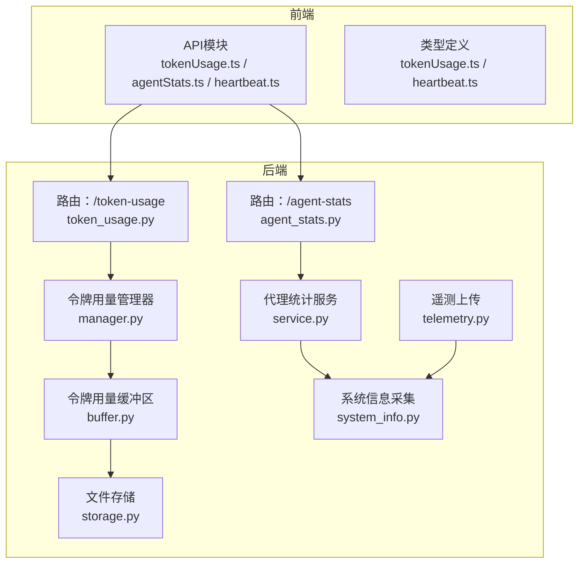
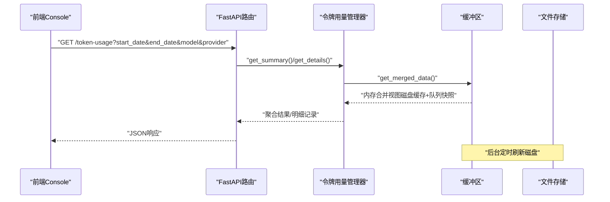
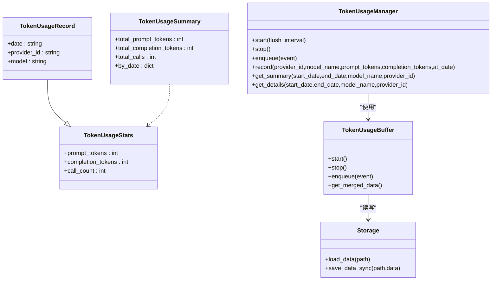
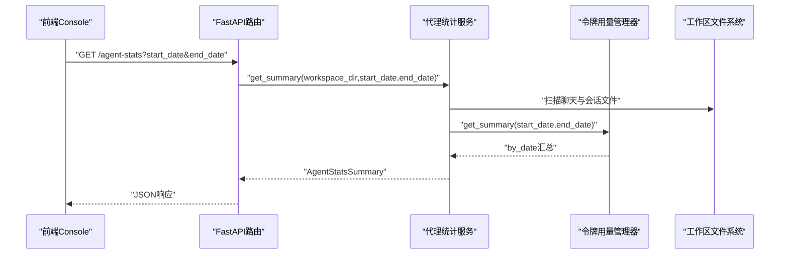
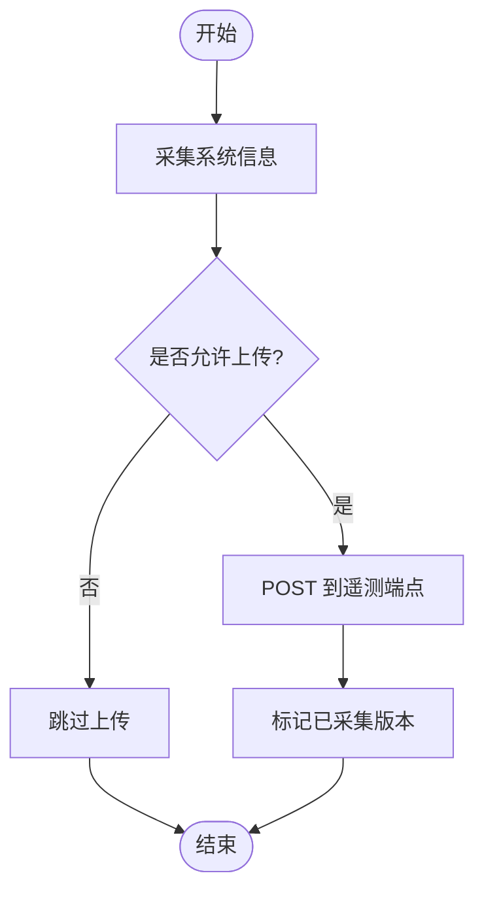
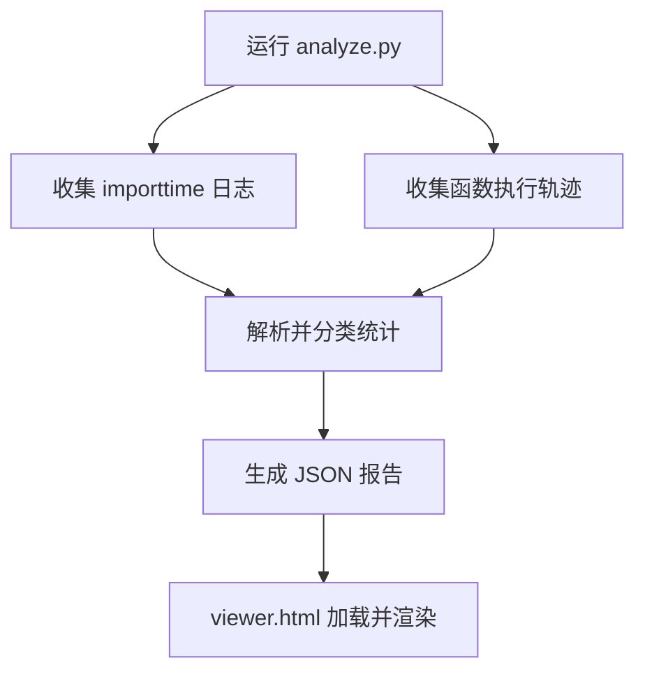
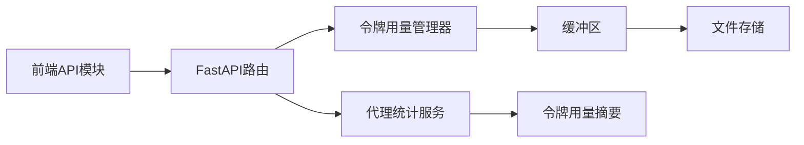

# 性能监控

<cite>
**本文引用的文件**
- [src/qwenpaw/token_usage/__init__.py](file://src/qwenpaw/token_usage/__init__.py)
- [src/qwenpaw/token_usage/manager.py](file://src/qwenpaw/token_usage/manager.py)
- [src/qwenpaw/token_usage/buffer.py](file://src/qwenpaw/token_usage/buffer.py)
- [src/qwenpaw/token_usage/storage.py](file://src/qwenpaw/token_usage/storage.py)
- [src/qwenpaw/app/routers/token_usage.py](file://src/qwenpaw/app/routers/token_usage.py)
- [console/src/api/modules/tokenUsage.ts](file://console/src/api/modules/tokenUsage.ts)
- [console/src/api/types/tokenUsage.ts](file://console/src/api/types/tokenUsage.ts)
- [src/qwenpaw/agent_stats/models.py](file://src/qwenpaw/agent_stats/models.py)
- [src/qwenpaw/agent_stats/service.py](file://src/qwenpaw/agent_stats/service.py)
- [src/qwenpaw/app/routers/agent_stats.py](file://src/qwenpaw/app/routers/agent_stats.py)
- [console/src/api/modules/agentStats.ts](file://console/src/api/modules/agentStats.ts)
- [src/qwenpaw/utils/telemetry.py](file://src/qwenpaw/utils/telemetry.py)
- [src/qwenpaw/utils/system_info.py](file://src/qwenpaw/utils/system_info.py)
- [scripts/startup_profile/analyze.py](file://scripts/startup_profile/analyze.py)
- [scripts/startup_profile/tracer.py](file://scripts/startup_profile/tracer.py)
- [scripts/startup_profile/viewer.html](file://scripts/startup_profile/viewer.html)
- [src/qwenpaw/app/routers/heartbeat.py](file://src/qwenpaw/app/routers/heartbeat.py)
- [console/src/api/modules/heartbeat.ts](file://console/src/api/modules/heartbeat.ts)
- [console/src/api/types/heartbeat.ts](file://console/src/api/types/heartbeat.ts)
</cite>

## 目录
1. [简介](#简介)
2. [项目结构](#项目结构)
3. [核心组件](#核心组件)
4. [架构总览](#架构总览)
5. [详细组件分析](#详细组件分析)
6. [依赖分析](#依赖分析)
7. [性能考量](#性能考量)
8. [故障排查指南](#故障排查指南)
9. [结论](#结论)
10. [附录](#附录)

## 简介
本技术文档面向QwenPaw的性能监控体系，系统性阐述遥测数据收集机制、令牌使用统计与性能指标跟踪的实现方式。重点覆盖以下方面：
- 令牌使用量的计算逻辑、存储策略与查询接口
- 性能监控数据的采集频率、存储格式与分析方法
- 启动性能分析工具链与可视化
- 基于现有接口的性能基准测试、瓶颈识别与优化建议
- 监控数据可视化、告警阈值设置与性能报告生成的实践路径

## 项目结构
QwenPaw的性能监控由“后端数据采集与聚合”“前端查询与展示”“启动性能分析工具”三部分构成：
- 后端：令牌用量管理器与缓冲区负责异步写入与合并；代理统计服务整合会话与消息数据；FastAPI路由提供查询接口。
- 前端：Console通过API模块调用后端接口，类型定义保证前后端契约一致。
- 工具链：启动性能分析脚本与可视化页面用于定位启动阶段的性能瓶颈。

图表来源
- [src/qwenpaw/app/routers/token_usage.py:1-107](file://src/qwenpaw/app/routers/token_usage.py#L1-L107)
- [src/qwenpaw/app/routers/agent_stats.py:1-55](file://src/qwenpaw/app/routers/agent_stats.py#L1-L55)
- [src/qwenpaw/token_usage/manager.py:61-285](file://src/qwenpaw/token_usage/manager.py#L61-L285)
- [src/qwenpaw/token_usage/buffer.py:29-210](file://src/qwenpaw/token_usage/buffer.py#L29-L210)
- [src/qwenpaw/token_usage/storage.py:15-66](file://src/qwenpaw/token_usage/storage.py#L15-L66)
- [src/qwenpaw/agent_stats/service.py:180-375](file://src/qwenpaw/agent_stats/service.py#L180-L375)
- [src/qwenpaw/utils/system_info.py:135-144](file://src/qwenpaw/utils/system_info.py#L135-L144)
- [src/qwenpaw/utils/telemetry.py:286-304](file://src/qwenpaw/utils/telemetry.py#L286-L304)

章节来源
- [src/qwenpaw/app/routers/token_usage.py:1-107](file://src/qwenpaw/app/routers/token_usage.py#L1-L107)
- [src/qwenpaw/app/routers/agent_stats.py:1-55](file://src/qwenpaw/app/routers/agent_stats.py#L1-L55)
- [src/qwenpaw/token_usage/__init__.py:1-23](file://src/qwenpaw/token_usage/__init__.py#L1-L23)

## 核心组件
- 令牌用量管理器与缓冲区：在事件驱动模型下，以异步消费者-生产者模式累积令牌用量，并周期性落盘，支持实时合并视图。
- 代理统计服务：基于工作区会话与聊天数据，统计每日活跃会话、消息数、工具调用次数与LLM调用次数，并与令牌用量汇总。
- FastAPI路由：提供令牌用量与代理统计的聚合与明细查询接口。
- 前端API模块与类型：统一查询参数与返回结构，支持按日期范围、模型与提供商过滤。
- 遥测与系统信息：采集系统硬件与运行环境信息，支持可选上传。
- 启动性能分析工具：导入耗时与函数执行轨迹分析，配合可视化页面定位热点。

章节来源
- [src/qwenpaw/token_usage/manager.py:61-285](file://src/qwenpaw/token_usage/manager.py#L61-L285)
- [src/qwenpaw/token_usage/buffer.py:29-210](file://src/qwenpaw/token_usage/buffer.py#L29-L210)
- [src/qwenpaw/agent_stats/service.py:180-375](file://src/qwenpaw/agent_stats/service.py#L180-L375)
- [src/qwenpaw/app/routers/token_usage.py:27-107](file://src/qwenpaw/app/routers/token_usage.py#L27-L107)
- [src/qwenpaw/app/routers/agent_stats.py:25-55](file://src/qwenpaw/app/routers/agent_stats.py#L25-L55)
- [console/src/api/modules/tokenUsage.ts:1-29](file://console/src/api/modules/tokenUsage.ts#L1-L29)
- [console/src/api/types/tokenUsage.ts:1-26](file://console/src/api/types/tokenUsage.ts#L1-L26)
- [src/qwenpaw/utils/telemetry.py:286-304](file://src/qwenpaw/utils/telemetry.py#L286-L304)
- [src/qwenpaw/utils/system_info.py:135-144](file://src/qwenpaw/utils/system_info.py#L135-L144)
- [scripts/startup_profile/analyze.py:1-198](file://scripts/startup_profile/analyze.py#L1-L198)

## 架构总览
下图展示了从API请求到数据落盘与查询返回的关键流程，以及前端与后端的交互契约。

图表来源
- [src/qwenpaw/app/routers/token_usage.py:27-107](file://src/qwenpaw/app/routers/token_usage.py#L27-L107)
- [src/qwenpaw/token_usage/manager.py:173-271](file://src/qwenpaw/token_usage/manager.py#L173-L271)
- [src/qwenpaw/token_usage/buffer.py:102-122](file://src/qwenpaw/token_usage/buffer.py#L102-L122)
- [src/qwenpaw/token_usage/storage.py:15-66](file://src/qwenpaw/token_usage/storage.py#L15-L66)

## 详细组件分析

### 令牌用量统计与查询
- 数据模型
  - 聚合计数项：提示词令牌、补全令牌、调用次数
  - 记录维度：按日期（YYYY-MM-DD）、提供商ID、模型名
  - 汇总结构：包含总量与按日期的聚合
- 写入与合并
  - 生产者将事件入队，消费者逐条应用到内存缓存，标记脏页
  - 定时任务周期性将内存快照原子写入磁盘
  - 查询时先合并磁盘缓存与队列快照，再按日期范围与过滤条件筛选
- 接口设计
  - 聚合接口：返回按日期聚合的摘要
  - 明细接口：返回原始记录，便于前端二次聚合与可视化

图表来源
- [src/qwenpaw/token_usage/manager.py:19-285](file://src/qwenpaw/token_usage/manager.py#L19-L285)
- [src/qwenpaw/token_usage/buffer.py:29-210](file://src/qwenpaw/token_usage/buffer.py#L29-L210)
- [src/qwenpaw/token_usage/storage.py:15-66](file://src/qwenpaw/token_usage/storage.py#L15-L66)

章节来源
- [src/qwenpaw/token_usage/manager.py:61-285](file://src/qwenpaw/token_usage/manager.py#L61-L285)
- [src/qwenpaw/token_usage/buffer.py:29-210](file://src/qwenpaw/token_usage/buffer.py#L29-L210)
- [src/qwenpaw/token_usage/storage.py:15-66](file://src/qwenpaw/token_usage/storage.py#L15-L66)
- [src/qwenpaw/app/routers/token_usage.py:27-107](file://src/qwenpaw/app/routers/token_usage.py#L27-L107)
- [console/src/api/modules/tokenUsage.ts:1-29](file://console/src/api/modules/tokenUsage.ts#L1-L29)
- [console/src/api/types/tokenUsage.ts:1-26](file://console/src/api/types/tokenUsage.ts#L1-L26)

### 代理统计与令牌用量融合
- 统计范围：工作区聊天与会话目录，按日期聚合
- 指标维度：每日对话数、活跃会话、用户/助手消息数、工具调用数、LLM调用数、令牌用量
- 融合策略：拉取令牌用量摘要，按日期映射到日级统计

图表来源
- [src/qwenpaw/app/routers/agent_stats.py:25-55](file://src/qwenpaw/app/routers/agent_stats.py#L25-L55)
- [src/qwenpaw/agent_stats/service.py:180-375](file://src/qwenpaw/agent_stats/service.py#L180-L375)
- [src/qwenpaw/token_usage/manager.py:173-236](file://src/qwenpaw/token_usage/manager.py#L173-L236)

章节来源
- [src/qwenpaw/agent_stats/models.py:9-43](file://src/qwenpaw/agent_stats/models.py#L9-L43)
- [src/qwenpaw/agent_stats/service.py:180-375](file://src/qwenpaw/agent_stats/service.py#L180-L375)
- [src/qwenpaw/app/routers/agent_stats.py:25-55](file://src/qwenpaw/app/routers/agent_stats.py#L25-L55)
- [console/src/api/modules/agentStats.ts:1-16](file://console/src/api/modules/agentStats.ts#L1-L16)

### 遥测与系统信息
- 遥测采集：收集系统信息（操作系统、架构、CUDA版本、内存与显存），支持可选上传与去重标记
- 系统信息：跨平台获取内存大小、CUDA版本与显存容量，作为性能基线参考

图表来源
- [src/qwenpaw/utils/telemetry.py:286-304](file://src/qwenpaw/utils/telemetry.py#L286-L304)
- [src/qwenpaw/utils/system_info.py:135-144](file://src/qwenpaw/utils/system_info.py#L135-L144)

章节来源
- [src/qwenpaw/utils/telemetry.py:163-304](file://src/qwenpaw/utils/telemetry.py#L163-L304)
- [src/qwenpaw/utils/system_info.py:135-144](file://src/qwenpaw/utils/system_info.py#L135-L144)

### 启动性能分析与可视化
- 分析器：使用Python importtime与自定义tracer收集导入耗时与函数调用轨迹
- 可视化：HTML页面解析JSON输出，支持排序、搜索与性能等级标注
- 使用建议：多轮运行取均值，保存output目录对比优化前后的差异

图表来源
- [scripts/startup_profile/analyze.py:17-198](file://scripts/startup_profile/analyze.py#L17-L198)
- [scripts/startup_profile/tracer.py:110-176](file://scripts/startup_profile/tracer.py#L110-L176)
- [scripts/startup_profile/viewer.html:1007-1112](file://scripts/startup_profile/viewer.html#L1007-L1112)

章节来源
- [scripts/startup_profile/analyze.py:1-198](file://scripts/startup_profile/analyze.py#L1-L198)
- [scripts/startup_profile/tracer.py:110-176](file://scripts/startup_profile/tracer.py#L110-L176)
- [scripts/startup_profile/viewer.html:1007-1112](file://scripts/startup_profile/viewer.html#L1007-L1112)

## 依赖分析
- 组件内聚与耦合
  - 令牌用量模块内部高内聚：管理器协调缓冲区与存储，职责清晰
  - 代理统计服务依赖令牌用量管理器进行数据融合，耦合点明确
- 外部依赖
  - aiofiles/orjson用于异步文件读写与JSON处理
  - FastAPI路由层提供REST接口，前端通过API模块消费
- 潜在风险
  - 缓冲区满时丢弃事件的日志警告需关注
  - 文件写入失败的降级与清理逻辑需确保一致性

图表来源
- [src/qwenpaw/app/routers/token_usage.py:1-107](file://src/qwenpaw/app/routers/token_usage.py#L1-L107)
- [src/qwenpaw/app/routers/agent_stats.py:1-55](file://src/qwenpaw/app/routers/agent_stats.py#L1-L55)
- [src/qwenpaw/token_usage/manager.py:61-285](file://src/qwenpaw/token_usage/manager.py#L61-L285)
- [src/qwenpaw/agent_stats/service.py:180-375](file://src/qwenpaw/agent_stats/service.py#L180-L375)

章节来源
- [src/qwenpaw/token_usage/manager.py:61-285](file://src/qwenpaw/token_usage/manager.py#L61-L285)
- [src/qwenpaw/agent_stats/service.py:180-375](file://src/qwenpaw/agent_stats/service.py#L180-L375)

## 性能考量
- 采集频率与刷新策略
  - 默认刷新间隔为固定秒数，可通过管理器启动参数调整
  - 建议在高并发场景适当缩短刷新间隔，降低丢失风险
- 存储格式与一致性
  - 使用原子写（临时文件+替换）避免部分写入导致的数据损坏
  - 合并视图采用深拷贝，避免读写竞争
- 查询复杂度
  - 查询过程对合并后的字典进行线性遍历，时间复杂度与记录数量近似线性
  - 建议前端侧做二次聚合或分页，减少单次传输体积
- I/O与并发
  - 写入在独立线程执行，避免阻塞事件循环
  - 会话扫描使用信号量限制并发文件描述符占用

章节来源
- [src/qwenpaw/token_usage/buffer.py:50-90](file://src/qwenpaw/token_usage/buffer.py#L50-L90)
- [src/qwenpaw/token_usage/storage.py:35-66](file://src/qwenpaw/token_usage/storage.py#L35-L66)
- [src/qwenpaw/agent_stats/service.py:257-317](file://src/qwenpaw/agent_stats/service.py#L257-L317)

## 故障排查指南
- 令牌用量未更新
  - 检查管理器是否已启动与刷新任务是否运行
  - 查看缓冲区队列是否积压或被丢弃
- 查询结果为空
  - 确认日期范围与过滤条件是否正确
  - 核对工作区目录是否存在且可读
- 写入失败
  - 关注存储模块的异常日志与临时文件清理
- 启动缓慢
  - 使用启动性能分析工具收集importtime与函数轨迹，定位热点模块
  - 对比多次运行结果，剔除系统抖动影响

章节来源
- [src/qwenpaw/token_usage/buffer.py:91-101](file://src/qwenpaw/token_usage/buffer.py#L91-L101)
- [src/qwenpaw/token_usage/storage.py:48-60](file://src/qwenpaw/token_usage/storage.py#L48-L60)
- [scripts/startup_profile/analyze.py:17-198](file://scripts/startup_profile/analyze.py#L17-L198)

## 结论
QwenPaw的性能监控体系以事件驱动的令牌用量缓冲区为核心，结合代理统计服务与REST接口，形成从前端查询到后端聚合的完整闭环。配合启动性能分析工具与遥测系统，能够有效支撑性能基准测试、瓶颈识别与持续优化。建议在生产环境中合理配置刷新间隔、关注I/O降级与日志告警，并利用前端二次聚合与可视化工具提升可观测性与可维护性。

## 附录
- 心跳监控（可选）
  - 后端提供心跳配置的查询与更新接口，前端通过API模块访问
  - 支持启用/禁用、周期与目标地址配置，以及活跃时段控制

章节来源
- [src/qwenpaw/app/routers/heartbeat.py](file://src/qwenpaw/app/routers/heartbeat.py)
- [console/src/api/modules/heartbeat.ts:1-17](file://console/src/api/modules/heartbeat.ts#L1-L17)
- [console/src/api/types/heartbeat.ts:1-11](file://console/src/api/types/heartbeat.ts#L1-L11)