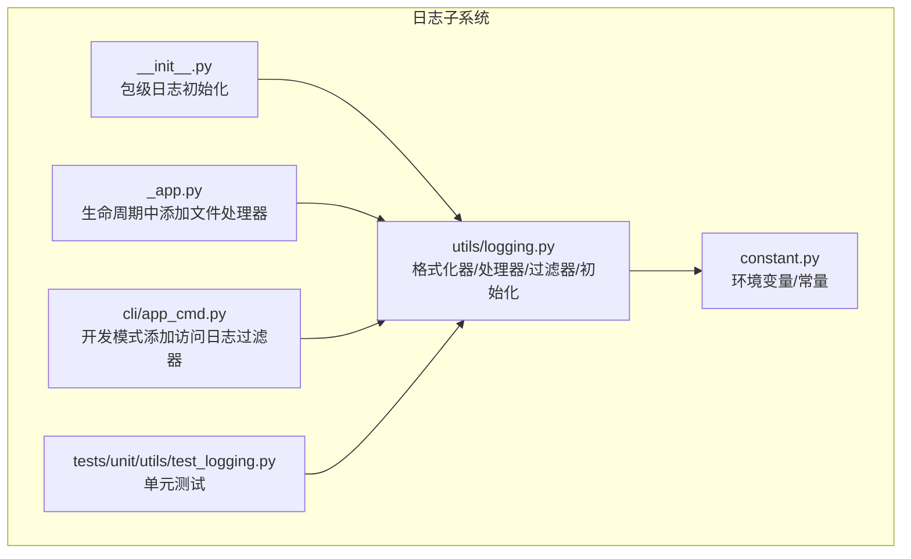
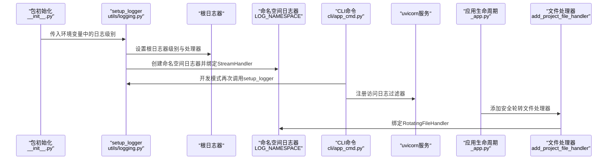
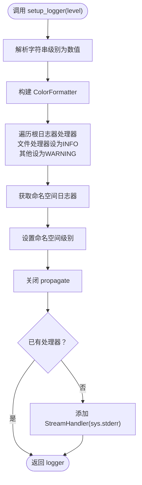
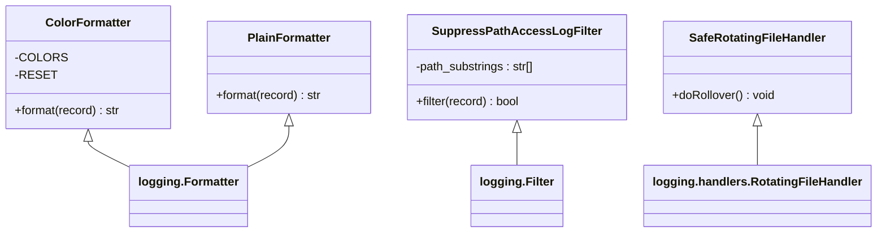
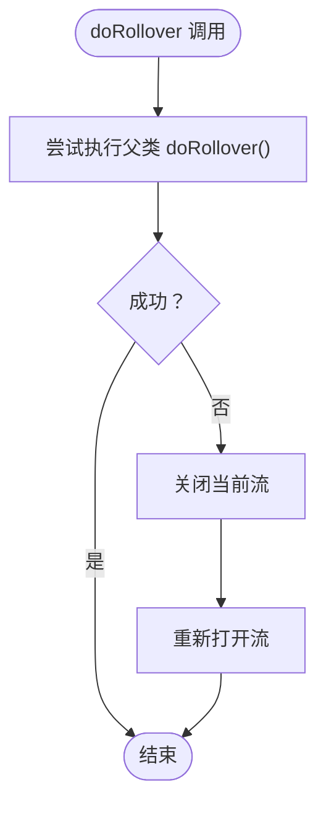
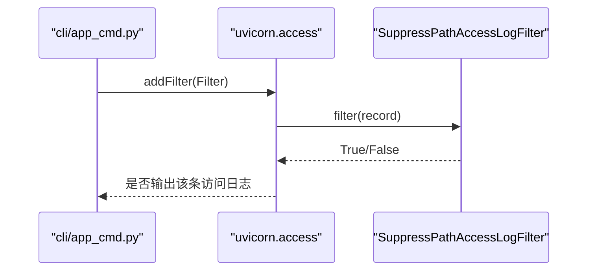
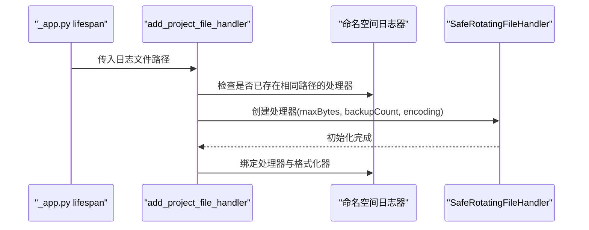
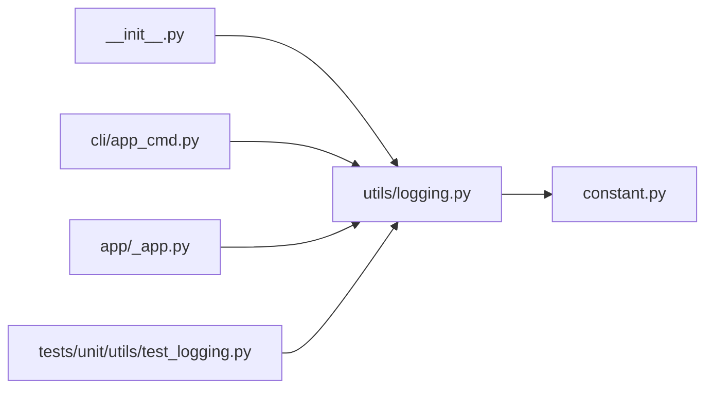

# 日志系统

<cite>
**本文引用的文件**
- [src/qwenpaw/utils/logging.py](file://src/qwenpaw/utils/logging.py)
- [src/qwenpaw/__init__.py](file://src/qwenpaw/__init__.py)
- [src/qwenpaw/app/_app.py](file://src/qwenpaw/app/_app.py)
- [src/qwenpaw/cli/app_cmd.py](file://src/qwenpaw/cli/app_cmd.py)
- [src/qwenpaw/constant.py](file://src/qwenpaw/constant.py)
- [tests/unit/utils/test_logging.py](file://tests/unit/utils/test_logging.py)
</cite>

## 目录
1. [简介](#简介)
2. [项目结构](#项目结构)
3. [核心组件](#核心组件)
4. [架构总览](#架构总览)
5. [详细组件分析](#详细组件分析)
6. [依赖关系分析](#依赖关系分析)
7. [性能考虑](#性能考虑)
8. [故障排除指南](#故障排除指南)
9. [结论](#结论)
10. [附录](#附录)

## 简介
本文件面向QwenPaw的日志系统，提供从架构到实现细节的完整技术文档。内容涵盖：
- 日志配置架构与命名空间隔离
- 日志级别映射与环境变量驱动
- 彩色日志输出与路径相对化显示
- 跨平台兼容性（含Windows ANSI支持）
- 安全轮转文件处理器（_SafeRotatingFileHandler）与Windows文件锁定容错
- 日志文件轮转配置、日志级别过滤与第三方库日志抑制
- 最佳实践、性能优化与故障排除

## 项目结构
日志系统主要由以下模块构成：
- 核心日志模块：负责格式化器、处理器、根日志器抑制与命名空间隔离
- 应用入口：在应用启动时初始化日志器
- CLI命令：在开发模式下动态添加访问日志过滤器
- 常量模块：提供工作目录与日志级别环境变量键名
- 单元测试：覆盖关键行为与边界条件

图表来源
- [src/qwenpaw/utils/logging.py:1-226](file://src/qwenpaw/utils/logging.py#L1-L226)
- [src/qwenpaw/__init__.py:1-33](file://src/qwenpaw/__init__.py#L1-L33)
- [src/qwenpaw/app/_app.py:220-226](file://src/qwenpaw/app/_app.py#L220-L226)
- [src/qwenpaw/cli/app_cmd.py:80-112](file://src/qwenpaw/cli/app_cmd.py#L80-L112)
- [src/qwenpaw/constant.py:194-196](file://src/qwenpaw/constant.py#L194-L196)
- [tests/unit/utils/test_logging.py:1-246](file://tests/unit/utils/test_logging.py#L1-L246)

章节来源
- [src/qwenpaw/utils/logging.py:1-226](file://src/qwenpaw/utils/logging.py#L1-L226)
- [src/qwenpaw/__init__.py:1-33](file://src/qwenpaw/__init__.py#L1-L33)
- [src/qwenpaw/app/_app.py:220-226](file://src/qwenpaw/app/_app.py#L220-L226)
- [src/qwenpaw/cli/app_cmd.py:80-112](file://src/qwenpaw/cli/app_cmd.py#L80-L112)
- [src/qwenpaw/constant.py:194-196](file://src/qwenpaw/constant.py#L194-L196)
- [tests/unit/utils/test_logging.py:1-246](file://tests/unit/utils/test_logging.py#L1-L246)

## 核心组件
- 日志命名空间与基础常量
  - 使用项目名小写作为命名空间，确保仅输出本项目的日志，避免第三方库噪声。
  - 提供标准日志文件名与默认路径（工作目录下）。
- 日志级别映射
  - 支持字符串级别（如“debug”、“info”等）到数值级别的转换。
- 彩色控制台格式化器（ColorFormatter）
  - 按日志级别着色，自动检测TTY以决定是否启用ANSI颜色。
  - 将记录的文件路径转换为相对于当前工作目录的相对路径，提升可读性。
- 平面格式化器（PlainFormatter）
  - 用于文件输出，包含时间戳、级别、源文件与行号、消息及异常栈信息。
- 安全轮转文件处理器（_SafeRotatingFileHandler）
  - 在Windows上捕获因文件锁定导致的权限错误，自动重新打开流并延迟轮转，保证日志不丢失。
- 访问日志过滤器（SuppressPathAccessLogFilter）
  - 针对uvicorn访问日志，按路径子串进行过滤，支持空列表放行所有。
- 初始化函数
  - setup_logger：设置根日志器级别与处理器，创建命名空间下的logger并绑定StreamHandler。
  - add_project_file_handler：为守护进程或后台任务添加安全轮转文件处理器。

章节来源
- [src/qwenpaw/utils/logging.py:18-31](file://src/qwenpaw/utils/logging.py#L18-L31)
- [src/qwenpaw/utils/logging.py:18-24](file://src/qwenpaw/utils/logging.py#L18-L24)
- [src/qwenpaw/utils/logging.py:55-86](file://src/qwenpaw/utils/logging.py#L55-L86)
- [src/qwenpaw/utils/logging.py:108-129](file://src/qwenpaw/utils/logging.py#L108-L129)
- [src/qwenpaw/utils/logging.py:88-106](file://src/qwenpaw/utils/logging.py#L88-L106)
- [src/qwenpaw/utils/logging.py:132-152](file://src/qwenpaw/utils/logging.py#L132-L152)
- [src/qwenpaw/utils/logging.py:154-188](file://src/qwenpaw/utils/logging.py#L154-L188)
- [src/qwenpaw/utils/logging.py:191-226](file://src/qwenpaw/utils/logging.py#L191-L226)

## 架构总览
日志系统通过“包级初始化 + 生命周期注入”的方式，确保：
- 启动阶段统一设置日志级别与格式
- 开发模式下可按需抑制特定访问路径的uvicorn日志
- 生产/守护场景下自动启用安全轮转文件处理器

图表来源
- [src/qwenpaw/__init__.py:22-32](file://src/qwenpaw/__init__.py#L22-L32)
- [src/qwenpaw/utils/logging.py:154-188](file://src/qwenpaw/utils/logging.py#L154-L188)
- [src/qwenpaw/cli/app_cmd.py:92-102](file://src/qwenpaw/cli/app_cmd.py#L92-L102)
- [src/qwenpaw/app/_app.py:224-226](file://src/qwenpaw/app/_app.py#L224-L226)

## 详细组件分析

### 组件A：日志命名空间与初始化
- 命名空间隔离
  - 仅向命名空间日志器输出应用日志，避免第三方库噪声。
- 根日志器抑制
  - 对文件处理器设置较高阈值，对非文件处理器设置警告阈值，降低噪音。
- 返回可复用的logger实例，便于后续添加文件处理器。

图表来源
- [src/qwenpaw/utils/logging.py:154-188](file://src/qwenpaw/utils/logging.py#L154-L188)

章节来源
- [src/qwenpaw/utils/logging.py:154-188](file://src/qwenpaw/utils/logging.py#L154-L188)
- [tests/unit/utils/test_logging.py:143-181](file://tests/unit/utils/test_logging.py#L143-L181)

### 组件B：彩色日志输出与路径相对化
- 彩色输出
  - 依据日志级别映射ANSI颜色；当stderr非TTY时禁用颜色，避免管道/重定向污染。
- 路径相对化
  - 若记录文件位于当前工作目录之下，则转换为相对路径；不同盘符（Windows）不比较路径前缀。
- 输出格式
  - 控制台：级别+相对路径+行号+消息
  - 文件：时间戳+级别+相对路径+行号+消息，包含异常栈与堆栈信息

图表来源
- [src/qwenpaw/utils/logging.py:55-86](file://src/qwenpaw/utils/logging.py#L55-L86)
- [src/qwenpaw/utils/logging.py:108-129](file://src/qwenpaw/utils/logging.py#L108-L129)
- [src/qwenpaw/utils/logging.py:132-152](file://src/qwenpaw/utils/logging.py#L132-L152)
- [src/qwenpaw/utils/logging.py:88-106](file://src/qwenpaw/utils/logging.py#L88-L106)

章节来源
- [src/qwenpaw/utils/logging.py:55-86](file://src/qwenpaw/utils/logging.py#L55-L86)
- [src/qwenpaw/utils/logging.py:108-129](file://src/qwenpaw/utils/logging.py#L108-L129)
- [tests/unit/utils/test_logging.py:47-109](file://tests/unit/utils/test_logging.py#L47-L109)

### 组件C：安全轮转文件处理器（Windows容错）
- 设计目标
  - 在Windows上，由于rename()被占用可能抛出PermissionError；该处理器捕获错误后重新打开流并延迟轮转。
- 关键点
  - 保持日志连续性，避免数据丢失。
  - 与add_project_file_handler配合，实现平台无关的安全轮转。

图表来源
- [src/qwenpaw/utils/logging.py:88-106](file://src/qwenpaw/utils/logging.py#L88-L106)

章节来源
- [src/qwenpaw/utils/logging.py:88-106](file://src/qwenpaw/utils/logging.py#L88-L106)
- [src/qwenpaw/utils/logging.py:191-226](file://src/qwenpaw/utils/logging.py#L191-L226)
- [tests/unit/utils/test_logging.py:183-232](file://tests/unit/utils/test_logging.py#L183-L232)

### 组件D：访问日志过滤（uvicorn）
- 功能
  - 在开发模式下，按路径子串抑制uvicorn访问日志，减少噪声。
- 使用
  - CLI命令中根据用户输入的路径列表动态注册过滤器。

图表来源
- [src/qwenpaw/cli/app_cmd.py:98-102](file://src/qwenpaw/cli/app_cmd.py#L98-L102)
- [src/qwenpaw/utils/logging.py:132-152](file://src/qwenpaw/utils/logging.py#L132-L152)

章节来源
- [src/qwenpaw/cli/app_cmd.py:98-102](file://src/qwenpaw/cli/app_cmd.py#L98-L102)
- [src/qwenpaw/utils/logging.py:132-152](file://src/qwenpaw/utils/logging.py#L132-L152)
- [tests/unit/utils/test_logging.py:111-141](file://tests/unit/utils/test_logging.py#L111-L141)

### 组件E：应用生命周期中的文件处理器注入
- 触发时机
  - 在FastAPI生命周期中添加文件处理器，确保后台任务与守护进程也能落盘。
- 配置
  - 默认最大单文件5MiB，保留3个备份；UTF-8编码。

图表来源
- [src/qwenpaw/app/_app.py:224-226](file://src/qwenpaw/app/_app.py#L224-L226)
- [src/qwenpaw/utils/logging.py:191-226](file://src/qwenpaw/utils/logging.py#L191-L226)

章节来源
- [src/qwenpaw/app/_app.py:224-226](file://src/qwenpaw/app/_app.py#L224-L226)
- [src/qwenpaw/utils/logging.py:191-226](file://src/qwenpaw/utils/logging.py#L191-L226)

## 依赖关系分析
- 包级初始化依赖日志模块
  - 包导入时即调用setup_logger，确保尽早建立日志基础设施。
- CLI命令依赖日志模块
  - 开发模式下二次初始化并注册访问日志过滤器。
- 应用生命周期依赖日志模块
  - 在生命周期钩子中添加文件处理器，保障持久化日志。
- 常量模块提供工作目录与日志级别键名
  - 工作目录决定日志文件默认位置；环境变量键名统一管理。

图表来源
- [src/qwenpaw/__init__.py:22-32](file://src/qwenpaw/__init__.py#L22-L32)
- [src/qwenpaw/cli/app_cmd.py:92-102](file://src/qwenpaw/cli/app_cmd.py#L92-L102)
- [src/qwenpaw/app/_app.py:224-226](file://src/qwenpaw/app/_app.py#L224-L226)
- [src/qwenpaw/constant.py:194-196](file://src/qwenpaw/constant.py#L194-L196)
- [src/qwenpaw/utils/logging.py:1-226](file://src/qwenpaw/utils/logging.py#L1-L226)

章节来源
- [src/qwenpaw/__init__.py:22-32](file://src/qwenpaw/__init__.py#L22-L32)
- [src/qwenpaw/cli/app_cmd.py:92-102](file://src/qwenpaw/cli/app_cmd.py#L92-L102)
- [src/qwenpaw/app/_app.py:224-226](file://src/qwenpaw/app/_app.py#L224-L226)
- [src/qwenpaw/constant.py:194-196](file://src/qwenpaw/constant.py#L194-L196)
- [src/qwenpaw/utils/logging.py:1-226](file://src/qwenpaw/utils/logging.py#L1-L226)

## 性能考虑
- 处理器选择
  - 控制台使用StreamHandler，避免额外I/O开销；文件使用安全轮转处理器，兼顾可靠性与性能。
- 轮转参数
  - 单文件5MiB，保留3个备份，平衡磁盘占用与滚动频率。
- 过滤策略
  - 通过根日志器抑制第三方库噪音，减少不必要的格式化与输出。
- TTY检测
  - 非TTY时禁用ANSI颜色，避免颜色码带来的字符串处理成本。

## 故障排除指南
- Windows文件锁定导致轮转失败
  - 现象：日志轮转时报错，日志丢失或中断。
  - 解决：使用安全轮转处理器，捕获权限错误并重新打开流，延迟轮转。
  - 参考：[src/qwenpaw/utils/logging.py:88-106](file://src/qwenpaw/utils/logging.py#L88-L106)
- 彩色输出异常或终端无色
  - 现象：在管道/重定向场景下出现ANSI码或无颜色。
  - 排查：确认stderr是否为TTY；检查终端类型与ANSI支持。
  - 参考：[src/qwenpaw/utils/logging.py:65-70](file://src/qwenpaw/utils/logging.py#L65-L70)
- uvicorn访问日志过多
  - 现象：频繁的健康检查或静态资源请求造成噪声。
  - 解决：在CLI中配置路径子串过滤，仅保留必要路径。
  - 参考：[src/qwenpaw/cli/app_cmd.py:98-102](file://src/qwenpaw/cli/app_cmd.py#L98-L102)
- 第三方库日志干扰
  - 现象：根日志器输出大量第三方库日志。
  - 解决：通过根日志器处理器级别抑制，或在应用启动前调用setup_logger。
  - 参考：[src/qwenpaw/utils/logging.py:164-174](file://src/qwenpaw/utils/logging.py#L164-L174)
- 日志文件未生成
  - 现象：期望落盘但未见文件。
  - 排查：确认add_project_file_handler已被调用且路径存在；检查权限与磁盘空间。
  - 参考：[src/qwenpaw/utils/logging.py:205-207](file://src/qwenpaw/utils/logging.py#L205-L207)

章节来源
- [src/qwenpaw/utils/logging.py:88-106](file://src/qwenpaw/utils/logging.py#L88-L106)
- [src/qwenpaw/utils/logging.py:65-70](file://src/qwenpaw/utils/logging.py#L65-L70)
- [src/qwenpaw/cli/app_cmd.py:98-102](file://src/qwenpaw/cli/app_cmd.py#L98-L102)
- [src/qwenpaw/utils/logging.py:164-174](file://src/qwenpaw/utils/logging.py#L164-L174)
- [src/qwenpaw/utils/logging.py:205-207](file://src/qwenpaw/utils/logging.py#L205-L207)

## 结论
QwenPaw的日志系统通过“命名空间隔离 + 格式化器 + 安全轮转处理器 + 访问日志过滤”的组合，实现了：
- 清晰可控的日志输出
- 跨平台兼容与Windows文件锁定容错
- 可配置的轮转策略与路径相对化显示
- 面向开发与生产的灵活开关

## 附录

### 日志配置最佳实践
- 启动阶段统一初始化
  - 在包导入时调用setup_logger，确保尽早建立日志基础设施。
- 环境变量驱动
  - 使用统一的环境变量键名设置日志级别，便于CI/CD与容器化部署。
- 开发模式抑制噪声
  - 通过CLI命令注册访问日志过滤器，屏蔽高频路径。
- 生产/守护落盘
  - 在应用生命周期中添加安全轮转文件处理器，确保后台任务日志持久化。

章节来源
- [src/qwenpaw/__init__.py:22-32](file://src/qwenpaw/__init__.py#L22-L32)
- [src/qwenpaw/constant.py:194-196](file://src/qwenpaw/constant.py#L194-L196)
- [src/qwenpaw/cli/app_cmd.py:98-102](file://src/qwenpaw/cli/app_cmd.py#L98-L102)
- [src/qwenpaw/app/_app.py:224-226](file://src/qwenpaw/app/_app.py#L224-L226)