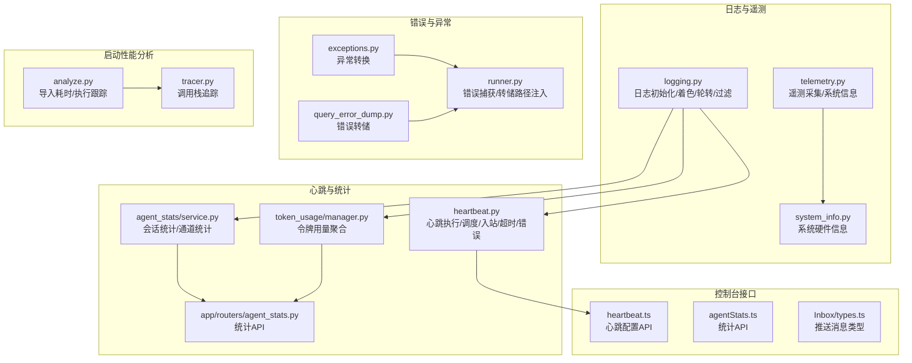
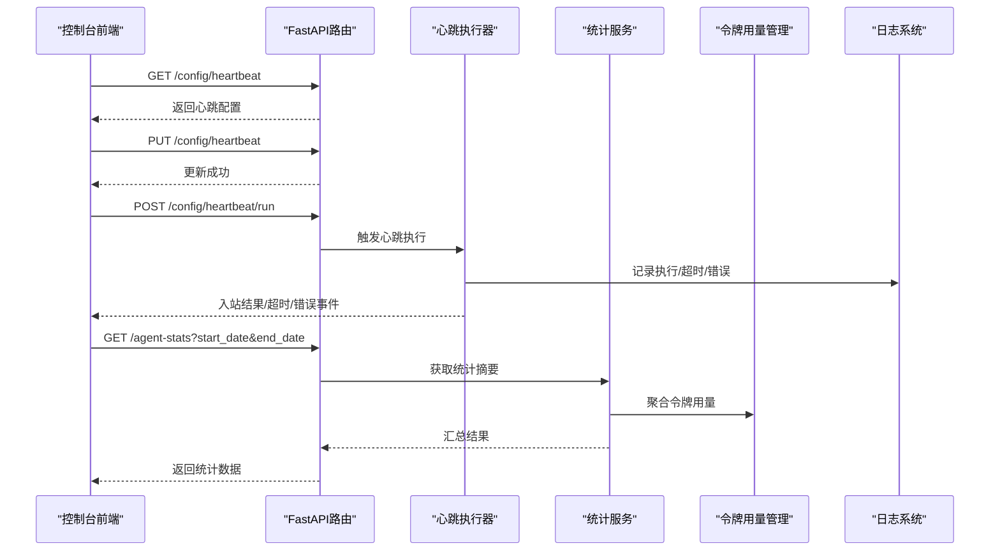
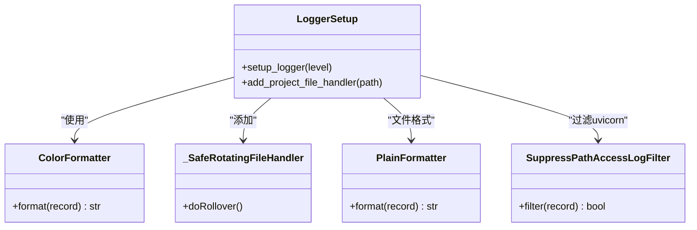
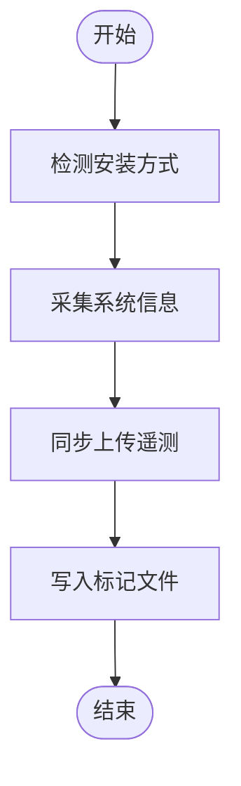
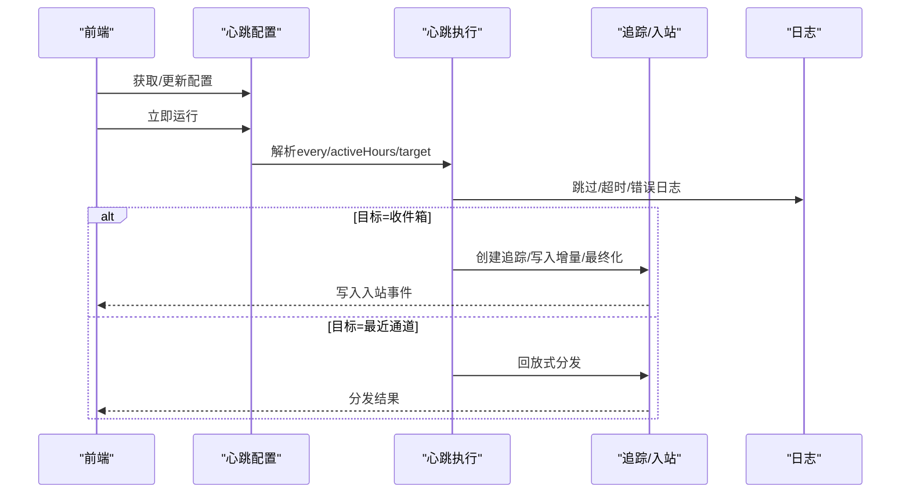
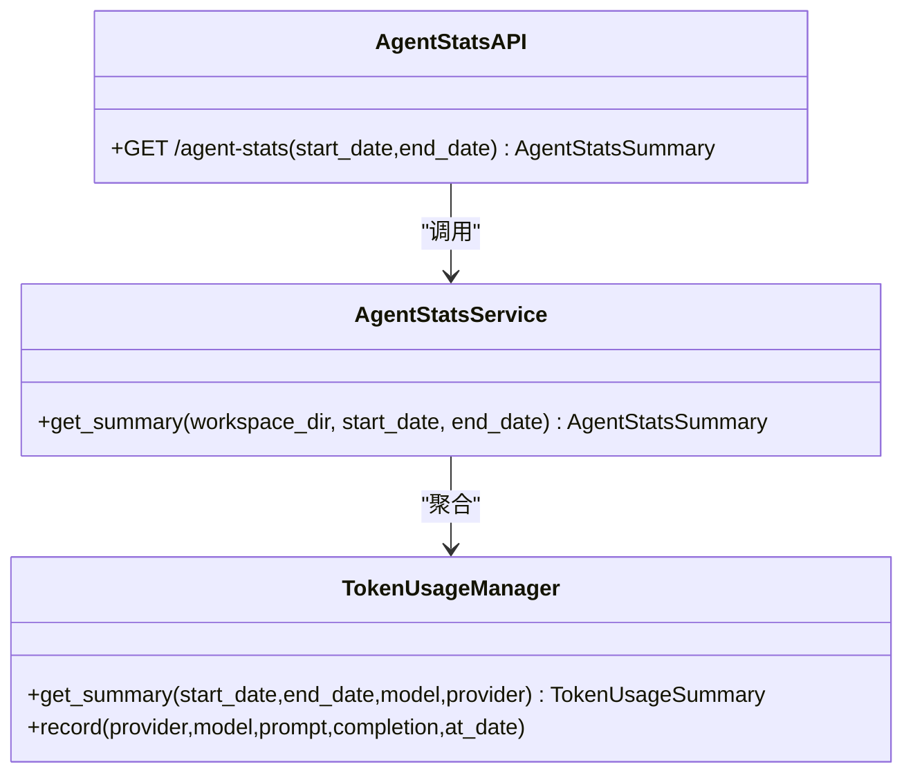
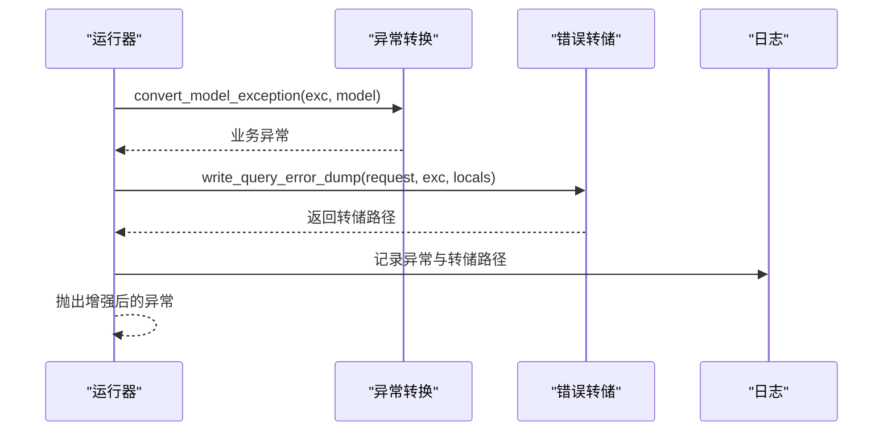
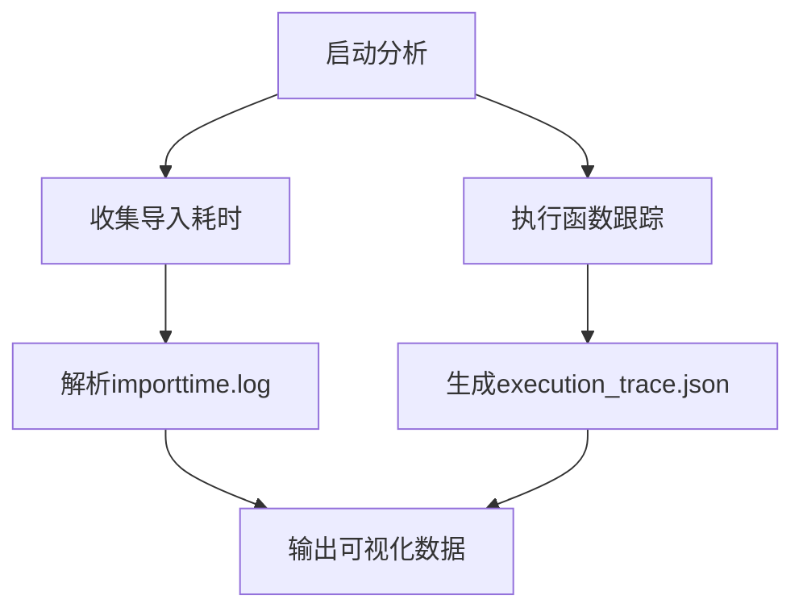
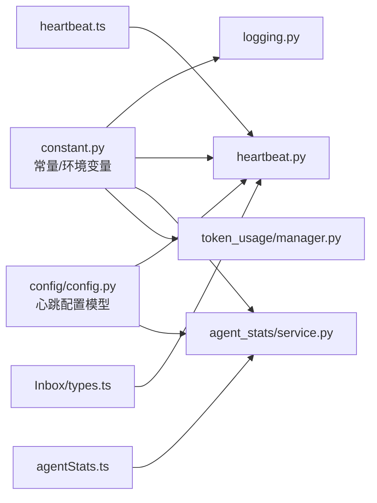

# 监控与日志

<cite>
**本文引用的文件**   
- [src/qwenpaw/utils/logging.py](file://src/qwenpaw/utils/logging.py)
- [src/qwenpaw/utils/telemetry.py](file://src/qwenpaw/utils/telemetry.py)
- [src/qwenpaw/utils/system_info.py](file://src/qwenpaw/utils/system_info.py)
- [src/qwenpaw/app/crons/heartbeat.py](file://src/qwenpaw/app/crons/heartbeat.py)
- [src/qwenpaw/agent_stats/service.py](file://src/qwenpaw/agent_stats/service.py)
- [src/qwenpaw/token_usage/manager.py](file://src/qwenpaw/token_usage/manager.py)
- [src/qwenpaw/app/routers/agent_stats.py](file://src/qwenpaw/app/routers/agent_stats.py)
- [src/qwenpaw/config/config.py](file://src/qwenpaw/config/config.py)
- [src/qwenpaw/constant.py](file://src/qwenpaw/constant.py)
- [src/qwenpaw/exceptions.py](file://src/qwenpaw/exceptions.py)
- [src/qwenpaw/app/runner/query_error_dump.py](file://src/qwenpaw/app/runner/query_error_dump.py)
- [src/qwenpaw/app/runner/runner.py](file://src/qwenpaw/app/runner/runner.py)
- [console/src/api/modules/heartbeat.ts](file://console/src/api/modules/heartbeat.ts)
- [console/src/api/modules/agentStats.ts](file://console/src/api/modules/agentStats.ts)
- [console/src/pages/Inbox/types.ts](file://console/src/pages/Inbox/types.ts)
- [scripts/startup_profile/analyze.py](file://scripts/startup_profile/analyze.py)
- [scripts/startup_profile/tracer.py](file://scripts/startup_profile/tracer.py)
</cite>

## 目录
1. [简介](#简介)
2. [项目结构](#项目结构)
3. [核心组件](#核心组件)
4. [架构总览](#架构总览)
5. [详细组件分析](#详细组件分析)
6. [依赖关系分析](#依赖关系分析)
7. [性能考量](#性能考量)
8. [故障排查指南](#故障排查指南)
9. [结论](#结论)
10. [附录](#附录)

## 简介
本文件面向QwenPaw的监控与日志体系，系统性阐述日志系统架构、日志级别与日志轮转机制；覆盖性能监控指标、健康检查（心跳）机制与错误追踪配置；解释遥测数据采集、系统信息获取与监控告警处理流程；并提供日志分析工具、调试技巧与性能分析实用指南，以及日志存储优化、查询性能与数据保留策略建议。

## 项目结构
围绕监控与日志的关键模块分布如下：
- 日志与遥测：Python侧日志初始化、着色格式化、安全轮转、访问日志过滤、遥测采集与系统信息检测
- 心跳与统计：心跳任务执行、定时调度、消息统计与令牌用量统计
- 控制台接口：心跳配置读写、统计API、推送消息类型定义
- 错误与异常：统一异常转换与错误转储
- 启动性能分析：导入耗时与函数调用跟踪脚本

**图表来源**
- [src/qwenpaw/utils/logging.py:1-226](file://src/qwenpaw/utils/logging.py#L1-L226)
- [src/qwenpaw/utils/telemetry.py:1-305](file://src/qwenpaw/utils/telemetry.py#L1-L305)
- [src/qwenpaw/utils/system_info.py:1-253](file://src/qwenpaw/utils/system_info.py#L1-L253)
- [src/qwenpaw/app/crons/heartbeat.py:1-379](file://src/qwenpaw/app/crons/heartbeat.py#L1-L379)
- [src/qwenpaw/agent_stats/service.py:1-375](file://src/qwenpaw/agent_stats/service.py#L1-L375)
- [src/qwenpaw/token_usage/manager.py:1-285](file://src/qwenpaw/token_usage/manager.py#L1-L285)
- [src/qwenpaw/app/routers/agent_stats.py:1-55](file://src/qwenpaw/app/routers/agent_stats.py#L1-L55)
- [console/src/api/modules/heartbeat.ts:1-17](file://console/src/api/modules/heartbeat.ts#L1-L17)
- [console/src/api/modules/agentStats.ts:1-16](file://console/src/api/modules/agentStats.ts#L1-L16)
- [console/src/pages/Inbox/types.ts:1-92](file://console/src/pages/Inbox/types.ts#L1-L92)
- [src/qwenpaw/app/runner/query_error_dump.py:55-90](file://src/qwenpaw/app/runner/query_error_dump.py#L55-L90)
- [src/qwenpaw/app/runner/runner.py:801-835](file://src/qwenpaw/app/runner/runner.py#L801-L835)
- [scripts/startup_profile/analyze.py:1-108](file://scripts/startup_profile/analyze.py#L1-L108)
- [scripts/startup_profile/tracer.py:82-108](file://scripts/startup_profile/tracer.py#L82-L108)

**章节来源**
- [src/qwenpaw/utils/logging.py:1-226](file://src/qwenpaw/utils/logging.py#L1-L226)
- [src/qwenpaw/utils/telemetry.py:1-305](file://src/qwenpaw/utils/telemetry.py#L1-L305)
- [src/qwenpaw/utils/system_info.py:1-253](file://src/qwenpaw/utils/system_info.py#L1-L253)
- [src/qwenpaw/app/crons/heartbeat.py:1-379](file://src/qwenpaw/app/crons/heartbeat.py#L1-L379)
- [src/qwenpaw/agent_stats/service.py:1-375](file://src/qwenpaw/agent_stats/service.py#L1-L375)
- [src/qwenpaw/token_usage/manager.py:1-285](file://src/qwenpaw/token_usage/manager.py#L1-L285)
- [src/qwenpaw/app/routers/agent_stats.py:1-55](file://src/qwenpaw/app/routers/agent_stats.py#L1-L55)
- [console/src/api/modules/heartbeat.ts:1-17](file://console/src/api/modules/heartbeat.ts#L1-L17)
- [console/src/api/modules/agentStats.ts:1-16](file://console/src/api/modules/agentStats.ts#L1-L16)
- [console/src/pages/Inbox/types.ts:1-92](file://console/src/pages/Inbox/types.ts#L1-L92)
- [src/qwenpaw/app/runner/query_error_dump.py:55-90](file://src/qwenpaw/app/runner/query_error_dump.py#L55-L90)
- [src/qwenpaw/app/runner/runner.py:801-835](file://src/qwenpaw/app/runner/runner.py#L801-L835)
- [scripts/startup_profile/analyze.py:1-108](file://scripts/startup_profile/analyze.py#L1-L108)
- [scripts/startup_profile/tracer.py:82-108](file://scripts/startup_profile/tracer.py#L82-L108)

## 核心组件
- 日志系统
  - 初始化与级别映射、着色输出、根日志器抑制第三方噪声、命名空间隔离
  - 安全轮转处理器（跨平台兼容）、文件句柄幂等添加、纯文本格式化
  - 访问日志过滤器（按路径子串屏蔽）
- 遥测与系统信息
  - 遥测端点、标记文件、安装方式检测、系统信息采集（版本、架构、GPU）
  - 系统信息归一化（内存、显存、CUDA版本）
- 心跳与统计
  - 心跳解析（间隔/定时表达式）、活跃时段校验、目标分派（最近通道/收件箱）
  - 统计服务（按日期/通道聚合、消息计数、工具调用、活跃会话）
  - 令牌用量管理（缓冲/合并/查询/汇总）
- 控制台接口
  - 心跳配置读取/更新/立即运行
  - 统计API（日期范围、工作区绑定）
  - 推送消息类型（渠道、优先级、事件状态、严重程度）
- 错误追踪
  - 异常转换（模型类错误映射到业务异常）
  - 查询错误转储（请求上下文、代理状态、时间戳）

**章节来源**
- [src/qwenpaw/utils/logging.py:154-225](file://src/qwenpaw/utils/logging.py#L154-L225)
- [src/qwenpaw/utils/telemetry.py:42-155](file://src/qwenpaw/utils/telemetry.py#L42-L155)
- [src/qwenpaw/utils/system_info.py:135-144](file://src/qwenpaw/utils/system_info.py#L135-L144)
- [src/qwenpaw/app/crons/heartbeat.py:54-131](file://src/qwenpaw/app/crons/heartbeat.py#L54-L131)
- [src/qwenpaw/agent_stats/service.py:180-364](file://src/qwenpaw/agent_stats/service.py#L180-L364)
- [src/qwenpaw/token_usage/manager.py:61-235](file://src/qwenpaw/token_usage/manager.py#L61-L235)
- [console/src/api/modules/heartbeat.ts:1-17](file://console/src/api/modules/heartbeat.ts#L1-L17)
- [console/src/api/modules/agentStats.ts:1-16](file://console/src/api/modules/agentStats.ts#L1-L16)
- [console/src/pages/Inbox/types.ts:16-46](file://console/src/pages/Inbox/types.ts#L16-L46)
- [src/qwenpaw/app/runner/query_error_dump.py:55-90](file://src/qwenpaw/app/runner/query_error_dump.py#L55-L90)
- [src/qwenpaw/exceptions.py:165-253](file://src/qwenpaw/exceptions.py#L165-L253)

## 架构总览
下图展示从控制台到后端的心跳与统计调用链路，以及日志与遥测在系统中的位置。

**图表来源**
- [console/src/api/modules/heartbeat.ts:4-16](file://console/src/api/modules/heartbeat.ts#L4-L16)
- [src/qwenpaw/app/routers/agent_stats.py:25-54](file://src/qwenpaw/app/routers/agent_stats.py#L25-L54)
- [src/qwenpaw/app/crons/heartbeat.py:169-379](file://src/qwenpaw/app/crons/heartbeat.py#L169-L379)
- [src/qwenpaw/agent_stats/service.py:180-364](file://src/qwenpaw/agent_stats/service.py#L180-L364)
- [src/qwenpaw/token_usage/manager.py:173-235](file://src/qwenpaw/token_usage/manager.py#L173-L235)
- [src/qwenpaw/utils/logging.py:154-188](file://src/qwenpaw/utils/logging.py#L154-L188)

## 详细组件分析

### 日志系统
- 日志级别与命名空间
  - 支持字符串到数值级别的映射，根日志器抑制第三方噪声，仅向项目命名空间输出
- 着色与格式化
  - 彩色终端输出，非TTY自动降级；相对路径显示，便于定位
- 文件轮转与容错
  - 安全轮转处理器容忍Windows文件锁导致的权限错误，避免旋转失败
  - 幂等添加文件处理器，避免重复句柄与重复行
- 访问日志过滤
  - 可配置路径子串列表以屏蔽特定访问日志

**图表来源**
- [src/qwenpaw/utils/logging.py:55-152](file://src/qwenpaw/utils/logging.py#L55-L152)
- [src/qwenpaw/utils/logging.py:154-225](file://src/qwenpaw/utils/logging.py#L154-L225)

**章节来源**
- [src/qwenpaw/utils/logging.py:154-225](file://src/qwenpaw/utils/logging.py#L154-L225)

### 遥测与系统信息
- 遥测采集
  - 安装方式检测（容器/Docker Desktop/Pip），系统信息（OS/架构/版本/GPU）
  - 同步上传，失败静默，标记文件记录已采集版本与用户选择
- 系统信息归一化
  - CUDA版本、内存大小、显存大小、操作系统与架构

**图表来源**
- [src/qwenpaw/utils/telemetry.py:31-176](file://src/qwenpaw/utils/telemetry.py#L31-L176)
- [src/qwenpaw/utils/telemetry.py:188-304](file://src/qwenpaw/utils/telemetry.py#L188-L304)
- [src/qwenpaw/utils/system_info.py:135-144](file://src/qwenpaw/utils/system_info.py#L135-L144)

**章节来源**
- [src/qwenpaw/utils/telemetry.py:1-305](file://src/qwenpaw/utils/telemetry.py#L1-L305)
- [src/qwenpaw/utils/system_info.py:1-253](file://src/qwenpaw/utils/system_info.py#L1-L253)

### 心跳机制
- 配置与解析
  - 支持“每X时间”或“5字段cron”两种表达；活跃时段校验
- 执行策略
  - 目标为“最近通道”：基于最后分发信息进行回放式分发
  - 目标为“收件箱”：创建追踪、流式执行、追加追踪增量、最终化并写入入站事件
  - 超时与错误：分别记录超时/错误事件并写入入站
- 控制台交互
  - 前端提供获取/更新心跳配置与立即运行接口

**图表来源**
- [src/qwenpaw/app/crons/heartbeat.py:54-131](file://src/qwenpaw/app/crons/heartbeat.py#L54-L131)
- [src/qwenpaw/app/crons/heartbeat.py:169-379](file://src/qwenpaw/app/crons/heartbeat.py#L169-L379)
- [console/src/api/modules/heartbeat.ts:4-16](file://console/src/api/modules/heartbeat.ts#L4-L16)

**章节来源**
- [src/qwenpaw/app/crons/heartbeat.py:1-379](file://src/qwenpaw/app/crons/heartbeat.py#L1-L379)
- [console/src/api/modules/heartbeat.ts:1-17](file://console/src/api/modules/heartbeat.ts#L1-L17)

### 统计与令牌用量
- 统计服务
  - 按日期/通道聚合：用户/助手消息数、总消息数、工具调用次数、活跃会话数
  - 令牌用量汇总：按日期聚合提示/补全token与调用次数
- 统计API
  - 前端传入日期范围，后端返回聚合摘要

**图表来源**
- [src/qwenpaw/agent_stats/service.py:180-364](file://src/qwenpaw/agent_stats/service.py#L180-L364)
- [src/qwenpaw/token_usage/manager.py:173-235](file://src/qwenpaw/token_usage/manager.py#L173-L235)
- [src/qwenpaw/app/routers/agent_stats.py:25-54](file://src/qwenpaw/app/routers/agent_stats.py#L25-L54)

**章节来源**
- [src/qwenpaw/agent_stats/service.py:1-375](file://src/qwenpaw/agent_stats/service.py#L1-L375)
- [src/qwenpaw/token_usage/manager.py:1-285](file://src/qwenpaw/token_usage/manager.py#L1-L285)
- [src/qwenpaw/app/routers/agent_stats.py:1-55](file://src/qwenpaw/app/routers/agent_stats.py#L1-L55)
- [console/src/api/modules/agentStats.ts:1-16](file://console/src/api/modules/agentStats.ts#L1-L16)

### 错误追踪与异常转换
- 异常转换
  - 将模型相关异常按状态码/关键词映射为业务异常（未授权/配额/超时/上下文超限等）
- 查询错误转储
  - 捕获异常，序列化请求/代理状态/时间戳，生成临时JSON文件
- 运行器集成
  - 在查询处理器中捕获异常，写入转储并注入调试路径到异常对象

**图表来源**
- [src/qwenpaw/exceptions.py:165-253](file://src/qwenpaw/exceptions.py#L165-L253)
- [src/qwenpaw/app/runner/query_error_dump.py:55-90](file://src/qwenpaw/app/runner/query_error_dump.py#L55-L90)
- [src/qwenpaw/app/runner/runner.py:801-835](file://src/qwenpaw/app/runner/runner.py#L801-L835)

**章节来源**
- [src/qwenpaw/exceptions.py:1-254](file://src/qwenpaw/exceptions.py#L1-L254)
- [src/qwenpaw/app/runner/query_error_dump.py:55-90](file://src/qwenpaw/app/runner/query_error_dump.py#L55-L90)
- [src/qwenpaw/app/runner/runner.py:801-835](file://src/qwenpaw/app/runner/runner.py#L801-L835)

### 启动性能分析
- 导入耗时分析
  - 使用Python importtime开关收集模块导入耗时，解析自定义日志格式
- 函数调用跟踪
  - 通过tracer模块记录函数调用栈，辅助定位热点路径

**图表来源**
- [scripts/startup_profile/analyze.py:17-108](file://scripts/startup_profile/analyze.py#L17-L108)
- [scripts/startup_profile/tracer.py:82-108](file://scripts/startup_profile/tracer.py#L82-L108)

**章节来源**
- [scripts/startup_profile/analyze.py:1-108](file://scripts/startup_profile/analyze.py#L1-L108)
- [scripts/startup_profile/tracer.py:82-108](file://scripts/startup_profile/tracer.py#L82-L108)

## 依赖关系分析
- 日志系统对常量与环境变量的依赖
  - 工作目录、日志文件名、日志级别环境变量键
- 心跳与配置
  - 心跳配置模型、默认值、活跃时段解析、目标常量
- 统计与令牌用量
  - 工作区目录、聊天与会话文件结构、令牌用量文件名
- 控制台接口
  - 心跳配置类型、统计API参数、推送消息类型

**图表来源**
- [src/qwenpaw/constant.py:194-201](file://src/qwenpaw/constant.py#L194-L201)
- [src/qwenpaw/constant.py:174-186](file://src/qwenpaw/constant.py#L174-L186)
- [src/qwenpaw/config/config.py:483-495](file://src/qwenpaw/config/config.py#L483-L495)
- [src/qwenpaw/app/crons/heartbeat.py:18-37](file://src/qwenpaw/app/crons/heartbeat.py#L18-L37)
- [src/qwenpaw/agent_stats/service.py:16-22](file://src/qwenpaw/agent_stats/service.py#L16-L22)
- [src/qwenpaw/token_usage/manager.py:13-14](file://src/qwenpaw/token_usage/manager.py#L13-L14)
- [console/src/api/modules/heartbeat.ts:1-11](file://console/src/api/modules/heartbeat.ts#L1-L11)
- [console/src/api/modules/agentStats.ts:1-16](file://console/src/api/modules/agentStats.ts#L1-L16)
- [console/src/pages/Inbox/types.ts:16-46](file://console/src/pages/Inbox/types.ts#L16-L46)

**章节来源**
- [src/qwenpaw/constant.py:1-368](file://src/qwenpaw/constant.py#L1-L368)
- [src/qwenpaw/config/config.py:483-495](file://src/qwenpaw/config/config.py#L483-L495)
- [console/src/api/modules/heartbeat.ts:1-17](file://console/src/api/modules/heartbeat.ts#L1-L17)
- [console/src/api/modules/agentStats.ts:1-16](file://console/src/api/modules/agentStats.ts#L1-L16)
- [console/src/pages/Inbox/types.ts:1-92](file://console/src/pages/Inbox/types.ts#L1-L92)

## 性能考量
- 日志轮转与IO
  - 单文件5MiB，最多3个备份；安全轮转避免Windows锁冲突；建议结合外部日志收集器集中处理
- 统计扫描与并发
  - 会话文件扫描使用信号量限制并发FD；建议合理设置CPU核数倍数；大范围日期统计时注意磁盘IO
- 令牌用量缓冲
  - 默认刷新间隔可调整；高吞吐场景建议缩短刷新间隔以降低丢失风险
- 心跳执行超时
  - 统一120秒超时，避免阻塞；建议根据模型与通道复杂度评估并调整
- 启动性能
  - 利用导入耗时与函数跟踪脚本定位瓶颈模块与调用热点

[本节为通用指导，无需具体文件引用]

## 故障排查指南
- 日志级别与输出
  - 通过环境变量设置日志级别；确认仅项目命名空间日志输出；检查TTY颜色支持
- 心跳问题
  - 检查配置是否启用、活跃时段是否匹配、目标通道是否存在；查看入站事件与追踪状态
- 统计不更新
  - 确认日期范围与工作区路径；检查会话目录结构与文件编码；关注令牌用量文件存在性
- 错误转储
  - 查看运行器抛出异常时注入的转储路径；核对请求上下文与代理状态；结合日志定位根因
- 遥测与系统信息
  - 检查标记文件与端点可达性；确认系统命令可用（nvidia-smi/lspci/wmic等）

**章节来源**
- [src/qwenpaw/utils/logging.py:154-225](file://src/qwenpaw/utils/logging.py#L154-L225)
- [src/qwenpaw/app/crons/heartbeat.py:169-379](file://src/qwenpaw/app/crons/heartbeat.py#L169-L379)
- [src/qwenpaw/agent_stats/service.py:233-316](file://src/qwenpaw/agent_stats/service.py#L233-L316)
- [src/qwenpaw/app/runner/runner.py:801-835](file://src/qwenpaw/app/runner/runner.py#L801-L835)
- [src/qwenpaw/utils/telemetry.py:188-304](file://src/qwenpaw/utils/telemetry.py#L188-L304)

## 结论
QwenPaw的监控与日志体系以清晰的模块边界实现：日志系统负责可观测性入口，遥测提供安装与环境概览，心跳与统计保障运行时健康与性能，错误追踪确保问题可溯源。通过合理的轮转策略、并发控制与启动分析工具，可在生产环境中获得稳定且可维护的监控体验。

[本节为总结性内容，无需具体文件引用]

## 附录

### 日志级别与轮转配置
- 级别映射：critical/error/warning/info/debug
- 输出格式：彩色终端与纯文本文件
- 轮转参数：单文件5MiB，3个备份
- 幂等添加：避免重复句柄与重复行
- 访问日志过滤：按路径子串屏蔽

**章节来源**
- [src/qwenpaw/utils/logging.py:18-24](file://src/qwenpaw/utils/logging.py#L18-L24)
- [src/qwenpaw/utils/logging.py:154-225](file://src/qwenpaw/utils/logging.py#L154-L225)

### 心跳配置与控制台API
- 配置项：enabled/every/target/activeHours
- 控制台API：获取/更新/立即运行
- 推送消息类型：渠道、优先级、事件状态、严重程度

**章节来源**
- [src/qwenpaw/config/config.py:483-495](file://src/qwenpaw/config/config.py#L483-L495)
- [console/src/api/modules/heartbeat.ts:1-17](file://console/src/api/modules/heartbeat.ts#L1-L17)
- [console/src/pages/Inbox/types.ts:16-46](file://console/src/pages/Inbox/types.ts#L16-L46)

### 统计与令牌用量查询
- 日期范围：默认30天，可指定起止
- 聚合维度：按日期/通道/模型/提供商
- 存储位置：工作区目录下的聊天与会话文件

**章节来源**
- [src/qwenpaw/app/routers/agent_stats.py:16-54](file://src/qwenpaw/app/routers/agent_stats.py#L16-L54)
- [src/qwenpaw/agent_stats/service.py:180-364](file://src/qwenpaw/agent_stats/service.py#L180-L364)
- [src/qwenpaw/token_usage/manager.py:173-235](file://src/qwenpaw/token_usage/manager.py#L173-L235)

### 遥测与系统信息
- 端点：固定遥测上报地址
- 标记文件：记录版本与用户选择
- 系统信息：版本、安装方式、OS/架构、GPU检测

**章节来源**
- [src/qwenpaw/utils/telemetry.py:17-68](file://src/qwenpaw/utils/telemetry.py#L17-L68)
- [src/qwenpaw/utils/telemetry.py:188-304](file://src/qwenpaw/utils/telemetry.py#L188-L304)
- [src/qwenpaw/utils/system_info.py:135-144](file://src/qwenpaw/utils/system_info.py#L135-L144)

### 启动性能分析工具
- 导入耗时：-X importtime，解析日志，输出JSON
- 函数跟踪：tracer模块，生成执行轨迹

**章节来源**
- [scripts/startup_profile/analyze.py:17-108](file://scripts/startup_profile/analyze.py#L17-L108)
- [scripts/startup_profile/tracer.py:82-108](file://scripts/startup_profile/tracer.py#L82-L108)