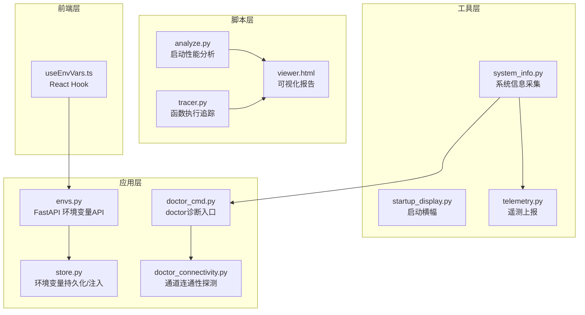
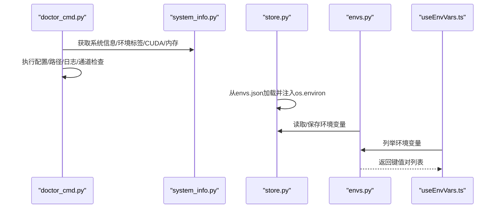
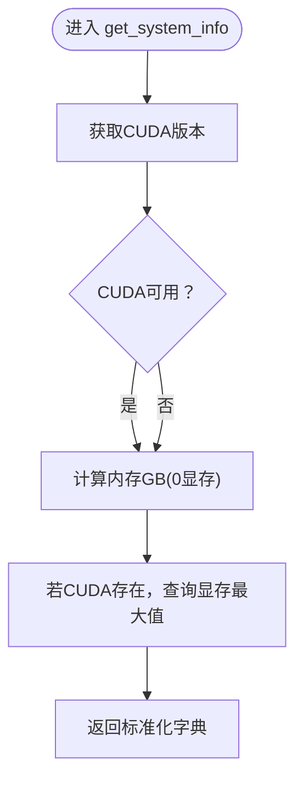
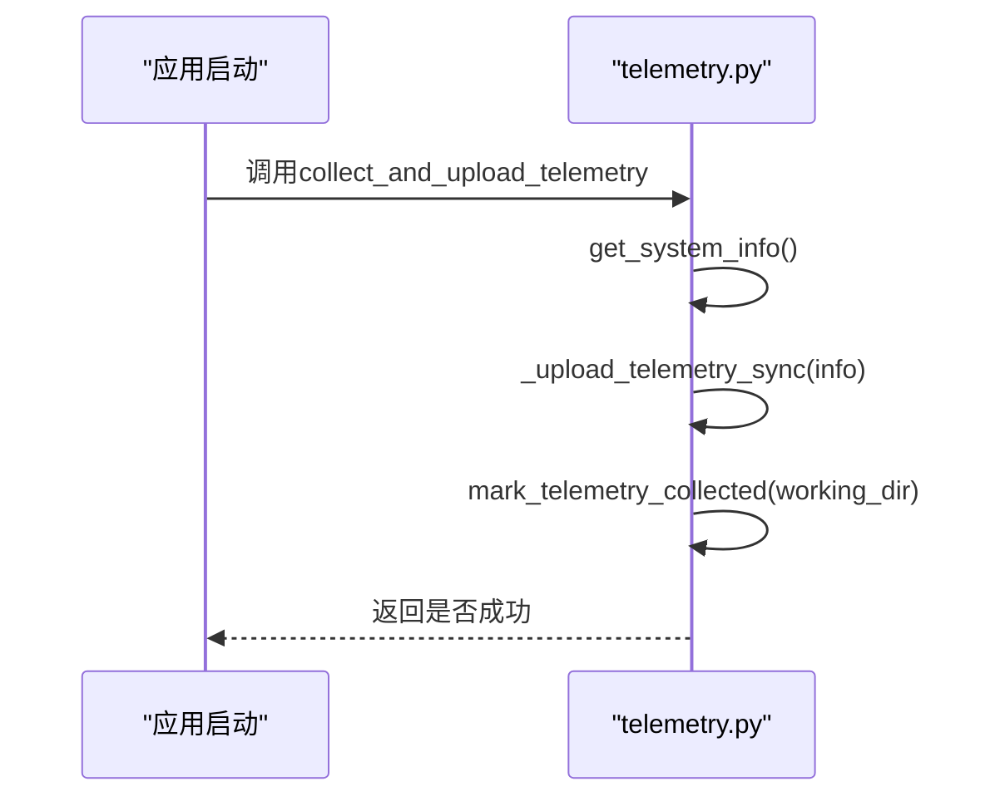
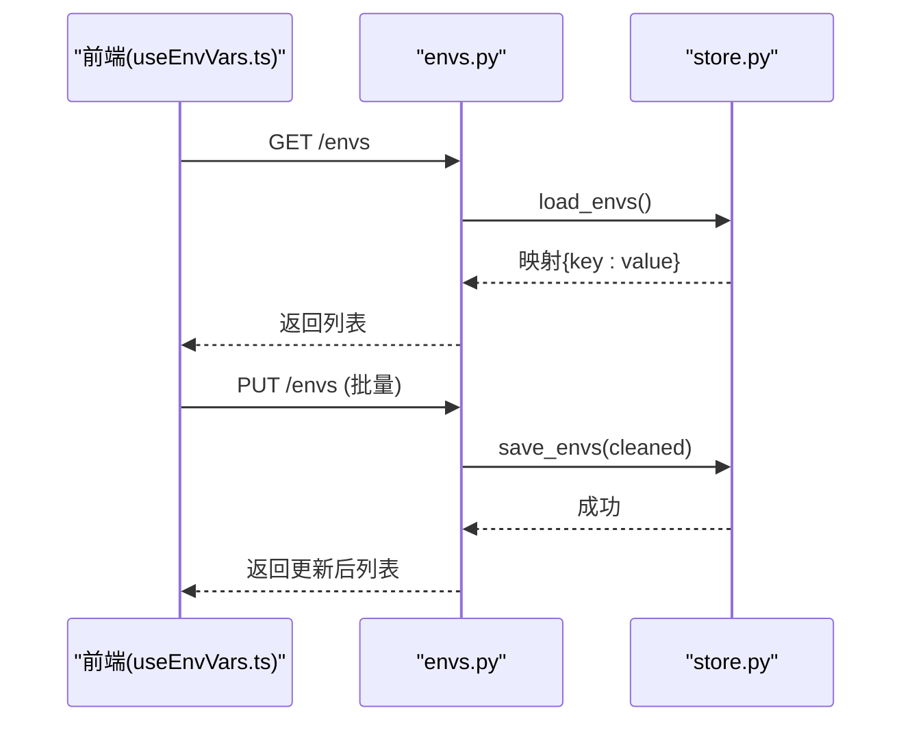
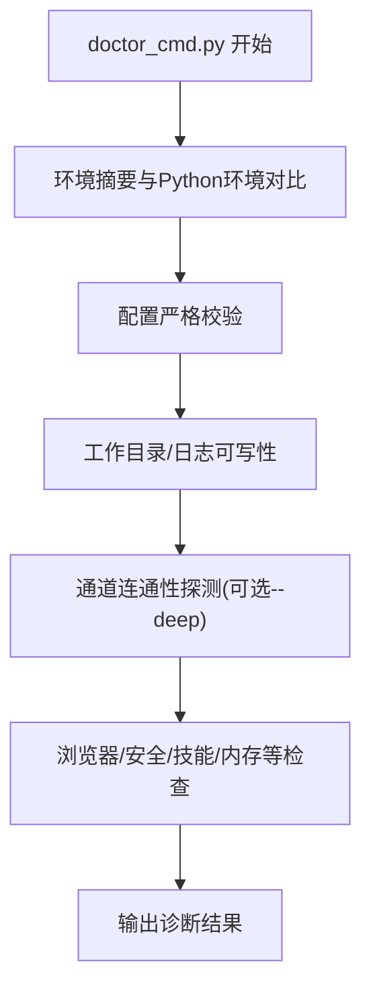
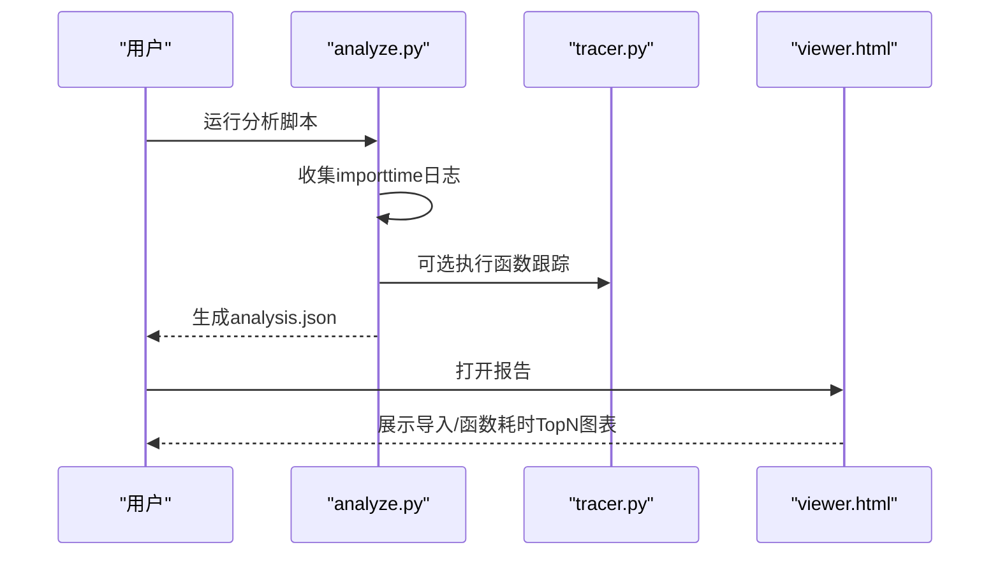
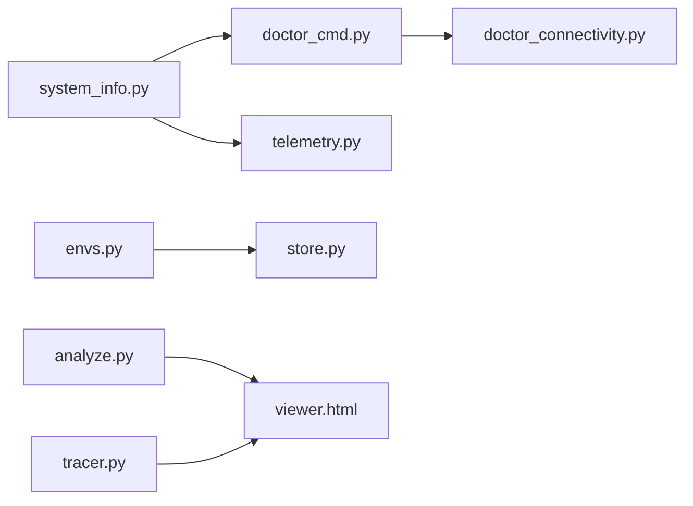
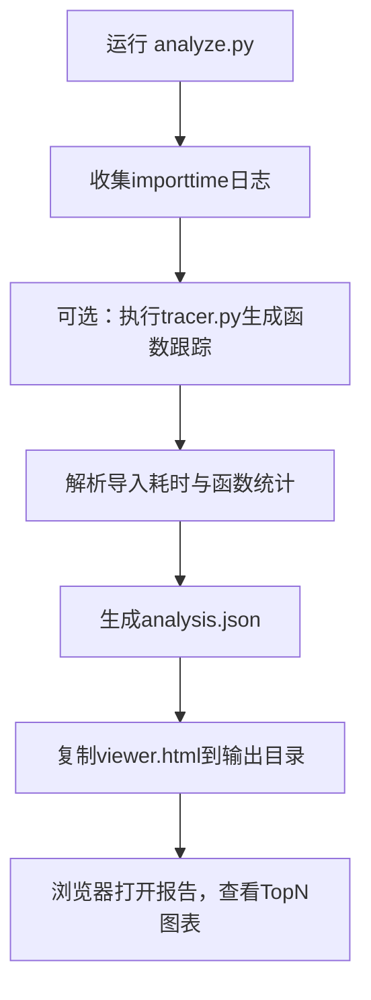

# 系统信息

<cite>
**本文引用的文件**
- [system_info.py](file://src/qwenpaw/utils/system_info.py)
- [startup_display.py](file://src/qwenpaw/utils/startup_display.py)
- [telemetry.py](file://src/qwenpaw/utils/telemetry.py)
- [envs.py](file://src/qwenpaw/app/routers/envs.py)
- [store.py](file://src/qwenpaw/envs/store.py)
- [doctor_cmd.py](file://src/qwenpaw/cli/doctor_cmd.py)
- [doctor_connectivity.py](file://src/qwenpaw/cli/doctor_connectivity.py)
- [analyze.py](file://scripts/startup_profile/analyze.py)
- [tracer.py](file://scripts/startup_profile/tracer.py)
- [viewer.html](file://scripts/startup_profile/viewer.html)
- [useEnvVars.ts](file://console/src/pages/Settings/Environments/useEnvVars.ts)
</cite>

## 目录
1. [简介](#简介)
2. [项目结构](#项目结构)
3. [核心组件](#核心组件)
4. [架构总览](#架构总览)
5. [详细组件分析](#详细组件分析)
6. [依赖分析](#依赖分析)
7. [性能考量](#性能考量)
8. [故障排查指南](#故障排查指南)
9. [结论](#结论)
10. [附录](#附录)

## 简介
本文件面向QwenPaw的“系统信息”能力，系统性梳理并解释以下主题：
- 系统环境信息获取：操作系统、架构、Python环境标签、CUDA版本、内存与显存等
- 硬件资源监控：内存总量、显存总量（在CUDA可用时）
- 运行时状态检测：启动路径可写性、日志可写性、工作目录与工作区权限、通道连通性等
- 启动信息显示：启动横幅、启动耗时展示
- 系统兼容性检查：doctor命令的多维度诊断
- 性能基准测试：启动性能分析工具链（导入耗时、函数执行跟踪）
- 环境变量管理：持久化、注入、读取与API暴露
- 查询接口与监控指标：REST API端点、前端Hook、可视化报告

## 项目结构
围绕系统信息的关键代码分布在如下位置：
- 工具层：系统信息采集、启动横幅、遥测上报
- 应用层：环境变量API、doctor诊断CLI
- 脚本层：启动性能分析与可视化
- 前端层：环境变量列表的React Hook

图表来源
- [system_info.py:1-253](file://src/qwenpaw/utils/system_info.py#L1-L253)
- [startup_display.py:1-81](file://src/qwenpaw/utils/startup_display.py#L1-L81)
- [telemetry.py:1-304](file://src/qwenpaw/utils/telemetry.py#L1-L304)
- [envs.py:1-81](file://src/qwenpaw/app/routers/envs.py#L1-L81)
- [store.py:1-270](file://src/qwenpaw/envs/store.py#L1-L270)
- [doctor_cmd.py:1-1069](file://src/qwenpaw/cli/doctor_cmd.py#L1-L1069)
- [doctor_connectivity.py:1-331](file://src/qwenpaw/cli/doctor_connectivity.py#L1-L331)
- [analyze.py:1-323](file://scripts/startup_profile/analyze.py#L1-L323)
- [tracer.py:1-224](file://scripts/startup_profile/tracer.py#L1-L224)
- [viewer.html:569-600](file://scripts/startup_profile/viewer.html#L569-L600)
- [useEnvVars.ts:1-33](file://console/src/pages/Settings/Environments/useEnvVars.ts#L1-L33)

章节来源
- [system_info.py:1-253](file://src/qwenpaw/utils/system_info.py#L1-L253)
- [envs.py:1-81](file://src/qwenpaw/app/routers/envs.py#L1-L81)
- [store.py:1-270](file://src/qwenpaw/envs/store.py#L1-L270)
- [doctor_cmd.py:1-1069](file://src/qwenpaw/cli/doctor_cmd.py#L1-L1069)
- [doctor_connectivity.py:1-331](file://src/qwenpaw/cli/doctor_connectivity.py#L1-L331)
- [analyze.py:1-323](file://scripts/startup_profile/analyze.py#L1-L323)
- [tracer.py:1-224](file://scripts/startup_profile/tracer.py#L1-L224)
- [viewer.html:569-600](file://scripts/startup_profile/viewer.html#L569-L600)
- [useEnvVars.ts:1-33](file://console/src/pages/Settings/Environments/useEnvVars.ts#L1-L33)

## 核心组件
- 系统信息采集器：统一输出标准化系统信息，包括OS、架构、CUDA版本、内存与显存大小
- 启动横幅：以富文本方式打印就绪状态、地址与启动耗时
- 遥测上报：匿名化系统信息采集与上传，支持去重与退出选项
- 环境变量管理：JSON持久化、进程注入、API读写
- doctor诊断：配置校验、工作目录与日志可写性、通道连通性、浏览器自动化、安全基线等
- 启动性能分析：导入耗时与函数执行跟踪，生成可视化报告

章节来源
- [system_info.py:135-144](file://src/qwenpaw/utils/system_info.py#L135-L144)
- [startup_display.py:11-81](file://src/qwenpaw/utils/startup_display.py#L11-L81)
- [telemetry.py:42-69](file://src/qwenpaw/utils/telemetry.py#L42-L69)
- [envs.py:32-81](file://src/qwenpaw/app/routers/envs.py#L32-L81)
- [store.py:142-270](file://src/qwenpaw/envs/store.py#L142-L270)
- [doctor_cmd.py:377-800](file://src/qwenpaw/cli/doctor_cmd.py#L377-L800)
- [doctor_connectivity.py:248-331](file://src/qwenpaw/cli/doctor_connectivity.py#L248-L331)
- [analyze.py:180-323](file://scripts/startup_profile/analyze.py#L180-L323)
- [tracer.py:10-224](file://scripts/startup_profile/tracer.py#L10-L224)

## 架构总览
系统信息相关模块通过“采集—存储/注入—查询—展示”的闭环协同工作。

图表来源
- [doctor_cmd.py:377-800](file://src/qwenpaw/cli/doctor_cmd.py#L377-L800)
- [system_info.py:22-144](file://src/qwenpaw/utils/system_info.py#L22-L144)
- [store.py:142-270](file://src/qwenpaw/envs/store.py#L142-L270)
- [envs.py:32-81](file://src/qwenpaw/app/routers/envs.py#L32-L81)
- [useEnvVars.ts:1-33](file://console/src/pages/Settings/Environments/useEnvVars.ts#L1-L33)

## 详细组件分析

### 系统信息采集器（system_info.py）
- 功能要点
  - Python环境标签：虚拟环境/Conda上下文识别
  - 操作系统与架构：归一化为小写与常用命名
  - macOS版本解析：优先平台信息，回退到系统命令
  - CUDA版本探测：通过nvidia-smi/nvcc输出正则匹配
  - 内存与显存：跨平台内存探测；CUDA显存按最大GPU统计
- 数据结构
  - 输出字典包含：os、arch、cuda_version、memory_gb、vram_gb
- 错误处理
  - 子进程超时/异常、数值解析失败均返回默认值
- 复杂度
  - 内存探测多分支，最坏O(1)，I/O受限于系统接口

图表来源
- [system_info.py:135-144](file://src/qwenpaw/utils/system_info.py#L135-L144)
- [system_info.py:84-133](file://src/qwenpaw/utils/system_info.py#L84-L133)

章节来源
- [system_info.py:22-144](file://src/qwenpaw/utils/system_info.py#L22-L144)
- [system_info.py:166-253](file://src/qwenpaw/utils/system_info.py#L166-L253)

### 启动横幅与启动耗时（startup_display.py）
- 功能要点
  - 以富文本格式打印“就绪”面板，支持显示服务地址与启动耗时
  - 无参数时输出通用就绪提示
- 使用场景
  - 应用启动完成后的用户提示
- 可视化
  - 使用rich库渲染树形结构与面板

章节来源
- [startup_display.py:11-81](file://src/qwenpaw/utils/startup_display.py#L11-L81)

### 遥测上报（telemetry.py）
- 功能要点
  - 收集安装方式、OS、版本、架构、GPU可用性等匿名信息
  - 上报至指定端点，失败静默不阻断安装
  - 去重标记：按版本维护已采集清单，支持永久退出
- 数据字段
  - install_id、qwenpaw_version、install_method、os、os_version、python_version、architecture、has_gpu
- 采集频率与缓存
  - 单次安装周期内仅采集一次，通过标记文件去重
  - 用户可选择永久退出，标记文件记录opted_out

图表来源
- [telemetry.py:286-304](file://src/qwenpaw/utils/telemetry.py#L286-L304)
- [telemetry.py:42-69](file://src/qwenpaw/utils/telemetry.py#L42-L69)

章节来源
- [telemetry.py:1-304](file://src/qwenpaw/utils/telemetry.py#L1-L304)

### 环境变量管理（envs.py + store.py）
- 功能要点
  - API：列出、批量保存、删除环境变量
  - 存储：envs.json加密持久化，注入os.environ
  - 注入策略：排除受保护键，避免覆盖现有进程环境
- 数据流
  - 读取：load_envs → 解密 → 注入os.environ
  - 写入：save_envs → 加密写入 → 同步os.environ
- 安全性
  - 敏感值透明加密，迁移旧明文自动重加密

图表来源
- [envs.py:32-81](file://src/qwenpaw/app/routers/envs.py#L32-L81)
- [store.py:142-270](file://src/qwenpaw/envs/store.py#L142-L270)
- [useEnvVars.ts:1-33](file://console/src/pages/Settings/Environments/useEnvVars.ts#L1-L33)

章节来源
- [envs.py:1-81](file://src/qwenpaw/app/routers/envs.py#L1-L81)
- [store.py:1-270](file://src/qwenpaw/envs/store.py#L1-L270)
- [useEnvVars.ts:1-33](file://console/src/pages/Settings/Environments/useEnvVars.ts#L1-L33)

### doctor诊断（doctor_cmd.py + doctor_connectivity.py）
- 功能要点
  - 环境摘要：本地doctor与运行中服务器Python环境对比
  - 配置校验：严格验证config.json
  - 工作目录与日志：可写性检查
  - 通道连通性：内置探针对启用通道进行TCP/HTTP可达性检查
  - 浏览器自动化、安全基线、技能布局、内存嵌入等专项检查
- 采集频率
  - 一次性诊断，非周期性
- 缓存策略
  - 无缓存；每次运行重新探测

图表来源
- [doctor_cmd.py:377-800](file://src/qwenpaw/cli/doctor_cmd.py#L377-L800)
- [doctor_connectivity.py:248-331](file://src/qwenpaw/cli/doctor_connectivity.py#L248-L331)

章节来源
- [doctor_cmd.py:1-1069](file://src/qwenpaw/cli/doctor_cmd.py#L1-L1069)
- [doctor_connectivity.py:1-331](file://src/qwenpaw/cli/doctor_connectivity.py#L1-L331)

### 启动性能分析（analyze.py + tracer.py + viewer.html）
- 功能要点
  - 分析器：收集Python导入耗时日志与函数执行跟踪
  - 解析器：分类QwenPaw/第三方模块，统计累计耗时
  - 可视化：HTML报告，支持中英双语，交互式图表
- 数据流
  - analyze.py → 导出analysis.json
  - tracer.py → 生成execution_trace.json
  - viewer.html → 读取JSON并渲染

图表来源
- [analyze.py:180-323](file://scripts/startup_profile/analyze.py#L180-L323)
- [tracer.py:10-224](file://scripts/startup_profile/tracer.py#L10-L224)
- [viewer.html:569-600](file://scripts/startup_profile/viewer.html#L569-L600)

章节来源
- [analyze.py:1-323](file://scripts/startup_profile/analyze.py#L1-L323)
- [tracer.py:1-224](file://scripts/startup_profile/tracer.py#L1-L224)
- [viewer.html:1007-1189](file://scripts/startup_profile/viewer.html#L1007-L1189)

## 依赖分析
- 组件耦合
  - system_info.py被doctor_cmd.py与telemetry.py复用，耦合度低、内聚高
  - envs.py依赖store.py进行持久化与注入，API与存储分离清晰
  - doctor_connectivity.py依赖通道注册表与各通道配置模型
- 外部依赖
  - 平台API：os.sysconf、ctypes、subprocess、platform、socket、httpx
  - 可视化：viewer.html依赖Chart.js（由HTML内联脚本初始化）

图表来源
- [system_info.py:1-253](file://src/qwenpaw/utils/system_info.py#L1-L253)
- [doctor_cmd.py:1-1069](file://src/qwenpaw/cli/doctor_cmd.py#L1-L1069)
- [telemetry.py:1-304](file://src/qwenpaw/utils/telemetry.py#L1-L304)
- [envs.py:1-81](file://src/qwenpaw/app/routers/envs.py#L1-L81)
- [store.py:1-270](file://src/qwenpaw/envs/store.py#L1-L270)
- [doctor_connectivity.py:1-331](file://src/qwenpaw/cli/doctor_connectivity.py#L1-L331)
- [analyze.py:1-323](file://scripts/startup_profile/analyze.py#L1-L323)
- [tracer.py:1-224](file://scripts/startup_profile/tracer.py#L1-L224)
- [viewer.html:569-600](file://scripts/startup_profile/viewer.html#L569-L600)

章节来源
- [system_info.py:1-253](file://src/qwenpaw/utils/system_info.py#L1-L253)
- [envs.py:1-81](file://src/qwenpaw/app/routers/envs.py#L1-L81)
- [store.py:1-270](file://src/qwenpaw/envs/store.py#L1-L270)
- [doctor_cmd.py:1-1069](file://src/qwenpaw/cli/doctor_cmd.py#L1-L1069)
- [doctor_connectivity.py:1-331](file://src/qwenpaw/cli/doctor_connectivity.py#L1-L331)
- [analyze.py:1-323](file://scripts/startup_profile/analyze.py#L1-L323)
- [tracer.py:1-224](file://scripts/startup_profile/tracer.py#L1-L224)
- [viewer.html:569-600](file://scripts/startup_profile/viewer.html#L569-L600)

## 性能考量
- 系统信息采集
  - I/O密集型，主要受限于系统命令与文件读取；建议在启动阶段一次性采集并缓存
- 遥测上报
  - 异步/同步均可，当前为同步短连接上报，失败静默；适合单次安装周期内触发
- doctor诊断
  - 网络探测可能受防火墙影响，建议在--deep模式下多次运行取平均
- 启动性能分析
  - importtime与tracer均为一次性分析，不建议在生产环境长期开启
- 建议
  - 将system_info结果缓存至内存或轻量磁盘缓存，减少重复子进程调用
  - 对doctor的网络探测设置合理超时与重试策略

[本节为通用指导，无需特定文件引用]

## 故障排查指南
- 系统信息为空或为0
  - 检查平台命令可用性（nvidia-smi、sysctl、/proc/meminfo等）
  - 确认Python环境标签识别逻辑（虚拟环境/Conda）
- doctor诊断失败
  - 配置校验失败：修正config.json中的schema字段
  - 工作目录不可写：调整权限或设置QWENPAW_WORKING_DIR
  - 通道连通性失败：检查网络策略与目标服务可达性
- 遥测未上报
  - 检查网络访问与端点可达性；确认未被用户永久退出
- 启动性能分析无数据
  - 确认importtime与tracer脚本存在且可执行；查看输出目录analysis.json

章节来源
- [system_info.py:147-163](file://src/qwenpaw/utils/system_info.py#L147-L163)
- [doctor_cmd.py:387-421](file://src/qwenpaw/cli/doctor_cmd.py#L387-L421)
- [doctor_connectivity.py:38-54](file://src/qwenpaw/cli/doctor_connectivity.py#L38-L54)
- [telemetry.py:166-176](file://src/qwenpaw/utils/telemetry.py#L166-L176)

## 结论
QwenPaw的系统信息体系以“采集—存储—查询—诊断—可视化”为主线，既满足日常运维诊断需求，又提供性能分析与遥测能力。通过模块化设计与清晰的API边界，系统在保证易用性的同时兼顾了可扩展性与安全性。

[本节为总结性内容，无需特定文件引用]

## 附录

### 系统信息数据结构与字段
- 字段
  - os：操作系统名称（windows/macos/linux）
  - arch：CPU架构（x64/arm64）
  - cuda_version：CUDA版本字符串或None
  - memory_gb：系统内存（GB，保留两位小数）
  - vram_gb：最大GPU显存（GB，不存在时为0）

章节来源
- [system_info.py:135-144](file://src/qwenpaw/utils/system_info.py#L135-L144)

### 环境变量API定义
- 端点
  - GET /envs：返回所有环境变量列表
  - PUT /envs：批量保存（全量替换）
  - DELETE /envs/{key}：删除指定键
- 请求/响应
  - 请求体：键值对映射（PUT）
  - 响应体：EnvVar列表（key、value）

章节来源
- [envs.py:32-81](file://src/qwenpaw/app/routers/envs.py#L32-L81)

### doctor诊断关键检查项
- 环境摘要：本地与运行中Python环境一致性
- 配置：严格校验config.json
- 工作目录与日志：可写性检查
- 通道连通性：TCP/HTTP探测（--deep）
- 其他：浏览器自动化、安全基线、技能布局、内存嵌入、工作区整洁度等

章节来源
- [doctor_cmd.py:377-800](file://src/qwenpaw/cli/doctor_cmd.py#L377-L800)
- [doctor_connectivity.py:248-331](file://src/qwenpaw/cli/doctor_connectivity.py#L248-L331)

### 启动性能分析流程图

图表来源
- [analyze.py:180-323](file://scripts/startup_profile/analyze.py#L180-L323)
- [viewer.html:569-600](file://scripts/startup_profile/viewer.html#L569-L600)