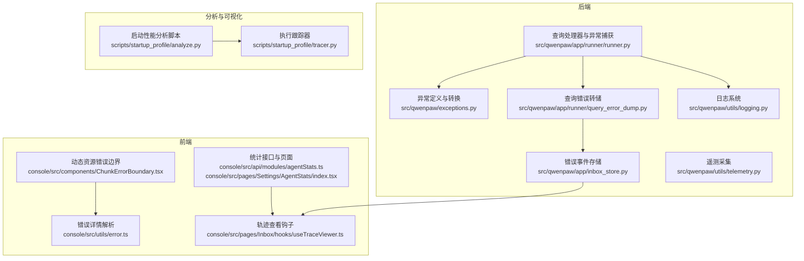
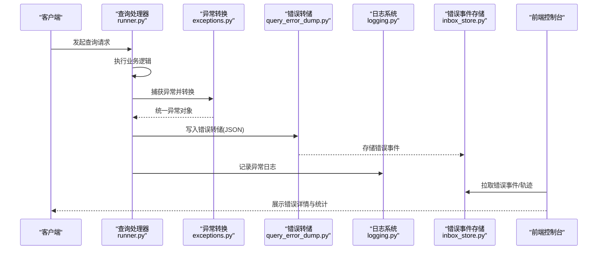
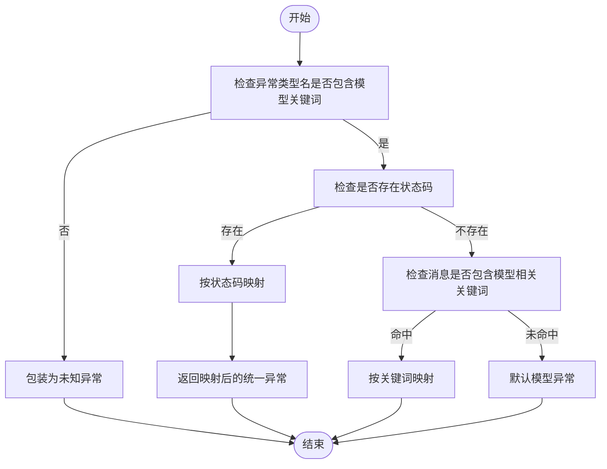
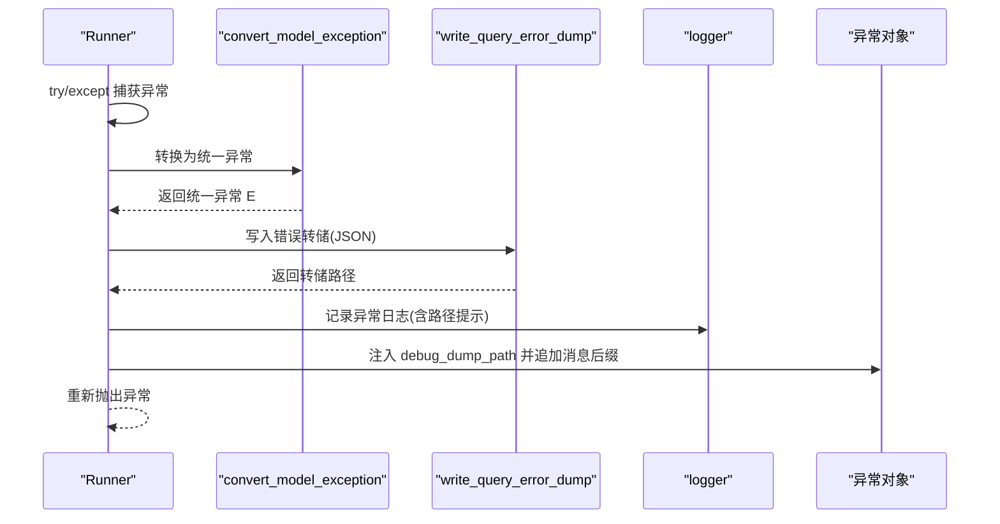
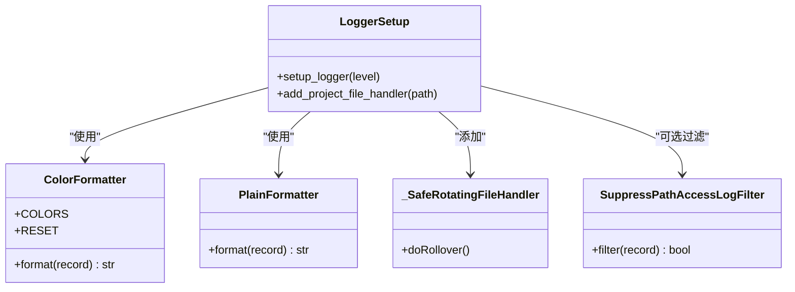
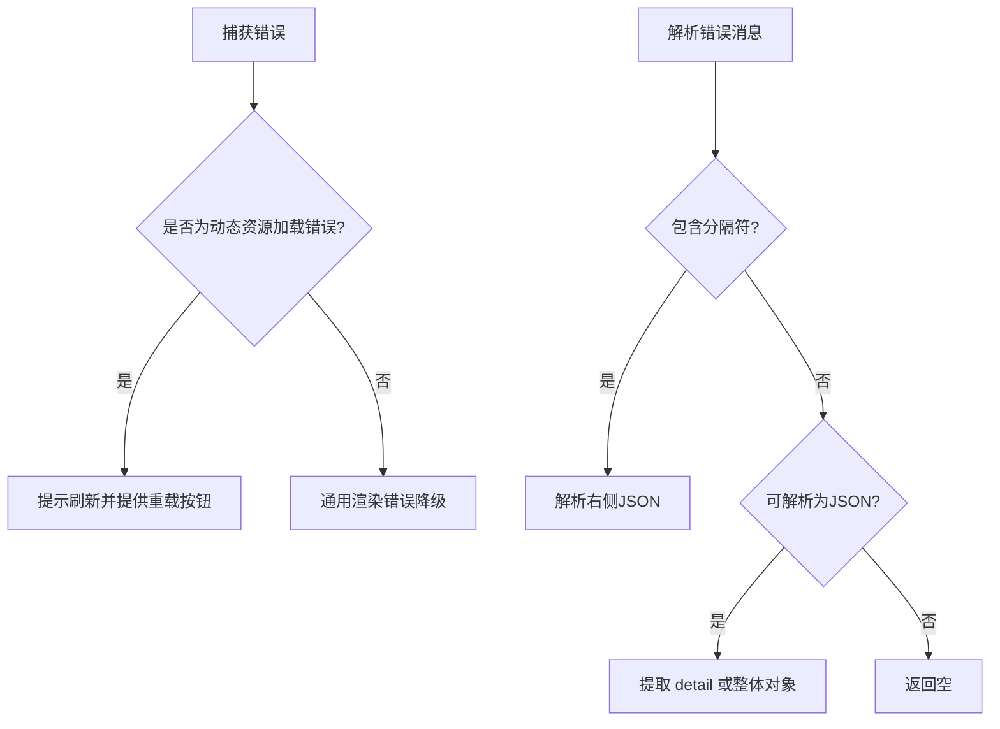
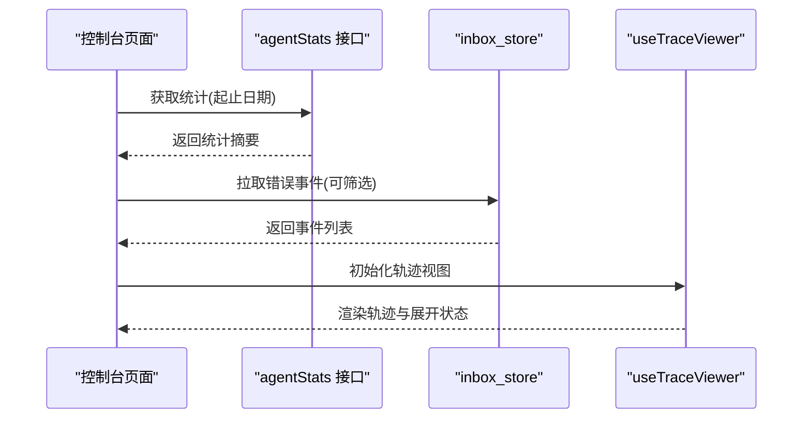
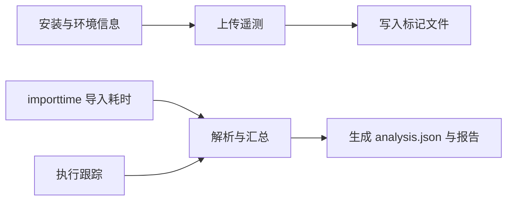
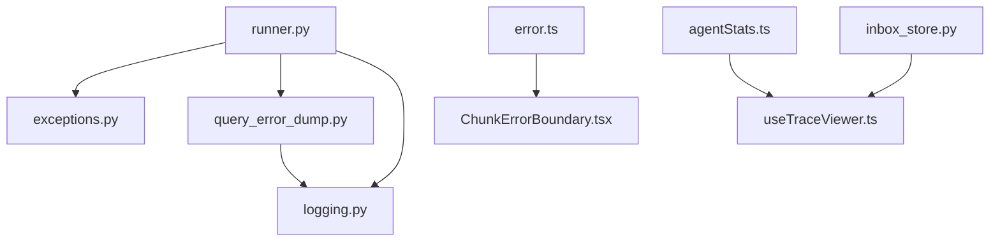

# 错误追踪

<cite>
**本文引用的文件**   
- [src/qwenpaw/exceptions.py](file://src/qwenpaw/exceptions.py)
- [src/qwenpaw/app/runner/runner.py](file://src/qwenpaw/app/runner/runner.py)
- [src/qwenpaw/app/runner/query_error_dump.py](file://src/qwenpaw/app/runner/query_error_dump.py)
- [src/qwenpaw/utils/logging.py](file://src/qwenpaw/utils/logging.py)
- [console/src/utils/error.ts](file://console/src/utils/error.ts)
- [console/src/components/ChunkErrorBoundary.tsx](file://console/src/components/ChunkErrorBoundary.tsx)
- [console/src/pages/Inbox/hooks/useTraceViewer.ts](file://console/src/pages/Inbox/hooks/useTraceViewer.ts)
- [console/src/api/modules/agentStats.ts](file://console/src/api/modules/agentStats.ts)
- [console/src/pages/Settings/AgentStats/index.tsx](file://console/src/pages/Settings/AgentStats/index.tsx)
- [src/qwenpaw/app/inbox_store.py](file://src/qwenpaw/app/inbox_store.py)
- [src/qwenpaw/utils/telemetry.py](file://src/qwenpaw/utils/telemetry.py)
- [scripts/startup_profile/analyze.py](file://scripts/startup_profile/analyze.py)
- [scripts/startup_profile/tracer.py](file://scripts/startup_profile/tracer.py)
- [tests/unit/utils/test_logging.py](file://tests/unit/utils/test_logging.py)
</cite>

## 目录
1. [简介](#简介)
2. [项目结构](#项目结构)
3. [核心组件](#核心组件)
4. [架构总览](#架构总览)
5. [详细组件分析](#详细组件分析)
6. [依赖分析](#依赖分析)
7. [性能考量](#性能考量)
8. [故障排查指南](#故障排查指南)
9. [结论](#结论)
10. [附录](#附录)

## 简介
本技术文档围绕 QwenPaw 的错误追踪体系，系统性阐述异常处理机制、错误日志记录、错误堆栈跟踪、查询错误转储、错误上下文保存与调试信息收集，并提供错误监控配置、告警规则设置与故障根因分析的实践指南。同时覆盖错误报告生成、统计分析与修复建议的技术实现思路，帮助开发者快速定位问题、优化系统稳定性。

## 项目结构
QwenPaw 的错误追踪涉及后端 Python 运行器、异常定义与转换、日志系统、前端错误边界与错误解析工具，以及与控制台交互的错误展示与统计模块。下图给出与错误追踪相关的关键模块关系：

**图表来源**
- [src/qwenpaw/app/runner/runner.py:780-866](file://src/qwenpaw/app/runner/runner.py#L780-L866)
- [src/qwenpaw/app/runner/query_error_dump.py:1-105](file://src/qwenpaw/app/runner/query_error_dump.py#L1-L105)
- [src/qwenpaw/exceptions.py:1-254](file://src/qwenpaw/exceptions.py#L1-L254)
- [src/qwenpaw/utils/logging.py:1-226](file://src/qwenpaw/utils/logging.py#L1-L226)
- [console/src/utils/error.ts:1-25](file://console/src/utils/error.ts#L1-L25)
- [console/src/components/ChunkErrorBoundary.tsx:1-85](file://console/src/components/ChunkErrorBoundary.tsx#L1-L85)
- [console/src/pages/Inbox/hooks/useTraceViewer.ts:30-54](file://console/src/pages/Inbox/hooks/useTraceViewer.ts#L30-L54)
- [console/src/api/modules/agentStats.ts:1-16](file://console/src/api/modules/agentStats.ts#L1-L16)
- [console/src/pages/Settings/AgentStats/index.tsx:95-141](file://console/src/pages/Settings/AgentStats/index.tsx#L95-L141)
- [src/qwenpaw/app/inbox_store.py:70-122](file://src/qwenpaw/app/inbox_store.py#L70-L122)
- [scripts/startup_profile/analyze.py:1-323](file://scripts/startup_profile/analyze.py#L1-L323)
- [scripts/startup_profile/tracer.py:82-108](file://scripts/startup_profile/tracer.py#L82-L108)

**章节来源**
- [src/qwenpaw/app/runner/runner.py:780-866](file://src/qwenpaw/app/runner/runner.py#L780-L866)
- [src/qwenpaw/app/runner/query_error_dump.py:1-105](file://src/qwenpaw/app/runner/query_error_dump.py#L1-L105)
- [src/qwenpaw/exceptions.py:1-254](file://src/qwenpaw/exceptions.py#L1-L254)
- [src/qwenpaw/utils/logging.py:1-226](file://src/qwenpaw/utils/logging.py#L1-L226)
- [console/src/utils/error.ts:1-25](file://console/src/utils/error.ts#L1-L25)
- [console/src/components/ChunkErrorBoundary.tsx:1-85](file://console/src/components/ChunkErrorBoundary.tsx#L1-L85)
- [console/src/pages/Inbox/hooks/useTraceViewer.ts:30-54](file://console/src/pages/Inbox/hooks/useTraceViewer.ts#L30-L54)
- [console/src/api/modules/agentStats.ts:1-16](file://console/src/api/modules/agentStats.ts#L1-L16)
- [console/src/pages/Settings/AgentStats/index.tsx:95-141](file://console/src/pages/Settings/AgentStats/index.tsx#L95-L141)
- [src/qwenpaw/app/inbox_store.py:70-122](file://src/qwenpaw/app/inbox_store.py#L70-L122)
- [scripts/startup_profile/analyze.py:1-323](file://scripts/startup_profile/analyze.py#L1-L323)
- [scripts/startup_profile/tracer.py:82-108](file://scripts/startup_profile/tracer.py#L82-L108)

## 核心组件
- 异常定义与转换：提供业务异常类型与模型相关异常的统一转换逻辑，便于上层捕获与展示。
- 查询处理器异常捕获：在关键处理流程中捕获异常，进行模型异常转换、错误转储与日志记录。
- 查询错误转储：将请求上下文、异常堆栈、代理状态等写入临时 JSON 文件，便于离线分析。
- 日志系统：统一着色输出、文件轮转、访问日志过滤与命名空间隔离，保证可观测性。
- 前端错误边界与错误解析：对动态资源加载失败与通用渲染错误进行区分处理；解析后端返回的结构化错误细节。
- 控制台错误展示与统计：提供错误事件列表、轨迹查看、统计接口与页面，支持按时间范围筛选与标记已读。
- 遥测与启动性能分析：采集安装与环境信息，结合导入耗时与执行跟踪分析，辅助根因定位。

**章节来源**
- [src/qwenpaw/exceptions.py:1-254](file://src/qwenpaw/exceptions.py#L1-L254)
- [src/qwenpaw/app/runner/runner.py:780-866](file://src/qwenpaw/app/runner/runner.py#L780-L866)
- [src/qwenpaw/app/runner/query_error_dump.py:1-105](file://src/qwenpaw/app/runner/query_error_dump.py#L1-L105)
- [src/qwenpaw/utils/logging.py:1-226](file://src/qwenpaw/utils/logging.py#L1-L226)
- [console/src/utils/error.ts:1-25](file://console/src/utils/error.ts#L1-L25)
- [console/src/components/ChunkErrorBoundary.tsx:1-85](file://console/src/components/ChunkErrorBoundary.tsx#L1-L85)
- [console/src/pages/Inbox/hooks/useTraceViewer.ts:30-54](file://console/src/pages/Inbox/hooks/useTraceViewer.ts#L30-L54)
- [console/src/api/modules/agentStats.ts:1-16](file://console/src/api/modules/agentStats.ts#L1-L16)
- [console/src/pages/Settings/AgentStats/index.tsx:95-141](file://console/src/pages/Settings/AgentStats/index.tsx#L95-L141)
- [src/qwenpaw/app/inbox_store.py:70-122](file://src/qwenpaw/app/inbox_store.py#L70-L122)
- [src/qwenpaw/utils/telemetry.py:1-305](file://src/qwenpaw/utils/telemetry.py#L1-L305)
- [scripts/startup_profile/analyze.py:1-323](file://scripts/startup_profile/analyze.py#L1-L323)
- [scripts/startup_profile/tracer.py:82-108](file://scripts/startup_profile/tracer.py#L82-L108)

## 架构总览
下图展示从查询处理到错误转储与前端展示的完整链路：

**图表来源**
- [src/qwenpaw/app/runner/runner.py:780-866](file://src/qwenpaw/app/runner/runner.py#L780-L866)
- [src/qwenpaw/exceptions.py:165-254](file://src/qwenpaw/exceptions.py#L165-L254)
- [src/qwenpaw/app/runner/query_error_dump.py:48-104](file://src/qwenpaw/app/runner/query_error_dump.py#L48-L104)
- [src/qwenpaw/utils/logging.py:154-226](file://src/qwenpaw/utils/logging.py#L154-L226)
- [src/qwenpaw/app/inbox_store.py:70-122](file://src/qwenpaw/app/inbox_store.py#L70-L122)
- [console/src/pages/Inbox/hooks/useTraceViewer.ts:30-54](file://console/src/pages/Inbox/hooks/useTraceViewer.ts#L30-L54)

## 详细组件分析

### 异常定义与转换
- 业务异常类型：提供 ProviderError、ModelFormatterError、SystemCommandException、ChannelError、AgentStateError、SkillsError 等，便于语义化区分与处理。
- 模型异常转换：根据异常类型名、状态码与消息关键字，将第三方模型异常映射为统一的运行时异常（如 Unauthorized、QuotaExceeded、Timeout、ContextLengthExceeded、Execution 等），并保留原始异常信息，便于后续诊断。

**图表来源**
- [src/qwenpaw/exceptions.py:107-254](file://src/qwenpaw/exceptions.py#L107-L254)

**章节来源**
- [src/qwenpaw/exceptions.py:1-254](file://src/qwenpaw/exceptions.py#L1-L254)

### 查询处理器异常捕获与错误转储
- 捕获策略：在查询处理主流程中捕获任意异常，优先尝试转换为模型相关异常；随后触发错误转储，记录请求上下文、异常堆栈、代理状态与时间戳。
- 转储内容：包含请求信息（会话、用户、渠道）、完整请求体、异常类型与消息、堆栈字符串、代理状态序列化结果与 UTC 时间。
- 上下文增强：将转储文件路径附加到异常对象，便于前端或运维直接定位与下载。

**图表来源**
- [src/qwenpaw/app/runner/runner.py:794-827](file://src/qwenpaw/app/runner/runner.py#L794-L827)
- [src/qwenpaw/app/runner/query_error_dump.py:48-104](file://src/qwenpaw/app/runner/query_error_dump.py#L48-L104)
- [src/qwenpaw/exceptions.py:165-254](file://src/qwenpaw/exceptions.py#L165-L254)

**章节来源**
- [src/qwenpaw/app/runner/runner.py:780-866](file://src/qwenpaw/app/runner/runner.py#L780-L866)
- [src/qwenpaw/app/runner/query_error_dump.py:1-105](file://src/qwenpaw/app/runner/query_error_dump.py#L1-L105)

### 日志系统与格式化
- 彩色输出：基于级别使用不同颜色，终端检测关闭彩色；路径相对化显示，便于阅读。
- 文件轮转：安全轮转处理器容忍 Windows 文件锁导致的权限错误，避免日志中断。
- 访问日志过滤：可按路径子串抑制特定访问日志，降低噪声。
- 命名空间隔离：仅输出项目命名空间下的日志，避免第三方库干扰。

**图表来源**
- [src/qwenpaw/utils/logging.py:55-226](file://src/qwenpaw/utils/logging.py#L55-L226)

**章节来源**
- [src/qwenpaw/utils/logging.py:1-226](file://src/qwenpaw/utils/logging.py#L1-L226)
- [tests/unit/utils/test_logging.py:47-155](file://tests/unit/utils/test_logging.py#L47-L155)

### 前端错误边界与错误解析
- 动态资源错误边界：识别“加载 chunk 失败”等场景，提供重载入口；其他渲染错误降级为通用错误页，保持应用可用。
- 错误详情解析：解析后端返回的结构化错误消息（支持“ - ”分隔与纯 JSON），提取 detail 或整体对象，提升用户可读性与可操作性。

**图表来源**
- [console/src/components/ChunkErrorBoundary.tsx:17-57](file://console/src/components/ChunkErrorBoundary.tsx#L17-L57)
- [console/src/utils/error.ts:1-25](file://console/src/utils/error.ts#L1-L25)

**章节来源**
- [console/src/components/ChunkErrorBoundary.tsx:1-85](file://console/src/components/ChunkErrorBoundary.tsx#L1-L85)
- [console/src/utils/error.ts:1-25](file://console/src/utils/error.ts#L1-L25)

### 控制台错误展示与统计
- 错误事件列表：支持按来源类型、状态、代理 ID、未读状态筛选，分页拉取。
- 轨迹查看：将后端事件转换为前端展示项，支持展开/折叠与滚动定位。
- 统计接口与页面：按日期范围拉取代理统计数据，失败时提示并记录错误。

**图表来源**
- [console/src/api/modules/agentStats.ts:1-16](file://console/src/api/modules/agentStats.ts#L1-L16)
- [console/src/pages/Settings/AgentStats/index.tsx:95-141](file://console/src/pages/Settings/AgentStats/index.tsx#L95-L141)
- [src/qwenpaw/app/inbox_store.py:70-122](file://src/qwenpaw/app/inbox_store.py#L70-L122)
- [console/src/pages/Inbox/hooks/useTraceViewer.ts:30-54](file://console/src/pages/Inbox/hooks/useTraceViewer.ts#L30-L54)

**章节来源**
- [console/src/api/modules/agentStats.ts:1-16](file://console/src/api/modules/agentStats.ts#L1-L16)
- [console/src/pages/Settings/AgentStats/index.tsx:95-141](file://console/src/pages/Settings/AgentStats/index.tsx#L95-L141)
- [src/qwenpaw/app/inbox_store.py:70-122](file://src/qwenpaw/app/inbox_store.py#L70-L122)
- [console/src/pages/Inbox/hooks/useTraceViewer.ts:30-54](file://console/src/pages/Inbox/hooks/useTraceViewer.ts#L30-L54)

### 遥测与启动性能分析
- 遥测采集：收集安装方式、系统信息、Python 版本、架构与 GPU 检测结果，上传至遥测服务并写入标记文件，避免重复采集。
- 启动性能分析：通过 importtime 收集导入耗时，通过 tracer.py 收集函数执行轨迹，生成可视化报告，辅助定位启动慢点。

**图表来源**
- [src/qwenpaw/utils/telemetry.py:1-305](file://src/qwenpaw/utils/telemetry.py#L1-L305)
- [scripts/startup_profile/analyze.py:1-323](file://scripts/startup_profile/analyze.py#L1-L323)
- [scripts/startup_profile/tracer.py:82-108](file://scripts/startup_profile/tracer.py#L82-L108)

**章节来源**
- [src/qwenpaw/utils/telemetry.py:1-305](file://src/qwenpaw/utils/telemetry.py#L1-L305)
- [scripts/startup_profile/analyze.py:1-323](file://scripts/startup_profile/analyze.py#L1-L323)
- [scripts/startup_profile/tracer.py:82-108](file://scripts/startup_profile/tracer.py#L82-L108)

## 依赖分析
- 组件耦合：查询处理器依赖异常转换模块与错误转储模块；错误转储依赖通道默认值与时间工具；日志系统独立但被查询处理器与转储模块共同使用。
- 外部依赖：日志轮转处理器兼容 Windows 文件锁；遥测上传采用短超时；前端错误边界依赖 React 与 Ant Design 组件。
- 可能的循环依赖：当前文件间未见循环导入；命名空间隔离减少跨模块耦合。

**图表来源**
- [src/qwenpaw/app/runner/runner.py:780-866](file://src/qwenpaw/app/runner/runner.py#L780-L866)
- [src/qwenpaw/app/runner/query_error_dump.py:1-105](file://src/qwenpaw/app/runner/query_error_dump.py#L1-L105)
- [src/qwenpaw/exceptions.py:1-254](file://src/qwenpaw/exceptions.py#L1-L254)
- [src/qwenpaw/utils/logging.py:1-226](file://src/qwenpaw/utils/logging.py#L1-L226)
- [console/src/utils/error.ts:1-25](file://console/src/utils/error.ts#L1-L25)
- [console/src/components/ChunkErrorBoundary.tsx:1-85](file://console/src/components/ChunkErrorBoundary.tsx#L1-L85)
- [console/src/api/modules/agentStats.ts:1-16](file://console/src/api/modules/agentStats.ts#L1-L16)
- [console/src/pages/Inbox/hooks/useTraceViewer.ts:30-54](file://console/src/pages/Inbox/hooks/useTraceViewer.ts#L30-L54)
- [src/qwenpaw/app/inbox_store.py:70-122](file://src/qwenpaw/app/inbox_store.py#L70-L122)

**章节来源**
- [src/qwenpaw/app/runner/runner.py:780-866](file://src/qwenpaw/app/runner/runner.py#L780-L866)
- [src/qwenpaw/app/runner/query_error_dump.py:1-105](file://src/qwenpaw/app/runner/query_error_dump.py#L1-L105)
- [src/qwenpaw/exceptions.py:1-254](file://src/qwenpaw/exceptions.py#L1-L254)
- [src/qwenpaw/utils/logging.py:1-226](file://src/qwenpaw/utils/logging.py#L1-L226)
- [console/src/utils/error.ts:1-25](file://console/src/utils/error.ts#L1-L25)
- [console/src/components/ChunkErrorBoundary.tsx:1-85](file://console/src/components/ChunkErrorBoundary.tsx#L1-L85)
- [console/src/api/modules/agentStats.ts:1-16](file://console/src/api/modules/agentStats.ts#L1-L16)
- [console/src/pages/Inbox/hooks/useTraceViewer.ts:30-54](file://console/src/pages/Inbox/hooks/useTraceViewer.ts#L30-L54)
- [src/qwenpaw/app/inbox_store.py:70-122](file://src/qwenpaw/app/inbox_store.py#L70-L122)

## 性能考量
- 日志输出：彩色与路径相对化在终端环境下提升可读性；文件轮转避免单文件过大；访问日志过滤减少噪声。
- 错误转储：异步保存会话状态与转储文件写入均在异常路径中执行，注意磁盘 IO 与临时目录权限；建议在高并发场景下评估转储频率与清理策略。
- 前端错误边界：仅对动态资源加载错误进行特殊处理，避免对通用渲染错误过度分支；错误详情解析尽量早失败并回退。
- 启动性能分析：importtime 与执行跟踪会引入额外开销，建议在 CI 或本地开发环境使用，生产不启用。

[本节为通用指导，无需具体文件分析]

## 故障排查指南
- 定位异常来源：查看日志中的级别、文件与行号前缀，结合异常类型与消息关键字快速判断。
- 解析后端错误详情：若后端返回结构化错误消息，使用前端解析工具提取 detail 字段，便于用户理解。
- 下载并分析错误转储：异常对象注入的转储路径可用于离线分析，重点关注请求上下文、代理状态与堆栈字符串。
- 查看错误事件与轨迹：在控制台中按条件筛选错误事件，使用轨迹查看器定位关键步骤。
- 启动慢点分析：运行启动性能分析脚本，查看导入耗时与函数执行轨迹，识别瓶颈模块。
- 遥测与版本：确认遥测标记文件与版本一致性，避免重复提示；必要时手动清理以重新触发。

**章节来源**
- [src/qwenpaw/utils/logging.py:55-226](file://src/qwenpaw/utils/logging.py#L55-L226)
- [console/src/utils/error.ts:1-25](file://console/src/utils/error.ts#L1-L25)
- [src/qwenpaw/app/runner/runner.py:801-827](file://src/qwenpaw/app/runner/runner.py#L801-L827)
- [console/src/pages/Inbox/hooks/useTraceViewer.ts:30-54](file://console/src/pages/Inbox/hooks/useTraceViewer.ts#L30-L54)
- [scripts/startup_profile/analyze.py:180-323](file://scripts/startup_profile/analyze.py#L180-L323)
- [src/qwenpaw/utils/telemetry.py:188-305](file://src/qwenpaw/utils/telemetry.py#L188-L305)

## 结论
QwenPaw 的错误追踪体系通过“异常定义与转换—查询处理器捕获—错误转储—日志记录—前端展示”的闭环，实现了从底层到上层的全链路可观测性。配合错误事件存储、轨迹查看与统计接口，能够有效支撑故障定位与修复建议生成。建议在生产环境中结合日志级别、访问日志过滤与转储清理策略，持续优化性能与稳定性。

[本节为总结，无需具体文件分析]

## 附录
- 错误监控配置建议
  - 日志级别：生产环境建议 INFO 或 WARNING，开发环境 DEBUG；结合命名空间隔离减少噪音。
  - 文件轮转：启用安全轮转处理器，设置合理大小与备份数量；Windows 场景容忍权限错误。
  - 访问日志过滤：针对健康检查等高频路径进行抑制，降低吞吐压力。
- 告警规则设置
  - 异常速率阈值：单位时间内异常数量超过阈值触发告警。
  - 关键异常类型：模型未授权、配额超限、超时与上下文过长等需高优告警。
  - 转储路径可用性：监控转储文件写入成功率与磁盘空间。
- 故障根因分析
  - 使用启动性能分析脚本定位导入与执行热点；结合错误转储中的代理状态与请求上下文，复现问题场景。
  - 利用轨迹查看器与错误事件列表，梳理用户路径与系统调用链，缩小影响范围。
- 错误报告与统计
  - 报告生成：将错误转储与日志聚合，导出结构化报告供团队评审。
  - 统计分析：按异常类型、渠道、代理维度统计趋势，识别回归与热点问题。
  - 修复建议：结合转储中的请求参数与代理状态，提出针对性修复方案与回归测试清单。

[本节为通用指导，无需具体文件分析]